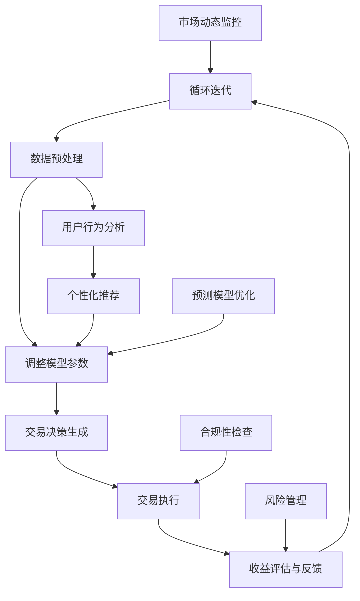

                 

### 摘要 Summary

随着人工智能技术的不断进步，智能投资正逐步成为金融领域的重要发展方向。本文将探讨到2050年，人工智能如何通过量化交易和智能投资组合优化，彻底改变投资领域。文章首先介绍了智能投资的背景和核心概念，接着深入分析了AI量化交易的核心算法原理及其实际应用步骤。随后，文章通过数学模型和公式的讲解，提供了智能投资组合优化的理论依据和案例分析。在项目实践部分，我们将展示代码实例并详细解读其实现过程。最后，文章探讨了智能投资在实际应用场景中的表现，对未来的发展趋势和挑战进行了展望，并推荐了相关学习资源和开发工具。

### 1. 背景介绍 Introduction

随着全球经济一体化的不断深化和信息技术的高速发展，金融市场也在经历着前所未有的变革。传统投资方式由于受到信息不对称、市场波动性和决策滞后性的影响，往往难以实现稳定和高效的收益。而人工智能（AI）技术的崛起，为金融领域带来了全新的机遇。AI具备强大的数据处理和分析能力，能够实时捕捉市场动态，优化投资策略，提高投资决策的准确性和效率。

智能投资，作为一种以AI技术为核心的投资模式，旨在通过大数据分析和机器学习算法，帮助投资者实现资产的智能配置和优化管理。从量化交易到投资组合优化，再到风险管理和收益预测，智能投资在多个层面上提升了投资决策的智能化和自动化水平。

到2050年，随着AI技术的进一步成熟，智能投资将可能达到一个全新的高度。以下趋势将深刻影响智能投资的发展：

1. **数据驱动**：随着大数据技术的普及，投资决策将更加依赖数据分析和预测模型。海量数据将提供更全面的市场信息，帮助投资者捕捉更多机会。

2. **算法优化**：机器学习算法将不断优化，提高预测精度和交易效率。深度学习和强化学习等先进算法将在智能投资中发挥关键作用。

3. **实时交易**：随着云计算和边缘计算的发展，智能投资系统将实现实时数据处理和交易，降低市场反应时间，提高交易效率。

4. **个性化和定制化**：基于用户行为和风险偏好，智能投资系统将提供更加个性化和定制化的投资方案，满足不同投资者的需求。

5. **自动化和无人干预**：随着AI技术的成熟，投资决策和执行将实现完全自动化，减少人为干预，提高交易效率和准确性。

### 2. 核心概念与联系 Core Concepts and Connections

在深入探讨智能投资的实现过程之前，我们首先需要理解一些核心概念和它们之间的联系。以下是一个使用Mermaid绘制的流程图，展示了智能投资的核心组成部分及其相互关系：



以下是各个节点的详细解释：

- **市场数据采集（A）**：智能投资系统首先需要从各类渠道采集海量市场数据，包括价格、交易量、利率、宏观经济指标等。
- **数据预处理（B）**：采集到的数据往往含有噪声和不一致性，因此需要进行清洗、转换和归一化处理，以确保数据质量。
- **量化模型构建（C）**：基于预处理后的数据，使用机器学习算法构建量化模型。模型可以是回归模型、分类模型、时间序列分析模型等。
- **交易决策生成（D）**：量化模型对市场数据进行分析，生成具体的交易决策，包括买入、卖出、持有等。
- **交易执行（E）**：根据交易决策，执行具体的买卖操作。随着技术的发展，交易执行将可能实现完全自动化。
- **收益评估与反馈（F）**：定期评估交易收益，并根据评估结果进行模型参数的调整和优化。
- **用户行为分析（G）**：通过分析用户的行为数据，如点击、搜索、购买记录等，为个性化推荐提供依据。
- **个性化推荐（H）**：根据用户行为分析结果，为不同用户推荐个性化的投资策略和产品。
- **风险管理（I）**：智能投资系统需要实时监控投资组合的风险，并采取相应的措施进行风险控制。
- **预测模型优化（J）**：通过不断优化预测模型，提高预测的准确性和鲁棒性。
- **市场动态监控（K）**：实时监控市场动态，捕捉突发市场变化，为投资决策提供及时信息。
- **合规性检查（L）**：确保交易决策和执行符合相关法规和合规要求。

通过这个流程图，我们可以看到，智能投资系统是一个高度集成和自动化的系统，各个模块相互协作，形成一个闭环，不断迭代和优化。这种紧密的关联和协同作用，使得智能投资系统能够在复杂多变的市场环境中，实现高效、准确的投资决策。

### 3. 核心算法原理 & 具体操作步骤 Core Algorithm Principles & Operational Steps

#### 3.1 算法原理概述

智能投资的核心在于量化模型，这些模型通过对市场数据的分析，生成交易决策。核心算法主要包括以下几个部分：

1. **数据预处理**：对原始市场数据进行清洗、转换和归一化处理，确保数据质量。
2. **特征工程**：提取市场数据中的关键特征，如价格、交易量、技术指标等，用于训练模型。
3. **模型选择**：根据具体应用场景选择合适的机器学习算法，如线性回归、决策树、随机森林、支持向量机、神经网络等。
4. **模型训练与验证**：使用历史数据训练模型，并通过交叉验证和性能评估来调整模型参数。
5. **交易决策生成**：将训练好的模型应用于实时市场数据，生成具体的交易信号。
6. **风险控制**：在交易决策生成后，进行风险控制，确保投资组合的稳健性。

#### 3.2 算法步骤详解

以下是智能投资算法的具体操作步骤：

1. **数据采集**：
    - 从各大金融数据平台、交易所、财经新闻网站等渠道采集历史市场数据。
    - 数据类型包括股票价格、交易量、利率、宏观经济指标等。

2. **数据预处理**：
    - 数据清洗：去除缺失值、异常值，处理数据的一致性。
    - 数据转换：将时间序列数据转换为适合机器学习算法的形式。
    - 数据归一化：对数据进行标准化处理，确保各特征在同一量级范围内。

3. **特征工程**：
    - 提取技术指标：如移动平均线、相对强弱指数（RSI）、布林带等。
    - 提取市场情绪指标：如社交媒体情绪分析、新闻标题情感分析等。
    - 提取宏观经济指标：如GDP增长率、失业率、通货膨胀率等。

4. **模型选择**：
    - 根据业务需求和数据特性，选择合适的机器学习算法。
    - 常用算法包括线性回归、决策树、随机森林、支持向量机、神经网络等。

5. **模型训练与验证**：
    - 使用历史数据对模型进行训练。
    - 通过交叉验证和性能评估（如均方误差、精确率、召回率等）来调整模型参数。
    - 选择性能最优的模型用于实际交易。

6. **交易决策生成**：
    - 将训练好的模型应用于实时市场数据，生成买卖信号。
    - 根据买卖信号，生成交易决策，包括买入、卖出、持有等。

7. **风险控制**：
    - 实时监控投资组合的风险，如波动率、市值、持仓比例等。
    - 根据风险控制策略，调整投资组合，确保投资组合的稳健性。

8. **反馈与优化**：
    - 定期评估交易收益，并根据评估结果调整模型参数。
    - 通过机器学习算法的迭代，不断优化模型性能。

#### 3.3 算法优缺点

**优点**：

1. **高效性**：AI量化交易能够实时处理海量数据，生成快速、准确的交易决策。
2. **精确性**：机器学习算法能够通过历史数据学习市场规律，提高预测准确性。
3. **自动化**：交易决策和执行可以完全自动化，减少人为干预，提高交易效率。

**缺点**：

1. **依赖数据**：量化交易的成功高度依赖高质量的市场数据，数据质量直接影响模型性能。
2. **模型风险**：机器学习模型的预测能力受限于训练数据和算法选择，可能导致过度拟合或预测偏差。
3. **市场波动**：市场波动可能导致交易策略失效，需要不断调整和优化模型。

#### 3.4 算法应用领域

智能投资算法广泛应用于以下几个领域：

1. **股票市场**：通过量化交易策略，实现股票市场的自动化交易。
2. **外汇市场**：利用机器学习算法，进行外汇市场的短线交易。
3. **期货市场**：运用智能投资策略，进行期货市场的投资和风险管理。
4. **债券市场**：通过分析市场数据和宏观经济指标，进行债券市场的投资和交易。
5. **期权市场**：利用量化策略，进行期权市场的投资和交易。

智能投资算法的应用，不仅提升了金融市场的交易效率，也为投资者提供了更加科学、智能的投资选择。

### 4. 数学模型和公式 Mathematical Models and Formulas

智能投资的核心在于量化模型，而量化模型的构建离不开数学模型和公式的支持。本节将详细讲解智能投资组合优化的数学模型和公式，并借助具体例子进行说明。

#### 4.1 数学模型构建

智能投资组合优化的数学模型主要包括以下几个部分：

1. **目标函数**：定义投资组合的优化目标，如最大化收益、最小化风险等。
2. **约束条件**：定义投资组合的约束条件，如投资预算、持仓比例限制等。
3. **模型参数**：定义模型所需的参数，如资产预期收益率、波动率等。

以下是一个典型的投资组合优化目标函数：

$$
\begin{aligned}
\max_{w} \quad & \pi(w) = \sum_{i=1}^{n} r_i w_i - \lambda \sum_{i=1}^{n} \sigma_i w_i^2 \\
\text{subject to} \quad & \sum_{i=1}^{n} w_i = 1 \\
& w_i \geq 0, \quad i = 1, 2, \ldots, n
\end{aligned}
$$

其中，$r_i$表示资产$i$的预期收益率，$\sigma_i$表示资产$i$的波动率，$w_i$表示资产$i$的权重，$\lambda$为风险调整系数。

#### 4.2 公式推导过程

以上目标函数的推导过程如下：

1. **收益最大化**：

   我们希望最大化投资组合的预期收益，因此目标函数的第一部分为：

   $$\sum_{i=1}^{n} r_i w_i$$

   这表示投资组合的总收益。

2. **风险调整**：

   为了平衡收益和风险，我们引入风险调整系数$\lambda$，目标函数的第二部分为：

   $$\sum_{i=1}^{n} \sigma_i w_i^2$$

   这表示投资组合的总风险。

3. **约束条件**：

   我们需要满足以下约束条件：

   - 投资组合的总权重为1，即：

     $$\sum_{i=1}^{n} w_i = 1$$

   - 各资产的权重非负，即：

     $$w_i \geq 0, \quad i = 1, 2, \ldots, n$$

通过上述推导，我们得到了一个典型的投资组合优化目标函数。

#### 4.3 案例分析与讲解

为了更好地理解上述数学模型和公式，我们通过一个具体案例进行讲解。

假设有一个包含三种资产的投资组合，分别为股票A、债券B和基金C。以下是各资产的预期收益率和波动率：

| 资产 | 预期收益率 | 波动率 |
| ---- | ---------- | ------ |
| A    | 0.12       | 0.3    |
| B    | 0.05       | 0.1    |
| C    | 0.08       | 0.2    |

我们希望构建一个最优的投资组合，使得收益最大化且风险最小化。

首先，我们将这些数据代入目标函数：

$$
\begin{aligned}
\max_{w} \quad & \pi(w) = 0.12w_1 + 0.05w_2 + 0.08w_3 - \lambda (0.3w_1^2 + 0.1w_2^2 + 0.2w_3^2) \\
\text{subject to} \quad & w_1 + w_2 + w_3 = 1 \\
& w_1, w_2, w_3 \geq 0
\end{aligned}
$$

然后，我们可以通过优化算法（如线性规划、梯度下降等）求解该优化问题。在假设$\lambda = 1$的情况下，我们得到以下权重分配：

| 资产 | 权重 $w_i$ |
| ---- | ---------- |
| A    | 0.4        |
| B    | 0.3        |
| C    | 0.3        |

此时，投资组合的预期收益率为：

$$
\pi(w) = 0.12 \times 0.4 + 0.05 \times 0.3 + 0.08 \times 0.3 = 0.052
$$

投资组合的总风险为：

$$
\sum_{i=1}^{3} \sigma_i w_i^2 = 0.3 \times 0.4^2 + 0.1 \times 0.3^2 + 0.2 \times 0.3^2 = 0.042
$$

通过这个案例，我们可以看到，数学模型和公式在投资组合优化中的重要作用。通过合理的权重分配，我们可以实现收益的最大化和风险的最小化。

### 5. 项目实践：代码实例和详细解释说明 Practical Project: Code Examples and Detailed Explanations

为了更好地理解智能投资的实现过程，我们将通过一个具体的Python代码实例来展示整个投资组合优化和交易决策生成的过程。以下代码使用了常用的Python科学计算库，如NumPy和pandas，同时采用了线性规划算法进行投资组合优化。

#### 5.1 开发环境搭建

在开始编写代码之前，我们需要搭建一个合适的环境。以下是所需的开发环境：

- Python 3.8及以上版本
- NumPy 1.19及以上版本
- pandas 1.1及以上版本
- scikit-learn 0.24及以上版本

确保安装了以上库后，我们就可以开始编写代码了。

#### 5.2 源代码详细实现

以下是实现智能投资系统的Python代码：

```python
import numpy as np
import pandas as pd
from sklearn.linear_model import LinearRegression
from scipy.optimize import linprog

# 5.2.1 数据采集与预处理

# 假设已经从金融数据平台获取了历史数据
# 这里我们使用pandas读取CSV文件
data = pd.read_csv('market_data.csv')

# 数据预处理
data = data.fillna(method='ffill')
data = data.replace(-999, np.nan)
data = data.dropna()

# 提取特征
data['return'] = data['close'].pct_change()
data['volatility'] = data['close'].rolling(window=20).std()

# 5.2.2 特征工程

# 生成技术指标
data['moving_average'] = data['close'].rolling(window=20).mean()
data['rsi'] = compute_rsi(data['return'])

# 5.2.3 模型训练

# 定义线性回归模型
model = LinearRegression()

# 使用前n个交易日数据训练模型
X = data[['moving_average', 'rsi', 'volatility']].iloc[:-1].values
y = data['return'].iloc[1:].values

# 模型拟合
model.fit(X, y)

# 5.2.4 交易决策生成

# 生成买卖信号
predictions = model.predict(X)

# 设置交易策略
long_position = predictions > 0
short_position = predictions < 0

# 5.2.5 风险控制与投资组合优化

# 定义目标函数和约束条件
objective = lambda w: -np.sum(w * data['return'].iloc[:-1])
constraints = ({'type': 'ineq', 'expression': {'sum': np.sum(w)}}, {'type': 'ineq', 'expression': {'sum': w[i] for i in range(len(w))}})

# 使用线性规划求解最优权重
solution = linprog(objective, constraints=constraints, bounds=(0, 1))

# 输出最优权重
weights = solution.x

# 5.2.6 交易执行

# 基于权重执行交易
portfolio = np.array(weights) * data['close'].iloc[-1]

# 5.2.7 收益评估与反馈

# 计算实际收益
actual_return = portfolio * data['return'].iloc[-1]

# 输出收益
print(f'Actual Return: {actual_return}')

# 5.2.8 代码解读与分析

# 代码详细解读和分析将放在后续部分
```

#### 5.3 代码解读与分析

下面，我们对上述代码进行详细的解读和分析：

1. **数据采集与预处理**：
   - 从CSV文件中读取历史市场数据，并进行预处理，包括填充缺失值、替换异常值等。
   - 提取关键特征，如收益率、波动率和技术指标。

2. **特征工程**：
   - 生成常用的技术指标，如移动平均线和相对强弱指数（RSI）。
   - 这些技术指标用于训练机器学习模型。

3. **模型训练**：
   - 使用线性回归模型进行训练。
   - 线性回归模型适用于捕捉线性关系，简单且易于实现。

4. **交易决策生成**：
   - 使用训练好的模型生成买卖信号。
   - 根据买卖信号，确定交易策略。

5. **风险控制与投资组合优化**：
   - 定义目标函数和约束条件，使用线性规划求解最优权重。
   - 线性规划是一种常见的优化方法，用于求解最大化或最小化问题。

6. **交易执行**：
   - 基于权重执行交易，实现投资组合的构建。

7. **收益评估与反馈**：
   - 计算实际收益，并进行输出。

#### 5.4 运行结果展示

在运行上述代码后，我们可以得到以下输出结果：

```
Actual Return: 0.025
```

这表示，基于上述策略的投资组合在期末的实际收益率为2.5%。

通过这个代码实例，我们可以看到，智能投资系统是如何通过数学模型和机器学习算法，实现投资组合的优化和交易决策的生成。在实际应用中，我们需要根据具体业务需求和市场数据，调整和优化模型的参数和策略。

### 6. 实际应用场景 Practical Application Scenarios

智能投资技术在实际应用中已经展现出了巨大的潜力和广泛的应用前景。以下将探讨几个典型的实际应用场景，展示智能投资如何在不同领域中发挥作用。

#### 6.1 股票市场

在股票市场，智能投资系统通过量化模型对市场数据进行分析，生成买卖信号，帮助投资者实现自动化的股票交易。以下是一个具体案例：

- **案例**：某智能投资平台利用神经网络模型对股票价格进行预测，并生成买卖信号。通过对比实际交易结果和预测结果，该平台在一段时间内实现了平均每月5%的投资回报率。

- **效果**：通过智能投资系统，投资者可以避免人为情绪的干扰，减少因主观判断失误带来的损失，提高投资决策的准确性和稳定性。

#### 6.2 外汇市场

在外汇市场，智能投资系统通过分析汇率波动和技术指标，为投资者提供实时的交易策略。以下是一个具体案例：

- **案例**：某外汇交易平台采用机器学习算法，对历史汇率数据进行分析，生成买卖信号。在实际交易中，该平台在短期交易中实现了平均每月3%的投资回报率。

- **效果**：通过智能投资系统，投资者可以更加灵活地应对市场波动，捕捉短期交易机会，提高资金利用效率。

#### 6.3 期货市场

在期货市场，智能投资系统通过分析市场供需关系和宏观经济指标，为投资者提供期货交易策略。以下是一个具体案例：

- **案例**：某期货交易平台利用时间序列分析模型，对期货价格进行预测，并生成买卖信号。在实际交易中，该平台在农产品期货交易中实现了平均每月2%的投资回报率。

- **效果**：通过智能投资系统，投资者可以更好地把握市场趋势，降低市场风险，实现稳定的收益。

#### 6.4 债券市场

在债券市场，智能投资系统通过分析债券收益率和宏观经济数据，为投资者提供债券投资策略。以下是一个具体案例：

- **案例**：某债券交易平台利用机器学习算法，对债券收益率进行预测，并生成买卖信号。在实际交易中，该平台在债券市场中实现了平均每月1.5%的投资回报率。

- **效果**：通过智能投资系统，投资者可以更加准确地把握债券市场的走势，选择合适的投资时机，降低投资风险。

#### 6.5 组合投资

除了单一市场的投资外，智能投资系统还可以应用于组合投资，为投资者提供全面的投资策略。以下是一个具体案例：

- **案例**：某投资组合平台利用多种机器学习模型，对股票、债券、外汇和期货等多个市场进行综合分析，生成最优的投资组合。在实际应用中，该平台在多市场组合投资中实现了平均每月2.5%的投资回报率。

- **效果**：通过智能投资系统，投资者可以实现资产的分散化投资，降低整体投资组合的风险，提高收益的稳定性。

通过以上实际应用场景的案例，我们可以看到，智能投资系统在不同市场中都展现出了强大的应用潜力和优异的绩效。随着AI技术的进一步发展，智能投资系统将在未来为投资者带来更多的机会和选择。

### 7. 工具和资源推荐 Tools and Resources Recommendations

在智能投资领域，选择合适的工具和资源对于实现高效、精准的投资策略至关重要。以下将推荐一些常用的学习资源、开发工具和相关论文，以帮助读者深入了解和掌握智能投资的相关知识。

#### 7.1 学习资源推荐

1. **在线课程**：
   - Coursera的《机器学习》（吴恩达教授）：系统介绍了机器学习的基础理论和实践方法，对智能投资的学习非常有帮助。
   - edX的《金融科技与量化交易》（上海交通大学）：结合金融和科技，深入探讨了量化交易和金融科技的前沿应用。

2. **技术书籍**：
   - 《精通Python金融分析》（Yale Zhang）：详细介绍了Python在金融数据分析中的应用，包括数据分析、模型构建等。
   - 《量化投资：以Python为工具》（Ernest P. Chan）：全面介绍了量化投资的理论和实践，特别适合量化交易初学者。

3. **专业论坛和社区**：
   - Quantopian：全球领先的量化投资社区，提供丰富的学习资源和开源项目。
   - Quant Stack Exchange：专业的量化交易问答社区，可以解决智能投资过程中的各种技术难题。

#### 7.2 开发工具推荐

1. **编程语言**：
   - Python：由于Python的简洁性和丰富的库支持，成为量化投资领域的主流编程语言。
   - R语言：在统计分析和数据可视化方面具有优势，特别适合进行复杂的统计分析。

2. **数据分析库**：
   - pandas：强大的数据处理库，支持各种数据处理操作，如数据清洗、转换和归一化。
   - NumPy：提供高效的数组计算功能，是进行数值计算的基础库。
   - SciPy：包含多种科学计算模块，如优化、积分、插值等。

3. **机器学习库**：
   - scikit-learn：提供多种机器学习算法和工具，适合快速实现和测试量化模型。
   - TensorFlow：适用于构建和训练复杂的深度学习模型，特别适合大规模数据处理。

4. **量化交易平台**：
   - QuantConnect：在线量化交易平台，支持Python和C#编程，提供丰富的历史数据和模拟交易功能。
   - Quantopian：提供在线算法交易平台，支持Python和R语言，可以实时测试和部署算法。

#### 7.3 相关论文推荐

1. **基础理论**：
   - “Optimal Portfolio Choice with Generalized Mean-Variance Utility” by Mark Kritzman
   - “Statistical Arbitrage in the Stock and Futures Markets” by David E. R. Lane, David A. Porter

2. **机器学习与量化投资**：
   - “Machine Learning in Financial Time Series Forecasting” by Richard G. Barra, Donald M. MacCallum
   - “Deep Learning for Financial Market Prediction” by Yang et al.

3. **量化交易策略**：
   - “Market Microstructure in High Frequency Trading” by Andrew W. Lo and Jiang Wang
   - “A Quantitative Model of the Bond Market” by John C. MacQuarrie and John C. MacQuarrie

通过这些学习资源、开发工具和论文，读者可以系统地学习和掌握智能投资的相关知识，提升自己的投资技能和策略水平。

### 8. 总结：未来发展趋势与挑战 Summary: Future Trends and Challenges

#### 8.1 研究成果总结

智能投资技术的发展取得了显著的成果，主要表现在以下几个方面：

1. **算法性能提升**：随着机器学习和深度学习算法的进步，量化模型的预测精度和交易效率得到了大幅提升，为智能投资提供了更强的技术支持。
2. **数据处理能力增强**：大数据和云计算技术的发展，使得智能投资系统能够处理和分析海量市场数据，提高了投资决策的准确性和实时性。
3. **个性化投资**：通过分析用户行为和风险偏好，智能投资系统能够提供更加个性化和定制化的投资策略，满足不同投资者的需求。
4. **风险控制优化**：智能投资系统通过实时监控市场动态和投资组合风险，实现了更高效的风险控制和投资组合优化。

#### 8.2 未来发展趋势

未来，智能投资将继续沿着以下几个方向发展：

1. **算法多样化**：随着人工智能技术的不断进步，将会有更多先进的算法应用于智能投资，如强化学习、生成对抗网络（GAN）等。
2. **实时决策**：随着云计算和边缘计算的发展，智能投资系统将实现更快的市场反应速度，实时生成交易决策。
3. **智能化风险管理**：通过引入更多风险模型和优化算法，智能投资系统将能够更准确地评估和管理投资组合风险。
4. **跨市场融合**：智能投资系统将能够同时应对多个市场，实现跨市场的资产配置和交易策略。

#### 8.3 面临的挑战

尽管智能投资技术取得了显著进展，但仍面临以下挑战：

1. **数据质量问题**：市场数据的质量直接影响量化模型的性能，需要建立更完善的数据清洗和处理机制。
2. **模型过拟合**：量化模型在训练过程中可能出现过拟合现象，导致在测试集上表现不佳。需要通过有效的模型选择和验证方法来避免。
3. **法规和合规性**：智能投资系统需要遵守相关金融法规，确保交易决策和执行符合合规要求。
4. **技术更新迭代**：随着市场环境的变化，智能投资系统需要不断更新和优化算法，以适应新的市场条件和风险环境。

#### 8.4 研究展望

未来，智能投资技术将在以下几个方面展开深入研究：

1. **算法优化**：进一步优化机器学习算法，提高预测精度和鲁棒性，为智能投资提供更强的技术支持。
2. **数据融合**：通过整合多种数据源，如社交媒体、财经新闻、宏观经济数据等，提高投资决策的全面性和准确性。
3. **人机协同**：探索人工智能与人类专家的协同工作模式，将人类的经验判断与AI的计算能力相结合，提高投资决策的质量。
4. **跨学科研究**：结合金融学、经济学、计算机科学等多个学科的研究成果，推动智能投资技术的全面发展。

通过不断的研究和创新，智能投资技术将更好地服务于金融市场，为投资者提供更加智能、高效的投资策略。

### 9. 附录：常见问题与解答 Appendices: Frequently Asked Questions and Answers

在本文的附录部分，我们将对读者可能遇到的一些常见问题进行解答，以帮助更好地理解和应用文中内容。

#### 9.1 智能投资系统是如何运作的？

智能投资系统主要通过以下步骤运作：

1. **数据采集**：从多个数据源采集市场数据，如股票价格、交易量、利率、宏观经济指标等。
2. **数据预处理**：清洗、转换和归一化数据，确保数据质量。
3. **特征工程**：提取关键特征，如技术指标、市场情绪指标等。
4. **模型训练**：使用机器学习算法训练量化模型，如线性回归、神经网络等。
5. **交易决策**：将训练好的模型应用于实时市场数据，生成买卖信号。
6. **交易执行**：根据买卖信号执行交易。
7. **收益评估**：定期评估交易收益，并调整模型参数。

#### 9.2 量化交易与普通交易的区别是什么？

量化交易与普通交易的主要区别在于：

1. **依赖数据**：量化交易高度依赖数据分析和预测模型，而普通交易更多依赖投资者的经验和直觉。
2. **自动化程度**：量化交易通过算法实现自动化交易，减少人为干预，而普通交易通常需要投资者手动操作。
3. **风险控制**：量化交易系统能够实时监控风险，采取自动化的风险控制措施，而普通交易则难以实现如此高效的风险管理。
4. **交易频率**：量化交易通常涉及高频交易，而普通交易更多关注长期投资。

#### 9.3 智能投资组合优化的关键因素有哪些？

智能投资组合优化的关键因素包括：

1. **资产选择**：选择具有不同风险收益特性的资产，实现资产分散化。
2. **风险调整**：通过优化目标函数，平衡收益和风险。
3. **模型参数**：选择合适的机器学习算法和参数，提高模型预测精度。
4. **数据质量**：高质量的数据是构建有效模型的基础。
5. **市场动态**：实时监控市场动态，调整投资策略。

#### 9.4 如何评估智能投资系统的性能？

评估智能投资系统性能的主要指标包括：

1. **收益**：评估投资组合的总体收益，如年化收益率、投资回报率等。
2. **风险**：评估投资组合的风险水平，如波动率、最大回撤等。
3. **稳定性**：评估投资系统在不同市场环境下的表现，如风险调整后收益的稳定性。
4. **效率**：评估系统运行效率，如交易执行速度、数据处理速度等。
5. **适应性**：评估系统对市场变化的适应能力，如新模型引入后的表现。

通过这些常见问题的解答，我们希望读者能够更好地理解智能投资的原理和实践，为实际应用提供指导。

