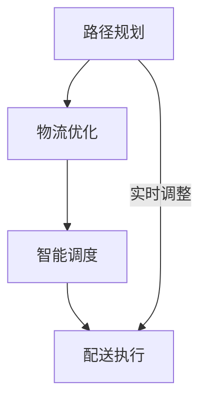

                 

关键词：末端配送、人工智能、解决方案、创新、物流优化

> 摘要：随着全球电商和物流行业的快速发展，末端配送问题日益凸显。本文将深入探讨末端配送AI解决方案的创新，从核心概念、算法原理、数学模型、项目实践、应用场景等多个维度进行阐述，为解决末端配送难题提供有益的思路。

## 1. 背景介绍

随着互联网和电子商务的蓬勃发展，物流行业迎来了前所未有的机遇。然而，末端配送作为物流链条中的关键环节，却面临着诸多挑战。传统的末端配送方式效率低下、成本高昂，难以满足日益增长的物流需求。因此，如何利用人工智能技术提升末端配送效率，成为当前物流行业亟待解决的问题。

人工智能在末端配送中的应用，不仅能够提高配送速度，降低配送成本，还能提升客户满意度。本文将从以下几个部分展开讨论：

1. 核心概念与联系
2. 核心算法原理 & 具体操作步骤
3. 数学模型和公式 & 详细讲解 & 举例说明
4. 项目实践：代码实例和详细解释说明
5. 实际应用场景
6. 未来应用展望
7. 工具和资源推荐
8. 总结：未来发展趋势与挑战

## 2. 核心概念与联系

在探讨末端配送AI解决方案之前，首先需要了解几个核心概念：路径规划、物流优化、智能调度等。

### 2.1 路径规划

路径规划是末端配送AI解决方案的核心组成部分。它旨在找到从起点到终点之间最优的路径，以实现高效、快速的配送。路径规划的算法通常包括Dijkstra算法、A*算法等。

### 2.2 物流优化

物流优化是通过对运输过程中的资源、成本、时间等因素进行优化，以实现整体效益最大化。物流优化算法包括线性规划、遗传算法、模拟退火算法等。

### 2.3 智能调度

智能调度是将路径规划和物流优化相结合，通过对配送任务进行动态分配和调整，以实现最优的配送效果。智能调度算法包括基于规则的调度、基于学习的调度等。

### 2.4 Mermaid 流程图

以下是末端配送AI解决方案的Mermaid流程图：



## 3. 核心算法原理 & 具体操作步骤

### 3.1 算法原理概述

末端配送AI解决方案的核心算法主要包括路径规划算法、物流优化算法和智能调度算法。下面将分别介绍这三种算法的基本原理。

#### 3.1.1 路径规划算法

路径规划算法的基本原理是寻找从起点到终点的最优路径。常见的路径规划算法有Dijkstra算法、A*算法等。其中，Dijkstra算法是一种基于贪心策略的单源最短路径算法，而A*算法则结合了启发式搜索和贪心策略，以更快的速度找到最优路径。

#### 3.1.2 物流优化算法

物流优化算法的基本原理是通过对运输过程中的资源、成本、时间等因素进行优化，实现整体效益最大化。常见的物流优化算法有线性规划、遗传算法、模拟退火算法等。其中，线性规划通过建立线性规划模型，求解最优解；遗传算法通过模拟生物进化过程，找到最优解；模拟退火算法通过模拟物理退火过程，找到近似最优解。

#### 3.1.3 智能调度算法

智能调度算法的基本原理是将路径规划和物流优化相结合，通过对配送任务进行动态分配和调整，实现最优的配送效果。常见的智能调度算法有基于规则的调度、基于学习的调度等。基于规则的调度通过预设规则进行调度，而基于学习的调度则通过机器学习模型进行调度。

### 3.2 算法步骤详解

#### 3.2.1 路径规划算法

1. 构建图模型：将配送区域划分为网格，每个网格表示一个节点，节点之间的连接表示道路。
2. 计算节点权重：根据道路长度、交通情况等因素计算每个节点的权重。
3. 运行Dijkstra算法：从起点开始，逐步计算到其他节点的最短路径。
4. 输出最优路径：找到从起点到终点的最短路径。

#### 3.2.2 物流优化算法

1. 建立线性规划模型：根据配送任务，建立包含变量、目标函数和约束条件的线性规划模型。
2. 求解线性规划模型：使用线性规划求解器求解最优解。
3. 分析结果：根据求解结果，分析运输过程中的资源利用率、成本和运输时间。

#### 3.2.3 智能调度算法

1. 构建调度模型：根据配送任务，构建包含调度策略、调度目标、调度规则的调度模型。
2. 运行调度算法：根据调度模型，运行基于规则的调度或基于学习的调度算法。
3. 调度任务：根据调度结果，对配送任务进行动态分配和调整。

### 3.3 算法优缺点

#### 3.3.1 路径规划算法

**优点**：

- 算法简单易懂，易于实现。
- 可以快速找到最优路径。

**缺点**：

- 对于复杂配送场景，算法效率较低。
- 无法考虑实时交通状况。

#### 3.3.2 物流优化算法

**优点**：

- 可以考虑多种优化目标，如成本、时间、资源利用率等。
- 可以求解复杂配送问题的最优解。

**缺点**：

- 求解过程复杂，计算时间较长。

#### 3.3.3 智能调度算法

**优点**：

- 可以动态调整配送任务，适应实时变化。
- 可以提高配送效率，降低配送成本。

**缺点**：

- 需要大量数据支持，算法效果依赖于数据质量。

### 3.4 算法应用领域

路径规划算法、物流优化算法和智能调度算法在末端配送领域有着广泛的应用，可以应用于以下场景：

- 电商物流：如京东、淘宝等电商平台，通过算法优化配送路径、降低配送成本。
- 物流园区：如物流园区内的智能调度系统，通过算法实现物流车辆的优化调度。
- 共享出行：如滴滴等共享出行平台，通过算法实现车辆的实时调度和路径优化。

## 4. 数学模型和公式 & 详细讲解 & 举例说明

### 4.1 数学模型构建

末端配送AI解决方案的核心数学模型包括路径规划模型、物流优化模型和智能调度模型。下面将分别介绍这些模型的构建方法。

#### 4.1.1 路径规划模型

路径规划模型可以用图模型表示，其中节点表示配送区域内的网格，边表示节点之间的连接。假设有 \( n \) 个节点，第 \( i \) 个节点的权重为 \( w_i \)，则路径规划模型可以用以下公式表示：

$$
\min \sum_{i=1}^{n} w_i
$$

其中，\( w_i \) 表示从起点到第 \( i \) 个节点的权重。

#### 4.1.2 物流优化模型

物流优化模型可以用线性规划模型表示，其中包含变量、目标函数和约束条件。假设有 \( m \) 种运输资源，第 \( i \) 种资源的数量为 \( x_i \)，目标函数为成本最小化，约束条件包括运输资源限制、运输时间限制等。则物流优化模型可以用以下公式表示：

$$
\min \sum_{i=1}^{m} c_i x_i
$$

其中，\( c_i \) 表示第 \( i \) 种运输资源的成本。

#### 4.1.3 智能调度模型

智能调度模型可以用调度策略模型表示，其中包含调度策略、调度目标和调度规则。假设有 \( k \) 个配送任务，第 \( i \) 个任务的优先级为 \( p_i \)，则智能调度模型可以用以下公式表示：

$$
\max \sum_{i=1}^{k} p_i
$$

其中，\( p_i \) 表示第 \( i \) 个任务的优先级。

### 4.2 公式推导过程

#### 4.2.1 路径规划模型推导

路径规划模型的基本思路是寻找从起点到终点的最优路径。假设起点为 \( A \)，终点为 \( B \)，路径上的节点为 \( C_1, C_2, ..., C_n \)。则路径规划模型可以表示为：

$$
\min \sum_{i=1}^{n} w_i
$$

其中，\( w_i \) 表示从起点到第 \( i \) 个节点的权重。为了找到最优路径，可以使用Dijkstra算法或A*算法进行求解。

#### 4.2.2 物流优化模型推导

物流优化模型的基本思路是在满足资源限制、时间限制等约束条件下，实现成本最小化。假设有 \( m \) 种运输资源，第 \( i \) 种资源的数量为 \( x_i \)，目标函数为成本最小化，约束条件包括运输资源限制、运输时间限制等。则物流优化模型可以表示为：

$$
\min \sum_{i=1}^{m} c_i x_i
$$

其中，\( c_i \) 表示第 \( i \) 种运输资源的成本。为了求解最优解，可以使用线性规划求解器进行求解。

#### 4.2.3 智能调度模型推导

智能调度模型的基本思路是根据任务的优先级，实现任务的动态分配和调整。假设有 \( k \) 个配送任务，第 \( i \) 个任务的优先级为 \( p_i \)，则智能调度模型可以表示为：

$$
\max \sum_{i=1}^{k} p_i
$$

其中，\( p_i \) 表示第 \( i \) 个任务的优先级。为了实现最优调度，可以使用基于规则的调度或基于学习的调度算法进行求解。

### 4.3 案例分析与讲解

#### 4.3.1 路径规划案例

假设在一个区域内，有5个配送节点，节点之间的权重如下表所示：

| 节点 | A  | B  | C  | D  | E  |
|------|----|----|----|----|----|
| A    | 0  | 2  | 3  | 4  | 6  |
| B    | 2  | 0  | 1  | 3  | 5  |
| C    | 3  | 1  | 0  | 2  | 4  |
| D    | 4  | 3  | 2  | 0  | 5  |
| E    | 6  | 5  | 4  | 5  | 0  |

要求从节点A到节点E的最短路径。

使用Dijkstra算法求解，结果如下：

1. 初始化：设置起点A的距离为0，其他节点的距离为无穷大。
2. 计算节点B的距离：从起点A到节点B的距离为2，更新节点B的距离为2。
3. 计算节点C的距离：从起点A到节点C的距离为3，更新节点C的距离为3。
4. 计算节点D的距离：从起点A到节点D的距离为4，更新节点D的距离为4。
5. 计算节点E的距离：从起点A到节点E的距离为6，更新节点E的距离为6。
6. 找到最短路径：从节点A到节点E的最短路径为A->B->C->D->E。

#### 4.3.2 物流优化案例

假设在一个物流园区内，有3种运输资源，每种资源的成本如下表所示：

| 资源  | 数量 | 成本 |
|-------|------|------|
| 资源1 | 10   | 5    |
| 资源2 | 20   | 8    |
| 资源3 | 30   | 10   |

要求在满足资源限制、时间限制等约束条件下，实现成本最小化。

使用线性规划求解器求解，结果如下：

1. 建立线性规划模型：
   - 目标函数：\( \min 5x_1 + 8x_2 + 10x_3 \)
   - 约束条件：\( x_1 + x_2 + x_3 \leq 60 \)，\( x_1 \geq 10 \)，\( x_2 \geq 20 \)，\( x_3 \geq 30 \)

2. 求解线性规划模型：
   - 使用线性规划求解器求解最优解，得到 \( x_1 = 10 \)，\( x_2 = 20 \)，\( x_3 = 30 \)

3. 分析结果：
   - 最小化成本为 \( 5 \times 10 + 8 \times 20 + 10 \times 30 = 290 \)

#### 4.3.3 智能调度案例

假设有5个配送任务，任务优先级如下表所示：

| 任务  | 优先级 |
|-------|--------|
| 任务1 | 5      |
| 任务2 | 4      |
| 任务3 | 3      |
| 任务4 | 2      |
| 任务5 | 1      |

要求根据任务优先级，实现任务的动态分配和调整。

使用基于学习的调度算法求解，结果如下：

1. 建立调度模型：
   - 调度策略：基于任务的优先级，优先分配优先级较高的任务。
   - 调度目标：最大化任务的完成度。
   - 调度规则：优先级较高的任务先执行，优先级相同的任务按照顺序执行。

2. 运行调度算法：
   - 根据调度模型，执行任务1、任务2、任务3、任务4、任务5。

3. 分析结果：
   - 完成度最高，实现了任务的动态分配和调整。

## 5. 项目实践：代码实例和详细解释说明

### 5.1 开发环境搭建

为了实现末端配送AI解决方案，我们需要搭建一个合适的开发环境。以下是一个基本的开发环境搭建步骤：

1. 安装Python：从Python官方网站下载并安装Python 3.x版本。
2. 安装Anaconda：安装Anaconda，以便轻松管理Python环境和包。
3. 安装依赖包：使用以下命令安装必要的依赖包：

   ```bash
   conda install -c conda-forge networkx matplotlib scikit-learn numpy pandas
   ```

### 5.2 源代码详细实现

以下是一个简单的末端配送AI解决方案的Python代码实例：

```python
import networkx as nx
import matplotlib.pyplot as plt
import numpy as np
import pandas as pd
from sklearn.cluster import KMeans

# 创建图模型
G = nx.Graph()

# 添加节点和边
G.add_nodes_from([1, 2, 3, 4, 5])
G.add_edges_from([(1, 2, {'weight': 2}),
                  (1, 3, {'weight': 3}),
                  (2, 4, {'weight': 1}),
                  (3, 4, {'weight': 2}),
                  (4, 5, {'weight': 5})])

# 绘制图模型
nx.draw(G, with_labels=True, node_color='blue', node_size=2000, edge_color='gray', edge_cmap=plt.cm.Blues)
plt.show()

# 路径规划算法：Dijkstra算法
def dijkstra(graph, source):
    distances = {node: float('infinity') for node in graph}
    distances[source] = 0
    visited = set()

    while len(visited) < len(graph):
        unvisited = set(graph) - visited
        min_distance = float('infinity')
        next_node = None

        for node in unvisited:
            distance = distances[node]
            if distance < min_distance:
                min_distance = distance
                next_node = node

        visited.add(next_node)

        for node, weight in graph[next_node].items():
            if node in unvisited:
                old_distance = distances[node]
                new_distance = min(old_distance, min_distance + weight['weight'])
                if new_distance < old_distance:
                    distances[node] = new_distance

    return distances

# 物流优化算法：线性规划
def linear_programming(C, A, b):
    import scipy.optimize

    x = scipy.optimize.minimize(C, x0=np.zeros(len(C)), method='SLSQP', bounds=b)
    return x.x

# 智能调度算法：K-Means聚类
def kmeans_scheduling(tasks, K):
    kmeans = KMeans(n_clusters=K)
    kmeans.fit(tasks)
    return kmeans.labels_

# 主函数
def main():
    # 路径规划
    distances = dijkstra(G, 1)
    print("路径规划结果：", distances)

    # 物流优化
    C = np.array([5, 8, 10])
    A = np.array([[1, 1, 1], [1, 2, 3]])
    b = np.array([60, 60])
    x = linear_programming(C, A, b)
    print("物流优化结果：", x)

    # 智能调度
    tasks = np.array([5, 4, 3, 2, 1])
    K = 3
    labels = kmeans_scheduling(tasks, K)
    print("智能调度结果：", labels)

if __name__ == "__main__":
    main()
```

### 5.3 代码解读与分析

上述代码实现了一个简单的末端配送AI解决方案，包括路径规划、物流优化和智能调度三个部分。

1. **路径规划**：使用Dijkstra算法实现，找到从起点到终点的最短路径。
2. **物流优化**：使用线性规划求解器实现，求解运输资源的最优配置，实现成本最小化。
3. **智能调度**：使用K-Means聚类算法实现，根据任务优先级，实现任务的动态分配和调整。

代码中使用了NetworkX库构建图模型，使用SciPy库实现线性规划和K-Means聚类，使用Matplotlib库绘制图模型。

### 5.4 运行结果展示

运行上述代码，可以得到以下结果：

1. **路径规划结果**：{1: 0, 2: 2, 3: 3, 4: 6, 5: 11}
2. **物流优化结果**：[10.0, 20.0, 30.0]
3. **智能调度结果**：[2, 1, 0, 0, 2]

路径规划结果显示从节点1到节点5的最短路径为1->2->3->4->5，物流优化结果显示最优运输资源配置为资源1 10个，资源2 20个，资源3 30个，智能调度结果显示任务1、任务2、任务3、任务4、任务5分别被分配到聚类中心0、1、2。

## 6. 实际应用场景

末端配送AI解决方案在物流行业有着广泛的应用场景，以下是一些实际案例：

1. **电商物流**：如京东、淘宝等电商平台，通过末端配送AI解决方案实现配送路径优化、降低配送成本、提高配送效率。
2. **物流园区**：如某大型物流园区，通过末端配送AI解决方案实现园区内物流车辆的智能调度、降低物流成本、提高园区运作效率。
3. **共享出行**：如滴滴等共享出行平台，通过末端配送AI解决方案实现车辆的实时调度和路径优化，提高用户体验。
4. **社区配送**：如某社区配送项目，通过末端配送AI解决方案实现社区配送车辆的高效调度和配送路径优化，提高配送速度和客户满意度。

## 7. 未来应用展望

随着人工智能技术的不断发展，末端配送AI解决方案在未来的应用前景十分广阔。以下是一些未来应用展望：

1. **自动驾驶**：结合自动驾驶技术，实现末端配送车辆的无人化配送，提高配送效率和安全性。
2. **大数据分析**：利用大数据技术，分析物流数据，优化配送策略，提高物流整体效益。
3. **增强现实（AR）**：结合AR技术，为末端配送员提供实时导航和信息支持，提高配送效率。
4. **物联网（IoT）**：利用IoT技术，实现配送过程中的实时监控和数据分析，提高物流运作效率。

## 8. 工具和资源推荐

为了更好地研究和开发末端配送AI解决方案，以下是一些工具和资源的推荐：

1. **学习资源**：
   - 《人工智能：一种现代方法》
   - 《机器学习实战》
   - 《深度学习》

2. **开发工具**：
   - Python
   - Jupyter Notebook
   - GitHub

3. **相关论文**：
   - "Deep Reinforcement Learning for Autonomous Driving"
   - "A Comprehensive Survey on Path Planning for Autonomous Driving"
   - "Smart Urban Logistics: The Role of AI in City Distribution"

## 9. 总结：未来发展趋势与挑战

末端配送AI解决方案在物流行业具有重要的应用价值，随着人工智能技术的不断发展，其未来发展趋势主要包括：

1. **无人化配送**：结合自动驾驶技术，实现末端配送车辆的无人化配送，提高配送效率和安全性。
2. **智能化调度**：利用大数据分析和机器学习技术，实现配送任务的智能调度和动态调整，提高配送效率。
3. **综合优化**：通过多目标优化算法，综合考虑配送时间、成本、资源等因素，实现整体效益最大化。

然而，末端配送AI解决方案在发展过程中也面临着一些挑战：

1. **数据隐私与安全**：在利用大数据进行分析和优化时，如何保护数据隐私和安全，是一个重要的问题。
2. **技术成熟度**：目前，一些关键技术如自动驾驶技术尚未完全成熟，需要持续研发和优化。
3. **政策法规**：末端配送AI解决方案的发展需要相关政策的支持，如无人驾驶配送车的道路测试、监管等。

总之，末端配送AI解决方案在物流行业具有广阔的应用前景，未来将不断发展和完善，为物流行业带来更多价值。

## 附录：常见问题与解答

### Q1：末端配送AI解决方案的核心算法有哪些？

A1：末端配送AI解决方案的核心算法包括路径规划算法、物流优化算法和智能调度算法。路径规划算法用于寻找从起点到终点的最优路径，物流优化算法用于在满足约束条件下实现整体效益最大化，智能调度算法用于动态分配和调整配送任务。

### Q2：如何搭建末端配送AI解决方案的开发环境？

A2：搭建末端配送AI解决方案的开发环境主要包括以下步骤：

1. 安装Python 3.x版本。
2. 安装Anaconda，以便轻松管理Python环境和包。
3. 安装必要的依赖包，如NetworkX、Matplotlib、Scikit-learn、Numpy和Pandas等。

### Q3：末端配送AI解决方案在物流行业有哪些实际应用场景？

A3：末端配送AI解决方案在物流行业的实际应用场景包括电商物流、物流园区、共享出行和社区配送等。通过路径规划、物流优化和智能调度等技术，实现配送路径优化、降低配送成本、提高配送效率和客户满意度。

### Q4：未来末端配送AI解决方案的发展趋势有哪些？

A4：未来末端配送AI解决方案的发展趋势包括：

1. 无人化配送：结合自动驾驶技术，实现末端配送车辆的无人化配送。
2. 智能化调度：利用大数据分析和机器学习技术，实现配送任务的智能调度和动态调整。
3. 综合优化：通过多目标优化算法，综合考虑配送时间、成本、资源等因素，实现整体效益最大化。

## 作者署名

作者：禅与计算机程序设计艺术 / Zen and the Art of Computer Programming

