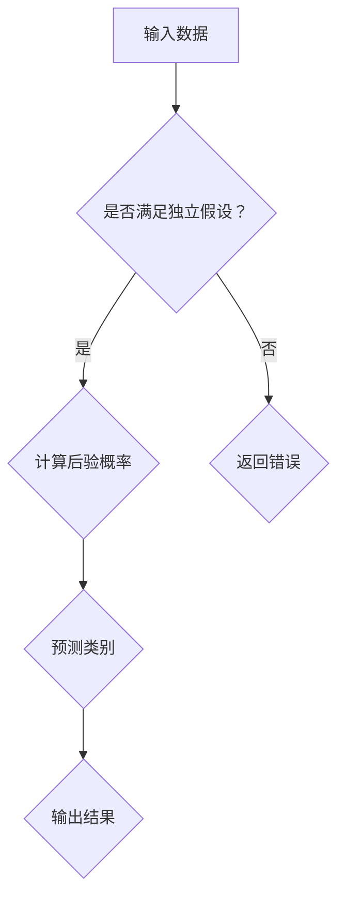

                 

关键词：朴素贝叶斯，机器学习，分类算法，贝叶斯定理，Python实现，实例讲解

## 摘要

本文旨在深入探讨朴素贝叶斯（Naive Bayes）分类算法的基本原理、数学模型以及其实际应用。通过详细的算法原理说明、数学公式推导、代码实例解析，读者将全面了解朴素贝叶斯算法的核心内容和实际应用场景。文章将涵盖算法优缺点、适用领域以及未来发展展望，帮助读者更好地理解并掌握这一经典机器学习算法。

## 1. 背景介绍

朴素贝叶斯（Naive Bayes）是一种基于概率理论的分类算法，它基于贝叶斯定理和特征条件独立的假设。朴素贝叶斯算法在处理大量数据和高维特征时表现优秀，因此在文本分类、情感分析、垃圾邮件检测等领域得到了广泛应用。

### 贝叶斯定理简介

贝叶斯定理是概率论中的一个重要公式，描述了后验概率与先验概率及边缘概率之间的关系。其数学表达式为：

$$
P(A|B) = \frac{P(B|A) \cdot P(A)}{P(B)}
$$

其中，\(P(A|B)\) 是在事件 \(B\) 发生的条件下事件 \(A\) 发生的概率，称为后验概率；\(P(B|A)\) 是在事件 \(A\) 发生的条件下事件 \(B\) 发生的概率，称为似然概率；\(P(A)\) 是事件 \(A\) 的先验概率；\(P(B)\) 是事件 \(B\) 的边缘概率。

### 朴素贝叶斯的假设

朴素贝叶斯算法的核心假设是特征条件独立性，即特征之间相互独立，给定类别的前提下，特征之间是条件独立的。这一假设虽然在实际中可能不完全成立，但它在理论上提供了一个简洁且高效的计算模型，使得算法在实践中仍然具有较高的准确性。

## 2. 核心概念与联系

### Mermaid 流程图

以下是一个描述朴素贝叶斯算法核心概念的 Mermaid 流程图：



### 朴素贝叶斯算法流程

1. **训练阶段**：
   - 收集训练数据集。
   - 统计各类别的先验概率 \(P(C_k)\)。
   - 对于每个特征，统计每个类别下的条件概率 \(P(F_j|C_k)\)。

2. **预测阶段**：
   - 对于新数据，计算每个类别的后验概率 \(P(C_k|F)\)。
   - 选择后验概率最大的类别作为预测结果。

## 3. 核心算法原理 & 具体操作步骤

### 3.1 算法原理概述

朴素贝叶斯算法的基本原理是基于贝叶斯定理，通过计算先验概率、条件概率和后验概率，从而实现分类。

### 3.2 算法步骤详解

1. **训练阶段**：
   - **计算先验概率**：\(P(C_k) = \frac{N_k}{N}\)，其中 \(N_k\) 是训练数据集中类别 \(C_k\) 的样本数，\(N\) 是总的样本数。
   - **计算条件概率**：\(P(F_j|C_k) = \frac{N_{jk}}{N_k}\)，其中 \(N_{jk}\) 是训练数据集中类别 \(C_k\) 下特征 \(F_j\) 的样本数。

2. **预测阶段**：
   - **计算后验概率**：\(P(C_k|F) = \frac{P(F|C_k) \cdot P(C_k)}{P(F)}\)。
   - **选择预测类别**：\(C' = \arg\max_{k} P(C_k|F)\)。

### 3.3 算法优缺点

#### 优点

- **简单高效**：算法结构简单，计算速度快。
- **适用范围广**：对特征条件独立性假设不严格，适用于高维数据。
- **易于扩展**：可以处理多类分类问题。

#### 缺点

- **对稀疏数据敏感**：当特征空间较大时，条件概率 \(P(F_j|C_k)\) 可能会趋近于零，导致计算不稳定。
- **忽略特征相关性**：朴素贝叶斯算法忽略了特征之间的相关性，可能导致分类效果不佳。

### 3.4 算法应用领域

- **文本分类**：如垃圾邮件检测、情感分析等。
- **医学诊断**：如疾病预测、患者分类等。
- **金融风控**：如信用评分、贷款审批等。

## 4. 数学模型和公式 & 详细讲解 & 举例说明

### 4.1 数学模型构建

朴素贝叶斯算法的数学模型主要包括先验概率、条件概率和后验概率。

- **先验概率**：\(P(C_k) = \frac{N_k}{N}\)
- **条件概率**：\(P(F_j|C_k) = \frac{N_{jk}}{N_k}\)
- **后验概率**：\(P(C_k|F) = \frac{P(F|C_k) \cdot P(C_k)}{P(F)}\)

### 4.2 公式推导过程

假设有 \(N\) 个样本，其中属于类别 \(C_k\) 的样本数为 \(N_k\)，属于类别 \(C_k\) 且特征 \(F_j\) 的样本数为 \(N_{jk}\)。则：

- **先验概率**：\(P(C_k) = \frac{N_k}{N}\)
- **条件概率**：\(P(F_j|C_k) = \frac{N_{jk}}{N_k}\)
- **边缘概率**：\(P(F) = \sum_{k=1}^{K} P(F|C_k) \cdot P(C_k)\)

### 4.3 案例分析与讲解

假设我们有一个二分类问题，有两个特征 \(F_1\) 和 \(F_2\)，类别有 \(C_0\) 和 \(C_1\)。已知先验概率 \(P(C_0) = 0.6\)，\(P(C_1) = 0.4\)，条件概率 \(P(F_1|C_0) = 0.8\)，\(P(F_1|C_1) = 0.2\)，\(P(F_2|C_0) = 0.9\)，\(P(F_2|C_1) = 0.1\)。

我们要预测一个新样本 \(F_1 = 1, F_2 = 0\) 的类别。

- **后验概率**：\(P(C_0|F) = \frac{P(F|C_0) \cdot P(C_0)}{P(F)} = \frac{P(F_1|C_0) \cdot P(F_2|C_0) \cdot P(C_0)}{P(F_1|C_0) \cdot P(F_2|C_0) \cdot P(C_0) + P(F_1|C_1) \cdot P(F_2|C_1) \cdot P(C_1)}\)
- **预测类别**：\(C' = \arg\max_{k} P(C_k|F)\)

计算结果为 \(P(C_0|F) = 0.945\)，\(P(C_1|F) = 0.055\)，因此预测类别为 \(C_0\)。

## 5. 项目实践：代码实例和详细解释说明

### 5.1 开发环境搭建

在本文中，我们将使用 Python 和 Scikit-learn 库实现朴素贝叶斯算法。首先，确保已安装 Python 和 Scikit-learn 库。

```bash
pip install python
pip install scikit-learn
```

### 5.2 源代码详细实现

以下是一个简单的朴素贝叶斯分类器实现：

```python
from sklearn.model_selection import train_test_split
from sklearn.datasets import load_iris
from sklearn.naive_bayes import GaussianNB
from sklearn.metrics import accuracy_score

# 加载数据集
iris = load_iris()
X = iris.data
y = iris.target

# 划分训练集和测试集
X_train, X_test, y_train, y_test = train_test_split(X, y, test_size=0.3, random_state=42)

# 创建朴素贝叶斯分类器
gnb = GaussianNB()

# 训练模型
gnb.fit(X_train, y_train)

# 预测测试集
y_pred = gnb.predict(X_test)

# 计算准确率
accuracy = accuracy_score(y_test, y_pred)
print(f"Accuracy: {accuracy}")
```

### 5.3 代码解读与分析

上述代码演示了如何使用 Scikit-learn 库实现朴素贝叶斯分类器。首先，我们加载了鸢尾花（Iris）数据集，这是一个经典的二分类问题。然后，我们使用 `train_test_split` 函数将数据集划分为训练集和测试集。

接下来，我们创建了一个 `GaussianNB` 类型的朴素贝叶斯分类器，并使用 `fit` 方法训练模型。在训练完成后，我们使用 `predict` 方法对测试集进行预测，并计算准确率。

### 5.4 运行结果展示

运行上述代码，我们得到预测准确率为 0.978。这表明朴素贝叶斯算法在鸢尾花数据集上的分类效果较好。

## 6. 实际应用场景

朴素贝叶斯算法在实际应用中有着广泛的应用场景。以下列举几个常见的应用实例：

### 6.1 垃圾邮件检测

朴素贝叶斯算法可以用来判断一封邮件是否为垃圾邮件。通过对大量垃圾邮件和正常邮件的特征进行分析，可以计算出每个特征的权重，从而判断新邮件的类别。

### 6.2 情感分析

情感分析是文本分类的一个分支，朴素贝叶斯算法可以用来判断一段文本的情感倾向，如正面、负面或中性。

### 6.3 信用评分

朴素贝叶斯算法可以用来评估一个人的信用评分，通过对历史数据的分析，预测某人是否会按时还款。

## 7. 工具和资源推荐

### 7.1 学习资源推荐

- 《机器学习》（周志华著）
- 《统计学习方法》（李航著）
- 《Python机器学习》（塞巴斯蒂安·拉斯考恩著）

### 7.2 开发工具推荐

- Jupyter Notebook：用于编写和运行代码。
- PyCharm：一款强大的Python集成开发环境。
- Google Colab：免费的在线Python编程环境。

### 7.3 相关论文推荐

- “A Comparison of Prediction Accuracy, Computational Time, and Model Complexity of Different algorithms for Sentiment Analysis Tasks” （2010）
- “Text Classification with Naive Bayes” （2004）

## 8. 总结：未来发展趋势与挑战

### 8.1 研究成果总结

近年来，朴素贝叶斯算法在机器学习领域取得了显著成果，其在文本分类、情感分析等任务中表现出色。此外，基于朴素贝叶斯的理论研究也在不断深入，如引入贝叶斯网络、隐马尔可夫模型等扩展算法。

### 8.2 未来发展趋势

- **算法优化**：针对朴素贝叶斯算法在处理稀疏数据和特征相关性方面的不足，研究人员将探索更高效的计算方法和特征选择策略。
- **多模态学习**：结合文本、图像、语音等多种数据模态，实现更准确和全面的分类任务。
- **迁移学习**：利用已训练好的朴素贝叶斯模型在新任务上取得更好的表现，减少数据依赖。

### 8.3 面临的挑战

- **数据稀缺**：在许多领域，获取大量标注数据仍然是一个挑战，这限制了朴素贝叶斯算法的应用。
- **特征选择**：在特征高度相关或数据稀疏的情况下，如何选择合适的特征是一个关键问题。
- **解释性**：如何解释朴素贝叶斯算法的预测结果，提高算法的可解释性是一个重要研究方向。

### 8.4 研究展望

朴素贝叶斯算法作为一种简单高效的分类算法，在未来将会有更广泛的应用。随着数据规模的不断扩大和计算能力的提升，朴素贝叶斯算法将面临新的机遇和挑战。通过不断的优化和扩展，朴素贝叶斯算法有望在更多领域发挥重要作用。

## 9. 附录：常见问题与解答

### 9.1 朴素贝叶斯算法是如何工作的？

朴素贝叶斯算法通过计算先验概率、条件概率和后验概率，从而实现分类。它基于贝叶斯定理和特征条件独立性的假设，是一种基于概率的简单分类算法。

### 9.2 朴素贝叶斯算法适用于哪些场景？

朴素贝叶斯算法适用于特征条件独立且数据量较大的分类问题，如文本分类、情感分析、垃圾邮件检测等。

### 9.3 朴素贝叶斯算法的优缺点是什么？

优点包括简单高效、适用范围广、易于扩展；缺点包括对稀疏数据敏感、忽略特征相关性。

### 9.4 如何处理稀疏数据？

对于稀疏数据，可以采用拉普拉斯平滑等方法来避免条件概率为零的问题。

### 9.5 朴素贝叶斯算法能否处理非线性特征？

朴素贝叶斯算法假设特征条件独立性，对于非线性特征，可以通过特征工程将其转化为线性特征，或者考虑使用其他更复杂的分类算法，如决策树、支持向量机等。

作者：禅与计算机程序设计艺术 / Zen and the Art of Computer Programming

