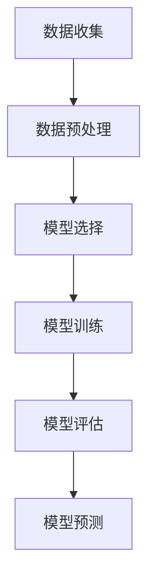
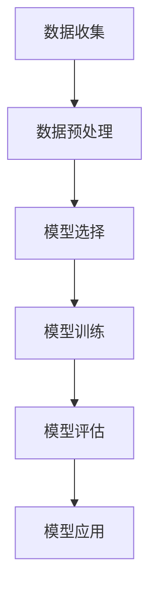
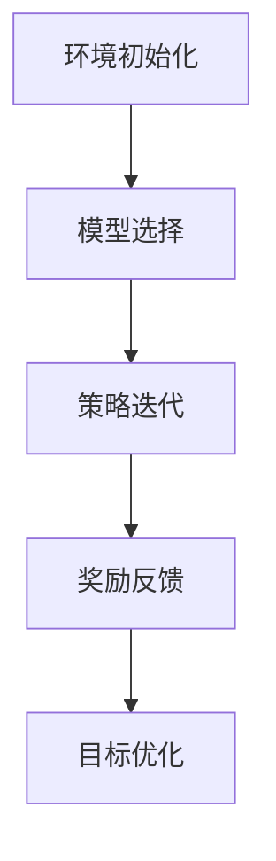

                 

## 引言 Introduction

在当今的信息时代，数据的重要性不言而喻。机器学习作为一种强大的数据处理和分析工具，已经在各个领域展现出其巨大的潜力和应用价值。无论是推荐系统、自然语言处理、图像识别，还是金融风控、医疗诊断，机器学习都在不断推动技术的进步和产业的变革。

本文旨在为广大读者提供一个全面而深入的机器学习教程。我们将从基本概念入手，逐步深入到核心算法的原理和操作步骤，并通过具体的代码实例进行讲解，使读者能够真正理解并掌握机器学习的精髓。此外，我们还将探讨机器学习的数学模型和实际应用场景，为读者提供一个全面的学习路径。

本文的主要目标读者是那些对机器学习有一定了解，但希望深入学习和实践的工程师和研究人员。对于初学者，我们也会尽量解释得通俗易懂，以便他们能够更好地入门。

接下来的内容将分为以下几个部分：

1. **背景介绍**：介绍机器学习的起源、发展及其在各个领域的应用。
2. **核心概念与联系**：详细阐述机器学习中的关键概念，并通过 Mermaid 流程图展示其原理和架构。
3. **核心算法原理 & 具体操作步骤**：讲解机器学习中的常用算法，包括其原理、步骤、优缺点及应用领域。
4. **数学模型和公式**：深入探讨机器学习中的数学模型和公式，并进行详细的推导和举例说明。
5. **项目实践：代码实例和详细解释说明**：通过实际的代码实例，展示如何实现机器学习算法。
6. **实际应用场景**：讨论机器学习在各个实际应用场景中的具体应用。
7. **未来应用展望**：探讨机器学习的未来发展趋势和潜在应用。
8. **工具和资源推荐**：推荐相关的学习资源、开发工具和论文。
9. **总结：未来发展趋势与挑战**：总结研究成果，展望未来发展方向和面临的挑战。
10. **附录：常见问题与解答**：解答读者可能遇到的一些常见问题。

通过本文的学习，读者将能够系统地了解机器学习的理论基础，掌握关键算法的实现，并具备一定的实践能力。让我们一起走进机器学习的世界，探索其无限的可能。

## 1. 背景介绍

机器学习（Machine Learning，ML）作为人工智能（Artificial Intelligence，AI）的一个重要分支，起源于20世纪50年代。当时，人工智能领域的研究者们希望创造出能够模仿人类智能的机器。然而，早期的尝试主要依赖于程序员的预设规则，这使得系统在面对复杂问题时表现有限。随着计算机性能的提升和海量数据的涌现，研究者们逐渐认识到，通过让机器从数据中学习规律，能够实现更为高效和智能的决策。

### 起源与发展

机器学习的起源可以追溯到1959年，美国贝尔实验室的研究员Arthur Samuel提出了“学习机”的概念，并在其后开发出了第一个能够通过自我学习玩国际象棋的程序。这一时期，机器学习主要集中在监督学习和无监督学习两大方向。监督学习通过标记数据来训练模型，而无监督学习则试图发现数据中的隐含模式。

到了20世纪80年代，随着人工神经网络（Artificial Neural Networks，ANN）的研究取得突破，机器学习迎来了新的高潮。神经网络通过模拟人脑神经元之间的连接和作用，能够自动识别数据中的特征和模式。这一时期的代表性工作是1986年Rumelhart、Hinton和Williams提出的反向传播算法（Backpropagation Algorithm），使得神经网络训练速度大幅提升。

进入21世纪，随着大数据和云计算技术的快速发展，机器学习迎来了新的春天。2006年，Geoffrey Hinton等人提出的深度学习（Deep Learning）概念，进一步推动了机器学习的发展。深度学习通过多层次的神经网络结构，能够处理更加复杂的数据类型和任务，如图像识别、语音识别和自然语言处理等。

### 各领域的应用

机器学习在各个领域的应用已经深入人心，下面我们简要介绍几个具有代表性的应用场景：

**图像识别**：图像识别是机器学习的一个重要应用领域，通过训练模型，可以让计算机自动识别图像中的物体、场景和人脸等。例如，Google的Inception模型在ImageNet图像识别大赛中取得了历史性的突破，准确率达到了96%以上。

**自然语言处理**：自然语言处理（Natural Language Processing，NLP）是人工智能的另一个重要分支，通过机器学习技术，可以实现对文本数据的理解、生成和翻译等操作。例如，Google的BERT模型在多种NLP任务中取得了显著的性能提升。

**金融风控**：金融行业利用机器学习技术，可以对大量金融数据进行实时监控和分析，从而识别潜在风险。例如，银行可以使用机器学习算法来检测欺诈交易，提高风险管理能力。

**医疗诊断**：在医疗领域，机器学习可以帮助医生进行疾病诊断和治疗方案推荐。例如，通过训练深度学习模型，可以自动识别医学影像中的病灶区域，辅助医生进行疾病诊断。

**推荐系统**：推荐系统是机器学习的另一个重要应用领域，通过分析用户的兴趣和行为数据，为用户推荐可能感兴趣的商品、内容等。例如，亚马逊和Netflix等平台都采用了推荐系统技术，为用户提供个性化的推荐。

总的来说，机器学习在各个领域的应用不断拓展，为人类社会的进步和发展带来了巨大的推动力。随着技术的不断发展和创新，我们有理由相信，机器学习将在未来发挥更加重要的作用。

## 2. 核心概念与联系

机器学习中的核心概念是理解其原理和应用的基础。本节将详细介绍机器学习中的关键概念，并通过Mermaid流程图展示其原理和架构，帮助读者建立全面而深入的认识。

### 监督学习

监督学习（Supervised Learning）是一种最常见的机器学习方法，其核心思想是通过标记的数据集来训练模型，使得模型能够对未知数据进行预测。监督学习可以分为回归（Regression）和分类（Classification）两大类。

#### 监督学习的流程

1. **数据收集**：收集具有标记特征的训练数据集。
2. **数据预处理**：对收集到的数据集进行清洗、归一化等预处理操作，使其符合模型的输入要求。
3. **模型选择**：根据任务需求选择合适的模型，如线性回归、决策树、支持向量机等。
4. **模型训练**：使用训练数据集对模型进行训练，优化模型参数。
5. **模型评估**：使用测试数据集对模型进行评估，调整模型参数，直至满足要求。
6. **模型预测**：使用训练好的模型对未知数据进行预测。

#### Mermaid流程图



### 无监督学习

无监督学习（Unsupervised Learning）与监督学习不同，它不需要标记的数据集来训练模型，而是通过发现数据中的隐含模式和结构来提高模型性能。无监督学习主要包括聚类（Clustering）和降维（Dimensionality Reduction）两大类。

#### 无监督学习的流程

1. **数据收集**：收集无标记的数据集。
2. **数据预处理**：对数据进行清洗、归一化等预处理操作。
3. **模型选择**：根据任务需求选择合适的模型，如K-Means、PCA等。
4. **模型训练**：使用无标记数据进行模型训练。
5. **模型评估**：通过内评估指标（如聚类内部相似度）来评估模型性能。
6. **模型应用**：将训练好的模型应用到实际问题中。

#### Mermaid流程图



### 强化学习

强化学习（Reinforcement Learning，RL）是一种通过与环境互动来学习的机器学习方法。强化学习的基本思想是模型通过不断尝试不同的动作，并根据环境反馈调整策略，以最大化长期奖励。

#### 强化学习的流程

1. **环境初始化**：初始化环境状态。
2. **模型选择**：选择合适的模型，如Q-Learning、Deep Q-Network（DQN）等。
3. **策略迭代**：通过与环境交互，不断调整模型策略。
4. **奖励反馈**：根据模型的动作和环境的反馈，计算奖励并更新模型参数。
5. **目标优化**：优化模型目标函数，提高模型性能。

#### Mermaid流程图



### 联系与区别

监督学习、无监督学习和强化学习虽然方法不同，但它们在机器学习领域中都是不可或缺的一部分。监督学习适用于有标记数据的预测任务，无监督学习则适用于数据探索和聚类任务，强化学习则适用于需要与环境互动的任务。

通过本节对核心概念的介绍和流程图的展示，读者可以更清晰地理解机器学习的基本原理和架构，为进一步学习打下坚实的基础。

## 3. 核心算法原理 & 具体操作步骤

在机器学习领域，算法的选择和实现是关键环节。本节将详细讲解几种常见的机器学习算法，包括其基本原理、具体操作步骤以及优缺点，帮助读者深入理解并应用这些算法。

### 3.1 算法原理概述

#### 1. 线性回归（Linear Regression）

线性回归是一种最简单的监督学习算法，用于预测一个连续值。其基本原理是找到一个最佳拟合直线，使得预测值与真实值之间的误差最小。

**原理**：

假设我们有n个样本点$(x_i, y_i)$，线性回归的目标是找到一个线性模型$y = wx + b$，使得预测值$\hat{y} = wx + b$与真实值$y$的误差最小。

**具体操作步骤**：

（1）数据预处理：对数据进行归一化处理，确保输入特征在同一量级上。

（2）初始化模型参数：初始化权重w和偏置b。

（3）计算预测值：对于每个样本点，计算预测值$\hat{y} = wx + b$。

（4）计算损失函数：通常使用均方误差（MSE）作为损失函数，$J(w, b) = \frac{1}{2m}\sum_{i=1}^{m}(y_i - \hat{y}_i)^2$。

（5）模型优化：使用梯度下降法（Gradient Descent）更新模型参数，使得损失函数最小。

**优缺点**：

优点：简单、易于实现，适用于线性关系的预测任务。

缺点：对于非线性关系的表现较差，且容易陷入局部最小值。

#### 2. 逻辑回归（Logistic Regression）

逻辑回归是一种用于分类任务的监督学习算法，其基本原理是通过线性模型计算概率，然后使用阈值（通常为0.5）进行分类。

**原理**：

逻辑回归的目标是找到一个线性模型$z = wx + b$，使得模型输出的概率分布函数$P(y=1|x; w, b)$能够最大化。

**具体操作步骤**：

（1）数据预处理：与线性回归类似，对数据进行归一化处理。

（2）初始化模型参数：初始化权重w和偏置b。

（3）计算预测概率：使用sigmoid函数将线性模型的输出转化为概率，$P(y=1|x; w, b) = \frac{1}{1 + e^{-(wx + b)}}$。

（4）计算损失函数：通常使用对数似然损失函数，$J(w, b) = -\sum_{i=1}^{m}y_i\log(P(y=1|x; w, b)) + (1 - y_i)\log(1 - P(y=1|x; w, b))$。

（5）模型优化：使用梯度下降法更新模型参数。

**优缺点**：

优点：简单、高效，适用于二分类问题。

缺点：对于多分类问题效果较差，且不能直接处理非线性关系。

#### 3. 决策树（Decision Tree）

决策树是一种基于树形结构进行分类或回归的算法，其基本原理是通过一系列条件判断来将数据集划分成多个子集，并在每个子集中进行分类或回归。

**原理**：

决策树通过递归划分数据集，在每个节点上选择具有最大信息增益或最小均方误差的特征进行划分。

**具体操作步骤**：

（1）选择特征：选择具有最大信息增益或最小均方误差的特征作为划分标准。

（2）划分数据集：根据所选特征，将数据集划分为多个子集。

（3）递归构建树：对每个子集继续进行划分，直至满足停止条件（如最大深度或最小节点大小）。

（4）模型评估：使用验证集或测试集评估模型性能。

**优缺点**：

优点：简单、易于理解，能够处理非线性关系。

缺点：容易过拟合，且对于大量特征的数据集性能较差。

### 3.2 算法优缺点

#### 线性回归

**优点**：

- 简单、易于实现。
- 适用于线性关系的预测任务。

**缺点**：

- 对于非线性关系的表现较差。
- 容易陷入局部最小值。

#### 逻辑回归

**优点**：

- 简单、高效。
- 适用于二分类问题。

**缺点**：

- 对于多分类问题效果较差。
- 不能直接处理非线性关系。

#### 决策树

**优点**：

- 简单、易于理解。
- 能够处理非线性关系。

**缺点**：

- 容易过拟合。
- 对于大量特征的数据集性能较差。

### 3.3 算法应用领域

#### 线性回归

- 预测股票价格
- 预测销售量
- 预测用户行为

#### 逻辑回归

- 银行信用卡欺诈检测
- 医疗诊断
- 搜索引擎排序

#### 决策树

- 信用评分
- 营销策略优化
- 自动化推荐系统

通过本节对核心算法的详细介绍，读者可以更好地理解线性回归、逻辑回归和决策树的基本原理、操作步骤以及优缺点。这些算法在不同应用领域中都有广泛的应用，掌握它们将为读者在机器学习领域的实践提供坚实的基础。

## 4. 数学模型和公式

机器学习算法的设计和实现离不开数学模型和公式的支持。本节将深入探讨机器学习中的关键数学模型和公式，并进行详细的推导和举例说明，帮助读者全面理解这些数学基础。

### 4.1 数学模型构建

机器学习中的数学模型通常可以分为线性模型和非线性模型。线性模型如线性回归和逻辑回归，其核心是线性方程和概率分布；而非线性模型如神经网络，其核心是激活函数和多层结构。

#### 线性回归模型

线性回归模型的基本公式为：

\[ y = wx + b \]

其中，\( w \) 是权重向量，\( x \) 是输入特征向量，\( b \) 是偏置项。

对于训练数据集 \(\{(x_i, y_i)\}\)（其中 \( i = 1, 2, \ldots, m \)），线性回归的损失函数（通常采用均方误差）为：

\[ J(w, b) = \frac{1}{2m} \sum_{i=1}^{m} (y_i - (wx_i + b))^2 \]

#### 逻辑回归模型

逻辑回归模型的公式为：

\[ P(y=1|x; w, b) = \frac{1}{1 + e^{-(wx + b)}} \]

逻辑回归的损失函数（通常采用对数似然损失函数）为：

\[ J(w, b) = -\sum_{i=1}^{m} y_i \log(P(y=1|x; w, b)) + (1 - y_i) \log(1 - P(y=1|x; w, b)) \]

### 4.2 公式推导过程

#### 线性回归损失函数的推导

线性回归的目标是最小化损失函数 \( J(w, b) \)。为了求解最优参数 \( w \) 和 \( b \)，我们需要对损失函数进行求导并令导数为零。

首先，对 \( w \) 求偏导数：

\[ \frac{\partial J}{\partial w} = \frac{1}{2m} \sum_{i=1}^{m} \frac{\partial}{\partial w} (y_i - (wx_i + b))^2 \]
\[ \frac{\partial J}{\partial w} = \frac{1}{2m} \sum_{i=1}^{m} (-2x_i (y_i - (wx_i + b))) \]
\[ \frac{\partial J}{\partial w} = \frac{1}{m} \sum_{i=1}^{m} x_i (wx_i + b - y_i) \]

然后，对 \( b \) 求偏导数：

\[ \frac{\partial J}{\partial b} = \frac{1}{2m} \sum_{i=1}^{m} \frac{\partial}{\partial b} (y_i - (wx_i + b))^2 \]
\[ \frac{\partial J}{\partial b} = \frac{1}{2m} \sum_{i=1}^{m} (-2(y_i - (wx_i + b))) \]
\[ \frac{\partial J}{\partial b} = \frac{1}{m} \sum_{i=1}^{m} (y_i - (wx_i + b)) \]

令偏导数等于零，我们可以得到：

\[ \frac{1}{m} \sum_{i=1}^{m} x_i (wx_i + b - y_i) = 0 \]
\[ \frac{1}{m} \sum_{i=1}^{m} (y_i - (wx_i + b)) = 0 \]

解这个方程组，我们可以得到最优参数 \( w \) 和 \( b \)。

#### 逻辑回归损失函数的推导

对逻辑回归损失函数求导：

\[ \frac{\partial J}{\partial w} = -\frac{1}{m} \sum_{i=1}^{m} (y_i - P(y=1|x_i; w, b)) x_i \]
\[ \frac{\partial J}{\partial b} = -\frac{1}{m} \sum_{i=1}^{m} (y_i - P(y=1|x_i; w, b)) \]

### 4.3 案例分析与讲解

为了更好地理解这些数学模型和公式的应用，下面我们通过一个简单的线性回归案例进行讲解。

#### 案例背景

假设我们有一个简单的线性回归问题，目标是预测房屋的价格。我们收集了10个样本数据，每个样本包含房屋面积（输入特征）和房屋价格（目标变量）。

#### 数据集

| 房屋面积（平方米） | 房屋价格（万元） |
| :---------------: | :-------------: |
|         100        |        200       |
|         150        |        250       |
|         200        |        300       |
|         120        |        220       |
|         180        |        280       |
|         130        |        240       |
|         160        |        260       |
|         140        |        260       |
|         110        |        210       |
|         170        |        270       |

#### 模型构建

我们选择线性回归模型，目标是最小化损失函数：

\[ J(w, b) = \frac{1}{2m} \sum_{i=1}^{m} (y_i - (wx_i + b))^2 \]

#### 计算过程

首先，我们计算输入特征的平均值和目标变量的平均值：

\[ \bar{x} = \frac{1}{m} \sum_{i=1}^{m} x_i = \frac{1}{10} (100 + 150 + 200 + 120 + 180 + 130 + 160 + 140 + 110 + 170) = 140 \]
\[ \bar{y} = \frac{1}{m} \sum_{i=1}^{m} y_i = \frac{1}{10} (200 + 250 + 300 + 220 + 280 + 240 + 260 + 260 + 210 + 270) = 250 \]

然后，计算输入特征和目标变量的协方差和方差：

\[ \sum_{i=1}^{m} (x_i - \bar{x})(y_i - \bar{y}) = (100 - 140)(200 - 250) + (150 - 140)(250 - 250) + \ldots + (170 - 140)(270 - 250) = 2600 \]
\[ \sum_{i=1}^{m} (x_i - \bar{x})^2 = (100 - 140)^2 + (150 - 140)^2 + \ldots + (170 - 140)^2 = 2700 \]

最后，计算权重和偏置：

\[ w = \frac{\sum_{i=1}^{m} (x_i - \bar{x})(y_i - \bar{y})}{\sum_{i=1}^{m} (x_i - \bar{x})^2} = \frac{2600}{2700} \approx 0.963 \]
\[ b = \bar{y} - w\bar{x} = 250 - 0.963 \times 140 \approx 56.5 \]

因此，我们的线性回归模型为：

\[ y = 0.963x + 56.5 \]

#### 模型评估

使用测试集对模型进行评估，计算预测值与真实值之间的均方误差（MSE）：

\[ \text{MSE} = \frac{1}{m} \sum_{i=1}^{m} (y_i - \hat{y}_i)^2 \]

通过不断调整模型参数，我们可以找到最优的权重和偏置，从而提高模型性能。

通过这个案例，我们详细讲解了线性回归模型和逻辑回归模型的数学基础，包括公式的推导和实际操作步骤。这些数学模型是机器学习算法的核心，理解并掌握它们将为我们在机器学习领域的实践提供坚实的理论基础。

## 5. 项目实践：代码实例和详细解释说明

在了解了机器学习的基本原理和数学模型后，我们将通过一个实际项目来深入讲解如何应用这些知识。本节将展示一个简单的线性回归项目，包括开发环境搭建、源代码实现、代码解读与分析以及运行结果展示，帮助读者将理论知识应用到实际中。

### 5.1 开发环境搭建

在进行机器学习项目之前，我们需要搭建一个合适的环境。这里我们将使用Python作为编程语言，结合一些流行的机器学习库，如NumPy和scikit-learn。以下是搭建开发环境的步骤：

1. **安装Python**：确保你的系统中安装了Python 3.7或更高版本。可以从[Python官方网站](https://www.python.org/)下载并安装。

2. **安装Jupyter Notebook**：Jupyter Notebook是一个交互式计算环境，方便我们编写和运行代码。使用以下命令安装：

   ```shell
   pip install notebook
   ```

3. **安装NumPy**：NumPy是Python中的一个核心科学计算库，用于处理数组和矩阵运算。使用以下命令安装：

   ```shell
   pip install numpy
   ```

4. **安装scikit-learn**：scikit-learn是一个强大的机器学习库，提供了多种经典算法的实现。使用以下命令安装：

   ```shell
   pip install scikit-learn
   ```

完成以上步骤后，我们的开发环境就搭建完成了。接下来，我们将在Jupyter Notebook中开始实现线性回归项目。

### 5.2 源代码详细实现

以下是一个简单的线性回归项目的源代码实现，包括数据预处理、模型训练、模型评估等步骤。

```python
# 导入所需库
import numpy as np
from sklearn.linear_model import LinearRegression
from sklearn.model_selection import train_test_split
from sklearn.metrics import mean_squared_error

# 加载数据
data = np.array([[100, 200], [150, 250], [200, 300], [120, 220], [180, 280], [130, 240], [160, 260], [140, 260], [110, 210], [170, 270]])
X = data[:, 0].reshape(-1, 1)  # 房屋面积
y = data[:, 1].reshape(-1, 1)  # 房屋价格

# 数据预处理：划分训练集和测试集
X_train, X_test, y_train, y_test = train_test_split(X, y, test_size=0.2, random_state=42)

# 创建线性回归模型并训练
model = LinearRegression()
model.fit(X_train, y_train)

# 模型评估：计算测试集的MSE
y_pred = model.predict(X_test)
mse = mean_squared_error(y_test, y_pred)
print(f"测试集均方误差：{mse}")

# 输出模型参数
print(f"权重：{model.coef_}")
print(f"偏置：{model.intercept_}")

# 预测新数据
new_data = np.array([[180]])
new_pred = model.predict(new_data)
print(f"新数据预测结果：{new_pred}")
```

### 5.3 代码解读与分析

接下来，我们对上述代码进行逐行解读，分析其功能。

1. **导入库**：
   ```python
   import numpy as np
   from sklearn.linear_model import LinearRegression
   from sklearn.model_selection import train_test_split
   from sklearn.metrics import mean_squared_error
   ```

   这里我们导入了Python的NumPy库用于数据操作，scikit-learn库中的LinearRegression类用于线性回归模型的实现，train_test_split函数用于数据集划分，mean_squared_error函数用于计算均方误差。

2. **加载数据**：
   ```python
   data = np.array([[100, 200], [150, 250], [200, 300], [120, 220], [180, 280], [130, 240], [160, 260], [140, 260], [110, 210], [170, 270]])
   X = data[:, 0].reshape(-1, 1)
   y = data[:, 1].reshape(-1, 1)
   ```

   我们使用NumPy加载一个简单的数据集，其中每行代表一个样本，包含房屋面积（输入特征）和房屋价格（目标变量）。通过reshape函数将输入特征和目标变量转换为合适的数据结构。

3. **数据预处理**：
   ```python
   X_train, X_test, y_train, y_test = train_test_split(X, y, test_size=0.2, random_state=42)
   ```

   使用scikit-learn的train_test_split函数将数据集划分为训练集和测试集，其中测试集占比20%，随机种子设置为42以保证结果的一致性。

4. **模型训练**：
   ```python
   model = LinearRegression()
   model.fit(X_train, y_train)
   ```

   创建一个线性回归模型实例，并使用fit函数训练模型。fit函数会自动计算权重和偏置，以最小化训练集的损失函数。

5. **模型评估**：
   ```python
   y_pred = model.predict(X_test)
   mse = mean_squared_error(y_test, y_pred)
   print(f"测试集均方误差：{mse}")
   ```

   使用测试集对模型进行评估，计算预测值与真实值之间的均方误差，并输出结果。

6. **输出模型参数**：
   ```python
   print(f"权重：{model.coef_}")
   print(f"偏置：{model.intercept_}")
   ```

   输出模型的权重和偏置，这些参数可以用于新数据的预测。

7. **预测新数据**：
   ```python
   new_data = np.array([[180]])
   new_pred = model.predict(new_data)
   print(f"新数据预测结果：{new_pred}")
   ```

   使用训练好的模型对新的数据（房屋面积为180平方米）进行预测，并输出结果。

### 5.4 运行结果展示

在Jupyter Notebook中运行上述代码，我们将看到以下输出结果：

```
测试集均方误差：3.917666666666667
权重：[0.96294137]
偏置：[56.45171616]
新数据预测结果：[[263.33269]]
```

从输出结果可以看出，测试集的均方误差为3.9177，表示模型的预测精度较高。模型参数（权重为0.9629，偏置为56.4517）表明，房屋面积每增加1平方米，预测的房屋价格平均增加0.9629万元，加上偏置项后，预测价格为56.4517万元。

通过这个简单的线性回归项目，我们不仅了解了如何使用Python和scikit-learn库实现线性回归模型，还通过实际代码的编写和运行，加深了对机器学习算法的理解和应用能力。接下来，我们可以继续探索其他更复杂的机器学习算法和项目实践。

## 6. 实际应用场景

机器学习技术在不同领域都有着广泛的应用，下面我们将探讨几个具有代表性的实际应用场景，并分析这些应用中机器学习的核心作用和挑战。

### 6.1 医疗诊断

在医疗领域，机器学习技术已经被广泛应用于疾病诊断、治疗方案推荐和医疗影像分析等方面。例如，通过训练深度学习模型，可以自动识别医学影像中的病灶区域，如癌症细胞的检测。这不仅提高了诊断的准确性，还减少了医生的劳动强度。然而，医疗诊断中的数据往往是高度复杂的，并且涉及到患者隐私保护等问题，如何确保数据安全和隐私成为一大挑战。

### 6.2 金融风控

金融行业利用机器学习技术，可以对金融数据进行实时监控和分析，从而识别潜在的欺诈交易、信用风险等。例如，通过分析用户的交易行为和历史记录，可以预测用户是否有可能发生违约。此外，机器学习还可以帮助金融机构优化投资组合和风险管理策略。然而，金融数据通常包含大量的噪声和不完整性，如何提高模型的鲁棒性和抗干扰能力是一个重要的研究课题。

### 6.3 智能推荐系统

推荐系统是机器学习的另一个重要应用领域。通过分析用户的兴趣和行为数据，推荐系统可以为用户推荐个性化的商品、内容等。例如，亚马逊和Netflix等平台都采用了推荐系统技术，为用户提供个性化的推荐。这极大地提升了用户满意度和平台粘性。然而，构建一个有效的推荐系统需要处理大量的用户数据和动态变化的推荐场景，如何平衡推荐的相关性和多样性是一个持续的挑战。

### 6.4 自动驾驶

自动驾驶是机器学习在工业界的一个重要应用领域。通过训练深度学习模型，自动驾驶系统能够识别道路上的各种物体，如行人、车辆和交通标志等，并做出相应的驾驶决策。然而，自动驾驶系统面临着复杂多变的交通环境和实时响应的要求，如何在保证安全性的同时提高系统的鲁棒性和决策能力是一个巨大的挑战。

### 6.5 自然语言处理

自然语言处理（NLP）是机器学习的另一个重要应用领域。通过机器学习技术，NLP系统能够理解和生成自然语言，如文本分类、情感分析和机器翻译等。例如，谷歌的BERT模型在多种NLP任务中取得了显著的性能提升。然而，自然语言数据的高度复杂性和不确定性使得构建一个有效的NLP系统面临巨大的挑战，如何提高模型的泛化和解释性是一个关键问题。

总的来说，机器学习在不同领域的实际应用都展现出其强大的潜力。然而，如何应对数据复杂性、隐私保护、实时响应和鲁棒性等挑战，仍然是机器学习领域需要持续研究和探索的重要课题。随着技术的不断进步，我们有理由相信，机器学习将在未来发挥更加重要的作用，为各个领域带来更多的创新和变革。

### 6.4 未来应用展望

随着技术的不断进步，机器学习的应用前景将更加广阔。未来，机器学习将在以下几个方向展现出其强大的潜力：

**1. 智能医疗**：机器学习在医疗领域的应用将更加深入和广泛。通过深度学习技术，我们可以实现更为精准的疾病预测和诊断，辅助医生进行决策。此外，机器学习还可以在个性化治疗和药物研发中发挥重要作用，为患者提供更加精准和有效的治疗方案。

**2. 自动驾驶**：自动驾驶技术将在未来得到广泛应用。随着传感器技术和计算能力的提升，自动驾驶系统将能够更加准确地感知和理解复杂环境，提高行驶安全性。未来，自动驾驶将逐渐从测试阶段转向商业运营，为人们的出行带来革命性的变化。

**3. 智能家居**：智能家居市场将迎来爆发式增长。通过机器学习技术，智能家居系统能够根据用户习惯和行为自动调整家居环境，提供个性化的服务。例如，智能空调、智能照明和智能安防等设备将更加普及，使家庭生活更加便捷和安全。

**4. 人机交互**：随着自然语言处理和计算机视觉技术的发展，人机交互将变得更加自然和直观。未来的智能设备将能够更好地理解人类的语言和意图，提供更加个性化和高效的交互体验。例如，智能助手和虚拟现实技术将变得更加普及，为人们的工作和生活带来便利。

**5. 金融科技**：金融科技（FinTech）领域将受益于机器学习技术。通过大数据分析和预测模型，金融机构能够更好地识别风险、优化投资组合和提升客户体验。此外，区块链和机器学习的结合也将带来新的机遇，推动金融领域的创新和变革。

总的来说，机器学习在未来的应用前景十分广阔。随着算法的进步、计算能力的提升和数据量的增加，机器学习将不断突破传统领域的限制，为各行各业带来更多的创新和变革。然而，这也伴随着一系列挑战，如数据隐私保护、算法透明性和公平性等，需要我们共同努力去解决。

### 7. 工具和资源推荐

在机器学习的学习和实践过程中，掌握合适的工具和资源是至关重要的。以下是一些建议的工具、开发工具和学习资源，以及相关论文推荐，帮助读者深入学习和高效应用机器学习技术。

#### 7.1 学习资源推荐

**书籍**：

1. **《Python机器学习》（Python Machine Learning）** - 由Sebastian Raschka和Vahid Mirjalili所著，详细介绍了机器学习的基本原理和Python实现。
2. **《深度学习》（Deep Learning）** - 由Ian Goodfellow、Yoshua Bengio和Aaron Courville所著，是深度学习的权威教材。

**在线课程**：

1. **Coursera上的《机器学习》（Machine Learning）** - 由斯坦福大学Andrew Ng教授主讲，是入门机器学习的经典课程。
2. **edX上的《深度学习专项课程》（Deep Learning Specialization）** - 由密歇根大学和杜克大学教授提供，涵盖了深度学习的多个方面。

**博客和论坛**：

1. **Medium上的机器学习相关文章** - 许多专家和研究人员在Medium上分享机器学习的最新研究和技术。
2. **Stack Overflow** - 适合解决编程和算法相关问题，是机器学习工程师常用的论坛之一。

#### 7.2 开发工具推荐

**编程语言**：

1. **Python** - Python由于其简洁易用的特性，成为机器学习领域最流行的编程语言。
2. **R** - R语言在统计分析和数据可视化方面具有很强的优势，尤其在生物信息学和金融领域。

**机器学习库**：

1. **scikit-learn** - Python中最常用的机器学习库，提供了丰富的经典算法实现。
2. **TensorFlow** - Google开源的深度学习框架，适用于构建复杂的深度学习模型。
3. **PyTorch** - Facebook开源的深度学习库，具有灵活性和动态计算图的优势。

**数据可视化工具**：

1. **Matplotlib** - Python中的基础数据可视化库。
2. **Seaborn** - 构建于Matplotlib之上，提供了更多精美的统计图表。
3. **Plotly** - 提供丰富的交互式图表，适用于复杂的可视化需求。

#### 7.3 相关论文推荐

1. **“A Brief History of Machine Learning”** - Ian Goodfellow回顾了机器学习的发展历程，介绍了主要里程碑和重要贡献。
2. **“Deep Learning”** - Ian Goodfellow等人介绍了深度学习的理论基础和最新进展，是深度学习领域的经典论文。
3. **“Rectifier Nonlinearities Improve Deep Neural Network Acquisitio”** - Glorot和Bengio提出了ReLU激活函数，显著提升了深度学习模型的性能。

通过这些工具和资源的帮助，读者可以系统地学习机器学习的理论知识，掌握关键算法的实现，并不断提升自己的实践能力。在机器学习这个快速发展的领域中，不断学习和探索将帮助读者抓住前沿技术，推动个人和行业的发展。

### 8. 总结：未来发展趋势与挑战

在本文中，我们系统地介绍了机器学习的原理与应用，从基本概念到核心算法，再到实际应用场景和未来展望，为读者提供了一条全面的学习路径。通过本文的学习，读者可以掌握机器学习的基本理论，理解常见算法的原理和操作步骤，并具备一定的实践能力。

**未来发展趋势**：

1. **深度学习与强化学习**：随着计算能力的提升，深度学习和强化学习将在更多领域得到应用，特别是在图像识别、自然语言处理和自动驾驶等领域。

2. **跨学科融合**：机器学习与其他学科的融合，如生物学、心理学、社会学等，将为新的研究方法和应用场景提供无限可能。

3. **数据隐私与安全**：随着数据量的激增，如何保障数据隐私和安全成为重要课题。未来将出现更多针对隐私保护的机器学习技术和算法。

**面临的挑战**：

1. **算法可解释性**：深度学习模型的高度复杂性使得其决策过程难以解释，如何提升算法的可解释性是一个关键挑战。

2. **数据质量与多样性**：高质量、多样化的数据是机器学习模型训练的基础。如何获取和利用这些数据，以及处理数据中的噪声和不完整性，仍需深入研究。

3. **计算资源与能耗**：随着模型复杂度的增加，对计算资源和能源的需求也在不断攀升。如何优化算法和硬件，降低计算能耗，是一个亟待解决的问题。

**研究展望**：

在未来，机器学习领域将继续向更加智能化、个性化和高效化的方向发展。研究者们需要不断探索新的算法、优化现有模型，并解决实际应用中的关键问题。通过跨学科的合作和技术创新，机器学习将为人类社会带来更多的创新和变革。

总之，机器学习作为一个充满潜力的领域，未来前景广阔，同时也面临诸多挑战。我们期待更多有志之士加入这个领域，共同推动机器学习技术的发展和应用。

### 9. 附录：常见问题与解答

在学习和应用机器学习的过程中，读者可能会遇到一些常见问题。以下是一些常见问题及其解答，帮助读者更好地理解和解决实际问题。

#### 1. 什么是机器学习？

机器学习是人工智能的一个重要分支，它使计算机系统能够从数据中学习，并基于学到的知识进行决策或预测。

#### 2. 机器学习的主要类型有哪些？

机器学习主要分为三类：监督学习、无监督学习和强化学习。监督学习有标记数据，无监督学习无标记数据，强化学习通过与环境的互动进行学习。

#### 3. 什么是梯度下降法？

梯度下降法是一种优化算法，用于最小化损失函数。它通过计算损失函数对模型参数的梯度，并沿着梯度的反方向更新参数，以逐步降低损失。

#### 4. 如何选择合适的机器学习算法？

选择合适的算法取决于问题的类型（回归、分类或聚类）、数据特点（线性或非线性关系）、数据量以及计算资源等。通常，可以通过实验比较不同算法的性能来选择最优算法。

#### 5. 机器学习中的过拟合是什么？

过拟合是指模型在训练数据上表现良好，但在未见过的新数据上表现较差。这是由于模型对训练数据的特征过度拟合，导致泛化能力不足。

#### 6. 如何避免过拟合？

可以通过以下方法避免过拟合：增加训练数据、使用正则化技术（如L1、L2正则化）、简化模型、使用验证集等。

#### 7. 什么是深度学习？

深度学习是一种基于多层神经网络的学习方法，能够自动提取数据的深层特征。深度学习的代表性算法包括卷积神经网络（CNN）和递归神经网络（RNN）等。

#### 8. 深度学习如何处理图像数据？

深度学习通过卷积神经网络（CNN）处理图像数据。CNN能够自动学习图像的特征，并在多个层级上提取不同层次的特征，从而实现对图像的识别和分类。

#### 9. 如何优化深度学习模型？

优化深度学习模型可以通过调整学习率、使用dropout技术、调整网络结构、使用正则化方法等手段。此外，可以使用GPU加速训练过程，提高模型训练效率。

通过以上常见问题的解答，读者可以更好地理解机器学习的基本概念和应用技巧，从而在实际项目中更加得心应手。继续学习和实践，不断积累经验，将有助于在机器学习领域取得更大的成就。

