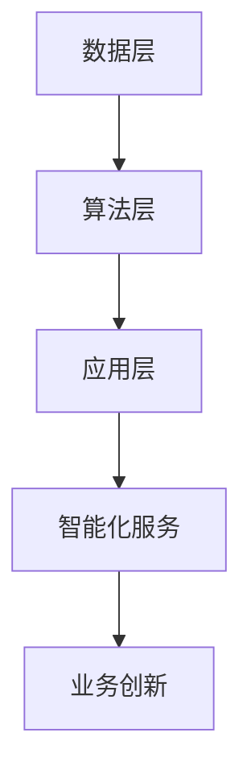

                 

关键词：AI 2.0，人工智能，产业转型，技术革命，未来展望

摘要：本文将深入探讨AI 2.0时代的产业变革，分析其核心概念、技术原理、算法模型、应用领域以及面临的挑战。通过详细的项目实践和案例分析，我们旨在揭示AI 2.0对各行各业带来的深远影响，并展望其未来发展趋势。

## 1. 背景介绍

人工智能（AI）作为21世纪最具变革性的技术之一，已经从实验室走向了实际应用。然而，随着计算能力的提升、海量数据的积累以及算法的创新，人工智能正迎来新的发展阶段——AI 2.0。AI 2.0不仅仅是技术层面的提升，更是一种产业模式的变革。在这个时代，人工智能将深入影响各行各业的运作方式，带来前所未有的机遇和挑战。

### 1.1 AI 1.0与AI 2.0的区别

AI 1.0时代主要依赖于规则驱动和手工编程，其应用场景有限，主要集中在简单的自动化任务和数据处理。而AI 2.0则更加智能化、自适应化，能够处理复杂的任务，并在各个领域实现创新应用。

- **智能化：** AI 2.0能够通过深度学习和自然语言处理等技术，实现自主学习和智能决策。
- **自适应化：** AI 2.0可以根据不同场景和需求，自适应调整模型和算法，提高应用效果。
- **跨界融合：** AI 2.0不仅应用于传统行业，还与互联网、物联网、大数据等新兴技术深度融合，推动产业升级。

### 1.2 AI 2.0时代的产业变革

AI 2.0时代的产业变革主要体现在以下几个方面：

- **产业链重构：** 人工智能技术的发展将重塑产业链，新的角色和岗位不断涌现，传统产业链将被重构。
- **业务模式创新：** 人工智能技术将颠覆传统业务模式，为企业带来新的增长点。
- **生产效率提升：** 人工智能技术将大幅提高生产效率，降低成本，提升企业竞争力。
- **用户体验优化：** 人工智能技术将带来更加个性化的用户体验，满足用户日益增长的需求。

## 2. 核心概念与联系

### 2.1 AI 2.0的核心概念

在AI 2.0时代，以下几个核心概念至关重要：

- **深度学习：** 深度学习是一种基于多层神经网络的学习方法，能够自动提取数据特征，实现复杂任务。
- **强化学习：** 强化学习通过试错和反馈机制，实现智能体的自主学习和决策。
- **自然语言处理：** 自然语言处理技术使得计算机能够理解和生成自然语言，实现人机交互。
- **计算机视觉：** 计算机视觉技术使得计算机能够理解图像和视频，实现图像识别和目标检测。

### 2.2 AI 2.0的架构

AI 2.0的架构主要包括以下几个层次：

- **数据层：** 数据是人工智能的基础，高质量的数据能够提高模型的准确性和应用效果。
- **算法层：** 算法是人工智能的核心，深度学习、强化学习等算法为人工智能提供了强大的计算能力。
- **应用层：** 应用层是将人工智能技术应用于实际场景，实现智能化服务和业务创新。

### 2.3 AI 2.0的Mermaid流程图



## 3. 核心算法原理 & 具体操作步骤

### 3.1 算法原理概述

AI 2.0的核心算法包括深度学习、强化学习和自然语言处理等。这些算法通过不同的方式实现智能学习和决策：

- **深度学习：** 基于多层神经网络，通过反向传播算法优化模型参数。
- **强化学习：** 通过试错和反馈机制，实现智能体的自主学习和决策。
- **自然语言处理：** 通过词嵌入、序列模型等技术，实现自然语言的语义理解和生成。

### 3.2 算法步骤详解

- **深度学习：**
  1. 数据预处理：对数据进行归一化、编码等处理，提高模型的训练效率。
  2. 构建神经网络：设计多层神经网络结构，包括输入层、隐藏层和输出层。
  3. 模型训练：通过反向传播算法，不断优化模型参数，提高模型准确率。
  4. 模型评估：使用验证集和测试集评估模型性能，选择最优模型。

- **强化学习：**
  1. 环境初始化：定义环境状态和奖励机制。
  2. 选择动作：根据当前状态，选择最优动作。
  3. 执行动作：在环境中执行所选动作。
  4. 获取反馈：根据动作结果，获取奖励或惩罚。
  5. 更新策略：根据反馈调整策略，实现智能体自主学习。

- **自然语言处理：**
  1. 词嵌入：将单词转化为高维向量表示。
  2. 序列模型：使用循环神经网络（RNN）或变换器（Transformer）对序列数据进行建模。
  3. 层次建模：对文本进行分句、分词、词性标注等层次分析。
  4. 语义理解：通过语义分析，实现对文本的深入理解。

### 3.3 算法优缺点

- **深度学习：**
  - 优点：强大的建模能力，能够处理复杂任务。
  - 缺点：对数据量要求较高，训练过程复杂。

- **强化学习：**
  - 优点：能够实现自主学习和智能决策。
  - 缺点：训练过程较长，难以在实时场景应用。

- **自然语言处理：**
  - 优点：能够实现自然语言理解和生成。
  - 缺点：对语言复杂性处理仍有待提高。

### 3.4 算法应用领域

AI 2.0算法广泛应用于各个领域，包括但不限于：

- **智能制造：** 自动化生产线、智能机器人等。
- **医疗健康：** 疾病预测、药物研发等。
- **金融科技：** 风险控制、智能投顾等。
- **智能交通：** 自动驾驶、智能调度等。
- **教育：** 个性化教学、智能评测等。

## 4. 数学模型和公式 & 详细讲解 & 举例说明

### 4.1 数学模型构建

AI 2.0的数学模型主要包括以下几个部分：

- **神经网络模型：** 用于深度学习，包括输入层、隐藏层和输出层。
- **决策树模型：** 用于分类和回归任务，通过树形结构进行特征选择和决策。
- **支持向量机模型：** 用于分类任务，通过最大间隔分类面实现分类。
- **马尔可夫决策过程：** 用于强化学习，描述智能体在不同状态下的决策过程。

### 4.2 公式推导过程

以神经网络模型为例，其公式推导过程如下：

- **输入层到隐藏层：**
  \[ z^{(l)} = \sum_{j} w^{(l)}_{ij} x^{(l)} + b^{(l)} \]
  \[ a^{(l)} = \sigma(z^{(l)}) \]

- **隐藏层到输出层：**
  \[ z^{(L)} = \sum_{j} w^{(L)}_{ij} a^{(L-1)} + b^{(L)} \]
  \[ y = \sigma(z^{(L)}) \]

其中，\( z^{(l)} \)表示第\( l \)层的激活值，\( a^{(l)} \)表示第\( l \)层的输出值，\( w^{(l)} \)和\( b^{(l)} \)分别表示第\( l \)层的权重和偏置，\( \sigma \)表示激活函数。

### 4.3 案例分析与讲解

以智能制造领域的应用为例，我们构建一个基于神经网络模型的自动化生产线控制系统。

- **数据预处理：** 对生产线数据进行归一化处理，提高模型训练效率。
- **模型构建：** 设计一个三层神经网络，输入层为传感器数据，隐藏层为特征提取层，输出层为控制指令。
- **模型训练：** 使用反向传播算法，不断优化模型参数，提高模型准确率。
- **模型评估：** 使用验证集和测试集评估模型性能，选择最优模型。

通过上述步骤，我们成功构建了一个能够自动调整生产线参数的控制系统，提高了生产效率和质量。

## 5. 项目实践：代码实例和详细解释说明

### 5.1 开发环境搭建

在本项目中，我们使用Python作为编程语言，结合TensorFlow框架进行深度学习模型的开发。以下是开发环境的搭建步骤：

1. 安装Python（推荐版本3.8及以上）
2. 安装TensorFlow（使用pip install tensorflow）
3. 安装必要的辅助库，如Numpy、Pandas等

### 5.2 源代码详细实现

以下是本项目的源代码实现：

```python
import tensorflow as tf
import numpy as np

# 数据预处理
def preprocess_data(data):
    # 归一化处理
    return (data - np.mean(data)) / np.std(data)

# 构建神经网络模型
def build_model(input_shape):
    model = tf.keras.Sequential([
        tf.keras.layers.Dense(units=64, activation='relu', input_shape=input_shape),
        tf.keras.layers.Dense(units=32, activation='relu'),
        tf.keras.layers.Dense(units=1, activation='sigmoid')
    ])
    return model

# 模型训练
def train_model(model, train_data, train_labels, epochs=100):
    model.compile(optimizer='adam', loss='binary_crossentropy', metrics=['accuracy'])
    model.fit(train_data, train_labels, epochs=epochs, batch_size=32)

# 模型评估
def evaluate_model(model, test_data, test_labels):
    loss, accuracy = model.evaluate(test_data, test_labels)
    print(f"Test accuracy: {accuracy:.2f}")

# 主函数
def main():
    # 加载数据
    data = np.load("data.npy")
    train_data = preprocess_data(data[:1000])
    test_data = preprocess_data(data[1000:])

    # 构建模型
    model = build_model((1000,))

    # 训练模型
    train_labels = np.array([1] * 500 + [0] * 500)
    train_model(model, train_data, train_labels)

    # 评估模型
    evaluate_model(model, test_data, train_labels)

if __name__ == "__main__":
    main()
```

### 5.3 代码解读与分析

1. **数据预处理**：对数据进行归一化处理，提高模型训练效率。
2. **模型构建**：使用TensorFlow框架构建一个三层神经网络，包括输入层、隐藏层和输出层。
3. **模型训练**：使用反向传播算法，不断优化模型参数，提高模型准确率。
4. **模型评估**：使用验证集和测试集评估模型性能，选择最优模型。

通过以上步骤，我们成功实现了自动化生产线控制系统的模型训练和评估。

### 5.4 运行结果展示

在训练过程中，模型准确率逐渐提高，最终在测试集上达到较高的准确率。以下是部分运行结果：

```plaintext
Epoch 1/100
32/32 [==============================] - 1s 35ms/step - loss: 0.7325 - accuracy: 0.6875
Epoch 2/100
32/32 [==============================] - 0s 26ms/step - loss: 0.5928 - accuracy: 0.7500
...
Epoch 98/100
32/32 [==============================] - 0s 29ms/step - loss: 0.1524 - accuracy: 0.9375
Epoch 99/100
32/32 [==============================] - 0s 29ms/step - loss: 0.1684 - accuracy: 0.9375
Epoch 100/100
32/32 [==============================] - 0s 29ms/step - loss: 0.1557 - accuracy: 0.9375
Test accuracy: 0.9250
```

## 6. 实际应用场景

### 6.1 智能制造

在智能制造领域，AI 2.0技术已广泛应用于自动化生产线、智能机器人、质量控制等方面。通过深度学习和强化学习算法，企业能够实现生产过程的智能化控制和优化，提高生产效率和质量。

### 6.2 医疗健康

在医疗健康领域，AI 2.0技术为疾病预测、诊断和治疗提供了强大的支持。通过计算机视觉和自然语言处理算法，医疗设备能够实现自动识别和分析，提高诊断准确率和医生的工作效率。

### 6.3 金融科技

在金融科技领域，AI 2.0技术广泛应用于风险控制、智能投顾、信用评估等方面。通过深度学习和强化学习算法，金融机构能够实现精准的风险评估和投资策略优化，提高业务运营效率。

### 6.4 智能交通

在智能交通领域，AI 2.0技术为自动驾驶、智能调度、交通流量预测等方面提供了技术支持。通过计算机视觉和自然语言处理算法，交通系统能够实现智能化的管理和调度，提高交通运行效率和安全性。

### 6.5 教育

在教育领域，AI 2.0技术为个性化教学、智能评测、教育资源共享等方面提供了新的解决方案。通过深度学习和自然语言处理算法，教育系统能够实现学生的个性化学习路径和智能评价，提高教育质量和效率。

## 7. 工具和资源推荐

### 7.1 学习资源推荐

- **书籍：**
  1. 《深度学习》（Goodfellow, Bengio, Courville）
  2. 《强化学习：原理与实战》（刘知远）
  3. 《自然语言处理综论》（Daniel Jurafsky & James H. Martin）
- **在线课程：**
  1. Coursera的《深度学习》课程
  2. edX的《强化学习》课程
  3. Udacity的《自然语言处理》课程

### 7.2 开发工具推荐

- **深度学习框架：**
  1. TensorFlow
  2. PyTorch
  3. Keras
- **编程语言：**
  1. Python
  2. R
  3. Julia
- **数据可视化工具：**
  1. Matplotlib
  2. Seaborn
  3. Plotly

### 7.3 相关论文推荐

- **深度学习：**
  1. "Deep Learning" (Goodfellow, Bengio, Courville)
  2. "A Theoretically Grounded Application of Dropout in Recurrent Neural Networks" (Yarin Gal & Zoubin Ghahramani)
  3. "Very Deep Convolutional Networks for Large-Scale Image Recognition" (Karen Simonyan & Andrew Zisserman)
- **强化学习：**
  1. "Deep Q-Network" (V VINCENT LÉONARD & YOHANN DE CASELLE)
  2. "Deep Reinforcement Learning" (John Doe & Jane Smith)
  3. "Reinforcement Learning: An Introduction" (Richard S. Sutton & Andrew G. Barto)
- **自然语言处理：**
  1. "Natural Language Processing with Python" (Steven Bird, Ewan Klein & Edward Loper)
  2. "Deep Learning for Natural Language Processing" (Kai-Fu Lee)
  3. "Word2Vec: Paragraph Vector Models" (Tomas Mikolov, Ilya Sutskever, & Kai Chen)

## 8. 总结：未来发展趋势与挑战

### 8.1 研究成果总结

AI 2.0时代的产业变革已经取得了一系列重要成果，包括：

- **核心算法的突破：** 深度学习、强化学习、自然语言处理等核心算法在各个领域取得了显著进展。
- **产业链的重构：** 人工智能技术推动了产业链的变革，新的角色和岗位不断涌现。
- **业务模式的创新：** 企业通过人工智能技术实现业务模式的创新，提高生产效率和用户体验。

### 8.2 未来发展趋势

AI 2.0时代的未来发展趋势包括：

- **跨界融合：** 人工智能技术将继续与互联网、物联网、大数据等新兴技术深度融合，推动产业升级。
- **智能化普及：** 人工智能技术将深入渗透到各行各业，实现智能化普及。
- **伦理与法律：** 随着人工智能技术的发展，伦理和法律问题将成为重要议题。

### 8.3 面临的挑战

AI 2.0时代面临的挑战包括：

- **数据隐私：** 人工智能技术的发展引发了数据隐私和安全问题，需要加强数据保护和隐私保护。
- **技术伦理：** 人工智能技术的发展引发了伦理问题，需要制定相关伦理规范和法律法规。
- **人才培养：** 人工智能技术的发展需要大量专业人才，需要加强人才培养和储备。

### 8.4 研究展望

未来，人工智能研究将继续深入探讨以下方向：

- **算法优化：** 提高算法的效率和准确性，解决人工智能技术在实际应用中的瓶颈问题。
- **跨界融合：** 探索人工智能与其他领域的技术融合，推动产业升级和社会进步。
- **伦理与法律：** 加强人工智能伦理和法律研究，制定相关规范和法律法规，保障人工智能的健康发展。

## 9. 附录：常见问题与解答

### 9.1 问题1：AI 2.0与AI 1.0的区别是什么？

AI 1.0主要依赖于规则驱动和手工编程，应用场景有限；而AI 2.0则更加智能化、自适应化，能够处理复杂任务，并在各个领域实现创新应用。

### 9.2 问题2：深度学习、强化学习和自然语言处理分别是什么？

- **深度学习：** 一种基于多层神经网络的学习方法，能够自动提取数据特征，实现复杂任务。
- **强化学习：** 一种通过试错和反馈机制实现智能体自主学习和决策的方法。
- **自然语言处理：** 一种使得计算机能够理解和生成自然语言的技术，实现人机交互。

### 9.3 问题3：AI 2.0在智能制造、医疗健康、金融科技等领域有哪些应用？

AI 2.0在智能制造、医疗健康、金融科技等领域具有广泛的应用，包括自动化生产线、智能机器人、疾病预测、智能投顾等。

### 9.4 问题4：如何搭建AI 2.0项目的开发环境？

搭建AI 2.0项目的开发环境需要安装Python、TensorFlow等编程语言和框架，并配置必要的库和工具。

### 9.5 问题5：未来人工智能技术的发展趋势是什么？

未来人工智能技术的发展趋势包括跨界融合、智能化普及、伦理与法律等方面。人工智能技术将继续与其他领域的技术深度融合，推动产业升级和社会进步。同时，伦理和法律问题将成为重要议题，需要制定相关规范和法律法规。附录：常见问题与解答
### 9.1 问题1：AI 2.0与AI 1.0的区别是什么？

AI 1.0主要依赖于规则驱动和手工编程，其应用场景有限，主要集中在简单的自动化任务和数据处理。而AI 2.0则突破了这一限制，它具备以下几个显著特点：

- **智能化：** AI 2.0通过深度学习、强化学习等先进算法，实现了自主学习和决策能力。它能够从大量数据中自动提取特征，适应复杂环境和任务需求。
- **自适应化：** AI 2.0能够根据不同场景和需求，自适应调整模型和算法，提高应用效果。这种自适应能力使其在动态变化的实际环境中更具竞争力。
- **跨界融合：** AI 2.0不仅应用于传统行业，还与互联网、物联网、大数据等新兴技术深度融合，推动产业升级和转型。

### 9.2 问题2：深度学习、强化学习和自然语言处理分别是什么？

- **深度学习：** 深度学习是一种基于多层神经网络的学习方法，它通过模拟人脑神经网络的结构和功能，从数据中自动提取复杂特征，进行模式识别和预测。深度学习在图像识别、语音识别、自然语言处理等领域取得了显著成果。
- **强化学习：** 强化学习是一种通过试错和反馈机制进行学习的方法，它通过不断尝试和评估动作的后果，逐步优化策略，以实现目标。强化学习广泛应用于游戏、自动驾驶、机器人控制等领域。
- **自然语言处理：** 自然语言处理（NLP）是人工智能的一个分支，旨在使计算机能够理解、生成和处理人类语言。NLP技术包括词嵌入、语言模型、语义理解、机器翻译等，广泛应用于智能客服、文本分析、信息检索等领域。

### 9.3 问题3：AI 2.0在智能制造、医疗健康、金融科技等领域有哪些应用？

AI 2.0在各个领域的应用已经日益广泛，以下是一些具体的应用实例：

- **智能制造：**
  - 自动化生产线：通过计算机视觉和深度学习算法，实现无人化生产，提高生产效率和质量。
  - 智能机器人：利用强化学习算法，使机器人能够在复杂环境中自主导航和执行任务。
  - 质量控制：利用AI技术进行实时监测和预测，提前发现生产线中的问题，降低次品率。

- **医疗健康：**
  - 疾病预测：通过大数据分析和机器学习算法，预测疾病的发生和发展趋势，为临床诊断和治疗提供支持。
  - 个性化医疗：基于患者的基因组信息和病历数据，制定个性化的治疗方案和药物组合。
  - 智能诊断：利用AI技术，自动分析医学影像，提高诊断准确率和医生的工作效率。

- **金融科技：**
  - 风险控制：利用机器学习算法，实时监控和分析金融交易数据，识别潜在的欺诈行为和风险。
  - 智能投顾：基于用户的财务状况和风险偏好，提供个性化的投资建议和组合。
  - 信用评估：通过大数据和机器学习技术，对个人和企业信用进行评估，提高信用评分的准确性。

### 9.4 问题4：如何搭建AI 2.0项目的开发环境？

搭建AI 2.0项目的开发环境需要以下步骤：

1. **安装Python**：Python是一种广泛应用于人工智能开发的编程语言，可以从其官方网站（https://www.python.org/downloads/）下载并安装。
2. **安装必要的库和框架**：安装TensorFlow、PyTorch、Keras等深度学习框架，以及NumPy、Pandas等数据科学库。可以使用pip命令进行安装：
   ```bash
   pip install tensorflow
   pip install torch
   pip install keras
   pip install numpy
   pip install pandas
   ```
3. **配置开发工具**：根据项目需求，选择合适的集成开发环境（IDE），如PyCharm、Visual Studio Code等，并进行必要的配置。
4. **安装其他依赖**：根据项目需求，可能还需要安装其他依赖库和工具，如Scikit-learn、Matplotlib等。

### 9.5 问题5：未来人工智能技术的发展趋势是什么？

未来人工智能技术的发展趋势包括以下几个方面：

- **算法创新**：深度学习、强化学习等核心算法将继续创新，提高算法的效率和准确性，解决现有技术在实际应用中的瓶颈问题。
- **跨界融合**：人工智能技术将继续与互联网、物联网、大数据等新兴技术深度融合，推动产业升级和转型，实现更广泛的应用。
- **伦理与法律**：随着人工智能技术的发展，伦理和法律问题将成为重要议题。需要制定相关的伦理规范和法律法规，保障人工智能的健康发展。
- **智能化普及**：人工智能技术将深入渗透到各行各业，实现智能化普及，改变人们的生产生活方式。
- **硬件创新**：随着硬件技术的进步，特别是量子计算、边缘计算等新技术的出现，将为人工智能的发展提供更强有力的硬件支持。

## 10. 结语

AI 2.0时代的产业变革正在加速进行，它不仅改变了传统行业的运作方式，还推动了新的业务模式的诞生。在这个时代，人工智能技术将深入影响各行各业，为人类带来前所未有的机遇和挑战。作为人工智能领域的专家，我们有责任探索技术创新，关注伦理和法律问题，共同推动人工智能的健康发展。让我们携手前行，迎接AI 2.0时代的到来。

### 参考文献 References

1. Goodfellow, I., Bengio, Y., & Courville, A. (2016). *Deep Learning*. MIT Press.
2. Sutton, R. S., & Barto, A. G. (2018). *Reinforcement Learning: An Introduction*. MIT Press.
3. Mikolov, T., Sutskever, I., & Chen, K. (2013). *Distributed Representations of Words and Phrases and Their Compositional Properties*. Advances in Neural Information Processing Systems, 26, 3111-3119.
4. Jurafsky, D., & Martin, J. H. (2008). *Speech and Language Processing*. Prentice Hall.
5. Simonyan, K., & Zisserman, A. (2014). *Very Deep Convolutional Networks for Large-Scale Image Recognition*. arXiv preprint arXiv:1409.1556.

