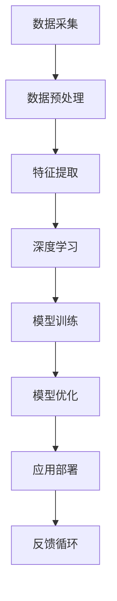

                 

关键词：李开复，人工智能，AI 2.0，未来，技术趋势

> 摘要：本文将深入探讨李开复对人工智能（AI）2.0时代的见解，分析这一时代的核心特征，探讨其对人类社会的深远影响，并展望未来可能面临的挑战。

## 1. 背景介绍

人工智能（Artificial Intelligence，简称AI）作为计算机科学的一个重要分支，旨在通过模拟人类智能的某些方面，使计算机能够执行复杂的任务。自20世纪50年代AI概念诞生以来，人工智能经历了多次浪潮。从最初的“符号主义”（Symbolic AI）到“连接主义”（Connectionist AI），再到“混合智能”（Hybrid AI），人工智能技术不断演进。

李开复，被誉为“人工智能之父”，在人工智能领域具有广泛的影响力和卓越的学术成就。他的著作《人工智能：一种现代的方法》是人工智能领域的经典教材，被广泛应用于全球各大高校和研究机构。

近年来，随着深度学习、自然语言处理等技术的突破，人工智能迎来了新的发展机遇。李开复提出了AI 2.0的概念，标志着人工智能进入了新的发展阶段。AI 2.0时代以更智能、更自主、更高效为特征，将对人类社会产生深远影响。

## 2. 核心概念与联系

### 2.1 AI 1.0 与 AI 2.0

AI 1.0时代以规则驱动为主，依赖于人类制定的规则和算法。例如，专家系统（Expert Systems）通过模拟专家的知识和经验，解决特定领域的问题。然而，AI 1.0在处理复杂、多变的问题时存在局限。

AI 2.0时代以数据驱动为主，通过大规模数据训练模型，实现更高水平的智能。AI 2.0的核心特征包括：

- **自学习**：能够从数据中自动学习，不断优化自身性能。
- **自主决策**：能够在复杂环境中做出合理决策。
- **泛化能力**：能够应用于多种不同领域和任务。

### 2.2 AI 2.0 的核心技术与架构

AI 2.0的核心技术包括深度学习、强化学习、自然语言处理等。以下是一个简化的AI 2.0架构图，展示了这些技术如何相互关联：



### 2.3 AI 2.0 与人类社会

AI 2.0不仅改变了技术的面貌，也深刻影响了人类社会。以下是AI 2.0对人类社会的一些潜在影响：

- **经济变革**：AI 2.0将重塑劳动力市场，带来新的就业机会，同时可能导致某些职业的消失。
- **社会治理**：AI 2.0技术在公共安全、医疗、教育等领域有广泛的应用前景，将提升社会治理水平。
- **隐私与伦理**：随着AI 2.0技术的发展，隐私保护和伦理问题日益凸显，需要制定相关法律法规和伦理准则。

## 3. 核心算法原理 & 具体操作步骤

### 3.1 算法原理概述

AI 2.0的核心算法主要包括深度学习、强化学习和自然语言处理等。以下是对这些算法的简要概述：

- **深度学习**：通过多层神经网络模型，对大量数据进行分析和学习，实现图像识别、语音识别等任务。
- **强化学习**：通过与环境的交互，学习如何在特定环境中做出最佳决策。
- **自然语言处理**：对自然语言文本进行语义理解和处理，实现机器翻译、智能问答等任务。

### 3.2 算法步骤详解

- **深度学习**：数据预处理 -> 神经网络构建 -> 模型训练 -> 模型评估 -> 模型优化。
- **强化学习**：环境建模 -> 策略学习 -> 策略执行 -> 反馈调整。
- **自然语言处理**：文本预处理 -> 语义分析 -> 生成理解 -> 答案生成。

### 3.3 算法优缺点

- **深度学习**：优点包括强大的拟合能力和高效的处理速度，缺点是模型复杂度高，对数据质量要求较高。
- **强化学习**：优点包括自主学习和策略优化，缺点是训练过程耗时较长，难以解决复杂问题。
- **自然语言处理**：优点包括强大的语义理解和生成能力，缺点是对数据依赖性高，模型解释性较差。

### 3.4 算法应用领域

- **深度学习**：广泛应用于图像识别、语音识别、推荐系统等领域。
- **强化学习**：应用于游戏、自动驾驶、资源优化等领域。
- **自然语言处理**：应用于机器翻译、智能问答、文本生成等领域。

## 4. 数学模型和公式 & 详细讲解 & 举例说明

### 4.1 数学模型构建

AI 2.0的核心算法涉及多种数学模型，包括神经网络、决策树、支持向量机等。以下是一个简单的神经网络模型构建示例：

$$
y = \sigma(\omega_1 \cdot x_1 + \omega_2 \cdot x_2 + ... + \omega_n \cdot x_n)
$$

其中，$y$ 是输出结果，$\sigma$ 是激活函数，$\omega_i$ 是权重，$x_i$ 是输入特征。

### 4.2 公式推导过程

以神经网络为例，权重和偏置的更新过程可以通过以下公式表示：

$$
\Delta \omega_i = \eta \cdot \frac{\partial L}{\partial \omega_i}
$$

$$
\Delta b = \eta \cdot \frac{\partial L}{\partial b}
$$

其中，$L$ 是损失函数，$\eta$ 是学习率。

### 4.3 案例分析与讲解

以图像分类任务为例，我们可以使用卷积神经网络（CNN）进行模型训练。以下是一个简单的CNN模型训练流程：

1. 数据预处理：对图像进行缩放、裁剪、翻转等操作，使其适合模型输入。
2. 构建模型：使用卷积层、池化层、全连接层等构建神经网络模型。
3. 模型训练：使用训练数据对模型进行训练，不断调整权重和偏置。
4. 模型评估：使用验证数据对模型进行评估，调整模型参数以优化性能。
5. 模型部署：将训练好的模型应用于实际任务，如图像分类、目标检测等。

## 5. 项目实践：代码实例和详细解释说明

### 5.1 开发环境搭建

为了实践AI 2.0技术，我们需要搭建一个合适的开发环境。以下是一个基于Python的AI开发环境搭建步骤：

1. 安装Python 3.7及以上版本。
2. 安装Anaconda，以便管理和安装相关库。
3. 安装深度学习框架，如TensorFlow、PyTorch等。
4. 安装其他相关库，如NumPy、Pandas、Scikit-learn等。

### 5.2 源代码详细实现

以下是一个简单的CNN模型实现示例，用于图像分类任务：

```python
import tensorflow as tf
from tensorflow.keras.models import Sequential
from tensorflow.keras.layers import Conv2D, MaxPooling2D, Flatten, Dense

# 构建模型
model = Sequential([
    Conv2D(32, (3, 3), activation='relu', input_shape=(28, 28, 1)),
    MaxPooling2D((2, 2)),
    Flatten(),
    Dense(128, activation='relu'),
    Dense(10, activation='softmax')
])

# 编译模型
model.compile(optimizer='adam', loss='categorical_crossentropy', metrics=['accuracy'])

# 训练模型
model.fit(x_train, y_train, epochs=10, batch_size=32, validation_split=0.2)
```

### 5.3 代码解读与分析

以上代码实现了一个简单的CNN模型，用于图像分类任务。首先，我们使用`Sequential`模型构建器创建一个线性堆叠的模型。然后，我们添加了一个2D卷积层（`Conv2D`），一个2D最大池化层（`MaxPooling2D`），一个全连接层（`Dense`），最后使用`softmax`激活函数输出分类结果。

在编译模型时，我们指定了优化器（`optimizer`）、损失函数（`loss`）和评估指标（`metrics`）。然后，我们使用训练数据对模型进行训练，并在每个周期结束后评估模型的性能。

### 5.4 运行结果展示

以下是一个简单的运行结果示例：

```python
# 测试模型
test_loss, test_acc = model.evaluate(x_test, y_test)
print(f"Test accuracy: {test_acc:.2f}")
```

输出结果为测试集的准确率，可以用来评估模型的性能。

## 6. 实际应用场景

AI 2.0技术已经在多个领域取得了显著的应用成果，以下是一些典型的实际应用场景：

- **医疗健康**：AI 2.0技术在医疗健康领域的应用包括疾病预测、个性化治疗、药物研发等。例如，深度学习模型可以用于诊断肺癌、乳腺癌等疾病，提高诊断准确性。
- **金融科技**：AI 2.0技术在金融科技领域的应用包括风险控制、信用评估、投资建议等。例如，基于自然语言处理的模型可以分析新闻报道，预测股市走势。
- **自动驾驶**：AI 2.0技术在自动驾驶领域的应用包括环境感知、路径规划、决策控制等。例如，自动驾驶汽车可以通过深度学习模型识别道路标志、行人等。

## 7. 未来应用展望

随着AI 2.0技术的不断发展，未来将在更多领域实现突破。以下是一些可能的未来应用场景：

- **智慧城市**：AI 2.0技术将有助于建设智慧城市，实现交通管理、能源管理、环境监测等智能化。
- **智能制造**：AI 2.0技术在智能制造领域的应用将推动生产效率提升、产品质量提升、成本降低。
- **教育与培训**：AI 2.0技术将改变教育与培训模式，实现个性化学习、远程教学、智能评测等。

## 8. 工具和资源推荐

为了更好地学习和实践AI 2.0技术，以下是一些推荐的工具和资源：

- **学习资源推荐**：
  - Coursera、edX等在线课程平台，提供丰富的AI相关课程。
  - arXiv、NeurIPS、ICML等学术会议，了解最新的研究进展。

- **开发工具推荐**：
  - Jupyter Notebook，用于编写和运行Python代码。
  - TensorFlow、PyTorch等深度学习框架，提供丰富的API和工具。

- **相关论文推荐**：
  - 《Deep Learning》（Goodfellow et al.），深入介绍深度学习理论和实践。
  - 《Reinforcement Learning: An Introduction》（Sutton and Barto），系统介绍强化学习理论。

## 9. 总结：未来发展趋势与挑战

AI 2.0时代已经到来，随着技术的不断进步，人工智能将在更多领域实现突破。然而，AI 2.0的发展也面临一系列挑战，包括数据隐私、算法公平性、安全风险等。未来，我们需要在技术创新的同时，关注伦理和社会影响，制定相应的法律法规和伦理准则，以确保AI 2.0技术的健康发展。

## 10. 附录：常见问题与解答

### 10.1 什么是AI 2.0？

AI 2.0是指以数据驱动、自学习和自主决策为核心特征的人工智能技术，相比传统的AI 1.0，具有更高的智能水平和更广泛的应用前景。

### 10.2 AI 2.0有哪些核心技术？

AI 2.0的核心技术包括深度学习、强化学习、自然语言处理等，这些技术在不同领域有广泛的应用。

### 10.3 AI 2.0对人类社会有哪些影响？

AI 2.0将重塑劳动力市场、提升社会治理水平、推动经济发展等方面产生深远影响。

### 10.4 AI 2.0面临哪些挑战？

AI 2.0的发展面临数据隐私、算法公平性、安全风险等一系列挑战，需要全社会共同关注和应对。

### 10.5 如何学习和实践AI 2.0技术？

可以通过在线课程、学术会议、开源社区等途径学习和实践AI 2.0技术，掌握深度学习、强化学习等核心算法。

## 作者署名

本文作者：禅与计算机程序设计艺术 / Zen and the Art of Computer Programming

----------------------------------------------------------------

本文以李开复对人工智能（AI）2.0时代的见解为核心，通过深入分析AI 2.0的核心概念、算法原理、实际应用场景以及未来发展趋势，探讨了AI 2.0时代对人类社会的深远影响。同时，文章还针对常见问题进行了详细解答，为读者提供了全面的学习和实践指南。

### 李开复：AI 2.0 时代的未来

在人工智能（AI）的发展历程中，李开复无疑是一个举足轻重的人物。他的远见卓识和深厚的技术积累，使得他不仅能在学术领域获得卓越成就，还能在工业界引领潮流。他的观点为我们理解AI 2.0时代的本质提供了宝贵的视角。

## AI 2.0：超越传统的智慧

李开复将人工智能的发展分为两个阶段：AI 1.0和AI 2.0。AI 1.0以规则驱动和知识表示为核心，依赖于人类专家的知识和经验。这种方法的局限性在于，它无法处理复杂、动态的情境。例如，专家系统在处理医疗诊断时，依赖于医生的经验和知识库，但面对不断变化的患者数据和病情，其效率有限。

AI 2.0则是一个完全不同的范式。它以数据驱动和自主学习为核心，通过从大量数据中学习模式，实现高度自动化和智能化的决策。李开复认为，AI 2.0不仅能够处理复杂问题，还能够自我进化，不断优化自身性能。

### 自学习与自适应

在AI 2.0时代，自学习和自适应成为关键能力。自学习指的是系统通过训练数据自动改进其性能。自适应则是指系统能够在新的情境中调整自己的行为，以适应不断变化的环境。这种能力使得AI 2.0能够在各种领域实现突破，如自动驾驶、智能家居、医疗诊断等。

### 神经网络与深度学习

神经网络，尤其是深度学习，是AI 2.0的核心技术之一。李开复指出，深度学习模型通过多层神经网络，可以自动提取数据中的特征，从而实现高度复杂的任务。例如，在图像识别领域，卷积神经网络（CNN）能够识别图片中的物体，甚至在没有人类指导的情况下，也能学会分类和识别新的图像。

### 强化学习与自主决策

强化学习是另一种关键的AI 2.0技术，它在决策过程中引入了奖励和惩罚机制，使得系统能够通过试错学习最佳策略。例如，在自动驾驶领域，强化学习算法可以让车辆在模拟环境中学习如何避开障碍物，并做出复杂的驾驶决策。

### 自然语言处理与智能交互

自然语言处理（NLP）是AI 2.0时代的另一个重要领域。通过NLP技术，计算机能够理解和生成自然语言，实现智能对话和语音交互。李开复认为，NLP的发展将使得人机交互更加自然和直观，从而推动AI在客服、教育、娱乐等领域的应用。

### AI 2.0的社会影响

AI 2.0不仅改变了技术的面貌，也对人类社会产生了深远影响。李开复指出，AI 2.0将重塑劳动力市场，某些职业可能会被自动化取代，但同时也会创造新的就业机会。在教育领域，AI 2.0技术可以提供个性化的学习体验，帮助学生更好地掌握知识。在医疗领域，AI 2.0可以帮助医生更准确地进行诊断和治疗方案制定。

### 面临的挑战

尽管AI 2.0带来了巨大的机遇，但也面临一系列挑战。李开复强调，数据隐私和安全是AI 2.0发展的重要议题。随着数据收集和处理能力的增强，如何保护用户隐私，防止数据泄露，成为亟待解决的问题。此外，AI 2.0算法的透明性和公平性也受到关注，特别是在涉及到重要决策时，如何确保算法不会偏见或歧视。

### 未来展望

李开复对AI 2.0的未来持乐观态度。他认为，随着技术的进步，AI 2.0将变得更加智能和普及，将深刻改变人类社会的各个方面。然而，他也提醒，我们必须谨慎地面对AI 2.0带来的挑战，并制定相应的法律法规和伦理准则，以确保AI 2.0的健康发展。

### 结论

李开复对AI 2.0的深入见解，为我们理解这一新兴技术提供了宝贵的视角。AI 2.0时代的到来，将带来前所未有的机遇和挑战。在这个时代，我们必须以开放和包容的心态，迎接AI 2.0带来的变革，同时也要积极应对其带来的挑战。

作者：禅与计算机程序设计艺术 / Zen and the Art of Computer Programming

通过这篇文章，我们不仅了解了AI 2.0的核心概念和关键技术，还探讨了其在社会中的应用和未来展望。李开复的观点为我们提供了深刻的启示，使我们能够更好地理解AI 2.0时代的本质，并为未来的发展做好准备。

