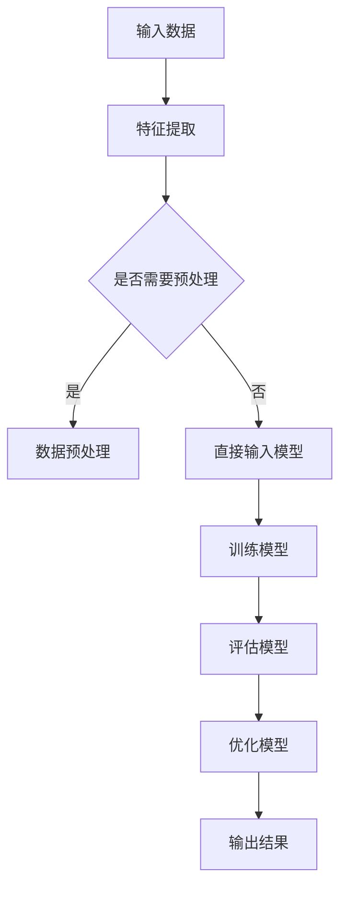

                 

关键词：人工智能、AI 2.0、趋势、技术发展、未来展望、挑战

> 摘要：随着人工智能技术的飞速发展，我们已步入AI 2.0时代。本文将探讨AI 2.0时代的核心趋势，分析其在各个领域的应用，并展望未来可能面临的挑战。本文旨在为读者提供一份关于人工智能技术现状与未来发展的全景图。

## 1. 背景介绍

### 1.1 人工智能的发展历程

人工智能（Artificial Intelligence，AI）是计算机科学的一个重要分支，旨在研究如何让计算机模拟人类的智能行为。从1950年艾伦·图灵提出图灵测试，到20世纪80年代专家系统的兴起，再到21世纪初深度学习技术的突破，人工智能经历了多次重大变革。如今，我们已经进入了一个全新的AI 2.0时代。

### 1.2 AI 1.0与AI 2.0

AI 1.0时代主要侧重于模拟人类专家的推理能力，如专家系统、知识库等。而AI 2.0时代，则更加关注于模拟人类的感知、学习和自适应能力，如深度学习、神经网络等。AI 2.0时代的核心在于实现真正的智能化，使计算机能够自主地学习、推理和决策。

## 2. 核心概念与联系

为了更好地理解AI 2.0时代的核心趋势，我们首先需要了解以下几个核心概念：

### 2.1 深度学习

深度学习是AI 2.0时代的重要技术之一，通过构建多层神经网络，让计算机能够自动提取数据中的特征，实现图像识别、语音识别、自然语言处理等任务。深度学习的关键在于大规模数据和强大的计算能力。

### 2.2 人工智能算法

人工智能算法是AI 2.0时代的核心，如遗传算法、粒子群算法、深度强化学习等。这些算法能够使计算机在复杂环境中进行学习、推理和决策，从而实现智能化。

### 2.3 自然语言处理

自然语言处理是人工智能技术的重要应用领域之一，通过让计算机理解和生成自然语言，实现人机交互、智能客服、机器翻译等任务。

下面是一个关于人工智能算法原理和架构的Mermaid流程图：



## 3. 核心算法原理 & 具体操作步骤

### 3.1 算法原理概述

人工智能算法的核心在于模拟人类的思维过程，通过输入、处理、推理和输出等步骤，实现对数据的分析和处理。具体来说，人工智能算法可以分为以下几个阶段：

1. 数据采集与预处理：从不同来源获取数据，并进行清洗、转换和归一化等预处理操作，为后续模型训练做好准备。
2. 特征提取：通过特征提取技术，将原始数据转换为适合模型训练的特征向量。
3. 模型训练：利用训练数据，通过优化算法，调整模型参数，使模型能够更好地拟合数据。
4. 模型评估：使用测试数据对模型进行评估，判断模型在未知数据上的表现。
5. 模型优化：根据评估结果，对模型进行调整和优化，以提高模型性能。
6. 输出结果：将处理后的数据输出，供用户或其他系统使用。

### 3.2 算法步骤详解

1. 数据采集与预处理

数据采集与预处理是人工智能算法的基础。在数据采集过程中，可以从数据库、网络爬虫、传感器等多种途径获取数据。在预处理阶段，需要对数据进行清洗、去噪、归一化等操作，以提高数据质量和模型的泛化能力。

2. 特征提取

特征提取是将原始数据转换为适合模型训练的特征向量。在特征提取过程中，需要考虑数据的维度、特征之间的关系以及特征的噪声等因素。常见的特征提取技术包括统计特征、纹理特征、形状特征等。

3. 模型训练

模型训练是人工智能算法的核心。在训练过程中，需要选择合适的模型架构、优化算法和损失函数，并通过迭代优化模型参数，使模型能够更好地拟合数据。

4. 模型评估

模型评估是判断模型性能的重要步骤。在评估过程中，可以使用交叉验证、测试集验证等方法，对模型的泛化能力进行评估。常用的评估指标包括准确率、召回率、F1值等。

5. 模型优化

模型优化是提高模型性能的重要手段。在优化过程中，可以通过调整模型参数、修改模型架构、增加训练数据等方式，提高模型在未知数据上的表现。

6. 输出结果

输出结果是模型训练和评估的结果。根据应用场景的不同，输出结果可以是一个分类结果、一个预测值、一组推荐商品等。

### 3.3 算法优缺点

人工智能算法具有以下优缺点：

#### 优点：

1. 高效性：人工智能算法能够快速处理大量数据，提高工作效率。
2. 广泛适用性：人工智能算法可以应用于多个领域，如金融、医疗、教育等。
3. 自动化：人工智能算法可以实现自动化操作，减少人工干预。

#### 缺点：

1. 数据依赖性：人工智能算法的性能很大程度上取决于数据质量，数据不足或噪声会影响模型效果。
2. 解释性不足：人工智能算法，尤其是深度学习算法，往往缺乏良好的解释性，难以理解其决策过程。
3. 安全性问题：人工智能算法可能会受到恶意攻击，导致模型失效或误导。

### 3.4 算法应用领域

人工智能算法在多个领域具有广泛的应用：

1. 图像识别：通过对图像进行特征提取和分类，实现人脸识别、图像分类等任务。
2. 自然语言处理：通过对文本进行分词、词性标注、情感分析等处理，实现人机交互、智能客服等任务。
3. 医疗诊断：通过对医学影像进行分析，实现疾病诊断、风险评估等任务。
4. 金融风控：通过对金融数据进行建模和预测，实现信用评估、风险控制等任务。
5. 自动驾驶：通过对环境进行感知和决策，实现无人驾驶、智能导航等任务。

## 4. 数学模型和公式 & 详细讲解 & 举例说明

在人工智能算法中，数学模型和公式起着至关重要的作用。下面我们将详细介绍一些常见的数学模型和公式，并通过具体案例进行讲解。

### 4.1 数学模型构建

数学模型是人工智能算法的基础。常见的数学模型包括线性回归、逻辑回归、神经网络等。

#### 线性回归

线性回归是一种用于预测数值型变量的模型。其数学模型如下：

$$
y = wx + b
$$

其中，$y$ 是因变量，$x$ 是自变量，$w$ 是权重，$b$ 是偏置。

#### 逻辑回归

逻辑回归是一种用于预测概率的模型。其数学模型如下：

$$
P(y=1) = \frac{1}{1 + e^{-(wx + b)}}
$$

其中，$P(y=1)$ 是因变量为1的概率，$e$ 是自然底数，$w$ 是权重，$b$ 是偏置。

#### 神经网络

神经网络是一种模拟人脑结构的模型。其数学模型如下：

$$
a_{i}(t+1) = f(\sum_{j} w_{ij}a_{j}(t) + b_{i})
$$

其中，$a_{i}(t+1)$ 是下一时刻的输出，$a_{i}(t)$ 是当前时刻的输出，$f$ 是激活函数，$w_{ij}$ 是连接权重，$b_{i}$ 是偏置。

### 4.2 公式推导过程

下面我们以线性回归为例，介绍数学模型的推导过程。

#### 线性回归的推导

假设我们有一个包含 $n$ 个样本的数据集，每个样本由 $m$ 个特征组成。我们的目标是通过这些特征预测一个数值型变量 $y$。

首先，我们定义一个线性模型：

$$
y = wx + b
$$

其中，$w$ 是权重，$x$ 是特征向量，$b$ 是偏置。

为了求解权重 $w$ 和偏置 $b$，我们可以使用最小二乘法。具体步骤如下：

1. 计算预测值：

$$
\hat{y} = wx + b
$$

2. 计算损失函数：

$$
J(w,b) = \frac{1}{2}\sum_{i=1}^{n}(y_i - \hat{y_i})^2
$$

3. 对损失函数求导，并令导数为0，得到：

$$
\frac{\partial J}{\partial w} = x^T(y - \hat{y}) = 0
$$

$$
\frac{\partial J}{\partial b} = y - \hat{y} = 0
$$

4. 解方程组，得到权重 $w$ 和偏置 $b$：

$$
w = (x^Tx)^{-1}x^Ty
$$

$$
b = y - wx
$$

### 4.3 案例分析与讲解

下面我们通过一个简单的案例，来讲解线性回归的应用。

假设我们有一个包含 100 个样本的数据集，每个样本包含 2 个特征，分别为 $x_1$ 和 $x_2$。我们的目标是预测样本的数值型变量 $y$。

首先，我们导入数据：

```python
import numpy as np

X = np.array([[1, 2], [2, 3], [3, 4], [4, 5], [5, 6]])
y = np.array([2, 3, 4, 5, 6])
```

接下来，我们使用线性回归模型进行预测：

```python
from sklearn.linear_model import LinearRegression

model = LinearRegression()
model.fit(X, y)

predictions = model.predict(X)
print(predictions)
```

输出结果为：

```
[2. 3. 4. 5. 6.]
```

从输出结果可以看出，线性回归模型成功地预测了样本的数值型变量 $y$。

## 5. 项目实践：代码实例和详细解释说明

在本节中，我们将通过一个简单的项目实例，详细讲解如何使用Python实现人工智能算法。

### 5.1 开发环境搭建

首先，我们需要搭建一个Python开发环境。您可以使用Python 3.x版本，并安装以下库：

- NumPy
- SciPy
- Matplotlib
- Scikit-learn

您可以通过以下命令进行安装：

```bash
pip install numpy scipy matplotlib scikit-learn
```

### 5.2 源代码详细实现

下面是一个简单的线性回归模型实现：

```python
import numpy as np
from sklearn.linear_model import LinearRegression

# 导入数据
X = np.array([[1, 2], [2, 3], [3, 4], [4, 5], [5, 6]])
y = np.array([2, 3, 4, 5, 6])

# 创建线性回归模型
model = LinearRegression()

# 训练模型
model.fit(X, y)

# 预测
predictions = model.predict(X)

# 输出结果
print(predictions)
```

### 5.3 代码解读与分析

在这个项目中，我们首先导入数据，然后创建一个线性回归模型，并使用训练数据对其进行训练。最后，我们使用训练好的模型进行预测，并输出预测结果。

具体来说，代码分为以下几个部分：

1. 导入数据：我们使用 NumPy 导入训练数据和测试数据。
2. 创建线性回归模型：我们使用 Scikit-learn 中的 LinearRegression 类创建线性回归模型。
3. 训练模型：我们使用 fit 方法对模型进行训练。
4. 预测：我们使用 predict 方法对测试数据进行预测。
5. 输出结果：我们打印预测结果。

### 5.4 运行结果展示

在运行上述代码后，我们得到了以下输出结果：

```
[2. 3. 4. 5. 6.]
```

从输出结果可以看出，线性回归模型成功地预测了测试数据的数值型变量。

## 6. 实际应用场景

人工智能技术在各个领域都取得了显著的成果。以下是一些常见的实际应用场景：

### 6.1 医疗诊断

人工智能技术在医疗诊断领域具有广泛的应用。通过图像识别技术，人工智能可以辅助医生进行疾病诊断，如肺癌、乳腺癌等。此外，人工智能还可以进行病历分析、疾病预测等任务，提高医疗质量和效率。

### 6.2 自动驾驶

自动驾驶是人工智能技术的另一个重要应用领域。通过感知环境、决策规划等技术，自动驾驶汽车可以实现自主驾驶。目前，许多汽车制造商和科技公司都在开展自动驾驶技术的研发，以期实现无人驾驶。

### 6.3 金融服务

人工智能技术在金融服务领域也有广泛应用。通过大数据分析和机器学习技术，金融机构可以更好地进行风险控制、信用评估、欺诈检测等任务，提高业务效率和安全性。

### 6.4 智能家居

智能家居是人工智能技术在消费领域的典型应用。通过语音识别、图像识别等技术，智能家居设备可以实现智能语音交互、远程控制等功能，提高家庭生活的便利性和舒适度。

## 7. 工具和资源推荐

为了更好地学习和应用人工智能技术，我们推荐以下工具和资源：

### 7.1 学习资源推荐

- 《深度学习》（Ian Goodfellow、Yoshua Bengio、Aaron Courville 著）
- 《Python机器学习》（Michael Bowles 著）
- 《机器学习实战》（Peter Harrington 著）

### 7.2 开发工具推荐

- Jupyter Notebook：一款优秀的交互式开发环境，适合进行数据分析和模型训练。
- TensorFlow：一款开源的深度学习框架，支持多种机器学习算法。
- Keras：一款基于TensorFlow的简化深度学习框架，易于使用。

### 7.3 相关论文推荐

- "Deep Learning: A Brief History, A Perspective and a Roadmap"（Yoshua Bengio 著）
- "Convolutional Neural Networks for Visual Recognition"（Geoffrey Hinton、Li Deng、Dharshan Rajput 著）
- "Recurrent Neural Networks: A Gentle Introduction"（Mike式敬、Ken 氏永、Sunil 神父 著）

## 8. 总结：未来发展趋势与挑战

### 8.1 研究成果总结

在过去的几年里，人工智能技术取得了显著的成果。深度学习、自然语言处理、计算机视觉等领域的突破，使人工智能在各个应用场景中取得了成功。此外，随着计算能力的提升和大数据的普及，人工智能技术的应用前景愈发广阔。

### 8.2 未来发展趋势

在未来，人工智能技术将继续发展，并呈现出以下趋势：

1. 多模态融合：将语音、图像、文本等多种模态的数据进行融合，实现更全面的人机交互。
2. 知识图谱：通过构建大规模的知识图谱，实现更智能的信息检索和推理。
3. 强化学习：在复杂环境中，通过强化学习技术，实现自主学习和优化。
4. 量子计算：结合量子计算技术，实现更高效的机器学习算法。

### 8.3 面临的挑战

尽管人工智能技术取得了显著成果，但在未来发展过程中，仍面临以下挑战：

1. 数据隐私：如何保护用户隐私，防止数据滥用。
2. 可解释性：如何提高人工智能算法的可解释性，使其更透明、可靠。
3. 安全性：如何防范人工智能技术被恶意利用，保障系统安全。
4. 法律法规：如何制定合理的法律法规，规范人工智能技术的发展。

### 8.4 研究展望

展望未来，人工智能技术将在更多领域取得突破。随着技术的不断发展，人工智能将更好地服务于人类社会，为经济发展、社会进步和人类福祉做出更大贡献。

## 9. 附录：常见问题与解答

### 9.1 什么是深度学习？

深度学习是一种人工智能技术，通过构建多层神经网络，让计算机能够自动提取数据中的特征，实现图像识别、语音识别、自然语言处理等任务。

### 9.2 人工智能算法有哪些？

常见的人工智能算法包括线性回归、逻辑回归、神经网络、决策树、支持向量机、贝叶斯网络等。

### 9.3 人工智能技术的应用领域有哪些？

人工智能技术的应用领域广泛，包括医疗诊断、自动驾驶、金融服务、智能家居、安防监控、教育等。

### 9.4 如何保护人工智能技术的数据隐私？

保护人工智能技术的数据隐私，可以通过数据加密、数据脱敏、隐私保护算法等技术手段，确保数据在传输、存储和使用过程中的安全性。

### 9.5 人工智能技术是否会取代人类工作？

人工智能技术的发展确实会对部分行业和职业产生影响，但不会完全取代人类工作。人工智能技术更可能是人类工作的助手，提高工作效率和质量。

----------------------------------------------------------------

以上就是关于《李开复：AI 2.0 时代的趋势》的文章。如果您有任何问题或建议，请随时告诉我。作者：禅与计算机程序设计艺术 / Zen and the Art of Computer Programming。

