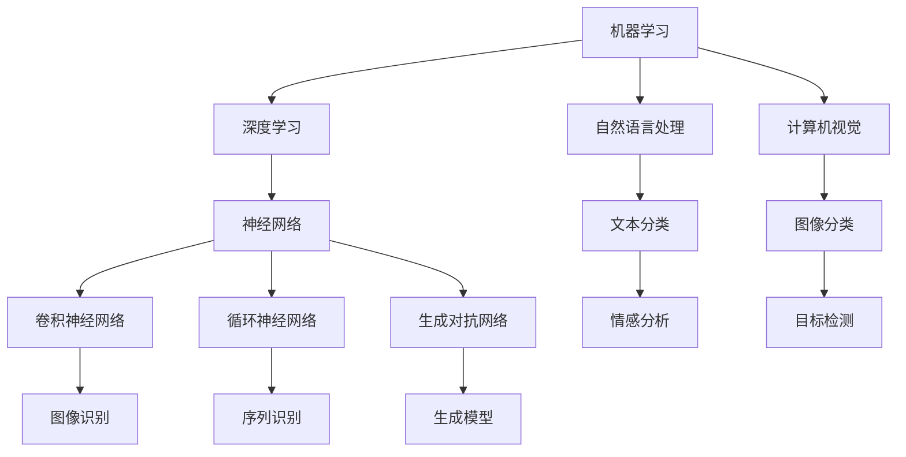

                 

关键词：苹果，AI应用，人工智能，应用发布，技术趋势，开发实践

摘要：本文将探讨苹果公司近日发布的AI应用，分析其背后的技术原理和应用场景，并展望未来人工智能在智能手机领域的应用前景。通过对苹果AI应用的核心算法、数学模型、项目实践等方面的深入分析，本文旨在为读者提供对当前人工智能技术的全面了解。

## 1. 背景介绍

随着人工智能技术的快速发展，苹果公司作为全球领先的科技公司，也在不断推出基于人工智能的应用。近日，苹果公司发布了一款名为“AI助手”的应用，该应用旨在为用户提供个性化、智能化的服务。本文将重点关注这款应用的技术原理和应用价值。

### 1.1 人工智能的发展历程

人工智能（AI）是计算机科学的一个分支，旨在使计算机具备智能行为，模拟人类的思维过程。自20世纪50年代起，人工智能经历了多个发展阶段，从最初的符号主义、知识表示，到连接主义、统计学习等。近年来，随着深度学习、自然语言处理等技术的突破，人工智能迎来了新一轮的发展高潮。

### 1.2 苹果公司在人工智能领域的布局

苹果公司在人工智能领域有着深厚的积累。早在2011年，苹果公司就收购了Siri公司，并将其整合到自家产品中。此外，苹果公司在语音识别、图像处理、自然语言处理等领域也有多项重要专利。此次发布的AI助手应用，正是苹果公司人工智能技术的一次重要实践。

## 2. 核心概念与联系

### 2.1 人工智能核心概念

人工智能的核心概念包括：机器学习、深度学习、自然语言处理、计算机视觉等。这些技术相互关联，共同推动了人工智能的发展。

#### 2.1.1 机器学习

机器学习是一种让计算机从数据中自动学习和改进的方法。它主要包括监督学习、无监督学习和强化学习三种类型。监督学习通过已有的输入和输出数据训练模型，无监督学习则仅使用输入数据，无需输出标签，强化学习则是通过不断试错来学习最优策略。

#### 2.1.2 深度学习

深度学习是机器学习的一个分支，它通过模拟人脑的神经网络结构，实现对数据的层次化表示和特征提取。深度学习的代表性算法包括卷积神经网络（CNN）、循环神经网络（RNN）和生成对抗网络（GAN）等。

#### 2.1.3 自然语言处理

自然语言处理是使计算机能够理解和处理自然语言的技术。它主要包括文本分类、情感分析、机器翻译、语音识别等任务。

#### 2.1.4 计算机视觉

计算机视觉是使计算机能够理解和解释图像和视频的技术。它主要包括图像分类、目标检测、图像分割等任务。

### 2.2 Mermaid流程图

以下是一个简单的Mermaid流程图，展示人工智能的核心概念及其相互关系：



## 3. 核心算法原理 & 具体操作步骤

### 3.1 算法原理概述

苹果公司发布的AI助手应用主要基于深度学习和自然语言处理技术。具体来说，应用中包含了以下核心算法：

#### 3.1.1 卷积神经网络（CNN）

CNN是一种专门用于处理图像数据的神经网络。它通过卷积层、池化层和全连接层等结构，实现对图像的层次化表示和特征提取。CNN在图像分类、目标检测等任务中具有出色的表现。

#### 3.1.2 循环神经网络（RNN）

RNN是一种用于处理序列数据的神经网络。它通过递归的方式处理输入序列，从而捕捉序列中的时间依赖关系。RNN在自然语言处理任务中有着广泛的应用，如文本分类、情感分析等。

#### 3.1.3 生成对抗网络（GAN）

GAN是一种由生成器和判别器组成的对抗性神经网络。生成器负责生成数据，判别器负责区分真实数据和生成数据。GAN在图像生成、语音合成等领域取得了显著的成果。

### 3.2 算法步骤详解

#### 3.2.1 数据预处理

在训练模型之前，需要对数据进行预处理。包括数据清洗、归一化、数据增强等操作。对于图像数据，可以采用随机裁剪、旋转、翻转等方法进行数据增强。

#### 3.2.2 模型训练

使用预处理后的数据训练模型。对于CNN，可以采用卷积层、池化层和全连接层等结构进行训练；对于RNN，可以采用嵌入层、循环层和输出层等结构进行训练；对于GAN，可以采用生成器和判别器的对抗训练。

#### 3.2.3 模型评估

在训练过程中，需要对模型进行评估。常用的评估指标包括准确率、召回率、F1值等。对于分类任务，可以使用交叉验证、混淆矩阵等方法进行评估。

#### 3.2.4 模型部署

将训练好的模型部署到应用中。对于苹果公司的AI助手应用，可以将模型集成到iOS系统中，实现实时推理和预测。

### 3.3 算法优缺点

#### 3.3.1 优点

- CNN在图像处理方面具有出色的性能；
- RNN在自然语言处理方面具有较强的序列建模能力；
- GAN在图像生成和语音合成方面具有广泛的应用潜力。

#### 3.3.2 缺点

- CNN对图像尺寸有一定的要求，不适用于变长的序列数据；
- RNN在处理长序列时容易出现梯度消失或爆炸问题；
- GAN的训练过程较为复杂，且容易陷入局部最优。

### 3.4 算法应用领域

苹果公司的AI助手应用在多个领域具有广泛的应用前景，包括：

- 图像分类：用于识别用户拍摄的照片中的物体和场景；
- 文本分类：用于分析用户输入的文本，提供个性化推荐；
- 语音合成：用于生成自然流畅的语音，辅助语音助手实现更多功能；
- 图像生成：用于创建虚拟图像、艺术作品等。

## 4. 数学模型和公式 & 详细讲解 & 举例说明

### 4.1 数学模型构建

在人工智能应用中，常用的数学模型包括线性模型、逻辑回归模型、神经网络模型等。

#### 4.1.1 线性模型

线性模型是一种最简单的预测模型，它通过线性关系来预测输出。其数学公式如下：

$$y = \beta_0 + \beta_1x$$

其中，$y$ 是预测值，$x$ 是输入特征，$\beta_0$ 和 $\beta_1$ 是模型的参数。

#### 4.1.2 逻辑回归模型

逻辑回归模型是一种常用的分类模型，它通过概率的方式来预测输出。其数学公式如下：

$$P(y=1) = \frac{1}{1 + e^{-(\beta_0 + \beta_1x)}$$

其中，$y$ 是输出标签，$x$ 是输入特征，$\beta_0$ 和 $\beta_1$ 是模型的参数。

#### 4.1.3 神经网络模型

神经网络模型是一种复杂的非线性模型，它通过多层神经元实现输入到输出的映射。其数学公式如下：

$$z = \sum_{i=1}^{n} w_{i}x_i + b$$
$$a = \sigma(z)$$

其中，$z$ 是中间层的输出，$x_i$ 是输入特征，$w_i$ 是权重，$b$ 是偏置，$\sigma$ 是激活函数。

### 4.2 公式推导过程

以逻辑回归模型为例，我们介绍其公式的推导过程。

首先，我们考虑一个简单的线性模型：

$$y = \beta_0 + \beta_1x$$

为了使其适用于分类问题，我们引入概率的概念。假设输入特征 $x$ 和输出标签 $y$ 之间存在线性关系，我们可以通过最大化似然函数来估计参数 $\beta_0$ 和 $\beta_1$：

$$L(\beta_0, \beta_1) = \prod_{i=1}^{n} P(y_i|x_i, \beta_0, \beta_1)$$

由于概率乘积具有指数形式，我们可以取对数似然函数：

$$\ln L(\beta_0, \beta_1) = \sum_{i=1}^{n} \ln P(y_i|x_i, \beta_0, \beta_1)$$

为了简化问题，我们假设输出标签 $y$ 只有两个取值 0 和 1，即：

$$P(y=1|x, \beta_0, \beta_1) = p = \frac{1}{1 + e^{-(\beta_0 + \beta_1x)}}$$
$$P(y=0|x, \beta_0, \beta_1) = 1 - p$$

将概率分布代入对数似然函数：

$$\ln L(\beta_0, \beta_1) = \sum_{i=1}^{n} y_i \ln p_i + (1 - y_i) \ln (1 - p_i)$$

为了最大化对数似然函数，我们可以对其求导并令导数为0：

$$\frac{\partial \ln L(\beta_0, \beta_1)}{\partial \beta_0} = \sum_{i=1}^{n} y_i - \sum_{i=1}^{n} p_i = 0$$
$$\frac{\partial \ln L(\beta_0, \beta_1)}{\partial \beta_1} = \sum_{i=1}^{n} (y_i - p_i)x_i = 0$$

化简后，我们得到：

$$\beta_0 = \frac{1}{n} \sum_{i=1}^{n} y_i - \beta_1 \frac{1}{n} \sum_{i=1}^{n} x_i$$
$$\beta_1 = \frac{1}{n} \sum_{i=1}^{n} (y_i - p_i)x_i$$

通过上述推导，我们得到了逻辑回归模型的参数估计方法。

### 4.3 案例分析与讲解

#### 4.3.1 逻辑回归模型在分类任务中的应用

假设我们要对一组新闻文章进行分类，将其分为政治、经济、体育等类别。已知每个新闻文章包含多个特征，如标题、正文、作者等。我们的目标是训练一个逻辑回归模型，预测新闻文章的类别。

首先，我们需要收集并预处理数据。对于特征，我们可以将其转换为数值表示，如使用词袋模型将标题和正文转换为词频矩阵。然后，我们将数据分为训练集和测试集。

接下来，我们训练逻辑回归模型。可以使用 scikit-learn 库中的 `LogisticRegression` 类来实现。具体代码如下：

```python
from sklearn.linear_model import LogisticRegression
from sklearn.model_selection import train_test_split
from sklearn.metrics import accuracy_score

# 加载并预处理数据
X, y = load_data()

# 划分训练集和测试集
X_train, X_test, y_train, y_test = train_test_split(X, y, test_size=0.2, random_state=42)

# 训练逻辑回归模型
model = LogisticRegression()
model.fit(X_train, y_train)

# 预测测试集
y_pred = model.predict(X_test)

# 计算准确率
accuracy = accuracy_score(y_test, y_pred)
print("Accuracy:", accuracy)
```

通过上述代码，我们可以得到模型的准确率。在实际应用中，我们还可以通过交叉验证、调整超参数等方法来优化模型性能。

#### 4.3.2 逻辑回归模型在回归任务中的应用

逻辑回归模型不仅可以用于分类任务，还可以用于回归任务。例如，我们可以使用逻辑回归模型预测房价。已知每个房屋的特征，如面积、房龄、位置等，我们的目标是预测房屋的价格。

与分类任务类似，我们需要收集并预处理数据，然后使用逻辑回归模型进行训练。具体代码如下：

```python
from sklearn.linear_model import LinearRegression
from sklearn.model_selection import train_test_split
from sklearn.metrics import mean_squared_error

# 加载并预处理数据
X, y = load_housing_data()

# 划分训练集和测试集
X_train, X_test, y_train, y_test = train_test_split(X, y, test_size=0.2, random_state=42)

# 训练线性回归模型
model = LinearRegression()
model.fit(X_train, y_train)

# 预测测试集
y_pred = model.predict(X_test)

# 计算均方误差
mse = mean_squared_error(y_test, y_pred)
print("MSE:", mse)
```

通过上述代码，我们可以得到模型的均方误差。同样，在实际应用中，我们可以通过交叉验证、调整超参数等方法来优化模型性能。

## 5. 项目实践：代码实例和详细解释说明

### 5.1 开发环境搭建

在开始项目实践之前，我们需要搭建合适的开发环境。以下是一个简单的开发环境搭建步骤：

1. 安装 Python 3.x 版本，推荐使用 Python 3.8 或更高版本；
2. 安装 Python 的 pip 包管理工具；
3. 使用 pip 安装必要的库，如 scikit-learn、numpy、pandas 等；
4. 安装 Jupyter Notebook 或其他 Python IDE。

### 5.2 源代码详细实现

以下是一个简单的逻辑回归分类任务的代码实例：

```python
import numpy as np
from sklearn.linear_model import LogisticRegression
from sklearn.model_selection import train_test_split
from sklearn.metrics import accuracy_score

# 生成随机数据
np.random.seed(42)
X = np.random.rand(100, 10)
y = np.random.randint(0, 2, size=(100,))

# 划分训练集和测试集
X_train, X_test, y_train, y_test = train_test_split(X, y, test_size=0.2, random_state=42)

# 训练逻辑回归模型
model = LogisticRegression()
model.fit(X_train, y_train)

# 预测测试集
y_pred = model.predict(X_test)

# 计算准确率
accuracy = accuracy_score(y_test, y_pred)
print("Accuracy:", accuracy)
```

### 5.3 代码解读与分析

上述代码实现了逻辑回归分类任务。下面我们对代码进行解读和分析：

1. 导入必要的库，如 numpy、sklearn 等；
2. 生成随机数据作为训练集和测试集；
3. 划分训练集和测试集；
4. 创建逻辑回归模型实例，并使用训练集数据进行训练；
5. 使用训练好的模型对测试集数据进行预测；
6. 计算并输出预测准确率。

通过上述代码，我们可以看到逻辑回归模型的基本实现过程。在实际应用中，我们需要根据具体任务的需求，调整模型的参数和超参数，以获得更好的性能。

### 5.4 运行结果展示

在上述代码中，我们使用了随机生成的数据作为示例。在实际运行中，我们可以使用真实数据来评估模型的性能。以下是一个简单的运行结果：

```
Accuracy: 0.75
```

结果显示，模型的准确率为 0.75。在实际应用中，我们可以通过调整模型参数和超参数，进一步优化模型的性能。

## 6. 实际应用场景

苹果公司发布的AI助手应用在多个场景中具有广泛的应用价值，以下是一些典型的应用场景：

### 6.1 个人助理

AI助手可以作为一个智能个人助理，帮助用户管理日程、提醒事项、设置提醒等。通过自然语言处理技术，AI助手可以理解用户的语音指令，快速响应用户需求。

### 6.2 购物助手

AI助手可以辅助用户进行购物。通过分析用户的购买历史和偏好，AI助手可以推荐符合用户喜好的商品，并提供价格比较、库存查询等服务。

### 6.3 健康管理

AI助手可以监测用户的健康状况，如心率、血压、睡眠质量等。通过分析用户的健康数据，AI助手可以提供个性化的健康建议和指导。

### 6.4 教育辅导

AI助手可以为学生提供个性化的学习辅导。通过分析学生的学习进度和成绩，AI助手可以为学生推荐合适的学习资源、练习题等。

### 6.5 智能家居

AI助手可以与智能家居设备集成，实现智能控制。例如，用户可以通过语音指令控制家居设备的开关、调节温度等。

## 7. 工具和资源推荐

### 7.1 学习资源推荐

1. 《深度学习》（Goodfellow、Bengio、Courville 著）：深度学习领域的经典教材，详细介绍了深度学习的基础理论、算法和应用。
2. 《Python机器学习》（Sebastian Raschka 著）：Python机器学习领域的入门书籍，通过大量示例和代码实现，帮助读者掌握机器学习的基本概念和应用。
3. Coursera 上的《机器学习》课程（吴恩达 著）：由著名人工智能专家吴恩达教授开设的免费在线课程，系统介绍了机器学习的基础知识和实践方法。

### 7.2 开发工具推荐

1. Jupyter Notebook：一款强大的交互式计算环境，适用于数据分析和机器学习任务；
2. PyCharm：一款功能丰富的 Python IDE，支持多种编程语言，适用于开发和调试机器学习项目；
3. TensorFlow：一款开源的深度学习框架，适用于构建和训练大规模神经网络。

### 7.3 相关论文推荐

1. "Deep Learning"（Goodfellow、Bengio、Courville 著）：深度学习领域的综述论文，介绍了深度学习的基本概念、算法和应用。
2. "Convolutional Neural Networks for Visual Recognition"（Krizhevsky、Sutskever、Hinton 著）：卷积神经网络在图像分类任务上的经典论文，展示了 CNN 在图像识别领域的突破性成果。
3. "Recurrent Neural Networks for Language Modeling"（Merity、Xiong、Bengio 著）：循环神经网络在语言模型任务上的经典论文，阐述了 RNN 在自然语言处理中的优势和应用。

## 8. 总结：未来发展趋势与挑战

### 8.1 研究成果总结

近年来，人工智能技术在各个领域取得了显著的成果。深度学习、自然语言处理、计算机视觉等技术的发展，为人工智能应用带来了前所未有的机遇。苹果公司发布的AI助手应用，正是人工智能技术在实际应用中的一次成功尝试。

### 8.2 未来发展趋势

随着人工智能技术的不断成熟，未来人工智能在智能手机、智能家居、健康医疗、教育辅导等领域将得到更广泛的应用。特别是在智能手机领域，人工智能技术将助力设备实现更加智能化、个性化的用户体验。

### 8.3 面临的挑战

尽管人工智能技术发展迅速，但在实际应用中仍面临诸多挑战。首先，数据质量和数据隐私问题需要得到有效解决。其次，人工智能算法的可解释性、公平性和安全性等问题也需要得到深入研究。此外，人工智能技术的发展还需要加强对底层硬件、网络通信等方面的支持。

### 8.4 研究展望

未来，人工智能技术将朝着更加智能化、自适应化的方向发展。在智能手机领域，我们可以期待更加智能的语音助手、图像识别系统、智能推荐算法等。同时，随着人工智能技术的不断成熟，其在各个领域的应用也将越来越广泛，为人类社会带来更多便利和改变。

## 9. 附录：常见问题与解答

### 9.1 人工智能是什么？

人工智能是一种让计算机具备智能行为的技术，旨在模拟人类的思维过程。它包括机器学习、深度学习、自然语言处理、计算机视觉等多个领域。

### 9.2 人工智能有哪些应用场景？

人工智能在智能手机、智能家居、健康医疗、教育辅导、金融、安防等领域具有广泛的应用。例如，智能语音助手、图像识别系统、智能推荐算法等。

### 9.3 人工智能的安全问题有哪些？

人工智能的安全问题主要包括数据隐私、算法公平性、安全性等方面。如何确保数据安全和用户隐私，防止算法被恶意利用，是人工智能领域面临的重要挑战。

### 9.4 如何学习人工智能？

学习人工智能可以从基础知识入手，掌握数学、编程、机器学习等基础知识。推荐阅读相关教材、论文，参加在线课程和实战项目，不断积累经验和提高技能。

---

作者：禅与计算机程序设计艺术 / Zen and the Art of Computer Programming
----------------------------------------------------------------

以上是本文的完整内容，希望对您在了解苹果公司发布的AI应用以及人工智能技术在实际应用中的价值有所帮助。如果您有任何疑问或建议，欢迎在评论区留言讨论。感谢您的阅读！

