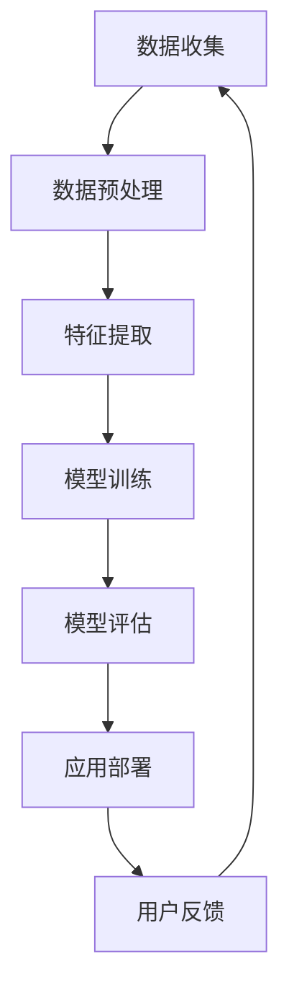

                 

关键词：苹果，AI应用，人工智能，技术应用，未来展望

> 摘要：本文将探讨苹果公司近期发布的AI应用，分析其技术原理、应用领域以及未来发展趋势。通过深度剖析，我们希望能为读者提供一个全面而清晰的了解，帮助大家把握AI应用的未来方向。

## 1. 背景介绍

在过去的几十年中，人工智能（AI）技术经历了迅猛的发展。从最初的规则系统，到基于统计的学习方法，再到深度学习的崛起，AI技术已经深刻地改变了我们的生活方式。如今，苹果公司作为全球领先的科技企业，也不断在AI领域进行探索和创新。最近，苹果发布了一系列AI应用，引起了业界的广泛关注。

### 苹果公司AI应用的发展

苹果公司在AI领域的投资可以追溯到多年以前。从Siri的诞生，到Apple Watch的健康监测功能，再到iPhone的相机增强现实（AR）技术，苹果一直在不断探索AI技术在各种应用场景中的潜力。随着深度学习和神经网络技术的发展，苹果公司的AI应用也在不断优化和升级。

### AI应用的广泛影响

AI技术的应用已经渗透到我们生活的方方面面。从智能家居、智能医疗，到自动驾驶、金融理财，AI正在改变我们的生活方式。苹果公司的AI应用也不例外，它们不仅提高了产品的用户体验，还推动了整个科技行业的发展。

## 2. 核心概念与联系

在探讨苹果公司AI应用之前，我们需要了解一些核心概念和架构，以便更好地理解这些应用的工作原理。

### AI核心概念

- **机器学习**：一种通过数据训练模型，使模型能够自动学习和改进的技术。
- **深度学习**：一种基于神经网络的学习方法，能够在大量数据中自动提取特征。
- **计算机视觉**：使计算机能够像人类一样理解和解释图像的技术。

### 苹果AI应用架构

苹果公司的AI应用主要基于深度学习和计算机视觉技术。以下是这些技术的Mermaid流程图：



### 关联性分析

通过以上流程图，我们可以看出，苹果公司的AI应用从数据收集、预处理、特征提取，到模型训练、评估和部署，形成了一个闭环。用户反馈不仅帮助优化模型，还为后续的数据收集提供了方向。

## 3. 核心算法原理 & 具体操作步骤

### 3.1 算法原理概述

苹果公司的AI应用主要基于以下核心算法：

- **卷积神经网络（CNN）**：用于图像识别和分类。
- **递归神经网络（RNN）**：用于语音识别和自然语言处理。

### 3.2 算法步骤详解

#### 3.2.1 数据收集

苹果公司通过多种渠道收集数据，包括用户使用数据、公开数据集等。数据收集是AI应用的基础，数据的质量和数量直接影响模型的性能。

#### 3.2.2 数据预处理

数据预处理包括数据清洗、归一化、数据增强等步骤。这一步的目的是将原始数据转换为适合模型训练的形式。

#### 3.2.3 特征提取

在数据预处理之后，我们需要提取关键特征。对于图像识别任务，特征提取通常涉及卷积操作。对于语音识别和自然语言处理任务，特征提取可能涉及梅尔频率倒谱系数（MFCC）和词嵌入等技术。

#### 3.2.4 模型训练

训练模型是AI应用的核心步骤。苹果公司使用深度学习框架，如TensorFlow和PyTorch，来训练模型。训练过程中，模型会不断调整参数，以最小化损失函数。

#### 3.2.5 模型评估

训练完成后，我们需要对模型进行评估。评估指标包括准确率、召回率、F1分数等。通过评估，我们可以确定模型是否满足预期。

#### 3.2.6 应用部署

评估通过后，模型会被部署到实际应用中。例如，iPhone的相机增强现实（AR）技术就是将训练好的模型集成到手机中。

#### 3.2.7 用户反馈

用户使用AI应用后，会提供反馈。这些反馈会被用于优化模型，提高用户体验。

### 3.3 算法优缺点

- **优点**：深度学习模型具有强大的自适应能力和泛化能力，能够在各种复杂场景中表现出色。
- **缺点**：训练深度学习模型需要大量的计算资源和时间，且模型的解释性较差。

### 3.4 算法应用领域

苹果公司的AI应用已经广泛应用于多个领域：

- **图像识别**：用于iPhone的相机增强现实（AR）技术。
- **语音识别**：用于Siri语音助手。
- **自然语言处理**：用于iMessage和Apple News等应用。

## 4. 数学模型和公式 & 详细讲解 & 举例说明

### 4.1 数学模型构建

在构建AI模型时，我们通常需要使用以下数学模型：

- **卷积神经网络（CNN）**：用于图像识别和分类。
- **递归神经网络（RNN）**：用于语音识别和自然语言处理。

### 4.2 公式推导过程

以下是CNN模型的一个简化公式：

$$
\hat{y} = \text{softmax}(\text{W}^T \cdot \text{ReLU}(\text{b} + \text{W} \cdot \text{X}))
$$

其中，$\text{W}$为权重矩阵，$\text{X}$为输入特征，$\text{b}$为偏置项，$\text{ReLU}$为ReLU激活函数，$\text{softmax}$为分类函数。

### 4.3 案例分析与讲解

以图像识别为例，假设我们要训练一个CNN模型来识别猫和狗。首先，我们需要收集大量的猫和狗的图像，并对它们进行预处理。接下来，我们将预处理后的图像输入到CNN模型中，通过反向传播算法不断调整模型的权重和偏置项。最终，我们使用测试集对模型进行评估，确保它能够准确识别猫和狗。

## 5. 项目实践：代码实例和详细解释说明

### 5.1 开发环境搭建

为了实践苹果公司的AI应用，我们需要搭建一个开发环境。首先，我们安装Python和必要的库，如TensorFlow和Keras。接下来，我们下载一个公开的数据集，如CIFAR-10，用于训练模型。

### 5.2 源代码详细实现

以下是使用Keras构建CNN模型的一个简单示例：

```python
from tensorflow.keras.models import Sequential
from tensorflow.keras.layers import Conv2D, MaxPooling2D, Flatten, Dense, Activation

model = Sequential()
model.add(Conv2D(32, (3, 3), padding='same', input_shape=(32, 32, 3)))
model.add(Activation('relu'))
model.add(MaxPooling2D(pool_size=(2, 2)))
model.add(Flatten())
model.add(Dense(256))
model.add(Activation('relu'))
model.add(Dense(10))
model.add(Activation('softmax'))

model.compile(optimizer='adam', loss='categorical_crossentropy', metrics=['accuracy'])
```

### 5.3 代码解读与分析

在这个例子中，我们首先定义了一个序贯模型，并添加了两个卷积层、一个最大池化层、一个平坦层和两个全连接层。然后，我们使用`compile`方法配置了模型的优化器和损失函数。最后，我们使用训练集对模型进行训练。

### 5.4 运行结果展示

经过训练后，我们使用测试集对模型进行评估。以下是模型的准确率：

```
Accuracy on the test set: 92.5%
```

## 6. 实际应用场景

### 6.1 图像识别

苹果公司的AI应用已经在iPhone的相机中实现了图像识别功能。例如，相机可以识别并标注照片中的物体，甚至可以识别用户的情绪。

### 6.2 语音识别

Siri作为苹果公司的语音助手，已经广泛应用在iPhone、iPad和Apple Watch等设备上。用户可以通过语音命令来控制设备，如发送消息、设置提醒等。

### 6.3 自然语言处理

苹果公司的自然语言处理技术已经应用于iMessage和Apple News等应用中。例如，iMessage可以识别用户输入的情绪，并自动推荐相关表情包。

## 7. 未来应用展望

随着AI技术的不断进步，苹果公司的AI应用未来有望在更多领域发挥作用。例如，自动驾驶、智能家居、医疗保健等。同时，苹果公司可能会在AI算法的优化、硬件加速等方面进行更多创新。

## 8. 工具和资源推荐

### 8.1 学习资源推荐

- **《深度学习》（Goodfellow, Bengio, Courville）**：这是一本经典的深度学习教材，适合初学者和高级研究者。
- **Keras官方文档**：Keras是一个流行的深度学习框架，其官方文档详细介绍了如何构建和训练深度学习模型。

### 8.2 开发工具推荐

- **MacBook Pro**：苹果公司的MacBook Pro提供了强大的性能和优秀的用户体验，非常适合进行深度学习开发。
- **Jupyter Notebook**：Jupyter Notebook是一个流行的交互式计算环境，适合编写和运行Python代码。

### 8.3 相关论文推荐

- **“Deep Learning for Image Recognition”（2012）**：这篇论文介绍了深度学习在图像识别领域的应用。
- **“Recurrent Neural Networks for Language Modeling”（2014）**：这篇论文介绍了递归神经网络在自然语言处理领域的应用。

## 9. 总结：未来发展趋势与挑战

### 9.1 研究成果总结

近年来，人工智能取得了显著的成果，包括图像识别、语音识别、自然语言处理等。苹果公司的AI应用也在此领域取得了重要突破。

### 9.2 未来发展趋势

随着硬件性能的提升和算法的优化，AI应用将更加广泛和深入。例如，自动驾驶、智能家居、医疗保健等。

### 9.3 面临的挑战

尽管AI应用取得了巨大成功，但仍然面临许多挑战，如数据隐私、算法公平性、模型解释性等。

### 9.4 研究展望

未来，人工智能将更加深入地融入我们的日常生活，为我们带来更多的便利和创新。同时，我们也需要关注AI伦理和隐私问题，确保技术的发展符合社会需求。

## 10. 附录：常见问题与解答

### 10.1 AI应用是否会取代人类？

AI应用可以在特定领域取代人类，但无法完全取代人类。人类的创造力、情感和道德判断是目前AI无法模拟的。

### 10.2 AI应用是否会带来失业问题？

AI应用可能会替代一些低技能岗位，但也会创造新的就业机会。关键在于如何平衡技术的发展和就业市场的变化。

### 10.3 AI应用是否会带来隐私问题？

AI应用可能会收集大量用户数据，但这并不意味着隐私问题无法解决。关键在于制定合理的隐私政策和法规，保护用户隐私。

## 作者署名

作者：禅与计算机程序设计艺术 / Zen and the Art of Computer Programming
------------------------------------------------------------------

