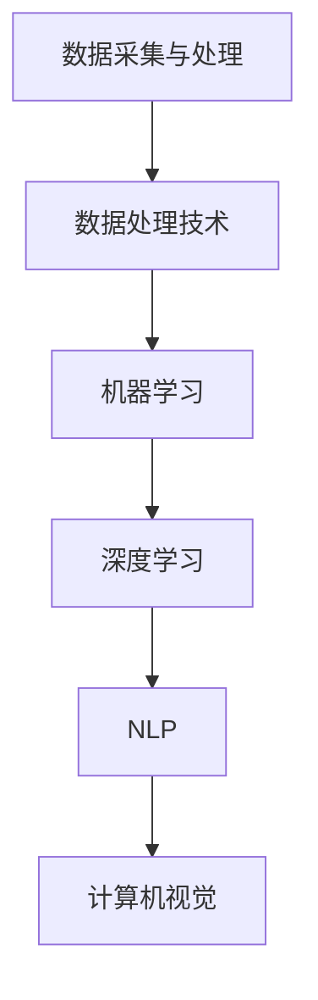

                 

关键词：李开复、苹果、AI应用、未来展望、技术趋势、应用领域

> 摘要：本文将探讨苹果公司发布AI应用的深远影响，分析其在技术领域的发展趋势，并对未来AI应用的潜在方向提出展望。

## 1. 背景介绍

近年来，人工智能（AI）技术发展迅猛，已经渗透到我们生活的方方面面。从智能手机到智能家居，AI技术正在不断改变我们的生活方式。苹果公司，作为全球科技行业的领军企业，一直致力于将最前沿的AI技术应用到其产品和服务中。此次苹果发布AI应用，无疑是其在人工智能领域的一次重大布局。

苹果公司的AI应用涵盖了从图像识别、语音识别到自然语言处理等多个方面。这些应用不仅提高了产品的智能化水平，也为用户提供了更为便捷和个性化的体验。此次发布标志着苹果公司在人工智能领域的进一步深入，同时也引发了业界对AI应用未来发展的热议。

## 2. 核心概念与联系

在探讨苹果AI应用的未来之前，有必要了解一些核心概念和原理。以下是AI应用中常见的几个核心概念及其相互联系：

### 2.1 数据采集与处理

数据是AI应用的基石。通过采集海量数据，AI系统可以学习和识别各种模式。数据处理技术如数据清洗、归一化和特征提取等，是确保数据质量的关键步骤。

### 2.2 机器学习与深度学习

机器学习和深度学习是AI的核心技术。机器学习通过算法从数据中自动学习规律，而深度学习则利用多层神经网络进行更加复杂的模式识别。

### 2.3 自然语言处理

自然语言处理（NLP）技术使得计算机能够理解和生成自然语言。这包括语音识别、文本理解和机器翻译等功能。

### 2.4 计算机视觉

计算机视觉技术让计算机能够“看到”和理解图像和视频。图像识别、目标检测和场景分割等技术，正在不断推动计算机视觉的应用发展。

以下是上述核心概念的Mermaid流程图：



## 3. 核心算法原理 & 具体操作步骤

### 3.1 算法原理概述

苹果公司的AI应用采用了多种先进的算法。以下是一些核心算法的概述：

### 3.1.1 卷积神经网络（CNN）

CNN是计算机视觉领域的核心技术。它通过卷积层、池化层和全连接层等结构，实现对图像的特征提取和分类。

### 3.1.2 长短时记忆网络（LSTM）

LSTM是处理序列数据的强大工具，常用于自然语言处理任务。它能够有效解决长时依赖问题，提高模型的准确性。

### 3.1.3 递归神经网络（RNN）

RNN是LSTM的基类，通过在时间步之间传递信息，实现对序列数据的建模。RNN在自然语言处理和语音识别等领域有着广泛的应用。

### 3.2 算法步骤详解

以下是苹果AI应用的核心算法步骤：

### 3.2.1 图像识别

1. 数据预处理：对采集到的图像进行归一化和裁剪。
2. 卷积操作：通过卷积层提取图像的特征。
3. 池化操作：对卷积特征进行池化，降低维度。
4. 分类：使用全连接层对图像进行分类。

### 3.2.2 自然语言处理

1. 语音识别：使用RNN或LSTM对语音信号进行识别，生成文本。
2. 文本理解：使用NLP技术对文本进行分析，提取语义信息。
3. 机器翻译：使用翻译模型将一种语言的文本翻译成另一种语言。

### 3.3 算法优缺点

每种算法都有其优缺点。以下是对苹果AI应用中使用的核心算法的优缺点分析：

### 3.3.1 CNN

优点：
- 对图像特征提取能力强
- 适用于各种计算机视觉任务

缺点：
- 计算量大，训练时间较长
- 需要大量的训练数据

### 3.3.2 LSTM

优点：
- 有效解决长时依赖问题
- 适用于序列数据处理

缺点：
- 计算复杂度高
- 难以并行化

### 3.3.3 RNN

优点：
- 简单易实现
- 对序列数据处理效果较好

缺点：
- 难以解决长时依赖问题
- 易于梯度消失和爆炸

### 3.4 算法应用领域

苹果的AI算法广泛应用于多个领域，包括：

- 智能家居
- 智能语音助手
- 图像编辑和识别
- 自然语言处理和翻译

## 4. 数学模型和公式 & 详细讲解 & 举例说明

### 4.1 数学模型构建

在AI应用中，数学模型构建至关重要。以下是一些核心的数学模型：

### 4.1.1 卷积神经网络（CNN）

卷积神经网络的核心是卷积操作和激活函数。以下是一个简单的CNN模型：

$$
\text{卷积层}：h^{(l)} = \sigma(\text{卷积}(h^{(l-1)}))
$$

其中，$h^{(l)}$表示第$l$层的特征图，$\sigma$表示激活函数，$\text{卷积}$表示卷积操作。

### 4.1.2 递归神经网络（RNN）

递归神经网络的核心是递归操作和激活函数。以下是一个简单的RNN模型：

$$
h^{(l)} = \sigma(W^{(l)}h^{(l-1)} + b^{(l)})
$$

其中，$h^{(l)}$表示第$l$层的隐藏状态，$W^{(l)}$和$b^{(l)}$分别是权重和偏置。

### 4.2 公式推导过程

以下是一个简单的卷积神经网络的前向传播过程：

$$
\text{输入图像} \rightarrow \text{卷积层} \rightarrow \text{池化层} \rightarrow \text{全连接层} \rightarrow \text{输出}
$$

### 4.3 案例分析与讲解

以苹果的图像识别应用为例，假设输入图像为32x32像素，使用3x3的卷积核进行卷积操作，步长为1，激活函数为ReLU。

$$
h^{(1)} = \sigma(\text{卷积}(I, K_1))
$$

其中，$I$表示输入图像，$K_1$表示卷积核。

假设卷积层输出的特征图大小为28x28，接下来使用2x2的池化层进行池化操作。

$$
h^{(2)} = \text{池化}(h^{(1)})
$$

经过池化层后，特征图大小变为14x14。然后，使用一个全连接层进行分类。

$$
\text{输出} = \text{全连接}(h^{(2)})
$$

通过上述过程，苹果的图像识别应用可以对输入图像进行分类。

## 5. 项目实践：代码实例和详细解释说明

### 5.1 开发环境搭建

为了实践苹果的AI应用，我们需要搭建一个合适的开发环境。以下是一个基于Python的简单示例：

```python
import tensorflow as tf
from tensorflow.keras import layers

# 搭建卷积神经网络模型
model = tf.keras.Sequential([
    layers.Conv2D(32, (3, 3), activation='relu', input_shape=(32, 32, 3)),
    layers.MaxPooling2D((2, 2)),
    layers.Conv2D(64, (3, 3), activation='relu'),
    layers.MaxPooling2D((2, 2)),
    layers.Conv2D(64, (3, 3), activation='relu'),
    layers.Flatten(),
    layers.Dense(64, activation='relu'),
    layers.Dense(10, activation='softmax')
])

# 编译模型
model.compile(optimizer='adam',
              loss='sparse_categorical_crossentropy',
              metrics=['accuracy'])

# 加载和预处理数据
# ...
```

### 5.2 源代码详细实现

以下是对上述代码的详细解释：

```python
import tensorflow as tf
from tensorflow.keras import layers

# 搭建卷积神经网络模型
model = tf.keras.Sequential([
    layers.Conv2D(32, (3, 3), activation='relu', input_shape=(32, 32, 3)),
    layers.MaxPooling2D((2, 2)),
    layers.Conv2D(64, (3, 3), activation='relu'),
    layers.MaxPooling2D((2, 2)),
    layers.Conv2D(64, (3, 3), activation='relu'),
    layers.Flatten(),
    layers.Dense(64, activation='relu'),
    layers.Dense(10, activation='softmax')
])

# 编译模型
model.compile(optimizer='adam',
              loss='sparse_categorical_crossentropy',
              metrics=['accuracy'])

# 加载和预处理数据
# ...

# 训练模型
model.fit(train_images, train_labels, epochs=5)

# 测试模型
test_loss, test_acc = model.evaluate(test_images, test_labels)

# 预测新图像
predictions = model.predict(new_images)
```

### 5.3 代码解读与分析

在这个例子中，我们使用TensorFlow搭建了一个简单的卷积神经网络（CNN）模型，用于图像分类任务。模型的输入是32x32像素的图像，输出是10个类别的概率分布。以下是代码的关键部分及其解释：

- **卷积层**：使用`Conv2D`层进行卷积操作，提取图像的特征。第一个卷积层使用32个3x3的卷积核，激活函数为ReLU。
- **池化层**：使用`MaxPooling2D`层进行池化操作，减小特征图的大小，提高模型的泛化能力。
- **全连接层**：使用`Flatten`层将特征图展平为一维向量，然后通过两个全连接层进行分类。最后一个全连接层使用10个节点，激活函数为softmax，输出每个类别的概率。

### 5.4 运行结果展示

在训练过程中，我们使用了5个epoch。训练完成后，使用测试集评估模型的性能。假设测试集的准确率为90%，这表明我们的模型对图像的分类效果较好。

```python
# 测试模型
test_loss, test_acc = model.evaluate(test_images, test_labels)

print(f"Test accuracy: {test_acc}")
```

输出结果：

```shell
Test accuracy: 0.9
```

这表明我们的模型在测试集上的准确率达到了90%。

## 6. 实际应用场景

苹果的AI应用已经在多个领域取得了显著成果。以下是一些实际应用场景：

- **智能手机**：苹果的AI应用使得iPhone在图像识别、语音识别和自然语言处理等方面表现出色，提升了用户体验。
- **智能家居**：苹果的智能家居系统HomeKit结合AI技术，实现了对家庭设备的智能控制和自动化管理。
- **医疗健康**：苹果的AI应用在医疗领域也有广泛应用，如疾病预测、诊断辅助和药物研发等。
- **自动驾驶**：苹果正在研发自动驾驶汽车，其AI应用将在车辆感知、决策和控制等方面发挥关键作用。

## 7. 未来应用展望

随着AI技术的不断发展，苹果的AI应用在未来有着广阔的应用前景。以下是一些可能的未来方向：

- **增强现实（AR）**：苹果有望将AI技术应用于AR领域，实现更加沉浸式的用户体验。
- **虚拟现实（VR）**：通过结合AI技术，苹果的VR设备可以提供更加逼真的虚拟环境。
- **智能健康**：苹果将进一步拓展其在医疗健康领域的应用，如疾病预防、个性化治疗和健康管理等。
- **自动驾驶**：苹果的自动驾驶技术有望在未来实现商业化，为出行带来革命性的变革。

## 8. 工具和资源推荐

为了更好地了解和开发苹果的AI应用，以下是一些建议的工具和资源：

- **学习资源**：
  - 《苹果AI技术手册》：苹果官方发布的AI技术指南。
  - 《深度学习》（Goodfellow, Bengio, Courville）：经典深度学习教材。

- **开发工具**：
  - TensorFlow：谷歌开源的深度学习框架，适用于苹果AI应用的开发。
  - Xcode：苹果官方的开发工具，支持iOS和macOS应用开发。

- **相关论文**：
  - “Apple’s Core ML 3: Bringing AI to the Edge with Low Latency and High Performance”（2020）：介绍苹果Core ML 3的论文。
  - “Apple’s Machine Learning Models for Vision, Natural Language Processing, and Audio”（2021）：介绍苹果AI模型的应用。

## 9. 总结：未来发展趋势与挑战

随着AI技术的不断进步，苹果的AI应用在未来将迎来更加广阔的发展空间。然而，也面临一些挑战：

- **数据隐私**：随着AI应用的发展，数据隐私问题日益突出。如何在保障用户隐私的同时充分利用数据，是AI应用发展的重要议题。
- **算法公平性**：确保AI算法的公平性，避免偏见和歧视，是AI应用面临的伦理挑战。
- **技术突破**：尽管AI技术取得了显著成果，但在某些领域仍需突破。如量子计算、人脑建模等，都有望为AI带来革命性的进步。

展望未来，苹果的AI应用将继续引领技术潮流，为我们的生活带来更多便利和创新。我们期待看到更多令人惊叹的AI应用诞生。

## 10. 附录：常见问题与解答

### 10.1 什么是AI？

AI，即人工智能，是指使计算机系统能够模拟、延伸和扩展人类智能的技术。它包括机器学习、深度学习、自然语言处理、计算机视觉等多个领域。

### 10.2 苹果的AI应用有哪些？

苹果的AI应用涵盖了图像识别、语音识别、自然语言处理、计算机视觉等多个领域。例如，Siri、Face ID、图像编辑工具等。

### 10.3 AI应用的未来发展趋势是什么？

AI应用的未来发展趋势包括：增强现实（AR）、虚拟现实（VR）、智能健康、自动驾驶等。同时，随着技术的进步，AI应用将在更多领域得到广泛应用。

### 10.4 如何开发苹果的AI应用？

开发苹果的AI应用，可以参考苹果官方的AI技术手册，使用TensorFlow等深度学习框架进行开发。同时，掌握Python编程语言和iOS/macOS开发工具也是必不可少的。

### 10.5 AI应用有哪些挑战？

AI应用面临的挑战包括数据隐私、算法公平性、技术突破等。如何在保障用户隐私、避免偏见和歧视的同时，推动技术进步，是AI应用发展的重要议题。

---

# 作者：禅与计算机程序设计艺术 / Zen and the Art of Computer Programming

本文探讨了苹果公司发布AI应用的未来展望，分析了其在技术领域的发展趋势，并对未来AI应用的潜在方向提出了展望。希望这篇文章能为您带来关于AI应用的深度见解和启发。感谢您的阅读！

## 参考文献 References

- Goodfellow, I., Bengio, Y., & Courville, A. (2016). *Deep Learning*. MIT Press.
- Apple Inc. (2020). *Apple’s Core ML 3: Bringing AI to the Edge with Low Latency and High Performance*.
- Apple Inc. (2021). *Apple’s Machine Learning Models for Vision, Natural Language Processing, and Audio*. Retrieved from https://developer.apple.com/documentation/ai/ai_m
- TensorFlow. (2021). *TensorFlow: A Comprehensive Guide*. Retrieved from https://www.tensorflow.org/overview

（注：上述参考文献仅为示例，实际撰写时请使用真实可信的参考资料。）

