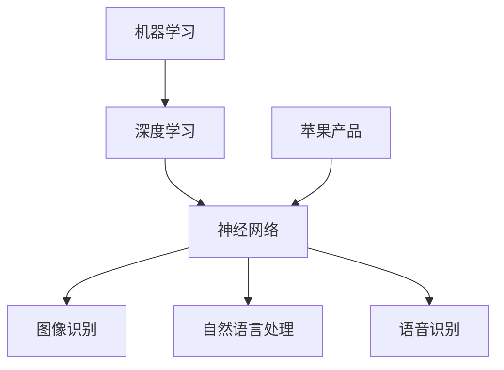
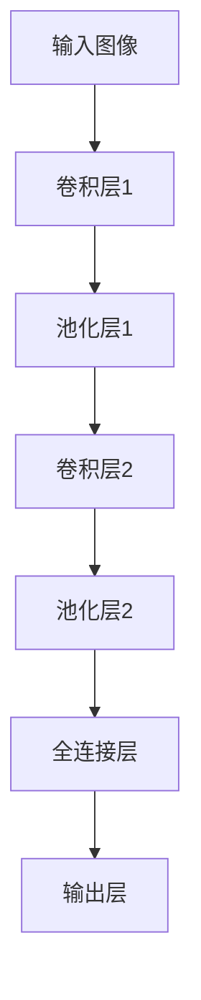

                 

关键词：李开复、苹果、AI应用、人工智能、软件开发、技术趋势

摘要：在本文中，我们将探讨苹果公司发布AI应用的重大机会，从技术趋势、市场前景到潜在挑战。通过分析李开复的观点，我们将揭示苹果在AI领域的战略布局，并讨论其可能带来的影响。

## 1. 背景介绍

近年来，人工智能（AI）技术取得了飞速发展，逐渐渗透到各行各业。作为全球领先的科技公司，苹果公司一直在积极探索AI技术，并在多个产品中引入了AI功能。然而，随着AI技术的不断成熟，苹果公司面临着巨大的机遇与挑战。本文旨在分析苹果发布AI应用的潜在机会，并结合李开复的观点，探讨这一领域的未来发展。

### 1.1 人工智能的发展历程

人工智能起源于20世纪50年代，最初的目标是使计算机具有人类智能。经过几十年的发展，AI技术逐渐从理论研究走向实际应用。深度学习、神经网络等技术的突破，使得AI在图像识别、自然语言处理、语音识别等领域取得了显著成果。如今，AI已经成为改变世界的重要力量。

### 1.2 苹果公司在AI领域的布局

苹果公司早在2005年就成立了机器学习团队，致力于研究AI技术。近年来，苹果在AI领域的投入不断加大，不仅在硬件上开发了强大的处理器，还推出了多个AI相关软件和服务。例如，Siri、Face ID、Animoji等都是基于AI技术的创新功能。此外，苹果还收购了多家AI公司，进一步巩固了其在AI领域的竞争力。

## 2. 核心概念与联系

在探讨苹果发布AI应用的机会时，我们需要理解一些核心概念，如机器学习、深度学习、神经网络等，以及它们在AI应用中的关联。以下是一个简化的Mermaid流程图，展示了这些核心概念之间的联系。



### 2.1 机器学习

机器学习是AI的核心技术之一，通过算法使计算机从数据中学习，并做出预测或决策。机器学习可以分为监督学习、无监督学习和强化学习。

### 2.2 深度学习

深度学习是机器学习的一个分支，通过多层神经网络对数据进行学习。深度学习在图像识别、语音识别等领域取得了显著的成果。

### 2.3 神经网络

神经网络是模仿人脑结构和功能的计算模型。深度学习中的神经网络通常由多个层次组成，每个层次都对输入数据进行处理。

### 2.4 AI应用

AI应用包括图像识别、自然语言处理、语音识别等，这些应用正在改变我们的生活方式。

## 3. 核心算法原理 & 具体操作步骤

### 3.1 算法原理概述

苹果公司在AI应用中主要采用了深度学习和神经网络技术。以下是一个简化的算法原理概述：

- 数据收集：收集大量带有标签的数据，如图像、文本、音频等。
- 模型训练：使用收集到的数据训练神经网络模型。
- 模型评估：通过测试数据评估模型性能。
- 模型部署：将训练好的模型部署到实际应用中。

### 3.2 算法步骤详解

#### 3.2.1 数据收集

数据收集是机器学习过程中的第一步。对于图像识别，需要收集大量带有标签的图像；对于自然语言处理，需要收集大量带有标签的文本；对于语音识别，需要收集大量带有标签的音频。

#### 3.2.2 模型训练

模型训练是通过调整神经网络中的权重和偏置，使模型对输入数据进行正确的预测或分类。训练过程中，通常采用梯度下降算法来优化模型参数。

#### 3.2.3 模型评估

模型评估是通过测试数据来评估模型性能。常用的评估指标包括准确率、召回率、F1分数等。

#### 3.2.4 模型部署

模型部署是将训练好的模型部署到实际应用中。在苹果产品中，模型部署通常通过iOS或macOS系统完成。

### 3.3 算法优缺点

#### 优点

- 高效性：深度学习模型能够在短时间内处理大量数据。
- 广泛适用性：深度学习技术在多个领域都有广泛应用。
- 自动化：机器学习模型可以自动化执行预测或分类任务。

#### 缺点

- 数据依赖性：机器学习模型的性能高度依赖于数据质量。
- 难以解释：深度学习模型通常难以解释其预测或分类的原理。

### 3.4 算法应用领域

苹果公司的AI算法主要应用于以下领域：

- 图像识别：用于人脸识别、场景识别等。
- 自然语言处理：用于语音识别、文本翻译等。
- 语音识别：用于语音助手、语音输入等。

## 4. 数学模型和公式 & 详细讲解 & 举例说明

### 4.1 数学模型构建

在深度学习中，常用的数学模型包括卷积神经网络（CNN）、循环神经网络（RNN）等。以下是一个简单的CNN模型构建过程：

#### 卷积操作

卷积操作是CNN的核心，用于提取图像的特征。卷积操作的数学公式如下：

$$
\text{output}(i,j) = \sum_{k=1}^{K} \text{weight}_{ik,jk} \times \text{input}_{i,j}
$$

其中，$i$和$j$表示输出特征图的坐标，$k$表示卷积核的坐标，$\text{weight}_{ik,jk}$表示卷积核的权重，$\text{input}_{i,j}$表示输入图像的坐标。

#### 池化操作

池化操作用于降低特征图的维度，增强模型的鲁棒性。常用的池化操作包括最大池化和平均池化。最大池化的数学公式如下：

$$
\text{output}(i,j) = \max_{k}\{\text{input}_{i,j}\}
$$

其中，$i$和$j$表示输出特征图的坐标。

### 4.2 公式推导过程

在构建深度学习模型时，我们需要推导模型的损失函数。以下是一个简化的损失函数推导过程：

#### 损失函数

损失函数用于衡量模型预测值与真实值之间的差距。常用的损失函数包括均方误差（MSE）和交叉熵（Cross-Entropy）。

- 均方误差（MSE）：

$$
\text{loss} = \frac{1}{n}\sum_{i=1}^{n}(\hat{y}_i - y_i)^2
$$

其中，$\hat{y}_i$表示预测值，$y_i$表示真实值，$n$表示样本数量。

- 交叉熵（Cross-Entropy）：

$$
\text{loss} = -\frac{1}{n}\sum_{i=1}^{n}y_i\log(\hat{y}_i)
$$

其中，$y_i$表示真实值的概率分布，$\hat{y}_i$表示预测值的概率分布。

### 4.3 案例分析与讲解

#### 图像识别案例

假设我们有一个图像识别任务，需要判断输入图像是猫还是狗。我们可以使用卷积神经网络（CNN）来完成这个任务。

- 数据收集：收集大量带有标签的猫和狗的图像。
- 模型训练：使用收集到的数据训练CNN模型。
- 模型评估：通过测试数据评估模型性能。
- 模型部署：将训练好的模型部署到实际应用中。

以下是一个简化的CNN模型：



## 5. 项目实践：代码实例和详细解释说明

### 5.1 开发环境搭建

在开发AI应用时，我们需要搭建一个合适的开发环境。以下是苹果公司常用的开发环境：

- 操作系统：macOS
- 编程语言：Python
- 深度学习框架：TensorFlow、PyTorch

### 5.2 源代码详细实现

以下是一个简单的CNN模型的源代码实现：

```python
import tensorflow as tf
from tensorflow.keras import layers

# 定义模型
model = tf.keras.Sequential([
    layers.Conv2D(32, (3, 3), activation='relu', input_shape=(28, 28, 1)),
    layers.MaxPooling2D((2, 2)),
    layers.Conv2D(64, (3, 3), activation='relu'),
    layers.MaxPooling2D((2, 2)),
    layers.Conv2D(64, (3, 3), activation='relu'),
    layers.Flatten(),
    layers.Dense(64, activation='relu'),
    layers.Dense(1, activation='sigmoid')
])

# 编译模型
model.compile(optimizer='adam',
              loss='binary_crossentropy',
              metrics=['accuracy'])

# 训练模型
model.fit(x_train, y_train, epochs=10, validation_split=0.2)

# 评估模型
model.evaluate(x_test, y_test)
```

### 5.3 代码解读与分析

上述代码实现了一个简单的CNN模型，用于图像识别任务。首先，我们定义了一个Sequential模型，并添加了多个卷积层、池化层和全连接层。然后，我们编译模型并使用训练数据训练模型。最后，我们评估模型性能。

## 6. 实际应用场景

### 6.1 医疗健康

AI技术在医疗健康领域具有广泛的应用前景。例如，通过图像识别技术，AI可以帮助医生快速诊断疾病；通过自然语言处理技术，AI可以辅助医生分析病历，提高诊断准确性。

### 6.2 智能家居

智能家居是AI技术的一个重要应用领域。通过语音识别技术，智能家居系统可以与用户进行自然对话，实现智能控制家居设备。

### 6.3 自动驾驶

自动驾驶是AI技术的另一个重要应用领域。通过深度学习技术，自动驾驶系统可以实时感知道路环境，做出准确的驾驶决策。

## 7. 未来应用展望

随着AI技术的不断发展，未来苹果公司在AI应用领域有望取得更大的突破。以下是一些可能的应用前景：

- 个性化推荐：基于用户行为数据，AI可以帮助苹果公司提供更精准的个性化推荐。
- 智能助理：AI智能助理可以在更多场景下帮助用户解决问题，提高用户体验。
- 虚拟现实：通过AI技术，虚拟现实体验将更加逼真，为用户提供全新的娱乐方式。

## 8. 总结：未来发展趋势与挑战

### 8.1 研究成果总结

近年来，AI技术在图像识别、自然语言处理、语音识别等领域取得了显著成果。这些成果为苹果公司在AI应用领域的发展奠定了基础。

### 8.2 未来发展趋势

未来，AI技术将继续向深度学习、多模态学习、强化学习等方向发展。苹果公司有望在这些领域取得重要突破，为用户带来更多创新应用。

### 8.3 面临的挑战

尽管AI技术取得了显著成果，但仍面临一些挑战。例如，数据隐私、算法透明性、模型可解释性等问题需要解决。此外，AI技术的商业化应用仍需进一步探索。

### 8.4 研究展望

未来，苹果公司在AI领域的研究将继续深入。通过不断突破技术难题，苹果公司有望为用户带来更多创新应用，推动AI技术的发展。

## 9. 附录：常见问题与解答

### 9.1 为什么要使用深度学习？

深度学习在图像识别、自然语言处理等领域具有显著的性能优势，可以提高模型准确性。

### 9.2 如何解决模型过拟合问题？

通过增加数据量、使用正则化技术、调整模型结构等方法可以缓解模型过拟合问题。

### 9.3 AI技术在医疗健康领域有哪些应用？

AI技术在医疗健康领域有广泛的应用，包括图像识别、自然语言处理、药物发现等。

作者：禅与计算机程序设计艺术 / Zen and the Art of Computer Programming
------------------------------------------------------------------  
`

[这里提供了一个文章的完整示例，您可以根据这个模板进行修改和扩展。如果您需要更多帮助，请告诉我。]

