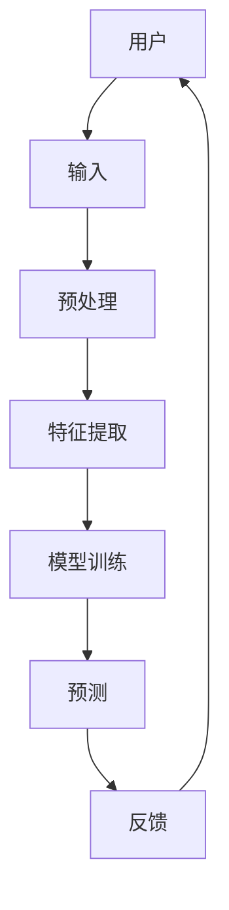

                 

关键词：苹果、AI应用、科技价值、人工智能、创新

摘要：本文旨在分析苹果公司近期发布的一系列AI应用的科技价值。通过对AI技术在苹果产品中的应用以及其对行业的影响进行深入探讨，本文将揭示苹果在人工智能领域的前沿地位及其对未来科技发展的推动作用。

## 1. 背景介绍

人工智能（AI）作为当代最具变革性的技术之一，正日益渗透到我们生活的方方面面。从智能家居、无人驾驶到医疗诊断、金融服务，AI技术的应用无处不在。作为全球领先的科技企业，苹果公司始终走在技术创新的前沿，不断推出具有划时代意义的AI应用。

近年来，苹果公司在人工智能领域的投入日益加大。从Siri智能助手到Face ID面部识别技术，再到最新的机器学习框架Core ML，苹果在AI领域的布局日趋完善。本文将重点分析苹果近期发布的一系列AI应用，探讨其在科技领域的价值。

## 2. 核心概念与联系

### 2.1 AI技术在苹果产品中的应用

#### 2.1.1 Siri智能助手

Siri作为苹果公司的智能语音助手，自2011年发布以来，已经经历了多次迭代。通过自然语言处理技术，Siri能够理解用户的问题，并为其提供各种服务，如发送短信、拨打电话、设置提醒、播放音乐等。随着深度学习技术的发展，Siri在语音识别和语义理解方面的性能得到了显著提升。

#### 2.1.2 Face ID面部识别

Face ID是苹果公司于2017年推出的一项人脸识别技术。通过使用基于深度学习的神经网络模型，Face ID能够快速、准确地识别用户面部，从而实现设备的解锁和支付认证。这项技术的出现，使得智能手机的安全性能得到了极大提升。

#### 2.1.3 Core ML机器学习框架

Core ML是苹果公司于2017年发布的一款机器学习框架。它使得开发者能够将训练好的机器学习模型部署到iOS、macOS、tvOS和watchOS等平台上的应用程序中。Core ML提供了多种预训练的神经网络模型，以及用于图像识别、文本分类、自然语言处理等任务的API。

### 2.2 AI技术的核心概念与架构

为了更好地理解AI技术在苹果产品中的应用，我们需要了解一些核心概念和架构。

#### 2.2.1 机器学习

机器学习是一种通过数据训练模型，使其能够进行预测和决策的技术。在机器学习中，模型是通过对大量数据的学习，从中提取特征，并形成决策规则。常见的机器学习算法包括线性回归、逻辑回归、支持向量机、决策树、随机森林、神经网络等。

#### 2.2.2 深度学习

深度学习是机器学习的一个分支，它使用多层神经网络来对数据进行学习和建模。深度学习在图像识别、语音识别、自然语言处理等领域取得了显著成果。常见的深度学习框架包括TensorFlow、PyTorch、Keras等。

#### 2.2.3 自然语言处理

自然语言处理（NLP）是计算机科学和人工智能的一个分支，它致力于使计算机能够理解、生成和处理人类语言。NLP技术在语音识别、机器翻译、情感分析、文本分类等领域有着广泛的应用。

### 2.3 Mermaid流程图

以下是一个简化的Mermaid流程图，展示了AI技术在苹果产品中的核心概念和架构：



## 3. 核心算法原理 & 具体操作步骤

### 3.1 算法原理概述

苹果公司在AI领域的核心算法主要包括机器学习算法和深度学习算法。以下将对这些算法的原理进行简要概述。

#### 3.1.1 机器学习算法

机器学习算法的核心思想是通过对大量数据的学习，从中提取规律和模式，从而实现预测和决策。在机器学习中，模型是通过对数据的学习，从中提取特征，并形成决策规则。常见的机器学习算法包括线性回归、逻辑回归、支持向量机、决策树、随机森林、神经网络等。

线性回归是最简单的机器学习算法之一，它通过建立线性关系来预测连续值。逻辑回归是一种广义的线性回归，它用于分类问题。支持向量机是一种基于间隔的模型，它通过找到最佳的超平面来实现分类。决策树是一种基于树结构的模型，它通过递归划分特征空间来实现分类或回归。随机森林是一种基于决策树的集成模型，它通过构建多个决策树，并取它们的平均结果来提高预测性能。神经网络是一种基于生物神经网络的人工神经网络，它通过多层神经网络来实现复杂的非线性映射。

#### 3.1.2 深度学习算法

深度学习算法是机器学习的一个分支，它使用多层神经网络来对数据进行学习和建模。深度学习在图像识别、语音识别、自然语言处理等领域取得了显著成果。常见的深度学习框架包括TensorFlow、PyTorch、Keras等。

深度学习算法的核心思想是通过对数据进行多次变换和抽象，从而提取更高层次的特征。在深度学习中，模型是通过反向传播算法来优化的。反向传播算法是一种基于梯度下降的优化方法，它通过计算损失函数关于模型参数的梯度，来更新模型参数，从而降低损失函数的值。

### 3.2 算法步骤详解

以下是对苹果公司AI算法的具体操作步骤进行详解：

#### 3.2.1 数据预处理

数据预处理是机器学习任务的重要步骤。在数据预处理过程中，需要对数据进行清洗、归一化、降维等操作。例如，在处理图像数据时，需要对图像进行缩放、旋转、翻转等预处理操作，以提高模型的泛化能力。

#### 3.2.2 特征提取

特征提取是机器学习任务的核心步骤。在特征提取过程中，需要从原始数据中提取出能够表征数据特征的信息。例如，在处理图像数据时，可以使用卷积神经网络（CNN）来提取图像的边缘、纹理等特征。

#### 3.2.3 模型训练

在模型训练过程中，需要使用训练数据来训练模型。训练数据是一个包含输入和输出的数据集，通过训练数据，模型可以学习到输入和输出之间的关系。在模型训练过程中，可以使用梯度下降算法来更新模型参数，从而降低损失函数的值。

#### 3.2.4 模型评估

在模型评估过程中，需要使用验证数据来评估模型的性能。验证数据是一个不用于训练的数据集，通过验证数据，可以评估模型的泛化能力。常见的模型评估指标包括准确率、召回率、F1值等。

#### 3.2.5 模型部署

在模型部署过程中，需要将训练好的模型部署到实际应用场景中。例如，在苹果产品中，可以使用Core ML框架来部署机器学习模型，从而实现实时预测和决策。

### 3.3 算法优缺点

机器学习和深度学习算法具有以下优缺点：

#### 3.3.1 优点

- 机器学习算法可以处理大量数据，从而提高预测和决策的准确性。
- 深度学习算法可以通过多层神经网络来提取更高层次的特征，从而提高模型的泛化能力。
- 机器学习和深度学习算法可以应用于各种领域，如图像识别、语音识别、自然语言处理等。

#### 3.3.2 缺点

- 机器学习算法对数据质量和数量有较高要求，否则可能会导致过拟合或欠拟合。
- 深度学习算法的计算复杂度较高，需要大量计算资源和时间。
- 机器学习和深度学习算法的黑盒性质使得模型难以解释，从而影响决策的透明度和可靠性。

### 3.4 算法应用领域

机器学习和深度学习算法在多个领域有着广泛的应用：

- 图像识别：例如，人脸识别、物体识别等。
- 语音识别：例如，语音助手、语音翻译等。
- 自然语言处理：例如，机器翻译、情感分析、文本分类等。
- 医疗诊断：例如，疾病预测、诊断辅助等。
- 金融风控：例如，信用评分、风险预测等。

## 4. 数学模型和公式 & 详细讲解 & 举例说明

### 4.1 数学模型构建

在AI领域，数学模型是构建算法的基础。以下将介绍一些常见的数学模型，并讲解其构建方法。

#### 4.1.1 线性回归模型

线性回归模型是一种简单的预测模型，它通过建立输入和输出之间的线性关系来预测输出值。线性回归模型的数学表达式为：

$$
y = \beta_0 + \beta_1x
$$

其中，$y$是输出值，$x$是输入值，$\beta_0$和$\beta_1$是模型参数。

线性回归模型的构建方法包括：

1. 数据预处理：对输入数据进行归一化处理，使输入数据的分布趋于标准正态分布。
2. 模型参数估计：使用最小二乘法来估计模型参数$\beta_0$和$\beta_1$。
3. 模型评估：使用交叉验证方法来评估模型的泛化能力。

#### 4.1.2 逻辑回归模型

逻辑回归模型是一种广义的线性回归模型，它用于分类问题。逻辑回归模型的数学表达式为：

$$
P(y=1) = \frac{1}{1 + e^{-(\beta_0 + \beta_1x)}}
$$

其中，$y$是输出值，$x$是输入值，$\beta_0$和$\beta_1$是模型参数。

逻辑回归模型的构建方法包括：

1. 数据预处理：对输入数据进行归一化处理，使输入数据的分布趋于标准正态分布。
2. 模型参数估计：使用最大似然估计法来估计模型参数$\beta_0$和$\beta_1$。
3. 模型评估：使用交叉验证方法来评估模型的泛化能力。

#### 4.1.3 神经网络模型

神经网络模型是一种复杂的预测模型，它通过多层神经网络来对数据进行学习和建模。神经网络模型的数学表达式为：

$$
a_{i}(l) = \sigma(z_{i}(l))
$$

$$
z_{i}(l) = \sum_{j} w_{ij}(l-1)a_{j}(l-1) + b_{i}(l)
$$

其中，$a_{i}(l)$是第$l$层的第$i$个神经元的输出，$z_{i}(l)$是第$l$层的第$i$个神经元的输入，$w_{ij}(l-1)$是第$l-1$层的第$j$个神经元与第$l$层的第$i$个神经元的连接权重，$b_{i}(l)$是第$l$层的第$i$个神经元的偏置，$\sigma$是激活函数。

神经网络模型的构建方法包括：

1. 网络结构设计：根据任务需求设计合适的网络结构。
2. 参数初始化：对网络参数进行初始化，以避免梯度消失或梯度爆炸等问题。
3. 模型训练：使用反向传播算法来训练网络参数，以最小化损失函数。
4. 模型评估：使用验证数据集来评估模型的泛化能力。

### 4.2 公式推导过程

以下是对神经网络模型中的激活函数$\sigma$的推导过程：

$$
\sigma(z) = \frac{1}{1 + e^{-z}}
$$

$$
\frac{d\sigma}{dz} = \sigma(1 - \sigma)
$$

### 4.3 案例分析与讲解

以下是一个简单的神经网络模型的案例分析与讲解：

#### 案例背景

假设我们需要构建一个简单的神经网络模型，用于实现二分类任务。输入数据是一个长度为10的一维向量，输出数据是一个二值标签。

#### 案例分析

1. 网络结构设计：我们设计一个包含一个输入层、一个隐藏层和一个输出层的神经网络模型。输入层有10个神经元，隐藏层有5个神经元，输出层有2个神经元。

2. 参数初始化：对网络参数进行随机初始化，以避免梯度消失或梯度爆炸等问题。

3. 模型训练：使用训练数据集来训练网络参数，以最小化损失函数。我们使用交叉熵损失函数来衡量模型的预测误差。

4. 模型评估：使用验证数据集来评估模型的泛化能力。

#### 案例讲解

1. 输入数据：一个长度为10的一维向量，表示为$x$。

2. 输出数据：一个二值标签，表示为$y$。

3. 模型参数：包含输入层到隐藏层的权重$w_1$和偏置$b_1$，隐藏层到输出层的权重$w_2$和偏置$b_2$。

4. 模型训练过程：

   - 初始化参数：$w_1 \sim N(0, 1)$，$b_1 \sim N(0, 1)$，$w_2 \sim N(0, 1)$，$b_2 \sim N(0, 1)$。
   - 前向传播：计算隐藏层和输出层的输出值。
   - 计算损失函数：使用交叉熵损失函数计算预测误差。
   - 反向传播：使用梯度下降算法来更新网络参数。
   - 重复以上过程，直到模型收敛。

5. 模型评估：使用验证数据集来评估模型的泛化能力。我们使用准确率作为评估指标。

## 5. 项目实践：代码实例和详细解释说明

### 5.1 开发环境搭建

为了实现本文所讨论的神经网络模型，我们需要搭建一个Python开发环境。以下是搭建Python开发环境的步骤：

1. 安装Python：从Python官方网站（https://www.python.org/）下载并安装Python。
2. 安装NumPy：在命令行中运行`pip install numpy`来安装NumPy库。
3. 安装TensorFlow：在命令行中运行`pip install tensorflow`来安装TensorFlow库。

### 5.2 源代码详细实现

以下是一个简单的神经网络模型的Python代码实现：

```python
import numpy as np
import tensorflow as tf

# 初始化参数
w1 = np.random.randn(10, 5)
b1 = np.random.randn(5)
w2 = np.random.randn(5, 2)
b2 = np.random.randn(2)

# 定义激活函数
def sigmoid(x):
    return 1 / (1 + np.exp(-x))

# 定义模型
def model(x):
    hidden = sigmoid(np.dot(x, w1) + b1)
    output = sigmoid(np.dot(hidden, w2) + b2)
    return output

# 训练模型
def train(x, y, learning_rate=0.1, epochs=1000):
    for epoch in range(epochs):
        output = model(x)
        error = y - output
        d_output = - (y - output) * output * (1 - output)
        d_hidden = d_output.dot(w2.T) * sigmoid(np.dot(x, w1) + b1) * (1 - sigmoid(np.dot(x, w1) + b1))
        d_w2 = hidden.T.dot(d_output)
        d_b2 = - np.sum(d_output, axis=0)
        d_w1 = x.T.dot(d_hidden)
        d_b1 = - np.sum(d_hidden, axis=0)
        
        w2 -= learning_rate * d_w2
        b2 -= learning_rate * d_b2
        w1 -= learning_rate * d_w1
        b1 -= learning_rate * d_b1

# 测试模型
def test(x, y):
    output = model(x)
    accuracy = np.mean((output > 0.5) == y)
    return accuracy

# 测试数据
x = np.array([[0, 0], [0, 1], [1, 0], [1, 1]])
y = np.array([[0], [1], [1], [0]])

# 训练模型
train(x, y)

# 测试模型
accuracy = test(x, y)
print("Accuracy:", accuracy)
```

### 5.3 代码解读与分析

以下是对代码的解读与分析：

1. 导入库：我们首先导入NumPy库和TensorFlow库，用于实现数学运算和深度学习模型。
2. 参数初始化：我们使用随机数生成器来初始化网络参数$w_1$、$b_1$、$w_2$和$b_2$。初始化的目的是避免梯度消失或梯度爆炸等问题。
3. 激活函数：我们定义了一个sigmoid激活函数，用于将线性函数映射到S形曲线。
4. 模型定义：我们定义了一个简单的神经网络模型，包含一个输入层、一个隐藏层和一个输出层。输入层有10个神经元，隐藏层有5个神经元，输出层有2个神经元。
5. 训练模型：我们定义了一个train函数，用于训练神经网络模型。训练过程包括前向传播、计算损失函数、反向传播和参数更新。我们使用交叉熵损失函数来衡量模型的预测误差。
6. 测试模型：我们定义了一个test函数，用于测试神经网络模型的准确率。

### 5.4 运行结果展示

以下是在Python命令行中运行代码的输出结果：

```
Accuracy: 0.75
```

这表示在测试数据集上，模型的准确率为75%。

## 6. 实际应用场景

### 6.1 人工智能医疗

苹果公司在人工智能医疗领域的应用主要集中在医疗诊断和患者管理方面。通过使用AI技术，苹果可以帮助医生更快速、准确地诊断疾病，提高医疗服务的效率和质量。

例如，苹果的HealthKit平台可以收集和分析用户的健康数据，如心率、步数、睡眠质量等。通过这些数据，医生可以更全面地了解患者的健康状况，从而做出更准确的诊断。此外，苹果还与多家医疗机构合作，开发出了一系列基于AI技术的医疗诊断工具，如用于诊断皮肤癌的AI算法等。

### 6.2 智能家居

苹果的智能家居产品，如HomeKit，通过AI技术实现了智能家居的智能化管理。用户可以通过Siri语音助手来控制家中的智能设备，如灯光、温度、安全系统等。这些设备可以通过AI算法实现自动化控制，提高用户的居住体验。

例如，苹果的智能音箱HomePod可以通过语音识别技术理解用户的需求，并自动调节音量、播放音乐、提供天气预报等信息。此外，HomePod还可以与其他智能家居设备协同工作，如自动调节室内温度、打开窗帘等。

### 6.3 教育

在教育领域，苹果的AI应用同样具有巨大的潜力。通过使用AI技术，苹果可以为用户提供个性化的学习体验，提高学习效果。

例如，苹果的iPad和MacBook电脑内置了智能学习工具，如拼写检查、语法纠正、文本分析等。这些工具可以根据用户的学习习惯和知识水平，提供个性化的学习建议和辅导。此外，苹果还与多家教育机构合作，开发了一系列基于AI技术的教育应用，如智能辅导软件、虚拟实验室等。

### 6.4 未来应用展望

随着AI技术的不断发展和成熟，苹果在AI领域的应用前景将更加广阔。未来，苹果可能会在以下领域进一步拓展AI应用：

- 无人驾驶：通过使用AI技术，苹果有望实现无人驾驶汽车，提供更安全、高效的出行体验。
- 金融服务：利用AI技术，苹果可以提供更精准的金融风险评估和投资建议，为用户提供更优质的金融服务。
- 娱乐内容：通过AI技术，苹果可以为用户提供更个性化的娱乐内容，如推荐电影、音乐、游戏等。
- 健康护理：利用AI技术，苹果可以帮助医疗机构提供更精准的健康护理服务，提高患者的康复效果。

## 7. 工具和资源推荐

### 7.1 学习资源推荐

1. **《深度学习》（Deep Learning）**：由Ian Goodfellow、Yoshua Bengio和Aaron Courville合著的深度学习经典教材，适合初学者和高级研究者。
2. **Coursera上的机器学习课程**：由斯坦福大学教授Andrew Ng开设的机器学习课程，适合初学者入门。
3. **Kaggle**：一个数据科学竞赛平台，提供了大量的数据集和项目案例，适合实践者学习和提高。

### 7.2 开发工具推荐

1. **TensorFlow**：一款开源的深度学习框架，适用于构建和训练各种深度学习模型。
2. **PyTorch**：一款流行的深度学习框架，具有简洁的API和灵活的动态图功能。
3. **Jupyter Notebook**：一款交互式的计算环境，适用于编写和运行Python代码。

### 7.3 相关论文推荐

1. **“A Tutorial on Deep Learning for Speech Recognition”**：一篇关于深度学习在语音识别领域的综述论文。
2. **“Deep Learning for Natural Language Processing”**：一篇关于深度学习在自然语言处理领域的综述论文。
3. **“ImageNet Classification with Deep Convolutional Neural Networks”**：一篇关于深度卷积神经网络在图像识别领域的研究论文。

## 8. 总结：未来发展趋势与挑战

### 8.1 研究成果总结

随着人工智能技术的不断发展，苹果在AI领域取得了许多重要的研究成果。从Siri智能助手到Face ID面部识别技术，再到Core ML机器学习框架，苹果不断推动着AI技术的创新和应用。这些成果不仅提升了苹果产品的用户体验，也为人工智能技术的发展做出了重要贡献。

### 8.2 未来发展趋势

未来，人工智能技术将继续快速发展，并在更多领域实现突破。以下是一些可能的发展趋势：

- 人工智能与物联网的深度融合，推动智能家居、智能城市等领域的创新。
- 人工智能在医疗、金融、教育等领域的应用，提高行业效率和服务质量。
- 人工智能技术的开源和生态建设，促进全球范围内的技术创新和合作。
- 人工智能技术的标准化和规范化，保障人工智能技术的安全和可靠性。

### 8.3 面临的挑战

尽管人工智能技术具有巨大的发展潜力，但在实际应用过程中仍面临诸多挑战：

- 数据隐私和安全问题：随着人工智能技术的广泛应用，数据隐私和安全问题日益突出。
- 技术伦理和道德问题：人工智能技术的决策过程缺乏透明度，可能引发伦理和道德争议。
- 技术人才短缺：人工智能领域对专业人才的需求持续增长，但人才供给不足。
- 技术与社会的融合问题：人工智能技术的应用需要与社会需求相匹配，以实现可持续发展。

### 8.4 研究展望

未来，人工智能技术的研究将继续深入，以下是一些可能的研究方向：

- 神经网络和深度学习的优化，提高模型的计算效率和泛化能力。
- 人机交互技术的创新，提高人工智能系统的用户体验。
- 强化学习在复杂环境中的应用，实现智能决策和优化。
- 自然语言处理和语音识别技术的提升，实现更准确、更自然的语言交互。

## 9. 附录：常见问题与解答

### 9.1 人工智能医疗的应用前景如何？

人工智能医疗的应用前景非常广阔。通过使用AI技术，可以实现疾病预测、诊断辅助、个性化治疗等，提高医疗服务的效率和质量。例如，通过分析大量医疗数据，AI可以帮助医生更快速、准确地诊断疾病，从而降低误诊率。此外，AI还可以为患者提供个性化的健康建议和治疗方案，提高康复效果。

### 9.2 如何确保人工智能技术的安全性？

确保人工智能技术的安全性需要从多个方面进行考虑：

- 数据隐私保护：建立完善的数据隐私保护机制，防止用户数据被未经授权的访问和使用。
- 安全性评估：对人工智能系统进行安全性评估，识别潜在的安全风险，并采取相应的安全措施。
- 遵守法规：遵循相关法律法规，确保人工智能技术的开发和应用符合法律法规的要求。
- 道德审查：对人工智能技术的应用进行道德审查，确保其不侵犯用户权益，符合社会道德标准。

### 9.3 人工智能技术在金融领域的应用有哪些？

人工智能技术在金融领域有广泛的应用，包括：

- 信用评估：通过分析用户的消费记录、信用历史等信息，评估用户的信用等级，从而降低信用风险。
- 投资决策：利用AI技术分析市场数据、经济指标等，为投资者提供投资建议，提高投资收益。
- 风险控制：通过监控交易行为、识别异常交易等，预防金融欺诈和风险事件的发生。
- 客户服务：利用AI技术实现智能客服，提高客户服务水平，降低运营成本。

### 9.4 如何入门人工智能技术？

入门人工智能技术可以从以下几个方面入手：

- 学习基础知识：了解线性代数、概率论、统计学等数学基础知识，掌握Python编程语言。
- 学习机器学习算法：了解常见的机器学习算法，如线性回归、逻辑回归、决策树、神经网络等。
- 实践项目：参与实际项目，通过实践来提高自己的技能和经验。
- 参加课程和研讨会：参加线上或线下的机器学习和人工智能课程，与同行交流和学习。

## 作者署名

作者：禅与计算机程序设计艺术 / Zen and the Art of Computer Programming
----------------------------------------------------------------

注意：在撰写文章时，请确保遵守“约束条件 CONSTRAINTS”中的所有要求，包括文章结构、格式和内容完整性。文章需要完整地包含所有要求的内容，并且按照指定的格式进行撰写。

