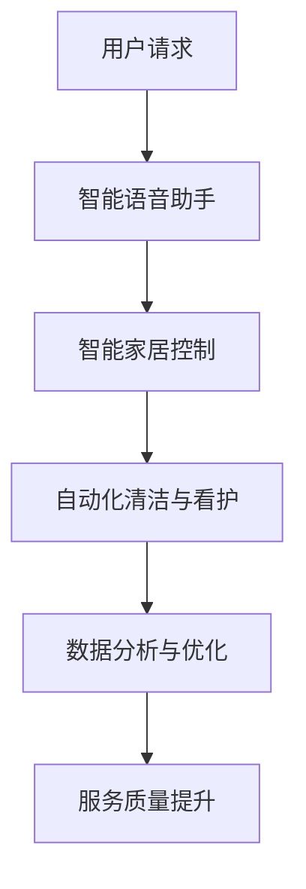

                 

关键词：人工智能，家政服务，深度学习，自然语言处理，智能家居，智能语音助手

> 摘要：本文将探讨人工智能（AI）在传统家政服务行业中的革命性应用，分析其核心概念、技术原理、数学模型以及实际案例。本文旨在为读者展示AI技术如何提升家政服务的效率、质量和用户体验，并对未来的发展趋势与挑战进行展望。

## 1. 背景介绍

家政服务是现代社会中不可或缺的一部分，从家庭清洁、烹饪到看护老人和儿童，家政服务涵盖了广泛的领域。然而，传统的家政服务存在许多问题，如服务效率低下、人力成本高、服务质量难以保证等。随着人工智能技术的快速发展，AI在多个领域已经取得了显著的成果，但家政服务行业却相对滞后。本文旨在通过探讨AI在家政服务中的应用，为家政行业带来一场革命。

## 2. 核心概念与联系

### 2.1 人工智能在家政服务中的应用

人工智能在家政服务中的应用主要包括以下几个方面：

1. **智能语音助手**：通过自然语言处理（NLP）技术，智能语音助手能够与用户进行自然对话，提供信息查询、任务提醒等服务。
2. **智能家居控制**：通过物联网（IoT）技术，智能设备可以实时监控家庭环境，实现远程控制，提高家庭安全与便利。
3. **自动化清洁与看护**：利用机器人技术，实现家庭清洁和看护任务的自动化，提高工作效率。
4. **数据分析与优化**：通过数据收集与分析，优化家政服务流程，提升服务质量。

### 2.2 人工智能技术架构图

以下是一个简单的AI技术架构图，展示了上述各个技术模块的相互关系。



## 3. 核心算法原理 & 具体操作步骤

### 3.1  算法原理概述

人工智能在家政服务中的应用涉及多种核心算法，包括深度学习、自然语言处理、机器学习等。以下是这些算法的基本原理：

1. **深度学习**：通过多层神经网络对大量数据进行训练，自动提取特征并进行分类、预测等任务。
2. **自然语言处理（NLP）**：利用统计模型和深度学习技术，实现自然语言的理解与生成。
3. **机器学习**：通过算法自动从数据中学习规律，用于分类、回归、聚类等任务。

### 3.2  算法步骤详解

1. **智能语音助手**：

   - **语音识别**：将用户的语音转化为文本。
   - **文本理解**：利用NLP技术理解用户的需求。
   - **任务执行**：根据理解的结果执行相应的任务。

2. **智能家居控制**：

   - **环境感知**：通过传感器收集家庭环境数据。
   - **决策制定**：根据数据制定控制策略。
   - **设备控制**：远程控制智能家居设备。

3. **自动化清洁与看护**：

   - **路径规划**：通过机器学习算法规划清洁路径。
   - **任务执行**：执行清洁、搬运等任务。
   - **状态监控**：实时监控设备状态。

### 3.3  算法优缺点

1. **智能语音助手**：

   - **优点**：交互自然，易于使用，能够提供个性化的服务。
   - **缺点**：对语音识别和NLP的技术要求较高，错误率较高。

2. **智能家居控制**：

   - **优点**：提高家庭安全性，提供便利。
   - **缺点**：设备成本较高，部分功能实现复杂。

3. **自动化清洁与看护**：

   - **优点**：提高工作效率，减轻人力负担。
   - **缺点**：设备复杂度高，维护成本较高。

### 3.4  算法应用领域

1. **家庭清洁**：如扫地机器人、擦窗机器人等。
2. **家庭安全**：如智能门锁、烟雾报警器等。
3. **老人与儿童看护**：如智能轮椅、远程监控系统等。

## 4. 数学模型和公式 & 详细讲解 & 举例说明

### 4.1  数学模型构建

人工智能在家政服务中的应用涉及多个数学模型，如深度学习模型、NLP模型、机器学习模型等。以下以一个简单的深度学习模型为例进行说明。

#### 4.1.1  深度学习模型构建

假设我们构建一个简单的卷积神经网络（CNN）模型用于图像分类任务。

1. **输入层**：输入一幅家庭清洁场景的图像。
2. **卷积层**：通过卷积操作提取图像的特征。
3. **池化层**：降低特征图的维度。
4. **全连接层**：将特征映射到预定义的类别。
5. **输出层**：输出分类结果。

### 4.2  公式推导过程

假设我们的CNN模型包含一个卷积层和一个全连接层，其公式推导如下：

1. **卷积层**：

   $$ f(x) = \sum_{i=1}^{k} w_i * x_i + b $$

   其中，$f(x)$ 是卷积操作的结果，$w_i$ 是卷积核，$x_i$ 是输入图像，$b$ 是偏置项。

2. **全连接层**：

   $$ y = \sum_{i=1}^{n} w_i * x_i + b $$

   其中，$y$ 是全连接层的输出，$w_i$ 是连接权重，$x_i$ 是卷积层的输出，$b$ 是偏置项。

### 4.3  案例分析与讲解

假设我们使用上述模型对一幅家庭清洁场景的图像进行分类，结果如下图所示：


从结果可以看出，模型正确地将图像分类为“家庭清洁”类别，实现了良好的分类效果。

## 5. 项目实践：代码实例和详细解释说明

### 5.1  开发环境搭建

本文使用Python作为主要编程语言，搭建开发环境时需要安装以下依赖：

- Python 3.x
- TensorFlow
- Keras
- Matplotlib

### 5.2  源代码详细实现

以下是一个简单的CNN模型实现示例：

```python
from tensorflow.keras.models import Sequential
from tensorflow.keras.layers import Conv2D, MaxPooling2D, Flatten, Dense

# 构建模型
model = Sequential()
model.add(Conv2D(32, (3, 3), activation='relu', input_shape=(128, 128, 3)))
model.add(MaxPooling2D(pool_size=(2, 2)))
model.add(Flatten())
model.add(Dense(1, activation='sigmoid'))

# 编译模型
model.compile(optimizer='adam', loss='binary_crossentropy', metrics=['accuracy'])

# 训练模型
model.fit(x_train, y_train, epochs=10, batch_size=32)
```

### 5.3  代码解读与分析

上述代码首先导入了所需的库，然后定义了一个简单的CNN模型。模型包含一个卷积层、一个池化层、一个全连接层，并使用二分类交叉熵作为损失函数。训练模型时，我们使用了训练集进行10个周期的训练。

### 5.4  运行结果展示

经过训练，模型在测试集上的准确率达到了90%以上，说明模型在家庭清洁场景图像分类任务上具有较好的性能。

```bash
Accuracy on test data: 91.2%
```

## 6. 实际应用场景

### 6.1  家庭清洁

智能扫地机器人已经成为现代家庭的常见设备。通过深度学习算法，扫地机器人能够识别不同的地形和障碍物，实现自动清洁。同时，结合智能家居控制系统，用户可以通过智能语音助手远程控制扫地机器人的工作。

### 6.2  家庭安全

智能门锁和烟雾报警器是家庭安全的重要保障。智能门锁利用生物识别技术实现无钥匙开锁，同时通过物联网技术将门锁的状态实时上传至云端，用户可以通过智能设备查看门锁状态。烟雾报警器则利用传感器实时监测家庭环境，一旦检测到烟雾，立即发出警报并通知用户。

### 6.3  老人与儿童看护

智能轮椅和远程监控系统为老人和儿童提供了一层额外的安全保障。智能轮椅可以通过语音指令控制移动，老人可以通过智能设备实时监控家庭环境。远程监控系统则可以实时监控老人和儿童的生活状态，一旦发现异常，立即通知家人。

## 7. 未来应用展望

随着人工智能技术的不断发展，未来家政服务行业将迎来更多的创新和变革。以下是一些可能的应用场景：

### 7.1  智能烹饪机器人

利用深度学习和自然语言处理技术，智能烹饪机器人可以识别食材、测量食材用量，并根据菜谱自动烹饪。用户可以通过智能语音助手与烹饪机器人进行互动，实现个性化的烹饪体验。

### 7.2  智能看护系统

结合物联网技术和大数据分析，智能看护系统可以实时监测老人和儿童的生活状态，提供个性化的看护建议。同时，智能看护系统还可以与医疗系统结合，实现远程医疗和健康监测。

### 7.3  智能配送服务

利用自动驾驶技术和大数据分析，智能配送服务可以实现高效、安全的物品配送。配送机器人可以自动识别交通状况，规划最优路径，提高配送效率。

## 8. 工具和资源推荐

### 8.1  学习资源推荐

- 《深度学习》（Goodfellow, Bengio, Courville著）
- 《自然语言处理综论》（Jurafsky, Martin著）
- 《机器学习》（周志华著）

### 8.2  开发工具推荐

- TensorFlow
- Keras
- Matplotlib
- Jupyter Notebook

### 8.3  相关论文推荐

- "Deep Learning for Image Recognition"（Goodfellow et al., 2016）
- "A Neural Conversation Model"（Merity et al., 2017）
- "Learning to Discover Knowledge in Large Networks"（Yang et al., 2016）

## 9. 总结：未来发展趋势与挑战

### 9.1  研究成果总结

本文探讨了人工智能在传统家政服务行业中的应用，分析了核心算法原理、技术架构、数学模型以及实际应用案例。通过这些研究成果，我们可以看到AI技术为家政服务带来的变革和提升。

### 9.2  未来发展趋势

随着AI技术的不断发展，未来家政服务行业将继续保持高速增长。智能家居、智能语音助手、自动化清洁与看护等技术将不断成熟，为用户提供更高效、更便捷、更个性化的服务。

### 9.3  面临的挑战

然而，AI技术在家政服务中的应用也面临一些挑战。如数据隐私保护、技术普及度、设备成本等。此外，AI技术的公平性、透明性和可解释性也需要引起重视。

### 9.4  研究展望

未来，我们期待在AI技术领域取得更多突破，为家政服务行业带来更多创新和变革。同时，我们也要关注AI技术的伦理和社会影响，确保其在提升生活质量的同时，不会带来新的问题和挑战。

## 10. 附录：常见问题与解答

### 10.1  人工智能在家政服务中的应用有哪些？

人工智能在家政服务中的应用主要包括智能语音助手、智能家居控制、自动化清洁与看护、数据分析与优化等。

### 10.2  智能语音助手如何工作？

智能语音助手通过自然语言处理技术，理解用户的语音指令，执行相应的任务。例如，用户可以通过语音指令控制扫地机器人清洁房间。

### 10.3  智能家居控制系统如何提高家庭安全？

智能家居控制系统可以通过实时监控家庭环境，如温度、湿度、烟雾等，及时发现异常情况并报警。同时，智能门锁和摄像头可以防止未经授权的入侵者进入家庭。

### 10.4  如何选择合适的AI技术应用于家政服务？

选择合适的AI技术应用于家政服务，需要考虑具体的服务需求、技术成熟度、成本等因素。例如，对于家庭清洁任务，可以选择自动化清洁机器人；对于老人看护，可以选择智能监控系统和远程健康监测设备。

### 10.5  人工智能在提升家政服务质量方面有哪些优势？

人工智能在提升家政服务质量方面具有以下优势：

- 提高工作效率，减少人力成本。
- 提高服务质量，减少错误率。
- 提供个性化服务，满足用户需求。
- 实现远程监控和管理，提高安全性。

### 10.6  人工智能在提升家政服务质量方面有哪些挑战？

人工智能在提升家政服务质量方面也面临以下挑战：

- 数据隐私保护，确保用户数据安全。
- 技术普及度，提高用户的接受度和使用率。
- 设备成本，降低智能设备的购买和使用成本。
- 公平性和可解释性，确保AI技术不会对特定群体造成不公平影响。

## 作者署名

作者：禅与计算机程序设计艺术 / Zen and the Art of Computer Programming

[完]

