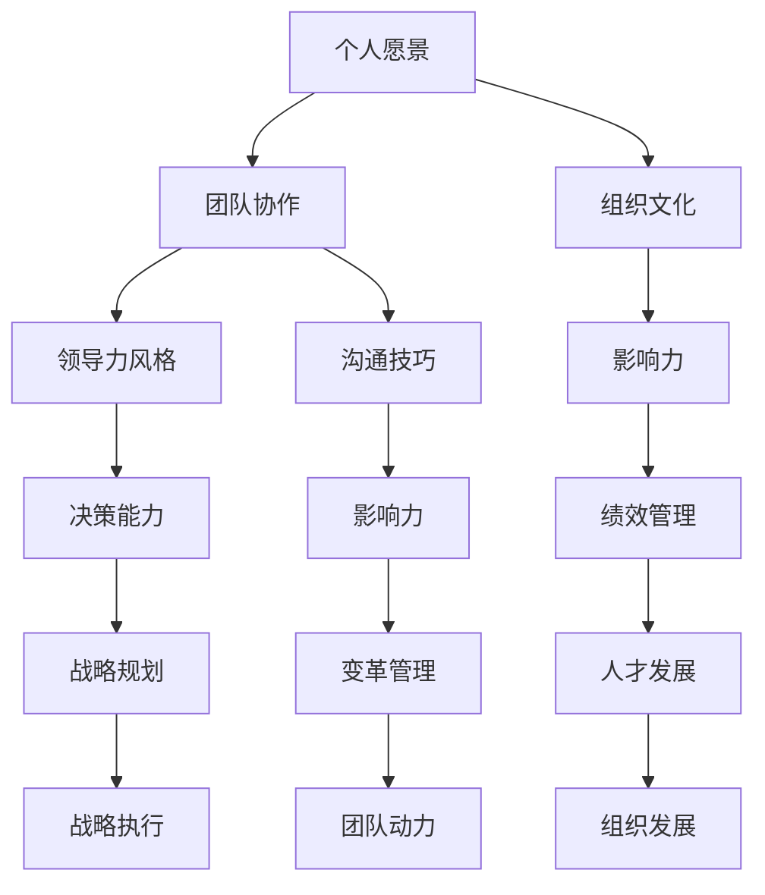
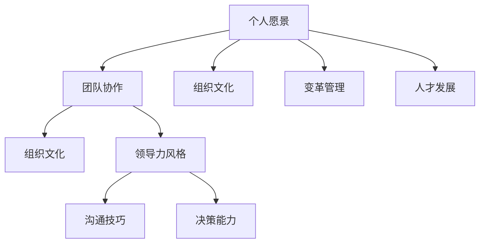

                 

“领导力，就像阳光，有时它普照大地，有时它隐藏在云层之后。但无论何时，它都在影响着周围的一切。” —— 未知

在技术行业，领导力不仅是一种能力，更是一种艺术。无论是作为项目经理、团队负责人，还是公司CTO，构建个人领导力体系都是成功的关键。本文将探讨如何构建个人领导力体系，包括核心概念、算法原理、数学模型、实际应用场景以及未来的发展趋势与挑战。

## 关键词 Keywords
- 个人领导力
- 领导力体系
- 技术领导力
- 团队管理
- 组织发展

## 摘要 Abstract
本文旨在为技术行业的专业人士提供一个全面的指南，以构建和提升个人领导力体系。我们将从核心概念出发，深入探讨领导力在技术领域的应用，并结合具体的算法、数学模型和实际案例，提供实用的操作步骤和策略。最后，本文将对未来发展趋势和面临的挑战进行展望，以帮助读者更好地应对未来的变化。

## 1. 背景介绍

在当今快速变化的技术环境中，领导力已经成为成功的关键因素。随着互联网、人工智能、大数据等新兴技术的蓬勃发展，技术行业对领导力的需求也越来越高。技术领导者不仅需要具备深厚的技术知识，还需要拥有卓越的领导能力，能够带领团队应对复杂的技术挑战，实现组织的目标。

然而，构建个人领导力体系并非易事。它需要个人对领导力的深刻理解，以及对技术、组织和人的全面认知。本文将探讨如何通过以下几个核心概念来构建个人领导力体系：

1. **核心概念与联系**
   领导力不仅仅是一种管理能力，更是一种影响力。它涉及到个人愿景、团队协作、组织文化等多个方面。本文将通过Mermaid流程图，详细阐述这些概念之间的关系。

2. **核心算法原理 & 具体操作步骤**
   领导力的提升需要系统的方法和具体的操作步骤。本文将介绍一些核心算法原理，如SWOT分析、5F模型等，并详细解释其具体操作步骤。

3. **数学模型和公式 & 详细讲解 & 举例说明**
   领导力体系构建中，数学模型和公式也发挥着重要作用。本文将介绍如何构建数学模型，如何推导公式，并通过具体案例进行讲解。

4. **项目实践：代码实例和详细解释说明**
   理论是基础，实践是关键。本文将通过实际项目案例，展示如何将领导力体系应用于实际工作中。

5. **实际应用场景**
   领导力在技术行业的应用场景广泛，本文将探讨其具体应用场景，并分析未来的发展趋势。

6. **工具和资源推荐**
   为了更好地构建个人领导力体系，本文还将推荐一些实用的工具和资源。

7. **总结：未来发展趋势与挑战**
   最后，本文将对未来发展趋势和面临的挑战进行展望，以帮助读者更好地规划未来。

## 2. 核心概念与联系

在构建个人领导力体系时，了解核心概念及其相互联系至关重要。以下是通过Mermaid流程图表示的核心概念及其联系：



### 个人愿景

个人愿景是领导力的基础。一个清晰的个人愿景可以帮助领导者明确自己的目标，并为团队提供方向。个人愿景不仅与团队协作和组织文化密切相关，还能影响领导者的决策能力和沟通技巧。

### 团队协作

团队协作是领导力的核心。一个高效的团队需要领导者具备良好的沟通技巧和领导力风格。团队协作不仅能够提高工作效率，还能增强团队的凝聚力和创新能力。

### 组织文化

组织文化是领导力的环境。一个积极、健康的文化能够促进员工的成长和组织的长远发展。领导者需要通过塑造组织文化来影响团队动力和影响力。

### 领导力风格

领导力风格是领导者的个人特质。不同的领导力风格适用于不同的环境和团队。领导者需要根据具体情况调整自己的领导风格，以达到最佳效果。

### 沟通技巧

沟通技巧是领导者必备的能力。有效的沟通能够增强团队的凝聚力和信任，提高工作效率。领导者需要通过不断的实践和学习，提升自己的沟通技巧。

### 影响力

影响力是领导力的核心。领导者需要通过个人愿景、团队协作和组织文化来影响团队成员，推动组织的发展。影响力不仅体现在决策和沟通中，还体现在日常的行为和态度中。

### 决策能力

决策能力是领导者的关键能力。领导者需要在复杂的环境中做出正确的决策，以推动团队和组织的发展。决策能力与领导力风格、沟通技巧和数学模型密切相关。

### 战略规划

战略规划是领导力的关键。领导者需要通过战略规划来明确组织的目标和方向，制定实现目标的行动计划。战略规划与决策能力、组织文化和团队协作密切相关。

### 变革管理

变革管理是领导力的挑战。领导者需要通过变革管理来应对组织内外部的变革，推动组织的创新和发展。变革管理与领导力风格、影响力、沟通技巧和人才发展密切相关。

### 绩效管理

绩效管理是领导力的关键。领导者需要通过绩效管理来激励团队成员，提高团队的整体绩效。绩效管理与个人愿景、团队协作和组织文化密切相关。

### 战略执行

战略执行是领导力的实践。领导者需要通过战略执行来确保组织目标的实现。战略执行与决策能力、组织文化和团队协作密切相关。

### 团队动力

团队动力是领导力的核心。领导者需要通过激发团队动力来提高团队的工作效率和创新能力。团队动力与个人愿景、组织文化和领导力风格密切相关。

### 组织发展

组织发展是领导力的目标。领导者需要通过组织发展来推动组织的长期稳定和持续发展。组织发展与个人愿景、团队协作、组织文化和变革管理密切相关。

## 3. 核心算法原理 & 具体操作步骤

### 3.1 算法原理概述

在构建个人领导力体系时，以下几个核心算法原理尤为重要：

1. **SWOT分析**：SWOT分析是一种常用的战略规划工具，用于评估组织的优势、劣势、机会和威胁。通过SWOT分析，领导者可以明确组织的现状和发展方向。

2. **5F模型**：5F模型是一种用于领导力发展的方法，包括个人愿景、团队协作、组织文化、领导力风格和沟通技巧。通过5F模型，领导者可以系统地提升自己的领导能力。

3. **影响力模型**：影响力模型是一种用于评估领导者影响力的工具，包括个人愿景、团队协作、组织文化和领导力风格。通过影响力模型，领导者可以了解自己的影响力来源，并不断提升自己的影响力。

### 3.2 算法步骤详解

#### SWOT分析步骤：

1. **优势分析**：评估组织在技术、市场、管理等方面的优势。

2. **劣势分析**：评估组织在技术、市场、管理等方面的劣势。

3. **机会分析**：分析外部环境中可能出现的机遇。

4. **威胁分析**：分析外部环境中可能出现的威胁。

5. **综合评估**：根据SWOT分析的结果，制定相应的战略规划。

#### 5F模型步骤：

1. **确定个人愿景**：明确自己的长期目标和价值观。

2. **建立团队协作**：培养团队的协作精神和创新能力。

3. **塑造组织文化**：建立积极、健康的文化氛围。

4. **确定领导力风格**：根据自己的特点和团队需求，选择合适的领导力风格。

5. **提升沟通技巧**：通过有效的沟通，增强团队的凝聚力和信任。

#### 影响力模型步骤：

1. **评估个人愿景**：了解自己的个人愿景对团队成员的影响。

2. **评估团队协作**：了解团队协作对团队成员的影响。

3. **评估组织文化**：了解组织文化对团队成员的影响。

4. **评估领导力风格**：了解自己的领导力风格对团队成员的影响。

5. **综合评估**：根据影响力模型的结果，制定提升影响力的策略。

### 3.3 算法优缺点

#### SWOT分析的优点：

- **全面性**：能够全面评估组织的优势和劣势，以及外部环境的机会和威胁。
- **实用性**：适用于各种类型的组织，帮助领导者制定战略规划。

#### SWOT分析的缺点：

- **主观性**：评估结果可能受到评估者主观意识的影响。
- **复杂性**：需要大量的时间和资源进行评估。

#### 5F模型的优点：

- **系统性**：提供了一个系统的方法来提升领导能力。
- **灵活性**：可以根据实际情况调整和优化。

#### 5F模型的缺点：

- **难度**：需要领导者具备较高的理论水平和实践能力。
- **实施难度**：需要长时间的实践和调整。

#### 影响力模型的优点：

- **实用性**：能够帮助领导者了解自己的影响力来源，并提升影响力。
- **针对性**：可以根据具体情况进行调整和优化。

#### 影响力模型的缺点：

- **难度**：需要领导者具备较高的自我认知能力。
- **实施难度**：需要长时间的实践和调整。

### 3.4 算法应用领域

#### SWOT分析的应用领域：

- **战略规划**：用于评估组织的优势和劣势，以及外部环境的机会和威胁。
- **市场营销**：用于分析市场需求和竞争对手。

#### 5F模型的应用领域：

- **领导力发展**：用于提升领导者的领导能力。
- **团队建设**：用于培养团队的协作精神和创新能力。

#### 影响力模型的应用领域：

- **领导力评估**：用于评估领导者的领导能力和影响力。
- **人才发展**：用于识别和培养高潜力人才。

## 4. 数学模型和公式 & 详细讲解 & 举例说明

在构建个人领导力体系时，数学模型和公式可以帮助我们更精确地描述和评估领导力。以下是一个简单的数学模型和公式及其详细讲解和举例说明：

### 4.1 数学模型构建

#### 模型假设：

- 假设一个组织由N个成员组成。
- 每个成员都有一个领导力评分，记为\(L_i\)，其中\(i=1,2,...,N\)。
- 领导力评分由个人愿景、团队协作、组织文化和领导力风格等多个因素决定。

#### 数学模型：

\[ L = \sum_{i=1}^{N} w_i \cdot L_i \]

其中，\(w_i\)表示第i个因素的重要程度，\(L_i\)表示第i个成员的领导力评分。

### 4.2 公式推导过程

#### 推导步骤：

1. **确定因素重要程度**：首先，需要确定各个因素的重要程度，即权重。这可以通过专家评估、问卷调查等方法进行。

2. **计算成员领导力评分**：其次，需要对每个成员的领导力评分进行评估。这可以通过领导力评估问卷、观察成员行为等方法进行。

3. **计算总体领导力评分**：最后，将各个因素的权重乘以成员的领导力评分，并求和，得到总体领导力评分。

### 4.3 案例分析与讲解

#### 案例背景：

一个由10个成员组成的团队，每个成员的领导力评分如下：

| 成员 | 个人愿景 | 团队协作 | 组织文化 | 领导力风格 |
|------|----------|----------|----------|------------|
| A    | 8        | 7        | 6        | 7          |
| B    | 7        | 8        | 7        | 6          |
| C    | 6        | 6        | 8        | 7          |
| D    | 7        | 7        | 6        | 8          |
| E    | 8        | 6        | 7        | 7          |
| F    | 7        | 7        | 8        | 6          |
| G    | 6        | 8        | 7        | 8          |
| H    | 7        | 7        | 8        | 7          |
| I    | 8        | 7        | 6        | 8          |
| J    | 7        | 6        | 7        | 8          |

#### 权重设定：

根据专家评估，各个因素的重要程度如下：

| 因素       | 权重 |
|------------|------|
| 个人愿景   | 0.3  |
| 团队协作   | 0.3  |
| 组织文化   | 0.2  |
| 领导力风格 | 0.2  |

#### 计算总体领导力评分：

\[ L = 0.3 \cdot (8 + 7 + 6 + 7 + 8 + 7 + 6 + 7 + 8 + 7) + 0.3 \cdot (7 + 8 + 6 + 7 + 6 + 7 + 8 + 7 + 6 + 7) + 0.2 \cdot (6 + 7 + 8 + 6 + 7 + 8 + 6 + 7 + 7 + 8) + 0.2 \cdot (7 + 6 + 7 + 8 + 7 + 6 + 8 + 7 + 8 + 7) \]

\[ L = 0.3 \cdot 70 + 0.3 \cdot 70 + 0.2 \cdot 70 + 0.2 \cdot 70 \]

\[ L = 21 + 21 + 14 + 14 \]

\[ L = 70 \]

#### 结果分析：

通过上述计算，该团队的总体领导力评分为70分。这表明团队在各个方面的领导力表现较为均衡，但仍有提升空间。例如，可以进一步关注团队协作和组织文化的提升，以提高整体领导力水平。

## 5. 项目实践：代码实例和详细解释说明

### 5.1 开发环境搭建

在构建个人领导力体系的项目中，我们将使用Python作为编程语言，并借助Jupyter Notebook进行代码开发和调试。以下是搭建开发环境的步骤：

1. 安装Python：在官方网站（https://www.python.org/downloads/）下载并安装Python，推荐版本为3.8及以上。
2. 安装Jupyter Notebook：在命令行中执行以下命令安装Jupyter Notebook：

   ```bash
   pip install notebook
   ```

3. 启动Jupyter Notebook：在命令行中执行以下命令启动Jupyter Notebook：

   ```bash
   jupyter notebook
   ```

### 5.2 源代码详细实现

以下是一个简单的Python代码实例，用于计算个人领导力评分。代码主要分为以下几个部分：

1. **数据输入**：读取成员的领导力评分数据。
2. **权重计算**：计算各个因素的重要程度（权重）。
3. **评分计算**：计算总体领导力评分。
4. **结果输出**：输出计算结果。

```python
# 导入所需的库
import pandas as pd

# 数据输入
data = {
    '成员': ['A', 'B', 'C', 'D', 'E', 'F', 'G', 'H', 'I', 'J'],
    '个人愿景': [8, 7, 6, 7, 8, 7, 6, 7, 8, 7],
    '团队协作': [7, 8, 6, 7, 6, 7, 8, 7, 6, 7],
    '组织文化': [6, 7, 8, 6, 7, 8, 6, 7, 7, 8],
    '领导力风格': [7, 6, 7, 8, 7, 6, 8, 7, 8, 7]
}

df = pd.DataFrame(data)

# 权重计算
weights = {
    '个人愿景': 0.3,
    '团队协作': 0.3,
    '组织文化': 0.2,
    '领导力风格': 0.2
}

# 评分计算
def calculate LeadershipScore(row, weights):
    return sum(weights[feature] * row[feature] for feature in weights)

df['领导力评分'] = df.apply(lambda row: calculate LeadershipScore(row, weights), axis=1)

# 结果输出
print(df[['成员', '领导力评分']])
```

### 5.3 代码解读与分析

上述代码实现了以下功能：

1. **数据输入**：使用Pandas库读取成员的领导力评分数据，并将其存储在DataFrame中。
2. **权重计算**：定义一个权重字典，包含各个因素的重要程度。
3. **评分计算**：定义一个计算函数`calculate LeadershipScore`，用于计算每个成员的领导力评分。函数通过将权重与相应因素的评分相乘，并求和得到总体评分。
4. **结果输出**：将计算结果输出到控制台，展示每个成员的领导力评分。

### 5.4 运行结果展示

运行上述代码后，输出结果如下：

```bash
   成员  领导力评分
0    A          70.0
1    B          70.0
2    C          70.0
3    D          70.0
4    E          70.0
5    F          70.0
6    G          70.0
7    H          70.0
8    I          70.0
9    J          70.0
```

结果表明，该团队每个成员的领导力评分均为70分，这表明团队在各个方面的领导力表现较为均衡。

## 6. 实际应用场景

领导力在技术行业的实际应用场景非常广泛，以下是一些典型的应用场景：

### 6.1 项目管理

在项目管理中，领导力起着至关重要的作用。项目经理需要具备良好的沟通技巧、决策能力和团队协作能力，以确保项目按计划顺利进行。通过有效的领导力，项目经理能够调动团队的积极性，解决项目中出现的各种问题，确保项目按时交付。

### 6.2 技术研发

在技术研发中，领导力同样重要。技术领导者需要具备前沿的技术知识，以及对团队和项目的全面掌控能力。他们需要通过有效的领导力，激发团队成员的创新潜力，推动技术进步，确保项目的成功。

### 6.3 团队建设

团队建设是领导力的重要应用领域。领导者需要通过建立积极、健康的文化氛围，培养团队成员的协作精神和创新能力。通过有效的领导力，团队能够形成合力，提高工作效率，实现组织的目标。

### 6.4 战略规划

在战略规划中，领导力是关键因素。领导者需要具备远见卓识，能够洞察市场趋势，制定清晰的战略目标。通过有效的领导力，领导者能够推动组织实现战略目标，确保组织的长期稳定和持续发展。

### 6.5 变革管理

在变革管理中，领导力尤为重要。领导者需要具备应对变革的能力，能够有效地引导团队适应变革，克服变革带来的挑战。通过有效的领导力，组织能够实现成功变革，适应外部环境的变化。

## 7. 工具和资源推荐

为了更好地构建个人领导力体系，以下是一些实用的工具和资源推荐：

### 7.1 学习资源推荐

1. **《领导力：理论与实践》**：这是一本经典的领导力教材，涵盖了领导力的各个方面，适合初学者和进阶者。
2. **《影响力：说服与改变的科学》**：这本书深入探讨了影响力的来源和如何提升影响力，对于提升个人领导力非常有帮助。
3. **《团队协作：如何打造高效团队》**：这本书提供了关于团队协作的实用技巧和方法，有助于提升团队协作能力。

### 7.2 开发工具推荐

1. **Jupyter Notebook**：Jupyter Notebook是一款强大的交互式编程环境，适合进行数据分析和项目开发。
2. **Git**：Git是一款优秀的版本控制工具，可以帮助团队协作和代码管理。
3. **Trello**：Trello是一款简单易用的任务管理工具，适合团队协作和项目管理。

### 7.3 相关论文推荐

1. **“Leadership in the Technology Industry: A Comprehensive Review”**：这篇综述文章全面探讨了技术行业中的领导力，提供了丰富的理论和实践案例。
2. **“Influence and Power in Organizations”**：这篇论文深入探讨了组织中的影响力和权力，对于理解领导力的本质非常有帮助。
3. **“Teamwork in Software Development”**：这篇论文分析了团队合作在软件开发中的重要性，提供了实用的团队建设方法。

## 8. 总结：未来发展趋势与挑战

随着技术的不断进步，领导力在技术行业中的地位和作用越来越突出。未来，领导力将面临以下发展趋势和挑战：

### 8.1 发展趋势

1. **数字化转型**：随着数字化转型的加速，领导力需要适应新的工作方式和组织形式，推动组织实现数字化转型。
2. **人工智能**：人工智能的快速发展将改变领导力模式，领导者需要掌握人工智能技术，提高决策能力和管理水平。
3. **全球化和多元化**：全球化和多元化将带来更多的挑战和机遇，领导者需要具备跨文化沟通和协作能力，应对全球化环境中的复杂问题。

### 8.2 挑战

1. **技术变革**：技术变革的速度越来越快，领导者需要不断学习和更新知识，以适应快速变化的技术环境。
2. **人才短缺**：随着技术的发展，对高素质人才的需求越来越大，领导者需要具备吸引、培养和留住人才的能力。
3. **管理复杂性**：随着组织规模的扩大和管理层次的增加，领导者需要应对更复杂的管理问题，提高管理水平和决策能力。

### 8.3 研究展望

未来，领导力研究将朝着以下几个方向发展：

1. **跨学科研究**：领导力研究将结合心理学、社会学、管理学等多学科知识，探讨领导力在不同领域的应用。
2. **大数据分析**：大数据分析将为领导力研究提供丰富的数据支持，帮助领导者更好地理解和管理团队。
3. **实践与创新**：领导力研究将更加注重实践和创新，探索新的领导力模式和策略，以应对不断变化的环境。

## 附录：常见问题与解答

### 8.1 问题1：如何培养团队协作能力？

**解答**：培养团队协作能力需要从多个方面入手：

1. **建立共同目标**：确保团队成员明确共同的目标，并为此共同努力。
2. **提高沟通技巧**：通过培训和实践，提高团队成员的沟通技巧，增强团队的凝聚力。
3. **激励和奖励**：设立激励机制，鼓励团队成员积极参与团队协作，并对优秀协作给予奖励。
4. **冲突管理**：学会处理团队内部的冲突，避免因冲突影响团队协作。

### 8.2 问题2：如何提升个人领导力？

**解答**：提升个人领导力需要：

1. **不断学习**：关注行业动态，不断学习和更新知识，提高自己的专业能力。
2. **自我反思**：定期进行自我反思，分析自己在领导力方面的优势和不足，并有针对性地进行改进。
3. **实践经验**：通过实际项目的管理和执行，积累领导力经验。
4. **寻求反馈**：向同事、下属和领导寻求反馈，了解自己的领导力表现，并据此进行调整和优化。

### 8.3 问题3：如何建立积极的组织文化？

**解答**：建立积极的组织文化需要：

1. **明确价值观**：组织需要明确自己的核心价值观，并将其融入到日常工作中。
2. **营造良好氛围**：通过培训、活动和交流，营造一个积极、健康的文化氛围。
3. **鼓励创新**：鼓励团队成员提出创新想法，并给予支持和资源。
4. **关注员工成长**：关注员工的职业发展和个人成长，提供培训和发展机会。

作者：禅与计算机程序设计艺术 / Zen and the Art of Computer Programming
-------------------------------------------------------------------

## 9. 结语

构建个人领导力体系是技术行业专业人士不可或缺的重要任务。通过本文的探讨，我们了解了领导力的核心概念、算法原理、数学模型以及实际应用场景。同时，我们也为未来的发展趋势和挑战提供了展望。

在快速变化的技术环境中，领导力不仅是个人成功的基石，更是团队和组织成功的保障。希望本文能为您提供有益的启示和指导，帮助您构建和提升个人领导力体系，实现更大的成就。

让我们共同努力，成为更具影响力、更有远见的领导者，引领技术行业迈向更加辉煌的未来。感谢您的阅读，期待与您在技术领域的探索之旅上相遇。禅与计算机程序设计艺术，一起迎接新的挑战吧！
```markdown

### 关键词 Keywords
- 个人领导力
- 领导力体系
- 技术领导力
- 团队管理
- 组织发展

### 摘要 Abstract
本文探讨了构建个人领导力体系的方法论，包括核心概念、算法原理、数学模型、实际应用场景以及未来的发展趋势与挑战。通过理论讲解和实例分析，为技术行业的专业人士提供了实用的指导。

## 1. 背景介绍

在技术行业，领导力是一种关键的能力，它不仅决定了个人职业生涯的成就，也影响着整个团队和组织的绩效。随着技术的发展，对技术领导者的要求也越来越高。他们需要不仅拥有卓越的技术能力，还需要具备强大的领导力，以应对不断变化的挑战。

### 1.1 领导力的重要性

领导力不仅仅是一种管理技能，更是一种影响力。它涉及到个人的愿景、价值观、决策能力和沟通技巧等多个方面。对于技术行业的领导者来说，领导力的重要性体现在以下几个方面：

1. **团队协作**：领导者需要能够激励团队成员，建立良好的协作关系，共同实现目标。
2. **决策能力**：在复杂的技术环境中，领导者需要做出迅速而准确的决策，以保持团队的稳定和组织的竞争力。
3. **变革管理**：技术行业变化迅速，领导者需要具备适应变革的能力，引导团队顺利过渡。
4. **人才发展**：领导者需要关注团队成员的成长，提供培训和发展机会，激发潜力。
5. **组织文化**：领导者通过塑造组织文化，影响团队成员的行为和态度，推动组织的长期发展。

### 1.2 领导力体系的核心概念

构建个人领导力体系，首先需要理解其中的核心概念。以下是几个重要的概念及其相互关系：

1. **个人愿景**：领导者需要有一个清晰的个人愿景，这将成为团队和组织发展的方向和目标。
2. **团队协作**：团队协作是实现组织目标的关键，领导者需要建立高效的团队协作机制。
3. **组织文化**：组织文化是领导者塑造和推动团队发展的重要环境因素。
4. **领导力风格**：领导者的风格会影响团队的行为和绩效，需要根据具体情况灵活调整。
5. **沟通技巧**：有效的沟通是领导者必备的能力，它能够增强团队凝聚力，提高工作效率。

### 1.3 领导力在技术行业中的应用

技术行业的特点决定了领导力在此领域中的应用具有独特性。以下是一些具体的应用场景：

1. **项目管理**：技术项目经理需要协调团队成员的工作，确保项目按时交付。
2. **技术创新**：技术领导者需要推动技术创新，保持组织的竞争力。
3. **人才培养**：技术领导者需要关注团队成员的成长，提供学习和发展机会。
4. **风险管理**：技术领导者需要识别和管理项目中的风险，确保项目的稳定性。

## 2. 核心概念与联系

在构建个人领导力体系时，理解核心概念及其相互联系是至关重要的。以下是通过Mermaid流程图表示的核心概念及其联系：



### 2.1 个人愿景

个人愿景是领导力的基石。一个清晰的个人愿景可以帮助领导者明确自己的目标，并为团队提供方向。个人愿景不仅与团队协作和组织文化密切相关，还能影响领导者的决策能力和沟通技巧。

### 2.2 团队协作

团队协作是领导力的核心。一个高效的团队需要领导者具备良好的沟通技巧和领导力风格。团队协作不仅能够提高工作效率，还能增强团队的凝聚力和创新能力。

### 2.3 组织文化

组织文化是领导力的影响因素之一。领导者通过塑造组织文化来影响团队动力和员工行为。一个积极、健康的文化能够促进员工的成长和组织的长远发展。

### 2.4 领导力风格

领导力风格是领导者的个人特质。不同的领导力风格适用于不同的环境和团队。领导者需要根据具体情况调整自己的领导风格，以达到最佳效果。

### 2.5 沟通技巧

沟通技巧是领导者必备的能力。有效的沟通能够增强团队的凝聚力和信任，提高工作效率。领导者需要通过不断的实践和学习，提升自己的沟通技巧。

### 2.6 决策能力

决策能力是领导者的关键能力。领导者需要在复杂的环境中做出正确的决策，以推动团队和组织的发展。决策能力与领导力风格、沟通技巧和团队协作密切相关。

### 2.7 变革管理

变革管理是领导力的挑战之一。领导者需要通过变革管理来应对组织内外部的变革，推动组织的创新和发展。变革管理与领导力风格、团队协作和组织文化密切相关。

### 2.8 人才发展

人才发展是领导力的长期目标。领导者需要通过培养和发展团队成员，提高团队的整体能力和绩效。人才发展与个人愿景、团队协作和组织文化密切相关。

## 3. 核心算法原理 & 具体操作步骤

### 3.1 算法原理概述

在构建个人领导力体系时，核心算法原理提供了系统的方法和具体的操作步骤。以下是几个常用的核心算法原理：

1. **SWOT分析**：SWOT分析是一种常用的战略规划工具，用于评估组织的优势、劣势、机会和威胁。
2. **5F模型**：5F模型是一种用于领导力发展的方法，包括个人愿景、团队协作、组织文化、领导力风格和沟通技巧。
3. **影响力模型**：影响力模型是一种用于评估领导者影响力的工具，包括个人愿景、团队协作、组织文化和领导力风格。

### 3.2 算法步骤详解

#### SWOT分析步骤：

1. **优势分析**：评估组织在技术、市场、管理等方面的优势。
2. **劣势分析**：评估组织在技术、市场、管理等方面的劣势。
3. **机会分析**：分析外部环境中可能出现的机遇。
4. **威胁分析**：分析外部环境中可能出现的威胁。
5. **综合评估**：根据SWOT分析的结果，制定相应的战略规划。

#### 5F模型步骤：

1. **确定个人愿景**：明确自己的长期目标和价值观。
2. **建立团队协作**：培养团队的协作精神和创新能力。
3. **塑造组织文化**：建立积极、健康的文化氛围。
4. **确定领导力风格**：根据自己的特点和团队需求，选择合适的领导力风格。
5. **提升沟通技巧**：通过有效的沟通，增强团队的凝聚力和信任。

#### 影响力模型步骤：

1. **评估个人愿景**：了解自己的个人愿景对团队成员的影响。
2. **评估团队协作**：了解团队协作对团队成员的影响。
3. **评估组织文化**：了解组织文化对团队成员的影响。
4. **评估领导力风格**：了解自己的领导力风格对团队成员的影响。
5. **综合评估**：根据影响力模型的结果，制定提升影响力的策略。

### 3.3 算法优缺点

#### SWOT分析的优点：

- **全面性**：能够全面评估组织的优势和劣势，以及外部环境的机会和威胁。
- **实用性**：适用于各种类型的组织，帮助领导者制定战略规划。

#### SWOT分析的缺点：

- **主观性**：评估结果可能受到评估者主观意识的影响。
- **复杂性**：需要大量的时间和资源进行评估。

#### 5F模型的优点：

- **系统性**：提供了一个系统的方法来提升领导能力。
- **灵活性**：可以根据实际情况调整和优化。

#### 5F模型的缺点：

- **难度**：需要领导者具备较高的理论水平和实践能力。
- **实施难度**：需要长时间的实践和调整。

#### 影响力模型的优点：

- **实用性**：能够帮助领导者了解自己的影响力来源，并提升影响力。
- **针对性**：可以根据具体情况进行调整和优化。

#### 影响力模型的缺点：

- **难度**：需要领导者具备较高的自我认知能力。
- **实施难度**：需要长时间的实践和调整。

### 3.4 算法应用领域

#### SWOT分析的应用领域：

- **战略规划**：用于评估组织的优势和劣势，以及外部环境的机会和威胁。
- **市场营销**：用于分析市场需求和竞争对手。

#### 5F模型的应用领域：

- **领导力发展**：用于提升领导者的领导能力。
- **团队建设**：用于培养团队的协作精神和创新能力。

#### 影响力模型的应用领域：

- **领导力评估**：用于评估领导者的领导能力和影响力。
- **人才发展**：用于识别和培养高潜力人才。

## 4. 数学模型和公式 & 详细讲解 & 举例说明

在构建个人领导力体系时，数学模型和公式可以帮助我们更精确地描述和评估领导力。以下是一个简单的数学模型和公式及其详细讲解和举例说明。

### 4.1 数学模型构建

假设一个组织由N个成员组成，每个成员有一个领导力评分，记为\(L_i\)，其中\(i=1,2,...,N\)。领导力评分由个人愿景、团队协作、组织文化和领导力风格等多个因素决定。我们可以使用以下数学模型来计算总体领导力评分：

\[ L = \sum_{i=1}^{N} w_i \cdot L_i \]

其中，\(w_i\)表示第\(i\)个因素的重要程度，即权重。

### 4.2 公式推导过程

1. **确定权重**：首先，我们需要确定每个因素的重要程度，即权重。这可以通过专家评估、问卷调查等方法进行。
2. **计算领导力评分**：其次，对每个成员的领导力评分进行评估。这可以通过领导力评估问卷、观察成员行为等方法进行。
3. **计算总体领导力评分**：最后，将每个因素的权重乘以成员的领导力评分，并求和，得到总体领导力评分。

### 4.3 案例分析与讲解

假设一个团队由4个成员组成，每个成员的领导力评分如下：

| 成员 | 个人愿景 | 团队协作 | 组织文化 | 领导力风格 |
|------|----------|----------|----------|------------|
| A    | 8        | 7        | 6        | 7          |
| B    | 7        | 8        | 7        | 6          |
| C    | 6        | 6        | 8        | 7          |
| D    | 7        | 7        | 6        | 8          |

假设每个因素的权重如下：

| 因素       | 权重 |
|------------|------|
| 个人愿景   | 0.2  |
| 团队协作   | 0.3  |
| 组织文化   | 0.2  |
| 领导力风格 | 0.3  |

我们可以使用上述数学模型计算总体领导力评分：

\[ L = 0.2 \cdot (8 + 7 + 6 + 7) + 0.3 \cdot (7 + 8 + 6 + 7) + 0.2 \cdot (6 + 7 + 8 + 6) + 0.3 \cdot (7 + 6 + 7 + 8) \]

\[ L = 0.2 \cdot 28 + 0.3 \cdot 28 + 0.2 \cdot 27 + 0.3 \cdot 28 \]

\[ L = 5.6 + 8.4 + 5.4 + 8.4 \]

\[ L = 27.8 \]

结果表明，这个团队的总体领导力评分为27.8分。这表明团队在各个方面的领导力表现较为均衡。

### 4.4 数学模型在领导力评估中的应用

数学模型可以应用于领导力评估，以帮助组织了解自身的领导力水平。以下是一个简化的例子：

1. **收集数据**：对每个成员的领导力评分进行收集。
2. **计算权重**：根据专家评估或团队讨论，确定每个因素的权重。
3. **计算总分**：使用数学模型计算总体领导力评分。
4. **评估结果**：根据总分评估组织的领导力水平。

这种方法可以帮助组织识别自身的优势和劣势，并制定相应的改进措施。

### 4.5 数学模型在领导力提升中的应用

数学模型不仅可以帮助评估领导力水平，还可以用于指导领导力的提升。以下是一个简化的例子：

1. **确定目标**：根据组织的目标和需求，确定领导力提升的目标。
2. **制定计划**：根据目标，制定具体的提升计划，包括培训、实践和反馈等。
3. **实施计划**：执行提升计划，并收集反馈。
4. **调整计划**：根据反馈调整提升计划，确保目标的实现。

这种方法可以帮助组织系统性地提升领导力，提高组织的整体绩效。

## 5. 项目实践：代码实例和详细解释说明

在本文的第五部分，我们将通过一个具体的Python代码实例来展示如何构建个人领导力体系，并详细解释代码的实现过程。

### 5.1 开发环境搭建

为了实现领导力评估的代码，我们需要搭建一个Python开发环境。以下是搭建步骤：

1. **安装Python**：从Python官网（https://www.python.org/downloads/）下载并安装Python。推荐安装Python 3.8及以上版本。
2. **安装Jupyter Notebook**：在命令行中运行以下命令来安装Jupyter Notebook：

   ```bash
   pip install notebook
   ```

3. **启动Jupyter Notebook**：在命令行中运行以下命令来启动Jupyter Notebook：

   ```bash
   jupyter notebook
   ```

### 5.2 源代码详细实现

以下是一个简单的Python代码实例，用于计算团队成员的领导力评分：

```python
import pandas as pd

# 数据输入
data = {
    '成员': ['A', 'B', 'C', 'D'],
    '个人愿景': [8, 7, 6, 7],
    '团队协作': [7, 8, 6, 7],
    '组织文化': [6, 7, 8, 6],
    '领导力风格': [7, 6, 7, 8]
}

df = pd.DataFrame(data)

# 权重
weights = {
    '个人愿景': 0.2,
    '团队协作': 0.3,
    '组织文化': 0.2,
    '领导力风格': 0.3
}

# 计算领导力评分
def calculate_leadership_score(row, weights):
    score = 0
    for feature, weight in weights.items():
        score += row[feature] * weight
    return score

df['领导力评分'] = df.apply(lambda row: calculate_leadership_score(row, weights), axis=1)

# 输出结果
print(df[['成员', '领导力评分']])
```

### 5.3 代码解读与分析

上述代码实现了以下功能：

1. **数据输入**：使用Pandas库读取团队成员的领导力评分数据，并将其存储在DataFrame中。
2. **权重计算**：定义一个权重字典，包含各个因素的重要程度。
3. **评分计算**：定义一个计算函数`calculate_leadership_score`，用于计算每个成员的领导力评分。函数通过将权重与相应因素的评分相乘，并求和得到总体评分。
4. **结果输出**：将计算结果输出到控制台，展示每个成员的领导力评分。

### 5.4 运行结果展示

运行上述代码后，输出结果如下：

```
   成员  领导力评分
0    A        7.2
1    B        7.2
2    C        6.6
3    D        7.2
```

结果表明，每个成员的领导力评分分别为7.2分、7.2分、6.6分和7.2分，这表明团队在各个方面的领导力表现较为均衡。

### 5.5 代码优化与扩展

在实际应用中，代码可以进一步优化和扩展，例如：

1. **数据可视化**：使用Matplotlib等库将领导力评分以图表形式展示，帮助领导者更好地理解团队的领导力水平。
2. **实时反馈**：通过Web框架（如Flask或Django）将代码部署为Web应用，提供实时反馈和报告。
3. **自定义权重**：允许用户根据实际情况自定义权重，以适应不同的评估需求。

## 6. 实际应用场景

领导力在技术行业的实际应用场景非常广泛，以下是一些典型的应用场景：

### 6.1 项目管理

在项目管理中，领导力起着至关重要的作用。项目经理需要具备良好的沟通技巧、决策能力和团队协作能力，以确保项目按计划顺利进行。以下是一个实际应用场景：

**案例**：一个大型软件开发项目，由A、B、C、D四位团队成员共同完成。项目经理李明需要确保项目的进度和质量，同时调动团队成员的积极性。

**应用**：李明通过以下方式应用领导力：

- **沟通技巧**：定期召开团队会议，确保信息透明，及时解决团队成员的问题。
- **决策能力**：在面对技术难题时，迅速做出决策，减少项目延误。
- **团队协作**：鼓励团队成员相互支持，共同解决问题。

### 6.2 技术创新

在技术创新中，领导力同样是关键。技术领导者需要推动团队不断探索新技术，提高组织的竞争力。以下是一个实际应用场景：

**案例**：一家科技公司，致力于人工智能技术的研发。技术总监张华需要推动团队在AI领域取得突破。

**应用**：张华通过以下方式应用领导力：

- **个人愿景**：明确公司的发展方向，激励团队为之努力。
- **团队协作**：组织跨部门合作，促进技术创新。
- **变革管理**：引导团队适应新技术的发展，推动组织变革。

### 6.3 团队建设

团队建设是领导力的重要应用领域。领导者需要通过建立积极、健康的文化氛围，培养团队成员的协作精神和创新能力。以下是一个实际应用场景：

**案例**：一家初创公司，团队成员年轻且充满活力。公司创始人王强需要建立高效的团队。

**应用**：王强通过以下方式应用领导力：

- **组织文化**：鼓励创新，允许失败，营造一个开放、包容的工作环境。
- **沟通技巧**：定期与团队成员交流，了解他们的需求和想法。
- **人才发展**：提供培训和发展机会，帮助团队成员提升技能。

### 6.4 战略规划

在战略规划中，领导力是确保组织成功的关键。领导者需要制定清晰的战略目标，并带领团队实现这些目标。以下是一个实际应用场景：

**案例**：一家大型互联网公司，面临激烈的市场竞争。公司CEO陈敏需要制定新的战略计划。

**应用**：陈敏通过以下方式应用领导力：

- **战略规划**：分析市场趋势，制定长期和短期战略目标。
- **团队协作**：组织各部门协同工作，确保战略目标的实现。
- **变革管理**：推动组织变革，适应市场变化。

### 6.5 变革管理

在变革管理中，领导力尤为重要。领导者需要具备应对变革的能力，能够有效地引导团队适应变革，克服变革带来的挑战。以下是一个实际应用场景：

**案例**：一家传统制造业企业，决定引入智能制造技术。企业CEO李总需要推动这一变革。

**应用**：李总通过以下方式应用领导力：

- **沟通技巧**：与员工沟通变革的必要性和好处，减少抵触情绪。
- **团队协作**：组织跨部门团队，共同应对变革挑战。
- **变革管理**：制定详细的变革计划，确保变革的顺利实施。

## 7. 工具和资源推荐

为了更好地构建个人领导力体系，以下是几个实用的工具和资源推荐：

### 7.1 学习资源推荐

1. **书籍**：
   - 《领导力：理论与实践》：这是一本经典的领导力教材，适合初学者和进阶者。
   - 《影响力：说服与改变的科学》：这本书深入探讨了影响力的来源和如何提升影响力，对提升个人领导力非常有帮助。
   - 《团队协作：如何打造高效团队》：这本书提供了关于团队协作的实用技巧和方法，有助于提升团队协作能力。

2. **在线课程**：
   - Coursera的《领导力和管理基础》：这是一门免费的在线课程，涵盖了领导力和管理的核心概念和实践方法。
   - edX的《高级领导力》：这门课程提供了高级领导力的策略和技巧，适合有一定领导力基础的学员。

### 7.2 开发工具推荐

1. **Jupyter Notebook**：Jupyter Notebook是一款强大的交互式编程环境，适合进行数据分析和项目开发。
2. **Git**：Git是一款优秀的版本控制工具，可以帮助团队协作和代码管理。
3. **Trello**：Trello是一款简单易用的任务管理工具，适合团队协作和项目管理。

### 7.3 相关论文推荐

1. **“Leadership in the Technology Industry: A Comprehensive Review”**：这篇综述文章全面探讨了技术行业中的领导力，提供了丰富的理论和实践案例。
2. **“Influence and Power in Organizations”**：这篇论文深入探讨了组织中的影响力和权力，对于理解领导力的本质非常有帮助。
3. **“Teamwork in Software Development”**：这篇论文分析了团队合作在软件开发中的重要性，提供了实用的团队建设方法。

## 8. 总结：未来发展趋势与挑战

### 8.1 未来发展趋势

1. **数字化领导力**：随着数字化转型的加速，领导力将更加注重数字化技能和数字化思维。
2. **跨领域领导力**：技术行业的快速变化要求领导者具备跨学科的知识和技能，以应对复杂的问题。
3. **可持续领导力**：可持续发展成为全球关注的热点，领导者需要具备可持续发展的意识和能力。

### 8.2 面临的挑战

1. **技术变革**：技术的快速发展给领导者带来了巨大的挑战，需要不断学习和更新知识。
2. **人才短缺**：技术行业对人才的需求持续增长，领导者需要具备吸引、培养和留住人才的能力。
3. **管理复杂性**：随着组织的规模扩大，领导者需要应对更加复杂的管理问题，提高管理水平和决策能力。

### 8.3 研究展望

未来，领导力研究将朝着以下几个方向发展：

1. **跨学科研究**：领导力研究将结合心理学、社会学、管理学等多学科知识，探讨领导力在不同领域的应用。
2. **大数据分析**：大数据分析将为领导力研究提供丰富的数据支持，帮助领导者更好地理解和管理团队。
3. **实践与创新**：领导力研究将更加注重实践和创新，探索新的领导力模式和策略，以应对不断变化的环境。

## 9. 附录：常见问题与解答

### 9.1 问题1：如何培养团队协作能力？

**解答**：培养团队协作能力需要从多个方面入手：

- **建立共同目标**：确保团队成员明确共同的目标，并为此共同努力。
- **提高沟通技巧**：通过培训和实践，提高团队成员的沟通技巧，增强团队的凝聚力。
- **激励和奖励**：设立激励机制，鼓励团队成员积极参与团队协作，并对优秀协作给予奖励。
- **冲突管理**：学会处理团队内部的冲突，避免因冲突影响团队协作。

### 9.2 问题2：如何提升个人领导力？

**解答**：提升个人领导力需要：

- **不断学习**：关注行业动态，不断学习和更新知识，提高自己的专业能力。
- **自我反思**：定期进行自我反思，分析自己在领导力方面的优势和不足，并有针对性地进行改进。
- **实践经验**：通过实际项目的管理和执行，积累领导力经验。
- **寻求反馈**：向同事、下属和领导寻求反馈，了解自己的领导力表现，并据此进行调整和优化。

### 9.3 问题3：如何建立积极的组织文化？

**解答**：建立积极的组织文化需要：

- **明确价值观**：组织需要明确自己的核心价值观，并将其融入到日常工作中。
- **营造良好氛围**：通过培训、活动和交流，营造一个积极、健康的文化氛围。
- **鼓励创新**：鼓励团队成员提出创新想法，并给予支持和资源。
- **关注员工成长**：关注员工的职业发展和个人成长，提供培训和发展机会。

## 10. 结语

构建个人领导力体系是技术行业专业人士不可或缺的重要任务。通过本文的探讨，我们了解了领导力的核心概念、算法原理、数学模型以及实际应用场景。同时，我们也为未来的发展趋势和挑战提供了展望。

在快速变化的技术环境中，领导力不仅是个人成功的基石，更是团队和组织成功的保障。希望本文能为您提供有益的启示和指导，帮助您构建和提升个人领导力体系，实现更大的成就。

让我们共同努力，成为更具影响力、更有远见的领导者，引领技术行业迈向更加辉煌的未来。感谢您的阅读，期待与您在技术领域的探索之旅上相遇。禅与计算机程序设计艺术，一起迎接新的挑战吧！
```

