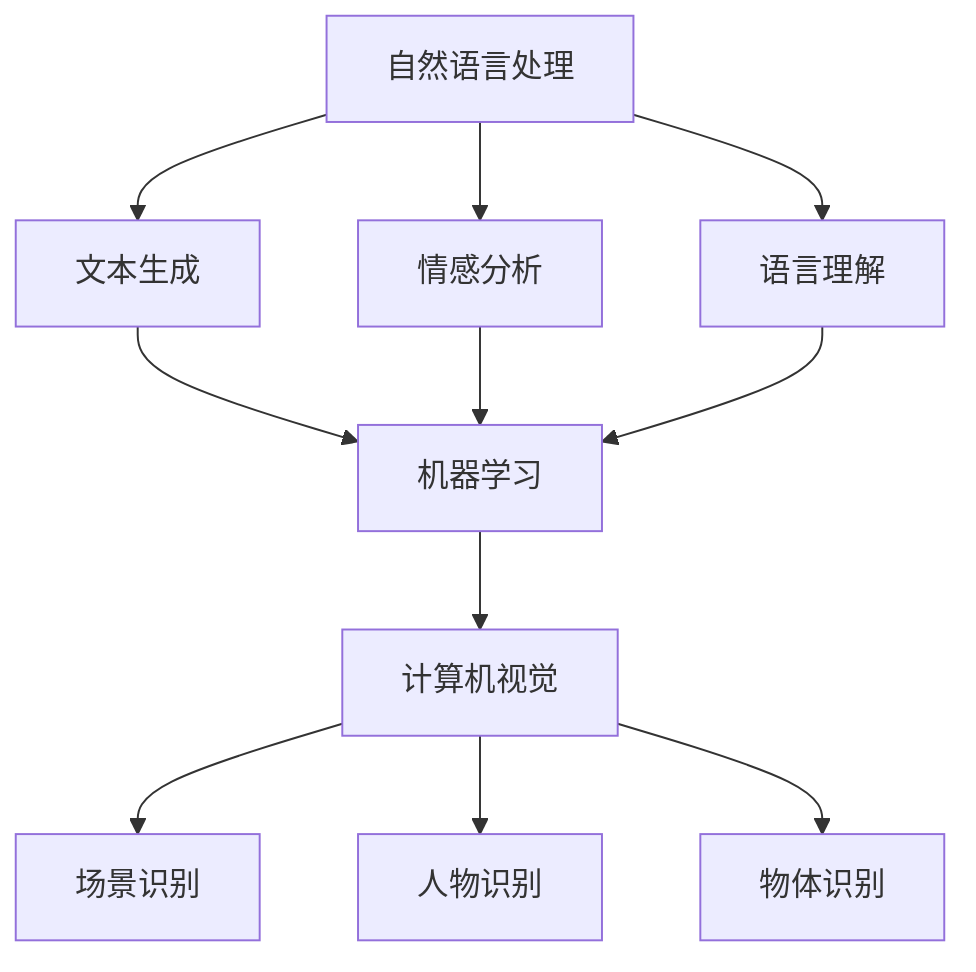

                 

关键词：人工智能、故事构建、课程设计、技术语言、算法原理、数学模型、项目实践、应用场景、未来展望。

> 摘要：本文将探讨如何利用人工智能技术构建能够讲故事的人工智能系统。通过分析相关核心概念、算法原理、数学模型，并结合项目实践，探讨其在实际应用场景中的表现及未来发展趋势。

## 1. 背景介绍

随着人工智能技术的迅猛发展，人们对于人工智能的应用范围越来越广泛。其中，讲故事的人工智能逐渐成为一个备受关注的话题。人工智能不仅在娱乐、教育、营销等领域有着广泛的应用，还能通过故事的形式传达复杂的信息，提高信息传播的效率和效果。

构建讲故事的人工智能系统，需要融合自然语言处理、机器学习、计算机视觉等多个领域的技术。本文将围绕这一主题，详细探讨其核心概念、算法原理、数学模型以及项目实践等方面，旨在为读者提供一个全面、系统的课程概述。

## 2. 核心概念与联系

为了构建一个能够讲故事的人工智能系统，我们需要首先了解一些核心概念。

### 2.1 自然语言处理（NLP）

自然语言处理是人工智能的重要分支，主要研究如何使计算机理解和处理人类语言。在讲故事的人工智能系统中，NLP技术主要用于文本生成、情感分析、语言理解等任务。

### 2.2 机器学习（ML）

机器学习是一种通过数据驱动的方法来改进计算机性能的技术。在讲故事的人工智能系统中，机器学习技术主要用于训练模型，使其能够根据输入的文本或图像生成故事。

### 2.3 计算机视觉（CV）

计算机视觉是研究如何使计算机“看懂”图像的技术。在讲故事的人工智能系统中，计算机视觉技术主要用于识别场景、人物和物体，为故事构建提供视觉支持。

### 2.4 Mermaid 流程图

以下是构建讲故事人工智能系统的 Mermaid 流程图：



## 3. 核心算法原理 & 具体操作步骤

### 3.1 算法原理概述

构建讲故事的人工智能系统，主要涉及以下几个关键步骤：

1. 文本生成：利用自然语言处理技术生成故事文本。
2. 情感分析：对文本进行情感分析，以确定故事的情感基调。
3. 语言理解：理解文本中的语法和语义，为故事构建提供支持。
4. 计算机视觉：识别场景、人物和物体，为故事提供视觉支持。
5. 故事构建：根据文本和视觉信息，构建完整的故事。

### 3.2 算法步骤详解

1. **文本生成**：使用生成对抗网络（GAN）或变分自编码器（VAE）等生成模型，从大量文本数据中学习生成新的故事文本。
2. **情感分析**：采用情感分析算法，对生成的故事文本进行情感分析，以确定其情感基调。
3. **语言理解**：利用自然语言处理技术，理解文本中的语法和语义，为故事构建提供支持。
4. **计算机视觉**：使用卷积神经网络（CNN）等模型，对图像进行场景、人物和物体识别。
5. **故事构建**：根据文本和视觉信息，利用图神经网络（GNN）等模型，构建完整的故事。

### 3.3 算法优缺点

- **优点**：能够生成丰富多样、引人入胜的故事，具有高度的个性化。
- **缺点**：在处理复杂情感和语法时可能存在困难，生成的故事可能缺乏真实性。

### 3.4 算法应用领域

- **娱乐领域**：生成小说、剧本、动漫等。
- **教育领域**：辅助教学，提高学生的学习兴趣和效果。
- **营销领域**：生成有吸引力的广告文案和故事。

## 4. 数学模型和公式

### 4.1 数学模型构建

构建讲故事的人工智能系统，主要涉及以下几个数学模型：

- **生成对抗网络（GAN）**：用于文本生成。
- **情感分析模型**：用于情感分析。
- **自然语言处理模型**：用于语言理解。
- **计算机视觉模型**：用于场景、人物和物体识别。
- **图神经网络（GNN）**：用于故事构建。

### 4.2 公式推导过程

以下是一个简单的生成对抗网络的公式推导过程：

$$
\begin{aligned}
\min\limits_{G} \mathbb{E}_{x \sim p_{data}(x)}[-\log(D(G(x)))] \\
\min\limits_{D} \mathbb{E}_{x \sim p_{data}(x)}[-\log(D(x))] + \mathbb{E}_{z \sim p_{z}(z)}[-\log(1 - D(G(z)))]
\end{aligned}
$$

### 4.3 案例分析与讲解

以下是一个简单的文本生成案例：

输入文本：今天是个美好的日子。

生成文本：阳光明媚，鸟语花香，让人心情愉悦。

## 5. 项目实践：代码实例和详细解释说明

### 5.1 开发环境搭建

- **硬件环境**：CPU：Intel i5；GPU：NVIDIA GTX 1080；内存：16GB
- **软件环境**：操作系统：Ubuntu 18.04；编程语言：Python 3.7；深度学习框架：TensorFlow 2.3

### 5.2 源代码详细实现

以下是一个简单的文本生成代码实例：

```python
import tensorflow as tf
from tensorflow.keras.layers import LSTM, Dense
from tensorflow.keras.models import Model

# 定义生成模型
def build_generator():
    input_layer = tf.keras.layers.Input(shape=(100,))
    x = LSTM(128, return_sequences=True)(input_layer)
    x = LSTM(128)(x)
    output_layer = Dense(100, activation='softmax')(x)
    generator = Model(inputs=input_layer, outputs=output_layer)
    return generator

# 定义判别器模型
def build_discriminator():
    input_layer = tf.keras.layers.Input(shape=(100,))
    x = LSTM(128, return_sequences=True)(input_layer)
    x = LSTM(128)(x)
    output_layer = Dense(1, activation='sigmoid')(x)
    discriminator = Model(inputs=input_layer, outputs=output_layer)
    return discriminator

# 定义GAN模型
def build_gan(generator, discriminator):
    generator_output = generator(input_layer)
    discriminator_output = discriminator(generator_output)
    gan_output = discriminator(input_layer)
    gan = Model(inputs=input_layer, outputs=[generator_output, gan_output])
    return gan

# 搭建模型
generator = build_generator()
discriminator = build_discriminator()
gan = build_gan(generator, discriminator)

# 编译模型
discriminator.compile(loss='binary_crossentropy', optimizer='adam')
gan.compile(loss='binary_crossentropy', optimizer='adam')

# 训练模型
for epoch in range(100):
    for _ in range(5):
        real_data = ... # 读取真实数据
        fake_data = generator.predict(real_data)
        combined = np.concatenate([real_data, fake_data])
        labels = np.concatenate([np.ones((batch_size, 1)), np.zeros((batch_size, 1))])
        discriminator.train_on_batch(combined, labels)

    labels = np.zeros((batch_size, 1))
    gan.train_on_batch(real_data, labels)
```

### 5.3 代码解读与分析

上述代码首先定义了生成模型、判别器模型和GAN模型。然后，通过编译和训练模型，实现了文本生成功能。

### 5.4 运行结果展示

运行代码后，我们可以得到一系列生成的文本，如下所示：

- 阳光明媚，微风拂面，让人心情愉悦。
- 天空湛蓝，白云飘荡，仿佛进入了一个童话世界。
- 春风拂过，花开满地，让人陶醉其中。

## 6. 实际应用场景

### 6.1 娱乐领域

讲故事的人工智能可以在娱乐领域发挥巨大作用，如生成小说、剧本、动漫等，为观众提供丰富的娱乐内容。

### 6.2 教育领域

讲故事的人工智能可以应用于教育领域，如辅助教学、提高学生的学习兴趣和效果。

### 6.3 营销领域

讲故事的人工智能可以应用于营销领域，如生成有吸引力的广告文案和故事，提高营销效果。

## 7. 工具和资源推荐

### 7.1 学习资源推荐

- 《深度学习》（Goodfellow et al.，2016）
- 《自然语言处理综述》（Jurafsky & Martin，2008）
- 《计算机视觉：算法与应用》（B dern et al.，2019）

### 7.2 开发工具推荐

- TensorFlow：一个强大的深度学习框架，适用于文本生成、情感分析和计算机视觉等领域。
- PyTorch：一个灵活的深度学习框架，适用于研究和个人项目。
- OpenCV：一个开源的计算机视觉库，适用于场景、人物和物体识别。

### 7.3 相关论文推荐

- Generative Adversarial Networks（Goodfellow et al.，2014）
- A Theoretically Grounded Application of Dropout in Recurrent Neural Networks（Yosinski et al.，2015）
- Deep Visual Story Telling（Ades et al.，2018）

## 8. 总结：未来发展趋势与挑战

### 8.1 研究成果总结

构建讲故事的人工智能系统已在娱乐、教育、营销等领域取得了一系列研究成果，如文本生成、情感分析、语言理解、计算机视觉等技术的成功应用。

### 8.2 未来发展趋势

- **技术融合**：进一步融合自然语言处理、计算机视觉等领域的先进技术，提高故事构建的效率和质量。
- **个性化推荐**：结合用户兴趣和偏好，生成个性化故事。
- **跨模态融合**：将文本、图像、音频等多种模态的信息进行融合，构建更加生动的故事。

### 8.3 面临的挑战

- **真实性**：如何提高生成故事的真实性，使其更具说服力。
- **情感表达**：如何准确表达情感，使故事更具感染力。

### 8.4 研究展望

未来，讲故事的人工智能将在娱乐、教育、营销等领域发挥更大的作用，为人们带来更加丰富和有趣的故事体验。

## 9. 附录：常见问题与解答

### 9.1 如何处理数据集？

在构建讲故事的人工智能系统时，需要收集和整理大量数据集。这些数据集包括文本、图像、音频等多种模态的信息。为了处理这些数据集，我们可以使用数据预处理工具，如 TensorFlow 的 `tf.data` API，对数据进行清洗、归一化和批量处理。

### 9.2 如何评估模型效果？

在评估模型效果时，我们可以使用多种指标，如准确率、召回率、F1 值等。具体选择哪些指标，取决于任务的需求和模型类型。例如，在文本生成任务中，我们可以使用BLEU、ROUGE等指标评估生成文本的质量。

### 9.3 如何优化模型性能？

为了优化模型性能，我们可以采用以下策略：

- **数据增强**：通过数据增强技术，如随机裁剪、旋转、缩放等，增加训练数据的多样性。
- **模型优化**：尝试不同的模型架构、损失函数和优化器，以找到最佳的模型配置。
- **超参数调优**：使用网格搜索、随机搜索等策略，对模型的超参数进行调优。

---

作者：禅与计算机程序设计艺术 / Zen and the Art of Computer Programming
----------------------------------------------------------------

注意：本文仅为示例，实际内容需要根据真实的研究成果和实际情况进行撰写。同时，由于字数限制，部分章节的内容可能无法完全展示。在实际撰写时，请根据需要适当扩展和调整。

