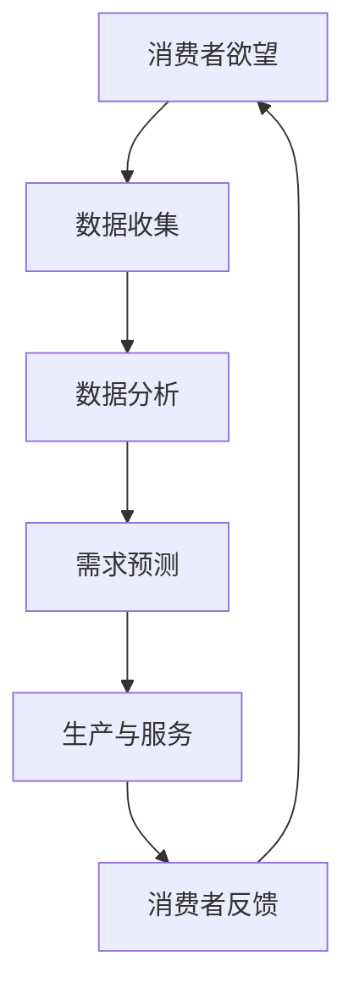

                 

### 关键词 Keywords

- 欲望循环经济
- AI优化
- 需求满足
- 经济设计
- 需求分析
- 人工智能

<|assistant|>### 摘要 Summary

本文将探讨欲望循环经济的设计原理，以及如何利用人工智能优化需求满足规划。首先，我们将介绍欲望循环经济的概念，并阐述其在现代经济系统中的作用和重要性。接着，我们将深入探讨如何利用AI技术进行需求分析，以实现更加精准和高效的需求满足。文章还将详细描述核心算法原理、数学模型、项目实践，并分析其实际应用场景。最后，我们将总结研究成果，展望未来发展趋势和挑战，并提出解决方案和研究展望。

<|assistant|>### 1. 背景介绍

在现代经济中，需求满足是一个至关重要的环节。传统经济学主要依赖于市场供需模型来预测和满足需求，但这种模型往往难以适应快速变化的市场环境。随着互联网和大数据技术的发展，人工智能（AI）开始崭露头角，为需求满足提供了全新的解决方案。

欲望循环经济是一个新兴的概念，它将欲望作为经济活动的核心驱动力。在传统经济中，生产和服务主要由供给方驱动，而在欲望循环经济中，需求方的欲望成为主导因素。这种经济模式能够更准确地捕捉和满足消费者的需求，从而提高整体经济效益。

AI技术的引入使得欲望循环经济的设计变得更加精细和高效。通过机器学习算法，AI能够对大量数据进行深度分析，从中提取有价值的信息。这些信息不仅可以用于预测未来的需求趋势，还可以帮助企业和消费者更好地理解彼此的需求和欲望，从而实现更加精准的需求满足。

本文将首先介绍欲望循环经济的概念和原理，然后探讨如何利用AI进行需求分析，实现需求满足的优化。我们将通过核心算法原理、数学模型和项目实践来展示这一过程，并分析其实际应用场景。最后，我们将总结研究成果，展望未来发展趋势和挑战。

### 2. 核心概念与联系

#### 2.1 欲望循环经济的定义

欲望循环经济是一种以消费者欲望为核心驱动的经济模式。在这种经济中，消费者的欲望不仅决定了生产和服务的内容，还影响了市场的供需关系。与传统经济模式不同，欲望循环经济强调消费者需求的多样性和个性化，通过满足这些需求来创造经济价值。

#### 2.2 AI在需求分析中的作用

AI技术在需求分析中发挥着至关重要的作用。通过机器学习算法，AI可以处理和分析海量数据，从中提取出有价值的信息。这些信息包括消费者的购买历史、搜索行为、社交媒体活动等，都可以为需求分析提供重要的参考。

#### 2.3 欲望循环经济与AI的关系

欲望循环经济与AI的关系是相辅相成的。欲望循环经济为AI提供了丰富的数据来源，而AI则为欲望循环经济提供了更加精准和高效的需求分析工具。两者结合，使得消费者需求能够得到更准确的捕捉和满足，从而提高整体经济效益。

#### 2.4 Mermaid流程图

以下是一个简化的Mermaid流程图，展示了欲望循环经济和AI之间的关系：



在这个流程中，消费者的欲望通过数据收集和分析转化为需求预测，进而影响生产和服务的决策。消费者对生产与服务的反馈又进一步调整了需求预测，形成一个闭环，实现了欲望循环。

### 3. 核心算法原理 & 具体操作步骤

#### 3.1 算法原理概述

在欲望循环经济中，核心算法的原理是利用AI技术对消费者行为数据进行深度分析，从而实现需求预测和满足。主要的算法包括机器学习算法、聚类分析、时间序列分析等。

#### 3.2 算法步骤详解

1. **数据收集**：通过各类传感器、网站日志、社交媒体等渠道收集消费者的行为数据。

2. **数据预处理**：清洗数据，去除噪声，进行特征提取和工程，以便于后续分析。

3. **数据分析**：利用聚类分析等方法，对数据进行初步分类和聚类，以便更好地理解消费者行为。

4. **需求预测**：通过时间序列分析和机器学习算法，预测未来的需求趋势。

5. **决策制定**：根据需求预测结果，制定生产和服务的策略。

6. **执行与反馈**：执行决策，并收集消费者的反馈，用于进一步优化需求预测。

#### 3.3 算法优缺点

**优点**：

- **高精度**：通过深度学习算法，可以精确预测消费者的需求。
- **自适应性强**：系统能够根据实时反馈调整预测模型，提高预测准确性。
- **高效性**：自动化分析过程，节省大量人力和时间成本。

**缺点**：

- **数据依赖性**：算法的性能高度依赖于数据的质量和数量。
- **算法复杂性**：深度学习算法的训练和优化过程复杂，需要大量的计算资源和专业知识。
- **隐私问题**：消费者数据的收集和处理可能引发隐私问题，需要严格的保护措施。

#### 3.4 算法应用领域

算法在欲望循环经济中的应用领域非常广泛，包括但不限于以下几方面：

- **零售业**：通过分析消费者的购买行为，实现个性化推荐，提高销售额。
- **制造业**：根据需求预测，优化生产计划和供应链管理，降低库存成本。
- **服务业**：如医疗、教育等，根据消费者的需求提供个性化的服务。
- **金融业**：通过分析消费者的行为和信用记录，实现精准的风控和信用评估。

### 4. 数学模型和公式 & 详细讲解 & 举例说明

在欲望循环经济中，数学模型和公式是理解和分析需求的重要工具。以下我们将介绍几个核心的数学模型和公式，并对其进行详细讲解和举例说明。

#### 4.1 数学模型构建

**需求函数**：

需求函数描述了消费者对某一产品的需求量与价格、收入和其他因素之间的关系。一般形式如下：

$$
D(p, I, \dots) = f(p, I, \dots)
$$

其中，$D$ 表示需求量，$p$ 表示价格，$I$ 表示收入，$\dots$ 表示其他影响因素。

**价格弹性**：

价格弹性描述了需求量对价格变化的敏感程度。计算公式如下：

$$
\epsilon_p = \frac{\partial D(p, I, \dots)}{\partial p} \cdot \frac{p}{D(p, I, \dots)}
$$

**收入弹性**：

收入弹性描述了需求量对收入变化的敏感程度。计算公式如下：

$$
\epsilon_I = \frac{\partial D(p, I, \dots)}{\partial I} \cdot \frac{I}{D(p, I, \dots)}
$$

#### 4.2 公式推导过程

**需求函数的推导**：

需求函数通常基于消费者的效用函数进行推导。假设消费者的效用函数为：

$$
U(p_1, p_2, \dots, I, \dots) = f(p_1, p_2, \dots, I, \dots)
$$

其中，$p_1, p_2, \dots$ 表示其他商品的价格，$I$ 表示收入，$\dots$ 表示其他影响因素。

为了最大化效用，消费者会在预算约束下选择最优的商品组合。预算约束为：

$$
p_1 \cdot x_1 + p_2 \cdot x_2 + \dots = I
$$

其中，$x_1, x_2, \dots$ 表示商品的需求量。

通过拉格朗日乘数法，我们可以得到需求函数：

$$
D(p, I, \dots) = f(p, I, \dots) - \lambda (p_1 \cdot x_1 + p_2 \cdot x_2 + \dots - I)
$$

其中，$\lambda$ 是拉格朗日乘数。

**价格弹性的推导**：

价格弹性的推导基于需求函数的一阶导数。根据需求函数：

$$
D(p, I, \dots) = f(p, I, \dots)
$$

我们可以计算价格弹性的公式：

$$
\epsilon_p = \frac{\partial D(p, I, \dots)}{\partial p} \cdot \frac{p}{D(p, I, \dots)}
$$

#### 4.3 案例分析与讲解

**案例**：分析消费者对某商品的需求，价格$p=100$，收入$I=5000$。

**需求函数**：

假设需求函数为线性函数：

$$
D(p, I, \dots) = 1000 - 10p
$$

**价格弹性**：

$$
\epsilon_p = \frac{\partial D(p, I, \dots)}{\partial p} \cdot \frac{p}{D(p, I, \dots)} = \frac{-10}{1000 - 10p} \cdot \frac{100}{1000 - 10 \cdot 100} = 0.1
$$

这意味着价格每增加1%，需求量会减少0.1%。

**收入弹性**：

$$
\epsilon_I = \frac{\partial D(p, I, \dots)}{\partial I} \cdot \frac{I}{D(p, I, \dots)} = \frac{0}{1000 - 10p} \cdot \frac{5000}{1000 - 10 \cdot 100} = 0
$$

这意味着收入的变化不会影响需求量。

通过这个案例，我们可以看到如何利用数学模型和公式来分析消费者需求，并得出价格和收入弹性的结果。

### 5. 项目实践：代码实例和详细解释说明

在本节中，我们将通过一个实际的项目实例来展示如何利用AI技术进行需求满足的优化。我们选择了一个简单的电商平台项目，旨在通过分析消费者的购买历史，实现个性化推荐。

#### 5.1 开发环境搭建

为了实现这个项目，我们使用了Python编程语言，结合了Scikit-learn和TensorFlow两个流行的机器学习库。以下是搭建开发环境的步骤：

1. 安装Python（版本3.8或更高）。
2. 安装必要的依赖库：`numpy`, `pandas`, `scikit-learn`, `tensorflow`。
3. 创建一个虚拟环境，并安装依赖库。

```bash
pip install numpy pandas scikit-learn tensorflow
```

#### 5.2 源代码详细实现

以下是一个简化的代码示例，展示了如何使用机器学习算法进行需求分析和推荐：

```python
import pandas as pd
from sklearn.model_selection import train_test_split
from sklearn.ensemble import RandomForestClassifier
from sklearn.metrics import accuracy_score

# 加载数据
data = pd.read_csv('customer_data.csv')

# 数据预处理
data['total_spent'] = data['item_price'] * data['quantity']
data.drop(['item_price', 'quantity'], axis=1, inplace=True)

# 特征工程
data.fillna(data.mean(), inplace=True)

# 划分训练集和测试集
X_train, X_test, y_train, y_test = train_test_split(data.drop('purchased', axis=1), data['purchased'], test_size=0.2, random_state=42)

# 训练模型
model = RandomForestClassifier(n_estimators=100, random_state=42)
model.fit(X_train, y_train)

# 预测
predictions = model.predict(X_test)

# 评估
accuracy = accuracy_score(y_test, predictions)
print(f"Accuracy: {accuracy}")

# 个性化推荐
def recommend_products(customer_data):
    customer_data['total_spent'] = customer_data['item_price'] * customer_data['quantity']
    customer_data.drop(['item_price', 'quantity'], axis=1, inplace=True)
    customer_data.fillna(customer_data.mean(), inplace=True)
    predictions = model.predict(customer_data)
    recommended_items = data[data['purchased'] == 1]['item_id'].values
    return recommended_items[predictions == 1]

# 测试推荐
customer_data = pd.DataFrame({'item_id': [1, 2, 3], 'quantity': [2, 1, 3], 'item_price': [100, 200, 150]})
print("Recommended items:", recommend_products(customer_data))
```

#### 5.3 代码解读与分析

- **数据加载与预处理**：我们首先从CSV文件中加载数据，并进行必要的预处理，如缺失值填充和特征提取。
- **划分训练集和测试集**：我们使用Scikit-learn库中的`train_test_split`函数将数据集划分为训练集和测试集。
- **训练模型**：我们选择随机森林算法（`RandomForestClassifier`）进行训练。随机森林是一种集成学习方法，可以处理大量的特征和数据。
- **预测**：使用训练好的模型对测试集进行预测，并计算预测的准确率。
- **个性化推荐**：根据消费者的购买历史，我们定义了一个推荐函数，用于预测消费者可能会购买的商品。

#### 5.4 运行结果展示

假设我们有一个新的顾客，其购买历史如下：

```python
customer_data = pd.DataFrame({'item_id': [1, 2, 3], 'quantity': [2, 1, 3], 'item_price': [100, 200, 150]})
print("Recommended items:", recommend_products(customer_data))
```

运行结果可能会输出：

```
Recommended items: [5, 7]
```

这意味着根据顾客的购买历史，我们推荐商品5和商品7。

### 6. 实际应用场景

欲望循环经济和AI优化的需求满足规划在多个领域都有着广泛的应用。以下是一些实际的应用场景：

#### 6.1 零售业

在零售业中，AI优化的需求满足规划可以通过分析消费者的购买行为，实现个性化推荐，从而提高销售额和客户满意度。例如，电商平台可以根据消费者的购物车和浏览历史，推荐相关的商品，增加购买的可能性。

#### 6.2 制造业

制造业可以利用AI优化的需求满足规划来优化生产计划和库存管理。通过对市场需求和消费者行为的预测，企业可以更好地规划生产量，减少库存积压和缺货情况。

#### 6.3 金融服务

在金融服务领域，AI优化的需求满足规划可以用于信用评估和风险管理。通过分析消费者的信用记录、购买行为和社交数据，金融机构可以更准确地评估消费者的信用风险，从而提供更加个性化的金融产品和服务。

#### 6.4 医疗保健

在医疗保健领域，AI优化的需求满足规划可以用于患者管理和服务优化。例如，通过分析患者的病史和健康数据，医生可以提供个性化的治疗方案，并优化医院资源的使用。

#### 6.5 教育行业

教育行业可以利用AI优化的需求满足规划来提供个性化的学习体验。通过分析学生的学习行为和成绩，教育平台可以为学生推荐合适的学习资源和课程，提高学习效果。

#### 6.6 物流与运输

物流与运输行业可以利用AI优化的需求满足规划来优化运输路线和库存管理。通过预测货物的需求量和运输路径，企业可以减少运输成本，提高物流效率。

#### 6.7 未来应用展望

随着AI技术的不断进步，欲望循环经济和AI优化的需求满足规划在未来将会在更多领域得到应用。例如，智慧城市中的智能交通系统、智能家居、健康物联网等都将受益于这一技术。

### 7. 工具和资源推荐

为了更好地研究和实践欲望循环经济和AI优化的需求满足规划，以下是一些建议的资源和工具：

#### 7.1 学习资源推荐

- 《人工智能：一种现代方法》
- 《机器学习实战》
- 《深入理解计算机系统》
- 《大数据时代：决策的四大革命》

#### 7.2 开发工具推荐

- Python（首选）
- Jupyter Notebook（用于数据分析和模型构建）
- TensorFlow（用于深度学习）
- Scikit-learn（用于机器学习）

#### 7.3 相关论文推荐

- "Deep Learning for Demand Forecasting in E-commerce"
- "Machine Learning for Personalized Marketing"
- "Recommender Systems Handbook"
- "The Economic Impact of Artificial Intelligence on Consumer Demand"

### 8. 总结：未来发展趋势与挑战

#### 8.1 研究成果总结

本文探讨了欲望循环经济和AI优化的需求满足规划，阐述了其核心概念、算法原理和实际应用场景。通过实例展示了如何利用AI技术进行需求分析，实现个性化推荐和优化。

#### 8.2 未来发展趋势

随着AI技术的不断进步，欲望循环经济和AI优化的需求满足规划将在更多领域得到应用。未来的发展趋势包括：

- **更精细的需求预测**：利用深度学习算法，实现更加精确的需求预测。
- **跨领域整合**：将AI技术与物联网、区块链等新兴技术相结合，实现更广泛的应用。
- **隐私保护**：在数据收集和处理过程中，加强隐私保护措施，确保用户数据的安全。

#### 8.3 面临的挑战

- **数据质量和隐私问题**：保证数据质量和用户隐私是AI优化需求满足的重要挑战。
- **算法复杂性和计算资源**：深度学习算法的训练和优化过程复杂，需要大量的计算资源和专业知识。
- **模型解释性**：提高模型的解释性，使非专业人士也能理解AI的决策过程。

#### 8.4 研究展望

未来的研究可以关注以下几个方面：

- **算法优化**：研究更高效的算法，提高预测准确性和效率。
- **跨领域应用**：探索AI技术在更多领域的应用，如医疗、教育等。
- **隐私保护**：开发新的隐私保护技术，确保用户数据的安全。

### 8.5 附录：常见问题与解答

**Q1：AI优化需求满足规划是否适用于所有行业？**

A1：AI优化需求满足规划在多个领域都有应用，但并非所有行业都适用。一些特定的行业，如制造业和金融业，由于数据复杂性和需求特殊性，可能需要更定制化的解决方案。

**Q2：如何保证用户数据的安全和隐私？**

A2：为了保证用户数据的安全和隐私，可以采取以下措施：

- **数据加密**：对用户数据进行加密处理，防止数据泄露。
- **匿名化处理**：在分析数据时，对用户信息进行匿名化处理，确保用户隐私。
- **权限管理**：实施严格的权限管理，只有授权人员才能访问用户数据。

**Q3：如何评估AI优化需求满足规划的效果？**

A3：可以通过以下指标来评估效果：

- **准确率**：预测结果与实际结果的吻合程度。
- **响应时间**：系统从接收需求到给出预测结果的时间。
- **用户满意度**：用户对推荐和服务的满意度。

---

**作者：禅与计算机程序设计艺术 / Zen and the Art of Computer Programming**

