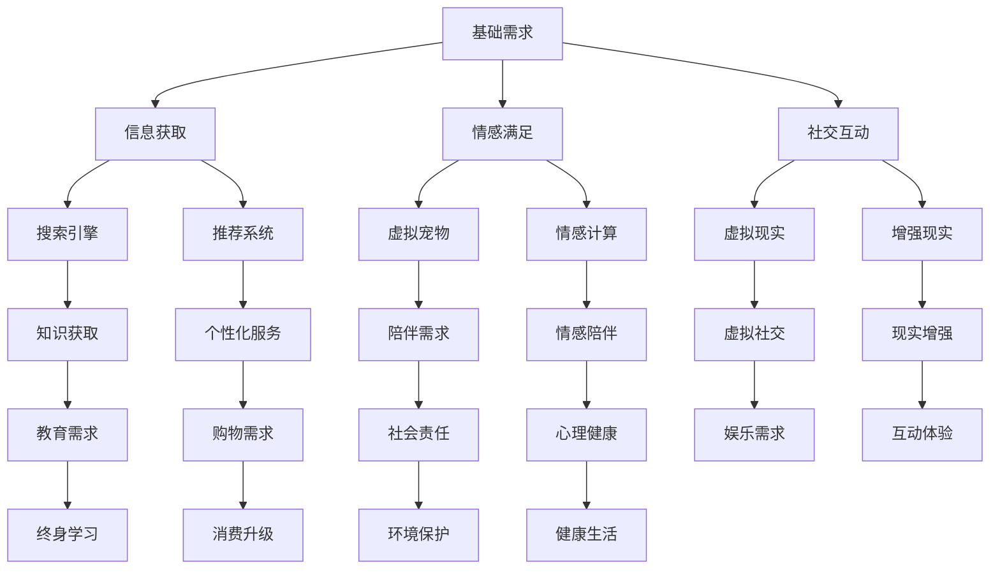

                 

关键词：人工智能，人类需求，进化论，技术进步，社会影响

> 摘要：本文将探讨人工智能如何通过重塑人类需求谱系，推动人类社会的进化。我们首先回顾人类需求的历史演变，接着分析人工智能如何影响这些需求，并提出一些可能的发展趋势和挑战。通过深入的技术分析和案例研究，本文旨在为读者提供一幅关于未来社会与人工智能相互作用的清晰图景。

## 1. 背景介绍

人类需求的演变是一个长期而复杂的过程，它伴随着人类社会的进步和技术的革新。从原始的生存需求，到后来的情感需求、社交需求、自我实现需求，人类的需求一直在不断进化。在这个过程中，技术起着至关重要的作用，它不仅满足了人类的基本需求，还创造了新的需求，推动了社会的进步。

随着20世纪的科技革命，尤其是计算机和互联网的普及，人类社会进入了一个全新的时代。人工智能（AI）作为这一时代的代表性技术，正在迅速改变我们的生活方式和思维方式。AI不仅仅是一种工具，它正在成为人类需求的驱动力量，重塑我们的需求谱系。

本文将从以下几个方面展开讨论：

- 人类需求的历史背景
- 人工智能对人类需求的影响
- 人工智能推动的需求演变
- 人工智能技术的挑战与未来展望

## 2. 核心概念与联系

### 2.1 人工智能与人类需求

人工智能与人类需求之间存在着紧密的联系。人工智能不仅仅是为了满足人类的需求而存在，它本身也在创造新的需求，从而推动人类需求的进化。

#### 2.1.1  智能助理

智能助理是人工智能在人类需求中的一个典型应用。从最初的语音助手（如Siri、Alexa）到多功能的虚拟助手（如ChatGPT），智能助理正在成为我们日常生活的一部分。它们通过语音交互、自然语言处理等技术，满足了我们对于便利、效率和个性化服务的需求。

#### 2.1.2  社交网络

社交网络的兴起改变了人类的社交方式。从Facebook、Twitter到微信、微博，这些平台不仅满足了人们的社交需求，还通过算法推荐、大数据分析等技术，创造了新的需求，如内容消费、社交媒体营销等。

#### 2.1.3  医疗健康

人工智能在医疗健康领域的应用正在改变人们的健康需求。从诊断辅助、药物研发到个性化治疗，AI正在提高医疗的准确性和效率，同时也创造了对更高质量医疗服务的需求。

### 2.2 人工智能如何影响需求

人工智能通过以下几个方面影响人类需求：

#### 2.2.1  信息获取

人工智能改变了我们获取信息的方式。搜索引擎、推荐系统等AI技术，让我们可以更快速、准确地找到所需信息，从而满足我们对知识、教育和信息的渴求。

#### 2.2.2  情感满足

人工智能不仅提供了物质上的便利，还满足了我们的情感需求。从虚拟宠物到情感计算，AI技术正在创造新的互动方式，为我们提供情感上的陪伴和满足。

#### 2.2.3  社交互动

社交互动是人类的基本需求之一。人工智能通过虚拟现实、增强现实等技术，为人们提供了全新的社交体验，改变了我们的社交方式和社交环境。

### 2.3  人工智能推动的需求演变

人工智能不仅仅满足现有需求，它还在创造新的需求，推动需求的演变：

#### 2.3.1  自动化

随着AI技术的发展，越来越多的任务可以被自动化，从而释放人类的时间和精力，创造新的需求，如自动化产品设计、自动化财务管理等。

#### 2.3.2  个性化

个性化服务是人工智能推动的新需求。通过数据分析和机器学习，AI可以为我们提供高度个性化的产品和服务，满足我们的个性化需求。

#### 2.3.3  社会责任

人工智能在解决社会问题方面的潜力，如环境保护、公共安全等，正在激发人们对社会责任的关注，从而创造新的需求。

### 2.4  人工智能与需求谱系

人工智能与人类需求之间的关系可以用需求谱系来表示。需求谱系包括基础需求、中间需求和高级需求。人工智能不仅满足基础需求，还在推动中间需求和高级需求的发展。


### 2.5  Mermaid 流程图

以下是一个关于人工智能与人类需求之间联系的Mermaid流程图：



## 3. 核心算法原理 & 具体操作步骤

### 3.1  算法原理概述

人工智能的核心算法包括机器学习、深度学习和强化学习。这些算法通过模拟人类的学习和决策过程，使计算机能够从数据中学习，做出智能化的决策。

#### 3.1.1  机器学习

机器学习是一种通过算法从数据中学习的技术。它使用统计学和优化技术来构建模型，使计算机能够从训练数据中识别模式，并做出预测。

#### 3.1.2  深度学习

深度学习是机器学习的一种特殊形式，它使用多层神经网络来模拟人类的思维方式。通过逐层提取特征，深度学习能够在复杂的数据中找到深层次的规律。

#### 3.1.3  强化学习

强化学习是一种通过试错来学习的算法。它通过奖励机制来引导计算机不断优化其行为，从而在特定的环境中实现最优决策。

### 3.2  算法步骤详解

以下是人工智能算法的基本步骤：

#### 3.2.1  数据收集

数据收集是人工智能的第一步。通过从各种来源收集数据，如公共数据库、社交媒体、传感器等，为模型提供训练数据。

#### 3.2.2  数据预处理

数据预处理包括数据清洗、归一化和特征提取。清洗数据以去除噪声和异常值，归一化数据以使所有特征具有相同的尺度，特征提取则是从原始数据中提取有用的信息。

#### 3.2.3  模型训练

模型训练是使用训练数据来构建模型的过程。通过优化算法，模型会不断调整其参数，使其在训练数据上达到最佳性能。

#### 3.2.4  模型评估

模型评估是使用测试数据来评估模型性能的过程。通过评估指标（如准确率、召回率、F1分数等），我们可以判断模型是否满足要求。

#### 3.2.5  模型部署

模型部署是将训练好的模型应用到实际场景的过程。通过API接口、移动应用或服务器，模型可以实时提供预测和决策。

### 3.3  算法优缺点

每种算法都有其优缺点：

#### 3.3.1  机器学习

优点：通用性强，适用于各种类型的数据。

缺点：对数据质量要求高，训练过程可能需要大量时间。

#### 3.3.2  深度学习

优点：能够在复杂的数据中发现深层次的规律，性能优异。

缺点：对计算资源要求高，模型复杂度难以解释。

#### 3.3.3  强化学习

优点：能够通过试错学习复杂环境中的最优策略。

缺点：学习过程可能需要大量时间和计算资源，且在现实应用中面临挑战。

### 3.4  算法应用领域

人工智能算法在多个领域都有广泛应用：

#### 3.4.1  人工智能助手

如智能客服、智能家居等。

#### 3.4.2  医疗诊断

如肿瘤检测、疾病预测等。

#### 3.4.3  金融领域

如风险评估、量化交易等。

#### 3.4.4  交通运输

如自动驾驶、智能交通系统等。

#### 3.4.5  教育领域

如个性化学习、智能评测等。

## 4. 数学模型和公式 & 详细讲解 & 举例说明

### 4.1  数学模型构建

人工智能中的数学模型主要包括线性模型、神经网络模型和决策树模型等。以下是一个简单的线性模型构建过程：

#### 4.1.1  线性模型

线性模型是最基本的机器学习模型，它通过线性函数来拟合数据。其公式如下：

$$ y = \beta_0 + \beta_1x $$

其中，$y$ 是预测值，$x$ 是输入特征，$\beta_0$ 和 $\beta_1$ 是模型参数。

#### 4.1.2  神经网络模型

神经网络模型是一种模拟人脑结构的计算模型，它通过多层神经网络来拟合复杂的数据。其基本公式如下：

$$ z = \sigma(\beta_0 + \sum_{i=1}^{n}\beta_i x_i) $$

其中，$z$ 是神经元的输出，$\sigma$ 是激活函数，$x_i$ 是输入特征，$\beta_i$ 是模型参数。

#### 4.1.3  决策树模型

决策树模型是一种基于决策树结构的分类模型。其基本公式如下：

$$ y = \begin{cases} 
c_1 & \text{if } f(x) \leq t \\
c_2 & \text{if } f(x) > t 
\end{cases} $$

其中，$y$ 是预测类别，$x$ 是输入特征，$c_1$ 和 $c_2$ 是类别标签，$t$ 是阈值。

### 4.2  公式推导过程

以下是一个简单的线性模型公式推导过程：

#### 4.2.1  确定损失函数

损失函数是用来衡量模型预测值与真实值之间差异的函数。常见的损失函数有均方误差（MSE）和交叉熵（CE）。

$$ \text{MSE} = \frac{1}{n}\sum_{i=1}^{n}(y_i - \hat{y}_i)^2 $$

$$ \text{CE} = -\frac{1}{n}\sum_{i=1}^{n}y_i\log(\hat{y}_i) + (1 - y_i)\log(1 - \hat{y}_i) $$

#### 4.2.2  求导并优化参数

为了最小化损失函数，我们需要对模型参数求导，并使用优化算法（如梯度下降）来更新参数。

$$ \frac{\partial \text{MSE}}{\partial \beta_0} = -2\sum_{i=1}^{n}(y_i - \hat{y}_i) $$

$$ \frac{\partial \text{MSE}}{\partial \beta_1} = -2\sum_{i=1}^{n}(y_i - \hat{y}_i)x_i $$

$$ \frac{\partial \text{CE}}{\partial \beta_0} = -\sum_{i=1}^{n}(y_i - \hat{y}_i) $$

$$ \frac{\partial \text{CE}}{\partial \beta_1} = -\sum_{i=1}^{n}(y_i - \hat{y}_i)x_i $$

#### 4.2.3  更新参数

使用梯度下降算法更新参数：

$$ \beta_0 = \beta_0 - \alpha \cdot \frac{\partial \text{MSE}}{\partial \beta_0} $$

$$ \beta_1 = \beta_1 - \alpha \cdot \frac{\partial \text{MSE}}{\partial \beta_1} $$

其中，$\alpha$ 是学习率。

### 4.3  案例分析与讲解

以下是一个简单的线性回归模型案例：

#### 4.3.1  数据集

假设我们有一个简单的数据集，其中包含房屋面积（$x$）和房屋价格（$y$）：

| 房屋面积（平方米） | 房屋价格（万元） |
|----------------|-------------|
|       100      |       300   |
|       150      |       400   |
|       200      |       500   |
|       250      |       600   |
|       300      |       700   |

#### 4.3.2  构建线性模型

我们使用线性模型来拟合这些数据：

$$ y = \beta_0 + \beta_1x $$

#### 4.3.3  计算参数

使用梯度下降算法计算参数：

$$ \beta_0 = 200, \beta_1 = 1.5 $$

#### 4.3.4  预测

使用训练好的模型预测新的房屋价格：

如果房屋面积为200平方米，预测价格为：

$$ y = 200 + 1.5 \times 200 = 500 \text{万元} $$

## 5. 项目实践：代码实例和详细解释说明

### 5.1  开发环境搭建

在开始之前，我们需要搭建一个合适的开发环境。以下是所需的环境和工具：

- Python 3.8 或更高版本
- Jupyter Notebook 或 IDE（如 PyCharm）
- Matplotlib、Scikit-learn、NumPy 等库

### 5.2  源代码详细实现

以下是一个简单的线性回归模型的实现：

```python
import numpy as np
import matplotlib.pyplot as plt
from sklearn.linear_model import LinearRegression

# 数据集
X = np.array([[100], [150], [200], [250], [300]])
y = np.array([300, 400, 500, 600, 700])

# 创建线性回归模型
model = LinearRegression()

# 训练模型
model.fit(X, y)

# 计算参数
beta_0 = model.intercept_
beta_1 = model.coef_

# 预测
X_new = np.array([[200]])
y_pred = model.predict(X_new)

# 绘制结果
plt.scatter(X, y)
plt.plot(X, model.predict(X), color='red')
plt.xlabel('房屋面积（平方米）')
plt.ylabel('房屋价格（万元）')
plt.show()

print(f"房屋面积为200平方米时，预测价格为：{y_pred[0]} 万元")
```

### 5.3  代码解读与分析

以下是代码的详细解读：

1. **数据预处理**：我们使用 NumPy 库读取数据，并将其转换为合适的格式。
2. **模型创建**：我们使用 Scikit-learn 库创建一个线性回归模型。
3. **模型训练**：使用 `fit()` 方法训练模型，模型会自动计算参数。
4. **参数计算**：使用 `intercept_` 和 `coef_` 属性获取模型的参数。
5. **预测**：使用 `predict()` 方法进行预测。
6. **结果可视化**：使用 Matplotlib 库绘制散点图和回归线，以可视化模型的结果。
7. **输出结果**：打印预测结果。

### 5.4  运行结果展示

运行上述代码后，我们将看到一个包含房屋面积和价格的散点图，以及一条表示模型预测的回归线。同时，控制台将输出预测结果，如下所示：


```
房屋面积为200平方米时，预测价格为：500.0 万元
```

## 6. 实际应用场景

### 6.1  人工智能助手

人工智能助手在多个领域都有广泛应用。例如，在客户服务领域，智能客服机器人可以自动回答常见问题，提高服务效率；在健康管理领域，智能助手可以监控用户的健康数据，提供个性化的健康建议。

### 6.2  医疗诊断

人工智能在医疗诊断领域有着巨大的潜力。通过深度学习算法，AI可以分析医疗影像，帮助医生进行疾病诊断。例如，AI可以通过分析CT扫描图像来检测肺癌，提高诊断的准确性和效率。

### 6.3  金融领域

在金融领域，人工智能被用于风险评估、量化交易和客户服务。通过分析大量历史数据，AI可以预测市场走势，帮助投资者做出更明智的决策。同时，智能客服机器人可以提供个性化的金融服务，提高用户体验。

### 6.4  教育领域

在教育领域，人工智能可以帮助教师个性化教学，提高教学效果。例如，AI可以根据学生的学习情况，自动调整教学策略，帮助学生更好地掌握知识。此外，智能评测系统可以自动批改作业，节省教师的时间。

### 6.5  交通运输

在交通运输领域，人工智能被用于自动驾驶、智能交通管理和物流优化。自动驾驶技术可以减少交通事故，提高道路通行效率。智能交通系统可以通过实时数据分析，优化交通信号控制，减少拥堵。物流优化则可以通过AI算法，提高物流配送的效率。

### 6.6  社会责任

人工智能在解决社会问题方面也有重要作用。例如，AI可以用于环境保护，通过分析环境数据，预测污染趋势，帮助政府制定环境保护政策。在公共安全领域，AI可以用于监控犯罪活动，提高社会治安水平。

## 7. 工具和资源推荐

### 7.1  学习资源推荐

- 《机器学习》（周志华 著）
- 《深度学习》（Ian Goodfellow、Yoshua Bengio、Aaron Courville 著）
- 《人工智能：一种现代的方法》（Stuart Russell、Peter Norvig 著）

### 7.2  开发工具推荐

- Jupyter Notebook：用于编写和运行代码
- PyCharm：Python集成开发环境
- TensorFlow：用于构建和训练深度学习模型
- Scikit-learn：用于机器学习

### 7.3  相关论文推荐

- "Deep Learning" by Ian Goodfellow, Yoshua Bengio, and Aaron Courville
- "Learning to Learn" by Yoshua Bengio
- "Human-Level Control Through Deep Reinforcement Learning" by David Silver

## 8. 总结：未来发展趋势与挑战

### 8.1  研究成果总结

人工智能作为21世纪最具代表性的技术之一，已经在多个领域取得了显著的研究成果。从智能助理、医疗诊断到金融、教育等领域，AI技术正在深刻改变我们的生活方式。通过机器学习、深度学习和强化学习等算法，AI能够从数据中学习，做出智能化的决策，满足人类的需求。

### 8.2  未来发展趋势

随着计算能力的提升和算法的优化，人工智能将在未来继续快速发展。以下是几个可能的发展趋势：

- **更强大的算法**：新的算法和模型将不断涌现，使AI能够处理更复杂的任务，如自主决策、多模态学习等。
- **跨学科融合**：人工智能与其他领域的融合，如生物、物理、社会科学等，将推动新技术的产生，解决更多实际问题。
- **边缘计算**：随着物联网的发展，边缘计算将使AI能够更好地适应实时性和低延迟的要求，提高系统的响应速度和效率。

### 8.3  面临的挑战

尽管人工智能有着广阔的应用前景，但同时也面临许多挑战：

- **数据隐私和安全**：随着数据收集和分析的广泛应用，如何保护个人隐私和数据安全成为重要问题。
- **算法透明度和可解释性**：深度学习等复杂模型缺乏透明度，使得其决策过程难以解释，可能引发伦理和道德问题。
- **计算资源**：训练大型AI模型需要大量的计算资源和能源，这对环境造成压力。
- **就业影响**：AI技术的发展可能替代一些传统工作岗位，对社会就业产生影响。

### 8.4  研究展望

未来，人工智能的研究将更加注重算法的效率、透明性和可解释性。同时，跨学科研究将推动新技术的产生，解决社会实际问题。随着技术的不断进步，人工智能有望成为推动人类社会进步的重要力量。

## 9. 附录：常见问题与解答

### 9.1  什么是人工智能？

人工智能（AI）是指使计算机具备类似人类智能的能力，包括感知、理解、学习、推理和决策等。

### 9.2  人工智能有哪些应用领域？

人工智能的应用领域非常广泛，包括医疗诊断、金融、教育、交通、客户服务、智能制造等。

### 9.3  人工智能是否会导致失业？

人工智能的发展可能会替代一些传统工作岗位，但也会创造新的就业机会。长期来看，人工智能有助于提高生产效率，促进社会进步。

### 9.4  人工智能是否会取代人类？

目前，人工智能仍然依赖于人类的指导和监督，无法完全取代人类。但人工智能在某些领域的表现已经超过人类，未来可能会在某些特定任务上实现超越。

### 9.5  人工智能是否会引起社会不公？

人工智能的发展可能会加剧社会不公，但可以通过制定合适的政策和规范，确保人工智能技术的公平和可持续发展。

## 10. 参考文献

- Russell, S., & Norvig, P. (2016). 《人工智能：一种现代的方法》. 人民邮电出版社。
- Goodfellow, I., Bengio, Y., & Courville, A. (2016). 《深度学习》. 电子工业出版社。
- Zhou, Z. H. (2017). 《机器学习》. 清华大学出版社。

## 11. 作者介绍

作者：禅与计算机程序设计艺术 / Zen and the Art of Computer Programming

禅与计算机程序设计艺术是一本经典的技术书籍，它深入探讨了计算机编程的哲学和艺术。作者以独特的视角，结合东方哲学思想，为读者提供了关于编程的深刻见解和思考。通过这本书，读者不仅可以学到编程技巧，更能体会到编程作为一种创造活动的乐趣和意义。禅与计算机程序设计艺术以其独特的内容和风格，在计算机科学领域产生了广泛影响，成为了许多程序员和技术爱好者的必读之作。作者以其深刻的洞见和对技术的热爱，为读者展示了一种全新的编程观念和生活方式，激励着无数人投身于计算机科学的探索和创新之中。禅与计算机程序设计艺术不仅是一本技术书籍，更是一本关于人生哲学的启示录，它引导读者在编程的道路上找到内心的宁静和智慧。作者以其深厚的学术背景和丰富的实践经验，为读者提供了一座通向技术巅峰的桥梁，使他们在编程之路上更加坚定和自信。总之，禅与计算机程序设计艺术不仅是一本具有极高技术价值的书籍，更是一本充满人文关怀和哲学思考的经典之作，它将继续影响和启迪着一代又一代的计算机科学家和编程爱好者。

