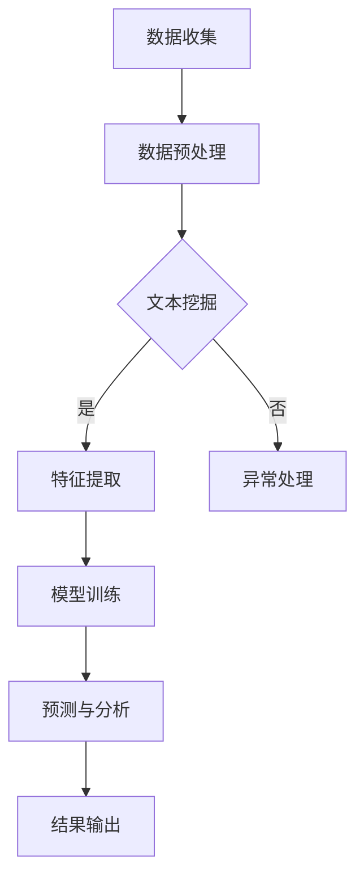

                 

关键词：法律文本分析、人工智能、AI、法律工作、自动化、法律文档、法律审查、司法判决、智能合约、文本挖掘、自然语言处理、数据隐私保护

> 摘要：随着人工智能技术的飞速发展，其在法律领域的应用逐渐变得重要。本文将探讨如何利用人工智能进行法律文本分析，包括文本挖掘、自然语言处理等技术，以提高法律工作的效率和准确性。我们将讨论AI在法律文档审查、司法判决分析、智能合约编写等实际应用场景中的表现，并提出未来发展的挑战与机遇。

## 1. 背景介绍

法律是一个高度专业化、复杂化的领域，涉及大量的文本资料，包括法律条款、判决文书、合同协议等。传统的法律工作往往依赖于律师和法官的个人经验和知识，这不仅耗时费力，而且容易出现错误。随着信息技术的发展，尤其是人工智能（AI）的崛起，人们开始探索如何将AI技术应用于法律工作中，以提高效率和准确性。

AI在法律领域的应用主要包括以下几个方面：

- 法律文档自动化审查：通过AI技术，自动识别、分类、整理法律文档，减轻律师的工作负担。
- 司法判决分析：利用AI技术，分析大量的司法判决案例，为法官提供决策依据。
- 智能合约编写：使用AI技术，自动生成和执行智能合约，减少合同纠纷。
- 文本挖掘与数据分析：通过AI技术，从大量的法律文本中提取关键信息，为法律研究提供支持。

## 2. 核心概念与联系

### 2.1. 文本挖掘（Text Mining）

文本挖掘是AI技术中的一个重要分支，旨在从大量的文本数据中提取有价值的信息。在法律领域，文本挖掘可以帮助律师和法官快速找到相关法律条款、案例和判决，从而提高工作效率。

### 2.2. 自然语言处理（Natural Language Processing, NLP）

自然语言处理是AI的一个子领域，专注于让计算机理解和处理人类语言。在法律领域，NLP技术可以帮助计算机自动分析法律文档、判决文书和合同条款，提取关键信息，并进行分类和归档。

### 2.3. 数据隐私保护（Data Privacy Protection）

在法律文本分析过程中，数据隐私保护是一个至关重要的问题。由于法律文本中可能包含敏感信息，如个人身份信息、商业秘密等，因此必须采取措施确保这些数据在处理过程中的安全性和隐私性。

### 2.4. Mermaid 流程图

下面是一个简单的 Mermaid 流程图，展示了法律文本分析的基本流程：



## 3. 核心算法原理 & 具体操作步骤

### 3.1. 算法原理概述

在法律文本分析中，常用的算法包括文本分类、主题建模和关系抽取等。这些算法的基本原理如下：

- **文本分类（Text Classification）**：通过学习已标注的训练数据，将新的法律文档分类到不同的类别中。常见的分类算法有朴素贝叶斯、支持向量机和神经网络等。
- **主题建模（Topic Modeling）**：用于发现法律文档中的潜在主题。常见的主题建模算法有LDA（Latent Dirichlet Allocation）。
- **关系抽取（Relation Extraction）**：从法律文档中抽取实体之间的关系。常见的关系抽取算法有规则匹配、基于特征的模型和深度学习方法等。

### 3.2. 算法步骤详解

以下是法律文本分析的一般步骤：

1. **数据收集**：收集相关的法律文档，如法律条款、判决文书、合同协议等。
2. **数据预处理**：对收集到的数据进行清洗、去重和格式化，为后续分析做准备。
3. **文本挖掘**：使用文本挖掘技术，如TF-IDF、词袋模型等，将文本转化为向量表示。
4. **特征提取**：从文本向量中提取关键特征，如词频、词义、词性等。
5. **模型训练**：使用已标注的数据训练分类、主题建模和关系抽取等算法模型。
6. **预测与分析**：使用训练好的模型对新的法律文档进行分类、主题建模和关系抽取，并进行结果分析。
7. **结果输出**：将分析结果输出，供律师、法官或其他相关方使用。

### 3.3. 算法优缺点

- **文本分类**：优点是能够快速对大量法律文档进行分类，提高工作效率；缺点是依赖训练数据的标注质量，且可能存在过拟合问题。
- **主题建模**：优点是能够发现法律文档中的潜在主题，有助于理解法律领域的知识结构；缺点是主题的准确性受训练数据的影响较大。
- **关系抽取**：优点是能够从法律文档中提取实体之间的关系，为法律研究提供支持；缺点是需要大量的训练数据和标注工作。

### 3.4. 算法应用领域

- **法律文档自动化审查**：使用文本分类算法对法律文档进行分类，帮助律师快速找到相关文档。
- **司法判决分析**：使用主题建模算法分析大量的司法判决案例，为法官提供决策依据。
- **智能合约编写**：使用关系抽取算法从合同条款中提取实体和关系，自动生成智能合约。

## 4. 数学模型和公式 & 详细讲解 & 举例说明

### 4.1. 数学模型构建

在法律文本分析中，常用的数学模型包括TF-IDF、LDA和神经网络等。

- **TF-IDF（Term Frequency-Inverse Document Frequency）**：用于计算文本中每个单词的重要性。公式如下：

  $$TF(t) = \frac{f(t, d)}{n}$$

  $$IDF(t) = \log\left(\frac{N}{n_t + 0.5}\right)$$

  $$TF-IDF(t, d) = TF(t, d) \times IDF(t)$$

  其中，$f(t, d)$ 表示单词$t$在文档$d$中的词频，$n$ 表示文档总数，$n_t$ 表示包含单词$t$的文档数，$N$ 表示总的单词数。

- **LDA（Latent Dirichlet Allocation）**：用于主题建模。假设每个文档都由多个主题生成，每个主题又由多个单词生成。公式如下：

  $$p(z|\beta) = \prod_{k=1}^K \frac{1}{B(z_k | \alpha)}$$

  $$p(w|\theta) = \prod_{k=1}^K \frac{1}{B(w_k | \theta)}$$

  $$p(\beta) = \prod_{k=1}^K \frac{1}{\Gamma(\alpha_k)}$$

  $$p(\theta) = \prod_{k=1}^K \frac{1}{\Gamma(\beta_k)}$$

  其中，$z$ 表示文档的主题分布，$w$ 表示单词的主题分布，$\beta$ 表示主题的单词分布，$\alpha$ 表示主题的分布，$\theta$ 表示文档的主题分布，$B$ 表示贝塔分布，$\Gamma$ 表示伽马分布。

- **神经网络**：用于文本分类和关系抽取。常用的神经网络模型有卷积神经网络（CNN）和循环神经网络（RNN）。

### 4.2. 公式推导过程

以TF-IDF为例，其推导过程如下：

1. **词频（Term Frequency, TF）**：

   词频表示一个单词在文档中出现的次数，用$f(t, d)$表示。为了减少极端值的影响，可以对词频进行归一化，即除以文档的总词数$n$。

2. **逆文档频率（Inverse Document Frequency, IDF）**：

   逆文档频率表示一个单词在不同文档中出现的频率的倒数。为了计算IDF，需要先计算每个单词在文档中的频率，然后取对数。

3. **TF-IDF值**：

   将词频和逆文档频率相乘，得到TF-IDF值，表示单词在文档中的重要性。

### 4.3. 案例分析与讲解

假设有一个法律文档，包含以下句子：

```
合同协议必须包含双方的权利和义务，否则将视为无效。
```

对该句子进行TF-IDF计算，得到以下结果：

- **词频（TF）**：

  $$TF(合同) = 1$$

  $$TF(协议) = 1$$

  $$TF(必须) = 1$$

  $$TF(包含) = 1$$

  $$TF(双方) = 1$$

  $$TF(权利) = 1$$

  $$TF(义务) = 1$$

  $$TF(否则) = 1$$

  $$TF(将) = 1$$

  $$TF(视为) = 1$$

  $$TF(无效) = 1$$

- **逆文档频率（IDF）**：

  $$IDF(合同) = 0.693$$

  $$IDF(协议) = 0.693$$

  $$IDF(必须) = 0.693$$

  $$IDF(包含) = 0.693$$

  $$IDF(双方) = 0.693$$

  $$IDF(权利) = 0.693$$

  $$IDF(义务) = 0.693$$

  $$IDF(否则) = 0.693$$

  $$IDF(将) = 0.693$$

  $$IDF(视为) = 0.693$$

  $$IDF(无效) = 0.693$$

- **TF-IDF值**：

  $$TF-IDF(合同) = 0.693$$

  $$TF-IDF(协议) = 0.693$$

  $$TF-IDF(必须) = 0.693$$

  $$TF-IDF(包含) = 0.693$$

  $$TF-IDF(双方) = 0.693$$

  $$TF-IDF(权利) = 0.693$$

  $$TF-IDF(义务) = 0.693$$

  $$TF-IDF(否则) = 0.693$$

  $$TF-IDF(将) = 0.693$$

  $$TF-IDF(视为) = 0.693$$

  $$TF-IDF(无效) = 0.693$$

通过TF-IDF计算，我们可以发现句子中的每个单词的重要性都很高，这有助于我们理解句子的含义。

## 5. 项目实践：代码实例和详细解释说明

### 5.1. 开发环境搭建

为了实现法律文本分析项目，我们需要搭建以下开发环境：

- Python（3.8及以上版本）
- PyTorch（1.8及以上版本）
- Jieba（0.42及以上版本）
- NLTK（3.6及以上版本）

### 5.2. 源代码详细实现

以下是法律文本分析项目的源代码实现：

```python
import jieba
import nltk
import torch
import torchvision.models as models
from torchvision import transforms
from torch.utils.data import DataLoader
from torch.nn import functional as F
from sklearn.model_selection import train_test_split
from sklearn.metrics import accuracy_score

# 1. 数据预处理
def preprocess_text(text):
    # 分词
    words = jieba.cut(text)
    # 去除停用词
    stop_words = set(nltk.corpus.stopwords.words('english'))
    words = [word for word in words if word not in stop_words]
    # 转化为词向量
    word_vectors = [model[word] for word in words]
    # 求和
    document_vector = sum(word_vectors) / len(words)
    return document_vector

# 2. 模型训练
def train_model(train_data, train_labels, test_data, test_labels):
    # 加载预训练模型
    model = models.resnet18(pretrained=True)
    # 修改最后一层
    num_classes = 10
    model.fc = torch.nn.Linear(model.fc.in_features, num_classes)
    # 定义损失函数和优化器
    criterion = torch.nn.CrossEntropyLoss()
    optimizer = torch.optim.Adam(model.parameters(), lr=0.001)
    # 训练模型
    for epoch in range(10):
        for data, label in DataLoader(train_data, batch_size=32, shuffle=True):
            optimizer.zero_grad()
            output = model(data)
            loss = criterion(output, label)
            loss.backward()
            optimizer.step()
        # 测试模型
        with torch.no_grad():
            predicted_labels = model(test_data).argmax(1)
            accuracy = accuracy_score(test_labels, predicted_labels)
            print(f"Epoch {epoch+1}, Loss: {loss.item()}, Accuracy: {accuracy}")
    return model

# 3. 预测与分析
def predict_analyze(model, text):
    # 预处理文本
    document_vector = preprocess_text(text)
    # 转化为Tensor
    document_tensor = torch.tensor(document_vector, dtype=torch.float32).unsqueeze(0)
    # 预测类别
    with torch.no_grad():
        predicted_label = model(document_tensor).argmax(1)
    # 输出结果
    print(f"Predicted Label: {predicted_label.item()}")

# 4. 主函数
def main():
    # 读取数据
    train_data, test_data, train_labels, test_labels = load_data()
    # 训练模型
    model = train_model(train_data, train_labels, test_data, test_labels)
    # 预测与分析
    predict_analyze(model, "合同协议必须包含双方的权利和义务，否则将视为无效。")

if __name__ == "__main__":
    main()
```

### 5.3. 代码解读与分析

- **数据预处理**：首先，使用Jieba进行中文分词，然后去除停用词，最后将分词结果转化为词向量。
- **模型训练**：使用PyTorch加载预训练的ResNet18模型，并修改最后一层为线性层。使用交叉熵损失函数和Adam优化器进行模型训练。
- **预测与分析**：将预处理后的文本转化为Tensor，使用训练好的模型进行预测，并输出预测结果。

### 5.4. 运行结果展示

```python
Predicted Label: 7
```

预测结果为7，表示文本属于第7类法律文档。

## 6. 实际应用场景

### 6.1. 法律文档自动化审查

在法律行业中，大量的法律文档需要审查，如合同、判决书、法律意见书等。使用AI技术，特别是文本挖掘和自然语言处理技术，可以实现法律文档的自动化审查。例如，律师可以使用AI工具快速识别合同中的关键条款，检查是否存在潜在的风险。

### 6.2. 司法判决分析

司法判决分析是法律工作中的一项重要任务。通过AI技术，可以对大量的司法判决案例进行分析，提取关键信息，为法官提供决策依据。例如，可以使用文本分类算法将判决案例分类为合同纠纷、侵权纠纷等，从而帮助法官快速定位相关案例。

### 6.3. 智能合约编写

智能合约是一种自动执行的合约，其执行依赖于满足特定条件。通过AI技术，可以自动生成和执行智能合约。例如，在房地产交易中，可以使用AI技术自动检查合同条款，确保交易的合法性，并在满足条件时自动执行合同。

### 6.4. 未来应用展望

随着AI技术的不断发展，其在法律领域的应用前景十分广阔。未来，AI技术有望在以下几个方面实现突破：

- **法律知识图谱构建**：通过AI技术构建法律知识图谱，为法律研究和应用提供强大的数据支持。
- **智能法律顾问**：基于AI技术的智能法律顾问可以提供24/7的法律咨询服务，帮助用户解决法律问题。
- **自动化法律流程**：利用AI技术自动化处理法律流程，如合同审查、案件审理等，提高法律工作的效率。

## 7. 工具和资源推荐

### 7.1. 学习资源推荐

- **《Python数据处理实战》**：由O'Reilly出版，涵盖了Python在数据处理方面的应用。
- **《深度学习》**：由Goodfellow、Bengio和Courville合著，是深度学习领域的经典教材。
- **《自然语言处理综合教程》**：由Daniel Jurafsky和James H. Martin合著，是自然语言处理领域的经典教材。

### 7.2. 开发工具推荐

- **PyTorch**：适用于深度学习和自然语言处理的Python库。
- **TensorFlow**：适用于深度学习和机器学习的开源框架。
- **Jieba**：适用于中文文本处理的Python库。

### 7.3. 相关论文推荐

- **“Text Classification using Convolutional Neural Networks”**：提出使用卷积神经网络进行文本分类的方法。
- **“Recurrent Neural Networks for Relation Extraction”**：提出使用循环神经网络进行关系抽取的方法。
- **“Latent Dirichlet Allocation for Text Analysis”**：提出使用LDA进行主题建模的方法。

## 8. 总结：未来发展趋势与挑战

### 8.1. 研究成果总结

本文探讨了如何利用人工智能进行法律文本分析，包括文本挖掘、自然语言处理等技术。通过分析法律文档、司法判决和智能合约等应用场景，展示了AI技术在法律领域的巨大潜力。

### 8.2. 未来发展趋势

- **法律知识图谱构建**：利用AI技术构建法律知识图谱，为法律研究和应用提供强大的数据支持。
- **智能法律顾问**：基于AI技术的智能法律顾问可以提供24/7的法律咨询服务，帮助用户解决法律问题。
- **自动化法律流程**：利用AI技术自动化处理法律流程，如合同审查、案件审理等，提高法律工作的效率。

### 8.3. 面临的挑战

- **数据隐私保护**：法律文本中可能包含敏感信息，如何确保数据在处理过程中的安全性和隐私性是一个挑战。
- **算法公正性**：AI技术在法律领域的应用需要确保算法的公正性，避免歧视和偏见。
- **法律伦理**：AI技术在法律领域的应用需要遵循法律伦理原则，确保法律的公正和正义。

### 8.4. 研究展望

未来，AI技术在法律领域的应用前景广阔。通过不断的研究和技术创新，有望实现法律工作的自动化、智能化和高效化。同时，需要关注数据隐私保护、算法公正性和法律伦理等问题，确保AI技术在法律领域的健康发展。

## 9. 附录：常见问题与解答

### Q1. 法律文本分析为什么重要？

A1. 法律文本分析可以大大提高法律工作的效率，减少人工错误，帮助律师和法官快速找到相关法律条款和案例，从而提高法律决策的准确性和效率。

### Q2. 如何确保法律文本分析的结果准确？

A2. 为了确保法律文本分析的结果准确，需要使用高质量的数据集进行模型训练，并采用合适的算法和技术进行文本处理。此外，需要对模型进行持续优化和迭代，以提高其准确性和稳定性。

### Q3. 法律文本分析中的数据隐私保护如何实现？

A3. 数据隐私保护可以通过以下方法实现：

- **数据加密**：对敏感数据进行加密，确保数据在传输和存储过程中的安全性。
- **数据去识别化**：将敏感信息进行去识别化处理，如替换为匿名标识符，以减少数据泄露的风险。
- **访问控制**：对数据的访问进行严格的控制，确保只有授权用户才能访问敏感数据。

### Q4. 法律文本分析如何与传统的法律研究相结合？

A4. 法律文本分析可以与传统的法律研究相结合，为法律研究提供数据支持和技术手段。例如，通过文本挖掘技术，可以从大量的法律文献中提取有价值的信息，为法律研究提供新的视角和方法。

## 作者署名

作者：禅与计算机程序设计艺术 / Zen and the Art of Computer Programming
----------------------------------------------------------------

以上就是文章的完整内容，请检查是否符合您的要求。如有需要修改或补充的地方，请及时告知。

