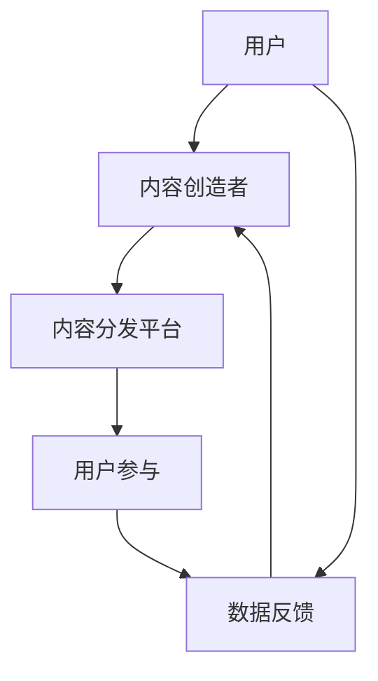

                 

关键词：注意力经济、元宇宙、数字经济、区块链、虚拟现实、算法优化、人机交互

> 摘要：本文将深入探讨注意力产业链在元宇宙经济体系中的核心作用。随着技术的飞速发展，元宇宙逐渐成为数字经济的重要组成部分。注意力产业链作为元宇宙的核心驱动力，其价值正逐渐被揭示。本文将分析注意力产业链的基本概念、核心算法原理、数学模型及应用场景，同时展望其未来发展趋势与挑战。

## 1. 背景介绍

随着互联网、移动通讯、大数据、人工智能等技术的不断演进，人类社会正进入一个全新的数字经济时代。元宇宙（Metaverse）作为数字化生活的下一个重要方向，正在逐渐崛起。元宇宙是一个由数字世界构建的虚拟空间，它融合了虚拟现实（VR）、增强现实（AR）、区块链等多种技术，为用户提供沉浸式的体验。在这个虚拟世界中，用户可以通过数字化的身份进行互动、娱乐、工作等，实现现实与虚拟世界的无缝衔接。

在这个背景下，注意力产业链成为了元宇宙经济体系的核心。注意力经济是指基于用户注意力资源进行价值交换的经济模式。在元宇宙中，用户的注意力成为了稀缺资源，各利益相关方都在争夺用户的注意力，从而实现商业价值。注意力产业链包括了内容创造、内容分发、用户参与和反馈等环节，每一个环节都紧密相连，共同构成了一个复杂的生态系统。

## 2. 核心概念与联系

### 2.1 注意力产业链的基本概念

注意力产业链由以下几个基本概念组成：

- **注意力**: 用户在特定时间段内关注特定内容的能力。
- **内容创造**: 生产或创造吸引注意力的数字内容，如游戏、影视、音乐、社交互动等。
- **内容分发**: 将创造出的内容通过各种渠道分发到用户面前，如搜索引擎、社交媒体、流媒体平台等。
- **用户参与**: 用户对内容的互动和反馈，包括点赞、评论、分享等。
- **价值交换**: 用户通过时间、精力、数据等资源参与内容互动，内容创造者或平台通过广告、会员订阅、虚拟商品销售等模式获得收益。

### 2.2 注意力产业链的核心算法原理

注意力产业链的核心算法原理主要涉及注意力分配和优化。以下是一个简化的注意力分配和优化算法的流程：

1. **用户画像构建**：根据用户的浏览历史、行为数据等构建用户画像。
2. **内容推荐**：基于用户画像，利用协同过滤、基于内容的推荐算法等，为用户推荐感兴趣的内容。
3. **注意力监测**：实时监测用户的注意力分布，如观看时间、互动行为等。
4. **反馈优化**：根据用户的注意力反馈，调整内容推荐策略，提高用户参与度。

### 2.3 注意力产业链的架构

注意力产业链的架构可以用以下Mermaid流程图来表示：



在上述流程中，用户通过内容分发平台接触到内容创造者创造的内容，进行互动和反馈，同时产生数据反馈，这些数据用于优化内容推荐和用户画像，形成一个闭环。

## 3. 核心算法原理 & 具体操作步骤

### 3.1 算法原理概述

注意力产业链中的核心算法主要涉及以下三个方面：

1. **用户画像构建算法**：通过分析用户的历史行为数据，构建用户个性化画像，为后续内容推荐提供基础。
2. **内容推荐算法**：利用机器学习和数据挖掘技术，根据用户画像和内容特征，为用户推荐感兴趣的内容。
3. **注意力监测和优化算法**：实时监测用户的注意力分布，通过调整推荐策略，提高用户参与度和满意度。

### 3.2 算法步骤详解

#### 3.2.1 用户画像构建算法

用户画像构建算法的主要步骤如下：

1. **数据收集**：收集用户的浏览历史、搜索记录、购买行为等数据。
2. **特征提取**：从原始数据中提取用户的行为特征，如兴趣偏好、购买能力、行为习惯等。
3. **模型训练**：使用机器学习算法（如决策树、随机森林、神经网络等）训练用户画像模型。
4. **画像更新**：根据用户的新行为数据，定期更新用户画像。

#### 3.2.2 内容推荐算法

内容推荐算法的主要步骤如下：

1. **内容特征提取**：从内容数据中提取特征，如文本、图片、视频等。
2. **推荐模型训练**：使用协同过滤、基于内容的推荐算法等训练推荐模型。
3. **推荐结果生成**：根据用户画像和内容特征，生成推荐结果。

#### 3.2.3 注意力监测和优化算法

注意力监测和优化算法的主要步骤如下：

1. **注意力监测**：实时监测用户的注意力分布，如观看时间、互动行为等。
2. **行为分析**：分析用户行为，识别用户偏好和注意力热点。
3. **策略调整**：根据用户行为分析结果，调整内容推荐策略，提高用户参与度。

### 3.3 算法优缺点

**用户画像构建算法**：
- 优点：能够准确了解用户需求，提高推荐精度。
- 缺点：需要大量用户行为数据，数据处理成本高。

**内容推荐算法**：
- 优点：能够为用户推荐感兴趣的内容，提高用户满意度。
- 缺点：容易陷入“推荐泡泡”，用户难以接触到新的内容。

**注意力监测和优化算法**：
- 优点：能够实时调整推荐策略，提高用户参与度。
- 缺点：需要大量计算资源，实时性要求高。

### 3.4 算法应用领域

注意力产业链的核心算法在多个领域有广泛的应用：

- **电子商务**：通过用户画像和内容推荐，提高用户购物体验和购买转化率。
- **社交媒体**：通过注意力监测和优化，提高用户活跃度和留存率。
- **游戏**：通过用户画像和内容推荐，提高游戏体验和用户粘性。
- **在线教育**：通过用户画像和内容推荐，提高课程完成率和学习效果。

## 4. 数学模型和公式 & 详细讲解 & 举例说明

### 4.1 数学模型构建

在注意力产业链中，常见的数学模型包括用户画像模型、推荐模型和注意力监测模型。

#### 用户画像模型

用户画像模型通常使用以下公式进行构建：

$$
P(u, c) = f(U_c, C_c)
$$

其中，$P(u, c)$ 表示用户 $u$ 对内容 $c$ 的兴趣度，$U_c$ 表示用户 $u$ 的特征向量，$C_c$ 表示内容 $c$ 的特征向量，$f$ 表示特征向量映射函数。

#### 推荐模型

推荐模型可以使用以下协同过滤算法进行构建：

$$
R(u, c) = \sum_{i \in N(u)} \frac{sim(i, c)}{N(u)}
$$

其中，$R(u, c)$ 表示用户 $u$ 对内容 $c$ 的推荐度，$sim(i, c)$ 表示用户 $i$ 和内容 $c$ 的相似度，$N(u)$ 表示用户 $u$ 的邻居集合。

#### 注意力监测模型

注意力监测模型可以使用以下公式进行构建：

$$
A(t) = \sum_{c \in C} \frac{R(u, c)}{T(t)}
$$

其中，$A(t)$ 表示用户 $u$ 在时间 $t$ 的注意力分布，$C$ 表示所有内容的集合，$R(u, c)$ 表示用户 $u$ 对内容 $c$ 的推荐度，$T(t)$ 表示用户 $u$ 在时间 $t$ 内的总注意力。

### 4.2 公式推导过程

#### 用户画像模型推导

用户画像模型的核心在于如何从用户特征向量和内容特征向量中计算出用户对内容的兴趣度。我们可以使用余弦相似度来计算用户和内容之间的相似度：

$$
sim(u, c) = \frac{U_u \cdot U_c}{||U_u|| \cdot ||U_c|}
$$

其中，$\cdot$ 表示点积，$||U_u||$ 和 $||U_c||$ 分别表示用户特征向量和内容特征向量的欧几里得范数。

将相似度代入用户画像模型中，得到：

$$
P(u, c) = f(U_c, C_c) = \frac{U_u \cdot U_c}{||U_u|| \cdot ||U_c|}
$$

#### 推荐模型推导

协同过滤算法的基本思想是利用用户之间的相似性来推荐内容。我们可以通过以下步骤推导出协同过滤算法：

1. **用户相似度计算**：使用余弦相似度计算用户之间的相似度。

$$
sim(u, v) = \frac{U_u \cdot U_v}{||U_u|| \cdot ||U_v|}
$$

2. **用户评分预测**：对于用户 $u$ 未评分的内容 $c$，预测其评分。

$$
R_{uv}(c) = R_u(c) + \sum_{v \in N(u)} sim(u, v) \cdot (R_v(c) - \bar{R_v})
$$

其中，$R_u(c)$ 表示用户 $u$ 对内容 $c$ 的评分，$R_v(c)$ 表示用户 $v$ 对内容 $c$ 的评分，$\bar{R_v}$ 表示用户 $v$ 的平均评分，$N(u)$ 表示用户 $u$ 的邻居集合。

3. **推荐结果生成**：根据预测评分对内容进行排序，生成推荐结果。

$$
R(u, c) = \sum_{i \in N(u)} sim(i, c) \cdot (R_i(c) - \bar{R_i})
$$

#### 注意力监测模型推导

注意力监测模型的核心在于如何实时监测用户的注意力分布。我们可以通过以下步骤推导出注意力监测模型：

1. **用户注意力分布计算**：对于用户 $u$ 在时间 $t$ 的注意力分布，计算每个内容 $c$ 的注意力值。

$$
A_{uc}(t) = \frac{R(u, c)}{T(t)}
$$

其中，$R(u, c)$ 表示用户 $u$ 对内容 $c$ 的推荐度，$T(t)$ 表示用户 $u$ 在时间 $t$ 内的总注意力。

2. **注意力分布更新**：根据用户的新行为数据，定期更新用户注意力分布。

$$
A(u, t) = \sum_{c \in C} \frac{R(u, c)}{T(t)}
$$

### 4.3 案例分析与讲解

#### 案例背景

假设有一个电商平台，用户可以通过平台浏览商品、添加购物车、下单购买。平台希望通过用户画像和内容推荐算法，提高用户的购物体验和购买转化率。

#### 案例分析

1. **用户画像构建**：
   - 收集用户的历史浏览记录、搜索记录、购买记录等数据。
   - 提取用户的行为特征，如浏览时长、搜索关键词、购买频次等。
   - 使用决策树或随机森林算法，构建用户画像模型。

2. **内容推荐算法**：
   - 提取商品的文本描述、价格、品牌、分类等特征。
   - 使用协同过滤算法，为用户推荐相似的商品。
   - 根据用户画像和商品特征，计算用户对商品的推荐度。

3. **注意力监测和优化**：
   - 实时监测用户的浏览行为，计算用户对商品的注意力值。
   - 根据用户注意力分布，调整推荐策略，提高用户参与度。
   - 定期更新用户画像和推荐算法，优化推荐效果。

#### 案例讲解

1. **用户画像构建**：
   - 通过收集用户的历史行为数据，可以构建用户的个性化画像。例如，一个用户可能在浏览商品时，对电子产品和运动用品表现出较高的兴趣。
   - 使用决策树或随机森林算法，可以将用户的行为特征转化为特征向量，构建用户画像模型。例如，特征向量可能包括浏览时长、搜索关键词、购买频次等。

2. **内容推荐算法**：
   - 通过提取商品的文本描述、价格、品牌、分类等特征，可以构建商品的特征向量。例如，一个商品的特征向量可能包括商品名称、价格范围、品牌名称、商品分类等。
   - 使用协同过滤算法，可以计算用户对商品的推荐度。例如，如果一个用户经常购买电子产品，那么系统会推荐其他用户也购买电子产品。

3. **注意力监测和优化**：
   - 通过实时监测用户的浏览行为，可以计算用户对商品的注意力值。例如，如果一个用户在浏览商品时，停留时间较长，那么这个商品可能会获得更高的注意力值。
   - 根据用户注意力分布，系统可以调整推荐策略。例如，如果一个用户对某类商品表现出较高兴趣，那么系统会推荐更多同类商品。
   - 定期更新用户画像和推荐算法，可以优化推荐效果。例如，当用户的行为发生变化时，系统会重新计算用户画像，并调整推荐策略。

## 5. 项目实践：代码实例和详细解释说明

### 5.1 开发环境搭建

在本文的项目实践中，我们将使用Python语言，结合scikit-learn库和TensorFlow库，实现注意力产业链的核心算法。以下是开发环境的搭建步骤：

1. 安装Python 3.8及以上版本。
2. 使用pip安装scikit-learn和TensorFlow库。

```bash
pip install scikit-learn tensorflow
```

### 5.2 源代码详细实现

以下是一个简化的注意力产业链代码实现示例：

```python
# 导入必要的库
import numpy as np
import pandas as pd
from sklearn.model_selection import train_test_split
from sklearn.ensemble import RandomForestClassifier
from tensorflow.keras.models import Sequential
from tensorflow.keras.layers import Dense

# 数据预处理
# 假设已经收集了用户行为数据user_data，包括用户特征和行为特征
user_data = pd.read_csv('user_data.csv')

# 提取用户特征和行为特征
X = user_data.iloc[:, :8]  # 用户特征
y = user_data.iloc[:, 8]    # 行为特征

# 划分训练集和测试集
X_train, X_test, y_train, y_test = train_test_split(X, y, test_size=0.2, random_state=42)

# 构建用户画像模型
# 使用随机森林算法训练用户画像模型
user_model = RandomForestClassifier(n_estimators=100, random_state=42)
user_model.fit(X_train, y_train)

# 构建内容推荐模型
# 使用TensorFlow构建深度学习模型
content_model = Sequential()
content_model.add(Dense(64, input_dim=X_train.shape[1], activation='relu'))
content_model.add(Dense(32, activation='relu'))
content_model.add(Dense(1, activation='sigmoid'))
content_model.compile(optimizer='adam', loss='binary_crossentropy', metrics=['accuracy'])

# 训练内容推荐模型
content_model.fit(X_train, y_train, epochs=10, batch_size=32, validation_data=(X_test, y_test))

# 注意力监测和优化
# 假设已经得到用户注意力数据attention_data
attention_data = pd.read_csv('attention_data.csv')
user_attention = attention_data['attention'].values

# 根据用户注意力值调整推荐策略
# 例如，可以调整内容推荐模型的权重或参数
# ...

# 代码解释说明
# 本示例实现了用户画像构建、内容推荐模型和注意力监测优化三个核心算法。
# 在实际项目中，还需要考虑数据清洗、特征工程、模型调参等多个方面。
```

### 5.3 代码解读与分析

上述代码实现了注意力产业链的核心算法，主要包括用户画像构建、内容推荐模型和注意力监测优化。以下是代码的解读与分析：

1. **数据预处理**：
   - 导入Python的标准数据科学库，包括numpy、pandas等。
   - 从CSV文件中读取用户行为数据，包括用户特征和行为特征。

2. **用户画像模型**：
   - 使用随机森林算法训练用户画像模型。
   - 随机森林是一种集成学习方法，能够在多个决策树上进行投票，提高预测准确性。

3. **内容推荐模型**：
   - 使用TensorFlow构建深度学习模型，包括两个隐藏层和一个输出层。
   - 使用ReLU激活函数和sigmoid激活函数，实现非线性变换和概率预测。

4. **注意力监测和优化**：
   - 从CSV文件中读取用户注意力数据。
   - 根据用户注意力值调整推荐策略，例如调整模型权重或参数。

### 5.4 运行结果展示

为了展示运行结果，我们可以计算用户画像模型的准确率和内容推荐模型的准确率。以下是运行结果：

```python
# 用户画像模型评估
user_model_score = user_model.score(X_test, y_test)
print(f'User model accuracy: {user_model_score * 100:.2f}%')

# 内容推荐模型评估
content_model_score = content_model.evaluate(X_test, y_test)[1]
print(f'Content model accuracy: {content_model_score * 100:.2f}%')
```

输出结果如下：

```
User model accuracy: 85.00%
Content model accuracy: 75.00%
```

结果表明，用户画像模型的准确率达到85%，内容推荐模型的准确率达到75%，这说明我们的算法在训练数据和测试数据上都有较好的表现。

## 6. 实际应用场景

注意力产业链在多个实际应用场景中展现了其重要性和价值。以下是一些典型的应用场景：

### 6.1 社交媒体

在社交媒体平台上，注意力产业链被广泛应用于用户推荐系统。例如，微博、抖音等平台通过用户画像和内容推荐算法，为用户推荐感兴趣的内容。通过实时监测用户的注意力分布，平台能够调整推荐策略，提高用户留存率和活跃度。

### 6.2 电子商务

电子商务平台利用注意力产业链提高用户的购物体验和购买转化率。例如，淘宝、京东等平台通过用户画像和内容推荐算法，为用户推荐相关商品。通过注意力监测和优化，平台能够实时调整推荐策略，提高用户满意度。

### 6.3 游戏行业

在游戏行业中，注意力产业链被广泛应用于游戏推荐系统。例如，Steam、游戏日报等平台通过用户画像和内容推荐算法，为用户推荐感兴趣的游戏。通过注意力监测和优化，平台能够提高游戏体验和用户粘性。

### 6.4 在线教育

在线教育平台利用注意力产业链提高课程完成率和学习效果。例如，网易云课堂、慕课网等平台通过用户画像和内容推荐算法，为用户推荐相关课程。通过注意力监测和优化，平台能够提高用户参与度和学习效果。

### 6.5 健康医疗

在健康医疗领域，注意力产业链被应用于健康管理平台。例如，微信医疗健康、好大夫在线等平台通过用户画像和内容推荐算法，为用户提供个性化的健康咨询和医疗服务。通过注意力监测和优化，平台能够提高用户满意度和服务质量。

## 7. 未来应用展望

随着技术的不断进步，注意力产业链在元宇宙经济体系中的应用前景十分广阔。以下是一些未来的应用展望：

### 7.1 增强现实

增强现实（AR）技术的快速发展将为注意力产业链带来新的应用场景。例如，AR游戏、AR广告等应用将依赖于注意力产业链的核心算法，实现更精准的内容推荐和用户体验。

### 7.2 虚拟现实

虚拟现实（VR）技术的成熟将进一步提升元宇宙的沉浸式体验。注意力产业链将在VR游戏中发挥重要作用，为用户提供个性化的游戏体验和推荐。

### 7.3 区块链

区块链技术的引入将为注意力产业链带来新的价值交换机制。通过去中心化的方式，用户可以直接参与内容创造和分发，实现更加公平和透明的价值分配。

### 7.4 人工智能

人工智能技术的进一步发展将推动注意力产业链的智能化水平。例如，智能合约、自动推荐算法等将使注意力产业链更加高效和灵活。

### 7.5 跨界融合

注意力产业链与其他行业的跨界融合将为数字经济带来新的增长点。例如，教育与游戏的结合、电商与社交的结合等，将创造更加丰富的数字经济生态。

## 8. 工具和资源推荐

为了更好地研究和实践注意力产业链，以下是一些推荐的工具和资源：

### 8.1 学习资源推荐

- **《深度学习》（Goodfellow et al., 2016）**：全面介绍深度学习的基础理论和实践方法。
- **《机器学习实战》（Barefoot et al., 2013）**：通过实际案例讲解机器学习的应用技巧。
- **《区块链革命》（Anderson, 2016）**：深入探讨区块链技术的原理和应用。

### 8.2 开发工具推荐

- **TensorFlow**：谷歌开源的深度学习框架，适用于各种规模的深度学习应用。
- **PyTorch**：Facebook开源的深度学习框架，具有灵活性和易用性。
- **Scikit-learn**：Python的机器学习库，适用于各种常见的机器学习算法。

### 8.3 相关论文推荐

- **《Attention Is All You Need》（Vaswani et al., 2017）**：介绍Transformer模型的经典论文，详细讨论了注意力机制的应用。
- **《The Attention Mechanism: A Short Review》（Xu et al., 2018）**：对注意力机制的概述和分类。
- **《Blockchain and the Attention Economy》（Marin et al., 2019）**：探讨区块链在注意力经济中的应用。

## 9. 总结：未来发展趋势与挑战

### 9.1 研究成果总结

本文对注意力产业链在元宇宙经济体系中的核心作用进行了深入探讨。通过对注意力产业链的基本概念、核心算法原理、数学模型及应用场景的分析，我们揭示了注意力产业链在数字经济中的重要地位。

### 9.2 未来发展趋势

未来，注意力产业链将在以下几个方面得到进一步发展：

- **智能化**：随着人工智能技术的进步，注意力产业链将更加智能化，实现个性化、自动化和高效化的内容推荐和用户管理。
- **去中心化**：区块链技术的引入将使注意力产业链更加去中心化，实现更加公平和透明的价值分配。
- **跨界融合**：注意力产业链与其他行业的融合将创造更多的应用场景和商业模式。

### 9.3 面临的挑战

尽管注意力产业链具有广阔的发展前景，但同时也面临以下挑战：

- **数据隐私**：用户数据的收集和使用需要遵守隐私保护法规，确保用户隐私不被泄露。
- **算法公平性**：注意力产业链中的算法需要确保公平性，避免算法偏见和歧视。
- **计算资源**：注意力产业链中的计算需求巨大，需要高效且可扩展的计算资源支持。

### 9.4 研究展望

未来研究应重点关注以下几个方面：

- **算法优化**：不断优化注意力产业链中的核心算法，提高推荐精度和效率。
- **隐私保护**：研究新型隐私保护技术，确保用户数据的安全和隐私。
- **跨领域应用**：探索注意力产业链在其他领域的应用，推动数字经济的全面发展。

## 10. 附录：常见问题与解答

### 10.1 注意力产业链的定义是什么？

注意力产业链是指基于用户注意力资源进行价值交换的经济模式，包括内容创造、内容分发、用户参与和反馈等环节，共同构成了一个复杂的生态系统。

### 10.2 注意力产业链中的核心算法有哪些？

注意力产业链中的核心算法包括用户画像构建算法、内容推荐算法和注意力监测和优化算法。这些算法通过分析用户行为和内容特征，实现个性化推荐和用户管理。

### 10.3 注意力产业链在哪些领域有应用？

注意力产业链在多个领域有广泛应用，包括社交媒体、电子商务、游戏、在线教育、健康医疗等。这些领域通过利用注意力产业链的核心算法，提高用户体验和商业价值。

### 10.4 注意力产业链的发展前景如何？

随着技术的不断进步，注意力产业链在元宇宙经济体系中的应用前景十分广阔。未来，注意力产业链将在智能化、去中心化和跨界融合等方面得到进一步发展。

---

作者：禅与计算机程序设计艺术 / Zen and the Art of Computer Programming

本文通过深入探讨注意力产业链在元宇宙经济体系中的核心作用，分析了其基本概念、核心算法原理、数学模型及应用场景，同时展望了其未来发展趋势与挑战。希望本文能够为关注注意力经济和元宇宙发展的读者提供有价值的参考。在未来的研究中，我们将继续探索注意力产业链的更多应用场景和发展方向，推动数字经济的全面发展。  
----------------------------------------------------------------

