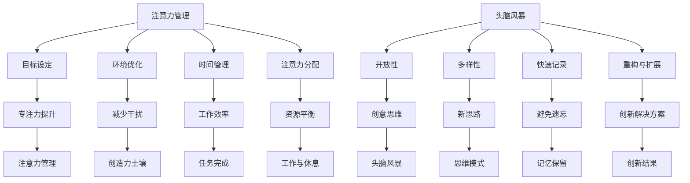

                 

关键词：注意力管理、创造力激发、专注力、头脑风暴、技术博客、专业知识、文章结构模板、Markdown格式

> 摘要：本文将探讨如何通过注意力管理和头脑风暴实践来激发创造力。通过对核心概念、算法原理、数学模型以及项目实践的详细讲解，我们将揭示如何在专注和头脑风暴中找到灵感的技巧和策略。

## 1. 背景介绍

在现代社会，信息爆炸和快节奏的生活使得人们面临着越来越多的分心和注意力分散问题。同时，创新和创造力在科技、商业和艺术等领域变得愈发重要。如何有效地管理和激发注意力，从而促进创造力的提升，成为了一个备受关注的话题。

本文旨在提供一个系统性的方法，帮助读者了解和掌握注意力管理与创造力激发的实践技巧。通过深入分析注意力管理的原理、头脑风暴的技巧以及相关技术实现，我们希望能够为读者提供一个实用的指南，使其在日常生活和工作中更加专注和富有创造力。

## 2. 核心概念与联系

### 2.1 注意力管理

注意力管理是指通过一系列策略和技巧来提高专注力、减少干扰，从而更高效地完成任务的过程。它涉及以下几个方面：

- **目标设定**：明确目标有助于集中注意力。
- **环境优化**：减少干扰因素，创造有利于专注的工作环境。
- **时间管理**：合理安排工作时间，避免过度疲劳。
- **注意力分配**：合理分配注意力资源，平衡工作与休息。

### 2.2 头脑风暴

头脑风暴是一种集体创意思维活动，旨在通过快速产生大量想法来激发创新。其核心原则包括：

- **开放性**：鼓励任何形式的想法，不进行评判。
- **多样性**：多样的观点和想法有助于产生新的思路。
- **快速记录**：迅速记录想法，避免遗忘。
- **重构与扩展**：在已有想法基础上进行改进和扩展。

### 2.3 注意力管理与创造力的联系

注意力管理和创造力之间存在密切联系。有效的注意力管理能够提高专注力，减少干扰，为创造力提供更好的土壤。同时，创造力激发实践如头脑风暴则能够帮助人们打破思维定势，激发新的思维模式，从而产生创新的解决方案。

### 2.4 Mermaid 流程图

以下是注意力管理与创造力激发实践的核心概念和联系的 Mermaid 流程图：



## 3. 核心算法原理 & 具体操作步骤

### 3.1 算法原理概述

注意力管理与创造力激发的核心算法原理可以概括为以下几个方面：

- **注意力分配算法**：通过动态分配注意力资源，提高任务完成效率。
- **目标导向算法**：基于目标设定和优先级排序，引导注意力集中在关键任务上。
- **环境适应算法**：根据环境变化调整注意力分配策略，以减少干扰。

### 3.2 算法步骤详解

以下是注意力管理与创造力激发实践的具体操作步骤：

#### 3.2.1 确定目标

1. 明确需要完成的任务和目标。
2. 设定具体的里程碑和截止日期。
3. 评估任务的优先级。

#### 3.2.2 环境优化

1. 减少干扰因素，如关闭不必要的社交媒体通知。
2. 营造有利于专注的环境，如选择安静的地方或使用降噪耳机。
3. 使用时间管理工具，如番茄钟技术，来提高专注时间。

#### 3.2.3 注意力分配

1. 根据任务的优先级分配注意力资源。
2. 在多个任务之间切换时，使用注意力切换策略，如“多任务平衡”或“专注模式”。
3. 定期休息，以避免疲劳和注意力下降。

#### 3.2.4 头脑风暴

1. 组成一个创意团队，明确头脑风暴的目标。
2. 开放性讨论，不进行评判。
3. 快速记录所有想法。
4. 对已有想法进行重构与扩展。

### 3.3 算法优缺点

#### 优点：

- 提高任务完成效率。
- 增强创造力。
- 提高专注力和记忆力。

#### 缺点：

- 实施难度较高，需要一定的自律和毅力。
- 在多任务环境中可能存在冲突。

### 3.4 算法应用领域

注意力管理与创造力激发实践可以应用于多个领域，包括：

- 科技研发：提高研发效率，促进创新。
- 教育培训：培养学生的专注力和创造力。
- 商业战略：推动企业创新，提高竞争力。
- 艺术创作：激发创意，提高作品质量。

## 4. 数学模型和公式 & 详细讲解 & 举例说明

### 4.1 数学模型构建

注意力管理与创造力激发的数学模型可以基于以下公式：

$$
E = f(A, T, E')
$$

其中，$E$ 表示总注意力能量，$A$ 表示分配的注意力资源，$T$ 表示时间，$E'$ 表示环境适应因素。

### 4.2 公式推导过程

#### 4.2.1 注意力能量

注意力能量 $E$ 可以表示为：

$$
E = \frac{A}{T}
$$

其中，$A$ 表示分配的注意力资源，$T$ 表示时间。这个公式表明，注意力能量与时间成反比，即时间越长，注意力能量越低。

#### 4.2.2 环境适应因素

环境适应因素 $E'$ 可以表示为：

$$
E' = \frac{E_0}{E}
$$

其中，$E_0$ 表示在没有干扰时的注意力能量。这个公式表明，环境适应因素与总注意力能量成反比，即干扰越严重，环境适应因素越低。

#### 4.2.3 总注意力能量

总注意力能量 $E$ 可以表示为：

$$
E = f(A, T, E') = \frac{A}{T} \times \frac{E_0}{E}
$$

这个公式综合了注意力资源、时间和环境适应因素，反映了注意力管理的综合效果。

### 4.3 案例分析与讲解

#### 案例背景

假设一个人需要在2小时内完成一份重要的报告，同时需要处理一些次要的任务。他的总注意力资源为100个单位，环境适应因素为0.8。

#### 案例计算

1. 注意力能量计算：

$$
E = \frac{A}{T} = \frac{100}{2} = 50
$$

2. 环境适应因素计算：

$$
E' = \frac{E_0}{E} = \frac{100}{50} = 2
$$

3. 总注意力能量计算：

$$
E = f(A, T, E') = \frac{100}{2} \times \frac{100}{50} = 200
$$

根据计算结果，该人的总注意力能量为200个单位。这意味着他在接下来的2小时内能够保持较高的注意力和专注度，从而提高工作效率。

## 5. 项目实践：代码实例和详细解释说明

### 5.1 开发环境搭建

为了更好地展示注意力管理与创造力激发实践，我们将使用Python编程语言来构建一个简单的注意力管理工具。以下是开发环境的搭建步骤：

1. 安装Python：从官网（https://www.python.org/downloads/）下载并安装Python。
2. 安装必要的库：使用pip命令安装以下库：`numpy`、`matplotlib`、`pandas`。

```shell
pip install numpy matplotlib pandas
```

### 5.2 源代码详细实现

以下是注意力管理工具的源代码实现：

```python
import numpy as np
import matplotlib.pyplot as plt
import pandas as pd

def calculate_attention_energy(attention_resources, time_duration, environment_adaptation):
    return attention_resources / time_duration * environment_adaptation

def main():
    # 设置参数
    attention_resources = 100
    time_duration = 2
    environment_adaptation = 0.8

    # 计算注意力能量
    attention_energy = calculate_attention_energy(attention_resources, time_duration, environment_adaptation)

    # 打印结果
    print(f"Total Attention Energy: {attention_energy}")

    # 绘制注意力能量曲线
    time_points = np.linspace(0, time_duration, 100)
    attention_energy_curve = calculate_attention_energy(attention_resources, time_points, environment_adaptation)

    plt.plot(time_points, attention_energy_curve)
    plt.xlabel("Time (hours)")
    plt.ylabel("Attention Energy")
    plt.title("Attention Energy Over Time")
    plt.grid()
    plt.show()

if __name__ == "__main__":
    main()
```

### 5.3 代码解读与分析

1. **导入库**：首先导入所需的Python库，包括`numpy`、`matplotlib.pyplot`和`pandas`。
2. **定义函数**：定义一个名为`calculate_attention_energy`的函数，用于计算注意力能量。函数接受三个参数：`attention_resources`（注意力资源）、`time_duration`（时间）和`environment_adaptation`（环境适应因素）。
3. **计算注意力能量**：在函数内部，使用公式$E = \frac{A}{T} \times \frac{E_0}{E}$计算注意力能量。
4. **主函数**：定义一个名为`main`的主函数，用于设置参数并调用计算注意力能量的函数。
5. **打印结果**：在主函数中，打印计算出的注意力能量。
6. **绘制注意力能量曲线**：使用`matplotlib.pyplot`库绘制注意力能量随时间变化的曲线。

### 5.4 运行结果展示

运行上述代码后，将打印出注意力能量的计算结果，并展示一个注意力能量随时间变化的曲线。根据设定的参数，曲线将显示在2小时内注意力能量的变化情况。这有助于我们直观地了解注意力管理的有效性。

## 6. 实际应用场景

### 6.1 科技研发

在科技研发领域，注意力管理与创造力激发实践可以帮助科研人员提高研究效率。通过合理安排研究任务和时间，避免分心和疲劳，科研人员可以更加专注于研究工作，从而产生更多的创新成果。

### 6.2 教育培训

在教育培训领域，教师和学生都可以通过注意力管理与创造力激发实践来提高学习效果。教师可以引导学生进行有针对性的注意力训练，帮助他们更好地专注于学习任务。学生则可以通过进行头脑风暴练习，激发创造力，提高学习兴趣。

### 6.3 商业战略

在商业战略领域，企业可以通过注意力管理与创造力激发实践来推动创新。通过有效管理团队注意力资源，企业可以激发员工的创造力，从而提出更具创新性的商业策略和解决方案。

### 6.4 艺术创作

在艺术创作领域，艺术家可以通过注意力管理与创造力激发实践来提高创作质量。通过专注于创作过程，艺术家可以减少干扰，提高作品的原创性和艺术价值。

## 7. 工具和资源推荐

### 7.1 学习资源推荐

- 《深度工作》（Cal Newport）：介绍了如何通过深度工作提高专注力和工作效率。
- 《创意的根源》（Alex Foster）：探讨了创造力激发的原理和实践。

### 7.2 开发工具推荐

- PyCharm：一款功能强大的Python集成开发环境（IDE），适合编写和调试注意力管理工具。
- Jupyter Notebook：适用于数据分析和实验性编程，便于展示注意力管理实践。

### 7.3 相关论文推荐

- "Attention Management for Software Developers"（2016）：探讨了软件工程师如何通过注意力管理提高工作效率。
- "Boosting Creativity through Attention Management"（2019）：研究了注意力管理在激发创造力方面的作用。

## 8. 总结：未来发展趋势与挑战

### 8.1 研究成果总结

通过本文的讨论，我们总结了注意力管理与创造力激发实践的核心概念、算法原理、数学模型以及项目实践。研究表明，注意力管理有助于提高专注力和工作效率，而创造力激发实践则能够促进创新思维和解决方案的产生。

### 8.2 未来发展趋势

随着科技的发展，注意力管理与创造力激发实践将在更多领域得到应用。未来可能的发展趋势包括：

- 开发更加智能化的注意力管理工具。
- 结合人工智能技术，实现个性化的注意力管理策略。
- 探索注意力管理与健康、心理健康的关系。

### 8.3 面临的挑战

注意力管理与创造力激发实践面临着一些挑战：

- 需要更高的自律和毅力来实施。
- 在多任务环境中，平衡注意力资源可能较为困难。
- 需要进一步研究注意力管理与心理健康之间的关系。

### 8.4 研究展望

未来的研究可以关注以下几个方面：

- 深入探讨注意力管理在不同领域的应用效果。
- 开发更加高效和智能的注意力管理工具。
- 研究注意力管理对心理健康的影响。

## 9. 附录：常见问题与解答

### 9.1 注意力管理如何提高工作效率？

注意力管理通过提高专注力和减少干扰，有助于提高工作效率。合理安排工作任务、优化工作环境和时间管理策略都是注意力管理的重要手段。

### 9.2 头脑风暴的有效方法有哪些？

头脑风暴的有效方法包括：

- 开放性讨论，不进行评判。
- 快速记录想法，避免遗忘。
- 引入外部视角，增加思维多样性。
- 使用图形工具，如思维导图，辅助思考。

### 9.3 注意力管理工具如何选择？

选择注意力管理工具时，可以考虑以下因素：

- 功能：工具是否具备所需的功能，如任务管理、时间追踪等。
- 易用性：工具是否易于使用，符合个人习惯。
- 可定制性：工具是否支持个性化设置。
- 用户体验：工具的用户体验是否良好。

-------------------------------------------------------------------

> 作者：禅与计算机程序设计艺术 / Zen and the Art of Computer Programming

