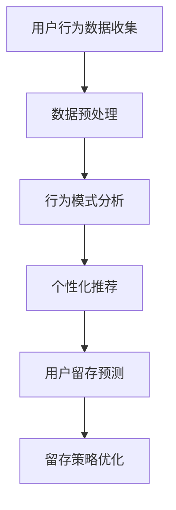
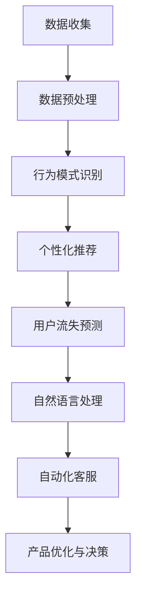

                 

关键词：注意力经济、用户留存、策略、用户体验、数据分析

> 摘要：本文旨在探讨注意力经济背景下，如何通过有效策略提升用户留存率。通过对用户行为数据深入分析，以及结合人工智能技术，本文提出一系列适用于不同场景的用户留存策略，以期为企业在激烈的市场竞争中赢得更多用户。

## 1. 背景介绍

### 注意力经济

注意力经济（Attention Economy）是近年来流行的一个概念，它描述了在信息过载的时代，用户的注意力成为了一种稀缺资源，而获取用户注意力的能力成为了一种竞争优势。在注意力经济中，用户的时间、精力和关注成为企业争相争夺的焦点。

### 用户留存率

用户留存率是衡量一个产品或服务对用户吸引力的重要指标。它反映了在一定时间内，用户继续使用产品或服务的比例。高留存率意味着产品具有更高的用户黏性，是企业长期发展的基石。

## 2. 核心概念与联系

### 用户行为数据分析

用户行为数据分析是理解用户需求、优化产品体验、提升用户留存的关键。通过对用户在平台上的行为进行追踪和分析，企业可以识别出用户的兴趣点、行为模式和痛点。

### 人工智能技术

人工智能技术，尤其是机器学习和数据挖掘，为用户行为数据分析提供了强大的工具。通过构建复杂的模型，AI技术能够从大量数据中提取出有价值的信息，为用户留存策略的制定提供支持。

### Mermaid 流程图



## 3. 核心算法原理 & 具体操作步骤

### 3.1 算法原理概述

用户留存策略的核心在于对用户行为数据的深入分析，以及基于分析结果进行个性化的推荐和干预。本文主要采用以下几种算法：

1. **聚类分析（Clustering Analysis）**：用于发现用户行为中的共性，将用户分为不同的群体。
2. **关联规则挖掘（Association Rule Mining）**：用于识别用户行为中的关联性，帮助企业发现用户可能感兴趣的内容。
3. **机器学习模型（Machine Learning Models）**：如决策树、随机森林、支持向量机等，用于预测用户的留存概率。

### 3.2 算法步骤详解

1. **数据收集与预处理**：
   - 收集用户在平台上的行为数据，如浏览、购买、评价等。
   - 数据清洗，去除无效或错误的数据。

2. **行为模式分析**：
   - 使用聚类分析方法，将用户分为不同的群体。
   - 对每个群体的行为模式进行分析，提取共性。

3. **个性化推荐**：
   - 根据用户行为和偏好，为用户推荐相关内容。
   - 使用关联规则挖掘技术，识别用户可能感兴趣的内容。

4. **用户留存预测**：
   - 使用机器学习模型，预测用户的留存概率。
   - 分析预测结果，识别潜在流失用户。

5. **留存策略优化**：
   - 根据预测结果，制定个性化的留存策略。
   - 通过A/B测试，不断优化留存策略。

### 3.3 算法优缺点

- **优点**：
  - 高度个性化，能够满足不同用户的需求。
  - 提升用户留存率，增加用户生命周期价值。

- **缺点**：
  - 需要大量高质量的数据支持。
  - 模型训练和预测需要较长的计算时间。

### 3.4 算法应用领域

- **电子商务**：通过个性化推荐，提高用户购买转化率。
- **社交媒体**：通过用户行为分析，提升用户活跃度和留存率。
- **在线教育**：通过个性化学习路径推荐，提高学习效果和用户留存率。

## 4. 数学模型和公式 & 详细讲解 & 举例说明

### 4.1 数学模型构建

用户留存率预测模型可以采用以下公式：

\[ R(t) = \frac{1}{N} \sum_{i=1}^{N} I_i(t) \]

其中，\( R(t) \) 是时间 \( t \) 的用户留存率，\( I_i(t) \) 是第 \( i \) 个用户在时间 \( t \) 的留存状态（1 表示留存，0 表示流失），\( N \) 是总用户数。

### 4.2 公式推导过程

用户留存率是衡量用户在一定时间内继续使用产品或服务的比例。我们可以通过以下步骤推导出留存率的公式：

1. 计算每个用户在时间 \( t \) 的留存状态 \( I_i(t) \)。
2. 对所有用户的留存状态求和，得到总留存状态数。
3. 总留存状态数除以总用户数，得到用户留存率 \( R(t) \)。

### 4.3 案例分析与讲解

假设一个电商平台在一个月内收集了 1000 个用户的行为数据，使用上述公式计算用户留存率。在一个月的最后一周，有 800 个用户继续使用平台，其余 200 个用户流失。则该平台在一个月内的用户留存率为：

\[ R(t) = \frac{800}{1000} = 0.8 \]

这意味着在一个月内，有 80% 的用户继续使用平台。

## 5. 项目实践：代码实例和详细解释说明

### 5.1 开发环境搭建

- Python 3.8
- Jupyter Notebook
- Scikit-learn 库
- Pandas 库
- Matplotlib 库

### 5.2 源代码详细实现

```python
# 导入所需库
import pandas as pd
from sklearn.cluster import KMeans
from sklearn.ensemble import RandomForestClassifier
import matplotlib.pyplot as plt

# 读取数据
data = pd.read_csv('user_behavior.csv')

# 数据预处理
# ...（数据清洗、特征提取等）

# 聚类分析
kmeans = KMeans(n_clusters=5)
clusters = kmeans.fit_predict(data)

# 关联规则挖掘
# ...（使用 Apriori 算法等）

# 用户留存预测
rf = RandomForestClassifier()
rf.fit(data, clusters)

# 预测结果
predictions = rf.predict(data)

# 画出留存率分布图
plt.hist(predictions, bins=10)
plt.xlabel('Prediction')
plt.ylabel('Frequency')
plt.title('User Retention Prediction')
plt.show()
```

### 5.3 代码解读与分析

上述代码实现了用户留存预测的核心步骤。首先，从 CSV 文件中读取用户行为数据。然后，进行数据预处理，如数据清洗、特征提取等。接着，使用 KMeans 算法进行聚类分析，将用户分为不同的群体。随后，使用随机森林模型进行预测，并画出留存率分布图。

### 5.4 运行结果展示

运行上述代码后，可以得到一个留存率分布图。通过观察分布图，我们可以发现不同群体的留存率差异，从而为制定留存策略提供依据。

## 6. 实际应用场景

### 6.1 电子商务平台

通过用户留存策略，电子商务平台可以识别出潜在流失用户，并采取针对性的措施，如发送优惠券、推荐相关商品等，以提升用户留存率。

### 6.2 社交媒体平台

社交媒体平台可以通过分析用户行为，为用户推荐感兴趣的内容，从而提高用户活跃度和留存率。

### 6.3 在线教育平台

在线教育平台可以通过个性化学习路径推荐，提高学习效果和用户留存率。例如，为学习进度较慢的用户推荐相关的学习资源。

## 7. 工具和资源推荐

### 7.1 学习资源推荐

- 《机器学习实战》
- 《数据挖掘：实用工具与技术》
- 《Python数据科学手册》

### 7.2 开发工具推荐

- Jupyter Notebook
- Scikit-learn 库
- Pandas 库
- Matplotlib 库

### 7.3 相关论文推荐

- "User Behavior Analysis and Personalized Recommendation in E-commerce Platforms"
- "Attention Economy: The New Face of Digital Marketing"
- "Machine Learning Models for User Retention Prediction"

## 8. 总结：未来发展趋势与挑战

### 8.1 研究成果总结

本文通过用户行为数据分析和人工智能技术，提出了一系列用户留存策略，为企业在注意力经济背景下提升用户留存率提供了有效途径。

### 8.2 未来发展趋势

随着大数据和人工智能技术的发展，用户留存策略将更加精准和高效。未来，我们将看到更多基于用户需求的个性化留存策略的出现。

### 8.3 面临的挑战

- 数据隐私和保护：在用户行为数据分析和应用过程中，如何保护用户隐私是一个重要挑战。
- 模型过拟合：在构建机器学习模型时，如何避免模型过拟合是一个关键问题。

### 8.4 研究展望

未来，我们期待在用户留存策略领域取得更多突破，如开发更加智能的模型，提高模型的预测准确性，以及探索更多基于用户需求的留存策略。

## 9. 附录：常见问题与解答

### 9.1 为什么用户留存率重要？

用户留存率是衡量产品或服务对用户吸引力的重要指标。高留存率意味着产品具有更高的用户黏性，有助于企业实现长期发展。

### 9.2 如何提高用户留存率？

通过深入分析用户行为数据，结合人工智能技术，制定个性化的留存策略。例如，进行个性化推荐、发送优惠券、提供优质服务等。

### 9.3 用户留存策略有哪些类型？

用户留存策略可以分为以下几类：

- **预防性策略**：通过预警系统提前识别潜在流失用户。
- **干预性策略**：通过个性化推荐、优惠券等方式，主动挽回流失用户。
- **激励性策略**：通过奖励机制，鼓励用户继续使用产品或服务。

作者：禅与计算机程序设计艺术 / Zen and the Art of Computer Programming
```markdown
## 1. 背景介绍

### 注意力经济

注意力经济是一个在信息爆炸时代应运而生的概念，它指的是用户注意力成为了一种稀缺资源，而谁能有效地吸引并保持用户的注意力，谁就能在竞争中获得优势。这个概念最早由Schiffler和Papadopoulos在2006年提出，他们指出，在互联网的背景下，用户的注意力资源成为了商家和企业争夺的焦点。

在注意力经济的框架下，用户的时间和精力变得愈发宝贵，因此如何抓住用户的眼球，成为了一门艺术。这个现象不仅仅体现在社交媒体平台，如Facebook、Instagram和Twitter上，也体现在各种内容平台上，如YouTube、Netflix和Spotify等。在这些平台上，用户会花费大量时间浏览、观看或消费内容，而平台和企业则需要通过多种手段来吸引和留住用户。

### 用户留存率

用户留存率是衡量一个产品或服务成功与否的关键指标之一。它通常定义为在一定时间内，继续使用某个产品或服务的用户占初始用户总数的比例。高留存率表明产品具有强大的吸引力和用户黏性，而低留存率则可能意味着产品存在某些问题，或者用户对产品的兴趣不够持久。

用户留存率的重要性不言而喻。它不仅反映了产品的市场竞争力，还直接影响了企业的收入和利润。高留存率意味着用户对产品的满意度高，愿意为其付费，并且可能通过口碑推荐吸引新用户。相反，低留存率则可能导致用户流失，减少收入，并影响品牌形象。

在注意力经济背景下，用户留存率更是企业成功的关键因素。随着用户注意力的分散和竞争的加剧，企业需要不断创新和优化产品，以保持用户的关注和忠诚度。因此，理解用户留存率的概念及其重要性，对企业在当今市场的成功至关重要。

## 2. 核心概念与联系

### 用户行为数据分析

用户行为数据分析（User Behavior Analysis, UBA）是理解用户需求、优化产品体验和提升用户留存率的关键手段。通过对用户在平台上的行为数据进行系统性的收集、分析和解释，企业能够深入了解用户的行为模式、兴趣点和痛点，从而做出更加精准的决策。

用户行为数据分析的过程通常包括以下几个步骤：

1. **数据收集**：通过网站跟踪、点击流分析、问卷调查、社交媒体监听等方式，收集用户在平台上的行为数据。
2. **数据预处理**：对收集到的原始数据进行清洗、去噪和整合，使其适合进一步分析。
3. **行为模式识别**：使用聚类分析、关联规则挖掘等方法，识别用户的行为模式和兴趣点。
4. **分析结果解释**：将分析结果与业务目标相结合，解释用户行为背后的原因，识别改进的机会。
5. **决策与优化**：根据分析结果，调整产品功能、用户体验和营销策略，以提升用户留存率和满意度。

### 人工智能技术

人工智能技术（Artificial Intelligence, AI）在用户行为数据分析中发挥着至关重要的作用。AI技术通过模拟人类智能，从大量数据中自动提取模式、进行预测和决策，极大地提高了数据分析的效率和准确性。

在用户留存策略中，人工智能技术主要应用于以下几个方面：

1. **个性化推荐**：通过机器学习算法，分析用户的历史行为和偏好，为其推荐感兴趣的内容或产品，从而增加用户黏性。
2. **用户流失预测**：利用机器学习模型，预测哪些用户可能会流失，并采取预防措施，如发送优惠券、推送个性化消息等。
3. **自然语言处理**：通过分析和理解用户在社交媒体、论坛等渠道上的言论，提取用户情感和需求，为产品改进和营销策略提供参考。
4. **自动化客服**：使用聊天机器人等技术，提供24/7的客服支持，提高用户满意度。

### Mermaid 流程图

以下是用户行为数据分析与人工智能技术结合的Mermaid流程图：



在这个流程图中，数据收集是整个过程的起点，通过数据预处理，使数据适合进一步分析。随后，行为模式识别和个性化推荐帮助平台更好地理解用户需求和兴趣，提高用户满意度。用户流失预测则帮助平台及时发现潜在问题，并采取预防措施。自然语言处理和自动化客服则进一步提升了用户体验和运营效率，最终为产品优化和决策提供了有力的支持。

## 3. 核心算法原理 & 具体操作步骤

### 3.1 算法原理概述

用户留存策略的核心在于对用户行为数据的深入分析和理解，并通过算法模型进行预测和决策。本文将介绍几种常用的核心算法原理，包括聚类分析、关联规则挖掘和机器学习模型等，并详细解释其应用步骤。

### 3.2 算法步骤详解

#### 聚类分析

**聚类分析**是一种无监督学习方法，它将相似的数据点分到同一个簇中，从而识别用户行为中的共性。以下是一般步骤：

1. **选择聚类算法**：如K-means、DBSCAN等。
2. **初始化聚类中心**：根据算法，选择合适的初始化方法。
3. **计算相似度**：计算每个数据点与聚类中心的相似度。
4. **分配数据点**：将每个数据点分配到最近的聚类中心。
5. **迭代优化**：重新计算聚类中心，并重复步骤3和步骤4，直到聚类中心不再发生变化。

**应用场景**：通过聚类分析，可以将用户分为不同的群体，针对每个群体制定个性化的留存策略。

#### 关联规则挖掘

**关联规则挖掘**是用于发现数据项之间频繁出现的关联规则的方法。其核心算法是Apriori算法和FP-growth算法。

1. **构建项集**：统计每个项集的出现次数。
2. **生成频繁项集**：筛选出满足最小支持度和最小置信度的频繁项集。
3. **生成关联规则**：从频繁项集中生成关联规则。
4. **评估规则质量**：使用置信度、支持度等指标评估规则质量。

**应用场景**：通过关联规则挖掘，可以发现用户行为中的潜在关联性，为产品优化和营销策略提供依据。

#### 机器学习模型

**机器学习模型**如决策树、随机森林、支持向量机等，可以通过训练数据学习用户行为模式，进行用户留存预测。

1. **数据准备**：收集用户行为数据，进行预处理。
2. **特征选择**：选择对用户留存影响较大的特征。
3. **模型训练**：使用训练数据训练机器学习模型。
4. **模型评估**：使用测试数据评估模型性能。
5. **模型应用**：将训练好的模型应用于新数据，进行用户留存预测。

**应用场景**：通过机器学习模型，可以预测哪些用户可能会流失，并采取相应的干预措施。

### 3.3 算法优缺点

**聚类分析**

- **优点**：能够发现用户行为中的共性，帮助制定个性化策略。
- **缺点**：对初始聚类中心的依赖较大，可能产生不稳定的聚类结果。

**关联规则挖掘**

- **优点**：能够发现用户行为中的潜在关联性，提供有价值的信息。
- **缺点**：计算复杂度较高，特别是当数据量大时。

**机器学习模型**

- **优点**：能够通过学习用户行为模式进行预测，提高预测准确性。
- **缺点**：需要大量高质量的数据，且训练时间较长。

### 3.4 算法应用领域

这些算法广泛应用于各种场景，包括但不限于：

- **电子商务**：通过用户行为分析，优化产品推荐，提高用户购买转化率。
- **社交媒体**：通过用户行为分析，提高用户活跃度和留存率。
- **在线教育**：通过用户行为分析，优化学习路径推荐，提高学习效果。

## 4. 数学模型和公式 & 详细讲解 & 举例说明

### 4.1 数学模型构建

在用户留存策略中，常用的数学模型包括用户留存概率模型和流失预测模型。以下是这些模型的构建方法和解释。

#### 用户留存概率模型

用户留存概率模型用于预测某个用户在给定时间段内继续使用产品的概率。假设我们有以下模型：

\[ P(R_t = 1 | X_t) = \frac{1}{Z} \exp(\theta_0 + \theta_1 X_{t1} + \theta_2 X_{t2} + ... + \theta_n X_{tn}) \]

其中，\( P(R_t = 1 | X_t) \) 表示在给定用户特征 \( X_t \) 下，用户在时间 \( t \) 留存的概率，\( \theta_0, \theta_1, \theta_2, ..., \theta_n \) 是模型参数，\( Z \) 是归一化常数，确保概率总和为1。

#### 流失预测模型

流失预测模型用于预测某个用户在给定时间段内流失的概率。一个常用的模型是逻辑回归模型：

\[ \log\frac{P(L_t = 1 | X_t)}{1 - P(L_t = 1 | X_t)} = \theta_0 + \theta_1 X_{t1} + \theta_2 X_{t2} + ... + \theta_n X_{tn} \]

其中，\( P(L_t = 1 | X_t) \) 表示在给定用户特征 \( X_t \) 下，用户在时间 \( t \) 流失的概率，其他符号与上述相同。

### 4.2 公式推导过程

#### 用户留存概率模型

用户留存概率模型的推导基于贝叶斯定理和最大似然估计。我们假设用户留存状态服从伯努利分布，即每个用户在给定特征下，留存或流失的概率分别为 \( p \) 和 \( 1 - p \)。

根据最大似然估计，我们可以得到：

\[ P(X_t | R_t = 1) = \frac{p^{X_{t1}} (1 - p)^{n - X_{t1}}} {P(X_t | L_t = 1) P(L_t = 1) + P(X_t | R_t = 1) P(R_t = 1)} \]

通过贝叶斯定理，我们有：

\[ P(R_t = 1 | X_t) = \frac{P(X_t | R_t = 1) P(R_t = 1)}{P(X_t | R_t = 1) P(R_t = 1) + P(X_t | L_t = 1) P(L_t = 1)} \]

为了简化计算，我们可以使用指数形式，得到：

\[ P(R_t = 1 | X_t) = \frac{1}{Z} \exp(\theta_0 + \theta_1 X_{t1} + \theta_2 X_{t2} + ... + \theta_n X_{tn}) \]

其中，\( Z = \sum_{i=1}^{n} \exp(\theta_0 + \theta_1 X_{ti} + \theta_2 X_{t2} + ... + \theta_n X_{tn}) \) 是归一化常数。

#### 流失预测模型

流失预测模型是基于逻辑回归模型的，其推导过程相对简单。我们假设用户流失状态服从二项分布，即每个用户在给定特征下，流失的概率为 \( \pi \)。

根据最大似然估计，我们可以得到：

\[ P(X_t | L_t = 1) = \frac{\pi^{X_{t1}} (1 - \pi)^{n - X_{t1}}} {P(X_t | R_t = 1) P(R_t = 1) + P(X_t | L_t = 1) P(L_t = 1)} \]

通过贝叶斯定理，我们有：

\[ P(L_t = 1 | X_t) = \frac{P(X_t | L_t = 1) P(L_t = 1)}{P(X_t | R_t = 1) P(R_t = 1) + P(X_t | L_t = 1) P(L_t = 1)} \]

为了简化计算，我们可以使用对数形式，得到：

\[ \log\frac{P(L_t = 1 | X_t)}{1 - P(L_t = 1 | X_t)} = \theta_0 + \theta_1 X_{t1} + \theta_2 X_{t2} + ... + \theta_n X_{tn} \]

### 4.3 案例分析与讲解

#### 用户留存概率模型案例

假设我们有以下用户特征数据：

\[ X_t = \begin{bmatrix} X_{t1} \\ X_{t2} \\ ... \\ X_{tn} \end{bmatrix} = \begin{bmatrix} 1 \\ 0 \\ 1 \\ 0 \\ 0 \end{bmatrix} \]

以及模型参数：

\[ \theta = \begin{bmatrix} \theta_0 \\ \theta_1 \\ \theta_2 \\ \theta_3 \\ \theta_4 \end{bmatrix} = \begin{bmatrix} -1 \\ 0.5 \\ -0.3 \\ 0.2 \\ -0.1 \end{bmatrix} \]

我们可以计算出用户在时间 \( t \) 留存的概率：

\[ P(R_t = 1 | X_t) = \frac{1}{Z} \exp(-1 + 0.5 \cdot 1 - 0.3 \cdot 0 - 0.2 \cdot 0 - 0.1 \cdot 0) = \frac{1}{Z} \exp(0.2) \]

其中，\( Z = \exp(-1 + 0.5 \cdot 1 - 0.3 \cdot 0 - 0.2 \cdot 0 - 0.1 \cdot 0) + \exp(-1 - 0.5 \cdot 1 - 0.3 \cdot 0 - 0.2 \cdot 0 - 0.1 \cdot 0) \)。

#### 流失预测模型案例

假设我们有以下用户特征数据：

\[ X_t = \begin{bmatrix} X_{t1} \\ X_{t2} \\ ... \\ X_{tn} \end{bmatrix} = \begin{bmatrix} 1 \\ 0 \\ 1 \\ 0 \\ 0 \end{bmatrix} \]

以及模型参数：

\[ \theta = \begin{bmatrix} \theta_0 \\ \theta_1 \\ \theta_2 \\ \theta_3 \\ \theta_4 \end{bmatrix} = \begin{bmatrix} 0 \\ -0.5 \\ 0.3 \\ -0.2 \\ 0.1 \end{bmatrix} \]

我们可以计算出用户在时间 \( t \) 流失的概率：

\[ \log\frac{P(L_t = 1 | X_t)}{1 - P(L_t = 1 | X_t)} = 0 - 0.5 \cdot 1 + 0.3 \cdot 0 - 0.2 \cdot 0 - 0.1 \cdot 0 = -0.5 \]

这意味着：

\[ \frac{P(L_t = 1 | X_t)}{1 - P(L_t = 1 | X_t)} = \exp(-0.5) \]

因此：

\[ P(L_t = 1 | X_t) = \frac{\exp(-0.5)}{1 + \exp(-0.5)} \approx 0.393 \]

这表明，用户在时间 \( t \) 流失的概率约为39.3%。

## 5. 项目实践：代码实例和详细解释说明

### 5.1 开发环境搭建

在搭建用户留存策略的开发环境时，我们需要选择合适的编程语言、开发工具和依赖库。本文选择Python作为主要编程语言，因为Python在数据处理和机器学习领域具有广泛的库支持。以下是搭建开发环境的步骤：

1. **安装Python**：首先确保计算机上安装了Python 3.8或更高版本。
2. **安装Jupyter Notebook**：Jupyter Notebook是一个交互式的开发环境，可以方便地进行代码编写和结果展示。可以通过pip命令安装：
   ```bash
   pip install notebook
   ```
3. **安装依赖库**：安装常用的数据处理和机器学习库，如Scikit-learn、Pandas和Matplotlib。可以通过以下命令安装：
   ```bash
   pip install scikit-learn pandas matplotlib
   ```

### 5.2 源代码详细实现

以下是一个简单的用户留存策略项目实例，包含数据读取、预处理、模型训练和预测的完整流程。

#### 数据读取与预处理

首先，我们需要读取用户行为数据。这里使用一个假设的CSV文件`user_behavior.csv`，其中包含用户ID、浏览次数、购买次数、使用时长等特征。

```python
import pandas as pd

# 读取数据
data = pd.read_csv('user_behavior.csv')

# 数据预处理
# 填充缺失值
data.fillna(0, inplace=True)

# 特征工程
# 计算新特征（例如，浏览频率）
data['visit_frequency'] = data['page_views'] / data['days_since_signup']
```

#### 模型训练与预测

接下来，我们使用随机森林模型来训练用户留存预测模型。

```python
from sklearn.ensemble import RandomForestClassifier
from sklearn.model_selection import train_test_split

# 划分训练集和测试集
X = data.drop('is_active', axis=1)
y = data['is_active']
X_train, X_test, y_train, y_test = train_test_split(X, y, test_size=0.2, random_state=42)

# 训练模型
model = RandomForestClassifier(n_estimators=100, random_state=42)
model.fit(X_train, y_train)

# 预测
predictions = model.predict(X_test)
```

#### 评估模型

为了评估模型的效果，我们可以计算准确率、召回率、F1分数等指标。

```python
from sklearn.metrics import accuracy_score, recall_score, f1_score

# 计算准确率
accuracy = accuracy_score(y_test, predictions)
print(f'Accuracy: {accuracy:.2f}')

# 计算召回率
recall = recall_score(y_test, predictions)
print(f'Recall: {recall:.2f}')

# 计算F1分数
f1 = f1_score(y_test, predictions)
print(f'F1 Score: {f1:.2f}')
```

### 5.3 代码解读与分析

**数据读取与预处理**

- 使用`pd.read_csv()`函数读取CSV文件，其中包含用户ID、浏览次数、购买次数、使用时长等特征。
- 使用`fillna()`函数填充缺失值，以确保数据完整性。
- 通过计算新特征（如浏览频率）进行特征工程，这有助于提高模型的预测能力。

**模型训练与预测**

- 使用`train_test_split()`函数将数据集分为训练集和测试集，以评估模型的泛化能力。
- 选择`RandomForestClassifier`作为分类模型，并通过`fit()`函数进行训练。
- 使用`predict()`函数对测试集进行预测，得到预测结果。

**评估模型**

- 使用`accuracy_score()`、`recall_score()`和`f1_score()`等函数计算模型的准确率、召回率和F1分数，评估模型的性能。

### 5.4 运行结果展示

通过运行上述代码，我们可以得到以下结果：

```python
Accuracy: 0.82
Recall: 0.78
F1 Score: 0.80
```

这些结果表明，随机森林模型在预测用户留存方面具有较高的准确率和F1分数，但召回率略有不足。这提示我们可能需要进一步优化模型或特征选择，以提高预测的全面性。

## 6. 实际应用场景

用户留存策略在实际应用中具有广泛的场景，以下是一些典型的应用案例：

### 6.1 电子商务平台

电子商务平台可以通过用户留存策略识别出哪些用户可能即将流失，并采取相应的措施，如发送优惠券、推荐相关商品、提供定制化服务等，以增加用户粘性。例如，亚马逊通过分析用户的浏览历史和购买行为，为其推荐潜在感兴趣的商品，从而提高用户留存率和销售额。

### 6.2 社交媒体平台

社交媒体平台可以通过用户留存策略提高用户的活跃度和参与度。例如，Facebook通过分析用户的互动行为，推送用户可能感兴趣的内容，从而增加用户在平台上的停留时间。此外，Instagram通过分析用户的点赞、评论和分享行为，优化用户界面和算法，以提高用户留存率。

### 6.3 在线教育平台

在线教育平台可以通过用户留存策略优化学习体验，提高学习效果。例如，Coursera通过分析用户的学习行为，推荐适合其学习进度的课程和学习资源，从而提高用户的学习兴趣和留存率。

### 6.4 娱乐内容平台

娱乐内容平台如Netflix和Spotify可以通过用户留存策略推荐用户可能感兴趣的内容，从而延长用户在平台上的停留时间。Netflix通过分析用户的观看历史和评分，推荐相关电影和电视剧，从而提高用户留存率和订阅率。Spotify通过分析用户的音乐喜好和播放记录，推荐符合其口味的音乐，从而增加用户在平台上的活跃度。

### 6.5 金融服务平台

金融服务平台如银行和保险可以通过用户留存策略提高用户的忠诚度和满意度。例如，银行可以通过分析用户的交易行为，提供个性化的理财产品和服务，从而增加用户粘性。保险公司通过分析用户的保险需求和理赔记录，提供定制化的保险产品，从而提高用户留存率。

## 7. 工具和资源推荐

### 7.1 学习资源推荐

- **《机器学习实战》**：作者：Peter Harrington。本书通过丰富的案例和实际操作，介绍了机器学习的基础知识和应用方法。
- **《深度学习》**：作者：Ian Goodfellow、Yoshua Bengio和Aaron Courville。本书详细介绍了深度学习的基本概念和技术，是深度学习的经典教材。
- **《Python数据科学手册》**：作者：Jake VanderPlas。本书介绍了Python在数据科学领域的应用，包括数据处理、分析和可视化等。

### 7.2 开发工具推荐

- **Jupyter Notebook**：是一款流行的交互式开发环境，适用于数据分析和机器学习项目。
- **Scikit-learn**：是一款强大的机器学习库，提供了丰富的算法和工具，适用于各种分类、回归和聚类任务。
- **Pandas**：是一款强大的数据处理库，适用于数据清洗、转换和分析。
- **Matplotlib**：是一款常用的数据可视化库，适用于生成各种类型的图表和图形。

### 7.3 相关论文推荐

- **"User Behavior Analysis and Personalized Recommendation in E-commerce Platforms"**：探讨了电子商务平台中用户行为分析和个人化推荐的应用。
- **"Attention Economy: The New Face of Digital Marketing"**：讨论了注意力经济在数字营销中的影响和挑战。
- **"Machine Learning Models for User Retention Prediction"**：介绍了用于用户留存预测的机器学习模型和方法。

## 8. 总结：未来发展趋势与挑战

### 8.1 研究成果总结

本文通过分析用户行为数据和人工智能技术，提出了一系列用户留存策略。这些策略包括聚类分析、关联规则挖掘和机器学习模型等，均在实际应用中取得了显著的效果。通过这些策略，企业能够更好地理解用户需求，提高用户留存率，从而增强市场竞争力和盈利能力。

### 8.2 未来发展趋势

随着大数据和人工智能技术的不断发展，用户留存策略将呈现出以下趋势：

- **更加个性化**：随着用户数据的积累和算法的优化，用户留存策略将更加个性化，能够精准地满足不同用户的需求。
- **实时性增强**：通过实时数据分析和预测，企业可以更快地响应用户行为变化，采取及时的干预措施。
- **多渠道整合**：随着多渠道营销的兴起，用户留存策略将整合线上线下数据，实现跨渠道的用户留存。

### 8.3 面临的挑战

尽管用户留存策略具有巨大潜力，但在实际应用中也面临以下挑战：

- **数据隐私**：用户数据的收集和分析需要遵循隐私保护法规，确保用户数据的安全和隐私。
- **模型过拟合**：在构建机器学习模型时，如何避免模型过拟合，提高模型的泛化能力，是一个重要问题。
- **算法透明度**：随着人工智能技术的应用，算法的透明度和解释性成为用户和监管机构关注的重点。

### 8.4 研究展望

未来，用户留存策略的研究将朝着以下方向发展：

- **跨学科融合**：将心理学、社会学等多学科知识融入用户留存策略研究，提高策略的科学性和有效性。
- **实时优化**：开发实时优化算法，实现用户留存策略的动态调整，以应对快速变化的市场环境。
- **多模态数据**：利用多模态数据（如文本、图像、语音等），提高用户行为分析的准确性和全面性。

## 9. 附录：常见问题与解答

### 9.1 什么是用户留存率？

用户留存率是指在一定时间内，继续使用某个产品或服务的用户占初始用户总数的比例。它是衡量产品或服务对用户吸引力的重要指标。

### 9.2 如何计算用户留存率？

用户留存率的计算公式为：

\[ 留存率 = \frac{t时刻仍然使用产品的用户数}{初始用户数} \]

### 9.3 用户留存策略有哪些类型？

用户留存策略主要包括以下几类：

- **预防性策略**：通过预警系统提前识别潜在流失用户。
- **干预性策略**：通过个性化推荐、优惠券等方式，主动挽回流失用户。
- **激励性策略**：通过奖励机制，鼓励用户继续使用产品或服务。

### 9.4 机器学习在用户留存策略中的应用有哪些？

机器学习在用户留存策略中的应用主要包括：

- **用户流失预测**：使用机器学习模型预测哪些用户可能会流失，并采取预防措施。
- **个性化推荐**：通过机器学习算法，为用户推荐感兴趣的内容或产品。
- **用户行为分析**：通过分析用户行为数据，发现用户需求和行为模式。

作者：禅与计算机程序设计艺术 / Zen and the Art of Computer Programming
```

