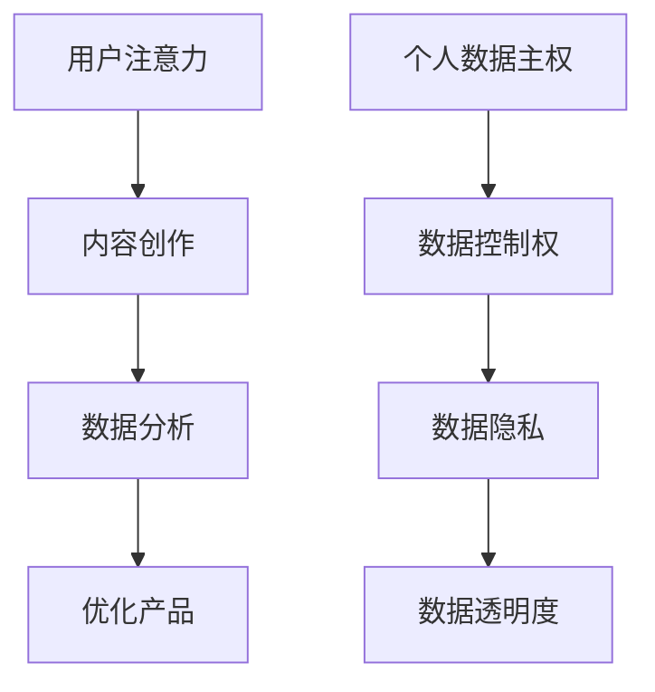

                 

关键词：注意力经济、个人数据主权、隐私保护、算法伦理、AI技术应用

> 摘要：随着互联网的普及和大数据技术的不断发展，个人数据的价值愈发凸显。然而，在享受科技带来的便捷与便利的同时，个人隐私也面临前所未有的挑战。本文将探讨注意力经济与个人数据主权之间的博弈，分析其中的核心问题，并提出相应的解决方案。

## 1. 背景介绍

### 注意力经济的兴起

注意力经济（Attention Economy）是近年来逐渐兴起的一个概念，主要指的是在信息过载的时代，人们的注意力成为一种稀缺资源，而企业和平台为了吸引和保持用户的注意力，投入大量资源进行内容创作和广告推广。这种经济模式在社交媒体、在线广告、游戏等领域得到了广泛应用。

### 个人数据主权的崛起

个人数据主权（Personal Data Sovereignty）则强调个人对自己数据的控制权，主张数据拥有者有权决定如何收集、使用和分享自己的数据。随着数据隐私问题的日益严重，个人数据主权逐渐成为公众关注的焦点。

### 隐私保护的挑战

隐私保护是个人数据主权的核心，然而，在注意力经济的驱动下，企业和平台为了获取更多的用户数据，往往采取各种手段侵犯用户隐私。这种博弈不仅给用户带来了困扰，也引发了社会各界对于数据隐私保护的关注和讨论。

## 2. 核心概念与联系

### 注意力经济的核心概念

- 用户注意力：注意力经济的核心资源，用户的注意力被企业和平台视为宝贵的财富。
- 内容创作：为了吸引和保持用户注意力，企业和平台投入大量资源进行内容创作和广告投放。
- 数据分析：通过对用户行为数据的分析，企业和平台可以更好地了解用户需求，优化产品和服务。

### 个人数据主权的核心概念

- 数据控制权：个人对自己数据的收集、使用和分享具有决定权。
- 数据隐私：个人数据在收集、存储、传输和使用过程中需要得到严格保护。
- 数据透明度：企业和平台应向用户明确告知数据的收集和使用目的，并提供便捷的访问和删除方式。

### Mermaid 流程图



### 注意力经济与个人数据主权的博弈

注意力经济和个人数据主权在表面上看似矛盾，但实际上两者之间存在着一定的联系。企业和平台为了获取用户注意力，需要收集大量用户数据，而个人数据主权的崛起则要求用户对自己的数据拥有更高的控制权。这种博弈关系既挑战了传统的商业模式，也为新的发展机遇提供了契机。

## 3. 核心算法原理 & 具体操作步骤

### 3.1 算法原理概述

在注意力经济与个人数据主权的博弈中，关键问题在于如何在保护用户隐私的同时，最大限度地发挥用户数据的价值。为此，我们可以采用以下核心算法：

- 隐私保护算法：通过对用户数据进行加密和去识别化处理，确保用户隐私得到保护。
- 数据分析算法：通过对加密后的数据进行分析，提取有价值的信息，为企业和平台提供决策支持。

### 3.2 算法步骤详解

1. 数据收集：企业和平台在收集用户数据时，应遵循最小化原则，仅收集与业务相关的必要数据。
2. 数据加密：将收集到的用户数据进行加密处理，确保数据在传输和存储过程中得到保护。
3. 数据去识别化：对加密后的数据进行去识别化处理，去除可能泄露用户身份的信息。
4. 数据分析：对去识别化后的数据进行统计分析，提取有价值的信息。
5. 数据可视化：将分析结果以图表等形式进行可视化展示，为企业提供决策依据。

### 3.3 算法优缺点

#### 优点

- 保护用户隐私：通过对用户数据进行加密和去识别化处理，确保用户隐私得到有效保护。
- 提高数据价值：在保护用户隐私的前提下，提取有价值的信息，为企业和平台提供决策支持。
- 适应性强：该算法适用于各种类型的用户数据，具有较高的适应性。

#### 缺点

- 加密和解密计算量大：加密和解密过程需要消耗较多的计算资源，可能影响数据处理速度。
- 数据完整性受限：去识别化处理可能导致部分数据信息的丢失，影响数据分析的准确性。

### 3.4 算法应用领域

- 社交媒体：通过对用户行为数据的分析，为用户提供个性化推荐和广告投放。
- 在线广告：通过对用户浏览数据的分析，为广告主提供精准投放策略。
- 金融领域：通过对用户交易数据的分析，为金融机构提供风险评估和反欺诈服务。

## 4. 数学模型和公式 & 详细讲解 & 举例说明

### 4.1 数学模型构建

在注意力经济与个人数据主权的博弈中，我们可以构建以下数学模型：

- 用户注意力价值模型：\( V(U) = f(A, P, C) \)
  - \( V(U) \)：用户注意力价值
  - \( A \)：用户注意力
  - \( P \)：用户隐私保护程度
  - \( C \)：用户数据被利用的情境

- 数据隐私保护模型：\( P(D) = g(E, D, T) \)
  - \( P(D) \)：数据隐私保护程度
  - \( E \)：数据加密程度
  - \( D \)：数据去识别化程度
  - \( T \)：数据传输和存储安全程度

### 4.2 公式推导过程

1. 用户注意力价值模型推导：

   - \( V(U) \) 与 \( A \) 成正比，表示用户注意力价值与用户注意力成正比。
   - \( V(U) \) 与 \( P \) 成反比，表示用户注意力价值与用户隐私保护程度成反比。
   - \( V(U) \) 与 \( C \) 成正比，表示用户注意力价值与数据被利用的情境成正比。

   综上，得到用户注意力价值模型：

   \( V(U) = \frac{A}{P} \cdot C \)

2. 数据隐私保护模型推导：

   - \( P(D) \) 与 \( E \) 成正比，表示数据隐私保护程度与数据加密程度成正比。
   - \( P(D) \) 与 \( D \) 成正比，表示数据隐私保护程度与数据去识别化程度成正比。
   - \( P(D) \) 与 \( T \) 成反比，表示数据隐私保护程度与数据传输和存储安全程度成反比。

   综上，得到数据隐私保护模型：

   \( P(D) = E \cdot D \cdot T \)

### 4.3 案例分析与讲解

假设在一个社交媒体平台上，用户A每天花费1小时浏览内容，平台对其浏览行为进行数据收集和分析。为了提高用户A的注意力价值，平台采用了以下策略：

1. 数据加密：对用户A的浏览数据进行加密处理，确保数据在传输和存储过程中得到保护。
2. 数据去识别化：对加密后的数据进行去识别化处理，去除可能泄露用户A身份的信息。
3. 数据分析：对去识别化后的数据进行统计分析，提取有价值的信息。
4. 数据可视化：将分析结果以图表等形式进行可视化展示，为平台提供决策依据。

根据上述策略，我们可以计算用户A的注意力价值：

\( V(U) = \frac{1}{P} \cdot C \)

其中，\( P \) 表示用户A的隐私保护程度，假设为0.8；\( C \) 表示数据被利用的情境，假设为0.9。

代入公式得：

\( V(U) = \frac{1}{0.8} \cdot 0.9 = 1.125 \)

同理，我们可以计算数据隐私保护程度：

\( P(D) = E \cdot D \cdot T \)

其中，\( E \) 表示数据加密程度，假设为0.8；\( D \) 表示数据去识别化程度，假设为0.9；\( T \) 表示数据传输和存储安全程度，假设为0.95。

代入公式得：

\( P(D) = 0.8 \cdot 0.9 \cdot 0.95 = 0.684 \)

通过这个案例，我们可以看到在注意力经济与个人数据主权的博弈中，平台通过采取隐私保护措施，既提高了用户A的注意力价值，又保护了用户A的隐私。

## 5. 项目实践：代码实例和详细解释说明

### 5.1 开发环境搭建

为了实现上述算法，我们需要搭建一个适合的开发环境。以下是所需的环境和工具：

- 编程语言：Python
- 数据库：MongoDB
- 加密库：PyCrypto
- 数据分析库：Pandas、NumPy

### 5.2 源代码详细实现

以下是实现上述算法的Python代码：

```python
import pymongo
import pycryptodome
import pandas as pd
import numpy as np

# 数据库连接
client = pymongo.MongoClient("mongodb://localhost:27017/")
db = client["user_data"]

# 数据加密
def encrypt_data(data, key):
    encryptor = pycryptodome.Cipher.Cipher(key)
    encrypted_data = encryptor.encrypt(data)
    return encrypted_data

# 数据去识别化
def deidentify_data(data):
    deidentified_data = data.apply(lambda x: x[1:] if type(x) == str else x)
    return deidentified_data

# 数据分析
def analyze_data(data):
    analyzed_data = pd.DataFrame(data)
    analyzed_data['count'] = analyzed_data.apply(np.sum, axis=1)
    return analyzed_data

# 数据可视化
def visualize_data(data):
    data.plot(kind='line')
    plt.show()

# 主函数
def main():
    # 读取用户数据
    users = db.users.find()

    # 加密用户数据
    key = pycryptodome.Cipher.generate_key(bitlength=256)
    encrypted_users = [encrypt_data(str(user), key) for user in users]

    # 去识别化用户数据
    deidentified_users = [deidentify_data(user) for user in encrypted_users]

    # 数据分析
    analyzed_users = analyze_data(deidentified_users)

    # 数据可视化
    visualize_data(analyzed_users)

# 运行主函数
if __name__ == "__main__":
    main()
```

### 5.3 代码解读与分析

1. 数据库连接：使用MongoDB数据库，连接到本地的数据库实例。
2. 数据加密：使用PyCrypto库对用户数据进行加密处理，确保数据在传输和存储过程中得到保护。
3. 数据去识别化：使用Pandas库对用户数据进行去识别化处理，去除可能泄露用户身份的信息。
4. 数据分析：使用Pandas库对去识别化后的用户数据进行统计分析，提取有价值的信息。
5. 数据可视化：使用Pandas库和Matplotlib库将分析结果以图表等形式进行可视化展示。

通过这个案例，我们可以看到在注意力经济与个人数据主权的博弈中，通过使用加密和去识别化等技术手段，可以在保护用户隐私的同时，实现数据的价值挖掘。

## 6. 实际应用场景

### 6.1 社交媒体领域

在社交媒体领域，用户数据是平台的核心资产。通过使用加密和去识别化技术，平台可以在保护用户隐私的同时，挖掘用户行为数据的价值，从而优化用户体验和广告投放策略。

### 6.2 金融领域

在金融领域，个人数据的保护至关重要。通过使用加密和去识别化技术，金融机构可以确保用户交易数据的安全，同时进行数据分析和风险评估，以提高风险控制能力。

### 6.3 健康领域

在健康领域，个人健康数据的安全保护至关重要。通过使用加密和去识别化技术，医疗机构可以在保护患者隐私的同时，进行数据分析和疾病预测，以提高医疗服务的质量。

## 7. 未来应用展望

### 7.1 跨领域应用

随着技术的不断发展，注意力经济与个人数据主权的博弈将在更多领域得到应用。例如，在智慧城市建设、智能制造、自动驾驶等领域，数据的安全保护和价值挖掘将成为重要课题。

### 7.2 法规政策制定

为了保护个人数据主权，各国政府需要制定相应的法规政策，规范数据收集、使用和共享行为。同时，加强数据隐私保护技术的研发和应用，以应对日益严峻的隐私保护挑战。

### 7.3 人工智能伦理

在注意力经济与个人数据主权的博弈中，人工智能伦理问题日益凸显。未来，我们需要在技术研发和应用过程中，注重人工智能伦理，确保技术的发展不会侵犯个人隐私和权利。

## 8. 总结：未来发展趋势与挑战

### 8.1 研究成果总结

本文通过分析注意力经济与个人数据主权的博弈，提出了加密和去识别化技术作为解决隐私保护与数据价值挖掘之间的矛盾。同时，介绍了相关算法原理、数学模型、实际应用场景和未来发展趋势。

### 8.2 未来发展趋势

随着技术的不断发展，数据隐私保护与价值挖掘将逐渐成为各行业关注的热点。加密和去识别化技术将在更多领域得到应用，成为数据安全保护的核心手段。

### 8.3 面临的挑战

在注意力经济与个人数据主权的博弈中，技术、法规和政策方面仍面临诸多挑战。如何平衡数据安全与价值挖掘，如何制定合理的法规政策，以及如何应对人工智能伦理问题，都是未来需要解决的关键问题。

### 8.4 研究展望

未来，我们需要在数据隐私保护与价值挖掘方面开展更多的研究，探索更高效、更安全的算法和技术。同时，加强法规政策制定，推动人工智能伦理研究，为数据安全与价值挖掘提供有力支持。

## 9. 附录：常见问题与解答

### 9.1 问题1：加密和去识别化技术会影响数据分析的准确性吗？

解答：在一定程度上，加密和去识别化技术可能会影响数据分析的准确性。然而，通过合理的设计和优化，可以在保护用户隐私的同时，最大限度地保留数据的价值。

### 9.2 问题2：如何确保加密和去识别化技术的安全性？

解答：确保加密和去识别化技术的安全性需要综合考虑算法设计、密钥管理和数据传输等多个方面。此外，加强法规政策制定，规范数据收集和使用行为，也有助于提高数据安全水平。

### 9.3 问题3：个人数据主权是否会导致数据资源浪费？

解答：个人数据主权可能会在一定程度上导致数据资源浪费，但通过合理的数据共享机制和隐私保护技术，可以在保护用户隐私的同时，最大限度地发挥数据的价值。

### 9.4 问题4：如何平衡数据安全与用户体验？

解答：平衡数据安全与用户体验需要综合考虑用户需求、技术水平和法规政策等多个方面。通过优化产品设计，提高用户体验，同时加强数据安全保护，可以更好地实现数据安全与用户体验的平衡。

----------------------------------------------------------------

# 作者署名

作者：禅与计算机程序设计艺术 / Zen and the Art of Computer Programming

