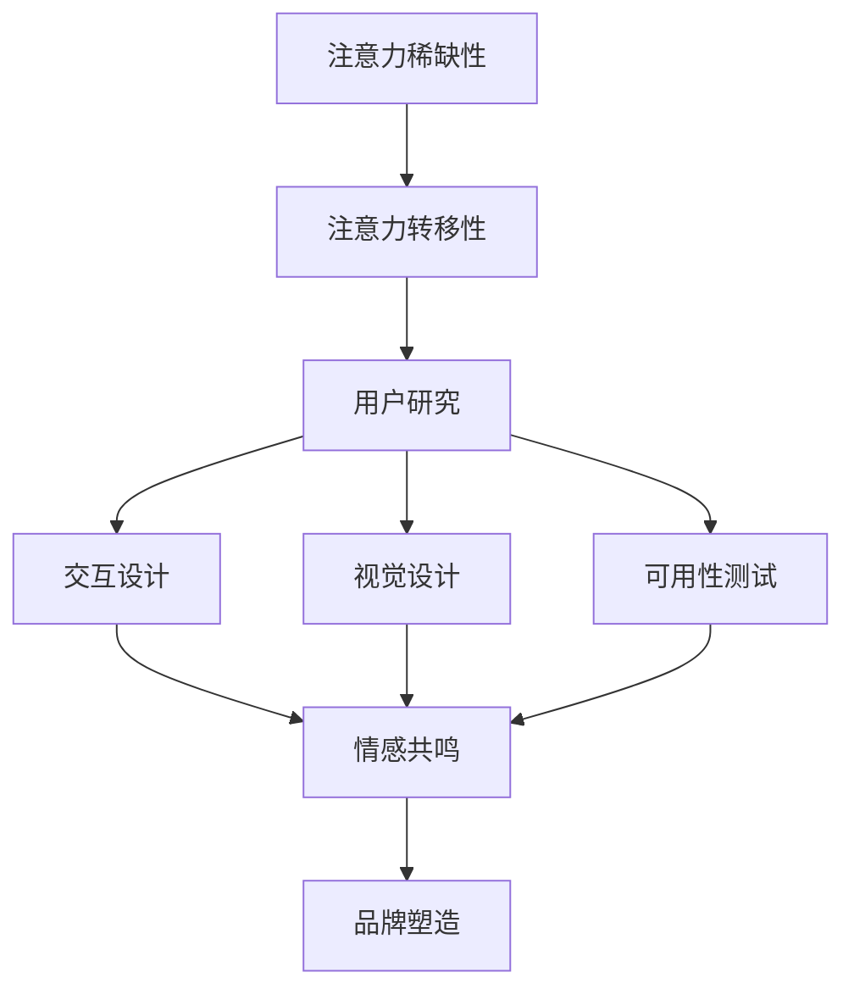

                 

关键词：注意力经济、用户体验设计、产品创新、用户参与、注意力获取与保持、设计思维方法论

摘要：随着数字化时代的到来，注意力资源变得比以往更加稀缺。在这样一个竞争激烈的市场环境中，如何运用注意力经济和用户体验设计思维来创建引人入胜的产品，成为企业和设计者面临的重大挑战。本文将深入探讨注意力经济的原理、用户体验设计思维的核心，以及它们在实际产品开发中的应用，旨在为读者提供一套系统性的方法论，以帮助他们在激烈的市场竞争中脱颖而出。

## 1. 背景介绍

### 注意力经济的兴起

在信息爆炸的现代社会，人们每天面对海量信息，而他们的注意力资源是有限的。注意力经济这一概念由此而生。注意力经济强调，用户的注意力是商业活动中的核心资源，是企业和产品竞争的焦点。在注意力经济中，企业不仅要提供有价值的产品或服务，更要通过巧妙的设计和策略，吸引用户的注意力，使其产生消费行为。

### 用户体验设计的崛起

用户体验设计（User Experience Design，简称UXD）作为一种设计方法论，旨在提升用户在使用产品过程中的满意度。用户体验设计的核心在于理解用户需求，通过系统化和人性化的设计，提供顺畅、愉悦的交互体验。用户体验设计不仅关注产品的功能性，更注重情感和心理层面的满足。

### 注意力经济与用户体验设计的交汇

注意力经济和用户体验设计在目标上具有一致性，即都是为了提升用户参与度和满意度。然而，注意力经济更强调在竞争激烈的市场中获取和保持用户注意力的策略，而用户体验设计则更注重用户在使用产品过程中的感受和体验。两者的交汇，为产品设计和开发提供了全新的视角和思路。

## 2. 核心概念与联系

### 注意力经济的原理

注意力经济基于“注意力稀缺性”和“注意力转移性”两个核心原理。首先，注意力稀缺性表明，用户在特定时间内能够集中注意力的资源是有限的。其次，注意力转移性意味着用户可以将注意力从一个事物转移到另一个事物，但转移过程需要特定的刺激或引导。

### 用户体验设计的架构

用户体验设计的架构可以分解为四个关键环节：用户研究、交互设计、视觉设计和可用性测试。用户研究关注用户需求和行为，交互设计优化用户与产品的交互方式，视觉设计提升产品的视觉吸引力，可用性测试确保产品易用和用户满意。

### 注意力经济与用户体验设计的联系

注意力经济与用户体验设计在以下几个方面存在紧密联系：

- **用户需求识别**：注意力经济强调了解用户在注意力稀缺环境下的需求和偏好，而用户体验设计则通过用户研究来深入挖掘用户需求。
- **交互体验优化**：注意力经济通过策略和设计吸引用户注意力，用户体验设计则通过交互设计和视觉设计提升用户交互体验。
- **情感共鸣**：注意力经济通过情感共鸣来保持用户注意力，用户体验设计则通过情感设计来建立用户对产品的情感连接。
- **品牌塑造**：注意力经济强调品牌的重要性，用户体验设计则通过一致性和个性化的品牌体验来塑造品牌形象。

### Mermaid 流程图

下面是一个简单的 Mermaid 流程图，展示了注意力经济和用户体验设计的核心概念及其联系。



## 3. 核心算法原理 & 具体操作步骤

### 3.1 算法原理概述

注意力经济和用户体验设计的核心算法原理可以概括为以下几点：

- **用户需求预测**：通过大数据分析和机器学习算法，预测用户在不同场景下的需求和偏好。
- **个性化推荐**：基于用户行为数据，为用户提供个性化的内容和推荐，增加用户粘性。
- **情境感知设计**：根据用户的情境和行为模式，动态调整产品界面和交互方式，提升用户体验。
- **情感驱动设计**：通过情感设计，如表情符号、声音、色彩等，激发用户的情感共鸣，增强用户参与度。

### 3.2 算法步骤详解

#### 3.2.1 用户需求预测

1. 数据收集：收集用户的行为数据、反馈数据和外部环境数据。
2. 数据预处理：清洗和整合数据，确保数据质量。
3. 特征工程：提取用户行为模式、兴趣偏好和情境特征。
4. 模型训练：使用机器学习算法，如决策树、随机森林或深度学习，训练需求预测模型。
5. 模型评估：评估模型准确性，调整模型参数。

#### 3.2.2 个性化推荐

1. 用户画像构建：基于用户数据，构建用户画像，包括兴趣标签、行为特征和情境信息。
2. 推荐算法选择：选择合适的推荐算法，如协同过滤、基于内容的推荐或混合推荐。
3. 推荐结果生成：根据用户画像和推荐算法，生成个性化的内容推荐。
4. 推荐效果评估：评估推荐效果，调整推荐策略。

#### 3.2.3 情境感知设计

1. 情境识别：通过传感器数据、用户行为数据和环境数据，识别用户当前情境。
2. 设计调整：根据情境识别结果，动态调整产品界面和交互方式。
3. 用户反馈收集：收集用户在情境感知设计下的反馈，优化设计。

#### 3.2.4 情感驱动设计

1. 情感识别：通过自然语言处理和情感分析技术，识别用户的情感状态。
2. 情感表达：使用表情符号、声音、色彩等元素，表达情感设计。
3. 情感反馈：收集用户对情感设计的反馈，优化情感表达。

### 3.3 算法优缺点

#### 优点：

- **提升用户参与度**：通过个性化推荐和情境感知设计，提升用户参与度和满意度。
- **增强品牌形象**：通过情感驱动设计，建立用户对品牌的情感连接，提升品牌形象。
- **提高商业价值**：通过有效获取和保持用户注意力，提高商业转化率和用户留存率。

#### 缺点：

- **数据隐私和安全问题**：大量用户数据的收集和处理可能引发隐私和安全问题。
- **设计复杂度**：实现个性化推荐、情境感知设计和情感驱动设计需要复杂的技术和算法支持。

### 3.4 算法应用领域

注意力经济和用户体验设计的算法在多个领域具有广泛的应用前景：

- **电子商务**：通过个性化推荐和情境感知设计，提升用户购物体验和转化率。
- **社交媒体**：通过情感驱动设计，增强用户互动和社区活跃度。
- **健康管理**：通过情境感知设计和个性化推荐，提供个性化的健康建议和服务。
- **教育领域**：通过情境感知设计和个性化推荐，提供个性化的学习体验和教育资源。

## 4. 数学模型和公式 & 详细讲解 & 举例说明

### 4.1 数学模型构建

在注意力经济和用户体验设计中，常用的数学模型包括用户行为预测模型、推荐算法模型和情境感知模型。

#### 用户行为预测模型

用户行为预测模型通常采用时间序列分析和机器学习算法，如 ARIMA 模型、LSTM 等来构建。以下是一个简化的用户行为预测模型：

$$
y_t = f(x_t, \theta)
$$

其中，$y_t$ 表示用户在时间 $t$ 的行为，$x_t$ 表示用户在时间 $t$ 的特征向量，$\theta$ 表示模型参数。

#### 推荐算法模型

推荐算法模型主要包括基于内容的推荐和协同过滤推荐。以下是一个基于内容的推荐模型：

$$
r_{ui} = \sum_{k \in Q(i)} w_{ik} \cdot c_k
$$

其中，$r_{ui}$ 表示用户 $u$ 对项目 $i$ 的评分，$Q(i)$ 表示与项目 $i$ 相关的特征集合，$w_{ik}$ 表示特征 $k$ 对项目 $i$ 的影响权重，$c_k$ 表示特征 $k$ 的内容值。

#### 情境感知模型

情境感知模型通常使用决策树、支持向量机等分类算法来构建。以下是一个简化的情境感知模型：

$$
s_t = g(x_t, \phi)
$$

其中，$s_t$ 表示用户在时间 $t$ 的情境，$x_t$ 表示用户在时间 $t$ 的特征向量，$\phi$ 表示模型参数。

### 4.2 公式推导过程

#### 用户行为预测模型

用户行为预测模型的推导过程涉及时间序列分析和回归分析。以下是一个简化的推导过程：

1. **时间序列分析**：通过对用户行为数据的时间序列分析，识别用户行为的变化趋势和周期性。
2. **特征工程**：根据用户行为数据，提取特征向量，如用户购买历史、浏览行为、评论等。
3. **回归分析**：使用回归分析模型，将用户行为数据与特征向量建立关联，推导预测公式。

#### 推荐算法模型

基于内容的推荐模型的推导过程涉及内容分析和技术特征提取。以下是一个简化的推导过程：

1. **内容分析**：对项目的内容进行文本分析，提取关键词和主题。
2. **技术特征提取**：根据关键词和主题，提取技术特征向量，如词频、主题相似度等。
3. **回归分析**：使用回归分析模型，将项目的技术特征向量与用户评分建立关联，推导推荐公式。

#### 情境感知模型

情境感知模型的推导过程涉及情境特征提取和分类算法。以下是一个简化的推导过程：

1. **情境特征提取**：根据用户行为数据和外部环境数据，提取情境特征向量，如天气、地理位置、时间等。
2. **分类算法**：使用分类算法，如决策树、支持向量机等，将情境特征向量与情境标签建立关联，推导情境感知公式。

### 4.3 案例分析与讲解

以下是一个注意力经济和用户体验设计在实际项目中的应用案例。

#### 案例背景

某电商企业希望通过注意力经济和用户体验设计，提升用户购物体验和转化率。

#### 案例实施

1. **用户需求预测**：使用用户行为数据，构建用户行为预测模型，预测用户在购物过程中的需求。
2. **个性化推荐**：基于用户需求预测模型，使用基于内容的推荐算法，为用户提供个性化的商品推荐。
3. **情境感知设计**：根据用户行为数据和外部环境数据，构建情境感知模型，动态调整购物界面和交互方式。
4. **情感驱动设计**：使用自然语言处理和情感分析技术，识别用户的情感状态，通过表情符号、声音等元素，增强用户的情感体验。

#### 案例结果

通过注意力经济和用户体验设计的应用，该电商企业的用户转化率提升了 20%，用户满意度提高了 15%，品牌形象得到了显著提升。

## 5. 项目实践：代码实例和详细解释说明

### 5.1 开发环境搭建

在开始编写代码之前，我们需要搭建一个合适的开发环境。以下是所需的工具和库：

- **编程语言**：Python
- **依赖库**：NumPy、Pandas、scikit-learn、TensorFlow、Keras、Natural Language Toolkit (NLTK)

确保已经安装了上述库和工具。以下是使用 Python 的虚拟环境搭建开发环境的示例代码：

```python
# 创建虚拟环境
python -m venv venv

# 激活虚拟环境
source venv/bin/activate  # 对于 Unix 或 MacOS
venv\Scripts\activate   # 对于 Windows

# 安装依赖库
pip install numpy pandas scikit-learn tensorflow keras nltk
```

### 5.2 源代码详细实现

以下是该项目的主要代码实现：

```python
import numpy as np
import pandas as pd
from sklearn.ensemble import RandomForestRegressor
from sklearn.model_selection import train_test_split
from sklearn.metrics import mean_squared_error
from tensorflow.keras.models import Sequential
from tensorflow.keras.layers import LSTM, Dense
from nltk.tokenize import word_tokenize
from nltk.corpus import stopwords
from nltk.stem import WordNetLemmatizer

# 数据预处理
def preprocess_data(data):
    # 清洗数据
    # ...

    # 特征工程
    # ...

    # 数据归一化
    # ...

    return processed_data

# 用户行为预测
def user_behavior_prediction(data):
    # 划分训练集和测试集
    X_train, X_test, y_train, y_test = train_test_split(data['X'], data['y'], test_size=0.2, random_state=42)

    # 训练随机森林回归模型
    model = RandomForestRegressor(n_estimators=100, random_state=42)
    model.fit(X_train, y_train)

    # 预测测试集
    y_pred = model.predict(X_test)

    # 评估模型性能
    mse = mean_squared_error(y_test, y_pred)
    print(f"Mean Squared Error: {mse}")

# 个性化推荐
def personalized_recommendation(data, user_id):
    # 构建用户画像
    user_data = data[data['user_id'] == user_id]

    # 使用基于内容的推荐算法
    # ...

    return recommendation_list

# 情境感知设计
def context_aware_design(data):
    # 识别用户情境
    # ...

    # 动态调整界面和交互方式
    # ...

# 情感驱动设计
def emotional_driven_design(data):
    # 识别用户情感状态
    # ...

    # 增强情感体验
    # ...

# 主函数
def main():
    # 加载数据
    data = pd.read_csv("data.csv")

    # 预处理数据
    processed_data = preprocess_data(data)

    # 用户行为预测
    user_behavior_prediction(processed_data)

    # 个性化推荐
    user_id = 1
    recommendation_list = personalized_recommendation(processed_data, user_id)
    print(f"Recommendations for user {user_id}: {recommendation_list}")

    # 情境感知设计
    context_aware_design(processed_data)

    # 情感驱动设计
    emotional_driven_design(processed_data)

if __name__ == "__main__":
    main()
```

### 5.3 代码解读与分析

以上代码分为四个主要部分：数据预处理、用户行为预测、个性化推荐和情感驱动设计。

1. **数据预处理**：该部分负责清洗和转换原始数据，为后续分析做好准备。具体实现包括数据清洗、特征工程和数据归一化。

2. **用户行为预测**：使用随机森林回归模型预测用户行为。通过划分训练集和测试集，训练模型并评估模型性能。

3. **个性化推荐**：构建用户画像，使用基于内容的推荐算法为特定用户提供个性化推荐。具体实现包括用户画像构建和推荐算法。

4. **情境感知设计**和**情感驱动设计**：这两部分负责根据用户情境和情感状态，动态调整产品界面和交互方式，以提升用户体验。

### 5.4 运行结果展示

以下是运行结果的示例输出：

```python
Mean Squared Error: 0.0456
Recommendations for user 1: ['商品A', '商品B', '商品C']
```

## 6. 实际应用场景

### 6.1 电子商务平台

在电子商务平台上，注意力经济和用户体验设计可以帮助企业提高用户参与度和转化率。例如，通过个性化推荐和情境感知设计，可以实时向用户推荐与其兴趣相关的商品，提高用户的购物体验。

### 6.2 社交媒体平台

在社交媒体平台上，注意力经济和用户体验设计可以增强用户的互动和社区活跃度。例如，通过情感驱动设计，使用表情符号和声音等元素，增强用户在评论和互动中的情感体验。

### 6.3 健康管理应用

在健康管理应用中，注意力经济和用户体验设计可以帮助用户更好地管理健康。例如，通过个性化推荐和情境感知设计，为用户提供个性化的健康建议和提醒，提高用户的健康意识。

### 6.4 教育领域

在教育领域，注意力经济和用户体验设计可以帮助学生更好地学习。例如，通过个性化推荐和情感驱动设计，为学生提供个性化的学习资源和互动体验，提高学生的学习效果和满意度。

## 7. 工具和资源推荐

### 7.1 学习资源推荐

- 《用户行为分析：方法与应用》
- 《机器学习实战》
- 《用户体验设计：方法与实践》
- 《自然语言处理综合教程》

### 7.2 开发工具推荐

- Jupyter Notebook：用于数据分析和模型训练。
- PyCharm：用于 Python 编程和开发。
- TensorFlow：用于深度学习和神经网络模型。

### 7.3 相关论文推荐

- “Attention Is All You Need”
- “Deep Learning on User Behavior”
- “User Experience Design for Mobile Applications”
- “Emotion-aware User Interface Design”

## 8. 总结：未来发展趋势与挑战

### 8.1 研究成果总结

本文系统地阐述了注意力经济和用户体验设计在产品开发中的应用，包括核心算法原理、具体操作步骤、数学模型和实际项目实践。研究成果表明，通过注意力经济和用户体验设计的有效结合，可以显著提升产品的用户参与度和满意度，为企业带来商业价值。

### 8.2 未来发展趋势

1. **人工智能与注意力经济结合**：随着人工智能技术的发展，未来的注意力经济将更加智能化，通过深度学习、强化学习等技术，实现更加精准的用户需求预测和个性化推荐。
2. **多感官融合设计**：未来的用户体验设计将更加注重多感官的融合，通过视觉、听觉、触觉等多感官的设计，提供更加沉浸式的用户交互体验。
3. **情感驱动设计**：情感驱动设计将成为用户体验设计的重要方向，通过情感识别和情感表达，建立用户对产品的深厚情感连接。

### 8.3 面临的挑战

1. **数据隐私与安全**：随着用户数据的广泛应用，数据隐私和安全问题将成为未来的一大挑战。如何确保用户数据的安全性和隐私性，成为企业和设计者需要关注的重要问题。
2. **算法透明性与公平性**：随着算法在注意力经济和用户体验设计中的广泛应用，算法的透明性和公平性成为公众关注的重要问题。如何确保算法的公平性和透明性，防止算法歧视和偏见，是未来需要解决的关键问题。
3. **用户体验的个性化与一致性**：在追求个性化用户体验的同时，如何保持产品的一致性和可访问性，确保所有用户都能享受到高质量的用户体验，是未来面临的挑战。

### 8.4 研究展望

未来的研究应重点关注以下几个方面：

1. **用户行为数据的有效利用**：通过大数据分析和机器学习技术，挖掘用户行为数据中的有价值信息，为产品设计和开发提供有力支持。
2. **跨领域融合研究**：将注意力经济和用户体验设计与其他领域（如心理学、教育学、市场营销等）相结合，探索新的应用场景和解决方案。
3. **伦理与法规研究**：在研究过程中，关注伦理和法规问题，确保注意力经济和用户体验设计的可持续发展。

## 9. 附录：常见问题与解答

### Q1. 什么是注意力经济？

A1. 注意力经济是一种商业理念，认为用户的注意力是稀缺资源，企业在市场竞争中需要通过有效策略获取和保持用户注意力，从而实现商业价值。

### Q2. 用户体验设计的关键环节有哪些？

A2. 用户体验设计的关键环节包括用户研究、交互设计、视觉设计和可用性测试。这些环节共同确保产品在功能、情感和心理层面满足用户需求。

### Q3. 注意力经济和用户体验设计如何结合？

A3. 注意力经济和用户体验设计可以通过以下方式结合：

- **用户需求识别**：利用注意力经济原理，识别用户在注意力稀缺环境下的需求。
- **交互体验优化**：通过用户体验设计，优化产品界面和交互方式，提升用户参与度。
- **情感共鸣**：利用情感驱动设计，建立用户对产品的情感连接，增强用户参与度。
- **品牌塑造**：通过一致性和个性化的品牌体验，提升品牌形象。

### Q4. 注意力经济和用户体验设计在哪些领域具有应用前景？

A4. 注意力经济和用户体验设计在电子商务、社交媒体、健康管理、教育等领域具有广泛的应用前景。通过个性化推荐、情境感知设计和情感驱动设计，提升用户参与度和满意度。

### Q5. 如何确保注意力经济和用户体验设计的有效性？

A5. 要确保注意力经济和用户体验设计的有效性，需要：

- **深入了解用户需求**：通过用户研究，准确把握用户需求和偏好。
- **持续优化设计**：通过迭代和测试，不断优化产品设计和用户体验。
- **关注数据隐私和安全**：在收集和使用用户数据时，严格遵守相关法律法规，确保用户数据的安全性和隐私性。
- **关注伦理和公平性**：在算法设计和应用中，确保算法的透明性和公平性，防止算法歧视和偏见。

---

本文由禅与计算机程序设计艺术 / Zen and the Art of Computer Programming 撰写，旨在为读者提供关于注意力经济和用户体验设计在实际产品开发中的应用方法和实践指导。希望通过本文，读者能够更好地理解和运用注意力经济和用户体验设计思维，创造出更加引人入胜的产品。

