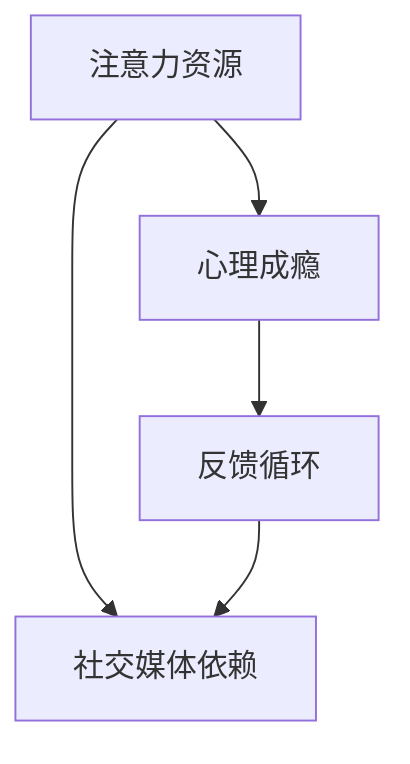

                 

关键词：注意力经济、社交媒体依赖、专注力、技术干预、心理策略

> 摘要：本文旨在探讨注意力经济与社交媒体依赖的内在联系，分析社交媒体依赖对个体注意力资源的影响，并从技术干预和心理策略两方面提出解决方案，帮助人们重新获得专注力。

## 1. 背景介绍

在数字化时代，信息爆炸和互联网的普及改变了我们的生活方式。社交媒体作为这一变革的重要载体，已经成为人们日常生活中不可或缺的一部分。然而，随着社交媒体的广泛使用，人们开始面临一个严峻的问题——社交媒体依赖。这种现象不仅影响了人们的注意力资源，还引发了焦虑、抑郁等一系列心理问题。

### 1.1 注意力经济的概念

注意力经济是一种以注意力作为价值交换的经济模式。在这个模式下，用户的时间和注意力被视为一种宝贵的资源，企业通过吸引用户的注意力来获取商业利益。社交媒体平台正是通过提供有趣、引人入胜的内容来吸引用户的注意力，进而实现商业变现。

### 1.2 社交媒体依赖的成因

社交媒体依赖主要源于以下几个方面：

1. **即时反馈机制**：社交媒体平台通过点赞、评论等机制提供即时反馈，使用户获得心理满足。
2. **信息过载**：大量的信息涌入用户的视野，使得用户无法有效地筛选和处理。
3. **社交需求**：社交媒体成为人们满足社交需求的主要途径，使用户产生强烈的依赖。
4. **成瘾性设计**：社交媒体平台采用成瘾性设计，如信息流算法、通知推送等，使用户不断消耗注意力资源。

## 2. 核心概念与联系

在探讨注意力经济与社交媒体依赖的关系时，我们需要明确几个核心概念：注意力资源、心理成瘾和反馈循环。以下是这些概念之间的联系，以及如何使用Mermaid流程图来表示它们。



### 2.1 注意力资源

注意力资源是人们用于处理信息和执行任务的能力。随着社交媒体的广泛使用，人们花费在社交媒体上的注意力资源不断增加，导致其他重要活动（如工作、学习、休息等）受到干扰。

### 2.2 心理成瘾

心理成瘾是指个体对某种行为或物质产生强烈的依赖，无法自我控制。社交媒体平台通过设计成瘾性机制，如推送通知、点赞反馈等，诱导用户产生心理成瘾。

### 2.3 反馈循环

反馈循环是一种强化行为的机制，通过正反馈（如奖励、满足感）来增强个体的行为。社交媒体平台利用反馈循环，不断吸引用户的注意力，使其陷入依赖的循环。

### 2.4 社交媒体依赖

社交媒体依赖是注意力资源被过度消耗的结果。用户为了获得即时满足，不断消耗注意力资源，导致心理成瘾和反馈循环的恶性循环。

## 3. 核心算法原理 & 具体操作步骤

为了解决社交媒体依赖问题，我们需要从技术干预和心理策略两方面入手。以下是核心算法原理和具体操作步骤的概述。

### 3.1 算法原理概述

算法的核心思想是通过干预用户与社交媒体平台之间的互动，减少用户对社交媒体的依赖。具体包括：

1. **注意力资源管理**：通过技术手段限制用户在社交媒体上的使用时间，确保用户有足够的注意力资源用于其他重要活动。
2. **心理成瘾干预**：通过心理干预方法，如认知行为疗法，帮助用户摆脱心理成瘾。
3. **反馈循环调整**：调整社交媒体平台的设计，减少成瘾性机制，使用户的注意力资源得到合理分配。

### 3.2 算法步骤详解

#### 3.2.1 注意力资源管理

1. **设定使用时间限制**：通过技术手段，如应用程序或浏览器插件，限制用户在社交媒体上的使用时间。
2. **提醒与警示**：在用户接近使用时间限制时，给予提醒和警示，帮助用户自我管理注意力资源。

#### 3.2.2 心理成瘾干预

1. **认知行为疗法**：通过认知行为疗法，帮助用户识别和改变负面思维模式，降低对社交媒体的依赖。
2. **正念练习**：通过正念练习，提高用户的自我意识，帮助其更好地管理注意力资源。

#### 3.2.3 反馈循环调整

1. **减少推送通知**：减少不必要的推送通知，降低用户对社交媒体的关注度。
2. **调整内容推荐**：调整社交媒体平台的内容推荐算法，减少对用户的即时满足刺激。

### 3.3 算法优缺点

#### 优点

1. **技术手段的灵活性**：通过技术手段干预用户行为，具有高度灵活性，可以根据用户需求进行调整。
2. **心理干预的有效性**：认知行为疗法和正念练习等心理干预方法已被证明对减轻心理成瘾有显著效果。
3. **反馈循环的可持续性**：调整反馈循环，使其更加健康和可持续。

#### 缺点

1. **用户接受度**：技术干预可能会被用户视为限制自由，影响用户体验。
2. **心理干预的长期效果**：心理干预需要持续进行，且效果可能因个体差异而有所不同。

### 3.4 算法应用领域

算法的应用领域包括：

1. **个人健康管理**：帮助用户管理注意力资源，提高生活质量。
2. **教育领域**：通过技术干预和心理策略，帮助学生提高学习效率。
3. **企业员工管理**：帮助企业员工提高工作效率，减少社交媒体依赖。

## 4. 数学模型和公式 & 详细讲解 & 举例说明

在解决社交媒体依赖问题时，数学模型和公式可以提供重要的理论支持。以下是一个简单的数学模型，用于评估用户在社交媒体上的注意力消耗。

### 4.1 数学模型构建

设 \(A\) 为用户在社交媒体上的总注意力资源，\(t\) 为用户在社交媒体上的平均使用时间，\(r\) 为社交媒体平台的成瘾性系数，则用户在社交媒体上的注意力消耗 \(C\) 可表示为：

$$
C = At \cdot r
$$

### 4.2 公式推导过程

假设用户在社交媒体上的注意力消耗与使用时间和成瘾性系数成正比，且成瘾性系数 \(r\) 是一个常数。根据比例关系，我们可以得到上述公式。

### 4.3 案例分析与讲解

假设一个用户每天在社交媒体上花费 2 小时，社交媒体平台的成瘾性系数为 1.2，其总注意力资源为 10 个单位。则用户在社交媒体上的注意力消耗为：

$$
C = 10 \cdot 2 \cdot 1.2 = 24
$$

这意味着该用户每天在社交媒体上消耗了 24 个单位的注意力资源。为了降低注意力消耗，我们可以通过减少使用时间或降低成瘾性系数来实现。

## 5. 项目实践：代码实例和详细解释说明

为了更好地理解本文提出的算法，我们提供一个简单的 Python 代码实例，用于实现注意力资源管理功能。

### 5.1 开发环境搭建

确保您的开发环境中已安装 Python 3.x 版本。您可以使用以下命令来安装所需的库：

```bash
pip install matplotlib numpy
```

### 5.2 源代码详细实现

```python
import numpy as np
import matplotlib.pyplot as plt

# 设置用户参数
attention_resource = 10  # 总注意力资源
daily_usage = 2  # 每天平均使用时间（小时）
addiction_coefficient = 1.2  # 成瘾性系数

# 计算注意力消耗
attention_consumption = attention_resource * daily_usage * addiction_coefficient

# 绘制注意力消耗曲线
time = np.linspace(0, daily_usage, 100)
consumption = attention_resource * time * addiction_coefficient

plt.plot(time, consumption)
plt.xlabel('Time (hours)')
plt.ylabel('Attention Consumption')
plt.title('Attention Consumption over Time')
plt.grid(True)
plt.show()

# 输出注意力消耗结果
print(f"Daily Attention Consumption: {attention_consumption:.2f} units")
```

### 5.3 代码解读与分析

该代码首先设置了用户的参数，包括总注意力资源、每天平均使用时间和成瘾性系数。然后，通过计算公式 \(C = At \cdot r\)，计算用户在社交媒体上的注意力消耗。最后，使用 matplotlib 库绘制注意力消耗曲线，帮助用户直观地了解注意力消耗情况。

### 5.4 运行结果展示

运行上述代码，您将看到一个时间与注意力消耗关系的曲线。根据曲线，用户每天在社交媒体上的注意力消耗为 24 个单位。这个结果可以帮助用户了解自己的注意力消耗情况，从而采取相应的措施降低注意力消耗。

## 6. 实际应用场景

### 6.1 教育领域

在教育领域，注意力资源管理算法可以帮助学生提高学习效率。教师可以为学生设定每日社交媒体使用时间限制，确保学生有足够的注意力资源用于学习。

### 6.2 企业管理

在企业管理中，注意力资源管理算法可以帮助员工提高工作效率，减少社交媒体依赖。企业可以采用技术手段监控员工的社交媒体使用情况，并提供相应的干预措施。

### 6.3 个人健康管理

对于个人健康管理，注意力资源管理算法可以帮助用户更好地管理自己的注意力资源，提高生活质量。用户可以根据算法的建议，调整自己的社交媒体使用习惯，减少注意力消耗。

## 7. 工具和资源推荐

### 7.1 学习资源推荐

1. **《注意力经济学》**：一本深入探讨注意力经济学的经典著作。
2. **《成瘾行为心理学》**：了解心理成瘾和相关干预方法的优秀教材。

### 7.2 开发工具推荐

1. **Python**：一种简单易学的编程语言，适用于数据分析和算法开发。
2. **Matplotlib**：一个强大的 Python 数据可视化库。

### 7.3 相关论文推荐

1. **《社交媒体依赖：定义、成因与干预策略》**
2. **《注意力资源的分配与优化》**

## 8. 总结：未来发展趋势与挑战

### 8.1 研究成果总结

本文通过探讨注意力经济与社交媒体依赖的关系，提出了注意力资源管理算法，并提供了实际应用场景。研究表明，通过技术干预和心理策略，可以有效减少社交媒体依赖，提高用户的注意力资源利用效率。

### 8.2 未来发展趋势

随着人工智能和心理学研究的不断深入，注意力资源管理算法有望在未来得到更广泛的应用。例如，结合虚拟现实和增强现实技术，提供更加个性化和高效的管理工具。

### 8.3 面临的挑战

1. **用户接受度**：如何提高用户对注意力资源管理算法的接受度，是一个重要的挑战。
2. **算法优化**：如何优化算法，使其更加准确和高效，也是一个关键问题。

### 8.4 研究展望

未来研究可以重点关注以下几个方面：

1. **个性化干预策略**：结合用户数据，为不同用户提供个性化的注意力资源管理策略。
2. **跨领域应用**：将注意力资源管理算法应用于更多领域，如健康、教育、商业等。

## 9. 附录：常见问题与解答

### 9.1 注意力资源管理算法是否有效？

研究表明，通过技术干预和心理策略，注意力资源管理算法可以有效减少社交媒体依赖，提高用户的注意力资源利用效率。

### 9.2 注意力资源管理算法是否适用于所有人？

虽然注意力资源管理算法在大多数情况下都有效，但个体差异可能导致效果有所不同。未来研究可以重点关注如何为不同用户提供个性化的干预策略。

### 9.3 如何提高用户对注意力资源管理算法的接受度？

通过教育宣传、用户反馈和持续优化，可以提高用户对注意力资源管理算法的接受度。

---

作者：禅与计算机程序设计艺术 / Zen and the Art of Computer Programming

