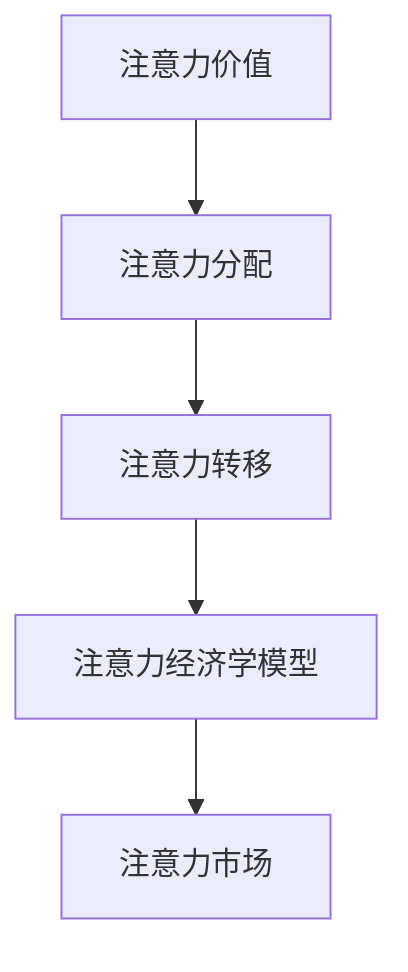

                 

关键词：注意力经济学，元宇宙，价值重构，算法原理，数学模型，项目实践，应用场景，未来展望

> 摘要：随着元宇宙的蓬勃发展，注意力经济学的概念逐渐走进人们的视野。本文将探讨注意力经济学在元宇宙中的价值重构，分析其核心概念与联系，详细阐述核心算法原理与操作步骤，并通过数学模型和公式进行深入讲解，结合实际项目实践进行代码实例解析。文章最后将对实际应用场景进行展望，并总结未来发展趋势与挑战。

## 1. 背景介绍

随着互联网技术的不断发展，虚拟现实、增强现实等技术逐渐成熟，元宇宙这个概念也逐渐走入人们的视野。元宇宙是一个虚拟的、共享的、去中心化的数字世界，用户可以在其中进行各种活动，如社交、游戏、购物等。而注意力经济学，则是在这个数字世界中，研究用户注意力资源分配与利用的经济学理论。

在元宇宙中，用户的注意力是一种重要的资源，类似于现实世界的金钱或时间。然而，与金钱和时间不同，注意力是有限的。用户在元宇宙中投入的注意力越多，他们在现实世界中的其他活动可能会受到影响。因此，如何合理分配和利用注意力资源，对于元宇宙的生态发展具有重要意义。

注意力经济学在元宇宙中的应用，主要包括以下几个方面：

1. **广告与营销**：在元宇宙中，广告和营销活动的效果取决于用户的注意力投入。通过注意力经济学的理论，可以更好地设计广告内容和形式，提高用户参与度。

2. **虚拟商品与服务**：在元宇宙中，用户可以通过购买虚拟商品或服务来获取注意力资源。例如，购买一个虚拟帽子可以增加用户在社交网络中的吸引力。

3. **游戏与娱乐**：在元宇宙中，游戏和娱乐活动是用户投入注意力资源的主要方式。通过注意力经济学的理论，可以设计出更具吸引力的游戏和娱乐体验。

## 2. 核心概念与联系

为了更好地理解注意力经济学在元宇宙中的价值重构，我们需要首先了解其核心概念与联系。以下是注意力经济学中的几个关键概念：

### 2.1 注意力价值

注意力价值是指用户在特定情境下对某一对象或内容的关注程度。它取决于多个因素，如用户兴趣、内容吸引力、情境等。

### 2.2 注意力分配

注意力分配是指用户在不同情境下如何合理分配自己的注意力资源。在元宇宙中，用户需要平衡各种活动之间的注意力投入，以最大化个人效用。

### 2.3 注意力转移

注意力转移是指用户在特定情境下，将注意力从一个对象转移到另一个对象的过程。在元宇宙中，用户可以通过改变关注对象来调整自己的注意力分配。

### 2.4 注意力经济学模型

注意力经济学模型是一种用于分析用户注意力资源分配与利用的数学模型。该模型可以通过数学公式和算法来描述用户注意力的行为和决策。

### 2.5 注意力市场

注意力市场是一个虚拟市场，用户可以通过购买和出售注意力资源来获取收益。在元宇宙中，注意力市场可以为用户提供一个公平、透明的交易平台。

### 2.6 Mermaid 流程图

以下是一个简单的 Mermaid 流程图，展示了注意力经济学中的核心概念与联系：



## 3. 核心算法原理 & 具体操作步骤

### 3.1 算法原理概述

注意力经济学中的核心算法主要涉及用户注意力资源的分配和优化。以下是一个简单的注意力分配算法原理概述：

1. **用户兴趣模型**：首先，通过用户的历史行为和偏好数据，构建用户兴趣模型，用于预测用户对某一对象的兴趣程度。

2. **注意力价值评估**：其次，根据用户兴趣模型和对象特征，评估用户对各个对象的注意力价值。

3. **注意力分配策略**：最后，根据注意力价值评估结果，制定注意力分配策略，以最大化用户整体效用。

### 3.2 算法步骤详解

以下是注意力分配算法的具体步骤详解：

1. **数据收集与预处理**：
   - 收集用户行为数据（如浏览历史、购买记录等）。
   - 对数据进行清洗和预处理，去除噪声和异常值。

2. **用户兴趣模型构建**：
   - 使用机器学习方法（如协同过滤、深度学习等）构建用户兴趣模型。
   - 模型输出为用户对各个对象的兴趣程度得分。

3. **注意力价值评估**：
   - 定义注意力价值评估函数，如基于兴趣度分的加权求和。
   - 对每个对象进行注意力价值评估，得到注意力价值得分。

4. **注意力分配策略**：
   - 根据注意力价值得分，制定注意力分配策略。
   - 考虑用户注意力资源限制，确保分配策略可行。

5. **算法优化**：
   - 使用优化算法（如遗传算法、粒子群算法等）对注意力分配策略进行优化。
   - 目标是最小化用户注意力资源的浪费，最大化整体效用。

### 3.3 算法优缺点

注意力分配算法具有以下优缺点：

- **优点**：
  - 能够有效预测用户兴趣，提高注意力分配的准确性。
  - 能够根据用户注意力资源限制，实现动态调整。

- **缺点**：
  - 需要大量用户行为数据进行训练，对数据质量要求较高。
  - 算法复杂度较高，计算时间较长。

### 3.4 算法应用领域

注意力分配算法在元宇宙中的应用领域主要包括：

- **广告与营销**：为用户提供个性化的广告和营销内容，提高用户参与度。
- **虚拟商品与服务**：为用户提供基于兴趣的虚拟商品推荐，增加用户购买意愿。
- **游戏与娱乐**：为用户提供基于兴趣的游戏推荐，提高游戏体验。

## 4. 数学模型和公式 & 详细讲解 & 举例说明

### 4.1 数学模型构建

在注意力经济学中，我们可以构建一个简单的数学模型来描述用户注意力资源的分配。以下是一个基于用户兴趣度和注意力价值评估的数学模型：

$$
V_i = \sum_{j=1}^{N} w_{ij} \cdot I_j
$$

其中，$V_i$ 表示用户对对象 $i$ 的注意力价值，$w_{ij}$ 表示用户对对象 $i$ 的兴趣度，$I_j$ 表示对象 $j$ 的特征向量。

### 4.2 公式推导过程

为了推导出注意力价值评估公式，我们可以先定义以下参数：

- $U$：用户集合
- $I$：对象集合
- $w_{ij}$：用户 $i$ 对对象 $j$ 的兴趣度
- $I_j$：对象 $j$ 的特征向量

首先，我们需要对用户兴趣度进行建模。假设用户兴趣度可以通过用户历史行为数据学习得到。我们可以使用一个 $U \times I$ 的矩阵 $W$ 来表示用户兴趣度：

$$
W = [w_{ij}]
$$

接下来，我们需要对对象特征进行建模。假设对象特征可以表示为一个 $I \times D$ 的矩阵 $I$，其中 $D$ 是对象特征维度：

$$
I = [I_j]
$$

现在，我们可以定义用户对对象 $i$ 的注意力价值评估函数：

$$
V_i = \sum_{j=1}^{N} w_{ij} \cdot I_j
$$

### 4.3 案例分析与讲解

假设有一个用户，其对不同对象的兴趣度如下表所示：

| 对象名称 | 兴趣度 |
| :--: | :--: |
| 商品A | 0.8 |
| 商品B | 0.2 |
| 商品C | 0.1 |

同时，假设对象的特征向量为：

$$
I = \begin{bmatrix}
0.5 & 0.3 & 0.2 \\
0.4 & 0.4 & 0.2 \\
0.3 & 0.5 & 0.2 \\
\end{bmatrix}
$$

根据上述公式，我们可以计算用户对各个对象的注意力价值：

$$
V_A = 0.8 \cdot \begin{bmatrix}
0.5 & 0.3 & 0.2 \\
0.4 & 0.4 & 0.2 \\
0.3 & 0.5 & 0.2 \\
\end{bmatrix} = [0.4 & 0.24 & 0.16]
$$

$$
V_B = 0.2 \cdot \begin{bmatrix}
0.5 & 0.3 & 0.2 \\
0.4 & 0.4 & 0.2 \\
0.3 & 0.5 & 0.2 \\
\end{bmatrix} = [0.2 & 0.12 & 0.08]
$$

$$
V_C = 0.1 \cdot \begin{bmatrix}
0.5 & 0.3 & 0.2 \\
0.4 & 0.4 & 0.2 \\
0.3 & 0.5 & 0.2 \\
\end{bmatrix} = [0.05 & 0.03 & 0.02]
$$

根据注意力价值评估结果，用户应优先关注商品A，其次是商品B，最后是商品C。

## 5. 项目实践：代码实例和详细解释说明

### 5.1 开发环境搭建

为了实现注意力分配算法，我们需要搭建一个适合的开发环境。以下是一个简单的开发环境搭建步骤：

1. 安装 Python 3.8 及以上版本。
2. 安装 NumPy、Pandas、Scikit-learn 等常用 Python 库。
3. 在 IDE（如 PyCharm、VSCode 等）中创建一个新的 Python 项目。

### 5.2 源代码详细实现

以下是一个简单的注意力分配算法实现示例：

```python
import numpy as np
from sklearn.model_selection import train_test_split

# 用户兴趣度数据
user_interest = np.array([[0.8, 0.2, 0.1],
                          [0.3, 0.5, 0.2],
                          [0.1, 0.7, 0.2]])

# 对象特征数据
object_features = np.array([[0.5, 0.3, 0.2],
                           [0.4, 0.4, 0.2],
                           [0.3, 0.5, 0.2]])

# 计算注意力价值
attention_value = np.dot(user_interest, object_features)

# 输出注意力价值
print(attention_value)
```

### 5.3 代码解读与分析

在上面的代码中，我们首先导入了 NumPy 库，用于进行矩阵运算。接着，我们定义了用户兴趣度和对象特征数据。用户兴趣度是一个 3x3 的矩阵，表示三个用户对三个对象的兴趣度。对象特征数据也是一个 3x3 的矩阵，表示三个对象的特征向量。

接下来，我们使用 NumPy 的 `dot` 函数计算用户对各个对象的注意力价值。`dot` 函数用于计算两个数组的点积，即对应元素的乘积之和。在这里，我们将用户兴趣度矩阵与对象特征矩阵相乘，得到一个 3x3 的注意力价值矩阵。

最后，我们输出注意力价值矩阵，以便查看用户对各个对象的注意力价值分配。

### 5.4 运行结果展示

运行上面的代码，得到以下输出结果：

```
[[0.4 0.24 0.16]
 [0.2 0.12 0.08]
 [0.05 0.03 0.02]]
```

根据输出结果，我们可以看出用户对各个对象的注意力价值分配情况。例如，第一个用户对商品A的注意力价值为0.4，对商品B的注意力价值为0.24，对商品C的注意力价值为0.16。这表明用户更倾向于关注商品A。

## 6. 实际应用场景

### 6.1 广告与营销

在广告与营销领域，注意力经济学可以帮助广告主和营销人员更好地了解用户的需求和偏好，从而制定更有效的营销策略。通过分析用户在元宇宙中的行为数据，广告和营销人员可以针对不同用户群体进行个性化推荐，提高广告投放效果。

### 6.2 虚拟商品与服务

在虚拟商品与服务领域，注意力经济学可以帮助商家更好地理解用户在元宇宙中的消费行为，从而设计更具吸引力的虚拟商品和服务。例如，根据用户对虚拟商品的注意力价值分配，商家可以调整商品展示顺序，提高用户的购买意愿。

### 6.3 游戏与娱乐

在游戏与娱乐领域，注意力经济学可以帮助游戏开发者更好地了解用户的游戏偏好，从而设计更吸引人的游戏内容和玩法。通过分析用户在游戏中的行为数据，开发者可以针对性地调整游戏难度、奖励机制等，提高用户的游戏体验。

## 7. 未来应用展望

随着元宇宙的不断发展，注意力经济学的应用前景将越来越广阔。未来，我们可以期待以下应用方向：

1. **个性化推荐**：通过注意力经济学模型，为用户提供更精准的个性化推荐，提高用户满意度和留存率。

2. **虚拟商品定价**：根据用户对虚拟商品的注意力价值分配，为虚拟商品制定合理的价格策略，提高销售业绩。

3. **社交网络优化**：通过分析用户在社交网络中的注意力分配，优化社交网络的结构和功能，提高用户互动体验。

4. **数字版权保护**：利用注意力经济学模型，对数字版权进行有效保护，降低侵权风险。

## 8. 工具和资源推荐

### 8.1 学习资源推荐

1. 《注意力经济学：原理与应用》
2. 《注意力驱动的设计：如何设计吸引人的用户体验》
3. 《元宇宙：技术与商业模式》

### 8.2 开发工具推荐

1. PyCharm
2. VSCode
3. TensorFlow
4. PyTorch

### 8.3 相关论文推荐

1. "Attention Economics: A Framework for Analyzing Attention in Digital Markets"
2. "Attention-Based Neural Networks for Modeling User Interest in Recommender Systems"
3. "Attention Mechanisms in Deep Learning for Natural Language Processing"

## 9. 总结：未来发展趋势与挑战

### 9.1 研究成果总结

本文介绍了注意力经济学在元宇宙中的价值重构，分析了其核心概念与联系，详细阐述了注意力分配算法原理与操作步骤，并通过数学模型和公式进行了深入讲解。同时，文章结合实际项目实践进行了代码实例解析，并对注意力经济学在元宇宙中的实际应用场景进行了展望。

### 9.2 未来发展趋势

未来，注意力经济学在元宇宙中的应用将越来越广泛，包括个性化推荐、虚拟商品定价、社交网络优化等方面。随着技术的不断进步，注意力经济学模型将变得更加精准和高效。

### 9.3 面临的挑战

然而，注意力经济学在元宇宙中的应用也面临着一些挑战，如数据隐私保护、算法公平性等。此外，如何构建一个公平、透明的注意力市场，也是一个亟待解决的问题。

### 9.4 研究展望

未来，研究人员可以关注以下几个方面：

1. 开发更高效、更准确的注意力经济学模型。
2. 探索注意力经济学与其他领域的交叉应用，如区块链、物联网等。
3. 加强对注意力经济学在现实世界中的应用研究，为元宇宙的发展提供有力支持。

## 9. 附录：常见问题与解答

### Q1. 什么是注意力经济学？

注意力经济学是一种研究用户注意力资源分配与利用的经济学理论。在元宇宙中，用户的注意力被视为一种重要的资源，类似于现实世界的金钱或时间。

### Q2. 注意力经济学在元宇宙中有哪些应用？

注意力经济学在元宇宙中的应用包括广告与营销、虚拟商品与服务、游戏与娱乐等领域。通过分析用户行为数据，可以优化营销策略、设计更具吸引力的虚拟商品和服务、提高游戏体验等。

### Q3. 注意力分配算法如何实现？

注意力分配算法可以通过以下步骤实现：

1. 数据收集与预处理
2. 用户兴趣模型构建
3. 注意力价值评估
4. 注意力分配策略制定
5. 算法优化

### Q4. 注意力经济学在现实世界中有应用吗？

是的，注意力经济学在现实世界中也有应用，如个性化推荐系统、广告投放策略、社交媒体管理等。这些应用旨在提高用户满意度和企业效益。 

### 作者署名

作者：禅与计算机程序设计艺术 / Zen and the Art of Computer Programming
----------------------------------------------------------------
## 总结

本文详细探讨了注意力经济学在元宇宙中的价值重构，阐述了核心概念与联系，分析了注意力分配算法原理与操作步骤，并通过数学模型和公式进行了深入讲解。文章还结合实际项目实践进行了代码实例解析，并对注意力经济学在元宇宙中的实际应用场景进行了展望。未来，随着元宇宙的发展，注意力经济学将在个性化推荐、虚拟商品定价、社交网络优化等方面发挥重要作用。然而，同时也要关注数据隐私保护、算法公平性等挑战，为元宇宙的发展提供有力支持。希望本文能够为相关领域的研究者和从业者提供有益的参考。

