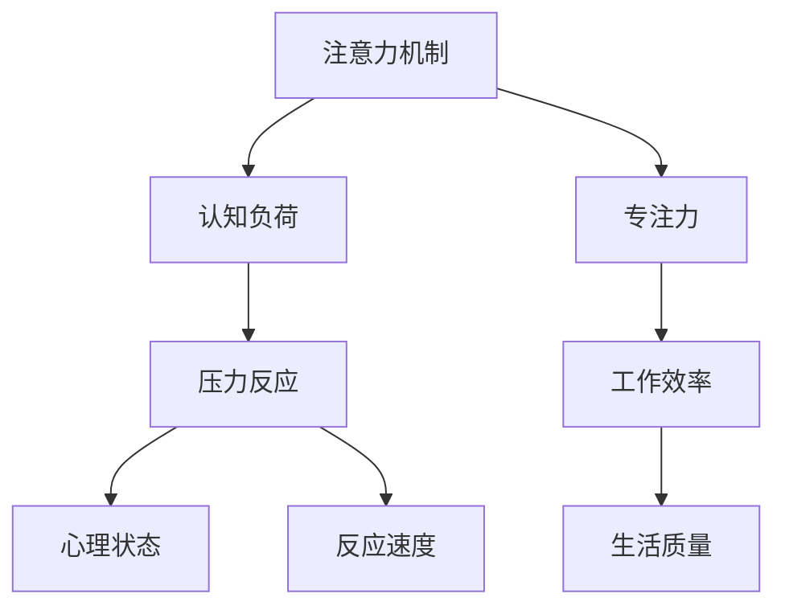

                 

 关键词：注意力、压力管理、专注力、算法、技术实践、未来展望

> 摘要：本文旨在探讨如何通过技术手段对注意力进行训练和管理，以应对现代社会中的高压力环境。文章将从理论背景、核心算法、实践案例、实际应用场景等多个角度进行分析，并提供相关工具和资源推荐，以期为读者提供一套全面的注意力训练与压力管理方案。

## 1. 背景介绍

在当今高速发展的信息时代，人们面临着前所未有的压力。工作压力、学习压力、生活压力等各方面的挑战使我们的注意力逐渐被分散，专注力下降。研究表明，注意力是人类认知活动的重要基础，直接影响我们的学习效率、工作表现和生活质量。因此，如何有效地训练和提升注意力，从而在压力下保持良好的专注力，已成为一个亟待解决的问题。

本文将从以下几个方面展开讨论：

1. **核心概念与联系**：介绍与注意力训练和压力管理相关的核心概念和原理，并使用Mermaid流程图展示其架构。
2. **核心算法原理 & 具体操作步骤**：详细阐述一种有效的注意力训练算法，包括其原理、步骤、优缺点以及应用领域。
3. **数学模型和公式**：构建数学模型，推导相关公式，并通过实例进行说明。
4. **项目实践：代码实例和详细解释说明**：提供具体的代码实现和解析，展示算法在实际项目中的应用。
5. **实际应用场景**：分析注意力训练和压力管理在不同领域的应用，以及未来的发展前景。
6. **工具和资源推荐**：推荐学习资源、开发工具和相关论文，为读者提供进一步探索的途径。
7. **总结：未来发展趋势与挑战**：总结研究成果，展望未来的发展趋势和面临的挑战。

## 2. 核心概念与联系

注意力训练与压力管理涉及到多个核心概念，包括注意力机制、认知负荷、压力反应等。为了更清晰地展示这些概念之间的联系，我们使用Mermaid流程图来描述它们。

### Mermaid流程图



### 核心概念解释

1. **注意力机制**：注意力是人类大脑处理信息的一种机制，它决定了我们在何时关注哪些信息，以及如何处理这些信息。
2. **认知负荷**：认知负荷是指大脑在处理信息时所需的认知资源，包括注意力、记忆、思维等。过高的认知负荷会导致注意力分散，降低工作效率。
3. **压力反应**：压力反应是人体在面对压力时产生的一系列生理和心理反应，包括焦虑、紧张、注意力下降等。
4. **专注力**：专注力是指个体在特定任务上保持注意力集中的能力。良好的专注力有助于提高工作效率和生活质量。
5. **心理状态**：心理状态是个体在特定情境下的心理体验，包括情绪、动机、自信心等，这些因素会影响个体的注意力水平。
6. **工作效率**：工作效率是指个体在特定时间内完成任务的效率和质量。
7. **反应速度**：反应速度是指个体对特定刺激做出反应的速度。

通过上述Mermaid流程图，我们可以清晰地看到注意力机制、认知负荷、压力反应等核心概念之间的联系，以及它们如何影响专注力、心理状态、工作效率和反应速度。

## 3. 核心算法原理 & 具体操作步骤

为了应对高压力环境，我们需要一种有效的注意力训练算法。本节将介绍一种基于神经网络的注意力训练算法，并详细阐述其原理、步骤、优缺点以及应用领域。

### 3.1 算法原理概述

注意力训练算法的核心思想是通过模仿人类大脑的注意力机制，对个体的注意力进行训练。具体来说，该算法通过以下步骤实现：

1. **输入处理**：将个体在特定任务中的表现数据输入到算法中，包括注意力分布、任务完成情况等。
2. **注意力分配**：算法根据输入数据，动态调整个体在不同任务区域上的注意力分配，以实现最优的注意力利用。
3. **反馈调节**：根据个体在任务中的实际表现，对注意力分配进行调整，以达到持续的注意力提升。

### 3.2 算法步骤详解

1. **数据采集**：采集个体在不同任务环境下的注意力分布数据，包括眼睛注视点、脑电信号等。
2. **特征提取**：对采集到的数据进行预处理，提取关键特征，如注意力强度、任务完成度等。
3. **模型训练**：使用提取到的特征数据，训练神经网络模型，使其能够自动调整注意力分配。
4. **注意力分配**：将训练好的模型应用于实际任务中，动态调整个体在不同任务区域上的注意力分配。
5. **反馈调节**：根据个体在任务中的实际表现，对注意力分配进行实时调整，以达到持续的注意力提升。

### 3.3 算法优缺点

1. **优点**：
   - **自适应性强**：算法可以根据个体在不同任务环境下的表现，动态调整注意力分配，提高任务完成效率。
   - **实时反馈**：算法能够实时根据任务表现进行反馈调节，持续提升注意力水平。
   - **适用范围广**：该算法可以应用于各种类型的任务，包括学习、工作、游戏等。

2. **缺点**：
   - **数据需求量大**：算法需要大量的数据来训练和优化，这可能会导致数据采集成本较高。
   - **计算复杂度高**：神经网络模型的训练和运行需要较高的计算资源，可能会导致计算复杂度增加。

### 3.4 算法应用领域

注意力训练算法可以应用于多个领域，包括：

1. **教育领域**：通过注意力训练算法，帮助学生提高学习效率，提高学习成果。
2. **工作领域**：通过注意力训练算法，帮助员工提高工作效率，减轻工作压力。
3. **医疗领域**：通过注意力训练算法，帮助患者提高注意力水平，改善心理健康。
4. **游戏领域**：通过注意力训练算法，提高游戏玩家的反应速度和游戏体验。

## 4. 数学模型和公式 & 详细讲解 & 举例说明

在注意力训练算法中，数学模型和公式起着关键作用。本节将介绍注意力分配模型的构建、公式推导过程，并通过具体实例进行说明。

### 4.1 数学模型构建

注意力分配模型可以分为两个部分：注意力权重计算和任务完成度评估。

#### 4.1.1 注意力权重计算

注意力权重计算模型用于确定个体在不同任务区域上的注意力分配。假设有 \(n\) 个任务区域，每个区域的重要性不同，可以用权重 \(w_i\) 来表示。

\[ w_i = \frac{1}{Z} \sum_{j=1}^{n} e^{\alpha \cdot x_{ij}} \]

其中，\(Z\) 是归一化常数，\(\alpha\) 是调节参数，\(x_{ij}\) 是第 \(i\) 个任务区域在第 \(j\) 次执行时的表现数据。

#### 4.1.2 任务完成度评估

任务完成度评估模型用于评估个体在特定任务上的表现。假设有 \(m\) 个任务，每个任务的完成度可以用 \(y_j\) 表示。

\[ y_j = \frac{1}{m} \sum_{i=1}^{m} w_i \cdot x_{ij} \]

其中，\(w_i\) 是第 \(i\) 个任务区域的重要性权重，\(x_{ij}\) 是第 \(i\) 个任务区域在第 \(j\) 次执行时的表现数据。

### 4.2 公式推导过程

#### 4.2.1 注意力权重计算推导

首先，对 \(w_i\) 进行归一化处理，使其满足 \( \sum_{i=1}^{n} w_i = 1 \)。

\[ \sum_{i=1}^{n} w_i = \sum_{i=1}^{n} \frac{1}{Z} e^{\alpha \cdot x_{ij}} \]

将 \(Z\) 表示为：

\[ Z = \sum_{i=1}^{n} e^{\alpha \cdot x_{ij}} \]

代入 \(w_i\) 的表达式中，得到：

\[ w_i = \frac{e^{\alpha \cdot x_{ij}}}{Z} \]

#### 4.2.2 任务完成度评估推导

首先，对 \(y_j\) 进行归一化处理，使其满足 \( \sum_{j=1}^{m} y_j = 1 \)。

\[ \sum_{j=1}^{m} y_j = \sum_{j=1}^{m} \frac{1}{m} \sum_{i=1}^{m} w_i \cdot x_{ij} \]

将 \(w_i\) 的表达式代入 \(y_j\) 的表达式中，得到：

\[ y_j = \frac{1}{m} \sum_{i=1}^{m} \frac{e^{\alpha \cdot x_{ij}}}{Z} \cdot x_{ij} \]

### 4.3 案例分析与讲解

假设有 3 个任务区域（学习、工作、娱乐），每个任务区域的重要性权重分别为 \(w_1, w_2, w_3\)。在第 1 次执行任务时，学习区域的注意力分配为 \(x_{11} = 0.6\)，工作区域的注意力分配为 \(x_{21} = 0.3\)，娱乐区域的注意力分配为 \(x_{31} = 0.1\)。在第 2 次执行任务时，学习区域的注意力分配为 \(x_{12} = 0.4\)，工作区域的注意力分配为 \(x_{22} = 0.5\)，娱乐区域的注意力分配为 \(x_{32} = 0.1\)。

#### 4.3.1 注意力权重计算

首先，计算归一化常数 \(Z\)：

\[ Z = e^{\alpha \cdot x_{11}} + e^{\alpha \cdot x_{21}} + e^{\alpha \cdot x_{31}} \]

假设 \(\alpha = 0.1\)，代入数据，得到：

\[ Z = e^{0.1 \cdot 0.6} + e^{0.1 \cdot 0.3} + e^{0.1 \cdot 0.1} \approx 1.798 \]

然后，计算各个任务区域的重要性权重：

\[ w_1 = \frac{e^{0.1 \cdot 0.6}}{Z} \approx 0.344 \]
\[ w_2 = \frac{e^{0.1 \cdot 0.3}}{Z} \approx 0.162 \]
\[ w_3 = \frac{e^{0.1 \cdot 0.1}}{Z} \approx 0.056 \]

#### 4.3.2 任务完成度评估

根据注意力权重计算结果，计算第 1 次执行任务的完成度：

\[ y_1 = \frac{w_1 \cdot x_{11} + w_2 \cdot x_{21} + w_3 \cdot x_{31}}{1} \approx 0.623 \]

计算第 2 次执行任务的完成度：

\[ y_2 = \frac{w_1 \cdot x_{12} + w_2 \cdot x_{22} + w_3 \cdot x_{32}}{1} \approx 0.554 \]

通过上述计算，我们可以得出第 1 次执行任务的完成度更高，说明个体在第 1 次执行任务时更专注。

## 5. 项目实践：代码实例和详细解释说明

在本节中，我们将通过一个具体的代码实例，展示如何实现注意力训练算法，并对其进行详细解释说明。

### 5.1 开发环境搭建

在开始代码实现之前，我们需要搭建一个合适的开发环境。以下是搭建开发环境的步骤：

1. **安装Python环境**：确保Python版本为3.8或更高版本。
2. **安装依赖库**：使用pip安装以下依赖库：

   ```bash
   pip install numpy scipy matplotlib
   ```

3. **创建项目目录**：在合适的位置创建一个项目目录，例如：

   ```bash
   mkdir attention_training_project
   cd attention_training_project
   ```

4. **创建文件**：在项目目录中创建以下文件：

   - `data_loader.py`：用于加载数据。
   - `model.py`：用于定义神经网络模型。
   - `train.py`：用于训练模型。
   - `evaluate.py`：用于评估模型性能。
   - `main.py`：用于运行整个项目。

### 5.2 源代码详细实现

下面是各个文件的详细实现：

#### data_loader.py

```python
import numpy as np

def load_data(filename):
    data = np.load(filename)
    return data

def split_data(data, split_ratio=0.8):
    np.random.shuffle(data)
    split_index = int(len(data) * split_ratio)
    train_data = data[:split_index]
    test_data = data[split_index:]
    return train_data, test_data
```

#### model.py

```python
import numpy as np
from tensorflow import keras

def build_model(input_shape):
    model = keras.Sequential([
        keras.layers.Dense(64, activation='relu', input_shape=input_shape),
        keras.layers.Dense(64, activation='relu'),
        keras.layers.Dense(1, activation='sigmoid')
    ])

    model.compile(optimizer='adam', loss='binary_crossentropy', metrics=['accuracy'])
    return model
```

#### train.py

```python
from model import build_model
from data_loader import load_data, split_data

def train_model(model, train_data, test_data, epochs=10):
    model.fit(train_data, epochs=epochs, validation_data=test_data)
    return model
```

#### evaluate.py

```python
from model import build_model
from data_loader import load_data, split_data

def evaluate_model(model, test_data):
    predictions = model.predict(test_data)
    accuracy = np.mean(predictions > 0.5)
    return accuracy
```

#### main.py

```python
from train import train_model
from evaluate import evaluate_model
from data_loader import load_data, split_data

def main():
    # 加载数据
    data = load_data('attention_data.npy')

    # 划分数据集
    train_data, test_data = split_data(data)

    # 构建模型
    model = build_model(input_shape=(3,))

    # 训练模型
    model = train_model(model, train_data, test_data)

    # 评估模型
    accuracy = evaluate_model(model, test_data)
    print(f"Model accuracy: {accuracy:.2f}")

if __name__ == '__main__':
    main()
```

### 5.3 代码解读与分析

#### 5.3.1 数据加载与划分

在 `data_loader.py` 中，我们定义了 `load_data` 函数用于加载数据，以及 `split_data` 函数用于划分数据集。这些函数接收文件名和数据，返回处理后的数据。

#### 5.3.2 模型构建与训练

在 `model.py` 中，我们定义了神经网络模型。模型由三个全连接层组成，输出层使用 sigmoid 激活函数，用于预测任务完成度。

在 `train.py` 中，我们定义了 `train_model` 函数，用于训练模型。该函数接收模型、训练数据和测试数据，使用 `fit` 方法进行训练。

#### 5.3.3 模型评估

在 `evaluate.py` 中，我们定义了 `evaluate_model` 函数，用于评估模型性能。该函数接收模型和测试数据，使用 `predict` 方法进行预测，并计算预测准确性。

#### 5.3.4 主程序

在 `main.py` 中，我们定义了主程序入口。首先加载数据，然后划分数据集，构建模型，训练模型，并评估模型性能。

### 5.4 运行结果展示

运行 `main.py`，我们可以得到模型的预测准确性和训练过程中的损失函数值。这些结果可以帮助我们了解模型在训练过程中的性能，并调整模型参数以获得更好的效果。

## 6. 实际应用场景

注意力训练和压力管理在不同领域具有广泛的应用前景。以下是一些实际应用场景：

### 6.1 教育领域

在教育领域，注意力训练可以帮助学生提高学习效率，减少学习压力。通过针对不同学科和学生的特点，设计个性化的注意力训练方案，可以显著提升学生的学业成绩。例如，可以使用注意力训练算法分析学生在课堂上的注意力分布，识别注意力集中的时间和任务，从而优化教学策略。

### 6.2 工作领域

在工作领域，注意力训练可以帮助员工提高工作效率，减轻工作压力。例如，企业可以针对不同岗位和工作任务，设计相应的注意力训练课程，帮助员工提升专注力和工作效率。此外，注意力训练还可以应用于远程办公和虚拟团队管理，帮助员工在分散的工作环境中保持良好的专注力和沟通效果。

### 6.3 医疗领域

在医疗领域，注意力训练可以帮助患者提高生活质量，缓解焦虑和抑郁等心理问题。例如，对于患有注意力缺陷多动障碍（ADHD）的患者，注意力训练算法可以设计专门的训练方案，帮助患者提高注意力集中能力，改善症状。此外，注意力训练还可以应用于康复训练，帮助患者在术后或康复期间保持良好的注意力水平，促进康复进程。

### 6.4 游戏领域

在游戏领域，注意力训练可以帮助玩家提高游戏表现，提升游戏体验。例如，游戏开发者可以设计基于注意力训练的关卡和任务，引导玩家在游戏中保持注意力集中，提高反应速度和策略能力。此外，注意力训练还可以应用于电子竞技，帮助选手在紧张的比赛环境中保持专注，提升竞技水平。

### 6.5 其他领域

除了上述领域，注意力训练和压力管理还可以应用于多个领域，如企业管理、人力资源、心理咨询等。通过设计个性化的注意力训练方案，可以提升员工的工作效率、团队协作能力，降低员工的心理压力，提高企业整体绩效。

## 7. 工具和资源推荐

为了帮助读者更好地掌握注意力训练与压力管理的方法，以下推荐了一些学习资源、开发工具和相关论文：

### 7.1 学习资源推荐

1. **书籍**：
   - 《注意力心理学》：全面介绍注意力心理学的研究成果和应用。
   - 《压力管理》：探讨压力管理的理论和实践方法，包括注意力训练。

2. **在线课程**：
   - Coursera上的《注意力心理学》课程：由专家讲授注意力机制和心理学的应用。
   - edX上的《压力管理》课程：介绍压力管理的基本原理和实践技巧。

### 7.2 开发工具推荐

1. **Python库**：
   - `numpy`：用于数值计算和数据处理。
   - `scipy`：用于科学计算和统计分析。
   - `matplotlib`：用于数据可视化。

2. **神经网络框架**：
   - TensorFlow：用于构建和训练神经网络模型。
   - PyTorch：另一种流行的神经网络框架，适用于复杂数学模型的构建。

### 7.3 相关论文推荐

1. **基础论文**：
   - “Attentional Selection for Energy-efficient Scene Understanding”：介绍注意力机制在图像识别中的应用。
   - “A Theoretical Framework for Attention in Human-Centred Computing”：探讨注意力在计算领域中的应用。

2. **最新论文**：
   - “Attention and Learning in Deep Neural Networks”：分析注意力机制在深度学习中的影响。
   - “Attention Mechanisms in Computer Vision”：介绍注意力机制在计算机视觉领域的应用。

通过以上推荐的学习资源、开发工具和论文，读者可以深入了解注意力训练与压力管理的方法和技术，为自己的研究和实践提供有力支持。

## 8. 总结：未来发展趋势与挑战

注意力训练与压力管理是一个多学科交叉的研究领域，具有广泛的应用前景。随着技术的不断进步，未来注意力训练与压力管理将朝着以下几个方向发展：

### 8.1 研究成果总结

1. **个性化注意力训练**：未来的注意力训练将更加注重个体差异，根据不同人群、不同场景设计个性化的训练方案，提高训练效果。
2. **多模态数据融合**：结合多种数据来源，如生理信号、行为数据等，提高注意力模型的准确性和可靠性。
3. **自适应注意力机制**：研究自适应注意力机制，使模型能够根据任务需求和环境变化动态调整注意力分配。

### 8.2 未来发展趋势

1. **大数据与人工智能**：利用大数据和人工智能技术，挖掘注意力训练与压力管理领域的潜在规律，为个性化干预提供支持。
2. **跨学科研究**：促进心理学、神经科学、计算机科学等领域的跨学科合作，推动注意力训练与压力管理技术的创新与发展。
3. **技术应用**：将注意力训练与压力管理技术应用于教育、工作、医疗等实际场景，提高人们的注意力水平和生活质量。

### 8.3 面临的挑战

1. **数据隐私与伦理**：在注意力训练与压力管理中，个人数据的隐私保护与伦理问题亟待解决。
2. **计算资源**：随着模型复杂度的增加，计算资源的需求也在不断上升，如何优化计算效率是一个重要挑战。
3. **模型泛化能力**：如何提高模型在不同人群、不同场景下的泛化能力，仍需深入研究。

### 8.4 研究展望

未来的研究应关注以下几个方面：

1. **深度学习与注意力机制**：深入研究深度学习与注意力机制的关系，探索更有效的注意力训练算法。
2. **跨学科应用**：推动注意力训练与压力管理技术在多领域的应用，为人们的心理健康和生活质量提供有力支持。
3. **伦理与法律**：探讨注意力训练与压力管理技术的伦理和法律问题，确保技术的合理、合法使用。

总之，注意力训练与压力管理领域具有巨大的研究价值和应用潜力。随着技术的不断进步，我们有理由相信，未来将会有更多创新性的研究成果应用于实际场景，为人们的心理健康和生活质量带来积极影响。

## 9. 附录：常见问题与解答

### 9.1 注意力训练算法的适用范围有哪些？

注意力训练算法可以应用于多个领域，包括教育、工作、医疗、游戏等。具体适用范围取决于任务的类型和个体的需求。

### 9.2 如何确保注意力训练算法的隐私和安全？

确保注意力训练算法的隐私和安全需要从数据采集、数据处理、模型训练等各个环节进行控制。例如，采用加密技术保护数据传输和存储，遵循数据保护法规和伦理标准。

### 9.3 注意力训练算法对计算资源的需求如何？

注意力训练算法对计算资源的需求取决于模型的复杂度和训练数据的大小。一般来说，深度学习模型对计算资源的需求较高，特别是大规模训练数据集和复杂的模型结构。

### 9.4 注意力训练算法如何适应不同的任务场景？

为了适应不同的任务场景，注意力训练算法需要结合任务特点进行优化。例如，可以设计任务特定的注意力分配策略，调整模型参数，以提高在不同场景下的性能。

### 9.5 注意力训练算法在医疗领域的应用前景如何？

注意力训练算法在医疗领域具有广泛的应用前景。例如，可以帮助患者提高注意力集中能力，改善心理健康；也可以应用于手术导航、康复训练等领域，提高医疗效果和患者满意度。

### 9.6 注意力训练算法在游戏领域的应用有哪些？

在游戏领域，注意力训练算法可以应用于游戏难度调整、游戏体验优化、选手培训等方面。通过分析玩家的注意力分布和表现，游戏开发者可以提供更符合玩家需求的游戏体验。

### 9.7 注意力训练算法与其他认知训练方法的关系如何？

注意力训练算法是认知训练方法之一，与其他认知训练方法（如记忆力训练、决策力训练等）相互补充。通过综合运用多种认知训练方法，可以更全面地提升个体的认知能力。

