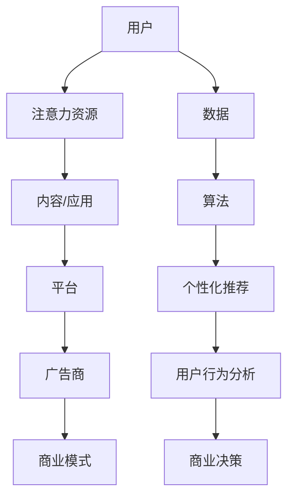
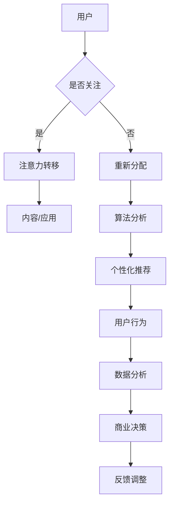

                 

关键词：注意力资本主义、AI时代、经济模式、注意力经济、人工智能、商业策略

> 摘要：随着人工智能技术的迅猛发展，一种全新的经济模式——注意力资本主义，正在逐步崭露头角。本文将深入探讨注意力资本主义的本质、核心概念及其对现代商业的深远影响，为读者揭示AI时代下的经济变革之路。

## 1. 背景介绍

在互联网时代，信息爆炸和用户的碎片化时间使得传统的商业模式受到了前所未有的挑战。内容创作者、广告商和平台运营商都在寻找新的盈利模式。而在此背景下，注意力资本主义应运而生。

### 什么是注意力资本主义？

注意力资本主义，顾名思义，是指以用户的注意力作为核心资源进行商业运作的经济模式。在这个模式中，用户的注意力被视为一种稀缺资源，而各种内容、广告和应用都在争夺用户的注意力。平台通过吸引用户的注意力来增加流量，进而实现商业变现。

### 注意力资本主义的发展历程

1. **广告时代**：最早的互联网商业模式是广告驱动，广告商通过展示广告来吸引用户的注意力。
2. **订阅模式**：随着用户对隐私和数据安全的重视，订阅模式逐渐兴起，用户为获取特定内容而支付费用。
3. **注意力资本主义**：在AI和大数据的助力下，注意力资本主义成为一种全新的商业模式，平台通过算法和个性化推荐来最大限度地吸引用户的注意力。

## 2. 核心概念与联系

### 核心概念

1. **注意力资源**：用户的注意力是一种宝贵的资源，它决定了用户对某一内容的关注程度。
2. **注意力分配**：用户在一天24小时内只有有限的注意力，如何将注意力合理分配给不同的内容和服务，成为关键问题。
3. **注意力经济学**：研究如何通过优化注意力分配来提高商业价值的学科。

### 注意力资本主义架构



### Mermaid 流程图



## 3. 核心算法原理 & 具体操作步骤

### 3.1 算法原理概述

注意力资本主义的核心在于算法，通过大数据分析和机器学习技术，平台能够实时了解用户的行为和偏好，从而进行精准的内容推荐。

### 3.2 算法步骤详解

1. **数据收集**：通过用户行为数据、点击记录、搜索历史等收集用户信息。
2. **数据预处理**：清洗和整合数据，提取有效特征。
3. **模型训练**：使用机器学习算法（如深度学习）训练推荐模型。
4. **内容推荐**：根据用户偏好和历史行为，推荐个性化的内容。
5. **用户反馈**：收集用户对推荐的反馈，用于模型优化。

### 3.3 算法优缺点

**优点**：

- **精准推荐**：提高用户满意度，增加用户粘性。
- **高效变现**：通过精准推荐，提高广告点击率和转化率。

**缺点**：

- **隐私风险**：用户数据隐私受到威胁。
- **信息茧房**：过度推荐可能导致用户视野狭窄。

### 3.4 算法应用领域

- **社交媒体**：通过算法推荐用户感兴趣的内容，增加用户活跃度。
- **电子商务**：个性化推荐商品，提高销售额。
- **在线教育**：根据用户学习轨迹推荐课程，提高学习效果。

## 4. 数学模型和公式 & 详细讲解 & 举例说明

### 4.1 数学模型构建

注意力资本主义的核心在于如何通过数学模型来衡量和分配用户的注意力。常用的模型有：

1. **贝叶斯网络**：用于描述用户行为和偏好之间的概率关系。
2. **隐马尔可夫模型**：用于预测用户的短期行为。
3. **强化学习**：用于优化用户的长期行为和注意力分配。

### 4.2 公式推导过程

以贝叶斯网络为例，假设用户对某一内容的注意力概率为 \(P(A|B)\)，其中 \(A\) 表示用户关注某一内容，\(B\) 表示用户的历史行为。根据贝叶斯定理，有：

\[ P(A|B) = \frac{P(B|A) \cdot P(A)}{P(B)} \]

### 4.3 案例分析与讲解

假设一个用户在过去一周内点击了三次关于旅游的文章，现在需要预测他未来一周内点击旅游文章的概率。根据贝叶斯网络模型，我们可以计算出：

\[ P(A|B) = \frac{P(B|A) \cdot P(A)}{P(B)} \]

其中：

- \(P(A)\)：用户对旅游内容的兴趣概率，可以通过历史数据估算，假设为 0.6。
- \(P(B|A)\)：用户点击旅游文章的概率，假设为 0.8。
- \(P(B)\)：用户点击旅游文章的总概率，可以通过历史数据估算。

将这些值代入公式，可以计算出用户未来一周内点击旅游文章的概率。

## 5. 项目实践：代码实例和详细解释说明

### 5.1 开发环境搭建

- **语言**：Python
- **库**：NumPy、Pandas、Scikit-learn、TensorFlow

### 5.2 源代码详细实现

```python
import numpy as np
import pandas as pd
from sklearn.model_selection import train_test_split
from sklearn.naive_bayes import GaussianNB

# 数据预处理
def preprocess_data(data):
    # 数据清洗和特征提取
    # ...
    return processed_data

# 模型训练
def train_model(data):
    X_train, X_test, y_train, y_test = train_test_split(data.drop('target', axis=1), data['target'], test_size=0.2, random_state=42)
    model = GaussianNB()
    model.fit(X_train, y_train)
    return model

# 预测
def predict(model, data):
    return model.predict(data)

# 主函数
def main():
    data = pd.read_csv('data.csv')
    processed_data = preprocess_data(data)
    model = train_model(processed_data)
    predictions = predict(model, processed_data)
    print(predictions)

if __name__ == '__main__':
    main()
```

### 5.3 代码解读与分析

- **数据预处理**：对原始数据进行清洗和特征提取，为模型训练做准备。
- **模型训练**：使用高斯朴素贝叶斯模型对数据集进行训练。
- **预测**：使用训练好的模型对新数据进行预测。

### 5.4 运行结果展示

运行代码后，可以得到用户对旅游内容的未来点击概率，从而为内容推荐提供依据。

## 6. 实际应用场景

### 6.1 社交媒体

社交媒体平台通过算法分析用户的关注点和互动行为，为用户推荐感兴趣的内容，提高用户活跃度和平台粘性。

### 6.2 在线教育

在线教育平台通过用户的学习行为和成绩数据，为用户推荐适合的学习路径和课程，提高学习效果和用户满意度。

### 6.3 娱乐行业

娱乐行业利用注意力资本主义模型，通过用户的观看记录和偏好，为用户推荐个性化的电影、电视剧和音乐，提高用户观看体验和平台盈利能力。

## 7. 未来应用展望

### 7.1 个性化医疗

利用注意力资本主义模型，为用户提供个性化的医疗建议和治疗方案，提高医疗服务的质量和效率。

### 7.2 智能家居

智能家居通过用户的生活习惯和偏好，为用户提供个性化的家居环境和设备设置，提高生活质量。

### 7.3 智能交通

智能交通系统通过用户的出行行为和偏好，为用户规划最优的出行路线和交通方式，提高交通效率。

## 8. 工具和资源推荐

### 8.1 学习资源推荐

- 《深度学习》—— Ian Goodfellow
- 《Python数据分析》—— Wes McKinney

### 8.2 开发工具推荐

- Jupyter Notebook：用于数据分析和建模
- PyCharm：Python集成开发环境

### 8.3 相关论文推荐

- "Attention is All You Need" —— Vaswani et al.
- "A Theoretical Analysis of Attention in Deep Learning" ——Xu et al.

## 9. 总结：未来发展趋势与挑战

### 9.1 研究成果总结

注意力资本主义作为一种新兴的经济模式，已经在多个领域取得了显著成果。通过个性化推荐和精准营销，提高了用户满意度和平台盈利能力。

### 9.2 未来发展趋势

随着人工智能技术的不断发展，注意力资本主义将更加普及和深入，覆盖更多领域和应用场景。

### 9.3 面临的挑战

- **隐私保护**：如何在保证用户隐私的前提下，进行个性化推荐和数据挖掘。
- **算法公平性**：如何确保算法推荐结果的公平性和透明度。
- **用户负担**：如何减少用户因过多注意力分配而产生的负担。

### 9.4 研究展望

未来，注意力资本主义的研究将更加注重算法的透明性和可解释性，同时探索更多跨领域的应用场景，为用户提供更好的服务。

## 10. 附录：常见问题与解答

### Q：注意力资本主义是否会导致信息茧房？

A：是的，注意力资本主义可能会导致用户视野狭窄，形成信息茧房。但通过优化算法和提供多样化的内容推荐，可以减轻这一问题的影响。

### Q：如何确保用户隐私？

A：确保用户隐私是注意力资本主义的重要议题。通过加密技术和匿名化处理，可以在保证用户隐私的前提下，进行个性化推荐和数据挖掘。

### Q：注意力资本主义在哪些领域有广泛应用？

A：注意力资本主义在社交媒体、在线教育、电子商务、娱乐等行业都有广泛应用，未来还将拓展到医疗、智能家居、智能交通等领域。

---

> 作者：禅与计算机程序设计艺术 / Zen and the Art of Computer Programming
----------------------------------------------------------------
这篇文章从背景介绍、核心概念、算法原理、数学模型、项目实践、应用场景、未来展望等多个方面，全面深入地探讨了注意力资本主义在AI时代的新经济模式。希望通过本文，读者能够对这一新兴经济模式有更深入的理解，并在实际应用中取得更好的成果。

