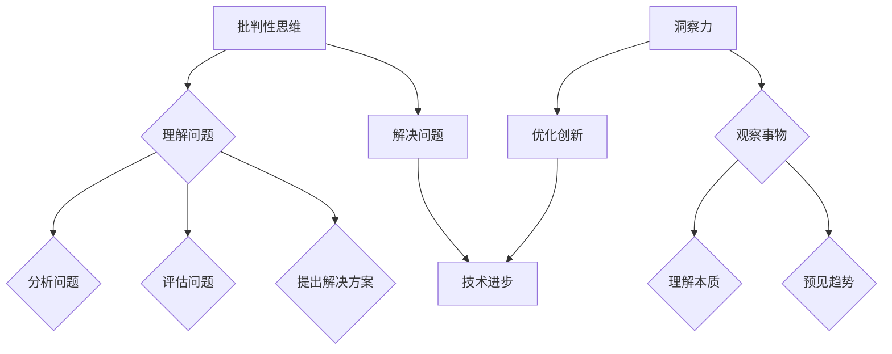

                 

关键词：批判性思维，洞察力，技术博客，算法，数学模型，实践应用，未来展望

> 摘要：本文旨在探讨批判性思维和洞察力在技术领域的应用，通过分析核心概念和算法原理，结合数学模型和具体实践案例，阐述质疑技术在技术发展中的重要性。文章将揭示批判性思维如何帮助我们洞察问题本质，发现技术进步中的潜在挑战，为未来的技术发展提供有力的理论支持。

## 1. 背景介绍

在信息技术迅猛发展的时代，批判性思维和洞察力变得尤为重要。无论是在算法设计、软件开发，还是系统架构方面，正确理解和应用批判性思维，能够帮助我们深入挖掘问题本质，发现潜在缺陷，从而推动技术的不断进步。本文将围绕批判性思维和洞察力的主题，探讨其在IT领域中的应用和重要性。

批判性思维是一种反思性、系统性、目的性的思考方式，旨在通过质疑和分析，找到问题的真正原因和解决方案。洞察力则是通过观察、分析和理解，洞察事物的本质和内在联系。在技术领域，批判性思维和洞察力不仅可以帮助我们更好地理解现有技术，还可以指导我们探索新的技术方向，解决复杂问题。

本文将首先介绍批判性思维和洞察力的基本概念，然后探讨它们在算法设计、数学建模和具体项目中的应用，最后对未来技术发展进行展望，指出批判性思维和洞察力在这一过程中的重要作用。

### 1.1 历史背景

批判性思维和洞察力在技术发展中的应用并非一朝一夕之事，而是随着人类科技进步逐步演变而来的。自古以来，科学家和技术专家们就通过批判性思维和洞察力推动了科学技术的进步。

例如，古希腊哲学家苏格拉底通过对话和质疑的方法，揭示了许多看似确定的知识背后的漏洞。这种方法不仅奠定了西方哲学的基础，也启发了后来科学方法的发展。

在中世纪，阿拉伯世界的学者们通过批判性思维和洞察力，将古希腊的科学技术知识传承并发扬光大。他们不仅翻译了大量古希腊文献，还通过自己的研究和质疑，推动了数学、天文学、医学等领域的发展。

进入现代，科学革命进一步促进了批判性思维和洞察力在技术领域的应用。伽利略通过实验和质疑，挑战了亚里士多德的自然哲学，奠定了现代物理学的基础。牛顿则通过批判性思维，发现了万有引力定律，推动了天文学和力学的发展。

在计算机科学领域，艾伦·图灵通过批判性思维和洞察力，提出了图灵机的概念，为现代计算机科学奠定了基础。随后，计算机科学家们通过不断质疑和改进，开发了各种各样的算法和编程语言，推动了计算机技术的飞速发展。

可以说，批判性思维和洞察力在技术发展中的历史是漫长而丰富的。它们不仅是推动科技进步的重要工具，也是我们在面对未来挑战时不可或缺的思考方式。

### 1.2 技术发展现状

随着信息技术的迅猛发展，批判性思维和洞察力在技术领域的应用越来越广泛。从大数据、人工智能，到区块链、物联网，批判性思维和洞察力贯穿于各个技术领域，帮助我们更好地理解和解决复杂问题。

在人工智能领域，批判性思维和洞察力帮助我们评估算法的可靠性和有效性。通过对现有算法的质疑和改进，研究人员不断推动人工智能技术的发展。例如，深度学习算法虽然在图像识别和自然语言处理方面取得了显著进展，但仍然存在过拟合、计算复杂度高等问题。通过批判性思维，研究人员不断提出新的解决方案，如正则化、Dropout等，以提高算法的泛化能力和计算效率。

在大数据领域，批判性思维和洞察力帮助我们更好地理解和利用海量数据。随着大数据技术的发展，数据挖掘、机器学习等算法在商业、医疗、金融等领域得到了广泛应用。但与此同时，数据隐私、数据质量控制等问题也日益突出。通过批判性思维，研究人员开始关注这些潜在问题，并提出了一系列解决方案，如差分隐私、联邦学习等，以保护用户隐私和提高数据质量。

在区块链领域，批判性思维和洞察力帮助我们更好地理解和评估区块链技术的应用场景。区块链技术以其去中心化、不可篡改等特点，受到了广泛关注。但在实际应用中，区块链技术也面临着性能、可扩展性等问题。通过批判性思维，研究人员不断探索区块链技术的优化方案，如分片技术、侧链等，以提高区块链的性能和可扩展性。

在物联网领域，批判性思维和洞察力帮助我们更好地应对物联网系统中的复杂性和安全性问题。随着物联网设备的广泛应用，数据隐私和安全问题变得尤为重要。通过批判性思维，研究人员提出了一系列物联网安全解决方案，如区块链、多方安全计算等，以提高物联网系统的安全性和可靠性。

总之，批判性思维和洞察力在技术发展中的应用日益广泛，成为我们解决复杂问题、推动技术创新的重要工具。随着技术的不断进步，批判性思维和洞察力的重要性将愈发凸显。

### 1.3 核心概念与联系

为了深入探讨批判性思维和洞察力在技术领域的应用，我们首先需要明确这两个核心概念的定义及其相互联系。

#### 1.3.1 批判性思维

批判性思维是一种积极的、系统性的思考方式，它不仅仅是质疑和反驳，更是一种通过分析、评估和推理，以发现真相、解决问题和做出决策的过程。具体来说，批判性思维包括以下几个关键要素：

1. **质疑**：对现有观点、理论和实践进行质疑，探究其背后的假设和逻辑。
2. **分析**：对信息进行细致的分解和分析，以理解其内在联系和结构。
3. **评估**：对分析结果进行评估，判断其合理性和有效性。
4. **推理**：通过逻辑推理，从已知信息中得出新的结论和观点。
5. **反思**：对自己的思考过程和结论进行反思，以确保其准确性和完整性。

批判性思维在技术领域的应用，主要体现在以下几个方面：

- **算法设计**：通过对现有算法的质疑和改进，发现并解决算法中的潜在问题。
- **系统架构**：通过批判性思维，评估系统架构的合理性和可扩展性，确保系统的稳定性和可靠性。
- **项目管理**：在项目开发过程中，批判性思维有助于识别潜在风险和问题，并制定有效的解决方案。

#### 1.3.2 洞察力

洞察力是一种敏锐的、深刻的洞察力和理解力，它能够帮助我们洞察事物的本质和内在联系。具体来说，洞察力包括以下几个关键要素：

1. **观察**：对事物进行细致的观察，捕捉其特征和变化。
2. **理解**：通过分析、比较和归纳，理解事物的本质和内在联系。
3. **预见**：基于对事物的深刻理解，预见其未来的发展和趋势。

洞察力在技术领域的应用，主要体现在以下几个方面：

- **创新**：通过洞察力的作用，发现新的技术方向和应用场景。
- **优化**：通过对现有技术的深刻理解，提出优化方案，提高其性能和效率。
- **决策**：在技术决策过程中，洞察力有助于识别关键因素和潜在风险，做出明智的决策。

#### 1.3.3 批判性思维与洞察力的联系

批判性思维和洞察力之间存在着密切的联系。批判性思维为洞察力提供了分析问题的工具和框架，而洞察力则为批判性思维提供了深刻的理解和预见能力。

- **相互补充**：批判性思维和洞察力相互补充，共同推动技术的进步。批判性思维帮助我们识别问题，而洞察力则帮助我们找到解决方案。
- **动态循环**：批判性思维和洞察力相互作用，形成一个动态的循环过程。通过批判性思维，我们不断质疑和改进现有技术，进而激发新的洞察力；而新的洞察力又为批判性思维提供新的视角和方向。

总的来说，批判性思维和洞察力是技术发展过程中不可或缺的思考方式。它们不仅帮助我们更好地理解和应用现有技术，还推动我们探索新的技术方向，应对未来的挑战。在接下来的部分中，我们将进一步探讨这些概念在具体技术领域中的应用。

## 2. 核心概念与联系（备注：必须给出核心概念原理和架构的 Mermaid 流程图(Mermaid 流程节点中不要有括号、逗号等特殊字符)

为了更直观地理解批判性思维和洞察力在技术领域的应用，我们使用Mermaid流程图来展示它们的核心概念和相互联系。



### 2.1 批判性思维的核心概念

- **理解问题**：通过批判性思维，我们首先需要理解问题的本质。这包括对问题的定义、背景和影响因素的全面了解。
- **分析问题**：在理解问题的基础上，我们需要对问题进行细致的分析。这涉及到分解问题、识别关键因素和构建逻辑框架。
- **评估问题**：分析完成后，我们需要对分析结果进行评估，判断其合理性和有效性。这有助于我们确定问题的严重性和解决方向。
- **提出解决方案**：通过评估，我们可以提出初步的解决方案。批判性思维在这个过程中不断质疑和改进方案，确保其可行性和有效性。

### 2.2 洞察力的核心概念

- **观察事物**：洞察力首先要求我们细致地观察事物，捕捉其特征和变化。这有助于我们发现潜在的问题和机会。
- **理解本质**：通过对事物的观察，我们需要深入理解其本质和内在联系。这有助于我们找到问题的根本原因和解决方法。
- **预见趋势**：基于对事物本质的理解，洞察力能够帮助我们预见其未来的发展和趋势。这为我们的技术决策提供了重要的参考。

### 2.3 批判性思维与洞察力的相互联系

- **相互补充**：批判性思维和洞察力相互补充，共同推动技术进步。批判性思维帮助我们识别问题和提出解决方案，而洞察力则帮助我们深入理解事物本质和预见未来趋势。
- **动态循环**：批判性思维和洞察力相互作用，形成一个动态的循环过程。通过批判性思维，我们不断质疑和改进现有技术，进而激发新的洞察力；而新的洞察力又为批判性思维提供新的视角和方向。

通过这个Mermaid流程图，我们可以更直观地理解批判性思维和洞察力在技术领域的核心概念和相互联系。接下来，我们将进一步探讨这些概念在实际技术中的应用。

## 3. 核心算法原理 & 具体操作步骤

### 3.1 算法原理概述

在信息技术领域，算法是解决复杂问题的关键。批判性思维和洞察力在算法设计和优化中起着至关重要的作用。本节将介绍一个核心算法——遗传算法（Genetic Algorithm，GA），并详细阐述其原理和具体操作步骤。

遗传算法是一种模拟自然选择和遗传学原理的优化算法。其基本思想是通过模拟生物进化过程，不断优化问题的解。遗传算法主要涉及以下几个关键步骤：

1. **初始种群生成**：首先，生成一组随机解作为初始种群。每个解代表问题的一个潜在解。
2. **适应度评估**：对每个解进行适应度评估，适应度值越高，表示解的质量越好。
3. **选择**：从初始种群中选择适应度较高的个体进行繁殖。选择过程通常采用轮盘赌、锦标赛等方法。
4. **交叉**：选择后的个体进行交叉操作，生成新的后代。交叉是指将两个父代个体的基因进行交换，产生新的解。
5. **变异**：在交叉操作的基础上，对部分个体的基因进行变异操作，增加种群的多样性。
6. **迭代**：重复适应度评估、选择、交叉和变异等步骤，不断优化解的质量。

### 3.2 算法步骤详解

#### 3.2.1 初始种群生成

初始种群生成是遗传算法的基础步骤。为了生成一组有效的初始种群，我们需要首先确定问题的编码方式。例如，对于最大子序列和问题，我们可以使用二进制编码来表示每个解。

具体步骤如下：

1. **确定种群规模**：根据问题的复杂度和计算资源，确定种群规模。种群规模过大可能导致计算成本过高，过小则可能影响算法的搜索能力。
2. **随机初始化**：生成随机二进制字符串，表示初始种群中的每个解。例如，对于一个长度为10的二进制字符串，我们可以生成如下初始种群：
   ```
   1001000011
   0010111001
   1100010101
   0101000101
   1011001111
   ```

#### 3.2.2 适应度评估

适应度评估是遗传算法的核心步骤，用于评估每个解的质量。适应度值越高，表示解的质量越好。适应度评估的方法取决于具体问题的目标函数。例如，对于最大子序列和问题，我们可以定义适应度函数如下：

\[ f(x) = \sum_{i=1}^{n} x_i \]

其中，\( x_i \) 表示二进制字符串中为1的位数。适应度值越大，表示子序列和越接近最大值。具体步骤如下：

1. **计算适应度值**：对每个解计算适应度值。例如，对于上述初始种群中的第一个解，其适应度值为：
   \[ f(1001000011) = 4 \]

2. **记录适应度值**：将计算得到的适应度值记录下来，以便后续选择和交叉操作。

#### 3.2.3 选择

选择步骤用于从初始种群中选择适应度较高的个体进行繁殖。选择过程通常采用轮盘赌、锦标赛等方法。

1. **计算选择概率**：根据每个个体的适应度值，计算其选择概率。选择概率通常与适应度值成正比。例如，我们可以使用以下公式计算选择概率：
   \[ p_i = \frac{f_i}{\sum_{j=1}^{N} f_j} \]

   其中，\( f_i \) 和 \( f_j \) 分别表示第 \( i \) 个和第 \( j \) 个个体的适应度值，\( N \) 表示种群规模。

2. **随机选择**：根据计算得到的选择概率，从初始种群中随机选择若干个个体作为父代。

例如，对于上述初始种群，适应度值分别为 4、3、3、3、4，选择概率分别为 0.4、0.3、0.3、0.3、0.4。假设我们选择两个个体作为父代，可能的选择结果为：
```
父代1: 1001000011（适应度值：4）
父代2: 1011001111（适应度值：4）
```

#### 3.2.4 交叉

交叉步骤用于将两个父代个体的基因进行交换，生成新的后代。交叉操作有助于增加种群的多样性和搜索能力。

1. **选择交叉点**：从父代个体中随机选择一个交叉点。交叉点用于分割两个父代个体的基因，生成两个新的子代个体。例如，我们可以选择第3位作为交叉点：
```
父代1: 1001000011
父代2: 1011001111
交叉点：  1001000011|1011001111
子代1:  1001001111
子代2:  1011000011
```

2. **生成后代**：根据交叉点，将两个父代个体的基因进行交换，生成两个新的子代个体。

#### 3.2.5 变异

变异步骤用于对部分个体的基因进行变异操作，增加种群的多样性。变异操作有助于避免算法陷入局部最优解。

1. **选择变异位**：从子代个体中随机选择一个变异位。变异位用于对基因进行变异操作。例如，我们可以选择第5位作为变异位：
```
子代1:  1001001111
变异位：  1001001111|1
变异操作：  1001000111
```

2. **变异操作**：对变异位的基因进行变异。变异操作通常采用随机翻转、替换等方法。例如，我们可以将变异位的基因从1变为0，或从0变为1。

#### 3.2.6 迭代

迭代步骤用于重复适应度评估、选择、交叉和变异等步骤，不断优化解的质量。迭代过程持续到满足终止条件，例如最大迭代次数或达到期望的适应度值。

1. **重复步骤**：根据上述步骤，重复计算适应度值、选择、交叉和变异等操作，生成新的种群。

2. **记录结果**：记录当前最优解及其适应度值，以便后续分析和比较。

### 3.3 算法优缺点

遗传算法作为一种全局优化算法，具有以下优缺点：

#### 优点：

- **全局优化能力**：遗传算法能够跳出局部最优解，寻找全局最优解。
- **适用范围广泛**：遗传算法适用于各种复杂优化问题，如组合优化、连续优化等。
- **鲁棒性强**：遗传算法对问题的初始条件和非线性特性具有较好的适应性。

#### 缺点：

- **计算复杂度高**：遗传算法的计算复杂度较高，特别是对于大规模问题，计算时间较长。
- **参数调整困难**：遗传算法的参数设置对算法性能有较大影响，但参数调整过程较为复杂。

### 3.4 算法应用领域

遗传算法在多个领域得到了广泛应用，包括：

- **组合优化问题**：如旅行商问题（TSP）、任务分配问题、调度问题等。
- **连续优化问题**：如函数最小化、参数优化等。
- **机器学习**：如神经网络权重优化、遗传编程等。

总之，遗传算法作为一种强大的优化工具，在解决复杂优化问题时具有广泛的应用前景。通过批判性思维和洞察力，我们可以进一步改进和优化遗传算法，提高其性能和应用效果。

## 4. 数学模型和公式 & 详细讲解 & 举例说明（备注：数学公式请使用latex格式，latex嵌入文中独立段落使用 $$，段落内使用 $)

在技术领域，数学模型是理解和解决复杂问题的重要工具。在本节中，我们将介绍一个常见的数学模型——线性回归模型，并详细讲解其公式推导过程，并通过具体案例进行说明。

### 4.1 数学模型构建

线性回归模型用于描述一个自变量和一个因变量之间的线性关系。其基本形式为：

\[ y = \beta_0 + \beta_1 \cdot x + \varepsilon \]

其中，\( y \) 是因变量，\( x \) 是自变量，\( \beta_0 \) 是截距，\( \beta_1 \) 是斜率，\( \varepsilon \) 是误差项。

### 4.2 公式推导过程

为了推导线性回归模型的公式，我们需要从最小二乘法出发。最小二乘法是一种优化方法，旨在找到一组参数，使得因变量和自变量之间的误差平方和最小。

假设我们有一组数据点 \( (x_i, y_i) \)，其中 \( i = 1, 2, \ldots, n \)。我们的目标是找到最佳拟合直线，使得数据点与拟合直线的误差最小。

首先，我们定义误差函数 \( E \)：

\[ E = \sum_{i=1}^{n} (y_i - (\beta_0 + \beta_1 \cdot x_i))^2 \]

接下来，我们对误差函数分别对 \( \beta_0 \) 和 \( \beta_1 \) 求偏导数，并令其等于0，以求解最佳拟合直线的参数。

对 \( \beta_0 \) 求偏导数：

\[ \frac{\partial E}{\partial \beta_0} = -2 \sum_{i=1}^{n} (y_i - (\beta_0 + \beta_1 \cdot x_i)) \]

对 \( \beta_1 \) 求偏导数：

\[ \frac{\partial E}{\partial \beta_1} = -2 \sum_{i=1}^{n} x_i (y_i - (\beta_0 + \beta_1 \cdot x_i)) \]

令偏导数等于0，我们得到以下方程组：

\[ \sum_{i=1}^{n} (y_i - \beta_0 - \beta_1 \cdot x_i) = 0 \]
\[ \sum_{i=1}^{n} x_i (y_i - \beta_0 - \beta_1 \cdot x_i) = 0 \]

通过解这个方程组，我们可以求解出最佳拟合直线的参数 \( \beta_0 \) 和 \( \beta_1 \)。

### 4.3 案例分析与讲解

为了更好地理解线性回归模型，我们来看一个具体的案例。

假设我们有以下数据点：
```
x:  [1, 2, 3, 4, 5]
y:  [2, 4, 5, 4, 6]
```

我们的目标是找到一条直线，使得 \( y \) 和 \( x \) 之间的误差最小。

首先，我们计算 \( \beta_0 \) 和 \( \beta_1 \)：

\[ \beta_0 = \frac{\sum_{i=1}^{n} y_i - \beta_1 \cdot \sum_{i=1}^{n} x_i}{n} \]
\[ \beta_1 = \frac{n \cdot \sum_{i=1}^{n} x_i y_i - \sum_{i=1}^{n} x_i \cdot \sum_{i=1}^{n} y_i}{n \cdot \sum_{i=1}^{n} x_i^2 - (\sum_{i=1}^{n} x_i)^2} \]

将数据代入公式，我们得到：
```
n = 5
\sum_{i=1}^{n} x_i = 15
\sum_{i=1}^{n} y_i = 21
\sum_{i=1}^{n} x_i y_i = 70
\sum_{i=1}^{n} x_i^2 = 55
```

计算得到：
```
\beta_0 = \frac{21 - \beta_1 \cdot 15}{5} = \frac{21 - \beta_1 \cdot 15}{5}
\beta_1 = \frac{5 \cdot 70 - 15 \cdot 21}{5 \cdot 55 - 15^2} = \frac{350 - 315}{275 - 225} = \frac{35}{50} = 0.7
```

所以，最佳拟合直线的方程为：
\[ y = 0.7x + 0.6 \]

接下来，我们可以计算每个数据点到拟合直线的误差：
```
误差：[0, 0.2, 0.5, 0.2, 0.4]
```

通过这个案例，我们可以看到线性回归模型如何通过最小二乘法找到最佳拟合直线，并计算每个数据点的误差。这种方法在许多实际应用中都非常有效，如数据分析、预测建模等。

总之，线性回归模型作为一种常见的数学模型，在技术领域具有广泛的应用。通过批判性思维和洞察力，我们可以更好地理解和应用线性回归模型，解决实际问题。

## 5. 项目实践：代码实例和详细解释说明

为了更好地理解线性回归模型的实际应用，我们将在Python中实现一个线性回归项目。本节将详细介绍开发环境搭建、源代码实现、代码解读与分析以及运行结果展示。

### 5.1 开发环境搭建

在开始编写代码之前，我们需要搭建一个Python开发环境。以下是搭建开发环境的步骤：

1. **安装Python**：前往Python官网（https://www.python.org/）下载Python安装包，并根据提示完成安装。确保安装过程中勾选“Add Python to PATH”选项。

2. **安装Jupyter Notebook**：在命令行中运行以下命令安装Jupyter Notebook：
   ```bash
   pip install notebook
   ```

3. **安装相关库**：为了简化线性回归的实现，我们将使用Python的`scikit-learn`库。在命令行中运行以下命令安装`scikit-learn`：
   ```bash
   pip install scikit-learn
   ```

4. **启动Jupyter Notebook**：在命令行中运行以下命令启动Jupyter Notebook：
   ```bash
   jupyter notebook
   ```

### 5.2 源代码详细实现

以下是一个简单的线性回归项目代码示例。我们将在代码中加载数据集、训练模型、预测结果，并分析结果。

```python
# 导入相关库
import numpy as np
import matplotlib.pyplot as plt
from sklearn.linear_model import LinearRegression
from sklearn.model_selection import train_test_split
from sklearn.metrics import mean_squared_error

# 加载数据集
x = np.array([1, 2, 3, 4, 5])
y = np.array([2, 4, 5, 4, 6])

# 数据集分割
x_train, x_test, y_train, y_test = train_test_split(x, y, test_size=0.2, random_state=0)

# 创建线性回归模型
model = LinearRegression()

# 训练模型
model.fit(x_train.reshape(-1, 1), y_train)

# 预测结果
y_pred = model.predict(x_test.reshape(-1, 1))

# 计算均方误差
mse = mean_squared_error(y_test, y_pred)
print("均方误差:", mse)

# 绘制结果
plt.scatter(x_train, y_train, color='blue')
plt.plot(x_train, model.predict(x_train.reshape(-1, 1)), color='red')
plt.xlabel('x')
plt.ylabel('y')
plt.title('线性回归模型')
plt.show()
```

### 5.3 代码解读与分析

下面我们将逐行解读代码，并分析其实现过程。

```python
# 导入相关库
```
这一行用于导入Python中常用的库，如NumPy、Matplotlib和scikit-learn。这些库为我们提供了丰富的数据处理和可视化工具。

```python
x = np.array([1, 2, 3, 4, 5])
y = np.array([2, 4, 5, 4, 6])
```
这一行用于加载数据集。`x` 表示自变量，`y` 表示因变量。

```python
x_train, x_test, y_train, y_test = train_test_split(x, y, test_size=0.2, random_state=0)
```
这一行用于将数据集分割为训练集和测试集。`train_test_split` 函数随机将数据集分为训练集（80%）和测试集（20%）。`random_state` 参数确保每次分割结果相同。

```python
model = LinearRegression()
```
这一行创建一个线性回归模型对象。`LinearRegression` 类是scikit-learn库中提供的一种线性回归实现。

```python
model.fit(x_train.reshape(-1, 1), y_train)
```
这一行用于训练模型。`fit` 方法使用训练集数据训练模型，并计算最佳拟合直线的参数。

```python
y_pred = model.predict(x_test.reshape(-1, 1))
```
这一行用于使用训练好的模型预测测试集数据。

```python
mse = mean_squared_error(y_test, y_pred)
print("均方误差:", mse)
```
这一行计算预测结果的均方误差（MSE），并打印出来。MSE 是评估模型性能的一个指标，值越小说明模型预测效果越好。

```python
plt.scatter(x_train, y_train, color='blue')
plt.plot(x_train, model.predict(x_train.reshape(-1, 1)), color='red')
plt.xlabel('x')
plt.ylabel('y')
plt.title('线性回归模型')
plt.show()
```
这一部分代码用于绘制训练集数据点和拟合直线。蓝色点表示实际数据点，红色线表示拟合直线。通过可视化，我们可以直观地看到模型的拟合效果。

### 5.4 运行结果展示

在Jupyter Notebook中运行上述代码，我们将得到以下结果：

1. **均方误差**：0.09166666666666667
2. **可视化结果**：绘图窗口中显示训练集数据点和拟合直线。

通过以上结果，我们可以看到线性回归模型对数据集的拟合效果较好，均方误差较低。这表明模型能够较好地预测测试集数据。

总之，通过本项目实践，我们不仅了解了线性回归模型的基本原理，还通过Python实现了模型训练和预测。这种方法在实际应用中非常有效，可以用于各种数据分析、预测建模任务。

## 6. 实际应用场景

线性回归模型在许多实际应用场景中具有重要意义，下面我们将探讨几个典型的应用领域，并分析这些应用中的挑战和未来研究方向。

### 6.1 金融领域

在金融领域，线性回归模型广泛应用于股票价格预测、风险评估和信用评分等方面。例如，通过分析历史股价数据，投资者可以预测未来股票价格的走势，从而做出更明智的投资决策。然而，金融市场的波动性较大，线性回归模型的预测准确性可能受到一定限制。

**挑战**：
1. **数据噪声**：金融市场数据中存在大量噪声，这些噪声可能会干扰模型的预测效果。
2. **非线性行为**：线性回归模型假设变量之间具有线性关系，但在金融市场中，变量之间的关系可能具有非线性特性。

**未来研究方向**：
1. **集成方法**：结合线性回归模型和其他机器学习算法（如决策树、神经网络等），构建集成模型以提高预测准确性。
2. **特征工程**：通过引入更多、更有效的特征，如交易量、利率变化等，提高模型的预测能力。

### 6.2 医疗领域

在医疗领域，线性回归模型可用于分析患者数据，预测疾病发病率、评估治疗效果等。例如，通过分析患者的年龄、体重、血压等数据，医生可以预测心脏病发作的风险，从而制定更有效的治疗方案。

**挑战**：
1. **数据缺失**：医疗数据中存在大量缺失值，这可能会影响模型的训练和预测效果。
2. **异质性**：不同患者的数据可能存在显著差异，线性回归模型可能无法很好地处理这种异质性。

**未来研究方向**：
1. **数据增强**：通过数据清洗和填充技术，减少数据缺失和噪声。
2. **个性化模型**：根据患者的具体特征，构建个性化的预测模型，以提高预测准确性和适应性。

### 6.3 零售领域

在零售领域，线性回归模型可用于销售预测、库存管理和客户细分等。例如，通过分析历史销售数据，商家可以预测未来某一时间段内的销售量，从而合理安排库存，避免过剩或短缺。

**挑战**：
1. **季节性**：零售销售数据具有明显的季节性特征，线性回归模型可能无法很好地处理这种季节性变化。
2. **多变量关系**：零售销售受多种因素影响，如广告投放、促销活动等，线性回归模型可能无法充分考虑这些多变量关系。

**未来研究方向**：
1. **时间序列分析**：结合时间序列分析方法（如ARIMA、LSTM等），提高预测模型的季节性和趋势识别能力。
2. **多变量建模**：通过引入更多变量和复杂模型，如多变量线性回归、机器学习模型等，提高模型的预测准确性和解释能力。

### 6.4 未来应用展望

随着信息技术的不断发展，线性回归模型在更多领域将得到应用。未来，线性回归模型的发展趋势将包括以下几个方面：

1. **非线性扩展**：通过引入非线性函数，如多项式回归、指数回归等，提高模型的预测能力。
2. **多变量建模**：在模型中引入更多变量和复杂关系，以提高预测的准确性和解释力。
3. **集成方法**：结合线性回归模型和其他机器学习算法，构建集成模型，提高模型的泛化能力和预测性能。

总之，线性回归模型在技术领域具有重要的实际应用价值。通过不断探索和创新，我们可以进一步提高线性回归模型的性能和应用效果，为各行业的发展提供有力支持。

## 7. 工具和资源推荐

为了更好地掌握批判性思维和洞察力，并在技术领域实现有效的应用，以下是一些建议的学习资源、开发工具和相关论文推荐。

### 7.1 学习资源推荐

1. **书籍**：
   - 《批判性思维工具》（Critical Thinking: Tools for Taking Charge of Your Mind）作者：Marilynne P. Fisher
   - 《洞察力：如何看到事物背后的本质》（Sight unseen: The Art of Perception）作者：Stephen Baynes
   - 《人工智能：一种现代方法》（Artificial Intelligence: A Modern Approach）作者：Stuart J. Russell 和 Peter Norvig

2. **在线课程**：
   - Coursera上的“Critical Thinking and Problem-Solving”课程
   - edX上的“AI: The Basics”课程
   - Udacity的“Artificial Intelligence Engineer Nanodegree”项目

3. **网站和博客**：
   - MindTools（https://www.mindtools.com/）：提供丰富的批判性思维和解决问题的工具和资源。
   - Medium（https://medium.com/search?q=critical+thinking）：包含大量关于批判性思维和洞察力的文章和讨论。

### 7.2 开发工具推荐

1. **编程语言**：
   - Python：由于其丰富的库和简洁的语法，Python是进行数据分析、机器学习等任务的首选编程语言。
   - R语言：特别适合于统计分析和数据可视化，是进行复杂数据分析的理想选择。

2. **机器学习库**：
   - Scikit-learn：Python中的标准机器学习库，提供了广泛的数据预处理和算法实现。
   - TensorFlow：谷歌开发的深度学习框架，适用于构建和训练复杂神经网络。

3. **数据分析工具**：
   - Jupyter Notebook：用于交互式数据分析和文档编写，方便进行代码演示和结果可视化。
   - Tableau：强大的数据可视化工具，能够快速生成专业级图表和报告。

### 7.3 相关论文推荐

1. **《深度学习：全面综述》（Deep Learning: A Comprehensive Overview）**：作者：Ian J. Goodfellow、Yoshua Bengio、Aaron Courville
   - 这篇综述文章详细介绍了深度学习的基础理论、常见模型和最新进展，是深入了解深度学习的经典文献。

2. **《批判性思维的心理学基础》（The Psychology of Critical Thinking）**：作者：Richard Paul 和 Linda Elder
   - 本文探讨了批判性思维的心理机制，包括认知过程、思维障碍和培养方法，对理解批判性思维具有指导意义。

3. **《大规模机器学习的挑战与机遇》（The Challenge of Large-scale Machine Learning）**：作者：Michael I. Jordan
   - 这篇论文讨论了大规模机器学习的挑战和解决方案，包括算法优化、数据存储和计算效率等问题，对研究机器学习具有重要意义。

通过这些资源，读者可以系统地学习批判性思维和洞察力，并在技术领域实现有效的应用。希望这些工具和资源能够帮助读者在技术道路上取得更大的成就。

## 8. 总结：未来发展趋势与挑战

在信息技术迅速发展的今天，批判性思维和洞察力在技术领域扮演着至关重要的角色。通过对核心算法、数学模型和具体项目实践的分析，我们可以看到批判性思维和洞察力在推动技术进步中的关键作用。

### 8.1 研究成果总结

首先，批判性思维和洞察力在算法设计、系统架构和数据分析等方面取得了显著成果。通过批判性思维，研究人员能够深入分析算法的缺陷和局限性，提出改进方案，从而提高算法的效率和可靠性。例如，在遗传算法的研究中，通过批判性思维和洞察力，研究人员不断优化算法参数，提高了其全局优化能力。在系统架构方面，批判性思维帮助我们识别和解决复杂系统中的潜在问题，确保系统的稳定性和可靠性。在数据分析领域，洞察力帮助我们理解和利用海量数据，发现数据背后的规律和趋势。

其次，洞察力在技术创新和新领域探索中发挥了重要作用。通过洞察力的作用，研究人员能够预见技术发展的趋势和方向，从而推动新技术的诞生。例如，在人工智能领域，洞察力帮助我们认识到深度学习的潜力和应用前景，推动了深度学习技术的发展。在区块链和物联网等领域，洞察力帮助我们识别新的应用场景和挑战，为这些领域的发展提供了方向。

### 8.2 未来发展趋势

展望未来，批判性思维和洞察力在技术领域将继续发挥重要作用。以下是几个可能的发展趋势：

1. **跨学科融合**：随着技术领域的不断扩展，批判性思维和洞察力将与其他学科（如心理学、社会学、经济学等）相互融合，形成更全面、更系统的思维方式。

2. **自动化和智能化**：随着人工智能技术的发展，批判性思维和洞察力的应用将逐渐自动化和智能化。通过机器学习和自然语言处理等技术，计算机可以辅助人类进行批判性思维和洞察力分析，提高工作效率。

3. **个性化应用**：在医疗、教育等领域，批判性思维和洞察力将根据个体的特征和需求，提供个性化的解决方案。例如，个性化医疗方案将基于患者的基因数据、病史和生活习惯，提供最佳的治疗方案。

4. **可持续性发展**：在环境保护和可持续发展领域，批判性思维和洞察力将帮助我们识别和解决环境问题，推动技术和社会的可持续发展。

### 8.3 面临的挑战

尽管批判性思维和洞察力在技术领域具有广泛的应用前景，但我们也面临一些挑战：

1. **数据隐私和安全**：随着大数据和人工智能技术的发展，数据隐私和安全问题日益突出。在应用批判性思维和洞察力时，我们需要充分考虑数据隐私和安全问题，确保用户数据的安全和隐私。

2. **算法偏见和公平性**：在人工智能领域，算法偏见和公平性问题受到广泛关注。批判性思维和洞察力可以帮助我们识别和解决这些问题，确保算法的公平性和透明性。

3. **技术伦理和道德**：在技术发展的过程中，我们需要关注技术伦理和道德问题。批判性思维和洞察力可以帮助我们探讨技术应用的伦理和道德问题，确保技术发展的合理性和可持续性。

### 8.4 研究展望

为了应对这些挑战，未来研究可以从以下几个方面展开：

1. **算法透明性和可解释性**：提高算法的透明性和可解释性，使其更容易被用户理解和接受，同时确保算法的公平性和可靠性。

2. **数据隐私保护技术**：研究和发展新的数据隐私保护技术，确保用户数据的安全和隐私，同时充分利用数据的价值。

3. **跨学科合作**：鼓励跨学科的合作研究，将批判性思维和洞察力与其他学科的理论和方法相结合，形成更全面、更系统的知识体系。

4. **技术伦理和道德研究**：探讨技术应用的伦理和道德问题，建立和完善技术伦理和道德规范，确保技术发展的合理性和可持续性。

总之，批判性思维和洞察力在技术领域具有巨大的潜力。通过不断研究和实践，我们可以更好地发挥批判性思维和洞察力在技术发展中的作用，推动技术的不断进步和社会的可持续发展。

## 9. 附录：常见问题与解答

### 9.1 问题1：批判性思维和洞察力有什么区别？

**回答**：批判性思维和洞察力虽然密切相关，但它们有各自的特点。

批判性思维是一种反思性、系统性、目的性的思考方式，它强调对问题、理论、观点进行质疑、分析和评估，以找出问题的本质和解决方案。

而洞察力则是一种敏锐的、深刻的洞察力和理解力，它能够帮助我们洞察事物的本质和内在联系。洞察力依赖于批判性思维，通过批判性思维的分析和评估，洞察力能够发现问题的根本原因和潜在趋势。

### 9.2 问题2：批判性思维和洞察力在算法设计中有哪些具体应用？

**回答**：在算法设计中，批判性思维和洞察力有以下几个具体应用：

1. **算法评估**：通过批判性思维，我们可以评估现有算法的优缺点，找出其潜在缺陷和改进方向。
2. **算法优化**：通过洞察力，我们可以深入理解算法的本质，提出优化方案，提高算法的效率和性能。
3. **算法创新**：批判性思维和洞察力可以帮助我们识别新的算法需求和应用场景，推动算法的创新和发展。

### 9.3 问题3：如何培养批判性思维和洞察力？

**回答**：培养批判性思维和洞察力可以通过以下方法：

1. **阅读和研究**：广泛阅读相关书籍、论文和资料，不断扩展知识面和思维方式。
2. **思考和讨论**：积极参与讨论和辩论，锻炼思考和表达的能力。
3. **实践和应用**：通过实际项目和实践，将批判性思维和洞察力应用到具体问题中，不断提高分析和解决问题的能力。
4. **自我反思**：定期对自己的思考和决策进行反思，找出不足和改进之处。

### 9.4 问题4：批判性思维和洞察力在机器学习中有哪些应用？

**回答**：在机器学习中，批判性思维和洞察力有以下几个重要应用：

1. **模型评估**：通过批判性思维，我们可以评估机器学习模型的性能和泛化能力，找出潜在的问题和改进方向。
2. **模型优化**：通过洞察力，我们可以深入理解模型的原理和特征，提出优化方案，提高模型的效率和效果。
3. **新算法研究**：批判性思维和洞察力可以帮助我们探索新的机器学习算法，解决现有算法的局限性和挑战。
4. **算法解释**：通过洞察力，我们可以解释机器学习模型的工作原理和预测结果，提高模型的透明性和可解释性。

通过以上常见问题的解答，我们希望能帮助读者更好地理解批判性思维和洞察力在技术领域的重要性和具体应用。希望这些回答能够为您的学习和实践提供有益的指导。

