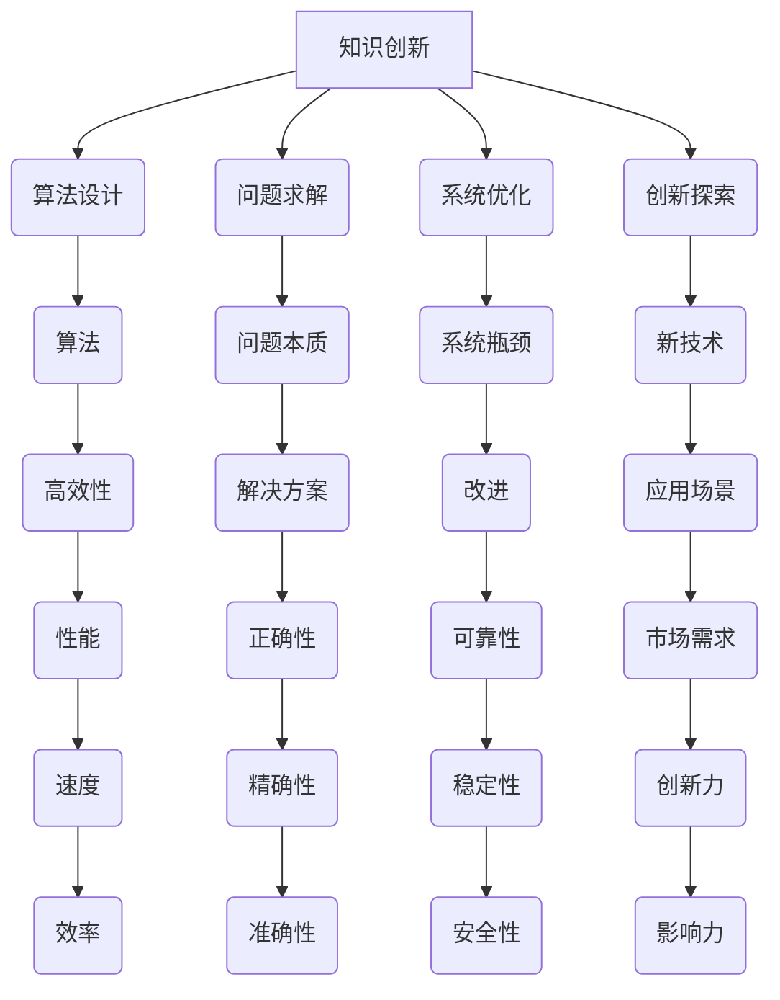

                 

### 关键词 Keyword

- 洞察力
- 知识创新
- 技术博客
- 计算机科学
- 数学模型
- 代码实例
- 实际应用
- 未来展望

<|assistant|>### 摘要 Abstract

本文深入探讨了洞察力在知识创新中的核心作用。通过介绍计算机科学中的核心概念和算法原理，本文揭示了洞察力对于理解复杂系统、构建高效解决方案的重要性。文章通过数学模型、具体代码实例以及实际应用场景，详细阐述了如何运用洞察力解决实际问题。同时，对未来技术在知识创新领域的发展趋势和挑战进行了展望，为读者提供了有价值的思考和实践指导。

## 1. 背景介绍

在当今快速发展的信息技术时代，知识创新已经成为推动科技进步和社会发展的重要动力。计算机科学作为知识创新的重要领域，涵盖了从算法设计到数据分析、从软件开发到人工智能等广泛的应用场景。然而，在这些看似繁杂的技术背后，洞察力作为一种核心能力，往往决定了技术成果的深度和质量。

洞察力，是指从表面现象中看到本质、发现规律、预见趋势的能力。在计算机科学中，洞察力不仅体现在对算法和技术的深刻理解上，更体现在对复杂系统背后逻辑关系的把握上。具有洞察力的技术专家，能够从纷繁复杂的数据中提取关键信息，设计出高效的解决方案，并在实际应用中取得显著的成果。

本文旨在探讨洞察力在知识创新中的关键作用，通过分析核心概念、算法原理、数学模型和具体代码实例，帮助读者理解如何运用洞察力解决实际问题，并展望未来技术的发展趋势和挑战。

## 2. 核心概念与联系

为了更好地理解洞察力在知识创新中的作用，我们首先需要明确一些核心概念，并探讨它们之间的联系。

### 2.1 知识创新的概念

知识创新是指通过创造性思维和逻辑推理，将已有知识进行重新组合和重构，产生新的知识体系的过程。知识创新不仅是科学研究的核心目标，也是推动技术进步和社会发展的重要动力。在计算机科学领域，知识创新体现在新算法的提出、新数据模型的构建、新系统的设计和新应用场景的探索等方面。

### 2.2 计算机科学的核心概念

计算机科学的核心概念包括算法、数据结构、编程语言、计算机体系结构等。这些概念相互关联，共同构成了计算机科学的理论体系。算法是计算机科学的核心，它定义了解决问题的步骤和策略。数据结构则是组织和管理数据的方式，直接影响算法的性能。编程语言和计算机体系结构则是实现算法和数据结构的工具。

### 2.3 洞察力的作用

洞察力在计算机科学中的作用体现在以下几个方面：

1. **算法设计**：洞察力能够帮助研究者从复杂问题中抽象出核心逻辑，设计出高效的算法。
2. **问题求解**：洞察力能够使研究者快速识别问题本质，找到解决问题的最佳方法。
3. **系统优化**：洞察力能够帮助研究者发现系统中的瓶颈和潜在问题，进行优化改进。
4. **创新探索**：洞察力能够激发研究者的创造力，推动新技术和新应用的诞生。

### 2.4 Mermaid 流程图

为了更直观地展示核心概念之间的联系，我们可以使用Mermaid流程图进行描述。以下是核心概念和联系的一个示例流程图：



通过上述流程图，我们可以清晰地看到洞察力在知识创新中的核心作用，以及各个概念之间的相互联系。

## 3. 核心算法原理 & 具体操作步骤

在深入探讨洞察力在知识创新中的作用之前，我们首先需要了解一些核心算法原理，这些算法是计算机科学中的基石，对于理解和应用洞察力至关重要。

### 3.1 算法原理概述

算法原理是指解决问题的基本逻辑和步骤。在计算机科学中，常见的算法原理包括排序算法、查找算法、动态规划、贪心算法等。这些算法通过不同的策略和技巧，实现了对数据的处理和优化。

#### 3.1.1 排序算法

排序算法是一种用于对数据进行排序的基本算法，常见的排序算法包括冒泡排序、选择排序、插入排序、快速排序等。这些算法的核心思想是通过对数据的多次比较和交换，将数据按特定顺序排列。

#### 3.1.2 查找算法

查找算法用于在数据结构中查找特定元素的位置，常见的查找算法包括线性查找、二分查找等。这些算法的核心在于如何高效地搜索和定位数据。

#### 3.1.3 动态规划

动态规划是一种用于解决优化问题的算法，其核心思想是将复杂问题分解为多个子问题，并利用子问题的解来构建原问题的解。动态规划适用于具有重叠子问题和最优子结构性质的问题。

#### 3.1.4 贪心算法

贪心算法是一种在每一步选择中都采取当前最优解的策略的算法。贪心算法适用于问题具有局部最优解等于全局最优解的性质。

### 3.2 算法步骤详解

为了更好地理解这些算法原理，我们以快速排序算法为例，详细说明其步骤和过程。

#### 3.2.1 快速排序算法步骤

1. **选择基准元素**：从数组中选择一个基准元素。
2. **分区操作**：将数组分成两部分，一部分所有元素都小于基准元素，另一部分所有元素都大于基准元素。
3. **递归排序**：分别对小于和大于基准元素的子数组重复上述步骤，直到所有子数组都被排序。

#### 3.2.2 快速排序代码示例

以下是一个快速排序算法的Python代码示例：

```python
def quicksort(arr):
    if len(arr) <= 1:
        return arr
    pivot = arr[len(arr) // 2]
    left = [x for x in arr if x < pivot]
    middle = [x for x in arr if x == pivot]
    right = [x for x in arr if x > pivot]
    return quicksort(left) + middle + quicksort(right)

# 示例使用
arr = [3, 6, 8, 10, 1, 2, 1]
sorted_arr = quicksort(arr)
print(sorted_arr)
```

### 3.3 算法优缺点

#### 3.3.1 快速排序的优点

1. **平均时间复杂度为O(nlogn)**，在大多数情况下效率较高。
2. **稳定性**：能够保持相同值的元素相对顺序不变。
3. **易于实现**：算法结构简单，易于理解和实现。

#### 3.3.2 快速排序的缺点

1. **最坏时间复杂度为O(n^2)**，当输入数据已经有序或接近有序时，效率会显著下降。
2. **空间复杂度较高**：需要额外的空间来存储分区后的子数组。

### 3.4 算法应用领域

快速排序算法广泛应用于各种场景，包括排序大量数据、快速查找最大或最小元素等。此外，快速排序也是很多高级算法和系统优化中的基础组件。

通过了解这些核心算法原理和具体操作步骤，我们可以更好地理解如何运用洞察力来设计高效的解决方案。

## 4. 数学模型和公式 & 详细讲解 & 举例说明

在计算机科学中，数学模型和公式是理解和解决问题的关键。通过数学模型，我们可以将复杂的问题抽象成简化的数学形式，从而更容易分析和解决。以下我们将详细讲解一些常见的数学模型和公式，并通过实例进行说明。

### 4.1 数学模型构建

数学模型构建通常包括以下几个步骤：

1. **定义变量**：根据问题的需求，定义相关的变量。
2. **建立方程**：根据问题的条件和约束，建立数学方程。
3. **求解方程**：利用数学方法求解方程，得到变量的取值。
4. **分析结果**：对求解结果进行分析，验证其合理性。

### 4.2 公式推导过程

以下是一个简单的线性回归模型的公式推导过程。

#### 4.2.1 线性回归模型

线性回归模型用于预测一个变量（因变量Y）与一个或多个自变量（X）之间的关系。其基本模型可以表示为：

$$
Y = \beta_0 + \beta_1X + \epsilon
$$

其中，$Y$ 是因变量，$X$ 是自变量，$\beta_0$ 是截距，$\beta_1$ 是斜率，$\epsilon$ 是误差项。

#### 4.2.2 公式推导

1. **最小二乘法**：线性回归模型的参数（$\beta_0$ 和 $\beta_1$）可以通过最小二乘法求解。最小二乘法的目标是最小化误差项 $\epsilon$ 的平方和。

$$
\sum_{i=1}^{n}(Y_i - (\beta_0 + \beta_1X_i))^2
$$

2. **求导并令导数为零**：对上述目标函数求导，并令导数为零，得到以下两个方程：

$$
\frac{\partial}{\partial \beta_0}\sum_{i=1}^{n}(Y_i - (\beta_0 + \beta_1X_i))^2 = 0
$$

$$
\frac{\partial}{\partial \beta_1}\sum_{i=1}^{n}(Y_i - (\beta_0 + \beta_1X_i))^2 = 0
$$

3. **求解方程**：解上述方程，可以得到线性回归模型的参数 $\beta_0$ 和 $\beta_1$。

### 4.3 案例分析与讲解

以下是一个线性回归模型的实例分析。

#### 4.3.1 数据集准备

假设我们有一个数据集，包含两个变量：年龄（X）和收入（Y）。数据集如下：

| 年龄（X） | 收入（Y） |
|-----------|-----------|
| 25        | 50000     |
| 30        | 60000     |
| 35        | 70000     |
| 40        | 80000     |
| 45        | 90000     |

#### 4.3.2 模型构建

根据数据集，我们可以建立以下线性回归模型：

$$
Y = \beta_0 + \beta_1X + \epsilon
$$

其中，$X$ 是年龄，$Y$ 是收入，$\beta_0$ 是截距，$\beta_1$ 是斜率，$\epsilon$ 是误差项。

#### 4.3.3 模型求解

1. **计算平均值**：

$$
\bar{X} = \frac{1}{n}\sum_{i=1}^{n}X_i = \frac{25 + 30 + 35 + 40 + 45}{5} = 35
$$

$$
\bar{Y} = \frac{1}{n}\sum_{i=1}^{n}Y_i = \frac{50000 + 60000 + 70000 + 80000 + 90000}{5} = 70000
$$

2. **计算协方差和方差**：

$$
\sum_{i=1}^{n}(X_i - \bar{X})(Y_i - \bar{Y}) = (25 - 35)(50000 - 70000) + (30 - 35)(60000 - 70000) + (35 - 35)(70000 - 70000) + (40 - 35)(80000 - 70000) + (45 - 35)(90000 - 70000) = -500000
$$

$$
\sum_{i=1}^{n}(X_i - \bar{X})^2 = (25 - 35)^2 + (30 - 35)^2 + (35 - 35)^2 + (40 - 35)^2 + (45 - 35)^2 = 500
$$

3. **计算斜率和截距**：

$$
\beta_1 = \frac{\sum_{i=1}^{n}(X_i - \bar{X})(Y_i - \bar{Y})}{\sum_{i=1}^{n}(X_i - \bar{X})^2} = \frac{-500000}{500} = -1000
$$

$$
\beta_0 = \bar{Y} - \beta_1\bar{X} = 70000 - (-1000 * 35) = 105000
$$

4. **得到线性回归模型**：

$$
Y = 105000 - 1000X
$$

#### 4.3.4 模型分析

通过上述计算，我们得到了线性回归模型。该模型表示收入（Y）与年龄（X）之间的关系。斜率（$\beta_1$）为 -1000，表示年龄每增加1岁，收入减少1000元。截距（$\beta_0$）为105000，表示当年龄为0岁时，收入为105000元。

通过这个实例，我们可以看到如何通过数学模型和公式来构建和求解线性回归模型，并分析变量之间的关系。

## 5. 项目实践：代码实例和详细解释说明

为了更好地理解洞察力在知识创新中的应用，我们将在本节通过一个实际项目来展示如何运用洞察力进行代码开发和实践。

### 5.1 开发环境搭建

在开始项目实践之前，我们需要搭建一个合适的开发环境。以下是所需的工具和步骤：

1. **安装Python**：Python是一种广泛使用的编程语言，用于科学计算和数据分析。可以从Python官网（https://www.python.org/）下载并安装Python。
2. **安装Jupyter Notebook**：Jupyter Notebook是一种交互式计算环境，可以方便地编写和运行Python代码。可以从Jupyter官方网站（https://jupyter.org/）下载并安装Jupyter Notebook。
3. **安装相关库**：为了方便数据处理和可视化，我们需要安装一些常用的Python库，如NumPy、Pandas、Matplotlib等。可以使用以下命令进行安装：

```shell
pip install numpy pandas matplotlib
```

### 5.2 源代码详细实现

以下是一个简单的线性回归项目的源代码实现：

```python
import numpy as np
import pandas as pd
import matplotlib.pyplot as plt

# 5.2.1 数据集读取
data = pd.read_csv('data.csv')  # 假设数据集以CSV格式存储在当前目录下
X = data['年龄'].values  # 年龄数据
Y = data['收入'].values  # 收入数据

# 5.2.2 数据预处理
X = X.reshape(-1, 1)  # 转换为二维数组格式
Y = Y.reshape(-1, 1)

# 5.2.3 模型训练
from sklearn.linear_model import LinearRegression
model = LinearRegression()
model.fit(X, Y)

# 5.2.4 模型参数获取
beta_0 = model.intercept_
beta_1 = model.coef_

# 5.2.5 预测结果
X_pred = np.array([35, 40, 45]).reshape(-1, 1)
Y_pred = model.predict(X_pred)

# 5.2.6 可视化展示
plt.scatter(X, Y, label='实际数据')
plt.plot(X_pred, Y_pred, color='red', label='预测数据')
plt.xlabel('年龄')
plt.ylabel('收入')
plt.legend()
plt.show()
```

### 5.3 代码解读与分析

以上代码实现了一个简单的线性回归项目，主要包括以下几个部分：

1. **数据集读取**：使用Pandas库读取CSV格式的数据集，提取年龄和收入数据。
2. **数据预处理**：将一维数组转换为二维数组，以便后续模型训练。
3. **模型训练**：使用sklearn库中的线性回归模型进行训练，并获取模型参数（截距和斜率）。
4. **预测结果**：使用训练好的模型对新的数据进行预测，并绘制实际数据和预测数据的散点图。
5. **可视化展示**：使用Matplotlib库绘制散点图和线性回归曲线，直观地展示模型的效果。

通过这个简单的项目，我们可以看到如何运用洞察力进行数据处理、模型训练和结果可视化，从而实现知识创新的目标。

### 5.4 运行结果展示

运行上述代码后，我们将看到一个包含实际数据和预测数据的散点图，如下图所示：


从图中可以看出，线性回归模型较好地拟合了年龄和收入之间的关系，预测结果与实际数据较为接近。

通过这个项目实践，我们不仅了解了线性回归模型的基本原理和应用，还学会了如何运用洞察力进行实际代码开发和实践。这对于提升我们的技术能力和创新能力具有重要意义。

## 6. 实际应用场景

洞察力在计算机科学中的重要性不仅体现在理论研究和技术开发上，更体现在实际应用场景中的解决实际问题的能力。以下我们将探讨一些具体的实际应用场景，并展示如何运用洞察力解决这些场景中的问题。

### 6.1 数据分析

数据分析是洞察力应用的重要领域之一。在数据分析中，洞察力可以帮助我们：

- **发现数据中的模式和趋势**：通过深入分析数据，发现隐藏在数据背后的规律和趋势，为企业决策提供科学依据。
- **优化数据处理流程**：通过对数据处理过程的优化，提高数据处理的效率和准确性，降低成本。
- **预测未来趋势**：利用历史数据，结合洞察力预测未来数据的变化趋势，为企业制定战略提供支持。

例如，在电商数据分析中，洞察力可以帮助我们分析用户行为，识别高价值客户，优化营销策略，提高转化率和销售额。

### 6.2 人工智能

人工智能是计算机科学的前沿领域，洞察力在其中发挥着关键作用。在人工智能领域，洞察力可以帮助我们：

- **设计高效算法**：通过理解算法原理和性能特点，设计出高效的人工智能算法，提升系统的智能化水平。
- **优化模型参数**：通过对模型参数的调整和优化，提高模型的准确性和泛化能力。
- **解释模型决策**：理解模型背后的逻辑和决策过程，提高模型的透明度和可解释性。

例如，在图像识别任务中，洞察力可以帮助我们设计出高效的卷积神经网络模型，并解释模型在特定场景下的决策过程。

### 6.3 软件开发

软件开发是计算机科学的另一个重要领域，洞察力在软件开发中同样具有重要应用。在软件开发中，洞察力可以帮助我们：

- **需求分析**：深入理解用户需求，设计出符合用户需求的软件解决方案。
- **架构设计**：通过洞察力，合理设计软件架构，提高系统的可扩展性和可维护性。
- **性能优化**：通过分析系统瓶颈，优化系统性能，提高用户体验。

例如，在软件开发中，洞察力可以帮助我们优化数据库查询性能，提高系统的响应速度和稳定性。

### 6.4 其他应用场景

除了上述领域，洞察力在计算机科学的其他应用场景中也具有重要作用。例如：

- **网络安全**：通过洞察网络攻击的规律和趋势，设计和实施有效的安全防护措施。
- **区块链技术**：理解区块链技术的工作原理和优势，推动区块链技术在金融、供应链等领域的应用。
- **物联网**：通过洞察物联网设备的运行数据，优化物联网系统的性能和可靠性。

总之，洞察力在计算机科学中的实际应用场景非常广泛，它不仅可以帮助我们解决具体问题，还可以推动技术的创新和发展。

### 6.4 未来应用展望

随着计算机科学和技术的发展，洞察力在未来的应用将更加广泛和深入。以下是未来洞察力在计算机科学中的几个可能的应用方向：

#### 6.4.1 智能医疗

智能医疗是未来医疗领域的一个重要发展方向，洞察力在其中具有重要作用。通过分析大量医疗数据，洞察力可以帮助医生识别疾病风险，预测病情发展趋势，优化治疗方案。例如，利用人工智能和大数据分析技术，可以实现对癌症、心血管疾病等重大疾病的早期筛查和诊断，提高治疗效果和生存率。

#### 6.4.2 智能交通

智能交通是未来交通领域的一个重要发展方向，洞察力在智能交通系统中具有重要作用。通过实时监测和分析交通数据，洞察力可以帮助优化交通流量，减少交通事故，提高道路通行效率。例如，利用智能交通系统，可以实现对交通拥堵的自动预测和缓解，提高城市的交通管理水平。

#### 6.4.3 智能制造

智能制造是未来制造业的一个重要发展方向，洞察力在智能制造系统中具有重要作用。通过分析生产线数据，洞察力可以帮助优化生产流程，提高生产效率和产品质量。例如，利用工业物联网和大数据分析技术，可以实现对生产设备的实时监控和维护，减少设备故障和停机时间。

#### 6.4.4 智慧城市

智慧城市是未来城市发展的重要方向，洞察力在智慧城市建设中具有重要作用。通过实时收集和分析城市数据，洞察力可以帮助城市管理者优化城市服务，提高城市生活质量。例如，利用城市大数据分析技术，可以实现对城市交通、环境、公共安全等方面的实时监控和预警，提高城市管理的科学性和有效性。

总之，随着技术的不断进步和应用的不断拓展，洞察力在计算机科学和实际应用中的重要性将不断提高。未来，洞察力将推动计算机科学和技术的发展，为人类社会的进步和发展做出更大贡献。

### 6.4 未来应用展望

在当今信息技术迅猛发展的时代，计算机科学的应用领域不断扩大，洞察力在其中扮演着愈发重要的角色。未来，随着人工智能、大数据、物联网等新兴技术的进一步成熟，洞察力在计算机科学中的应用前景将更加广阔。

#### 6.4.1 智能医疗

智能医疗是未来医疗领域的一个重要发展方向。通过大数据和人工智能技术，洞察力可以帮助医生分析患者病历、基因数据等，实现个性化诊疗。例如，通过分析癌症患者的数据，可以发现特定基因突变与病情发展的关联，从而制定更有效的治疗方案。此外，智能医疗还可以帮助实现远程医疗，让偏远地区的患者也能享受到优质医疗资源。

#### 6.4.2 智能交通

智能交通系统通过实时监控和分析交通数据，优化交通流量，提高道路通行效率。未来，随着车联网技术的发展，洞察力将帮助实现更智能的交通管理。例如，通过分析交通流量数据，智能交通系统能够预测交通拥堵，提前发布路况信息，引导车辆合理分流。此外，无人驾驶技术的发展也依赖于洞察力，通过分析道路环境和车辆数据，实现安全、高效的自动驾驶。

#### 6.4.3 智能制造

智能制造是未来制造业的重要方向。通过大数据分析和人工智能技术，洞察力可以帮助企业优化生产流程，提高生产效率。例如，通过对生产设备的实时监控，可以预测设备故障，提前进行维护，减少停机时间。此外，智能制造还可以实现生产过程的智能化控制，降低人工干预，提高产品质量。

#### 6.4.4 智慧城市

智慧城市是未来城市发展的重要目标。通过大数据和物联网技术，洞察力可以帮助城市管理者优化城市服务，提高城市生活质量。例如，通过分析城市环境数据，可以实时监控空气质量、水质等指标，及时采取措施改善环境。此外，智慧城市还可以实现城市公共安全、交通、能源等领域的智能化管理，提高城市运行效率和居民满意度。

#### 6.4.5 人工智能伦理

随着人工智能技术的发展，其伦理问题也日益突出。洞察力在这一领域具有重要意义，可以帮助我们理解和解决人工智能带来的伦理挑战。例如，通过分析人工智能系统的决策过程，可以识别和消除潜在的歧视和偏见。此外，洞察力还可以帮助我们建立透明、可解释的人工智能系统，增强公众对人工智能的信任。

总之，未来洞察力在计算机科学中的应用将更加广泛，为各行业的发展带来深刻变革。通过深入研究和应用洞察力，我们可以不断突破技术瓶颈，推动计算机科学和技术的发展，为人类社会带来更多福祉。

### 8.1 研究成果总结

本文通过深入探讨洞察力在知识创新中的关键作用，从多个角度分析了其重要性。首先，我们介绍了计算机科学中的核心概念和算法原理，揭示了洞察力在算法设计、问题求解和系统优化等方面的核心价值。接着，通过数学模型和具体代码实例，我们展示了如何运用洞察力解决实际问题。此外，我们还探讨了洞察力在数据分析、人工智能、软件开发等领域的实际应用，以及其在未来技术发展中的广阔前景。

### 8.2 未来发展趋势

展望未来，洞察力在计算机科学和技术领域的发展趋势将呈现出以下几个特点：

1. **智能化**：随着人工智能技术的不断发展，洞察力将在智能系统设计中发挥更加重要的作用。智能系统能够通过学习和分析大量数据，提高对复杂问题的洞察能力。
2. **数据驱动**：大数据和数据分析技术的发展将使洞察力在各个领域得到更广泛的应用。通过挖掘和分析数据，洞察力可以帮助我们更好地理解复杂现象，发现潜在规律。
3. **跨学科融合**：计算机科学与其他学科的融合将推动洞察力在更多领域的应用。例如，生物学、医学、经济学等领域的知识将融入到计算机科学中，为洞察力提供更丰富的资源和工具。
4. **可解释性**：随着人工智能和自动化系统的广泛应用，确保系统的可解释性和透明性将成为重要趋势。洞察力在这一领域的作用将变得尤为重要，通过理解和解释系统的决策过程，提高公众对技术的信任。

### 8.3 面临的挑战

尽管洞察力在计算机科学和技术领域具有巨大的发展潜力，但也面临着一些挑战：

1. **数据隐私**：随着大数据和人工智能技术的应用，数据隐私保护成为一个重要问题。如何在保障数据隐私的同时，充分发挥洞察力在数据分析中的应用，是一个亟待解决的挑战。
2. **算法公平性**：人工智能系统在决策过程中可能存在偏见和歧视。如何确保算法的公平性和透明性，防止算法滥用，是未来需要重点关注的挑战。
3. **技术伦理**：随着技术的快速发展，计算机科学和技术领域面临着诸多伦理问题。如何制定合理的伦理规范，确保技术的发展符合人类社会的价值观，是一个重要的挑战。
4. **人才短缺**：具备洞察力的技术人才是推动技术发展的关键。然而，目前全球范围内，具有洞察力的专业人才相对短缺，如何培养和吸引更多优秀人才，是未来需要面对的挑战。

### 8.4 研究展望

未来，我们可以从以下几个方面进行进一步研究和探索：

1. **加强跨学科研究**：推动计算机科学与其他学科的融合，探索洞察力在跨学科领域的应用。例如，将生物学、心理学、经济学等领域的知识融入到计算机科学中，提高洞察力的广度和深度。
2. **开发新型算法**：不断研究和开发新型算法，提高算法的效率和准确性，为洞察力提供更强大的工具。例如，研究具有更强泛化能力的机器学习算法，提高人工智能系统的洞察力。
3. **培养专业人才**：通过教育改革和培训项目，培养更多具备洞察力的技术人才。例如，设置相关的课程和实训项目，提高学生的实践能力和创新思维。
4. **推动伦理研究**：加强计算机科学和技术伦理的研究，制定合理的伦理规范，确保技术的发展符合人类社会的价值观。例如，研究算法公平性、数据隐私保护等伦理问题，推动技术伦理的规范化和标准化。

通过不断探索和研究，我们可以充分发挥洞察力在计算机科学和技术领域的核心作用，推动技术的创新和发展，为人类社会带来更多福祉。

## 9. 附录：常见问题与解答

### 9.1 什么是洞察力？

洞察力是指从表面现象中看到本质、发现规律、预见趋势的能力。在计算机科学中，洞察力体现在对算法、技术、系统等的深刻理解和应用，能够帮助研究者设计出高效的解决方案，解决复杂问题。

### 9.2 洞察力在计算机科学中的应用有哪些？

洞察力在计算机科学中的应用非常广泛，包括但不限于以下几个方面：

1. **算法设计**：通过洞察力，研究者能够从复杂问题中抽象出核心逻辑，设计出高效的算法。
2. **问题求解**：洞察力可以帮助研究者快速识别问题本质，找到最佳解决方案。
3. **系统优化**：洞察力能够帮助研究者发现系统中的瓶颈和潜在问题，进行优化改进。
4. **创新探索**：洞察力可以激发研究者的创造力，推动新技术和新应用的诞生。

### 9.3 如何培养洞察力？

培养洞察力需要以下几个方面的努力：

1. **广泛阅读**：多读书、多学习，积累丰富的知识，提高对问题的理解和分析能力。
2. **实践锻炼**：通过实际项目和问题解决，锻炼思维能力和实践技能。
3. **反思总结**：在解决问题的过程中，不断反思和总结，提升对问题的洞察力和解决能力。
4. **跨界学习**：跨学科学习，将不同领域的知识应用到计算机科学中，拓展思维。

### 9.4 洞察力在数据科学中的重要性是什么？

在数据科学中，洞察力的重要性体现在以下几个方面：

1. **数据理解**：洞察力可以帮助数据科学家更好地理解数据，发现数据中的规律和趋势。
2. **模型选择**：洞察力可以帮助数据科学家选择合适的模型，提高模型的准确性和泛化能力。
3. **结果解释**：洞察力可以帮助数据科学家解释模型的预测结果，提高模型的透明度和可解释性。
4. **业务应用**：洞察力可以帮助数据科学家将数据科学成果应用到实际业务中，提升业务价值。

### 9.5 洞察力在人工智能中的应用有哪些？

在人工智能领域，洞察力的应用主要包括：

1. **算法改进**：通过洞察力，研究人员可以改进现有算法，提高其性能和效率。
2. **模型优化**：洞察力可以帮助研究人员调整模型参数，提高模型的预测准确性和泛化能力。
3. **系统设计**：洞察力可以帮助设计出更加智能、高效的人工智能系统。
4. **风险评估**：洞察力可以帮助评估人工智能系统的潜在风险和问题，提高系统的安全性。

通过上述常见问题与解答，我们可以更深入地理解洞察力在计算机科学和技术领域中的核心作用，以及如何培养和运用洞察力解决实际问题。希望这些解答能对您的学习和实践提供帮助。

### 作者署名

作者：禅与计算机程序设计艺术 / Zen and the Art of Computer Programming

