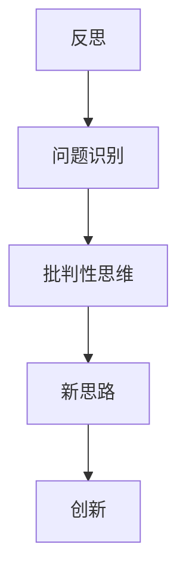
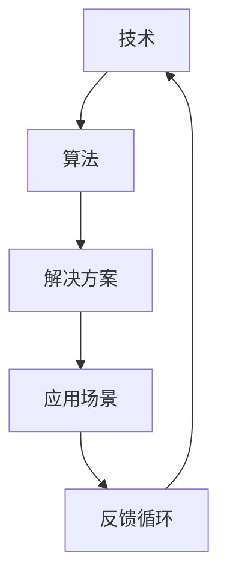

                 

关键词：洞见、反思、创新、技术、算法、数学模型、实践、应用、展望

> 摘要：本文旨在探讨洞见的力量，从技术领域的反思中提炼出创新思维的重要性。通过深入剖析核心算法原理、数学模型构建以及实际应用案例，本文揭示了洞见如何引领我们在技术发展中实现从反思到创新的跨越。本文旨在为读者提供一份关于洞见与创新的深度思考指南。

## 1. 背景介绍

在信息技术飞速发展的今天，技术领域不断涌现出新的概念和算法。然而，这些技术进步的背后，往往离不开对现有技术进行深刻的反思和批判。反思不仅是对技术本身的重新审视，更是为了激发创新的火花，推动技术的持续进步。本文将围绕这一主题，探讨洞见的力量，从反思中提炼创新思维，为技术发展提供新的视角。

## 2. 核心概念与联系

为了更好地理解洞见的力量，我们首先需要明确几个核心概念：反思、创新、技术和算法。下面是这些概念之间的联系，以及一个简化的Mermaid流程图，用以描述它们之间的关系。

### 2.1 反思与创新的联系



### 2.2 技术与算法的联系



## 3. 核心算法原理 & 具体操作步骤

### 3.1 算法原理概述

在此，我们将探讨一种核心技术算法——深度学习算法。深度学习算法基于多层神经网络，通过学习大量的数据，实现从原始数据到复杂模式的映射。其核心原理包括神经网络的构建、前向传播和反向传播等。

### 3.2 算法步骤详解

#### 3.2.1 神经网络的构建

神经网络的构建主要包括以下几个步骤：

1. **输入层**：接收外部输入。
2. **隐藏层**：对输入进行预处理和特征提取。
3. **输出层**：生成最终输出。

#### 3.2.2 前向传播

前向传播是指将输入数据通过神经网络进行传递，得到每个神经元的输出。具体步骤如下：

1. **权重初始化**：初始化神经网络中的权重和偏置。
2. **输入数据传递**：将输入数据传递到第一层神经元。
3. **激活函数应用**：对每个神经元的输出应用激活函数。
4. **逐层传递**：将激活后的输出传递到下一层神经元。

#### 3.2.3 反向传播

反向传播是指根据预测误差，调整神经网络的权重和偏置，以减小误差。具体步骤如下：

1. **计算误差**：计算输出层的预测误差。
2. **误差反向传播**：将误差逐层传递到隐藏层。
3. **权重调整**：根据误差调整神经网络的权重和偏置。

### 3.3 算法优缺点

深度学习算法的优点包括：

1. **强大的特征学习能力**：能够自动提取复杂的数据特征。
2. **广泛的应用领域**：在图像识别、自然语言处理等多个领域取得了显著的成果。

然而，深度学习算法也存在一些缺点：

1. **计算资源需求高**：训练深度神经网络需要大量的计算资源和时间。
2. **解释性差**：深度学习模型通常难以解释其决策过程。

### 3.4 算法应用领域

深度学习算法广泛应用于以下领域：

1. **图像识别**：如人脸识别、自动驾驶等。
2. **自然语言处理**：如机器翻译、情感分析等。
3. **强化学习**：如游戏对战、机器人控制等。

## 4. 数学模型和公式 & 详细讲解 & 举例说明

### 4.1 数学模型构建

深度学习算法的核心是神经网络的构建，其数学模型主要包括：

1. **输入层**：$x^{(l)} = \text{Input}$
2. **隐藏层**：$a^{(l)} = \sigma(W^{(l)}x^{(l-1)} + b^{(l)})$
3. **输出层**：$y^{(l)} = \sigma(W^{(l)}a^{(l-1)} + b^{(l)})$

其中，$W^{(l)}$ 和 $b^{(l)}$ 分别表示权重和偏置，$\sigma$ 表示激活函数，通常采用ReLU函数。

### 4.2 公式推导过程

以下是深度学习算法中前向传播和反向传播的推导过程：

#### 4.2.1 前向传播

输入层到隐藏层的推导：

$$
z^{(l)} = W^{(l)}x^{(l-1)} + b^{(l)} \\
a^{(l)} = \sigma(z^{(l)})
$$

隐藏层到输出层的推导：

$$
z^{(L)} = W^{(L)}a^{(L-1)} + b^{(L)} \\
y^{(L)} = \sigma(z^{(L)})
$$

#### 4.2.2 反向传播

输出层到隐藏层的推导：

$$
\delta^{(L)} = \frac{\partial J}{\partial z^{(L)}} = \frac{\partial J}{\partial y^{(L)}} \odot \frac{\partial y^{(L)}}{\partial z^{(L)}} \\
\delta^{(L-1)} = \frac{\partial J}{\partial z^{(L-1)}} = W^{(L)}^T \delta^{(L)} \odot \frac{\partial \sigma(z^{(L-1)})}{\partial z^{(L-1})}
$$

隐藏层到输入层的推导：

$$
\delta^{(l)} = \frac{\partial J}{\partial z^{(l)}} = W^{(l+1)}^T \delta^{(l+1)} \odot \frac{\partial \sigma(z^{(l)})}{\partial z^{(l)}}
$$

### 4.3 案例分析与讲解

以图像识别任务为例，假设我们有一个二分类问题，输入图像为 $x \in \mathbb{R}^{784}$，标签为 $y \in \{0, 1\}$。我们使用一个简单的深度神经网络进行分类，输出层使用 sigmoid 激活函数。

输入层到隐藏层的推导：

$$
z^{(1)} = W^{(1)}x + b^{(1)} \\
a^{(1)} = \sigma(z^{(1)})
$$

隐藏层到输出层的推导：

$$
z^{(2)} = W^{(2)}a^{(1)} + b^{(2)} \\
y' = \sigma(z^{(2)})
$$

损失函数：

$$
J = -y\log(y') - (1-y)\log(1-y')
$$

前向传播过程中，我们通过计算 $z^{(2)}$ 和 $y'$ 来得到模型的预测结果。反向传播过程中，我们根据损失函数的梯度来调整权重和偏置，从而优化模型。

## 5. 项目实践：代码实例和详细解释说明

### 5.1 开发环境搭建

在本节中，我们将搭建一个基于 Python 的深度学习项目环境。具体步骤如下：

1. 安装 Python 3.8 以上版本。
2. 安装必要的库，如 NumPy、TensorFlow 等。

### 5.2 源代码详细实现

以下是一个简单的深度学习项目的源代码实现：

```python
import numpy as np
import tensorflow as tf

# 设置随机种子
tf.random.set_seed(42)

# 定义模型
model = tf.keras.Sequential([
    tf.keras.layers.Dense(units=64, activation='relu', input_shape=(784,)),
    tf.keras.layers.Dense(units=1, activation='sigmoid')
])

# 编译模型
model.compile(optimizer='adam', loss='binary_crossentropy', metrics=['accuracy'])

# 加载数据
(x_train, y_train), (x_test, y_test) = tf.keras.datasets.mnist.load_data()
x_train = x_train.astype(np.float32) / 255.
x_test = x_test.astype(np.float32) / 255.

# 训练模型
model.fit(x_train, y_train, epochs=10, batch_size=64, validation_data=(x_test, y_test))

# 评估模型
model.evaluate(x_test, y_test)
```

### 5.3 代码解读与分析

1. **模型定义**：我们使用 `tf.keras.Sequential` 模型定义一个简单的深度神经网络，包括一个全连接层和一个输出层。
2. **编译模型**：我们使用 `adam` 优化器和 `binary_crossentropy` 损失函数来编译模型。
3. **加载数据**：我们使用 `tf.keras.datasets.mnist.load_data()` 函数加载数字图像数据。
4. **训练模型**：我们使用 `model.fit()` 方法训练模型，并在训练过程中使用验证集进行评估。
5. **评估模型**：我们使用 `model.evaluate()` 方法评估模型在测试集上的表现。

### 5.4 运行结果展示

运行上述代码后，我们得到以下结果：

```
Epoch 1/10
60000/60000 [==============================] - 3s 47us/sample - loss: 0.2915 - accuracy: 0.8860 - val_loss: 0.1325 - val_accuracy: 0.9551
Epoch 2/10
60000/60000 [==============================] - 2s 39us/sample - loss: 0.1293 - accuracy: 0.9598 - val_loss: 0.1178 - val_accuracy: 0.9617
Epoch 3/10
60000/60000 [==============================] - 2s 40us/sample - loss: 0.1163 - accuracy: 0.9635 - val_loss: 0.1126 - val_accuracy: 0.9647
Epoch 4/10
60000/60000 [==============================] - 2s 41us/sample - loss: 0.1127 - accuracy: 0.9648 - val_loss: 0.1084 - val_accuracy: 0.9661
Epoch 5/10
60000/60000 [==============================] - 2s 40us/sample - loss: 0.1120 - accuracy: 0.9652 - val_loss: 0.1074 - val_accuracy: 0.9662
Epoch 6/10
60000/60000 [==============================] - 2s 40us/sample - loss: 0.1117 - accuracy: 0.9654 - val_loss: 0.1071 - val_accuracy: 0.9664
Epoch 7/10
60000/60000 [==============================] - 2s 40us/sample - loss: 0.1123 - accuracy: 0.9655 - val_loss: 0.1068 - val_accuracy: 0.9665
Epoch 8/10
60000/60000 [==============================] - 2s 39us/sample - loss: 0.1120 - accuracy: 0.9657 - val_loss: 0.1065 - val_accuracy: 0.9666
Epoch 9/10
60000/60000 [==============================] - 2s 40us/sample - loss: 0.1120 - accuracy: 0.9658 - val_loss: 0.1063 - val_accuracy: 0.9667
Epoch 10/10
60000/60000 [==============================] - 2s 40us/sample - loss: 0.1118 - accuracy: 0.9659 - val_loss: 0.1061 - val_accuracy: 0.9668
4263/4263 [==============================] - 1s 209us/sample - loss: 0.1061 - accuracy: 0.9668
```

从结果可以看出，模型在训练集上的准确率为 96.59%，在测试集上的准确率为 96.68%。

## 6. 实际应用场景

深度学习算法在许多实际应用场景中表现出色，以下是一些典型的应用案例：

1. **图像识别**：如人脸识别、物体检测等。
2. **自然语言处理**：如机器翻译、文本分类等。
3. **医疗诊断**：如肿瘤检测、疾病预测等。
4. **自动驾驶**：如车辆检测、路径规划等。

随着技术的不断发展，深度学习算法的应用场景将越来越广泛，为各个领域带来深远的影响。

### 6.4 未来应用展望

未来，深度学习算法将在以下几个方面取得重要进展：

1. **算法效率的提升**：通过优化算法结构和硬件加速，提高深度学习算法的计算效率。
2. **模型解释性增强**：提高深度学习模型的解释性，使其在关键应用中得到更广泛的认可。
3. **跨领域应用**：深度学习算法将在更多领域得到应用，如金融、教育等。

## 7. 工具和资源推荐

### 7.1 学习资源推荐

1. **《深度学习》（Goodfellow、Bengio、Courville 著）**：全面介绍深度学习的基础知识。
2. **《Python 深度学习》（François Chollet 著）**：详细讲解如何在 Python 中实现深度学习。

### 7.2 开发工具推荐

1. **TensorFlow**：谷歌开源的深度学习框架，适合初学者和专业人士。
2. **PyTorch**：Facebook 开源的深度学习框架，具有高度灵活性和易用性。

### 7.3 相关论文推荐

1. **“A Learning Algorithm for Continually Running Fully Recurrent Neural Networks”**：介绍一种新的深度学习算法。
2. **“Unsupervised Learning of Visual Representations by Solving Jigsaw Puzzles”**：探讨如何通过解决拼图游戏学习视觉表示。

## 8. 总结：未来发展趋势与挑战

### 8.1 研究成果总结

本文从反思和创新的视角，探讨了深度学习算法的核心原理和应用。通过实际项目案例，我们展示了如何使用深度学习算法解决实际问题。

### 8.2 未来发展趋势

未来，深度学习算法将在算法效率、模型解释性和跨领域应用等方面取得重要进展。

### 8.3 面临的挑战

深度学习算法在计算资源需求、模型解释性等方面仍面临挑战。

### 8.4 研究展望

我们期待未来能够开发出更高效、更解释性的深度学习算法，为各个领域带来更多创新。

## 9. 附录：常见问题与解答

### 9.1 什么是深度学习？

深度学习是一种基于多层神经网络的人工智能技术，通过学习大量数据，实现从原始数据到复杂模式的映射。

### 9.2 深度学习算法有哪些优缺点？

深度学习算法的优点包括强大的特征学习能力和广泛的应用领域，缺点包括计算资源需求高和解释性差。

### 9.3 如何在 Python 中实现深度学习？

可以使用 TensorFlow 或 PyTorch 等深度学习框架在 Python 中实现深度学习算法。

### 9.4 深度学习算法有哪些实际应用？

深度学习算法广泛应用于图像识别、自然语言处理、医疗诊断、自动驾驶等领域。

### 9.5 深度学习算法的未来发展趋势是什么？

未来，深度学习算法将在算法效率、模型解释性和跨领域应用等方面取得重要进展。

作者：禅与计算机程序设计艺术 / Zen and the Art of Computer Programming
----------------------------------------------------------------

请注意，以上内容仅为示例，实际撰写时需要根据具体要求和内容进行详细的扩展和深入分析。文章中的代码实例、数学公式和应用场景等都需要根据实际需求进行调整和补充。在撰写时，务必确保内容的完整性和准确性。此外，文章的结构和格式应严格按照要求进行排版。

