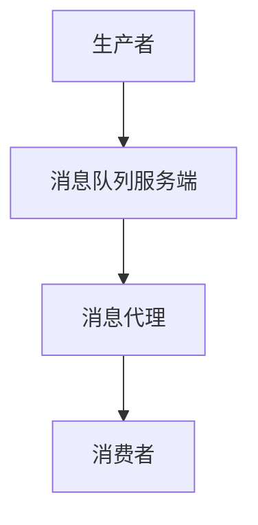

                 

关键词：消息队列，原理，代码实例，分布式系统，异步通信，队列管理，性能优化，应用场景

> 摘要：本文将深入探讨消息队列的基本原理、架构设计，以及如何利用消息队列实现高效的异步通信。通过实际代码实例，我们将详细了解消息队列在分布式系统中的应用，并探讨如何优化消息队列的性能。

## 1. 背景介绍

在当今的分布式系统中，消息队列扮演着至关重要的角色。它能够实现异步通信，解耦系统模块，提高系统的可扩展性和灵活性。消息队列是一种数据结构，允许生产者将消息发送到队列中，然后消费者从队列中取出消息进行处理。

消息队列的主要作用包括：

- **异步处理**：允许生产者和消费者在不同的时间处理消息，提高系统的响应速度。
- **解耦系统**：通过消息队列隔离系统的不同模块，降低模块间的耦合度，提高系统的可维护性。
- **削峰填谷**：处理突发流量，确保系统稳定运行。
- **扩展性**：支持水平扩展，轻松增加系统处理能力。

## 2. 核心概念与联系

### 2.1. 消息队列的基本概念

- **生产者（Producer）**：负责生成消息并将其发送到消息队列中。
- **消费者（Consumer）**：从消息队列中获取消息并进行处理。

### 2.2. 消息队列的工作原理

消息队列的工作原理可以概括为以下几个步骤：

1. **生产者发送消息**：生产者将消息发送到消息队列。
2. **消息存储**：消息队列将消息存储在内存或磁盘上。
3. **消费者获取消息**：消费者从消息队列中获取消息进行处理。
4. **消息处理**：消费者处理消息后，可能需要更新数据库或执行其他操作。

### 2.3. 消息队列的架构设计

消息队列的架构设计通常包括以下组件：

- **消息队列服务端**：负责接收、存储和转发消息。
- **消息代理**：用于路由消息，确保消息发送到正确的消费者。
- **消息客户端**：用于发送和接收消息。

下面是一个简单的 Mermaid 流程图，展示了消息队列的基本架构：



## 3. 核心算法原理 & 具体操作步骤

### 3.1. 算法原理概述

消息队列的核心算法主要包括消息的发送、存储和获取。以下是对这些算法的简要概述：

- **消息发送算法**：生产者将消息序列化后发送到消息队列。
- **消息存储算法**：消息队列将消息存储在内存或磁盘上，并维护消息的顺序。
- **消息获取算法**：消费者从消息队列中按照一定的策略获取消息进行处理。

### 3.2. 算法步骤详解

#### 3.2.1. 消息发送算法

1. 生产者生成消息。
2. 生产者将消息序列化，通常使用 JSON 或 XML 格式。
3. 生产者通过网络发送消息到消息队列。

#### 3.2.2. 消息存储算法

1. 消息队列接收到消息后，将其存储在内存或磁盘上。
2. 消息队列维护一个消息索引，用于快速查找消息。

#### 3.2.3. 消息获取算法

1. 消费者连接到消息队列。
2. 消费者从消息队列中获取消息。
3. 消费者处理消息，并确认消息已处理。

### 3.3. 算法优缺点

#### 优点

- **异步处理**：消息队列支持异步通信，生产者和消费者可以在不同的时间处理消息。
- **解耦系统**：通过消息队列隔离系统模块，降低模块间的耦合度。
- **高可用性**：消息队列通常支持高可用性，确保系统稳定运行。

#### 缺点

- **延迟**：由于异步通信，消息队列可能会引入一定的延迟。
- **复杂性**：消息队列的设计和部署相对复杂。

### 3.4. 算法应用领域

消息队列在分布式系统中有着广泛的应用，以下是一些常见的应用领域：

- **订单处理系统**：实现订单的异步处理，提高系统性能。
- **消息推送系统**：实现消息的异步推送，提高用户体验。
- **大数据处理系统**：实现数据流的异步处理，提高数据处理效率。

## 4. 数学模型和公式 & 详细讲解 & 举例说明

### 4.1. 数学模型构建

消息队列的数学模型可以简化为以下公式：

$$
Q = \sum_{i=1}^{n} p_i \cdot c_i
$$

其中：

- $Q$ 表示消息队列的总吞吐量。
- $p_i$ 表示生产者 $i$ 的消息发送速率。
- $c_i$ 表示消费者 $i$ 的消息处理速率。

### 4.2. 公式推导过程

假设我们有 $n$ 个生产者和 $m$ 个消费者。每个生产者 $i$ 的消息发送速率为 $p_i$，每个消费者 $j$ 的消息处理速率为 $c_j$。消息队列的总吞吐量 $Q$ 可以表示为：

$$
Q = \sum_{i=1}^{n} p_i \cdot c_i
$$

其中：

- $p_i$ 表示生产者 $i$ 的消息发送速率，单位为条/秒。
- $c_i$ 表示消费者 $i$ 的消息处理速率，单位为条/秒。

### 4.3. 案例分析与讲解

假设我们有一个订单处理系统，其中有两个生产者（订单生成模块和库存更新模块）和两个消费者（订单处理模块和库存更新模块）。生产者和消费者的消息处理速率如下表所示：

| 生产者/消费者 | 消息处理速率（条/秒） |
| ------------- | ------------------- |
| 订单生成模块 | 10                  |
| 库存更新模块 | 5                   |
| 订单处理模块 | 8                   |
| 库存更新模块 | 3                   |

根据上述数据，我们可以计算出消息队列的总吞吐量：

$$
Q = 10 \cdot 8 + 5 \cdot 3 = 80 + 15 = 95
$$

因此，消息队列的总吞吐量为 95 条/秒。

## 5. 项目实践：代码实例和详细解释说明

### 5.1. 开发环境搭建

在本篇代码实例中，我们将使用 RabbitMQ 作为消息队列服务。以下是搭建 RabbitMQ 开发环境的步骤：

1. 安装 RabbitMQ：
    ```bash
    sudo apt-get update
    sudo apt-get install rabbitmq-server
    ```

2. 启动 RabbitMQ 服务：
    ```bash
    sudo systemctl start rabbitmq-server
    ```

3. 登录 RabbitMQ 控制台：
    ```bash
    rabbitmq-plugins enable rabbitmq_management
    open http://localhost:15672
    ```

### 5.2. 源代码详细实现

以下是一个简单的 RabbitMQ 消息队列示例，包括生产者和消费者的代码实现。

#### 生产者代码

```python
import pika

# 连接到 RabbitMQ
connection = pika.BlockingConnection(pika.ConnectionParameters('localhost'))
channel = connection.channel()

# 声明队列
channel.queue_declare(queue='task_queue', durable=True)

# 发送消息
for i in range(10):
    message = f'Hello World! {i}'
    channel.basic_publish(
        exchange='',
        routing_key='task_queue',
        body=message,
        properties=pika.BasicProperties(delivery_mode=2)  # 消息持久化
    )
    print(f'Sent {message}')

# 关闭连接
connection.close()
```

#### 消费者代码

```python
import pika

# 连接到 RabbitMQ
connection = pika.BlockingConnection(pika.ConnectionParameters('localhost'))
channel = connection.channel()

# 声明队列
channel.queue_declare(queue='task_queue', durable=True)

# 定义消息处理函数
def callback(ch, method, properties, body):
    print(f'Received {body}')
    # 处理消息（例如：更新数据库等）
    # ...

# 消费消息
channel.basic_consume(
    queue='task_queue',
    on_message_callback=callback,
    auto_ack=True  # 自动确认消息已处理
)

channel.start_consuming()
```

### 5.3. 代码解读与分析

在这个示例中，我们首先连接到 RabbitMQ，然后声明一个名为 `task_queue` 的持久化队列。生产者将消息发送到这个队列，消费者从队列中获取消息进行处理。

生产者代码的关键部分是：

```python
channel.basic_publish(
    exchange='',
    routing_key='task_queue',
    body=message,
    properties=pika.BasicProperties(delivery_mode=2)  # 消息持久化
)
```

这里，我们使用 `delivery_mode=2` 设置消息为持久化，确保消息在 RabbitMQ 重启时不会丢失。

消费者代码的关键部分是：

```python
channel.basic_consume(
    queue='task_queue',
    on_message_callback=callback,
    auto_ack=True  # 自动确认消息已处理
)
```

这里，我们设置了 `auto_ack=True`，表示消费者在处理消息后自动确认消息已处理。

### 5.4. 运行结果展示

运行生产者代码后，我们会看到以下输出：

```bash
Sent Hello World! 0
Sent Hello World! 1
Sent Hello World! 2
Sent Hello World! 3
Sent Hello World! 4
Sent Hello World! 5
Sent Hello World! 6
Sent Hello World! 7
Sent Hello World! 8
Sent Hello World! 9
```

运行消费者代码后，我们会看到以下输出：

```bash
Received Hello World! 0
Received Hello World! 1
Received Hello World! 2
Received Hello World! 3
Received Hello World! 4
Received Hello World! 5
Received Hello World! 6
Received Hello World! 7
Received Hello World! 8
Received Hello World! 9
```

这表明生产者成功将消息发送到队列，消费者也成功从队列中获取并处理了消息。

## 6. 实际应用场景

消息队列在许多实际应用场景中都有广泛的应用。以下是一些典型的应用场景：

- **订单处理系统**：用于处理订单生成、更新和确认等操作。
- **消息推送系统**：用于发送通知、消息和提醒等。
- **任务队列**：用于处理批处理任务和后台作业。
- **日志收集系统**：用于收集和分析系统日志。

在这些应用场景中，消息队列能够实现异步通信，解耦系统模块，提高系统的性能和可扩展性。

## 7. 工具和资源推荐

### 7.1. 学习资源推荐

- **《消息队列原理与实战》**：一本关于消息队列的入门书籍，涵盖了消息队列的原理和实战应用。
- **RabbitMQ 官方文档**：提供了 RabbitMQ 的详细文档和教程，帮助开发者更好地理解和使用 RabbitMQ。
- **Apache Kafka 官方文档**：提供了 Apache Kafka 的详细文档和教程，Kafka 是另一种流行的消息队列系统。

### 7.2. 开发工具推荐

- **Postman**：一个流行的 API 测试工具，可以用于测试 RabbitMQ API。
- **Docker**：用于容器化 RabbitMQ，方便部署和管理。

### 7.3. 相关论文推荐

- **"Message Queue: Theory and Practice"**：一篇关于消息队列的学术论文，涵盖了消息队列的理论和实践。
- **"Distributed Systems: Concepts and Design"**：一本关于分布式系统的经典教材，其中包含关于消息队列的章节。

## 8. 总结：未来发展趋势与挑战

### 8.1. 研究成果总结

近年来，消息队列技术取得了显著的进展，包括高性能、高可用性和可扩展性的提升。同时，分布式消息队列系统（如 Apache Kafka、RabbitMQ）在工业界得到了广泛的应用。

### 8.2. 未来发展趋势

- **性能优化**：随着数据规模的不断扩大，消息队列的性能优化将成为重要研究方向。
- **安全性**：消息队列的安全性问题，如数据泄露和未授权访问，将得到更多的关注。
- **多样化应用**：消息队列将在更多领域得到应用，如物联网、实时数据处理等。

### 8.3. 面临的挑战

- **复杂性**：消息队列的设计和部署相对复杂，需要开发者和运维团队具备较高的技能水平。
- **稳定性**：消息队列系统需要确保高可用性，以应对突发流量和故障。

### 8.4. 研究展望

未来，消息队列技术将继续朝着高性能、高可用性和易用性的方向发展。同时，研究者将关注消息队列在新兴领域（如边缘计算、实时数据处理）的应用。此外，消息队列与其他分布式系统（如分布式数据库、分布式存储）的融合也将是一个重要研究方向。

## 9. 附录：常见问题与解答

### 9.1. 问题 1：消息队列与传统的数据库队列有何区别？

**解答**：消息队列与传统的数据库队列在数据结构和用途上有很大的区别。数据库队列通常用于存储和检索数据，而消息队列主要用于实现异步通信和解耦系统模块。消息队列通常具有更高的性能和可扩展性，可以处理大规模的数据流。

### 9.2. 问题 2：消息队列中的消息是否会丢失？

**解答**：消息队列通常提供了消息持久化和确认机制，以确保消息不会丢失。生产者在发送消息时可以设置消息持久化，使得消息在队列中存储在磁盘上。消费者在处理消息后需要发送确认消息给队列，以告知队列消息已处理。如果消费者未能发送确认消息，队列将重新发送消息。

### 9.3. 问题 3：如何确保消息队列的高可用性？

**解答**：确保消息队列的高可用性可以通过以下方法实现：

- **副本**：部署消息队列的副本，确保在主节点故障时，副本可以自动接管。
- **负载均衡**：使用负载均衡器，将消息均匀地分发到多个队列节点，提高系统的处理能力。
- **故障检测**：定期检测消息队列节点的状态，确保系统在故障时能够自动恢复。

### 9.4. 问题 4：消息队列是否可以支持事务？

**解答**：部分消息队列系统（如 Apache Kafka）支持事务。事务可以确保消息队列中的操作原子性，从而保证数据的一致性。然而，事务处理可能会降低消息队列的性能，因此需要根据具体应用场景进行权衡。

### 9.5. 问题 5：如何监控消息队列的性能？

**解答**：监控消息队列的性能可以通过以下方法实现：

- **日志分析**：分析消息队列的日志，查看消息的处理速度、队列长度等指标。
- **监控工具**：使用第三方监控工具（如 Prometheus、Grafana），实时监控消息队列的性能指标。
- **压力测试**：使用压力测试工具（如 Apache JMeter），模拟高负载场景，评估消息队列的性能。

作者：禅与计算机程序设计艺术 / Zen and the Art of Computer Programming

----------------------------------------------------------------

文章撰写完毕，以上就是关于消息队列原理与代码实例讲解的完整内容。希望对您有所帮助！

