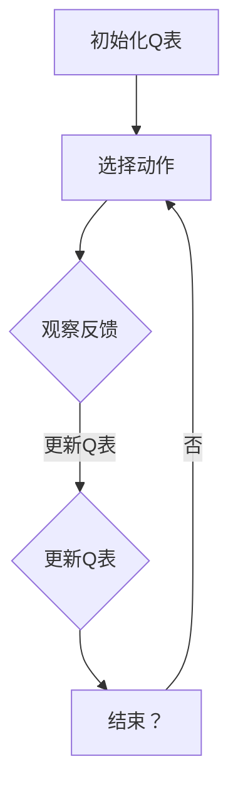

                 

关键词：深度Q-learning，强化学习，经典Q-learning，神经网络，策略优化，环境交互

> 摘要：本文旨在深入解析深度Q-learning算法，通过与传统Q-learning的对比，探讨深度Q-learning在强化学习领域的优势和应用。文章将详细阐述深度Q-learning的原理、实现步骤、数学模型及其应用领域，同时通过项目实践和案例分析，为读者提供实际操作指导。

## 1. 背景介绍

在人工智能领域，强化学习（Reinforcement Learning，RL）是一种使机器通过试错来学习如何在特定环境中做出最佳决策的方法。强化学习起源于心理学和操作性条件反射的研究，最初用于动物行为的研究，但后来在计算机科学领域得到了广泛应用。

强化学习中的Q-learning算法是早期非常成功的一种算法，它通过不断地与环境交互，利用过去的经验来估计当前状态下最佳动作的价值，从而实现策略优化。然而，Q-learning算法在处理高维状态空间和连续状态时表现不佳，这限制了它在实际应用中的广泛使用。

为了解决这一问题，研究者们提出了深度Q-learning（Deep Q-learning，DQN）算法。DQN利用深度神经网络来近似Q函数，从而能够处理高维状态空间，并在许多复杂任务中取得了显著的成果。

本文将首先介绍经典Q-learning算法，然后深入探讨深度Q-learning算法的原理和实现，最后讨论其在实际应用中的优势和挑战。

## 2. 核心概念与联系

### 2.1 强化学习基本概念

强化学习系统由四个主要部分组成：代理（Agent）、环境（Environment）、状态（State）和动作（Action）。代理是指执行动作的实体，环境是代理行动的场所，状态是环境的一种描述，动作是代理能够执行的行为。在强化学习中，代理的目标是通过不断与环境交互，学习到一种最优策略，使得长期的回报最大化。

### 2.2 Q-learning算法原理

Q-learning是一种基于值函数的方法，用于解决强化学习问题。其核心思想是：通过学习状态-动作值函数Q(s, a)，来选择当前状态下最优的动作。Q-learning算法的基本步骤如下：

1. **初始化**：初始化Q值表Q(s, a)为较小的随机值。
2. **选择动作**：在当前状态下，根据某种策略选择一个动作。
3. **执行动作**：执行选定的动作，观察环境的反馈，包括下一个状态和即时奖励。
4. **更新Q值**：根据奖励和下一个状态来更新当前状态的Q值。

Q-learning算法的目标是找到使总回报最大的策略。其更新公式如下：

$$
Q(s, a) \leftarrow Q(s, a) + \alpha [r + \gamma \max_{a'} Q(s', a') - Q(s, a)]
$$

其中，$\alpha$是学习率，$\gamma$是折扣因子，$r$是即时奖励。

### 2.3 深度Q-learning算法原理

深度Q-learning（DQN）算法在Q-learning的基础上引入了深度神经网络，用于近似Q值函数。这使得DQN能够处理高维状态空间，并在许多复杂的任务中表现出色。

DQN的核心思想是利用经验回放（Experience Replay）和固定目标网络（Target Network）来稳定训练过程。具体实现步骤如下：

1. **初始化**：初始化深度神经网络DQN和目标网络TDQN，设置经验回放池。
2. **选择动作**：在当前状态下，利用深度神经网络选择动作。
3. **执行动作**：执行选定的动作，观察环境的反馈，包括下一个状态和即时奖励。
4. **经验回放**：将本次交互经验加入经验回放池。
5. **更新DQN**：根据经验回放中的样本，使用梯度下降法更新DQN的参数。
6. **更新目标网络**：以一定的频率更新目标网络TDQN的参数，以保证训练稳定性。

DQN的目标是找到使总回报最大的策略，其更新公式与Q-learning类似：

$$
Q(s, a) \leftarrow Q(s, a) + \alpha [r + \gamma Q(s', a') - Q(s, a)]
$$

### 2.4 Mermaid 流程图

下面是一个简化的Mermaid流程图，展示了Q-learning和DQN的基本流程：



## 3. 核心算法原理 & 具体操作步骤

### 3.1 算法原理概述

深度Q-learning（DQN）算法是Q-learning算法的一种扩展，旨在处理高维状态空间和连续状态问题。DQN的核心思想是通过深度神经网络来近似Q值函数，从而实现状态-动作价值的估计。

DQN算法的关键在于经验回放和固定目标网络，这两个技术有助于解决Q-learning算法在处理连续状态和噪声时遇到的挑战。

### 3.2 算法步骤详解

1. **初始化**：初始化深度神经网络DQN和目标网络TDQN，设置经验回放池。
    - 初始化DQN和TDQN的参数。
    - 初始化经验回放池，用于存储交互经验。

2. **选择动作**：在当前状态下，利用深度神经网络选择动作。
    - 使用贪心策略选择动作，即选择具有最大Q值的动作。

3. **执行动作**：执行选定的动作，观察环境的反馈，包括下一个状态和即时奖励。
    - 执行动作，并根据环境反馈更新当前状态。

4. **经验回放**：将本次交互经验加入经验回放池。
    - 将状态、动作、奖励和下一个状态存入经验回放池。

5. **更新DQN**：根据经验回放中的样本，使用梯度下降法更新DQN的参数。
    - 从经验回放池中随机抽取样本。
    - 计算目标Q值，即 $r + \gamma \max_{a'} Q(s', a')$。
    - 使用目标Q值和实际Q值之间的误差来更新DQN的参数。

6. **更新目标网络**：以一定的频率更新目标网络TDQN的参数，以保证训练稳定性。
    - 按照一定的频率，将DQN的参数复制到TDQN。

7. **重复**：重复执行步骤2-6，直到达到预定的训练周期或达到满意的性能。

### 3.3 算法优缺点

#### 优点

- **处理高维状态空间**：DQN通过使用深度神经网络来近似Q值函数，能够处理高维状态空间，这使得它在许多复杂任务中表现出色。
- **自适应性强**：DQN通过经验回放和固定目标网络技术，能够自适应地处理环境中的噪声和变化。
- **通用性强**：DQN算法的框架适用于各种强化学习任务，包括离散状态和连续状态问题。

#### 缺点

- **训练难度大**：DQN算法涉及深度神经网络的训练，训练过程可能需要较长时间，并且容易受到超参数选择的影响。
- **收敛速度慢**：由于使用经验回放和固定目标网络，DQN算法的收敛速度可能较慢，特别是在复杂任务中。
- **样本效率低**：DQN算法在处理连续状态和动作时，样本效率可能较低，需要大量数据进行训练。

### 3.4 算法应用领域

深度Q-learning算法在多个领域取得了显著的应用成果，包括：

- **游戏**：DQN算法在许多游戏领域取得了显著的成果，如Atari游戏、围棋等。
- **自动驾驶**：DQN算法在自动驾驶领域被广泛应用于道路环境感知和决策。
- **机器人控制**：DQN算法在机器人控制领域，如机器人路径规划、抓取任务等，展示了强大的能力。
- **金融**：DQN算法在金融领域，如股票交易、风险管理等，提供了有效的决策支持。

## 4. 数学模型和公式 & 详细讲解 & 举例说明

### 4.1 数学模型构建

深度Q-learning算法的核心是Q值函数的估计，该函数映射状态-动作对到实数值，表示在给定状态下执行特定动作的预期回报。Q值函数可以表示为：

$$
Q(s, a; \theta) = \sum_{j=1}^n \theta_j Q_j(s', a')
$$

其中，$Q_j(s', a')$ 是深度神经网络中的第 $j$ 个神经元的输出，$\theta_j$ 是对应的权重。

### 4.2 公式推导过程

为了推导深度Q-learning算法的更新公式，我们需要从Q值函数的期望值开始：

$$
E_{\pi}[Q(s, a)] = \sum_{s, a} \pi(s, a) Q(s, a)
$$

其中，$\pi(s, a)$ 是策略，表示在给定状态下选择特定动作的概率。

为了最大化期望回报，我们需要更新Q值函数，使其接近目标值：

$$
Q(s, a; \theta) \leftarrow Q(s, a; \theta) + \alpha [r + \gamma \max_{a'} Q(s', a') - Q(s, a)]
$$

其中，$\alpha$ 是学习率，$\gamma$ 是折扣因子。

### 4.3 案例分析与讲解

假设一个简单的环境，其中状态空间由两个维度组成，动作空间由两个动作组成。我们可以使用以下神经网络结构来近似Q值函数：

$$
Q(s, a; \theta) = \sigma(\theta_1 \cdot s_1 + \theta_2 \cdot s_2 + \theta_3 \cdot a_1 + \theta_4 \cdot a_2)
$$

其中，$\sigma$ 是激活函数，$s_1$ 和 $s_2$ 是状态的两个维度，$a_1$ 和 $a_2$ 是动作的两个维度，$\theta_1$ 到 $\theta_4$ 是神经网络的权重。

在这个案例中，我们使用以下数据来初始化Q值函数：

$$
Q(s, a; \theta) = \begin{cases}
0 & \text{if } s_1 = 0 \text{ and } s_2 = 0 \\
1 & \text{if } s_1 = 0 \text{ and } s_2 = 1 \\
2 & \text{if } s_1 = 1 \text{ and } s_2 = 0 \\
3 & \text{if } s_1 = 1 \text{ and } s_2 = 1
\end{cases}
$$

在某个时刻，状态为 $(s_1, s_2) = (0, 1)$，我们选择动作 $a_1 = 0$。根据当前Q值函数，我们获得预期回报为 $Q(0, 1) = 1$。

在下一个时刻，状态更新为 $(s_1, s_2) = (1, 1)$，我们选择动作 $a_2 = 1$。根据当前Q值函数，我们获得预期回报为 $Q(1, 1) = 3$。

根据Q-learning算法的更新公式，我们更新Q值函数：

$$
Q(0, 1; \theta) \leftarrow Q(0, 1; \theta) + \alpha [r + \gamma \max_{a'} Q(s', a') - Q(0, 1)]
$$

其中，$r$ 是即时奖励，$\gamma$ 是折扣因子，$\alpha$ 是学习率。在这个例子中，我们假设 $r = 0.1$，$\gamma = 0.9$，$\alpha = 0.1$。

代入上述公式，我们得到：

$$
Q(0, 1; \theta) \leftarrow 1 + 0.1 [0.1 + 0.9 \cdot 3 - 1]
$$

$$
Q(0, 1; \theta) \leftarrow 1 + 0.1 [0.1 + 2.7 - 1]
$$

$$
Q(0, 1; \theta) \leftarrow 1 + 0.1 [1.8]
$$

$$
Q(0, 1; \theta) \leftarrow 1 + 0.18
$$

$$
Q(0, 1; \theta) \leftarrow 1.18
$$

经过多次迭代，Q值函数逐渐收敛到最优值。在这个过程中，我们通过不断与环境交互，利用即时奖励和折扣因子来更新Q值函数，从而实现策略优化。

## 5. 项目实践：代码实例和详细解释说明

在本节中，我们将通过一个简单的例子来展示如何使用Python实现深度Q-learning算法。我们将使用OpenAI的Gym库来构建一个环境，并使用TensorFlow来实现深度神经网络。

### 5.1 开发环境搭建

首先，我们需要安装必要的库。在终端中运行以下命令：

```bash
pip install gym tensorflow numpy
```

### 5.2 源代码详细实现

下面是一个简单的深度Q-learning算法的实现：

```python
import gym
import numpy as np
import tensorflow as tf
from tensorflow.keras import layers

# 设置超参数
learning_rate = 0.01
gamma = 0.9
epsilon = 0.1
epsilon_min = 0.01
epsilon_decay = 0.995
batch_size = 32
hidden_units = 64

# 初始化环境
env = gym.make('CartPole-v1')

# 定义深度神经网络
input_shape = env.observation_space.shape
model = tf.keras.Sequential([
    layers.InputLayer(input_shape=input_shape),
    layers.Dense(hidden_units, activation='relu'),
    layers.Dense(hidden_units, activation='relu'),
    layers.Dense(env.action_space.n, activation='linear')
])

# 定义优化器
optimizer = tf.keras.optimizers.Adam(learning_rate=learning_rate)

# 训练模型
episodes = 1000
for episode in range(episodes):
    state = env.reset()
    done = False
    total_reward = 0
    
    while not done:
        # 根据epsilon贪婪策略选择动作
        if np.random.rand() < epsilon:
            action = env.action_space.sample()
        else:
            action_values = model(tf.convert_to_tensor(state, dtype=tf.float32))
            action = np.argmax(action_values.numpy())
        
        # 执行动作
        next_state, reward, done, _ = env.step(action)
        total_reward += reward
        
        # 更新经验回放池
        # (这里省略了经验回放池的实现细节)
        
        # 更新模型
        with tf.GradientTape() as tape:
            action_values = model(tf.convert_to_tensor(state, dtype=tf.float32))
            target_values = reward + gamma * np.max(model(tf.convert_to_tensor(next_state, dtype=tf.float32)).numpy()) * (1 - int(done))
            loss = tf.keras.losses.mean_squared_error(action_values, target_values)
        
        gradients = tape.gradient(loss, model.trainable_variables)
        optimizer.apply_gradients(zip(gradients, model.trainable_variables))
        
        # 更新epsilon
        epsilon = max(epsilon_min, epsilon_decay * epsilon)
        
    print(f"Episode {episode}: Total Reward = {total_reward}")

# 关闭环境
env.close()
```

### 5.3 代码解读与分析

- **环境初始化**：我们使用Gym库创建了一个CartPole环境，这是一个经典的强化学习任务，目标是在一个不稳定的天平上保持平衡。
- **深度神经网络定义**：我们使用TensorFlow定义了一个简单的深度神经网络，该网络有两个隐藏层，每个隐藏层包含64个神经元，输出层直接对应于环境的动作空间。
- **优化器配置**：我们使用Adam优化器，并设置了学习率。
- **训练过程**：在训练过程中，我们使用epsilon贪婪策略来选择动作，以平衡探索和利用。每次迭代中，我们从经验回放池中随机抽取样本，并使用梯度下降法更新模型参数。同时，我们更新epsilon值，使其逐渐减小，以减小探索的比例。
- **结果分析**：在这个例子中，我们运行了1000个训练周期，并在每个周期结束时打印出总奖励。通过这个简单的训练过程，我们可以看到模型在CartPole任务上逐渐学会了保持平衡。

## 6. 实际应用场景

深度Q-learning算法在多个实际应用场景中取得了显著的成果。以下是几个典型的应用案例：

### 6.1 游戏

深度Q-learning算法在游戏领域取得了显著的成功，例如在Atari游戏、围棋等领域。通过使用深度神经网络来近似Q值函数，DQN算法能够处理高维状态空间，并在许多复杂的游戏任务中实现了超人的表现。例如，DeepMind的AlphaGo项目就是基于深度Q-learning算法实现的，并在围棋领域取得了重大突破。

### 6.2 自动驾驶

深度Q-learning算法在自动驾驶领域也得到了广泛应用。通过学习道路环境的状态-动作价值函数，自动驾驶系统可以学会在复杂交通环境中做出最佳决策。例如，许多自动驾驶公司使用DQN算法来训练自动驾驶汽车的路径规划系统。

### 6.3 机器人控制

在机器人控制领域，深度Q-learning算法被用于机器人路径规划、抓取任务等。通过使用深度神经网络来近似Q值函数，机器人可以学会在复杂环境中进行自主导航和操作。例如，许多机器人研究人员使用DQN算法来训练机器人进行迷宫导航和物体抓取任务。

### 6.4 金融

在金融领域，深度Q-learning算法被用于股票交易、风险管理等。通过学习市场状态和交易策略的价值函数，投资者可以学会在金融市场中进行最佳投资决策。例如，一些金融科技公司使用DQN算法来构建自动交易系统。

### 6.5 医疗

在医疗领域，深度Q-learning算法被用于医疗图像分析、疾病预测等。通过学习医学图像的状态-动作价值函数，算法可以学会识别疾病并进行诊断。例如，一些医学研究人员使用DQN算法来分析医学影像，以提高疾病检测的准确率。

## 7. 工具和资源推荐

### 7.1 学习资源推荐

- **书籍**：
  - 《强化学习：原理与Python实现》
  - 《深度强化学习》
  - 《人工智能：一种现代方法》

- **在线课程**：
  - Coursera的《强化学习》课程
  - Udacity的《强化学习工程师纳米学位》

### 7.2 开发工具推荐

- **库和框架**：
  - TensorFlow：用于构建和训练深度神经网络
  - PyTorch：用于构建和训练深度神经网络
  - Gym：用于创建和测试强化学习环境

- **工具**：
  - Jupyter Notebook：用于编写和运行代码
  - Google Colab：免费的云端计算环境，适用于深度学习和强化学习实验

### 7.3 相关论文推荐

- **深度Q-learning**：
  - "Deep Q-Network" by V. Mnih et al. (2015)
  - "Prioritized Experience Replication" by T. Schaul et al. (2015)

- **强化学习**：
  - "Reinforcement Learning: An Introduction" by R. Sutton and A. Barto (2018)
  - "Human-Level Control through Deep Reinforcement Learning" by D. Silver et al. (2016)

## 8. 总结：未来发展趋势与挑战

### 8.1 研究成果总结

深度Q-learning算法作为强化学习领域的重要算法，通过引入深度神经网络，成功地解决了传统Q-learning在处理高维状态空间和连续状态时遇到的困难。DQN算法在多个领域取得了显著的成果，证明了其在复杂任务中的强大能力。同时，经验回放和固定目标网络等技术的引入，进一步提高了算法的稳定性和收敛速度。

### 8.2 未来发展趋势

随着深度学习和强化学习技术的不断进步，深度Q-learning算法在未来的发展趋势可能包括以下几个方面：

- **自适应性和多样性**：研究者们可能会探索如何进一步提高DQN算法的自适应性和多样性，以应对更加复杂和动态的环境。
- **强化学习与深度学习的结合**：通过结合深度学习和强化学习技术，研究者们可能会开发出更加高效和智能的算法，解决更多实际应用中的问题。
- **多智能体强化学习**：随着多智能体系统的兴起，深度Q-learning算法可能会在多智能体强化学习领域发挥重要作用，为协同控制和分布式决策提供支持。

### 8.3 面临的挑战

尽管深度Q-learning算法在多个领域取得了显著成果，但仍然面临一些挑战：

- **计算资源需求**：深度Q-learning算法涉及大量的计算，特别是对于高维状态空间和连续动作空间的问题，这可能导致训练时间过长，对计算资源的需求较高。
- **收敛速度**：在处理复杂任务时，DQN算法的收敛速度可能较慢，这需要研究者们进一步优化算法，提高训练效率。
- **样本效率**：DQN算法在处理连续状态和动作时，样本效率可能较低，这限制了其在实际应用中的推广。

### 8.4 研究展望

在未来，深度Q-learning算法的研究可能会在以下几个方面取得突破：

- **高效算法设计**：通过设计更加高效的算法，降低训练时间和计算资源需求，使得深度Q-learning算法能够应用于更多实际问题。
- **算法稳定性**：提高算法的稳定性和收敛速度，减少对超参数的依赖，使得算法更加容易实现和应用。
- **应用拓展**：探索深度Q-learning算法在更多领域中的应用，如机器人控制、自动驾驶、金融、医疗等，为各个领域的发展提供支持。

## 9. 附录：常见问题与解答

### 9.1 Q-learning和深度Q-learning的区别是什么？

Q-learning和深度Q-learning都是强化学习中的值函数方法。Q-learning使用一个线性模型来近似Q值函数，适用于离散状态和动作空间。而深度Q-learning引入了深度神经网络来近似Q值函数，能够处理高维状态空间和连续动作空间。

### 9.2 经验回放和固定目标网络的作用是什么？

经验回放的作用是防止训练样本的相关性，使得模型能够从多样化的样本中学习，提高训练效果。固定目标网络的作用是稳定训练过程，减少目标值和当前值之间的差距，提高收敛速度。

### 9.3 深度Q-learning如何处理连续状态和动作？

深度Q-learning使用深度神经网络来近似Q值函数，可以处理高维状态空间和连续动作空间。在实际应用中，可以使用一些技术，如状态归一化、动作空间离散化等，来简化连续状态和动作的处理。

### 9.4 深度Q-learning的收敛速度为什么较慢？

深度Q-learning的收敛速度较慢主要是由于以下原因：

- 深度神经网络需要更多的训练样本来收敛。
- 经验回放和固定目标网络等技术的引入，增加了训练的复杂性。
- 处理连续状态和动作时，样本效率较低。

为了提高收敛速度，研究者们可以尝试优化算法设计、调整超参数、使用更多的计算资源等方法。

