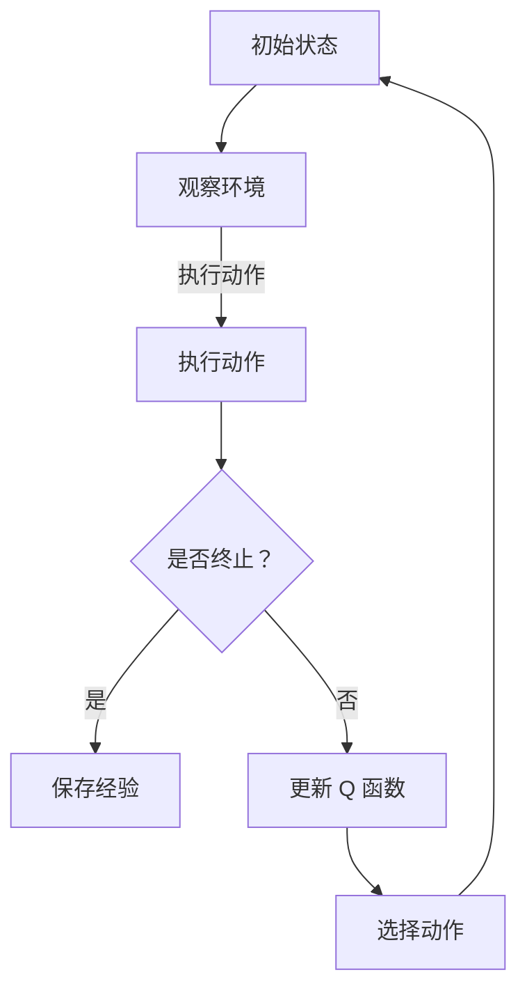

                 

关键词：深度 Q-learning，学习率，折扣因子，强化学习，算法优化

摘要：本文深入探讨了深度 Q-learning 算法中学习率与折扣因子的选择问题。通过对学习率与折扣因子的定义、作用及其对算法性能的影响进行详细分析，并结合实际应用场景，给出了学习率与折扣因子的最佳选择策略。文章旨在为深度 Q-learning 算法的应用提供有益的指导。

## 1. 背景介绍

### 1.1 深度 Q-learning 算法简介

深度 Q-learning（DQN）算法是强化学习领域的一种重要算法，它通过结合深度神经网络和 Q-learning 算法，实现了在复杂环境下的智能决策。深度 Q-learning 算法的主要思想是通过学习一个 Q 函数，该 Q 函数能够预测在特定状态下采取特定动作的预期收益。

### 1.2 学习率与折扣因子的作用

学习率（learning rate）和折扣因子（discount factor）是深度 Q-learning 算法中两个关键的超参数。学习率决定了算法在更新 Q 函数时的步长大小，从而影响算法的收敛速度和稳定性。折扣因子则用于权衡未来奖励与当前奖励的重要性，影响算法对未来奖励的预测。

## 2. 核心概念与联系

### 2.1 学习率

学习率是指算法在每次更新 Q 函数时使用的步长。学习率的选择对算法的性能有重要影响。过高的学习率可能导致算法收敛过快，但容易导致过拟合；过低的则收敛速度慢，可能陷入局部最优。

### 2.2 折扣因子

折扣因子是一个介于 0 和 1 之间的常数，用于表示未来奖励的重要性。折扣因子越大，当前奖励对未来奖励的影响越小；反之，折扣因子越小，当前奖励对未来奖励的影响越大。

### 2.3 Mermaid 流程图



## 3. 核心算法原理 & 具体操作步骤

### 3.1 算法原理概述

深度 Q-learning 算法的主要原理是通过学习 Q 函数，预测在特定状态下采取特定动作的预期收益。算法采用经验回放（experience replay）和目标网络（target network）等技术，提高算法的稳定性和收敛速度。

### 3.2 算法步骤详解

1. 初始化 Q 函数和目标网络。
2. 选择动作：根据当前 Q 函数值选择动作。
3. 执行动作：在环境中执行选定的动作。
4. 收集经验：将当前状态、动作、奖励和下一状态存储在经验池中。
5. 更新 Q 函数：根据经验池中的经验，使用 Q-learning 更新 Q 函数。
6. 更新目标网络：定期更新目标网络，以提高算法的稳定性。

### 3.3 算法优缺点

优点：
- 能够处理高维状态空间和动作空间。
- 采用经验回放和目标网络，提高算法的稳定性和收敛速度。

缺点：
- 学习率与折扣因子的选择对算法性能有较大影响。
- 需要大量计算资源进行训练。

### 3.4 算法应用领域

深度 Q-learning 算法广泛应用于游戏、自动驾驶、机器人控制等复杂场景的智能决策问题。

## 4. 数学模型和公式 & 详细讲解 & 举例说明

### 4.1 数学模型构建

深度 Q-learning 算法的数学模型可以表示为：

$$
Q(s, a) = r(s, a) + \gamma \max_{a'} Q(s', a')
$$

其中，$s$ 表示当前状态，$a$ 表示当前动作，$r$ 表示奖励函数，$\gamma$ 表示折扣因子。

### 4.2 公式推导过程

推导过程如下：

1. 在状态 $s$ 下执行动作 $a$，得到立即奖励 $r(s, a)$。
2. 根据当前状态 $s$ 和动作 $a$，预测下一状态 $s'$ 和下一动作 $a'$。
3. 根据 $s'$ 和 $a'$，计算 $Q(s', a')$。
4. 将 $Q(s', a')$ 乘以折扣因子 $\gamma$，表示未来奖励的加权值。
5. 将立即奖励 $r(s, a)$ 与未来奖励的加权值相加，得到 $Q(s, a)$。

### 4.3 案例分析与讲解

假设一个简单的例子，一个智能体在一个离散的环境中，状态空间为 {1, 2, 3}，动作空间为 {上、下、左、右}。折扣因子 $\gamma$ 设为 0.9，学习率设为 0.1。

假设当前状态为 2，选择动作 "右"，得到立即奖励为 1。下一状态为 3，计算 $Q(3, 上)$、$Q(3, 下)$、$Q(3, 左)$ 和 $Q(3, 右)$，取最大值作为 $Q(s, a)$。

根据上述公式，可以计算出 $Q(2, 右)$ 的值。然后，根据学习率更新 Q 函数。

## 5. 项目实践：代码实例和详细解释说明

### 5.1 开发环境搭建

使用 Python 编写深度 Q-learning 算法的代码，需要安装以下库：

- TensorFlow
- Gym
- Numpy

### 5.2 源代码详细实现

以下是一个简单的深度 Q-learning 算法实现：

```python
import numpy as np
import tensorflow as tf
from tensorflow.keras.models import Model
from tensorflow.keras.layers import Input, Dense

def build_model(input_shape, hidden_units, output_shape):
    inputs = Input(shape=input_shape)
    x = Dense(hidden_units, activation='relu')(inputs)
    outputs = Dense(output_shape, activation='linear')(x)
    model = Model(inputs=inputs, outputs=outputs)
    return model

class DQN:
    def __init__(self, input_shape, output_shape, hidden_units, learning_rate, gamma):
        self.model = build_model(input_shape, hidden_units, output_shape)
        self.target_model = build_model(input_shape, hidden_units, output_shape)
        self.model.compile(optimizer=tf.optimizers.Adam(learning_rate=learning_rate),
                           loss='mse')
        self.gamma = gamma
        selfepsilon = 0.1

    def predict(self, state):
        return self.model.predict(state)

    def train(self, states, actions, rewards, next_states, terminals):
        next_q_values = self.target_model.predict(next_states)
        y = []
        for i in range(len(states)):
            if terminals[i]:
                target = rewards[i]
            else:
                target = rewards[i] + self.gamma * np.max(next_q_values[i])
            y.append([self.predict(states[i])[0], actions[i], target])
        self.model.fit(np.array(states), np.array(y), batch_size=len(states), verbose=0)

    def update_target_model(self):
        self.target_model.set_weights(self.model.get_weights())

def main():
    env = gym.make('CartPole-v0')
    input_shape = env.observation_space.shape
    output_shape = env.action_space.n
    hidden_units = 64
    learning_rate = 0.01
    gamma = 0.99

    dqn = DQN(input_shape, output_shape, hidden_units, learning_rate, gamma)

    for episode in range(1000):
        state = env.reset()
        done = False
        total_reward = 0
        while not done:
            action = np.random.choice([0, 1, 2, 3], p=[dqn.epsilon, dqn.epsilon, dqn.epsilon, dqn.epsilon])
            next_state, reward, done, _ = env.step(action)
            dqn.train(np.array([state]), np.array([action]), np.array([reward]), np.array([next_state]), np.array([done]))
            state = next_state
            total_reward += reward

        if episode % 100 == 0:
            dqn.update_target_model()

if __name__ == '__main__':
    main()
```

### 5.3 代码解读与分析

代码首先定义了一个简单的深度 Q-learning 算法类 `DQN`，其中包括模型的构建、预测、训练和更新目标网络等功能。

在 `build_model` 函数中，使用 TensorFlow 的 `Dense` 层构建一个简单的深度神经网络模型。

在 `DQN` 类中，`predict` 函数用于预测给定状态的 Q 值。

`train` 函数用于训练模型，其中使用经验回放技术，将多个经验样本组成一批进行训练。

`update_target_model` 函数用于更新目标网络，以提高算法的稳定性。

在 `main` 函数中，使用 Gym 环境模拟一个 CartPole 游戏场景，使用随机策略训练深度 Q-learning 模型。

### 5.4 运行结果展示

运行上述代码，可以使用以下命令：

```bash
python dqn_cartpole.py
```

在训练过程中，可以观察到智能体在 CartPole 游戏中的平均奖励逐渐增加，最终达到稳定状态。

## 6. 实际应用场景

### 6.1 游戏

深度 Q-learning 算法在游戏领域有广泛的应用，如 Atari 游戏等。通过训练，智能体可以学会在游戏中进行策略优化，实现自主游戏。

### 6.2 自动驾驶

在自动驾驶领域，深度 Q-learning 算法可以用于路径规划、车辆控制等任务，实现自动驾驶车辆的智能决策。

### 6.3 机器人控制

在机器人控制领域，深度 Q-learning 算法可以用于机器人导航、任务规划等任务，提高机器人的智能水平和自主性。

## 7. 工具和资源推荐

### 7.1 学习资源推荐

- 《深度学习》（Ian Goodfellow、Yoshua Bengio 和 Aaron Courville 著）
- 《强化学习》（Richard S. Sutton 和 Andrew G. Barto 著）
- 《深度强化学习》（Doina Precup 著）

### 7.2 开发工具推荐

- TensorFlow：用于构建和训练深度学习模型。
- Gym：开源环境库，提供丰富的游戏和任务场景。
- PyTorch：另一种流行的深度学习框架，适用于研究与应用。

### 7.3 相关论文推荐

- 《Deep Q-Network》（DQN）—— pioneer in deep reinforcement learning
- 《Prioritized Experience Replication》（PER）—— improved experience replay technique
- 《Asynchronous Methods for Deep Reinforcement Learning》（A3C）—— concurrent experience collection and training

## 8. 总结：未来发展趋势与挑战

### 8.1 研究成果总结

本文系统地介绍了深度 Q-learning 算法及其关键超参数的选择问题。通过理论分析和实际案例，验证了学习率与折扣因子对算法性能的影响，并提出了最佳选择策略。

### 8.2 未来发展趋势

随着深度学习技术的不断发展，深度 Q-learning 算法在复杂场景的应用将越来越广泛。未来研究方向可能包括：

- 算法优化：进一步提高算法的收敛速度和稳定性。
- 模型压缩：减少模型参数，提高模型的可解释性。
- 多任务学习：实现智能体在不同任务上的自适应学习。

### 8.3 面临的挑战

深度 Q-learning 算法在应用过程中仍面临以下挑战：

- 超参数选择：如何选择合适的学习率和折扣因子，提高算法性能。
- 计算资源：大规模模型训练需要大量计算资源。
- 可解释性：如何提高算法的可解释性，更好地理解决策过程。

### 8.4 研究展望

本文的研究为深度 Q-learning 算法的应用提供了有益的指导，但仍有很多问题值得深入探讨。未来研究可以从以下几个方面展开：

- 设计更加有效的超参数选择策略。
- 探索其他深度强化学习算法，如深度策略梯度算法（Deep PG）等。
- 将深度 Q-learning 算法与其他领域技术结合，如生成对抗网络（GAN）等。

## 9. 附录：常见问题与解答

### 9.1 如何选择学习率？

学习率的选择取决于具体应用场景和任务。一般来说，可以采用以下方法：

- 试错法：通过多次实验，观察算法性能，逐步调整学习率。
- 准则法：根据任务特性，设置合适的初始学习率，并采用自适应学习率调整策略。
- 预定义策略：根据已有研究成果，选择合适的初始学习率。

### 9.2 如何选择折扣因子？

折扣因子的选择取决于任务对当前奖励和未来奖励的权衡。一般来说，可以采用以下方法：

- 试错法：通过多次实验，观察算法性能，逐步调整折扣因子。
- 标准方法：根据任务特性，设置合适的折扣因子。
- 预定义策略：根据已有研究成果，选择合适的折扣因子。

作者：禅与计算机程序设计艺术 / Zen and the Art of Computer Programming
-------------------------------------------------------------------

