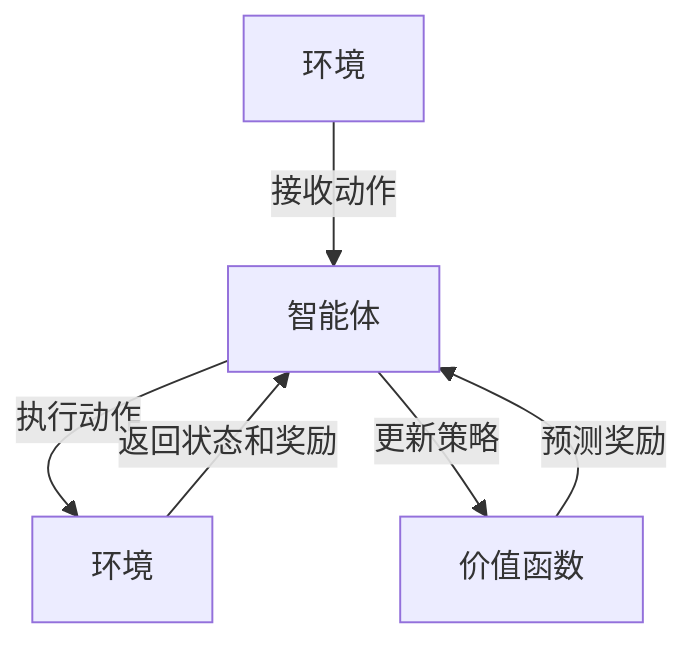

                 

关键词：深度学习，Q-learning，预测，强化学习，人工智能，机器学习，深度神经网络，决策过程

> 摘要：本文将深入探讨深度 Q-learning 算法，这是一种结合了深度学习和强化学习技术的先进算法，它在复杂环境中的决策能力得到了广泛的认可。本文旨在为读者提供一个全面的技术解读，涵盖从基础概念到实际应用的各个层面，帮助理解深度 Q-learning 的原理、实现和应用，以及其未来的发展前景。

## 1. 背景介绍

### 1.1 强化学习的历史

强化学习（Reinforcement Learning，RL）是机器学习的一个重要分支，最早由Richard Sutton和Andrew Barto在1988年的经典教材《强化学习：一种引入行为的理论》中提出。强化学习起源于对人类学习行为的研究，并试图通过模拟这种方式来训练机器完成特定任务。

强化学习的基本思想是：通过试错（trial and error）和奖励机制（reward mechanism）来优化策略（policy），以达到最大化累积奖励（cumulative reward）的目的。这个过程中，智能体（agent）需要不断地与环境（environment）交互，通过学习来调整其行为。

### 1.2 Q-learning算法的引入

Q-learning是强化学习中的一个核心算法，由Richard Sutton和Andrew Barto在1980年代提出。Q-learning的核心思想是通过学习状态-动作价值函数（state-action value function）来预测长期奖励。

在Q-learning中，价值函数 $Q(s, a)$ 表示在状态 $s$ 下执行动作 $a$ 所能获得的预期奖励。通过不断更新这个价值函数，智能体能够逐渐学会在何种状态下选择何种动作以获得最大奖励。

### 1.3 深度 Q-learning的诞生

尽管Q-learning在许多任务中都取得了成功，但它依赖于一个线性值函数，这在处理高维状态空间时表现不佳。为了解决这个问题，深度 Q-learning（Deep Q-learning，DQN）算法应运而生。

深度 Q-learning结合了深度神经网络（Deep Neural Network，DNN）和Q-learning的原理，利用神经网络来近似状态-动作价值函数，从而能够处理更复杂、更高维的状态空间。

## 2. 核心概念与联系

### 2.1 核心概念

- **状态（State）**：描述智能体所处的环境。
- **动作（Action）**：智能体可以采取的行为。
- **奖励（Reward）**：每次动作后环境给予的即时反馈。
- **价值函数（Value Function）**：预测长期奖励的函数。
- **策略（Policy）**：智能体根据当前状态采取的动作。
- **探索（Exploration）**：智能体在不知道最佳动作时尝试新动作的过程。
- **利用（Utilization）**：智能体在已知最佳动作时采取该动作的过程。

### 2.2 核心架构的 Mermaid 流程图



### 2.3 深度 Q-learning 的基本原理

在深度 Q-learning 中，神经网络用于逼近状态-动作价值函数 $Q(s, a)$。具体来说，深度 Q-learning 的步骤如下：

1. **初始化**：初始化深度神经网络参数、目标神经网络参数以及经验回放记忆。
2. **选取动作**：根据当前状态 $s_t$ 和学习策略 $\epsilon$-greedy，选择动作 $a_t$。
3. **执行动作**：在环境中执行动作 $a_t$，得到新状态 $s_{t+1}$ 和奖励 $r_t$。
4. **更新经验**：将 $(s_t, a_t, r_t, s_{t+1})$ 对存入经验回放记忆中。
5. **目标网络更新**：按照固定时间间隔或某些触发条件，将当前神经网络的参数更新到目标神经网络。
6. **目标 Q 值计算**：使用目标神经网络计算目标 Q 值 $Q^*(s_{t+1}, a_{t+1})$。
7. **梯度下降**：通过梯度下降方法，更新当前神经网络的参数。

## 3. 核心算法原理 & 具体操作步骤

### 3.1 算法原理概述

深度 Q-learning 通过训练深度神经网络来近似状态-动作价值函数，以实现强化学习中的目标。其基本原理可概括为：

- **价值函数学习**：使用神经网络近似 $Q(s, a)$，并通过经验回放记忆和目标网络更新来优化网络参数。
- **策略迭代**：通过 $\epsilon$-greedy 策略在探索和利用之间平衡，以实现价值函数的稳定更新。

### 3.2 算法步骤详解

1. **初始化**：

   - 初始化神经网络 $Q(s, a)$ 和目标神经网络 $Q^*(s, a)$。
   - 初始化经验回放记忆池。
   - 初始化策略 $\epsilon$-greedy。

2. **选取动作**：

   - 输入当前状态 $s_t$。
   - 根据 $\epsilon$-greedy 策略选择动作 $a_t$。

3. **执行动作**：

   - 在环境中执行动作 $a_t$。
   - 接收新状态 $s_{t+1}$ 和奖励 $r_t$。

4. **更新经验**：

   - 将 $(s_t, a_t, r_t, s_{t+1})$ 对存入经验回放记忆中。

5. **目标网络更新**：

   - 按照固定时间间隔或某些触发条件，将当前神经网络的参数更新到目标神经网络。

6. **目标 Q 值计算**：

   - 使用目标神经网络计算目标 Q 值 $Q^*(s_{t+1}, a_{t+1})$。

7. **梯度下降**：

   - 通过梯度下降方法，更新当前神经网络的参数。

### 3.3 算法优缺点

#### 优点：

- **处理高维状态空间**：通过使用深度神经网络，可以处理高维状态空间，使算法具有更强的泛化能力。
- **自动特征提取**：深度神经网络能够自动提取状态的特征，减少人工特征设计的工作量。
- **动态适应**：通过不断更新价值函数，算法能够动态适应环境变化。

#### 缺点：

- **训练不稳定**：由于深度神经网络的存在，算法的训练过程可能不稳定，容易出现振荡。
- **计算复杂度高**：深度神经网络需要大量的计算资源，特别是在高维状态下。
- **目标网络滞后**：目标网络更新滞后于当前网络可能导致价值函数的收敛速度变慢。

### 3.4 算法应用领域

深度 Q-learning 在许多领域都取得了显著的成果，包括：

- **游戏**：如《Dota 2》和《Atari 游戏》的智能代理。
- **机器人**：如机器人路径规划、导航和抓取。
- **自动驾驶**：如自动驾驶车辆的决策和规划。
- **金融**：如投资组合优化和风险管理。

## 4. 数学模型和公式 & 详细讲解 & 举例说明

### 4.1 数学模型构建

深度 Q-learning 的核心是构建一个神经网络来近似状态-动作价值函数。设 $Q(s, a; \theta)$ 为深度神经网络的输出，其中 $\theta$ 是神经网络的参数。根据 Q-learning 的原理，目标函数为：

$$
L(\theta) = \mathbb{E}_{s_t, a_t \sim \pi(\cdot|s_t; \theta)} \left[ (r_t + \gamma \max_{a'} Q(s_{t+1}, a'; \theta') - Q(s_t, a_t; \theta))^2 \right]
$$

其中，$s_t$ 和 $a_t$ 分别为当前状态和动作，$r_t$ 为奖励，$\gamma$ 为折扣因子，$\pi(\cdot|s_t; \theta)$ 为策略，$\theta'$ 为目标网络的参数。

### 4.2 公式推导过程

首先，定义目标 Q 值 $Q^*(s, a)$ 为在最优策略下执行动作 $a$ 所能获得的预期奖励。根据强化学习的目标，我们需要最大化累积奖励，即：

$$
J^* = \mathbb{E}_{s_t} \left[ \sum_{t=0}^{\infty} \gamma^t r_t \right]
$$

使用 Bellman 迭代公式，可以将目标函数展开为：

$$
J^* = \mathbb{E}_{s_t} \left[ \sum_{t=0}^{\infty} \gamma^t r_t \right] = \mathbb{E}_{s_t} \left[ r_t + \gamma Q^*(s_{t+1}, a_{t+1}) \right]
$$

为了近似 $Q^*(s, a)$，我们使用神经网络 $Q(s, a; \theta)$ 来代替。根据神经网络的输出，我们可以定义策略 $\pi(\cdot|s_t; \theta)$ 为：

$$
\pi(a|s_t; \theta) = \frac{\exp(Q(s_t, a; \theta))}{\sum_{a'} \exp(Q(s_t, a'; \theta))}
$$

接下来，定义损失函数为：

$$
L(\theta) = -\mathbb{E}_{s_t, a_t \sim \pi(\cdot|s_t; \theta)} \left[ \log \left( \frac{\exp(Q(s_t, a_t; \theta))}{\sum_{a'} \exp(Q(s_t, a'; \theta))} \right) \right]
$$

使用梯度下降法，我们可以更新神经网络的参数 $\theta$ 以最小化损失函数。

### 4.3 案例分析与讲解

假设我们使用深度 Q-learning 算法来训练一个智能体在虚拟环境中进行导航。环境的维度较高，包含许多状态和动作。

- **状态**：描述智能体的位置、方向、速度等信息。
- **动作**：描述智能体可以采取的移动方向。
- **奖励**：描述智能体在每次行动后获得的奖励，通常与智能体的目标位置接近程度相关。

我们使用一个简单的神经网络来近似状态-动作价值函数，神经网络的结构如下：

$$
Q(s, a; \theta) = \sigma(W_1 \cdot \left[ s, a, \frac{s \cdot a}{||s||} \right] + b_1)
$$

其中，$W_1$ 和 $b_1$ 是神经网络的参数，$\sigma$ 是 sigmoid 函数。

根据上述公式，我们可以定义目标函数为：

$$
L(\theta) = \mathbb{E}_{s_t, a_t \sim \pi(\cdot|s_t; \theta)} \left[ (r_t + \gamma \max_{a'} Q(s_{t+1}, a'; \theta') - Q(s_t, a_t; \theta))^2 \right]
$$

使用梯度下降法，我们可以更新神经网络参数以最小化目标函数。

## 5. 项目实践：代码实例和详细解释说明

### 5.1 开发环境搭建

在开始实践深度 Q-learning 之前，我们需要搭建一个合适的开发环境。以下是搭建开发环境的步骤：

1. **安装 Python**：确保安装了 Python 3.6 或更高版本。
2. **安装 TensorFlow**：使用以下命令安装 TensorFlow：

   ```shell
   pip install tensorflow
   ```

3. **安装 Gym**：使用以下命令安装 Gym，这是一个开源环境库，提供了许多预定义的强化学习任务。

   ```shell
   pip install gym
   ```

### 5.2 源代码详细实现

以下是使用深度 Q-learning 在虚拟环境中进行导航的代码实例：

```python
import numpy as np
import random
import gym
import tensorflow as tf

# 设置超参数
epsilon = 1.0
epsilon_min = 0.01
epsilon_decay = 0.995
learning_rate = 0.001
gamma = 0.99
batch_size = 32

# 初始化环境
env = gym.make('CartPole-v0')

# 定义深度神经网络
input_layer = tf.keras.layers.Input(shape=(4,))
dense_layer = tf.keras.layers.Dense(units=64, activation='relu')(input_layer)
output_layer = tf.keras.layers.Dense(units=2, activation='linear')(dense_layer)

model = tf.keras.Model(inputs=input_layer, outputs=output_layer)
model.compile(optimizer=tf.keras.optimizers.Adam(learning_rate=learning_rate), loss='mse')

# 定义目标网络
target_model = tf.keras.Model(inputs=input_layer, outputs=output_layer)
target_model.set_weights(model.get_weights())

# 初始化经验回放记忆池
memory = []

# 训练模型
for episode in range(1000):
    state = env.reset()
    done = False
    total_reward = 0

    while not done:
        # 根据策略选取动作
        if random.uniform(0, 1) < epsilon:
            action = env.action_space.sample()
        else:
            action = np.argmax(model.predict(state.reshape(1, -1))[0])

        # 执行动作，获取新状态和奖励
        next_state, reward, done, _ = env.step(action)
        total_reward += reward

        # 存储经验
        memory.append((state, action, reward, next_state, done))

        # 删除旧经验
        if len(memory) > batch_size:
            memory.pop(0)

        # 更新目标网络
        if episode % 100 == 0:
            target_model.set_weights(model.get_weights())

        # 如果目标网络未更新，则使用当前网络
        if episode % 100 != 0:
            target_model.set_weights(model.get_weights())

        # 计算目标 Q 值
        target_q_values = target_model.predict(next_state.reshape(1, -1))
        if not done:
            target_q_values = (1 - epsilon) * target_q_values + epsilon * np.eye(2)
        else:
            target_q_values = np.zeros(2)

        # 更新当前网络
        with tf.GradientTape() as tape:
            q_values = model.predict(state.reshape(1, -1))
            loss = tf.keras.losses.mse(q_values[0], target_q_values[0, action])

        grads = tape.gradient(loss, model.trainable_variables)
        model.optimizer.apply_gradients(zip(grads, model.trainable_variables))

        # 更新状态
        state = next_state

    # 更新探索概率
    epsilon = max(epsilon_min, epsilon_decay * epsilon)

    print(f"Episode {episode}: Total Reward = {total_reward}")

# 关闭环境
env.close()
```

### 5.3 代码解读与分析

上述代码实现了使用深度 Q-learning 算法在虚拟环境中进行导航的任务。下面是对代码的详细解读：

1. **环境初始化**：

   ```python
   env = gym.make('CartPole-v0')
   ```

   这里使用 Gym 提供的虚拟环境 `CartPole-v0` 进行训练。

2. **深度神经网络定义**：

   ```python
   input_layer = tf.keras.layers.Input(shape=(4,))
   dense_layer = tf.keras.layers.Dense(units=64, activation='relu')(input_layer)
   output_layer = tf.keras.layers.Dense(units=2, activation='linear')(dense_layer)

   model = tf.keras.Model(inputs=input_layer, outputs=output_layer)
   model.compile(optimizer=tf.keras.optimizers.Adam(learning_rate=learning_rate), loss='mse')
   ```

   这里定义了一个简单的深度神经网络，用于近似状态-动作价值函数。神经网络包含一个输入层、一个全连接层（dense layer）和一个输出层。使用 TensorFlow 和 Keras 库定义和编译模型。

3. **目标网络定义**：

   ```python
   target_model = tf.keras.Model(inputs=input_layer, outputs=output_layer)
   target_model.set_weights(model.get_weights())
   ```

   定义一个目标网络，用于计算目标 Q 值。目标网络的参数与当前网络相同。

4. **训练循环**：

   ```python
   for episode in range(1000):
       state = env.reset()
       done = False
       total_reward = 0

       while not done:
           # 根据策略选取动作
           if random.uniform(0, 1) < epsilon:
               action = env.action_space.sample()
           else:
               action = np.argmax(model.predict(state.reshape(1, -1))[0])

           # 执行动作，获取新状态和奖励
           next_state, reward, done, _ = env.step(action)
           total_reward += reward

           # 存储经验
           memory.append((state, action, reward, next_state, done))

           # 删除旧经验
           if len(memory) > batch_size:
               memory.pop(0)

           # 更新目标网络
           if episode % 100 == 0:
               target_model.set_weights(model.get_weights())

           # 如果目标网络未更新，则使用当前网络
           if episode % 100 != 0:
               target_model.set_weights(model.get_weights())

           # 计算目标 Q 值
           target_q_values = target_model.predict(next_state.reshape(1, -1))
           if not done:
               target_q_values = (1 - epsilon) * target_q_values + epsilon * np.eye(2)
           else:
               target_q_values = np.zeros(2)

           # 更新当前网络
           with tf.GradientTape() as tape:
               q_values = model.predict(state.reshape(1, -1))
               loss = tf.keras.losses.mse(q_values[0], target_q_values[0, action])

           grads = tape.gradient(loss, model.trainable_variables)
           model.optimizer.apply_gradients(zip(grads, model.trainable_variables))

           # 更新状态
           state = next_state

       # 更新探索概率
       epsilon = max(epsilon_min, epsilon_decay * epsilon)

       print(f"Episode {episode}: Total Reward = {total_reward}")
   ```

   在训练循环中，智能体根据当前状态和策略选取动作，执行动作后获取新状态和奖励。经验被存储在经验回放记忆池中，并根据需要更新目标网络和当前网络。使用梯度下降法更新当前网络的参数。

5. **结束训练**：

   ```python
   env.close()
   ```

   关闭虚拟环境。

通过上述代码，我们可以实现使用深度 Q-learning 算法在虚拟环境中进行导航的任务。这个实例展示了深度 Q-learning 算法的基本原理和实现过程。

## 6. 实际应用场景

### 6.1 游戏智能

深度 Q-learning 在游戏智能领域取得了显著成果。例如，在《Dota 2》和《Atari 游戏》等游戏中，智能代理使用深度 Q-learning 算法来进行决策，实现了超越人类玩家的水平。这些智能代理能够通过不断尝试和经验积累，掌握游戏的复杂策略，并在比赛中取得优异成绩。

### 6.2 自动驾驶

自动驾驶是深度 Q-learning 的另一个重要应用领域。在自动驾驶车辆中，深度 Q-learning 算法用于决策和规划。通过学习环境中的各种状态和动作，自动驾驶车辆能够做出合理的决策，如调整速度、转向和刹车等，以确保行驶安全和效率。

### 6.3 金融

在金融领域，深度 Q-learning 算法被用于投资组合优化和风险管理。通过学习市场数据，智能体能够预测股票价格的走势，并制定最优的投资策略。此外，深度 Q-learning 算法还可以用于检测金融欺诈行为，为金融机构提供有效的风险控制手段。

### 6.4 制造业

在制造业中，深度 Q-learning 算法被用于机器人路径规划和抓取。通过学习环境中的各种状态和动作，机器人能够自主规划最优的路径，并执行复杂的抓取任务。这有助于提高生产效率和降低人力成本。

### 6.5 未来展望

随着深度学习技术的不断发展，深度 Q-learning 算法在应用场景方面有望得到进一步拓展。未来，深度 Q-learning 可能会应用于更复杂的领域，如医疗诊断、能源管理和社会模拟等。同时，研究人员也在不断探索深度 Q-learning 的改进方法，以提高其性能和稳定性。

## 7. 工具和资源推荐

### 7.1 学习资源推荐

- **在线课程**：
  - 《强化学习》（Coursera）由 David Silver 教授主讲，涵盖强化学习的基本概念和算法。
  - 《深度学习》（DeepLearning.AI）由 Andrew Ng 教授主讲，介绍深度学习的基础理论和应用。

- **书籍**：
  - 《强化学习：一种引入行为的理论》（Reinforcement Learning: An Introduction）由 Richard Sutton 和 Andrew Barto 著，是强化学习的经典教材。
  - 《深度学习》（Deep Learning）由 Ian Goodfellow、Yoshua Bengio 和 Aaron Courville 著，全面介绍了深度学习的基本原理和应用。

### 7.2 开发工具推荐

- **TensorFlow**：Google 开发的一个开源深度学习框架，适合进行深度 Q-learning 的研究和开发。
- **PyTorch**：Facebook 开发的一个开源深度学习框架，具有灵活性和易用性，适合进行强化学习的研究和开发。

### 7.3 相关论文推荐

- **《Deep Q-Network》（2015）**：由 DeepMind 团队提出，首次将深度神经网络应用于 Q-learning 算法，实现了在 Atari 游戏中的成功应用。
- **《DQN for Visually Guided Navigation in 3D Environments》（2017）**：使用深度 Q-learning 算法在三维环境中进行导航，展示了算法在复杂环境中的有效性。
- **《Playing Atari with Deep Reinforcement Learning》（2015）**：DeepMind 团队使用深度 Q-learning 算法在多个 Atari 游戏中实现超越人类水平的成绩，是深度 Q-learning 的经典应用之一。

## 8. 总结：未来发展趋势与挑战

### 8.1 研究成果总结

深度 Q-learning 算法自提出以来，在强化学习领域取得了显著的成果。通过结合深度神经网络和 Q-learning 算法，深度 Q-learning 成功地解决了高维状态空间的问题，并在游戏智能、自动驾驶、金融、制造业等多个领域得到了广泛应用。研究结果表明，深度 Q-learning 算法在复杂环境中的决策能力得到了显著提升，为人工智能的发展带来了新的可能性。

### 8.2 未来发展趋势

随着深度学习技术的不断发展，深度 Q-learning 算法在应用场景方面有望得到进一步拓展。未来，深度 Q-learning 可能会应用于更复杂的领域，如医疗诊断、能源管理和社会模拟等。同时，研究人员也在不断探索深度 Q-learning 的改进方法，以提高其性能和稳定性。例如，通过引入注意力机制、多任务学习等技术，进一步优化深度 Q-learning 算法的性能。

### 8.3 面临的挑战

尽管深度 Q-learning 算法取得了显著成果，但仍然面临一些挑战。首先，训练过程可能不稳定，容易出现振荡现象。其次，深度 Q-learning 的计算复杂度较高，需要大量的计算资源和时间。此外，深度 Q-learning 的目标网络滞后问题可能导致价值函数的收敛速度变慢。为了解决这些问题，研究人员需要继续探索更有效的算法和优化方法。

### 8.4 研究展望

在未来，深度 Q-learning 算法的发展方向可能包括以下几个方面：

1. **算法优化**：通过引入新的神经网络结构、优化策略和训练方法，进一步提高深度 Q-learning 算法的性能和稳定性。
2. **多任务学习**：探索如何在深度 Q-learning 算法中同时处理多个任务，提高算法的泛化能力和适应性。
3. **稀疏数据下的学习**：研究如何在数据稀疏的情况下有效训练深度 Q-learning 算法，提高算法的鲁棒性。
4. **跨领域应用**：探索深度 Q-learning 算法在不同领域中的应用，推动人工智能技术的进步。

总之，深度 Q-learning 算法作为一种先进的强化学习算法，具有广阔的应用前景。通过不断的研究和优化，深度 Q-learning 算法有望在更多领域发挥重要作用，为人工智能的发展贡献力量。

## 9. 附录：常见问题与解答

### 9.1 什么是深度 Q-learning？

深度 Q-learning 是一种结合了深度学习和强化学习技术的算法，用于在复杂环境中进行决策。它使用深度神经网络来近似状态-动作价值函数，从而在试错过程中学习最优策略。

### 9.2 深度 Q-learning 与传统 Q-learning 有何区别？

传统 Q-learning 使用线性函数来近似状态-动作价值函数，而深度 Q-learning 使用深度神经网络来处理高维状态空间。此外，深度 Q-learning 还引入了经验回放和目标网络等技术，提高了算法的性能和稳定性。

### 9.3 如何调整深度 Q-learning 的超参数？

深度 Q-learning 的超参数包括 $\epsilon$-greedy 策略的探索概率、学习率、折扣因子等。调整这些超参数时，通常需要根据具体任务和环境的特点进行实验，以找到最优的组合。

### 9.4 深度 Q-learning 的训练过程如何进行？

深度 Q-learning 的训练过程包括以下步骤：

1. 初始化深度神经网络和目标神经网络。
2. 从环境中获取初始状态，根据策略选取动作。
3. 执行动作，获取新状态和奖励。
4. 将经验存储在经验回放记忆池中。
5. 定期更新目标神经网络。
6. 使用梯度下降法更新当前神经网络。
7. 重复以上步骤，直至满足停止条件。

### 9.5 深度 Q-learning 在实际应用中存在哪些挑战？

深度 Q-learning 在实际应用中面临以下挑战：

1. 训练过程可能不稳定，容易出现振荡现象。
2. 计算复杂度较高，需要大量的计算资源和时间。
3. 目标网络滞后可能导致价值函数的收敛速度变慢。
4. 处理稀疏数据时，算法的鲁棒性较差。

### 9.6 深度 Q-learning 有哪些改进方法？

深度 Q-learning 的改进方法包括：

1. 引入注意力机制，提高神经网络对关键信息的关注。
2. 使用多任务学习，同时处理多个任务，提高算法的泛化能力。
3. 引入经验重放和优先级采样，优化训练过程。
4. 使用基于策略的改进方法，如 Deep Q-Network（DQN）和 Dueling DQN 等。

