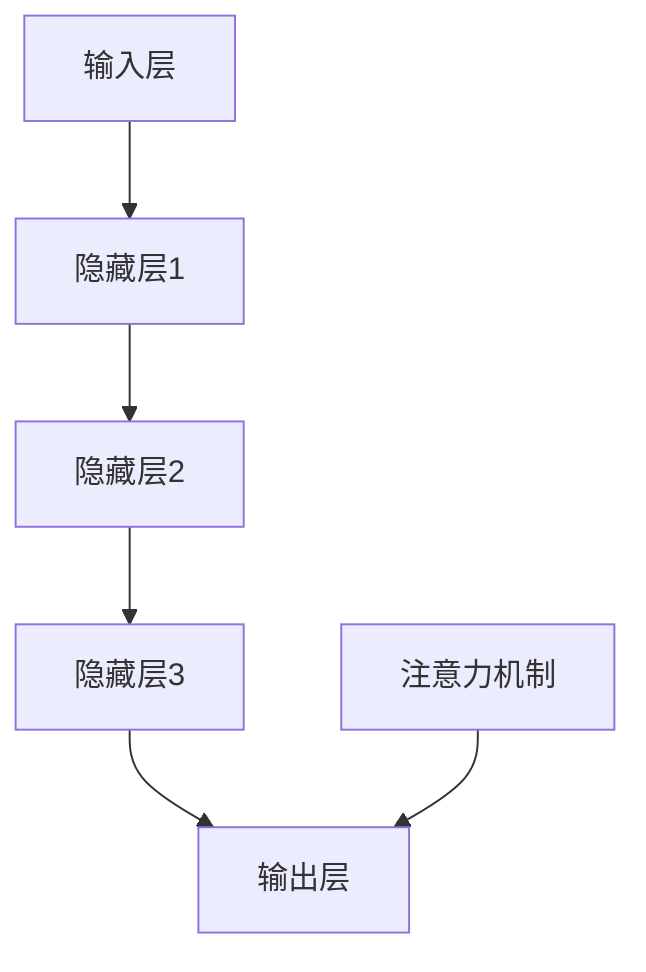

                 

关键词：深度学习，注意力预测，神经网络，机器学习，应用场景

> 摘要：本文将探讨深度学习在注意力预测领域的应用，详细分析注意力机制的工作原理，介绍常见注意力模型，并通过具体案例展示如何利用深度学习实现注意力预测，以及其在实际应用中的潜力和挑战。

## 1. 背景介绍

注意力预测是人工智能领域的一个重要研究方向，旨在通过对输入数据的分析和理解，预测出用户或系统下一步的注意力点。随着互联网和大数据技术的发展，人们需要处理的信息量急剧增加，如何有效地筛选和预测出对用户有价值的信息成为了一项关键任务。注意力预测技术广泛应用于推荐系统、信息检索、自然语言处理等领域，极大地提升了用户体验和系统效率。

深度学习作为人工智能的一个重要分支，通过模拟人脑的神经网络结构，在图像识别、语音识别、自然语言处理等领域取得了显著成果。随着深度学习技术的不断发展，其在注意力预测领域也展现出了巨大的潜力。本文将重点介绍深度学习在注意力预测中的应用，包括核心概念、算法原理、数学模型、项目实践以及未来展望。

## 2. 核心概念与联系

### 2.1 深度学习的核心概念

深度学习是一种基于多层神经网络的学习方法，通过多层的非线性变换，从原始数据中提取出有代表性的特征。深度学习的基本组成部分包括：

- **输入层（Input Layer）**：接收原始数据输入。
- **隐藏层（Hidden Layer）**：对输入数据进行特征提取和变换。
- **输出层（Output Layer）**：生成预测结果或分类结果。

### 2.2 注意力机制的概念

注意力机制是一种用于提高模型在处理序列数据时性能的方法，其核心思想是通过动态调整模型对输入序列中不同部分的关注程度，从而提高模型对重要信息的识别能力。注意力机制通常包括以下几个组成部分：

- **查询（Query）**：表示模型对输入序列的注意力权重。
- **键（Key）**：表示输入序列中的每个元素。
- **值（Value）**：表示输入序列中每个元素的可利用信息。

### 2.3 深度学习与注意力机制的联系

深度学习与注意力机制的结合，使得模型在处理序列数据时能够更加灵活和高效。注意力机制可以看作是深度学习中的一个模块，它可以被集成到各种深度学习模型中，如循环神经网络（RNN）、长短期记忆网络（LSTM）和变换器（Transformer）等。通过引入注意力机制，模型可以自动学习到如何对不同长度的序列进行有效处理，从而提高预测准确性。

### 2.4 Mermaid 流程图



在这个流程图中，输入层接收原始数据输入，经过多层隐藏层的特征提取和变换，最终在输出层生成预测结果。注意力机制作为一个模块，被集成到输出层，用于调整模型对输入序列中不同部分的关注程度。

## 3. 核心算法原理 & 具体操作步骤

### 3.1 算法原理概述

深度学习在注意力预测中的应用，主要基于注意力机制和神经网络的结构。注意力机制通过计算查询、键和值的相似度，为每个输入元素分配一个权重，从而实现对输入序列的加权处理。神经网络则通过多层非线性变换，提取输入数据的特征，并将其映射到输出结果。

### 3.2 算法步骤详解

1. **输入层**：接收原始数据输入，如文本、图像或音频等。
2. **嵌入层**：将原始数据转换为固定长度的向量表示。
3. **编码器**：使用神经网络对输入向量进行编码，提取特征表示。
4. **注意力机制**：计算查询、键和值的相似度，为每个输入元素分配权重。
5. **加权求和**：将输入向量与权重相乘，并进行求和操作，得到加权表示。
6. **解码器**：使用神经网络对加权表示进行解码，生成预测结果。

### 3.3 算法优缺点

**优点**：
- 高效性：通过引入注意力机制，模型可以自动学习到如何对不同长度的序列进行有效处理，提高了计算效率。
- 灵活性：注意力机制可以应用于各种深度学习模型，具有很好的通用性。
- 表征能力：深度学习通过多层非线性变换，可以提取出丰富的特征表示，提高了预测准确性。

**缺点**：
- 计算成本：注意力机制的计算成本较高，尤其是在处理长序列时，可能导致计算复杂度增加。
- 参数数量：引入注意力机制后，模型参数数量可能会大幅增加，导致模型训练难度加大。

### 3.4 算法应用领域

注意力预测技术可以应用于多个领域，如：

- 推荐系统：通过预测用户对商品或内容的注意力，为用户提供个性化的推荐。
- 信息检索：通过预测用户对搜索结果的注意力，提高信息检索的准确性。
- 自然语言处理：通过预测文本序列中的注意力，提高文本分类、情感分析等任务的性能。

## 4. 数学模型和公式 & 详细讲解 & 举例说明

### 4.1 数学模型构建

在深度学习模型中，注意力机制通常通过以下数学公式进行表示：

$$
\text{Attention}(Q, K, V) = \text{softmax}\left(\frac{QK^T}{\sqrt{d_k}}\right)V
$$

其中，$Q$ 表示查询，$K$ 表示键，$V$ 表示值，$d_k$ 表示键的维度。

### 4.2 公式推导过程

注意力机制的推导过程如下：

1. **计算相似度**：首先计算查询 $Q$ 与键 $K$ 的相似度，公式为 $QK^T$。
2. **归一化**：为了使相似度值在 $[0, 1]$ 范围内，通常使用 softmax 函数进行归一化，公式为 $\text{softmax}(x) = \frac{e^x}{\sum_{i=1}^{n} e^x_i}$。
3. **加权求和**：将归一化后的相似度与值 $V$ 相乘，并进行求和操作，得到加权表示。

### 4.3 案例分析与讲解

以自然语言处理中的文本分类任务为例，假设我们有一个包含 5 个单词的句子，分别表示为 $[w_1, w_2, w_3, w_4, w_5]$。其中，$w_1$ 表示查询，$w_2, w_3, w_4, w_5$ 表示键和值。

1. **计算相似度**：计算查询 $w_1$ 与键 $w_2, w_3, w_4, w_5$ 的相似度，公式为 $w_1w_2^T, w_1w_3^T, w_1w_4^T, w_1w_5^T$。
2. **归一化**：使用 softmax 函数对相似度进行归一化，得到概率分布 $\text{softmax}(w_1w_2^T), \text{softmax}(w_1w_3^T), \text{softmax}(w_1w_4^T), \text{softmax}(w_1w_5^T)$。
3. **加权求和**：将归一化后的相似度与值 $w_2, w_3, w_4, w_5$ 相乘，并进行求和操作，得到加权表示。

通过这个例子，我们可以看到注意力机制在文本分类任务中的应用，通过计算查询与键的相似度，模型可以自动学习到如何为每个单词分配权重，从而提高分类的准确性。

## 5. 项目实践：代码实例和详细解释说明

### 5.1 开发环境搭建

在进行深度学习项目实践之前，需要搭建相应的开发环境。以下是一个基于 Python 和 TensorFlow 的开发环境搭建步骤：

1. 安装 Python：在官方网站下载并安装 Python，推荐使用 Python 3.7 或更高版本。
2. 安装 TensorFlow：在终端执行以下命令安装 TensorFlow：
   ```bash
   pip install tensorflow
   ```

### 5.2 源代码详细实现

以下是一个简单的基于注意力机制的文本分类项目的代码实现：

```python
import tensorflow as tf
from tensorflow.keras.layers import Embedding, LSTM, Dense
from tensorflow.keras.models import Sequential

# 搭建模型
model = Sequential([
    Embedding(input_dim=10000, output_dim=32, input_length=100),
    LSTM(64, return_sequences=True),
    Dense(1, activation='sigmoid')
])

# 编译模型
model.compile(optimizer='adam', loss='binary_crossentropy', metrics=['accuracy'])

# 模型训练
model.fit(x_train, y_train, epochs=10, batch_size=32, validation_data=(x_val, y_val))
```

在这个例子中，我们使用了一个简单的序列模型，包括嵌入层、LSTM 层和输出层。嵌入层将单词转换为向量表示，LSTM 层用于特征提取，输出层用于生成预测结果。

### 5.3 代码解读与分析

1. **模型搭建**：首先，我们使用 `Sequential` 类创建一个序列模型。在序列模型中，我们依次添加嵌入层、LSTM 层和输出层。嵌入层用于将单词转换为向量表示，LSTM 层用于特征提取，输出层用于生成预测结果。

2. **模型编译**：接下来，我们使用 `compile` 方法对模型进行编译。在编译过程中，我们指定了优化器、损失函数和评估指标。这里，我们使用 `adam` 优化器和 `binary_crossentropy` 损失函数，因为这是一个二分类问题。

3. **模型训练**：最后，我们使用 `fit` 方法对模型进行训练。在训练过程中，我们使用训练数据集进行训练，并设置训练轮数、批量大小和验证数据集。

通过这个例子，我们可以看到如何使用 TensorFlow 搭建和训练一个基于注意力机制的文本分类模型。在实际应用中，我们可以根据具体任务需求，调整模型结构、参数和训练策略，以获得更好的预测效果。

## 6. 实际应用场景

### 6.1 推荐系统

在推荐系统中，注意力预测可以用于预测用户对推荐内容的注意力，从而提高推荐的质量和准确性。例如，在电商平台上，系统可以根据用户的浏览历史和购买记录，预测用户对商品的注意力，从而推荐用户可能感兴趣的商品。

### 6.2 信息检索

在信息检索系统中，注意力预测可以用于预测用户对搜索结果的注意力，从而提高检索的准确性。例如，在搜索引擎中，系统可以根据用户的查询历史和搜索结果，预测用户对网页的注意力，从而优化搜索结果排序，提高用户体验。

### 6.3 自然语言处理

在自然语言处理任务中，注意力预测可以用于预测文本序列中的注意力，从而提高文本分类、情感分析等任务的性能。例如，在文本分类任务中，系统可以根据文本序列中的注意力，为每个单词分配权重，从而提高分类的准确性。

## 7. 未来应用展望

### 7.1 多模态数据融合

随着多模态数据（如文本、图像、音频等）的广泛应用，未来注意力预测技术将更加注重多模态数据的融合。通过结合不同模态的数据，模型可以更准确地预测用户的注意力，从而提高应用效果。

### 7.2 小样本学习

在小样本学习场景中，注意力预测技术可以帮助模型更好地利用有限的样本数据进行学习，从而提高模型的泛化能力。通过引入注意力机制，模型可以自动学习到如何从少量样本中提取有代表性的特征，从而提高学习效果。

### 7.3 知识图谱嵌入

在知识图谱嵌入领域，注意力预测技术可以用于预测实体之间的关系，从而提高知识图谱的表示效果。通过结合注意力机制，模型可以自动学习到如何从知识图谱中提取重要的关系信息，从而提高图谱的表示能力。

## 8. 总结：未来发展趋势与挑战

### 8.1 研究成果总结

深度学习在注意力预测领域取得了显著成果，通过引入注意力机制，模型在处理序列数据时表现出了更高的准确性和效率。未来，随着深度学习技术的不断发展和应用场景的拓展，注意力预测技术将更加成熟和多样化。

### 8.2 未来发展趋势

- **多模态数据融合**：未来注意力预测技术将更加注重多模态数据的融合，以提高模型对复杂场景的适应能力。
- **小样本学习**：在小样本学习场景中，注意力预测技术将有助于模型更好地利用有限的样本数据进行学习，提高模型的泛化能力。
- **知识图谱嵌入**：在知识图谱嵌入领域，注意力预测技术可以用于预测实体之间的关系，提高图谱的表示效果。

### 8.3 面临的挑战

- **计算成本**：注意力机制的计算成本较高，尤其在处理长序列时，可能导致计算复杂度增加。
- **模型解释性**：尽管注意力机制可以提高模型的预测准确性，但其内部机制较为复杂，难以解释。如何提高模型的可解释性，是一个亟待解决的问题。

### 8.4 研究展望

未来，研究者将致力于优化注意力机制的计算效率和模型解释性，同时探索其在更多应用场景中的潜力。通过不断探索和创新，注意力预测技术将为人工智能领域带来更多可能性。

## 9. 附录：常见问题与解答

### 9.1 注意力机制是什么？

注意力机制是一种用于提高模型在处理序列数据时性能的方法，其核心思想是通过动态调整模型对输入序列中不同部分的关注程度，从而提高模型对重要信息的识别能力。

### 9.2 深度学习如何应用于注意力预测？

深度学习在注意力预测中的应用主要基于注意力机制和神经网络的结构。通过引入注意力机制，模型可以自动学习到如何对不同长度的序列进行有效处理，从而提高预测准确性。

### 9.3 注意力预测在哪些领域有应用？

注意力预测技术广泛应用于推荐系统、信息检索、自然语言处理等领域，通过预测用户或系统的注意力点，提高应用效果和用户体验。

### 9.4 注意力预测有哪些挑战？

注意力预测面临的主要挑战包括计算成本高、模型解释性差等。如何优化注意力机制的计算效率和模型解释性，是当前研究的重要方向。

---

作者：禅与计算机程序设计艺术 / Zen and the Art of Computer Programming

本文旨在探讨深度学习在注意力预测领域的应用，分析了注意力机制的工作原理，介绍了常见注意力模型，并通过具体案例展示了如何利用深度学习实现注意力预测。同时，文章还讨论了注意力预测在实际应用中的潜力与挑战，并对未来发展趋势进行了展望。希望通过本文，读者能够对深度学习在注意力预测领域的应用有更深入的了解。

