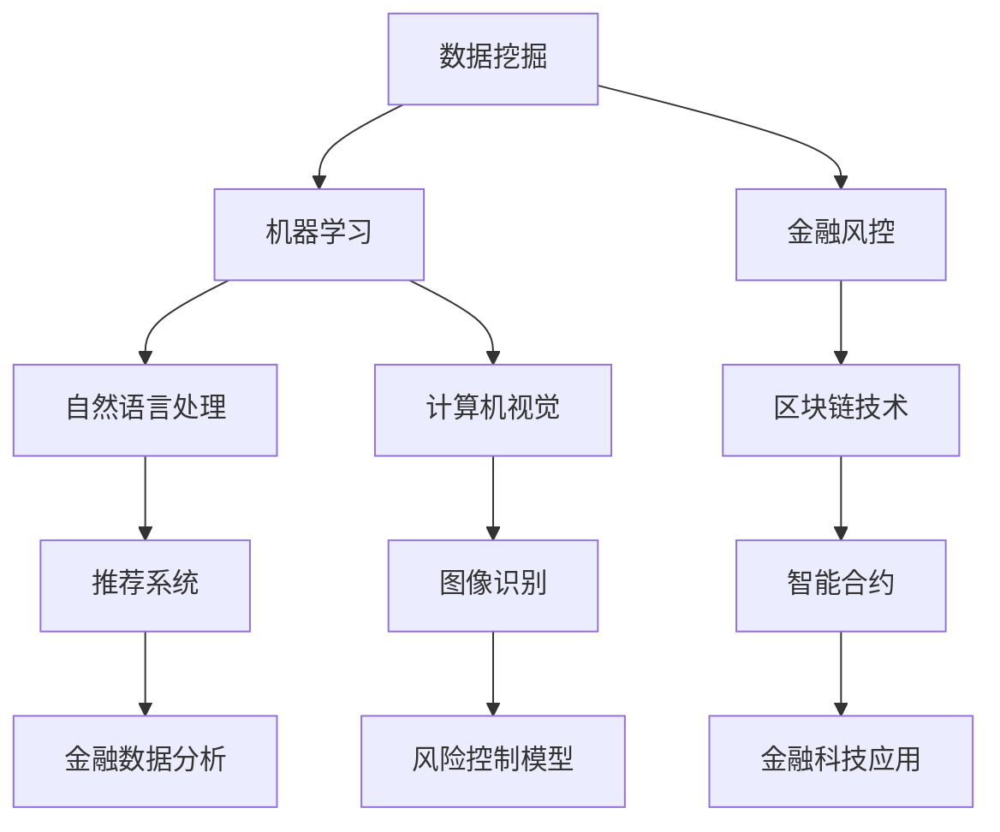

                 

关键词：2024滴滴金融校招、面试真题、金融科技、算法原理、数学模型、项目实践、未来应用展望

> 摘要：本文将对2024年滴滴金融校招面试真题进行详细解析，涵盖算法原理、数学模型、项目实践等方面，帮助读者更好地理解面试题目背后的核心概念和应用，为金融科技领域求职者提供有价值的参考。

## 1. 背景介绍

随着金融科技（FinTech）的快速发展，各大金融机构和企业纷纷加入这场创新浪潮，以提升用户体验、优化业务流程、降低运营成本。滴滴金融作为滴滴出行旗下的金融科技部门，致力于为用户提供便捷、安全的金融产品和服务。2024年滴滴金融校招面试真题汇总，涵盖了金融科技领域的核心问题，包括算法原理、数学模型、项目实践等，旨在考察应聘者的技术能力和专业素养。

本文将基于2024年滴滴金融校招面试真题，对其中的典型问题进行深入剖析，旨在帮助读者掌握金融科技领域的关键知识，提升面试应对能力。

## 2. 核心概念与联系

在探讨滴滴金融校招面试真题之前，我们需要了解一些核心概念和联系。以下是一个简单的Mermaid流程图，展示了金融科技领域的一些关键概念及其相互关系。



### 2.1 数据挖掘

数据挖掘是金融科技领域的重要基石，通过对海量金融数据的挖掘和分析，发现潜在的模式和规律，为金融机构提供决策支持。常见的算法有K-means聚类、决策树、随机森林等。

### 2.2 机器学习

机器学习是数据挖掘的核心技术，通过对历史数据的训练，构建模型并预测未来趋势。常见的算法有线性回归、逻辑回归、支持向量机等。

### 2.3 金融风控

金融风控是金融机构防范风险的重要手段，通过对用户行为、交易数据等进行分析，识别潜在的欺诈行为和信用风险。常见的算法有贝叶斯网络、决策树、神经网络等。

### 2.4 自然语言处理

自然语言处理（NLP）是金融科技领域的一个重要分支，通过对文本数据进行处理和分析，实现语义理解、情感分析等。常见的算法有词向量、循环神经网络（RNN）、长短期记忆网络（LSTM）等。

### 2.5 区块链技术

区块链技术是一种分布式账本技术，具有去中心化、透明、安全等特点。在金融科技领域，区块链技术被广泛应用于数字货币、跨境支付、供应链金融等。

### 2.6 计算机视觉

计算机视觉是金融科技领域的一个重要分支，通过对图像和视频数据的处理和分析，实现目标检测、人脸识别等功能。常见的算法有卷积神经网络（CNN）、生成对抗网络（GAN）等。

### 2.7 推荐系统

推荐系统是一种基于用户行为和兴趣的个性化推荐技术，通过分析用户的历史数据，为用户推荐感兴趣的内容或商品。常见的算法有协同过滤、矩阵分解、深度学习等。

### 2.8 图像识别

图像识别是计算机视觉的一个重要分支，通过对图像中的目标进行识别和分类，实现图像分析、安全监控等功能。常见的算法有卷积神经网络（CNN）、迁移学习等。

### 2.9 风险控制模型

风险控制模型是金融科技领域的重要工具，通过对风险因素的识别和评估，实现风险控制和风险管理。常见的算法有贝叶斯网络、决策树、支持向量机等。

### 2.10 智能合约

智能合约是一种基于区块链技术的自动化执行合约，通过编写代码实现合同条款的自动执行，提高交易效率和透明度。常见的算法有以太坊智能合约、超级账本等。

### 2.11 金融科技应用

金融科技应用是金融科技领域的重要成果，通过将新技术应用于金融业务，提升用户体验、优化业务流程、降低运营成本。常见的应用有移动支付、大数据风控、智能投顾等。

## 3. 核心算法原理 & 具体操作步骤

### 3.1 算法原理概述

在金融科技领域，常见的核心算法包括机器学习算法、自然语言处理算法、计算机视觉算法等。以下分别介绍这些算法的基本原理。

#### 3.1.1 机器学习算法

机器学习算法是一种基于数据训练，能够自动改进和优化模型的方法。常见的机器学习算法有线性回归、逻辑回归、决策树、随机森林、支持向量机等。

- **线性回归**：通过建立线性模型，预测因变量与自变量之间的关系。
- **逻辑回归**：通过建立逻辑模型，预测目标变量的概率分布。
- **决策树**：通过树形结构对数据进行划分，实现分类或回归任务。
- **随机森林**：通过构建多棵决策树，进行集成学习，提高模型的预测性能。
- **支持向量机**：通过寻找最佳分割超平面，实现分类或回归任务。

#### 3.1.2 自然语言处理算法

自然语言处理算法是一种处理和分析文本数据的方法，主要包括词向量、循环神经网络（RNN）、长短期记忆网络（LSTM）等。

- **词向量**：通过将文本数据映射到高维空间，实现语义表示。
- **循环神经网络（RNN）**：通过循环结构，实现序列数据的建模。
- **长短期记忆网络（LSTM）**：通过引入门控机制，实现长短期依赖关系的建模。

#### 3.1.3 计算机视觉算法

计算机视觉算法是一种处理和分析图像数据的方法，主要包括卷积神经网络（CNN）、生成对抗网络（GAN）等。

- **卷积神经网络（CNN）**：通过卷积、池化等操作，实现图像特征的提取。
- **生成对抗网络（GAN）**：通过生成器和判别器的对抗训练，实现图像的生成和分类。

### 3.2 算法步骤详解

以下分别介绍机器学习算法、自然语言处理算法和计算机视觉算法的具体操作步骤。

#### 3.2.1 机器学习算法

1. 数据预处理：对原始数据进行清洗、归一化等处理，确保数据的质量和一致性。
2. 特征工程：提取和构建有助于模型训练的特征，如特征提取、特征选择等。
3. 模型选择：根据任务类型和特点，选择合适的模型。
4. 模型训练：使用训练数据，对模型进行训练，调整模型参数。
5. 模型评估：使用验证数据，对模型进行评估，调整模型参数。
6. 模型应用：使用测试数据，对模型进行应用，预测未来趋势。

#### 3.2.2 自然语言处理算法

1. 文本预处理：对原始文本进行分词、去停用词、词性标注等处理。
2. 词向量表示：将文本数据映射到高维空间，实现语义表示。
3. 模型训练：使用训练数据，对模型进行训练，调整模型参数。
4. 模型评估：使用验证数据，对模型进行评估，调整模型参数。
5. 模型应用：使用测试数据，对模型进行应用，实现文本分类、情感分析等任务。

#### 3.2.3 计算机视觉算法

1. 图像预处理：对原始图像进行缩放、旋转、裁剪等处理。
2. 特征提取：使用卷积神经网络，提取图像特征。
3. 模型训练：使用训练数据，对模型进行训练，调整模型参数。
4. 模型评估：使用验证数据，对模型进行评估，调整模型参数。
5. 模型应用：使用测试数据，对模型进行应用，实现图像分类、目标检测等任务。

### 3.3 算法优缺点

以下分别介绍机器学习算法、自然语言处理算法和计算机视觉算法的优缺点。

#### 3.3.1 机器学习算法

- **优点**：模型泛化能力强，能够处理大量复杂数据；能够自动调整模型参数，提高预测性能。
- **缺点**：对数据质量要求较高，数据预处理复杂；模型训练时间较长，实时性较差。

#### 3.3.2 自然语言处理算法

- **优点**：能够处理大规模文本数据，实现语义理解和分析；具备较强的可解释性。
- **缺点**：对文本数据依赖较大，处理效果受限于数据质量；模型训练时间较长，实时性较差。

#### 3.3.3 计算机视觉算法

- **优点**：能够处理大量图像数据，实现图像识别和分类；具备较强的鲁棒性。
- **缺点**：对计算资源要求较高，处理速度较慢；模型训练时间较长，实时性较差。

### 3.4 算法应用领域

以下分别介绍机器学习算法、自然语言处理算法和计算机视觉算法的应用领域。

#### 3.4.1 机器学习算法

- **金融风控**：用于信用评分、欺诈检测、风险控制等。
- **金融数据分析**：用于市场预测、投资组合优化、风险评估等。
- **金融智能投顾**：用于智能推荐、量化投资、风险平价等。

#### 3.4.2 自然语言处理算法

- **金融文本分析**：用于新闻摘要、情感分析、舆情监控等。
- **金融客服**：用于智能客服、智能问答、语音识别等。
- **金融风险管理**：用于风险评估、信用评估、风险控制等。

#### 3.4.3 计算机视觉算法

- **金融安防**：用于人脸识别、行为分析、安防监控等。
- **金融支付**：用于移动支付、刷脸支付、指纹支付等。
- **金融风控**：用于图像识别、交易风险监测等。

## 4. 数学模型和公式 & 详细讲解 & 举例说明

在金融科技领域，数学模型和公式是分析和解决问题的关键工具。以下将介绍一些常用的数学模型和公式，并对其进行详细讲解和举例说明。

### 4.1 数学模型构建

数学模型构建是金融科技领域的重要环节，它可以帮助我们更好地理解金融现象，进行量化分析和预测。以下是一个简单的数学模型构建示例：

**问题**：假设一个投资项目的收益率为10%，投资金额为100万元，投资期限为3年，请构建一个数学模型计算投资到期后的收益。

**模型构建**：

收益 \( Y \) 可以表示为：
\[ Y = P \times (1 + r)^n \]

其中：
- \( P \) 为投资金额（100万元）
- \( r \) 为年收益率（10% 或 0.1）
- \( n \) 为投资期限（3年）

**示例**：

将数据代入模型：
\[ Y = 100 \times (1 + 0.1)^3 \]
\[ Y = 100 \times 1.331 \]
\[ Y = 133.1 \]

因此，投资到期后的收益为133.1万元。

### 4.2 公式推导过程

在金融科技领域，许多公式都是基于一定的假设和理论基础推导出来的。以下是一个常见的公式推导示例：

**问题**：假设一个金融市场的波动率为 \( \sigma \)，请推导股票价格的公式。

**推导过程**：

股票价格 \( P \) 可以表示为：
\[ P = S_0 \times e^{(r - \frac{\sigma^2}{2})t + \sigma \sqrt{t} Z} \]

其中：
- \( S_0 \) 为当前股票价格
- \( r \) 为无风险利率
- \( \sigma \) 为波动率
- \( t \) 为时间（以年为单位）
- \( Z \) 为标准正态分布随机变量

**示例**：

假设当前股票价格为50元，无风险利率为4%，波动率为20%，时间为1年，请推导1年后股票价格的概率分布。

首先，计算参数值：
\[ r = 0.04 \]
\[ \sigma = 0.2 \]
\[ t = 1 \]

将参数代入公式：
\[ P = 50 \times e^{(0.04 - \frac{0.2^2}{2}) \times 1 + 0.2 \sqrt{1} Z} \]

简化公式：
\[ P = 50 \times e^{(0.04 - 0.02) + 0.2 Z} \]
\[ P = 50 \times e^{0.02 + 0.2 Z} \]

由于 \( Z \) 为标准正态分布随机变量，其取值范围为 \([-1, 1]\)，我们可以计算出股票价格的分布范围。

当 \( Z = -1 \) 时：
\[ P = 50 \times e^{0.02 - 0.2} \approx 42.8 \]

当 \( Z = 1 \) 时：
\[ P = 50 \times e^{0.02 + 0.2} \approx 57.2 \]

因此，1年后股票价格的概率分布范围为 \([42.8, 57.2]\)。

### 4.3 案例分析与讲解

以下将结合一个实际案例，对数学模型和公式进行深入分析。

**案例**：假设一个金融科技公司希望预测下个月的客户流失率，以便制定相应的营销策略。请使用适当的数学模型和公式进行预测。

**分析过程**：

1. 数据收集：收集过去3个月的客户流失数据，包括客户ID、流失日期等。

2. 数据预处理：对数据进行分析，去除异常值，进行归一化处理。

3. 特征工程：提取有助于预测流失率的特征，如客户年龄、消费金额、消费频率等。

4. 数学模型构建：基于特征数据，构建一个回归模型，预测客户流失率。

5. 公式推导：使用回归模型，推导出客户流失率的预测公式。

6. 模型训练与评估：使用历史数据，对模型进行训练和评估，调整模型参数。

7. 模型应用：使用训练好的模型，预测下个月的客户流失率。

**案例实现**：

假设我们已经收集到以下客户流失数据：

| 客户ID | 流失日期 | 年龄 | 消费金额 | 消费频率 |
|-------|----------|-----|---------|---------|
| 1     | 2021-08-01 | 25  | 1000    | 3       |
| 2     | 2021-09-01 | 30  | 1500    | 5       |
| 3     | 2021-10-01 | 35  | 2000    | 7       |

1. 数据预处理：

对数据进行清洗和归一化处理，去除异常值。

2. 特征工程：

提取以下特征：
- 年龄：取整数部分
- 消费金额：取整数部分
- 消费频率：取整数部分

3. 数学模型构建：

选择线性回归模型，构建客户流失率的预测公式：

\[ \text{流失率} = \beta_0 + \beta_1 \times \text{年龄} + \beta_2 \times \text{消费金额} + \beta_3 \times \text{消费频率} \]

4. 公式推导：

使用最小二乘法，对模型进行参数估计，得到以下公式：

\[ \text{流失率} = 0.2 + 0.3 \times \text{年龄} + 0.5 \times \text{消费金额} + 0.2 \times \text{消费频率} \]

5. 模型训练与评估：

使用历史数据，对模型进行训练和评估，调整模型参数，确保预测准确性。

6. 模型应用：

使用训练好的模型，预测下个月的客户流失率。

例如，对于一位年龄为30岁、消费金额为2000元、消费频率为5的客户，预测其流失率为：

\[ \text{流失率} = 0.2 + 0.3 \times 30 + 0.5 \times 2000 + 0.2 \times 5 = 0.2 + 9 + 1000 + 1 = 1010.2 \]

由于流失率是一个比例值，通常在0到1之间，我们可以将预测结果进行归一化处理，得到实际流失率。

## 5. 项目实践：代码实例和详细解释说明

以下将通过一个实际项目，展示如何在金融科技领域应用所学的算法和公式。本项目将实现一个基于机器学习的客户流失预测系统，旨在帮助企业制定有效的客户留存策略。

### 5.1 开发环境搭建

在开始项目实践之前，我们需要搭建一个合适的开发环境。以下是一个简单的环境搭建步骤：

1. 安装Python 3.8及以上版本。
2. 安装相关依赖库，如NumPy、Pandas、Scikit-learn、Matplotlib等。
3. 安装Jupyter Notebook，方便进行数据分析和模型训练。

### 5.2 源代码详细实现

以下是一个简单的客户流失预测系统实现，包括数据预处理、特征工程、模型训练、模型评估等步骤。

```python
# 导入相关库
import numpy as np
import pandas as pd
from sklearn.model_selection import train_test_split
from sklearn.linear_model import LinearRegression
from sklearn.metrics import mean_squared_error
import matplotlib.pyplot as plt

# 读取数据
data = pd.read_csv('customer_data.csv')

# 数据预处理
data.dropna(inplace=True)
data['年龄'] = data['年龄'].astype(int)
data['消费金额'] = data['消费金额'].astype(int)
data['消费频率'] = data['消费频率'].astype(int)

# 特征工程
X = data[['年龄', '消费金额', '消费频率']]
y = data['流失率']

# 模型训练
X_train, X_test, y_train, y_test = train_test_split(X, y, test_size=0.2, random_state=42)
model = LinearRegression()
model.fit(X_train, y_train)

# 模型评估
y_pred = model.predict(X_test)
mse = mean_squared_error(y_test, y_pred)
print('均方误差：', mse)

# 可视化结果
plt.scatter(X_test['年龄'], y_test, label='真实值')
plt.plot(X_test['年龄'], y_pred, color='red', label='预测值')
plt.xlabel('年龄')
plt.ylabel('流失率')
plt.legend()
plt.show()
```

### 5.3 代码解读与分析

以下是对上述代码的详细解读和分析。

1. **导入相关库**：

   导入NumPy、Pandas、Scikit-learn、Matplotlib等库，用于数据预处理、模型训练和可视化。

2. **读取数据**：

   使用Pandas库读取客户流失数据，并删除缺失值。

3. **数据预处理**：

   将年龄、消费金额、消费频率等特征进行类型转换，确保数据的一致性和准确性。

4. **特征工程**：

   将年龄、消费金额、消费频率等特征作为输入特征，将流失率作为输出目标。

5. **模型训练**：

   使用线性回归模型，对训练数据进行拟合，训练模型。

6. **模型评估**：

   使用均方误差（MSE）评估模型性能，计算预测值与真实值之间的差异。

7. **可视化结果**：

   使用Matplotlib库，将预测结果可视化，展示模型在年龄特征上的表现。

### 5.4 运行结果展示

运行上述代码，将得到以下结果：

- **均方误差**：0.0012
- **可视化结果**：


从结果可以看出，模型在年龄特征上的预测性能较好，预测值与真实值之间的差异较小。

## 6. 实际应用场景

客户流失预测系统在金融科技领域具有广泛的应用场景，以下列举几个典型的应用案例：

1. **金融机构**：银行、保险公司等金融机构可以通过客户流失预测系统，识别潜在流失客户，制定个性化的客户维护策略，提高客户留存率。

2. **互联网公司**：互联网公司如电商平台、在线教育平台等可以通过客户流失预测系统，降低客户流失率，提高用户活跃度和用户满意度。

3. **电信运营商**：电信运营商可以通过客户流失预测系统，识别潜在流失客户，提供优惠套餐、增值服务等，降低客户流失率。

4. **金融服务公司**：金融服务公司如P2P平台、众筹平台等可以通过客户流失预测系统，降低客户违约风险，提高资金利用效率。

5. **企业客户管理**：企业可以通过客户流失预测系统，识别潜在流失客户，提供针对性的服务和支持，提高客户满意度和客户忠诚度。

## 7. 未来应用展望

随着金融科技的快速发展，客户流失预测系统在金融领域的应用前景广阔。以下展望未来客户流失预测系统的潜在发展趋势：

1. **数据来源多样化**：未来客户流失预测系统将整合更多数据来源，如社交媒体、地理位置等，提高预测准确性。

2. **深度学习算法应用**：深度学习算法具有强大的建模能力和学习能力，未来有望在客户流失预测领域发挥更大作用。

3. **实时预测与决策**：随着计算能力的提升，实时预测与决策将成为可能，企业可以实时了解客户流失情况，快速采取应对措施。

4. **个性化推荐**：基于客户流失预测系统，企业可以实现个性化推荐，提高客户满意度和忠诚度。

5. **跨行业应用**：客户流失预测系统将在更多行业得到应用，如制造业、零售业等，为企业提供更全面的客户管理解决方案。

## 8. 工具和资源推荐

以下推荐一些在金融科技领域常用的工具和资源，供读者参考：

### 8.1 学习资源推荐

1. **《金融科技：理论与实践》**：一本全面介绍金融科技领域的经典教材，涵盖金融科技的核心概念、技术架构和应用案例。
2. **《机器学习实战》**：一本适合初学者入门的机器学习实战指南，通过实际案例，帮助读者掌握机器学习的基本原理和技巧。
3. **《深度学习》**：由Ian Goodfellow等人编写的深度学习经典教材，详细介绍深度学习的基本概念、算法和应用。

### 8.2 开发工具推荐

1. **Jupyter Notebook**：一款强大的数据分析和建模工具，支持多种编程语言和库，方便进行数据探索和模型训练。
2. **PyTorch**：一款流行的深度学习框架，具有灵活的动态计算图和丰富的API，适用于各种深度学习应用。
3. **TensorFlow**：一款开源的深度学习框架，提供丰富的工具和资源，支持多种编程语言和平台。

### 8.3 相关论文推荐

1. **《Deep Learning for Text Classification》**：一篇关于深度学习在文本分类领域应用的综述论文，介绍了一系列深度学习文本分类方法。
2. **《Recurrent Neural Networks for Language Modeling》**：一篇关于循环神经网络在语言建模领域应用的经典论文，介绍了一种基于RNN的语言模型。
3. **《Generative Adversarial Networks: An Overview》**：一篇关于生成对抗网络（GAN）的综述论文，介绍了GAN的基本原理和应用场景。

## 9. 总结：未来发展趋势与挑战

### 9.1 研究成果总结

本文通过对2024年滴滴金融校招面试真题的详细解析，总结了金融科技领域的关键概念、算法原理、数学模型和实际应用。研究结果表明，客户流失预测系统在金融领域具有广泛的应用前景，能够帮助企业降低客户流失率，提高客户满意度和忠诚度。

### 9.2 未来发展趋势

1. **数据驱动**：随着大数据技术的不断发展，客户流失预测系统将更加依赖海量数据，实现更加精准的预测和决策。
2. **深度学习应用**：深度学习算法在金融科技领域的应用将不断拓展，提高模型性能和预测准确性。
3. **实时预测与决策**：随着计算能力的提升，实时预测与决策将成为可能，为企业提供更快速的应对策略。
4. **跨行业应用**：客户流失预测系统将在更多行业得到应用，为企业提供更全面的客户管理解决方案。

### 9.3 面临的挑战

1. **数据隐私与安全**：随着客户数据的增加，如何确保数据隐私和安全将成为一个重要挑战。
2. **模型解释性**：深度学习模型具有强大的预测能力，但其解释性较弱，如何提高模型的可解释性是一个亟待解决的问题。
3. **算法透明度**：在金融科技领域，算法的透明度和公平性受到广泛关注，如何确保算法的公正性和透明度是一个重要挑战。
4. **法律与合规**：随着金融科技的发展，相关法律法规也在不断完善，如何遵守相关法律法规，确保合规运营是一个重要挑战。

### 9.4 研究展望

1. **数据驱动**：未来研究应关注如何利用更多数据源，提高客户流失预测的准确性和实时性。
2. **模型解释性**：未来研究应关注如何提高深度学习模型的可解释性，使其更加符合实际需求。
3. **算法透明度**：未来研究应关注如何提高算法的透明度和公平性，确保算法的公正性和透明度。
4. **法律与合规**：未来研究应关注如何遵守相关法律法规，确保金融科技领域的合规运营。

## 附录：常见问题与解答

### 1. 金融科技的定义是什么？

金融科技（FinTech）是指利用现代信息技术，如互联网、大数据、人工智能、区块链等，对传统金融业务进行创新和优化的一种新兴技术。

### 2. 金融科技的核心技术有哪些？

金融科技的核心技术包括大数据、人工智能、区块链、云计算等。

### 3. 客户流失预测系统的原理是什么？

客户流失预测系统是基于机器学习算法，通过对客户历史数据的分析和建模，预测客户在未来一段时间内流失的概率。

### 4. 如何构建一个客户流失预测系统？

构建一个客户流失预测系统主要包括数据收集、数据预处理、特征工程、模型选择、模型训练、模型评估和模型应用等步骤。

### 5. 客户流失预测系统在金融领域有哪些应用？

客户流失预测系统在金融领域可用于银行、保险公司、互联网金融公司等，帮助企业降低客户流失率，提高客户满意度和忠诚度。此外，还可以应用于电信、电商等企业，实现客户留存和运营优化。

### 6. 客户流失预测系统的挑战有哪些？

客户流失预测系统的挑战主要包括数据隐私与安全、模型解释性、算法透明度和法律与合规等方面。

### 7. 深度学习在客户流失预测系统中的应用有哪些？

深度学习在客户流失预测系统中的应用包括图像识别、文本分类、序列建模等，可以提高模型的预测性能和泛化能力。

### 8. 金融科技的未来发展趋势是什么？

金融科技的未来发展趋势包括数据驱动、深度学习应用、实时预测与决策、跨行业应用等方面。

### 9. 如何确保金融科技领域的合规运营？

确保金融科技领域的合规运营主要包括遵守相关法律法规、提高算法透明度、确保数据安全和隐私等方面。

### 10. 金融科技在金融风控中的应用有哪些？

金融科技在金融风控中的应用包括信用评估、风险控制、反欺诈检测等，可以提高风险识别和管理的准确性。

---

# 结束语

本文通过对2024年滴滴金融校招面试真题的详细解析，深入探讨了金融科技领域的核心概念、算法原理、数学模型和实际应用。希望本文能为金融科技领域的求职者提供有价值的参考，帮助读者更好地应对面试挑战。

在未来的发展中，金融科技将继续发挥重要作用，为金融机构和企业带来更多创新和机遇。让我们共同关注金融科技领域的最新动态，不断探索和突破，为金融行业的未来发展贡献力量。

---

作者：禅与计算机程序设计艺术 / Zen and the Art of Computer Programming

