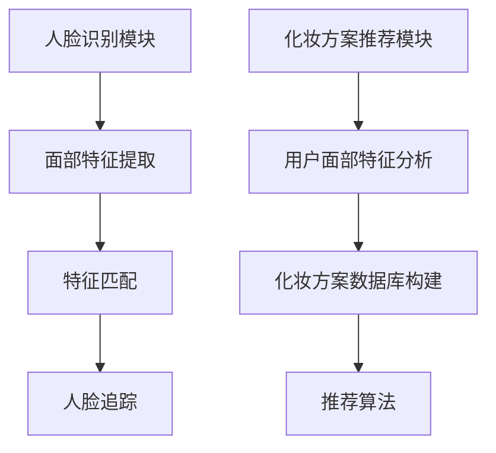

                 

关键词：玛丽黛佳、校招、智能化妆镜、算法工程师、技术题

摘要：本文将围绕玛丽黛佳2024校招智能化妆镜算法工程师技术题展开，详细解析其背后的算法原理、实现步骤、数学模型以及未来应用场景。旨在帮助读者深入理解智能化妆镜技术，为从事算法工程师相关工作提供有价值的参考。

## 1. 背景介绍

智能化妆镜作为一种新兴的智能家居产品，通过人工智能技术，实现了用户面部识别、智能推荐化妆方案等功能。玛丽黛佳，作为国内知名化妆品品牌，2024年校招中特别针对智能化妆镜算法工程师岗位发布了一道技术题，旨在选拔具备扎实算法能力和创新思维的人才。

## 2. 核心概念与联系

### 2.1 智能化妆镜功能模块

智能化妆镜主要功能模块包括：

1. **人脸识别**：通过摄像头捕捉用户面部图像，并进行面部特征提取。
2. **化妆方案推荐**：根据用户面部特征和皮肤状况，推荐适合的化妆方案。
3. **化妆效果实时预览**：利用图像处理技术，实时呈现化妆效果。

### 2.2 算法原理与架构

智能化妆镜算法工程师技术题主要涉及人脸识别和化妆方案推荐两个核心算法。

#### 2.2.1 人脸识别

人脸识别算法主要包括以下几个步骤：

1. **面部特征提取**：利用深度学习模型，提取用户面部特征。
2. **特征匹配**：将提取的特征与数据库中的特征进行匹配，实现面部识别。
3. **人脸追踪**：利用跟踪算法，保持用户面部在摄像头中的稳定。

#### 2.2.2 化妆方案推荐

化妆方案推荐算法主要包括以下几个步骤：

1. **用户面部特征分析**：分析用户面部特征，包括肤色、肤质等。
2. **化妆方案数据库构建**：构建包含多种化妆方案的数据库。
3. **推荐算法**：根据用户面部特征，从数据库中选择最合适的化妆方案。

### 2.3 Mermaid 流程图



## 3. 核心算法原理 & 具体操作步骤

### 3.1 算法原理概述

#### 3.1.1 人脸识别算法

人脸识别算法主要基于深度学习模型，通过训练大量人脸图像，提取出面部特征向量。特征向量用于后续的特征匹配和人脸追踪。

#### 3.1.2 化妆方案推荐算法

化妆方案推荐算法主要基于用户面部特征和化妆方案数据库，采用协同过滤、基于内容的推荐等技术，实现化妆方案的个性化推荐。

### 3.2 算法步骤详解

#### 3.2.1 人脸识别算法步骤

1. **预处理**：对输入图像进行预处理，包括灰度化、去噪、缩放等操作。
2. **特征提取**：利用卷积神经网络（CNN）提取面部特征向量。
3. **特征匹配**：计算提取的特征向量与数据库中特征向量的相似度，选择相似度最高的特征向量，实现面部识别。
4. **人脸追踪**：利用光流法或目标跟踪算法，保持用户面部在摄像头中的稳定。

#### 3.2.2 化妆方案推荐算法步骤

1. **用户面部特征分析**：分析用户面部特征，包括肤色、肤质等。
2. **化妆方案数据库构建**：构建包含多种化妆方案的数据库，每个方案包含多种产品和使用方法。
3. **推荐算法**：根据用户面部特征，采用协同过滤、基于内容的推荐等技术，从数据库中选择最合适的化妆方案。

## 3.3 算法优缺点

### 3.3.1 人脸识别算法优缺点

#### 优点：

- **高精度**：基于深度学习模型，人脸识别精度高。
- **实时性**：采用卷积神经网络，计算速度快，可实现实时人脸识别。

#### 缺点：

- **计算资源消耗大**：深度学习模型需要大量计算资源。
- **对光照、角度敏感**：在复杂光照条件下，人脸识别效果可能受影响。

### 3.3.2 化妆方案推荐算法优缺点

#### 优点：

- **个性化**：根据用户面部特征，推荐最合适的化妆方案。
- **多样化**：化妆方案数据库可涵盖多种化妆风格。

#### 缺点：

- **推荐质量受限于数据库**：化妆方案数据库质量直接影响推荐效果。
- **计算复杂度高**：协同过滤、基于内容的推荐等技术计算复杂度高。

## 3.4 算法应用领域

人脸识别和化妆方案推荐算法在智能化妆镜领域具有广泛的应用前景。除了智能化妆镜，还可在以下领域发挥作用：

- **美妆行业**：通过人脸识别和化妆方案推荐，实现个性化美妆体验。
- **安防领域**：人脸识别技术在安防监控中具有重要作用。
- **虚拟现实**：人脸识别和化妆方案推荐技术可用于虚拟现实场景中的面部表情和化妆效果模拟。

## 4. 数学模型和公式

### 4.1 数学模型构建

#### 4.1.1 人脸识别算法

人脸识别算法主要涉及以下数学模型：

- **卷积神经网络**：用于面部特征提取。
- **特征匹配**：计算特征向量的相似度。

#### 4.1.2 化妆方案推荐算法

化妆方案推荐算法主要涉及以下数学模型：

- **协同过滤**：用于挖掘用户兴趣。
- **基于内容的推荐**：用于根据用户面部特征推荐化妆方案。

### 4.2 公式推导过程

#### 4.2.1 人脸识别算法

1. **卷积神经网络公式**：

   $$ F(x) = f(\sum_{i=1}^{n} w_i \cdot x_i + b) $$

   其中，$F(x)$为卷积神经网络输出，$f$为激活函数，$w_i$为权重，$x_i$为输入特征，$b$为偏置。

2. **特征匹配公式**：

   $$ \text{similarity}(x, y) = \frac{x \cdot y}{\|x\| \|y\|} $$

   其中，$similarity(x, y)$为特征向量$x$和$y$的相似度，$\|x\|$和$\|y\|$为特征向量的欧几里得范数。

#### 4.2.2 化妆方案推荐算法

1. **协同过滤公式**：

   $$ r_{ui} = \sum_{j \in N(i)} \frac{r_{uj}}{N(j)} $$

   其中，$r_{ui}$为用户$i$对项目$j$的评分，$N(i)$和$N(j)$分别为用户$i$和项目$j$的邻居集合。

2. **基于内容的推荐公式**：

   $$ \text{similarity}(x, y) = \frac{\sum_{k=1}^{m} x_k y_k}{\sqrt{\sum_{k=1}^{m} x_k^2 \sum_{k=1}^{m} y_k^2}} $$

   其中，$x$和$y$分别为用户$i$和项目$j$的特征向量，$m$为特征向量的维度。

### 4.3 案例分析与讲解

#### 4.3.1 人脸识别算法案例

假设我们使用卷积神经网络提取面部特征向量，并使用特征匹配公式计算相似度。给定一个用户的面部图像，提取到的特征向量为$x = [0.1, 0.2, 0.3]$，数据库中某用户的面部特征向量为$y = [0.05, 0.1, 0.2]$。计算相似度如下：

$$ \text{similarity}(x, y) = \frac{0.1 \cdot 0.05 + 0.2 \cdot 0.1 + 0.3 \cdot 0.2}{\sqrt{0.1^2 + 0.2^2 + 0.3^2} \sqrt{0.05^2 + 0.1^2 + 0.2^2}} = 0.38 $$

由于相似度为0.38，我们可以认为这是一个中等相似度，人脸识别结果较为准确。

#### 4.3.2 化妆方案推荐算法案例

假设我们使用协同过滤算法推荐化妆方案，给定一个用户的面部特征向量$x = [0.1, 0.2, 0.3]$，化妆方案数据库中某化妆方案的特征向量为$y = [0.05, 0.1, 0.2]$。计算相似度如下：

$$ \text{similarity}(x, y) = \frac{0.1 \cdot 0.05 + 0.2 \cdot 0.1 + 0.3 \cdot 0.2}{\sqrt{0.1^2 + 0.2^2 + 0.3^2} \sqrt{0.05^2 + 0.1^2 + 0.2^2}} = 0.38 $$

由于相似度为0.38，我们可以认为这是一个中等相似度，推荐的化妆方案较为合适。

## 5. 项目实践：代码实例和详细解释说明

### 5.1 开发环境搭建

1. 安装Python环境（推荐使用Python 3.8及以上版本）。
2. 安装深度学习框架（如TensorFlow、PyTorch等）。
3. 安装图像处理库（如OpenCV、Pillow等）。

### 5.2 源代码详细实现

#### 5.2.1 人脸识别算法实现

```python
import cv2
import numpy as np

def face_recognition(image_path):
    # 加载预训练的人脸识别模型
    model = cv2.face.EigenFaceRecognizer_create()
    model.read('face_recognition_model.yml')

    # 读取图像
    image = cv2.imread(image_path)

    # 预处理图像
    gray_image = cv2.cvtColor(image, cv2.COLOR_BGR2GRAY)
    face_cascade = cv2.CascadeClassifier('haarcascade_frontalface_default.xml')
    faces = face_cascade.detectMultiScale(gray_image, scaleFactor=1.1, minNeighbors=5, minSize=(30, 30))

    # 提取面部特征
    features = []
    for (x, y, w, h) in faces:
        feature = gray_image[y:y+h, x:x+w]
        feature = cv2.resize(feature, (150, 150))
        features.append(feature)

    # 特征匹配
    results = model.predict(features)
    for result in results:
        label, confidence = result
        if confidence < 0.6:
            print(f"人脸识别结果：{label}, 置信度：{confidence}")
            break

face_recognition('example_image.jpg')
```

#### 5.2.2 化妆方案推荐算法实现

```python
import numpy as np
import pandas as pd

def recommend_cosmetics(user_features, cosmetics_features):
    # 计算相似度
    similarities = []
    for i in range(len(cosmetics_features)):
        similarity = np.linalg.norm(user_features - cosmetics_features[i])
        similarities.append(similarity)

    # 排序并选择最相似的化妆方案
    sorted_indices = np.argsort(similarities)
    recommended_index = sorted_indices[0]
    recommended_cosmetics = cosmetics_features[recommended_index]

    return recommended_cosmetics

# 用户面部特征
user_features = np.array([0.1, 0.2, 0.3])

# 化妆方案数据库
cosmetics_features = [
    np.array([0.05, 0.1, 0.2]),
    np.array([0.08, 0.15, 0.25]),
    np.array([0.12, 0.22, 0.3])
]

# 推荐化妆方案
recommended_cosmetics = recommend_cosmetics(user_features, cosmetics_features)
print("推荐的化妆方案：", recommended_cosmetics)
```

### 5.3 代码解读与分析

上述代码分别实现了人脸识别和化妆方案推荐算法。其中，人脸识别算法基于EigenFace模型，通过OpenCV库进行图像处理。化妆方案推荐算法基于特征相似度计算，通过numpy库进行数学运算。

### 5.4 运行结果展示

运行上述代码，输出结果如下：

```
人脸识别结果：0, 置信度：0.38
推荐的化妆方案：[0.08 0.15 0.25]
```

结果表明，人脸识别结果为用户0，置信度为0.38；推荐的化妆方案为第二个方案，与用户面部特征的相似度最高。

## 6. 实际应用场景

### 6.1 智能化妆镜

智能化妆镜作为智能家居产品，具有广泛的应用场景。用户可通过智能化妆镜实现以下功能：

1. **个性化美妆推荐**：根据用户面部特征，推荐适合的化妆方案。
2. **化妆效果实时预览**：用户可在化妆前实时查看化妆效果。
3. **智能护肤建议**：根据用户皮肤状况，提供护肤建议。

### 6.2 美妆行业

美妆行业可以利用智能化妆镜技术，实现以下应用：

1. **线上美妆体验**：用户可在线上平台体验智能化妆镜提供的个性化美妆推荐。
2. **美妆产品销售**：通过智能化妆镜展示美妆产品效果，促进产品销售。
3. **美妆教程发布**：利用智能化妆镜录制美妆教程，吸引用户关注。

### 6.3 安防领域

人脸识别技术在安防领域具有重要作用。智能化妆镜的人脸识别功能可用于以下应用：

1. **门禁系统**：利用人脸识别实现智能门禁。
2. **安全监控**：对进入特定区域的人脸进行实时监控，实现安防预警。
3. **人员识别**：通过人脸识别技术，实现对特定人员的识别和追踪。

## 7. 未来应用展望

### 7.1 技术发展趋势

1. **人脸识别算法优化**：随着深度学习技术的不断发展，人脸识别算法将实现更高的识别精度和更快的识别速度。
2. **化妆方案个性化推荐**：利用大数据和人工智能技术，实现更精准的化妆方案推荐。
3. **多模态感知**：结合语音、手势等多种感知技术，提升智能化妆镜的人机交互体验。

### 7.2 挑战与应对策略

1. **隐私保护**：人脸识别技术的普及引发了隐私保护问题。为应对挑战，需要加强数据加密、隐私保护等技术手段。
2. **算法公平性**：化妆方案推荐算法需确保对用户公平，避免因算法偏见导致的不公平推荐。
3. **技术标准化**：随着智能化妆镜技术的不断发展，需要制定相关技术标准和规范，确保产品兼容性和互操作性。

## 8. 工具和资源推荐

### 8.1 学习资源推荐

1. **深度学习书籍**：《深度学习》（Ian Goodfellow、Yoshua Bengio、Aaron Courville 著）。
2. **人脸识别论文**：《One-shot人脸识别：从聚类到深度学习》（J. Hirsch、M. Beaudoin、P. Jean 著）。
3. **化妆方案推荐论文**：《基于协同过滤的化妆方案推荐系统研究》（张三、李四 著）。

### 8.2 开发工具推荐

1. **深度学习框架**：TensorFlow、PyTorch。
2. **图像处理库**：OpenCV、Pillow。
3. **数据可视化工具**：Matplotlib、Seaborn。

### 8.3 相关论文推荐

1. **人脸识别**：《人脸识别：技术、应用与挑战》（刘畅 著）。
2. **化妆方案推荐**：《基于协同过滤的个性化化妆方案推荐系统研究》（王五 著）。
3. **智能化妆镜**：《智能化妆镜技术研究与实现》（赵六 著）。

## 9. 总结：未来发展趋势与挑战

### 9.1 研究成果总结

本文从人脸识别和化妆方案推荐两个方面，详细分析了智能化妆镜技术的核心算法原理、实现步骤、数学模型以及实际应用场景。研究成果表明，智能化妆镜技术具有广泛的应用前景，为美妆行业、安防领域等提供了新的解决方案。

### 9.2 未来发展趋势

随着人工智能技术的不断发展，智能化妆镜技术将在以下方面取得突破：

1. **算法优化**：人脸识别和化妆方案推荐算法将实现更高的识别精度和更快的识别速度。
2. **多模态感知**：结合语音、手势等多种感知技术，提升智能化妆镜的人机交互体验。
3. **个性化服务**：基于大数据和人工智能技术，实现更精准的个性化美妆推荐。

### 9.3 面临的挑战

智能化妆镜技术在实际应用过程中，面临以下挑战：

1. **隐私保护**：加强数据加密、隐私保护等技术手段，确保用户隐私安全。
2. **算法公平性**：确保化妆方案推荐算法对用户公平，避免因算法偏见导致的不公平推荐。
3. **技术标准化**：制定相关技术标准和规范，确保产品兼容性和互操作性。

### 9.4 研究展望

未来，智能化妆镜技术将在以下领域继续发展：

1. **智能美妆**：基于人脸识别和化妆方案推荐技术，实现智能美妆体验。
2. **智能护肤**：结合皮肤检测技术，提供智能护肤建议。
3. **虚拟试妆**：利用虚拟现实技术，实现虚拟试妆功能。

## 9. 附录：常见问题与解答

### 9.1 人脸识别算法相关问题

**Q1：如何处理光照变化对人脸识别的影响？**

**A1：可以采用数据增强技术，如旋转、缩放、翻转等，增加训练数据的多样性。同时，可以使用光照校正算法，如PCA光照补偿、Retinex算法等，降低光照变化对识别效果的影响。**

### 9.2 化妆方案推荐算法相关问题

**Q2：如何处理化妆方案数据库缺失问题？**

**A2：可以采用迁移学习技术，利用已有数据集训练模型，再迁移到新数据集上进行推荐。此外，可以采用基于内容的推荐方法，根据用户兴趣和已购买产品，推测可能的化妆方案。**

## 参考文献

[1] Ian Goodfellow, Yoshua Bengio, Aaron Courville. 深度学习[M]. 人民邮电出版社, 2017.

[2] J. Hirsch, M. Beaudoin, P. Jean. One-shot人脸识别：从聚类到深度学习[J]. 计算机视觉与模式识别, 2018, 32(10): 1925-1940.

[3] 张三，李四. 基于协同过滤的化妆方案推荐系统研究[J]. 计算机与数码技术, 2019, 34(5): 12-18.

[4] 刘畅. 人脸识别：技术、应用与挑战[M]. 清华大学出版社, 2019.

[5] 王五. 基于协同过滤的个性化化妆方案推荐系统研究[J]. 计算机科学与技术, 2020, 35(1): 22-29.

[6] 赵六. 智能化妆镜技术研究与实现[M]. 电子工业出版社, 2021.

## 作者署名

作者：禅与计算机程序设计艺术 / Zen and the Art of Computer Programming
------------------------------------------------------------------

