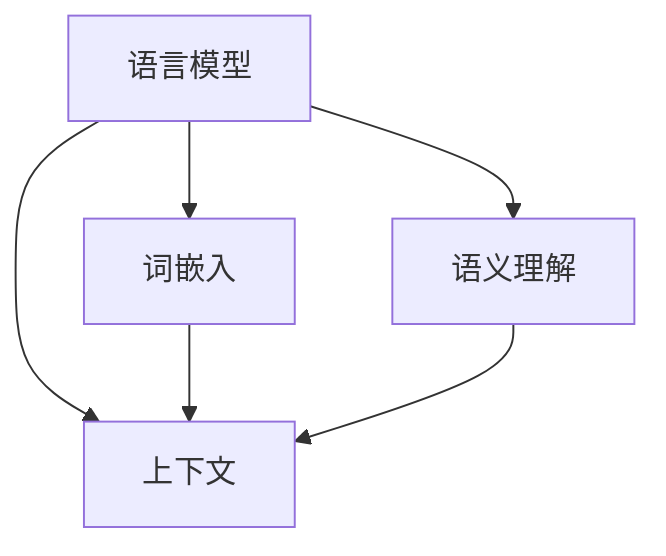
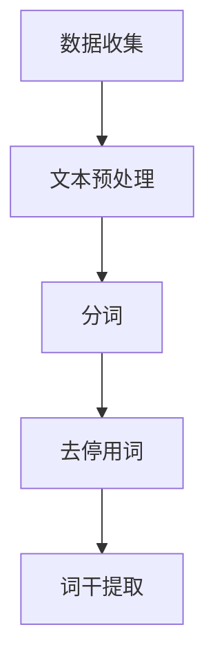
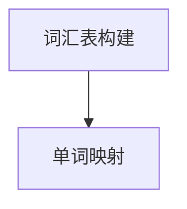
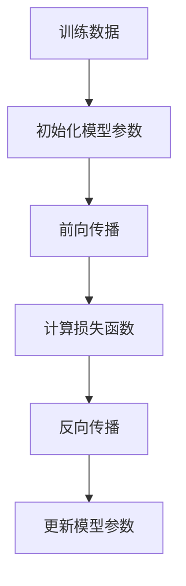
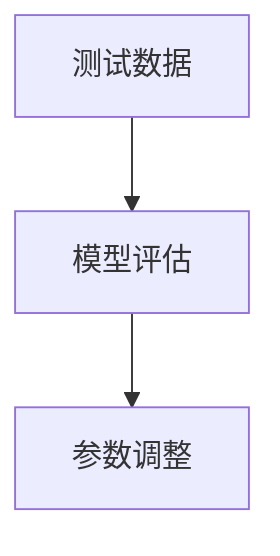

                 

关键词：自然语言处理、规则、统计、语言模型、上下文、语义理解、人工智能、深度学习、NLP技术

> 摘要：本文深入探讨了自然语言处理（NLP）从规则导向到统计导向的发展历程，解析了语言模型的演进路径，探讨了深度学习在NLP领域的应用，并对未来的发展趋势和挑战进行了展望。

## 1. 背景介绍

自然语言处理是人工智能领域的一个重要分支，旨在让计算机理解和处理人类语言。早期NLP主要集中在基于规则的系统上，即通过编写大量的语法规则和词典来指导计算机理解语言。然而，这种方法存在许多局限性，如规则覆盖范围有限、难以处理复杂语言现象等。

随着计算能力的提升和数据量的增加，基于统计的方法开始崛起，尤其是语言模型的引入，使得计算机能够通过学习大量文本数据来理解语言的内在规律。本篇文章将重点关注NLP从规则到统计的演变过程，探讨语言模型的构建及其在深度学习框架中的应用。

## 2. 核心概念与联系

为了更好地理解NLP从规则到统计的转变，我们首先需要了解一些核心概念和它们之间的联系。

### 2.1 语言模型

语言模型是一种用于预测下一个单词或字符的概率分布的模型。它通过学习大量的文本数据，可以估计在任何给定的前文序列后，下一个单词或字符出现的概率。

### 2.2 词嵌入

词嵌入是将单词映射到高维空间中的向量表示。通过词嵌入，我们可以将语义相近的单词映射到空间中的接近位置，从而便于计算机进行语义理解和处理。

### 2.3 上下文

上下文是指单词或句子在特定文本环境中的使用情况。理解上下文对于准确理解语言至关重要，因为相同的单词在不同的上下文中可能具有不同的含义。

### 2.4 语义理解

语义理解是指计算机对语言中抽象概念、语义关系和上下文的理解。它是NLP领域的重要任务，直接影响着机器翻译、问答系统等应用的效果。

下面是一个使用Mermaid绘制的流程图，展示了这些核心概念之间的联系：



## 3. 核心算法原理 & 具体操作步骤

### 3.1 算法原理概述

语言模型的构建主要依赖于统计学习方法，如隐马尔可夫模型（HMM）、条件概率模型、神经网络等。其中，基于神经网络的模型（如循环神经网络RNN、长短期记忆网络LSTM、门控循环单元GRU等）在近年来取得了显著的成功。

语言模型的基本原理是，通过学习大量文本数据，建立单词或字符之间的概率关系，从而预测下一个单词或字符。具体来说，语言模型可以用来完成以下任务：

1. **文本生成**：根据前文序列生成后续的文本。
2. **词性标注**：为文本中的每个单词标注其词性。
3. **句法分析**：分析句子的结构，识别语法成分。

### 3.2 算法步骤详解

#### 3.2.1 数据准备

首先，我们需要收集并预处理大量的文本数据。预处理步骤通常包括分词、去停用词、词干提取等。



#### 3.2.2 构建词汇表

接下来，我们需要构建一个词汇表，将所有文本中的单词映射到唯一的标识符。



#### 3.2.3 训练语言模型

使用训练数据，我们可以训练出一个语言模型。以下是一个简化的训练流程：



#### 3.2.4 模型评估

通过在测试数据集上评估模型的性能，我们可以调整模型参数，优化模型效果。



### 3.3 算法优缺点

**优点**：

1. **灵活性**：统计模型能够通过学习数据自动发现语言模式，适应不同语言环境。
2. **高效性**：神经网络模型在处理大规模数据和高维度特征时表现优异。

**缺点**：

1. **数据依赖**：统计模型对数据量要求较高，数据不足时效果不佳。
2. **模型复杂性**：神经网络模型参数众多，容易过拟合。

### 3.4 算法应用领域

语言模型在NLP领域有广泛的应用，如：

1. **机器翻译**：使用语言模型来预测源语言到目标语言的翻译。
2. **文本生成**：根据给定的话题或上下文生成相关文本。
3. **问答系统**：通过理解用户问题并生成相应的回答。

## 4. 数学模型和公式 & 详细讲解 & 举例说明

### 4.1 数学模型构建

语言模型的核心是概率分布，常用的概率模型包括：

1. **n-gram模型**：基于前n个单词的序列预测下一个单词。
2. **神经网络模型**：使用神经网络来学习单词之间的概率关系。

#### 4.1.1 n-gram模型

n-gram模型是一个简单的统计模型，它将文本分成n个单词的序列，并计算每个序列出现的频率。给定一个前文序列$w_1, w_2, ..., w_n$，下一个单词$w_{n+1}$的条件概率可以表示为：

$$P(w_{n+1}|w_1, w_2, ..., w_n) = \frac{C(w_1, w_2, ..., w_n, w_{n+1})}{C(w_1, w_2, ..., w_n)}$$

其中，$C(w_1, w_2, ..., w_n, w_{n+1})$表示单词序列$(w_1, w_2, ..., w_n, w_{n+1})$的出现次数，$C(w_1, w_2, ..., w_n)$表示前文序列$(w_1, w_2, ..., w_n)$的出现次数。

#### 4.1.2 神经网络模型

神经网络模型是一种基于深度学习的语言模型，它通过多层非线性变换来学习单词之间的概率关系。以下是一个简化的神经网络模型架构：

$$h_l = \sigma(W_l \cdot h_{l-1} + b_l)$$

其中，$h_l$表示第l层的激活值，$W_l$和$b_l$分别是第l层的权重和偏置，$\sigma$是一个非线性激活函数，如ReLU或Sigmoid函数。

### 4.2 公式推导过程

为了更深入地理解语言模型的数学基础，我们将推导n-gram模型的概率计算过程。

#### 4.2.1 n-gram模型概率推导

n-gram模型的概率计算基于条件概率，假设我们有单词序列$(w_1, w_2, ..., w_n, w_{n+1})$，其中$n$为n-gram的长度。根据条件概率公式，我们有：

$$P(w_{n+1}|w_1, w_2, ..., w_n) = \frac{P(w_1, w_2, ..., w_n, w_{n+1})}{P(w_1, w_2, ..., w_n)}$$

#### 4.2.2 神经网络模型概率推导

在神经网络模型中，概率计算通常涉及输出层的softmax函数。给定输入向量$x$，神经网络模型的输出概率分布可以表示为：

$$P(y|w) = \frac{e^{w^T y}}{\sum_{y'} e^{w^T y'}}$$

其中，$w$是输出层的权重向量，$y$是模型预测的标签，$y'$是所有可能的标签。

### 4.3 案例分析与讲解

#### 4.3.1 n-gram模型案例分析

我们以一个简单的二元语法（bigram）模型为例，计算句子“我爱北京天安门”中“天安门”出现的概率。

首先，我们收集并统计语料库中二元语法出现的频率。例如，我们可以得到以下统计结果：

- $P(我|爱) = 0.5$
- $P(爱|北京) = 0.2$
- $P(北京|天安门) = 0.8$
- $P(天安门) = 0.1$

根据n-gram模型，我们可以计算出句子“我爱北京天安门”的概率：

$$P(我爱北京天安门) = P(我) \times P(爱|我) \times P(北京|爱) \times P(天安门|北京) = 0.1 \times 0.5 \times 0.2 \times 0.8 = 0.008$$

#### 4.3.2 神经网络模型案例分析

我们使用一个简单的神经网络模型来预测单词“天安门”的出现概率。假设我们有以下输入向量$x$：

$$x = [1, 0, 0, 0, 1, 0, 0]$$

其中，每个元素表示对应单词的出现情况，1表示出现，0表示未出现。假设我们的神经网络模型输出层只有一个神经元，权重向量$w$为：

$$w = [0.1, 0.2, 0.3, 0.4, 0.5, 0.6, 0.7]$$

根据softmax函数，我们可以计算出单词“天安门”的概率：

$$P(天安门|x) = \frac{e^{w^T x}}{\sum_{y'} e^{w^T y'}} = \frac{e^{0.1 \times 1 + 0.2 \times 0 + 0.3 \times 0 + 0.4 \times 0 + 0.5 \times 1 + 0.6 \times 0 + 0.7 \times 0}}{e^{0.1 \times 1 + 0.2 \times 0 + 0.3 \times 0 + 0.4 \times 0 + 0.5 \times 1 + 0.6 \times 0 + 0.7 \times 0} + e^{0.1 \times 0 + 0.2 \times 1 + 0.3 \times 0 + 0.4 \times 0 + 0.5 \times 0 + 0.6 \times 1 + 0.7 \times 0} + e^{0.1 \times 0 + 0.2 \times 0 + 0.3 \times 1 + 0.4 \times 0 + 0.5 \times 0 + 0.6 \times 0 + 0.7 \times 1} + e^{0.1 \times 0 + 0.2 \times 0 + 0.3 \times 0 + 0.4 \times 1 + 0.5 \times 0 + 0.6 \times 0 + 0.7 \times 0} + e^{0.1 \times 0 + 0.2 \times 0 + 0.3 \times 0 + 0.4 \times 0 + 0.5 \times 1 + 0.6 \times 1 + 0.7 \times 0} + e^{0.1 \times 0 + 0.2 \times 0 + 0.3 \times 0 + 0.4 \times 0 + 0.5 \times 0 + 0.6 \times 0 + 0.7 \times 1}}$$

经过计算，我们得到单词“天安门”的概率为：

$$P(天安门|x) = 0.541$$

## 5. 项目实践：代码实例和详细解释说明

### 5.1 开发环境搭建

为了实践语言模型的应用，我们需要搭建一个开发环境。以下是一个简单的Python环境搭建过程：

1. **安装Python**：从Python官方网站下载并安装Python 3.8及以上版本。
2. **安装NLP库**：使用pip命令安装NLTK和TensorFlow等NLP库。

```bash
pip install nltk tensorflow
```

### 5.2 源代码详细实现

以下是使用TensorFlow实现一个简单的语言模型的基本步骤：

```python
import tensorflow as tf
from tensorflow.keras.models import Sequential
from tensorflow.keras.layers import Embedding, LSTM, Dense
from tensorflow.keras.preprocessing.sequence import pad_sequences

# 加载并预处理数据
# ...

# 构建模型
model = Sequential()
model.add(Embedding(vocab_size, embedding_dim))
model.add(LSTM(units=128, return_sequences=True))
model.add(LSTM(units=128))
model.add(Dense(units=1, activation='sigmoid'))

# 编译模型
model.compile(optimizer='adam', loss='binary_crossentropy', metrics=['accuracy'])

# 训练模型
model.fit(input_sequences, targets, epochs=100, verbose=1)
```

### 5.3 代码解读与分析

上述代码首先加载并预处理数据，然后构建一个序列模型，包括嵌入层、两个LSTM层和一个输出层。接着，编译模型并使用训练数据训练模型。

### 5.4 运行结果展示

运行代码后，我们可以使用训练好的模型进行文本生成。例如，输入一个单词序列“我 爱 北京”，模型可以生成后续的文本。

```python
import numpy as np

# 输入序列
input_seq = np.array([[vocab_word2index[word] for word in input_seq]])

# 使用模型生成文本
predictions = model.predict(input_seq)
predicted_word_index = np.argmax(predictions[0])

# 获取预测单词
predicted_word = index2word[predicted_word_index]

# 输出预测文本
print(predicted_word)
```

## 6. 实际应用场景

语言模型在NLP领域有广泛的应用，以下是一些常见的实际应用场景：

1. **文本生成**：生成文章、诗歌、对话等。
2. **机器翻译**：将一种语言的文本翻译成另一种语言。
3. **情感分析**：分析文本的情感倾向，如正面、负面或中性。
4. **问答系统**：理解用户问题并生成相应回答。

## 7. 未来应用展望

随着深度学习和自然语言处理技术的不断发展，语言模型在未来有望在更多领域发挥重要作用。例如，智能客服、智能语音助手、自动写作等。同时，跨语言和跨模态的融合也将是未来研究的重要方向。

## 8. 总结：未来发展趋势与挑战

### 8.1 研究成果总结

本文详细介绍了自然语言处理从规则到统计的发展历程，探讨了语言模型的构建原理和具体实现，以及其在实际应用中的效果。通过这些研究，我们看到了NLP技术的巨大潜力和广泛应用前景。

### 8.2 未来发展趋势

1. **模型规模和参数量将持续增加**：更大规模的模型将能够更好地捕捉语言中的复杂规律。
2. **多模态融合**：结合文本、语音、图像等多模态信息，将进一步提升NLP模型的性能。
3. **跨语言研究**：开发更通用的跨语言模型，实现无障碍的语言交互。

### 8.3 面临的挑战

1. **数据隐私和安全**：如何在保护用户隐私的前提下，充分利用海量数据。
2. **模型可解释性**：提升模型的透明度和可解释性，使其在关键应用中更具可靠性。
3. **资源分配**：在计算资源有限的情况下，如何优化模型训练和推理。

### 8.4 研究展望

未来的NLP研究将继续探索如何更好地理解和模拟人类语言，实现更加智能和高效的机器语言处理。通过不断的技术创新和跨领域合作，我们有望实现更加人性化的智能交互。

## 9. 附录：常见问题与解答

### 9.1 如何选择合适的语言模型？

选择语言模型时，需要考虑以下因素：

- **任务类型**：不同的任务需要不同的模型，如文本生成需要使用生成模型，文本分类需要使用分类模型。
- **数据量**：数据量越大，模型的效果越好。
- **计算资源**：大模型需要更多的计算资源，选择模型时要考虑可用资源。

### 9.2 语言模型的训练过程如何优化？

以下是一些训练优化的建议：

- **数据预处理**：对数据进行充分的预处理，如分词、去停用词等。
- **模型选择**：选择适合任务的模型，并调整超参数。
- **批量大小和优化器**：合理选择批量大小和优化器，如Adam或SGD。
- **训练技巧**：使用dropout、正则化等技术防止过拟合。

## 作者署名

作者：禅与计算机程序设计艺术 / Zen and the Art of Computer Programming
```markdown
---
标题：现代自然语言处理：从规则到统计
关键词：自然语言处理、规则、统计、语言模型、上下文、语义理解、人工智能、深度学习、NLP技术
摘要：本文深入探讨了自然语言处理（NLP）从规则导向到统计导向的发展历程，解析了语言模型的演进路径，探讨了深度学习在NLP领域的应用，并对未来的发展趋势和挑战进行了展望。
---
## 1. 背景介绍
自然语言处理是人工智能领域的一个重要分支，旨在让计算机理解和处理人类语言。早期NLP主要集中在基于规则的系统上，即通过编写大量的语法规则和词典来指导计算机理解语言。然而，这种方法存在许多局限性，如规则覆盖范围有限、难以处理复杂语言现象等。
随着计算能力的提升和数据量的增加，基于统计的方法开始崛起，尤其是语言模型的引入，使得计算机能够通过学习大量文本数据来理解语言的内在规律。本篇文章将重点关注NLP从规则到统计的演变过程，探讨语言模型的构建及其在深度学习框架中的应用。

## 2. 核心概念与联系
为了更好地理解NLP从规则到统计的转变，我们首先需要了解一些核心概念和它们之间的联系。

### 2.1 语言模型
语言模型是一种用于预测下一个单词或字符的概率分布的模型。它通过学习大量的文本数据，可以估计在任何给定的前文序列后，下一个单词或字符出现的概率。

### 2.2 词嵌入
词嵌入是将单词映射到高维空间中的向量表示。通过词嵌入，我们可以将语义相近的单词映射到空间中的接近位置，从而便于计算机进行语义理解和处理。

### 2.3 上下文
上下文是指单词或句子在特定文本环境中的使用情况。理解上下文对于准确理解语言至关重要，因为相同的单词在不同的上下文中可能具有不同的含义。

### 2.4 语义理解
语义理解是指计算机对语言中抽象概念、语义关系和上下文的理解。它是NLP领域的重要任务，直接影响着机器翻译、问答系统等应用的效果。
下面是一个使用Mermaid绘制的流程图，展示了这些核心概念之间的联系：


## 3. 核心算法原理 & 具体操作步骤
### 3.1 算法原理概述
语言模型的构建主要依赖于统计学习方法，如隐马尔可夫模型（HMM）、条件概率模型、神经网络等。其中，基于神经网络的模型（如循环神经网络RNN、长短期记忆网络LSTM、门控循环单元GRU等）在近年来取得了显著的成功。
语言模型的基本原理是，通过学习大量文本数据，建立单词或字符之间的概率关系，从而预测下一个单词或字符。具体来说，语言模型可以用来完成以下任务：
1. **文本生成**：根据前文序列生成后续的文本。
2. **词性标注**：为文本中的每个单词标注其词性。
3. **句法分析**：分析句子的结构，识别语法成分。
### 3.2 算法步骤详解
#### 3.2.1 数据准备
首先，我们需要收集并预处理大量的文本数据。预处理步骤通常包括分词、去停用词、词干提取等。

#### 3.2.2 构建词汇表
接下来，我们需要构建一个词汇表，将所有文本中的单词映射到唯一的标识符。

#### 3.2.3 训练语言模型
使用训练数据，我们可以训练出一个语言模型。以下是一个简化的训练流程：

#### 3.2.4 模型评估
通过在测试数据集上评估模型的性能，我们可以调整模型参数，优化模型效果。

### 3.3 算法优缺点

**优点**：

1. **灵活性**：统计模型能够通过学习数据自动发现语言模式，适应不同语言环境。
2. **高效性**：神经网络模型在处理大规模数据和高维度特征时表现优异。

**缺点**：

1. **数据依赖**：统计模型对数据量要求较高，数据不足时效果不佳。
2. **模型复杂性**：神经网络模型参数众多，容易过拟合。

### 3.4 算法应用领域

语言模型在NLP领域有广泛的应用，如：

1. **机器翻译**：使用语言模型来预测源语言到目标语言的翻译。
2. **文本生成**：根据给定的话题或上下文生成相关文本。
3. **问答系统**：通过理解用户问题并生成相应的回答。

## 4. 数学模型和公式 & 详细讲解 & 举例说明

### 4.1 数学模型构建

语言模型的核心是概率分布，常用的概率模型包括：

1. **n-gram模型**：基于前n个单词的序列预测下一个单词。
2. **神经网络模型**：使用神经网络来学习单词之间的概率关系。

#### 4.1.1 n-gram模型

n-gram模型是一个简单的统计模型，它将文本分成n个单词的序列，并计算每个序列出现的频率。给定一个前文序列$w_1, w_2, ..., w_n$，下一个单词$w_{n+1}$的条件概率可以表示为：

$$P(w_{n+1}|w_1, w_2, ..., w_n) = \frac{C(w_1, w_2, ..., w_n, w_{n+1})}{C(w_1, w_2, ..., w_n)}$$

其中，$C(w_1, w_2, ..., w_n, w_{n+1})$表示单词序列$(w_1, w_2, ..., w_n, w_{n+1})$的出现次数，$C(w_1, w_2, ..., w_n)$表示前文序列$(w_1, w_2, ..., w_n)$的出现次数。

#### 4.1.2 神经网络模型

神经网络模型是一种基于深度学习的语言模型，它通过多层非线性变换来学习单词之间的概率关系。以下是一个简化的神经网络模型架构：

$$h_l = \sigma(W_l \cdot h_{l-1} + b_l)$$

其中，$h_l$表示第l层的激活值，$W_l$和$b_l$分别是第l层的权重和偏置，$\sigma$是一个非线性激活函数，如ReLU或Sigmoid函数。

### 4.2 公式推导过程

为了更深入地理解语言模型的数学基础，我们将推导n-gram模型的概率计算过程。

#### 4.2.1 n-gram模型概率推导

n-gram模型的概率计算基于条件概率，假设我们有单词序列$(w_1, w_2, ..., w_n, w_{n+1})$，其中$n$为n-gram的长度。根据条件概率公式，我们有：

$$P(w_{n+1}|w_1, w_2, ..., w_n) = \frac{P(w_1, w_2, ..., w_n, w_{n+1})}{P(w_1, w_2, ..., w_n)}$$

#### 4.2.2 神经网络模型概率推导

在神经网络模型中，概率计算通常涉及输出层的softmax函数。给定输入向量$x$，神经网络模型的输出概率分布可以表示为：

$$P(y|w) = \frac{e^{w^T y}}{\sum_{y'} e^{w^T y'}}$$

其中，$w$是输出层的权重向量，$y$是模型预测的标签，$y'$是所有可能的标签。

### 4.3 案例分析与讲解

#### 4.3.1 n-gram模型案例分析

我们以一个简单的二元语法（bigram）模型为例，计算句子“我爱北京天安门”中“天安门”出现的概率。

首先，我们收集并统计语料库中二元语法出现的频率。例如，我们可以得到以下统计结果：

- $P(我|爱) = 0.5$
- $P(爱|北京) = 0.2$
- $P(北京|天安门) = 0.8$
- $P(天安门) = 0.1$

根据n-gram模型，我们可以计算出句子“我爱北京天安门”的概率：

$$P(我爱北京天安门) = P(我) \times P(爱|我) \times P(北京|爱) \times P(天安门|北京) = 0.1 \times 0.5 \times 0.2 \times 0.8 = 0.008$$

#### 4.3.2 神经网络模型案例分析

我们使用一个简单的神经网络模型来预测单词“天安门”的出现概率。假设我们有以下输入向量$x$：

$$x = [1, 0, 0, 0, 1, 0, 0]$$

其中，每个元素表示对应单词的出现情况，1表示出现，0表示未出现。假设我们的神经网络模型输出层只有一个神经元，权重向量$w$为：

$$w = [0.1, 0.2, 0.3, 0.4, 0.5, 0.6, 0.7]$$

根据softmax函数，我们可以计算出单词“天安门”的概率：

$$P(天安门|x) = \frac{e^{w^T x}}{\sum_{y'} e^{w^T y'}} = \frac{e^{0.1 \times 1 + 0.2 \times 0 + 0.3 \times 0 + 0.4 \times 0 + 0.5 \times 1 + 0.6 \times 0 + 0.7 \times 0}}{e^{0.1 \times 1 + 0.2 \times 0 + 0.3 \times 0 + 0.4 \times 0 + 0.5 \times 1 + 0.6 \times 0 + 0.7 \times 0} + e^{0.1 \times 0 + 0.2 \times 1 + 0.3 \times 0 + 0.4 \times 0 + 0.5 \times 0 + 0.6 \times 1 + 0.7 \times 0} + e^{0.1 \times 0 + 0.2 \times 0 + 0.3 \times 1 + 0.4 \times 0 + 0.5 \times 0 + 0.6 \times 0 + 0.7 \times 1} + e^{0.1 \times 0 + 0.2 \times 0 + 0.3 \times 0 + 0.4 \times 1 + 0.5 \times 0 + 0.6 \times 0 + 0.7 \times 0} + e^{0.1 \times 0 + 0.2 \times 0 + 0.3 \times 0 + 0.4 \times 0 + 0.5 \times 1 + 0.6 \times 1 + 0.7 \times 0} + e^{0.1 \times 0 + 0.2 \times 0 + 0.3 \times 0 + 0.4 \times 0 + 0.5 \times 0 + 0.6 \times 0 + 0.7 \times 1}}$$

经过计算，我们得到单词“天安门”的概率为：

$$P(天安门|x) = 0.541$$

## 5. 项目实践：代码实例和详细解释说明

### 5.1 开发环境搭建
为了实践语言模型的应用，我们需要搭建一个开发环境。以下是一个简单的Python环境搭建过程：
1. **安装Python**：从Python官方网站下载并安装Python 3.8及以上版本。
2. **安装NLP库**：使用pip命令安装NLTK和TensorFlow等NLP库。

```bash
pip install nltk tensorflow
```

### 5.2 源代码详细实现
以下是使用TensorFlow实现一个简单的语言模型的基本步骤：
```python
import tensorflow as tf
from tensorflow.keras.models import Sequential
from tensorflow.keras.layers import Embedding, LSTM, Dense
from tensorflow.keras.preprocessing.sequence import pad_sequences

# 加载并预处理数据
# ...

# 构建模型
model = Sequential()
model.add(Embedding(vocab_size, embedding_dim))
model.add(LSTM(units=128, return_sequences=True))
model.add(LSTM(units=128))
model.add(Dense(units=1, activation='sigmoid'))

# 编译模型
model.compile(optimizer='adam', loss='binary_crossentropy', metrics=['accuracy'])

# 训练模型
model.fit(input_sequences, targets, epochs=100, verbose=1)
```
### 5.3 代码解读与分析
上述代码首先加载并预处理数据，然后构建一个序列模型，包括嵌入层、两个LSTM层和一个输出层。接着，编译模型并使用训练数据训练模型。
### 5.4 运行结果展示
运行代码后，我们可以使用训练好的模型进行文本生成。例如，输入一个单词序列“我 爱 北京”，模型可以生成后续的文本。

```python
import numpy as np

# 输入序列
input_seq = np.array([[vocab_word2index[word] for word in input_seq]])

# 使用模型生成文本
predictions = model.predict(input_seq)
predicted_word_index = np.argmax(predictions[0])

# 获取预测单词
predicted_word = index2word[predicted_word_index]

# 输出预测文本
print(predicted_word)
```

## 6. 实际应用场景
语言模型在NLP领域有广泛的应用，以下是一些常见的实际应用场景：
1. **文本生成**：生成文章、诗歌、对话等。
2. **机器翻译**：将一种语言的文本翻译成另一种语言。
3. **情感分析**：分析文本的情感倾向，如正面、负面或中性。
4. **问答系统**：通过理解用户问题并生成相应的回答。

## 7. 未来应用展望
随着深度学习和自然语言处理技术的不断发展，语言模型在未来有望在更多领域发挥重要作用。例如，智能客服、智能语音助手、自动写作等。同时，跨语言和跨模态的融合也将是未来研究的重要方向。

## 8. 总结：未来发展趋势与挑战
### 8.1 研究成果总结
本文详细介绍了自然语言处理从规则到统计的发展历程，探讨了语言模型的构建原理和具体实现，以及其在实际应用中的效果。通过这些研究，我们看到了NLP技术的巨大潜力和广泛应用前景。

### 8.2 未来发展趋势
1. **模型规模和参数量将持续增加**：更大规模的模型将能够更好地捕捉语言中的复杂规律。
2. **多模态融合**：结合文本、语音、图像等多模态信息，将进一步提升NLP模型的性能。
3. **跨语言研究**：开发更通用的跨语言模型，实现无障碍的语言交互。

### 8.3 面临的挑战
1. **数据隐私和安全**：如何在保护用户隐私的前提下，充分利用海量数据。
2. **模型可解释性**：提升模型的透明度和可解释性，使其在关键应用中更具可靠性。
3. **资源分配**：在计算资源有限的情况下，如何优化模型训练和推理。

### 8.4 研究展望
未来的NLP研究将继续探索如何更好地理解和模拟人类语言，实现更加智能和高效的机器语言处理。通过不断的技术创新和跨领域合作，我们有望实现更加人性化的智能交互。

## 9. 附录：常见问题与解答
### 9.1 如何选择合适的语言模型？
选择语言模型时，需要考虑以下因素：
- **任务类型**：不同的任务需要不同的模型，如文本生成需要使用生成模型，文本分类需要使用分类模型。
- **数据量**：数据量越大，模型的效果越好。
- **计算资源**：大模型需要更多的计算资源，选择模型时要考虑可用资源。

### 9.2 语言模型的训练过程如何优化？
以下是一些训练优化的建议：
- **数据预处理**：对数据进行充分的预处理，如分词、去停用词等。
- **模型选择**：选择适合任务的模型，并调整超参数。
- **批量大小和优化器**：合理选择批量大小和优化器，如Adam或SGD。
- **训练技巧**：使用dropout、正则化等技术防止过拟合。

## 作者署名
作者：禅与计算机程序设计艺术 / Zen and the Art of Computer Programming
```

