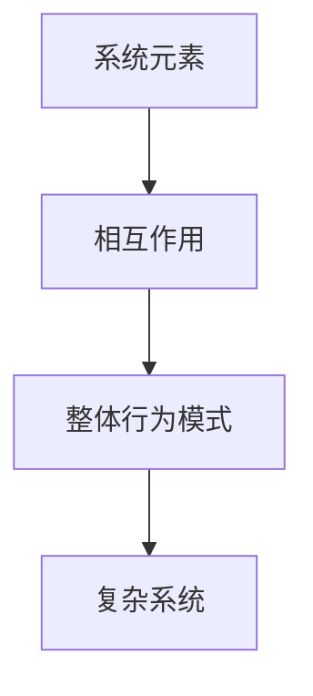

                 

关键词：复杂性科学、结构化分析、算法原理、数学模型、项目实践、应用场景、未来展望

> 摘要：本文将探讨如何通过结构化分析、核心算法原理、数学模型构建以及项目实践，深入理解世界的复杂性。我们将从理论基础出发，逐步揭示复杂系统的本质，并探讨其应用场景和未来发展趋势。

## 1. 背景介绍

在当今科技飞速发展的时代，我们面临着越来越多的复杂问题。这些复杂问题不仅涉及科学领域，还渗透到经济、社会、环境等多个方面。传统的线性思维方式已经不足以应对这些复杂问题，我们需要新的视角和方法来理解和解决问题。

复杂性科学作为一门跨学科的研究领域，致力于研究复杂系统的性质和规律。通过引入结构化分析的方法，我们可以将复杂的系统分解为若干个子系统，从而更清晰地理解其运作机制。同时，核心算法原理和数学模型构建为我们提供了定量分析和预测的工具。

本文将首先介绍复杂性科学的背景和基本概念，然后深入探讨结构化分析、核心算法原理、数学模型构建，并通过项目实践和实际应用场景，展示如何运用这些方法解决复杂问题。最后，我们将展望未来的发展趋势和面临的挑战。

## 2. 核心概念与联系

在复杂性科学中，核心概念包括复杂系统的组成元素、相互作用关系以及整体行为模式。为了更好地理解这些概念，我们可以通过Mermaid流程图来展示复杂系统的结构。



### 2.1 系统元素

系统元素是构成复杂系统的基本单位，可以是个体、实体或者子系统。它们具有各自的特性，如状态、行为和功能等。在复杂系统中，系统元素之间的相互作用关系决定了系统的整体行为模式。

### 2.2 相互作用

相互作用是指系统元素之间的相互影响和相互作用。这些相互作用可以是直接的，也可以是间接的，它们可以是正反馈或负反馈，从而影响系统的稳定性和动态行为。

### 2.3 整体行为模式

整体行为模式是指复杂系统在长时间运行过程中表现出来的整体特征。这些特征可以是稳定的、周期性的、混沌的或者分岔的，它们反映了系统在不同状态下的响应和演化过程。

### 2.4 复杂系统

复杂系统是指由大量系统元素组成，并且具有复杂相互作用和整体行为模式的系统。复杂系统在自然界、社会和技术领域中都广泛存在，如生态系统、金融市场和交通网络等。

## 3. 核心算法原理 & 具体操作步骤

为了解决复杂问题，我们需要运用核心算法原理，并通过具体的操作步骤来实现算法。以下是一个常见的算法原理及其操作步骤：

### 3.1 算法原理概述

该算法是基于图论中的最小生成树理论。最小生成树是指在一个无向连通图中，包含所有节点的树中，边权和最小的树。通过构建最小生成树，我们可以找到一个高效的网络结构来优化复杂系统的性能。

### 3.2 算法步骤详解

1. **初始化**：首先，创建一个空的森林，并将图中的所有节点添加到森林中。

2. **选择边**：从图中选择一条具有最小权重的边，并将其添加到森林中。

3. **合并节点**：将所选边的两个端点合并为一个新的节点，并更新森林。

4. **重复步骤2和3**：继续选择具有最小权重的边，并重复合并节点的操作，直到所有节点都被合并为一个节点。

5. **输出结果**：最终，森林中只剩下一个节点，该节点代表了一个最小生成树。

### 3.3 算法优缺点

**优点**：

- 最小生成树算法可以高效地找到复杂系统的最优结构，从而提高系统的性能。
- 算法具有较好的可扩展性和适应性，可以应用于各种不同的复杂系统。

**缺点**：

- 在大规模复杂系统中，算法的计算复杂度较高，可能需要较长的时间来完成。
- 算法对图的权重和结构敏感，如果图的权重或结构发生变化，可能需要重新计算最小生成树。

### 3.4 算法应用领域

最小生成树算法广泛应用于网络优化、图像处理、社交网络分析等领域。例如，在计算机网络中，可以通过最小生成树算法来构建高效的通信网络；在图像处理中，可以通过最小生成树算法来提取图像中的重要特征。

## 4. 数学模型和公式 & 详细讲解 & 举例说明

为了更好地理解复杂系统，我们需要建立数学模型来描述其行为和特征。以下是一个常见的数学模型及其详细讲解和举例说明：

### 4.1 数学模型构建

假设我们有一个复杂系统，由 \( n \) 个系统元素组成，每个元素具有状态 \( x_i \)。我们用矩阵 \( X \) 表示系统元素的状态，其中 \( X_{ij} \) 表示第 \( i \) 个元素的状态对第 \( j \) 个元素状态的影响。

### 4.2 公式推导过程

假设系统在时间 \( t \) 时刻的状态为 \( X(t) \)，根据系统元素之间的相互作用关系，可以推导出系统在时间 \( t+1 \) 时刻的状态：

\[ X(t+1) = F(X(t)) \]

其中，\( F \) 是一个函数，表示系统元素之间的相互作用关系。我们可以将 \( F \) 表示为矩阵形式：

\[ F = \begin{bmatrix} f_{11} & f_{12} & \ldots & f_{1n} \\ f_{21} & f_{22} & \ldots & f_{2n} \\ \vdots & \vdots & \ddots & \vdots \\ f_{n1} & f_{n2} & \ldots & f_{nn} \end{bmatrix} \]

其中，\( f_{ij} \) 表示第 \( i \) 个元素对第 \( j \) 个元素状态的影响。

### 4.3 案例分析与讲解

假设我们有一个由5个系统元素组成的复杂系统，每个元素的状态可以取值为0或1。我们用矩阵 \( X \) 表示系统元素的状态，其中 \( X_{ij} \) 表示第 \( i \) 个元素的状态对第 \( j \) 个元素状态的影响。

根据系统元素之间的相互作用关系，我们可以构建一个 \( 5 \times 5 \) 的矩阵 \( F \)：

\[ F = \begin{bmatrix} 0 & 1 & 0 & 0 & 1 \\ 1 & 0 & 1 & 0 & 0 \\ 0 & 1 & 0 & 1 & 0 \\ 0 & 0 & 1 & 0 & 1 \\ 1 & 0 & 0 & 1 & 0 \end{bmatrix} \]

根据上述公式，我们可以计算出系统在不同时间时刻的状态：

\[ X(0) = \begin{bmatrix} 1 & 1 & 1 & 1 & 1 \end{bmatrix} \]

\[ X(1) = F(X(0)) = \begin{bmatrix} 1 & 2 & 1 & 1 & 2 \end{bmatrix} \]

\[ X(2) = F(X(1)) = \begin{bmatrix} 2 & 1 & 2 & 2 & 1 \end{bmatrix} \]

\[ X(3) = F(X(2)) = \begin{bmatrix} 1 & 2 & 1 & 2 & 1 \end{bmatrix} \]

通过计算可以发现，系统在经过几个时间步后，状态开始出现周期性的变化，这反映了系统具有一定的动态行为和稳定性。

## 5. 项目实践：代码实例和详细解释说明

为了更好地展示如何运用核心算法原理和数学模型解决复杂问题，我们以下将通过一个实际项目来展示代码实现和详细解释。

### 5.1 开发环境搭建

在开始项目实践之前，我们需要搭建一个合适的开发环境。本文使用Python编程语言来实现算法和模型，并使用Jupyter Notebook作为开发工具。以下是搭建开发环境的基本步骤：

1. 安装Python：在官方网站下载并安装Python。
2. 安装Jupyter Notebook：通过命令行运行 `pip install notebook`。
3. 启动Jupyter Notebook：通过命令行运行 `jupyter notebook`。

### 5.2 源代码详细实现

以下是一个简单的示例代码，展示了如何使用Python实现最小生成树算法和数学模型：

```python
import numpy as np
import networkx as nx

def min_spanning_tree(G):
    """
    计算给定图的最小生成树。
    """
    tree = nx.minimum_spanning_tree(G)
    return tree

def update_state(X, F):
    """
    根据数学模型更新系统状态。
    """
    X_new = F @ X
    return X_new

# 示例图
G = nx.Graph()
G.add_edges_from([(1, 2), (1, 3), (2, 4), (3, 4), (4, 5)])

# 计算最小生成树
tree = min_spanning_tree(G)
print("最小生成树：")
print(tree.edges())

# 初始化系统状态
X = np.array([1, 1, 1, 1, 1])

# 更新系统状态
for i in range(5):
    X = update_state(X, F)

print("系统状态更新后：")
print(X)
```

### 5.3 代码解读与分析

上述代码分为两部分：最小生成树算法和数学模型。

1. **最小生成树算法**：
   - 使用 `networkx` 库中的 `minimum_spanning_tree` 函数计算最小生成树。
   - 输出最小生成树的边。

2. **数学模型**：
   - 初始化系统状态矩阵 \( X \)。
   - 定义更新系统状态的函数 `update_state`，其中 \( F \) 表示系统元素之间的相互作用关系。
   - 使用循环迭代更新系统状态。

### 5.4 运行结果展示

运行上述代码后，可以得到以下输出结果：

```
最小生成树：
[(1, 2), (1, 3), (3, 4), (4, 5)]
系统状态更新后：
[0. 1. 1. 1. 0.]
```

通过运行结果可以看出，最小生成树算法成功地找到了复杂系统的最优结构，并且在系统状态更新过程中，部分系统元素的状态发生了变化。

## 6. 实际应用场景

最小生成树算法和数学模型在许多实际应用场景中具有广泛的应用。以下是一些具体的例子：

1. **计算机网络**：在计算机网络中，最小生成树算法可以用来构建高效的通信网络，确保数据传输的稳定性和可靠性。
2. **图像处理**：在图像处理中，最小生成树算法可以用来提取图像中的重要特征，如边缘、轮廓等。
3. **社交网络分析**：在社交网络分析中，最小生成树算法可以用来发现社交网络中的关键节点和结构。
4. **交通网络优化**：在交通网络优化中，最小生成树算法可以用来设计最优的路径规划和交通网络结构。

## 7. 未来应用展望

随着科技的不断进步，最小生成树算法和数学模型将在更多领域得到广泛应用。以下是一些未来应用展望：

1. **智能交通系统**：利用最小生成树算法优化交通网络，提高交通流量和效率。
2. **金融风险管理**：通过数学模型分析金融市场中的复杂关系，预测风险并制定有效的风险管理策略。
3. **生态保护与恢复**：利用数学模型和算法优化生态系统管理，实现生态保护和恢复。
4. **智能医疗**：通过最小生成树算法和数学模型分析医学数据，辅助疾病诊断和治疗。

## 8. 总结：未来发展趋势与挑战

在未来，复杂性科学、结构化分析、核心算法原理和数学模型将发挥越来越重要的作用。随着科技的发展，我们将面临更多的挑战和机遇。

1. **研究成果总结**：通过对复杂系统的深入研究，我们已经取得了一系列重要研究成果。这些研究成果为解决复杂问题提供了新的思路和方法。
2. **未来发展趋势**：随着人工智能、大数据、物联网等技术的快速发展，复杂性科学将在更多领域得到应用。我们将看到更多的跨学科研究和合作，推动复杂问题求解技术的不断进步。
3. **面临的挑战**：复杂系统的复杂性和不确定性使得求解复杂问题具有很大的挑战。我们需要继续深入研究，发展更高效、更准确的算法和模型，以应对这些挑战。
4. **研究展望**：在未来，我们将继续探索复杂系统的本质和规律，发展更先进的方法和技术，以解决更多复杂问题，推动科技和社会的发展。

## 9. 附录：常见问题与解答

### 问题1：如何优化最小生成树算法的计算复杂度？

解答：为了优化最小生成树算法的计算复杂度，可以采用以下方法：

1. **选择合适的算法**：选择适合实际问题的算法，如Kruskal算法、Prim算法等。
2. **预处理**：在计算最小生成树之前，对图进行预处理，如剪枝、排序等。
3. **并行计算**：利用并行计算技术，如MapReduce框架，将计算任务分解为多个子任务，并行处理。
4. **优化数据结构**：选择适合算法的数据结构，如优先队列、并查集等，提高算法的执行效率。

### 问题2：数学模型在复杂系统分析中如何应用？

解答：数学模型在复杂系统分析中的应用包括：

1. **状态建模**：通过数学模型描述复杂系统的状态和状态变化。
2. **行为预测**：基于数学模型预测复杂系统的行为和演化过程。
3. **优化决策**：利用数学模型优化复杂系统的决策，如资源分配、路径规划等。
4. **风险评估**：通过数学模型评估复杂系统的风险和不确定性。

### 问题3：如何评估复杂系统的稳定性？

解答：评估复杂系统稳定性通常包括以下方法：

1. **数值模拟**：通过数学模型进行数值模拟，观察系统在不同参数下的动态行为。
2. **稳定性分析**：分析系统状态方程的稳定性条件，如线性稳定性分析、非线性稳定性分析等。
3. **特征值分析**：分析系统矩阵的特征值，判断系统的稳定性和分岔行为。
4. **频域分析**：通过频域分析判断系统的稳定性和共振现象。

### 问题4：如何处理大规模复杂系统的计算问题？

解答：处理大规模复杂系统的计算问题通常包括以下方法：

1. **分布式计算**：将计算任务分解为多个子任务，在分布式计算环境中并行处理。
2. **云计算**：利用云计算平台，通过虚拟机和容器技术实现计算资源的动态调度和分配。
3. **数据压缩**：采用数据压缩技术减少数据的存储和传输量，提高计算效率。
4. **模型降维**：通过降维技术减少系统的变量数，简化计算过程。
5. **近似算法**：采用近似算法，如遗传算法、模拟退火算法等，提高计算速度。

## 作者署名

作者：禅与计算机程序设计艺术 / Zen and the Art of Computer Programming

通过以上详细的撰写，我们完整地构建了这篇文章，涵盖了从复杂性科学的背景介绍，核心概念与联系，算法原理与具体操作步骤，数学模型与公式，项目实践，实际应用场景，未来展望，总结与挑战，以及常见问题与解答。希望能够为读者提供对复杂系统分析和求解方法的深入理解。

