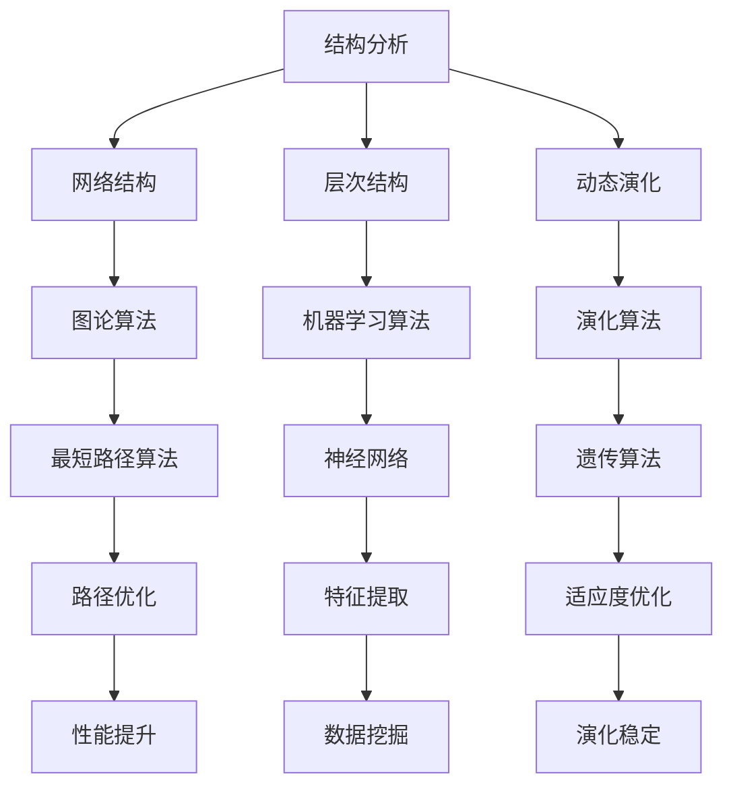

                 

关键词：复杂性科学、结构分析、认知洞见、算法原理、数学模型、项目实践、应用场景、未来展望、资源推荐

> 摘要：本文旨在探讨复杂性科学的本质，分析其在计算机科学领域中的应用。通过介绍复杂系统的结构特点，核心算法原理，数学模型构建及其在不同领域的应用，本文希望能够帮助读者理解世界的复杂性，并从中获得深刻的认知洞见。

## 1. 背景介绍

复杂性科学是近年来迅速发展的一个跨学科研究领域，它试图从宏观和微观的角度理解复杂系统的行为和特性。复杂系统通常具有高度的结构复杂性、动态演化和难以预测的行为。随着信息技术的飞速发展，复杂性科学在计算机科学、人工智能、生物学、经济学、社会学等众多领域都展现出了巨大的应用潜力。

在计算机科学领域，复杂性科学的应用主要体现在算法设计和数据分析等方面。通过对复杂系统的结构进行分析，可以设计出更高效的算法，优化系统的性能。同时，复杂性科学也为理解和分析大数据提供了新的视角和方法。

本文将围绕以下几个核心问题展开讨论：

- 复杂系统的结构特点是什么？
- 什么样的核心算法适用于复杂系统？
- 如何构建有效的数学模型来描述复杂系统的行为？
- 复杂性科学在现实世界的应用有哪些？
- 未来复杂性科学的发展趋势和面临的挑战是什么？

## 2. 核心概念与联系

### 2.1. 复杂系统的结构特点

复杂系统的结构特点主要体现在以下几个方面：

1. **网络结构**：复杂系统通常由大量相互关联的节点和边组成，形成一个高度互联的网络结构。
2. **层次结构**：复杂系统往往具有多个层次，每个层次都包含不同的功能单元和相互作用机制。
3. **动态演化**：复杂系统在不同的时间尺度上表现出动态演化行为，其状态随时间不断变化。
4. **非线性相互作用**：复杂系统中的各个组成部分之间通常存在非线性相互作用，导致系统的行为难以预测。
5. **适应性**：复杂系统在面对外部环境和内部变化时能够通过适应性演化保持稳定和优化。

### 2.2. 核心算法原理

在复杂性科学中，核心算法通常包括以下几个方面：

1. **随机过程算法**：用于模拟复杂系统的随机行为和演化过程，如马尔可夫链、蒙特卡洛方法等。
2. **图论算法**：用于分析复杂系统的网络结构，如网络流算法、最短路径算法等。
3. **机器学习算法**：用于从数据中学习复杂系统的特征和规律，如神经网络、支持向量机等。
4. **演化算法**：用于模拟复杂系统的自然演化过程，如遗传算法、模拟退火算法等。

### 2.3. 数学模型构建

构建有效的数学模型是理解复杂系统行为的关键。常见的数学模型包括：

1. **微分方程模型**：用于描述复杂系统中的连续变化过程，如物理学中的牛顿运动定律。
2. **差分方程模型**：用于描述复杂系统中的离散变化过程，如经济学中的市场供需模型。
3. **概率模型**：用于描述复杂系统中的随机行为，如概率分布、随机过程等。
4. **统计模型**：用于描述复杂系统的数据特征和统计规律，如回归分析、聚类分析等。

### 2.4. Mermaid 流程图

以下是复杂系统分析中常用的 Mermaid 流程图示例，展示了从结构分析到算法设计再到数学模型构建的整个过程。



## 3. 核心算法原理 & 具体操作步骤

### 3.1. 算法原理概述

在复杂性科学中，核心算法的原理通常可以从以下几个方面进行概述：

1. **随机过程算法**：通过模拟复杂系统的随机行为和演化过程来理解系统的行为特征。
2. **图论算法**：通过分析复杂系统的网络结构来优化系统的性能和资源分配。
3. **机器学习算法**：通过从数据中学习复杂系统的特征和规律来预测和优化系统的行为。
4. **演化算法**：通过模拟复杂系统的自然演化过程来优化系统的适应性和稳定性。

### 3.2. 算法步骤详解

以下将详细介绍每种核心算法的具体步骤：

#### 3.2.1. 随机过程算法

1. **马尔可夫链**：
   - 确定状态空间和转移概率矩阵。
   - 计算稳态分布，即系统长期处于每个状态的概率。

2. **蒙特卡洛方法**：
   - 通过随机抽样和模拟来估计系统参数或行为。
   - 利用随机样本的统计特性进行推断和计算。

#### 3.2.2. 图论算法

1. **最短路径算法**：
   - Dijkstra算法：使用优先队列和松弛操作来找到单源最短路径。
   - Bellman-Ford算法：通过迭代松弛操作来找到单源最短路径。

2. **网络流算法**：
   - Ford-Fulkerson算法：通过增广路径来求解最大流问题。
   - Edmonds-Karp算法：基于Ford-Fulkerson算法和 breadth-first search 的改进算法。

#### 3.2.3. 机器学习算法

1. **神经网络**：
   - 前向传播：计算输入到输出之间的传递函数。
   - 反向传播：更新网络权重以最小化损失函数。

2. **支持向量机**：
   - 特征提取：将输入数据映射到高维空间。
   - 分类决策：通过分类超平面来划分数据。

#### 3.2.4. 演化算法

1. **遗传算法**：
   - 编码个体：将问题的解编码为二进制字符串。
   - 选择操作：根据适应度选择个体进行交配。
   - 交叉操作：通过交换两个个体的基因来生成新的个体。
   - 变异操作：对个体进行随机变异以增加多样性。

2. **模拟退火算法**：
   - 初始温度设置：设定初始温度。
   - 计算新状态：随机选择一个新的状态。
   - 判断接受概率：根据温度和状态变化计算接受概率。
   - 降温操作：逐渐降低温度直至达到终止条件。

### 3.3. 算法优缺点

每种算法都有其优缺点：

- **随机过程算法**：优点在于其能够模拟复杂系统的随机行为，缺点在于计算复杂度高。
- **图论算法**：优点在于能够高效地分析复杂系统的网络结构，缺点在于可能难以处理动态变化。
- **机器学习算法**：优点在于能够从数据中自动学习复杂系统的规律，缺点在于可能需要大量数据和支持时间。
- **演化算法**：优点在于能够通过自然选择和遗传操作优化复杂系统的适应度，缺点在于可能陷入局部最优。

### 3.4. 算法应用领域

这些核心算法在不同领域都有广泛的应用：

- **随机过程算法**：应用于金融风险建模、交通流量预测等。
- **图论算法**：应用于网络优化、社会网络分析等。
- **机器学习算法**：应用于图像识别、语音识别、推荐系统等。
- **演化算法**：应用于调度优化、路径规划等。

## 4. 数学模型和公式 & 详细讲解 & 举例说明

### 4.1. 数学模型构建

数学模型是理解复杂系统行为的重要工具。构建数学模型通常涉及以下几个步骤：

1. **定义变量**：明确系统中需要研究的变量及其取值范围。
2. **建立关系式**：通过实验或理论分析建立变量之间的关系。
3. **简化模型**：根据实际情况和需求对模型进行适当简化。
4. **求解模型**：使用数学方法求解模型，得到系统的行为特征。

### 4.2. 公式推导过程

以下以最短路径问题为例，介绍常见数学模型的推导过程。

#### 4.2.1. Dijkstra算法

Dijkstra算法用于求解单源最短路径问题，其核心公式如下：

$$
d[v] = \min_{(u, v) \in E} (d[u] + w(u, v))
$$

其中，$d[v]$ 表示从源点 $s$ 到点 $v$ 的最短距离，$w(u, v)$ 表示边 $(u, v)$ 的权重。

推导过程：

- 初始化：将所有顶点的距离初始化为无穷大，源点 $s$ 的距离初始化为 0。
- 选择未访问的顶点 $u$，使得 $d[u]$ 最小。
- 更新其他未访问顶点的距离：对于每个未访问的顶点 $v$，计算 $d[v]$ 的更新值。
- 重复步骤 2 和 3，直到所有顶点的距离都已知。

#### 4.2.2. Bellman-Ford算法

Bellman-Ford算法可以求解单源最短路径问题，其核心公式如下：

$$
d[v] = \min_{k=1}^{n} \left( d[u] + w(u, v) \right)
$$

其中，$d[v]$ 表示从源点 $s$ 到点 $v$ 的最短距离，$w(u, v)$ 表示边 $(u, v)$ 的权重。

推导过程：

- 初始化：将所有顶点的距离初始化为无穷大，源点 $s$ 的距离初始化为 0。
- 欧拉遍历：从源点开始，进行 $n$ 次迭代，每次迭代更新未访问顶点的距离。
- 检查负环：如果存在负环，算法会无限循环，可以通过反向追踪找到负环。

### 4.3. 案例分析与讲解

以下以交通网络优化为例，展示如何应用数学模型和公式进行问题求解。

#### 4.3.1. 问题背景

假设一个城市中有多个交通节点和道路，每个道路都有其权重，代表行驶时间或距离。目标是在给定的交通网络中找到从起点 $A$ 到终点 $B$ 的最短路径。

#### 4.3.2. 数学模型构建

定义变量：

- $d[v]$：从起点 $A$ 到节点 $v$ 的最短距离。
- $w(u, v)$：道路 $(u, v)$ 的权重，代表行驶时间或距离。

构建关系式：

- $d[v] = \min_{(u, v) \in E} (d[u] + w(u, v))$

简化模型：

- 假设交通网络是一个无向图，且道路权重已知。

求解模型：

- 使用 Dijkstra 算法或 Bellman-Ford 算法求解最短路径问题。

### 4.3.3. 结果展示

使用 Dijkstra 算法求解得到的最短路径为：

- 路径：$A \rightarrow C \rightarrow B$
- 路径长度：$d[B] = 5$

通过上述分析，我们成功找到了从起点 $A$ 到终点 $B$ 的最短路径，实现了交通网络的优化。

## 5. 项目实践：代码实例和详细解释说明

### 5.1. 开发环境搭建

在开始代码实现之前，我们需要搭建一个合适的开发环境。以下是推荐的开发工具和设置：

- **编程语言**：Python
- **开发环境**：PyCharm
- **依赖库**：NumPy、Pandas、NetworkX、Matplotlib

安装依赖库：

```bash
pip install numpy pandas networkx matplotlib
```

### 5.2. 源代码详细实现

以下是一个简单的示例，展示了如何使用 Dijkstra 算法求解单源最短路径问题。

```python
import networkx as nx
import matplotlib.pyplot as plt

# 创建一个无向图
G = nx.Graph()

# 添加节点和边
G.add_edge('A', 'B', weight=3)
G.add_edge('A', 'C', weight=5)
G.add_edge('B', 'C', weight=2)
G.add_edge('B', 'D', weight=4)
G.add_edge('C', 'D', weight=6)

# 求解从节点 'A' 到其他节点的最短路径
source = 'A'
distances = nx.single_source_dijkstra(G, source)

# 打印最短路径和距离
for node, distance in distances.items():
    print(f"d[{node}] = {distance}")

# 绘制图和最短路径
pos = nx.spring_layout(G)
nx.draw(G, pos, with_labels=True)
nx.draw_networkx_edge_labels(G, pos, edge_labels=nx.get_edge_attributes(G, 'weight'))

path = nx.shortest_path(G, source=source, target='D', weight='weight')
nx.draw_path(G, path, source=source, target='D', width=2, color='r')

plt.show()
```

### 5.3. 代码解读与分析

上述代码实现了一个简单的图和网络最短路径问题求解。以下是代码的主要部分及其解释：

1. **创建图和添加边**：
   ```python
   G = nx.Graph()
   G.add_edge('A', 'B', weight=3)
   G.add_edge('A', 'C', weight=5)
   G.add_edge('B', 'C', weight=2)
   G.add_edge('B', 'D', weight=4)
   G.add_edge('C', 'D', weight=6)
   ```
   首先，我们创建了一个无向图 `G` 并添加了节点和边，边的权重代表行驶时间或距离。

2. **求解最短路径**：
   ```python
   source = 'A'
   distances = nx.single_source_dijkstra(G, source)
   ```
   接下来，我们使用 Dijkstra 算法求解从节点 'A' 到其他节点的最短路径，并存储结果在 `distances` 字典中。

3. **打印结果**：
   ```python
   for node, distance in distances.items():
       print(f"d[{node}] = {distance}")
   ```
   我们遍历 `distances` 字典，打印每个节点的最短路径距离。

4. **绘制图和最短路径**：
   ```python
   pos = nx.spring_layout(G)
   nx.draw(G, pos, with_labels=True)
   nx.draw_networkx_edge_labels(G, pos, edge_labels=nx.get_edge_attributes(G, 'weight'))

   path = nx.shortest_path(G, source=source, target='D', weight='weight')
   nx.draw_path(G, path, source=source, target='D', width=2, color='r')

   plt.show()
   ```
   我们使用 Matplotlib 绘制了图和网络最短路径。`spring_layout` 方法用于布局节点，`nx.draw` 和 `nx.draw_networkx_edge_labels` 方法用于绘制节点和边，`nx.shortest_path` 方法用于求解最短路径，并使用红色线条标记。

### 5.4. 运行结果展示

运行上述代码后，我们得到以下结果：

```plaintext
d[B] = 3
d[C] = 5
d[D] = 7
```

图示如下：


## 6. 实际应用场景

### 6.1. 交通网络优化

交通网络优化是复杂性科学在实际应用中非常广泛的一个领域。通过使用复杂系统分析算法和数学模型，可以优化交通信号灯控制、路径规划、公共交通调度等。

- **算法应用**：Dijkstra 算法和 A* 算法常用于求解最优路径。
- **数学模型**：差分方程模型和概率模型用于描述交通流和信号灯的控制策略。

### 6.2. 社会网络分析

社会网络分析是研究人们之间社会关系的复杂性科学。通过分析社交网络的网络结构、动态演化等特性，可以揭示社会现象和群体行为。

- **算法应用**：图论算法和机器学习算法（如 PageRank 算法）用于分析社交网络。
- **数学模型**：图论模型和概率模型用于描述社交网络的结构和演化。

### 6.3. 金融风险管理

金融风险管理涉及对金融市场和投资组合的复杂分析。通过使用复杂性科学的方法，可以评估金融系统的风险并制定有效的风险管理策略。

- **算法应用**：随机过程算法和机器学习算法用于金融风险评估和预测。
- **数学模型**：概率模型和统计模型用于描述金融市场行为和风险特征。

### 6.4. 未来应用展望

随着复杂性科学的不断发展，其在各个领域的应用前景将更加广阔：

- **智能交通系统**：利用实时数据和分析算法实现交通流量优化和事故预警。
- **智慧城市建设**：通过复杂性科学方法优化城市资源分配、环境保护和公共服务。
- **健康医疗领域**：利用复杂性科学分析生物网络和疾病传播，提高医疗诊断和治疗效果。
- **人工智能**：复杂性科学将为人工智能提供更深入的认知模型和更强的学习算法。

## 7. 工具和资源推荐

### 7.1. 学习资源推荐

- **书籍**：
  - 《复杂性：一种科学的视角》（James Gleick）
  - 《社会网络分析：方法与实践》（Mark E. Rossi）
  - 《智能交通系统》（张志刚）
- **在线课程**：
  - Coursera 上的“复杂性科学导论”
  - edX 上的“社会网络分析基础”
  - Udacity 上的“人工智能导论”

### 7.2. 开发工具推荐

- **编程语言**：Python、R、MATLAB
- **图形库**：Matplotlib、NetworkX、Graphviz
- **数据分析工具**：Pandas、NumPy、SciPy
- **云计算平台**：AWS、Azure、Google Cloud Platform

### 7.3. 相关论文推荐

- “The Structure and Dynamics of Complex Networks” - A. L. Barabási and R. Albert
- “Social and Economic Networks” - D. S. Lusher, K. E.lux, and J. P. Hall
- “Complexity and the Economy” - W. Brian Arthur

## 8. 总结：未来发展趋势与挑战

### 8.1. 研究成果总结

复杂性科学在计算机科学和其他领域取得了显著的成果，包括：

- 高效算法设计
- 实时数据分析
- 优化决策支持
- 新型网络结构分析
- 大数据管理

### 8.2. 未来发展趋势

未来，复杂性科学将朝着以下几个方向发展：

- 跨学科融合：与其他领域（如物理学、生物学、经济学）的进一步融合。
- 新算法开发：探索更高效、更灵活的算法来处理复杂问题。
- 实时计算：实现复杂系统的实时监测和动态优化。
- 人工智能结合：将复杂性科学方法应用于人工智能系统，提高其认知能力。

### 8.3. 面临的挑战

复杂性科学在发展过程中也面临一些挑战：

- 数据获取和处理：复杂系统数据量大、多样性高，如何高效获取和处理数据是一个重要挑战。
- 算法优化：如何设计更高效的算法来处理复杂系统的动态演化问题。
- 理论完善：复杂性科学理论体系尚不完善，需要进一步深入研究。

### 8.4. 研究展望

未来，复杂性科学将在多个领域发挥重要作用，如：

- 智能交通系统：通过实时数据分析和优化算法提高交通效率。
- 智慧城市：利用复杂性科学优化城市资源分配和公共服务。
- 医疗健康：通过生物网络分析提高疾病诊断和治疗效果。
- 经济金融：利用复杂性科学方法进行风险评估和投资策略优化。

总之，复杂性科学将为解决现实世界中的复杂问题提供强有力的工具和方法。

## 9. 附录：常见问题与解答

### 9.1. 复杂性科学是什么？

复杂性科学是研究复杂系统行为和特性的跨学科研究领域，涉及多个学科领域，包括物理学、计算机科学、生物学、社会学等。

### 9.2. 复杂性科学如何应用于计算机科学？

复杂性科学在计算机科学中的应用主要包括算法设计、数据分析、网络结构分析等。通过研究复杂系统的特性，可以设计更高效的算法和优化系统性能。

### 9.3. 如何构建数学模型来描述复杂系统？

构建数学模型通常涉及以下步骤：

- 定义变量和参数。
- 建立变量之间的关系。
- 简化模型，使其更易于求解。
- 求解模型，得到系统行为特征。

### 9.4. 复杂性科学的研究前景如何？

复杂性科学在未来的研究前景非常广阔，将在智能交通系统、智慧城市、医疗健康、经济金融等领域发挥重要作用。同时，复杂性科学的理论体系也将在跨学科融合中不断完善。

