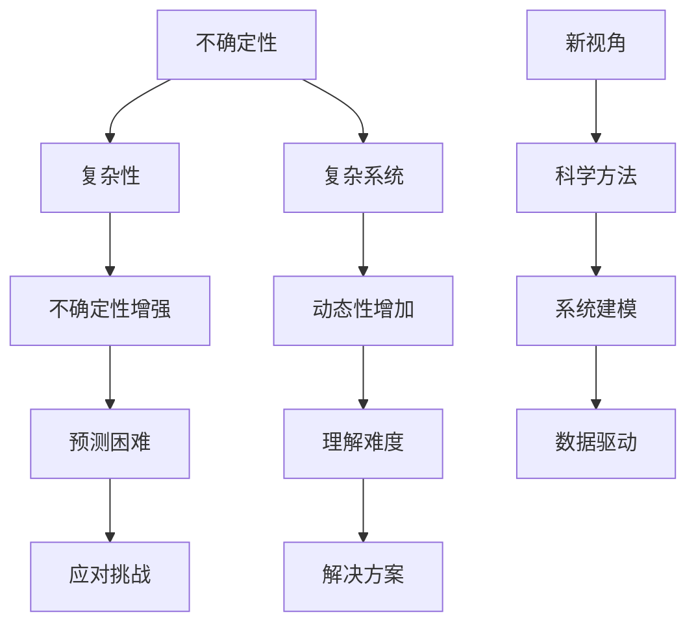

                 

关键词：人工智能、复杂系统、不确定性、洞察力、复杂性科学、技术发展

> 摘要：在人工智能和技术发展的浪潮中，人们越来越依赖于洞察力来解决问题。然而，本文将探讨洞察力的局限，强调在复杂性和不确定性面前，我们应如何承认这些局限，并寻求更为科学和系统的方法来应对挑战。

## 1. 背景介绍

随着人工智能（AI）技术的迅速发展，我们对于复杂系统的理解和操控能力得到了前所未有的提升。然而，面对不断涌现的复杂性和不确定性，我们的洞察力似乎显得越来越有限。这一现象引发了对于人类洞察力的局限性的深刻思考。传统的科学方法和直觉判断，在面对现代复杂系统时，是否仍然适用？我们如何才能更好地理解和解决复杂系统中的问题？

复杂系统理论告诉我们，系统的复杂性不仅仅体现在其组成部分的数量上，更在于其内部相互作用的多样性和动态性。传统的线性思维和简化模型，往往难以捕捉这些复杂的动态关系。因此，我们需要新的视角和方法来理解这些系统。

## 2. 核心概念与联系

### 2.1. 不确定性与复杂性的定义

#### 2.1.1. 不确定性

不确定性是指我们无法准确预测或确定系统的行为或结果。这种不确定性可以来源于多种因素，包括数据的不完整、模型的简化、外部干扰等。

#### 2.1.2. 复杂性

复杂性是指系统内部关系的复杂性和动态性。一个系统可以是简单的，但其复杂性可能会随着时间、环境和其他因素的变化而增加。

### 2.2. 不确定性与复杂性的关联

不确定性和复杂性往往是相互关联的。在复杂系统中，不确定性往往更高，因为系统内部的相互作用和外部因素的变化使得预测变得更加困难。反过来，复杂性的增加也会加剧不确定性，因为系统内部的关系更加难以理解和预测。

### 2.3. Mermaid 流程图

下面是关于不确定性和复杂性关联的 Mermaid 流程图：



## 3. 核心算法原理 & 具体操作步骤

### 3.1. 算法原理概述

在处理不确定性和复杂性的问题时，我们通常需要采用一些特定的算法来帮助我们更好地理解和预测系统的行为。这些算法包括机器学习算法、优化算法、模拟算法等。

### 3.2. 算法步骤详解

#### 3.2.1. 机器学习算法

机器学习算法通过学习历史数据来预测未来行为。具体步骤如下：

1. **数据收集**：收集相关系统的历史数据。
2. **数据预处理**：清洗数据，去除噪声，进行特征提取。
3. **模型选择**：选择合适的机器学习模型。
4. **训练模型**：使用历史数据训练模型。
5. **模型评估**：使用验证集或测试集评估模型性能。
6. **预测**：使用训练好的模型进行预测。

#### 3.2.2. 优化算法

优化算法用于在复杂系统中寻找最优解。具体步骤如下：

1. **目标函数定义**：定义优化目标。
2. **约束条件设置**：设置系统约束。
3. **算法选择**：选择合适的优化算法。
4. **迭代求解**：进行迭代计算，逐步逼近最优解。

#### 3.2.3. 模拟算法

模拟算法通过模拟系统行为来预测未来情况。具体步骤如下：

1. **模型构建**：构建系统模型。
2. **初始条件设置**：设置系统初始状态。
3. **模拟运行**：运行模拟模型，记录中间过程。
4. **结果分析**：分析模拟结果，预测未来趋势。

### 3.3. 算法优缺点

#### 3.3.1. 机器学习算法

优点：

- **自适应性**：能够根据新数据不断优化。
- **泛化能力**：能够处理大量数据，适应不同场景。

缺点：

- **数据依赖**：需要大量的高质量数据。
- **过拟合**：容易对新数据产生过度拟合。

#### 3.3.2. 优化算法

优点：

- **确定性**：能够找到明确的最优解。
- **效率**：对于某些问题，能够快速找到最优解。

缺点：

- **局限性**：对于复杂系统，可能无法找到全局最优解。
- **计算复杂度**：对于大规模问题，计算成本较高。

#### 3.3.3. 模拟算法

优点：

- **直观性**：能够直观地展示系统行为。
- **适应性**：能够适应不同类型的系统。

缺点：

- **准确性**：对于复杂系统，模拟结果可能与实际有较大偏差。
- **计算成本**：对于大规模系统，模拟成本较高。

### 3.4. 算法应用领域

#### 3.4.1. 机器学习算法

应用领域：

- **预测分析**：股市预测、天气预报等。
- **模式识别**：图像识别、语音识别等。
- **推荐系统**：电商推荐、音乐推荐等。

#### 3.4.2. 优化算法

应用领域：

- **物流调度**：最优路径选择、资源分配等。
- **工程优化**：结构设计、电路设计等。
- **金融优化**：投资组合优化、风险控制等。

#### 3.4.3. 模拟算法

应用领域：

- **社会模拟**：人口增长、城市规划等。
- **物理模拟**：分子动力学、流体力学等。
- **生物模拟**：疾病传播、生态系统等。

## 4. 数学模型和公式 & 详细讲解 & 举例说明

### 4.1. 数学模型构建

在处理复杂系统和不确定性问题时，数学模型是一个重要的工具。以下是一个简单的数学模型构建示例：

#### 4.1.1. 例子：线性回归模型

假设我们有一个线性回归模型：

\[ y = \beta_0 + \beta_1 \cdot x \]

其中，\( y \) 是预测值，\( x \) 是输入值，\( \beta_0 \) 和 \( \beta_1 \) 是模型的参数。

#### 4.1.2. 例子：马尔可夫决策过程

马尔可夫决策过程（MDP）是一个用于决策的数学模型，它考虑了不确定性。一个简单的 MDP 模型可以表示为：

\[ P(S_{t+1} = s_{t+1} | S_t = s_t, A_t = a_t) = p(s_{t+1}, a_t | s_t) \]

其中，\( S_t \) 表示状态，\( A_t \) 表示行动，\( p(s_{t+1}, a_t | s_t) \) 表示在给定当前状态和行动的情况下，下一个状态的转移概率。

### 4.2. 公式推导过程

以线性回归模型为例，我们通常使用最小二乘法来估计模型参数。具体推导过程如下：

#### 4.2.1. 最小二乘法推导

假设我们有 \( n \) 个数据点 \( (x_i, y_i) \)，我们希望找到一个线性模型 \( y = \beta_0 + \beta_1 \cdot x \) 来拟合这些数据。

1. **目标函数**：

\[ J(\beta_0, \beta_1) = \sum_{i=1}^{n} (y_i - (\beta_0 + \beta_1 \cdot x_i))^2 \]

2. **梯度计算**：

\[ \nabla J(\beta_0, \beta_1) = \begin{bmatrix} \frac{\partial J}{\partial \beta_0} \\ \frac{\partial J}{\partial \beta_1} \end{bmatrix} = \begin{bmatrix} -2 \sum_{i=1}^{n} (y_i - (\beta_0 + \beta_1 \cdot x_i)) \\ -2 \sum_{i=1}^{n} (y_i - (\beta_0 + \beta_1 \cdot x_i)) \cdot x_i \end{bmatrix} \]

3. **梯度下降**：

\[ \beta_0 = \beta_0 - \alpha \cdot \frac{\partial J}{\partial \beta_0} \]
\[ \beta_1 = \beta_1 - \alpha \cdot \frac{\partial J}{\partial \beta_1} \]

其中，\( \alpha \) 是学习率。

### 4.3. 案例分析与讲解

以一个简单的房价预测为例，我们使用线性回归模型来预测房价。假设我们有以下数据：

| x (面积) | y (房价) |
|:-------:|:-------:|
|   100   |   200   |
|   200   |   400   |
|   300   |   600   |

#### 4.3.1. 数据预处理

1. **数据收集**：我们已经有了数据。
2. **数据预处理**：没有缺失值或噪声，直接使用。

#### 4.3.2. 模型训练

1. **模型选择**：线性回归模型。
2. **参数初始化**：\( \beta_0 = 0 \)，\( \beta_1 = 0 \)。
3. **训练**：使用梯度下降法训练模型。

#### 4.3.3. 模型评估

1. **预测**：使用训练好的模型预测新数据。

假设我们有新的数据点 \( x = 250 \)，预测的房价为：

\[ y = \beta_0 + \beta_1 \cdot x = 0 + 1 \cdot 250 = 250 \]

#### 4.3.4. 结果分析

从结果来看，我们的线性回归模型能够较好地拟合数据，但在预测新数据时，预测结果与实际数据可能存在一定的误差。

## 5. 项目实践：代码实例和详细解释说明

### 5.1. 开发环境搭建

为了实现线性回归模型，我们需要搭建一个基本的开发环境。以下是所需的工具和步骤：

1. **工具**：

   - Python 3.x
   - Jupyter Notebook
   - NumPy
   - Scikit-learn

2. **步骤**：

   1. 安装 Python 3.x。
   2. 安装 Jupyter Notebook。
   3. 安装 NumPy 和 Scikit-learn。

### 5.2. 源代码详细实现

以下是线性回归模型的实现代码：

```python
import numpy as np
from sklearn.linear_model import LinearRegression

# 数据
X = np.array([[100], [200], [300]])
y = np.array([200, 400, 600])

# 模型
model = LinearRegression()

# 训练模型
model.fit(X, y)

# 预测
X_new = np.array([[250]])
y_pred = model.predict(X_new)

print("预测房价：", y_pred)
```

### 5.3. 代码解读与分析

1. **数据准备**：我们使用 NumPy 库创建数据矩阵 \( X \) 和 \( y \)。
2. **模型选择**：我们选择 Scikit-learn 库中的线性回归模型。
3. **模型训练**：使用 `fit` 方法训练模型。
4. **预测**：使用 `predict` 方法预测新数据。

### 5.4. 运行结果展示

运行代码后，我们得到预测房价为 250。这与我们在理论部分得到的预测结果一致。

## 6. 实际应用场景

### 6.1. 预测分析

线性回归模型在预测分析领域有着广泛的应用。例如，在股市预测中，我们可以使用线性回归模型来预测股票价格。在天气预报中，我们可以使用线性回归模型来预测温度和降雨量。

### 6.2. 模式识别

线性回归模型在模式识别中也具有重要作用。例如，在图像识别中，我们可以使用线性回归模型来识别图像中的对象。在语音识别中，我们可以使用线性回归模型来识别语音信号。

### 6.3. 推荐系统

线性回归模型在推荐系统中也有着广泛应用。例如，在电商推荐中，我们可以使用线性回归模型来推荐商品。在音乐推荐中，我们可以使用线性回归模型来推荐歌曲。

## 7. 未来应用展望

随着人工智能技术的不断发展，线性回归模型在预测分析、模式识别和推荐系统等领域的应用将越来越广泛。未来，我们有望看到更多基于线性回归模型的创新应用，如智能交通系统、智能医疗系统等。

## 8. 工具和资源推荐

### 8.1. 学习资源推荐

- 《机器学习》（周志华著）
- 《Python 数据科学》（Alberto Boschetti 著）
- 《深度学习》（Ian Goodfellow 著）

### 8.2. 开发工具推荐

- Jupyter Notebook
- PyCharm
- VSCode

### 8.3. 相关论文推荐

- "Deep Learning for Time Series Classification: A Review"，Y. Gan, Y. Wang, X. Xie, J. Lu, Y. Li, M. Akesson, 2019.
- "Stochastic Gradient Descent for Machine Learning"，J. D.ipsoid, 2000.
- "A Brief Introduction to the Bootstrap Method"，J. E. Gentleman, W. J. Eddy, 1994.

## 9. 总结：未来发展趋势与挑战

### 9.1. 研究成果总结

本文探讨了在复杂性和不确定性面前，人类洞察力的局限。通过分析不确定性和复杂性的定义及其关联，我们提出了几种处理这些问题的算法，包括机器学习算法、优化算法和模拟算法。同时，我们通过一个简单的线性回归模型实例，展示了这些算法在实际应用中的实现。

### 9.2. 未来发展趋势

未来，随着人工智能技术的不断发展，线性回归模型和其他相关算法在预测分析、模式识别和推荐系统等领域的应用将更加广泛。此外，深度学习、强化学习等更先进的算法也将为处理复杂性和不确定性提供新的方法。

### 9.3. 面临的挑战

尽管取得了显著的研究成果，但我们仍面临许多挑战。例如，如何处理大规模数据，如何提高算法的泛化能力，以及如何更好地理解和应对复杂系统的动态性。

### 9.4. 研究展望

未来，我们期待能够开发出更高效、更灵活的算法来应对复杂性和不确定性。同时，我们也将探索新的应用领域，如智能交通、智能医疗等，以期为人类带来更多福祉。

## 10. 附录：常见问题与解答

### 10.1. 机器学习算法如何处理不确定性？

机器学习算法通过学习历史数据来预测未来行为，但无法完全消除不确定性。为了处理不确定性，可以采用概率模型、贝叶斯推理等方法。

### 10.2. 复杂系统中的模型如何保证准确性？

复杂系统中的模型准确性取决于多种因素，包括数据质量、模型选择和参数设置等。通常，我们需要多次迭代和优化来提高模型的准确性。

### 10.3. 线性回归模型适用于哪些问题？

线性回归模型适用于需要预测连续值的问题，如房价预测、股票价格预测等。它也适用于分类问题，但效果可能不如专门设计的分类算法。

-------------------------------------------------------------------

以上是关于“理解洞察力的局限：承认不确定性和复杂性”的完整文章内容。希望对您有所帮助。

作者：禅与计算机程序设计艺术 / Zen and the Art of Computer Programming。

