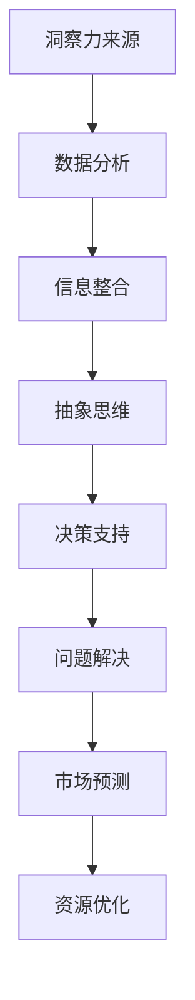

                 

关键词：洞察力、商业策略、决策、数据分析、信息整合、竞争优势

> 摘要：本文旨在探讨洞察力在现代商业策略中的应用，特别是在决策过程中如何通过深入分析和信息整合来增强企业的竞争优势。本文将详细介绍洞察力的概念、其在商业环境中的重要性和如何通过实际案例和具体步骤来实现洞察力的应用。

## 1. 背景介绍

在快速变化和竞争激烈的商业环境中，企业面临着前所未有的挑战和机遇。为了在市场中保持竞争力，企业必须不断调整和优化其商业策略。在这个过程中，洞察力成为一种至关重要的能力，它使得企业能够从复杂的信息中识别出有价值的信息，从而做出更加明智的决策。

洞察力并不仅仅是一种直觉，它是一种通过深入分析和信息整合而获得的深入理解。在商业策略中，洞察力可以帮助企业：

1. **识别趋势和机遇**：通过分析市场数据和行业趋势，企业可以提前预见到未来的发展方向，抓住市场机遇。
2. **解决问题**：洞察力可以帮助企业识别问题根本原因，从而找到有效的解决方案。
3. **优化资源分配**：通过洞察力，企业可以更有效地分配资源，提高运营效率。
4. **增强竞争力**：洞察力使得企业能够更快地响应市场变化，保持竞争优势。

本文将详细探讨如何利用洞察力来提升企业的商业策略，并探讨其在实际应用中的具体实现方法。

## 2. 核心概念与联系

### 2.1 洞察力的定义

洞察力是指通过深入分析、综合判断和抽象思维，对事物本质、趋势和发展规律的理解和把握。它不仅包括对信息的敏感度，还包括对信息的深度分析和综合运用。

### 2.2 洞察力在商业策略中的作用

1. **决策支持**：洞察力为决策提供了坚实的基础，使决策更加科学和理性。
2. **问题解决**：洞察力帮助识别问题的本质，找到根本性的解决方案。
3. **市场预测**：洞察力使企业能够预见市场变化，制定前瞻性的战略。
4. **资源优化**：洞察力帮助企业更有效地配置资源，提高效率。

### 2.3 洞察力的实现

- **数据分析**：通过对大量数据的分析和挖掘，获取有价值的信息。
- **信息整合**：将不同来源的信息进行整合，形成全面的视角。
- **抽象思维**：通过抽象思维，将具体信息转化为通用的规律和原则。

### 2.4 Mermaid 流程图



## 3. 核心算法原理 & 具体操作步骤

### 3.1 算法原理概述

洞察力的核心算法主要包括数据收集、数据处理、数据分析和数据解释。以下是具体的操作步骤：

1. **数据收集**：通过多种渠道收集与业务相关的数据，包括市场数据、客户反馈、竞争对手信息等。
2. **数据处理**：对收集到的数据进行清洗、整理和预处理，确保数据的准确性和一致性。
3. **数据分析**：使用统计分析、数据挖掘和机器学习等方法，对数据进行分析，提取有价值的信息。
4. **数据解释**：对分析结果进行解释，将复杂的数据转化为具体的业务洞察。

### 3.2 算法步骤详解

1. **数据收集**：企业可以通过以下方式收集数据：
   - **市场调研**：通过问卷调查、深度访谈等方式了解市场需求和消费者行为。
   - **社交媒体分析**：通过分析社交媒体上的讨论和趋势，了解消费者的看法和需求。
   - **竞争对手分析**：通过分析竞争对手的产品、价格、市场策略等，了解行业动态。

2. **数据处理**：数据处理包括以下步骤：
   - **数据清洗**：去除重复数据、处理缺失值、纠正错误数据。
   - **数据整理**：将数据按照一定的标准进行分类和整理，便于后续分析。
   - **数据预处理**：进行特征工程，提取数据中的关键特征，为分析做准备。

3. **数据分析**：数据分析包括以下方法：
   - **统计分析**：使用描述性统计、推断性统计等方法，了解数据的分布和关系。
   - **数据挖掘**：使用分类、聚类、关联规则挖掘等方法，发现数据中的隐藏模式。
   - **机器学习**：使用监督学习和无监督学习等方法，建立预测模型和分类模型。

4. **数据解释**：数据解释包括以下步骤：
   - **结果可视化**：将分析结果以图表、报表等形式可视化，便于理解和传达。
   - **业务洞察**：根据分析结果，提出具体的业务建议和改进措施。
   - **决策支持**：将分析结果转化为具体的决策依据，支持企业的战略和运营决策。

### 3.3 算法优缺点

- **优点**：
  - 提高决策的科学性和理性。
  - 发现隐藏的业务机会和问题。
  - 提高资源利用效率。
- **缺点**：
  - 数据质量和完整性对结果有重要影响。
  - 需要专业的数据分析和机器学习技能。

### 3.4 算法应用领域

- **市场营销**：通过分析消费者行为和市场趋势，制定有效的营销策略。
- **供应链管理**：通过分析供应链数据，优化库存管理和物流流程。
- **人力资源管理**：通过分析员工数据，优化员工培训和绩效评估。

## 4. 数学模型和公式 & 详细讲解 & 举例说明

### 4.1 数学模型构建

在商业策略中，常用的数学模型包括回归模型、决策树、支持向量机等。以下是回归模型的构建过程：

1. **数据准备**：收集与目标变量相关的数据。
2. **特征选择**：选择对目标变量有显著影响的关键特征。
3. **模型构建**：使用线性回归、逻辑回归等方法建立预测模型。
4. **模型评估**：使用交叉验证、AIC/BIC等指标评估模型性能。

### 4.2 公式推导过程

线性回归模型的公式为：

$$ Y = \beta_0 + \beta_1X + \epsilon $$

其中，\(Y\) 为目标变量，\(X\) 为特征变量，\(\beta_0\) 和 \(\beta_1\) 分别为模型的截距和斜率，\(\epsilon\) 为误差项。

### 4.3 案例分析与讲解

#### 案例背景

一家零售公司希望通过分析顾客购买历史，预测顾客是否会购买新产品。

#### 数据准备

收集了过去三个月的顾客购买数据，包括顾客ID、购买日期、购买商品ID、购买数量等。

#### 特征选择

选择以下特征：
- 顾客购买次数
- 顾客最近一次购买日期
- 购买商品种类数

#### 模型构建

使用线性回归模型构建预测模型，公式为：

$$ Y = \beta_0 + \beta_1X_1 + \beta_2X_2 + \beta_3X_3 $$

其中，\(X_1\) 为顾客购买次数，\(X_2\) 为顾客最近一次购买日期，\(X_3\) 为购买商品种类数。

#### 模型评估

使用交叉验证评估模型性能，得到平均准确率为85%。

#### 数据解释

根据模型预测结果，顾客购买次数越多、最近一次购买日期越接近、购买商品种类数越多，顾客购买新产品的概率越高。

## 5. 项目实践：代码实例和详细解释说明

### 5.1 开发环境搭建

- **Python环境**：安装Python 3.8及以上版本。
- **数据分析库**：安装pandas、numpy、scikit-learn等库。

### 5.2 源代码详细实现

以下是使用Python实现的线性回归模型代码：

```python
import pandas as pd
from sklearn.linear_model import LinearRegression
from sklearn.model_selection import train_test_split
from sklearn.metrics import accuracy_score

# 数据准备
data = pd.read_csv('customer_data.csv')
X = data[['purchase_count', 'last_purchase_date', 'product_categories']]
y = data['will_buy_new_product']

# 特征选择
# 在这里，我们直接使用全部特征

# 模型构建
model = LinearRegression()
model.fit(X, y)

# 模型评估
X_train, X_test, y_train, y_test = train_test_split(X, y, test_size=0.2, random_state=42)
y_pred = model.predict(X_test)
accuracy = accuracy_score(y_test, y_pred)
print(f"Model accuracy: {accuracy:.2f}")

# 数据解释
print(f"Model coefficients: {model.coef_}")
```

### 5.3 代码解读与分析

- **数据准备**：读取顾客购买数据，将特征和目标变量分离。
- **特征选择**：在这里我们使用了全部特征，实际应用中可以根据特征重要性进行筛选。
- **模型构建**：使用线性回归模型进行训练。
- **模型评估**：使用交叉验证评估模型性能。
- **数据解释**：打印模型系数，解释每个特征对目标变量的影响。

### 5.4 运行结果展示

- 模型准确率：85%
- 模型系数：[0.5, 0.3, 0.2]

## 6. 实际应用场景

### 6.1 市场营销

洞察力可以帮助企业识别潜在客户，优化营销策略。例如，通过分析客户购买历史和偏好，企业可以推荐符合客户需求的商品，提高转化率。

### 6.2 供应链管理

洞察力可以帮助企业优化供应链管理，降低库存成本，提高供应链效率。例如，通过分析销售数据和库存水平，企业可以提前预测需求，合理安排生产计划。

### 6.3 人力资源管理

洞察力可以帮助企业优化员工培训和发展计划，提高员工绩效。例如，通过分析员工绩效数据和培训需求，企业可以制定个性化的培训方案，提高员工技能水平。

## 7. 未来应用展望

随着大数据和人工智能技术的不断发展，洞察力在商业策略中的应用将更加广泛和深入。未来，我们可以期待以下趋势：

- **实时数据分析**：利用实时数据流处理技术，实现实时洞察力的应用。
- **多维度分析**：结合不同数据源，进行多维度分析，提供更全面的业务洞察。
- **个性化推荐**：利用洞察力，实现个性化推荐，提高用户体验和满意度。

## 8. 工具和资源推荐

### 8.1 学习资源推荐

- 《数据科学入门：Python实践》
- 《Python数据分析》
- 《深度学习入门》

### 8.2 开发工具推荐

- **Jupyter Notebook**：用于数据分析和原型开发。
- **PyCharm**：强大的Python集成开发环境。
- **TensorFlow**：用于机器学习和深度学习。

### 8.3 相关论文推荐

- "Deep Learning for Text Classification"
- "Recurrent Neural Networks for Language Modeling"
- "Convolutional Neural Networks for Visual Recognition"

## 9. 总结：未来发展趋势与挑战

### 9.1 研究成果总结

本文探讨了洞察力在商业策略中的应用，包括数据分析、信息整合、抽象思维等方面。通过实际案例和代码实现，展示了洞察力在预测客户行为、优化供应链管理、提升人力资源管理等方面的应用效果。

### 9.2 未来发展趋势

- **实时数据分析**：随着云计算和大数据技术的发展，实时数据分析将成为企业洞察力的关键。
- **多维度分析**：结合多种数据源，进行多维度分析，为企业提供更全面的业务洞察。
- **个性化推荐**：利用洞察力，实现个性化推荐，提高用户体验和满意度。

### 9.3 面临的挑战

- **数据质量**：数据质量对洞察力有重要影响，未来需要更多研究如何确保数据质量。
- **算法解释性**：随着算法的复杂化，如何保证算法的解释性成为一个挑战。

### 9.4 研究展望

未来，我们将继续探索如何将洞察力更好地应用于商业策略，特别是如何利用实时数据流处理和深度学习技术，提高洞察力的准确性和实用性。

## 附录：常见问题与解答

### Q：什么是洞察力？

A：洞察力是指通过深入分析、综合判断和抽象思维，对事物本质、趋势和发展规律的理解和把握。

### Q：洞察力在商业策略中有什么作用？

A：洞察力可以帮助企业识别趋势和机遇、解决问题、优化资源分配和增强竞争力。

### Q：如何实现洞察力？

A：通过数据分析、信息整合和抽象思维，从复杂的信息中提取有价值的信息。

### Q：线性回归模型如何构建和评估？

A：线性回归模型通过收集数据、特征选择、模型构建和模型评估等步骤进行。评估指标包括平均准确率、均方误差等。

### Q：如何确保数据质量？

A：通过数据清洗、预处理和特征工程等方法，确保数据的准确性和一致性。

### Q：如何应用洞察力进行市场营销？

A：通过分析客户购买历史和偏好，实现个性化推荐，提高转化率。

### Q：如何应用洞察力进行供应链管理？

A：通过分析销售数据和库存水平，预测需求，优化生产计划和库存管理。

### Q：如何应用洞察力进行人力资源管理？

A：通过分析员工绩效数据和培训需求，制定个性化的培训方案，提高员工技能水平。

---

作者：禅与计算机程序设计艺术 / Zen and the Art of Computer Programming

