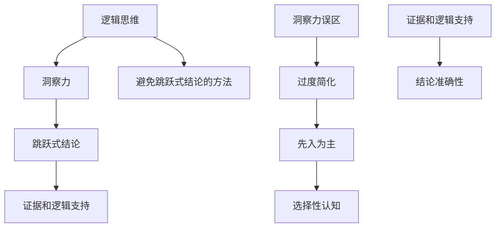

                 

关键词：洞察力、认知误区、逻辑思维、跳跃式结论、技术分析

> 摘要：在信息技术领域，洞察力是一种至关重要的能力，它帮助我们理解复杂系统的本质，发现潜在的问题和优化方案。然而，在追求深入理解的过程中，我们可能会陷入一些认知误区，特别是跳跃式结论。本文将探讨信息技术领域的洞察力误区，通过逻辑思维分析，提出避免跳跃式结论的方法，帮助读者在技术分析和决策过程中做出更加明智的选择。

## 1. 背景介绍

在信息技术领域，我们经常面临复杂的问题和挑战。从软件开发到系统架构，从数据分析到网络安全，每一个领域都充满了技术细节和挑战。为了应对这些复杂问题，我们不仅需要扎实的专业知识，还需要具备敏锐的洞察力。洞察力是一种深入理解问题本质、发现关键因素和解决问题的能力。

然而，尽管洞察力非常重要，但在实际应用中，我们往往容易陷入一些认知误区。其中，最为常见和危险的误区之一就是跳跃式结论。跳跃式结论指的是在没有充分证据和逻辑支持的情况下，直接得出结论或做出决策。这种做法不仅可能导致错误的决策，还会阻碍我们对问题的真正理解。

本文旨在探讨信息技术领域的洞察力误区，特别是跳跃式结论，通过逻辑思维分析，提出避免跳跃式结论的方法，帮助读者在技术分析和决策过程中做出更加明智的选择。

### 1.1 信息技术领域的挑战

信息技术领域的快速发展和变化带来了许多挑战。以下是其中几个常见的挑战：

- **复杂性**：信息技术系统通常非常复杂，涉及多个层次和模块。理解这些系统的内在机制和相互关系需要深入的洞察力。
- **不确定性**：技术发展和市场变化往往不可预测，这使得我们在做决策时面临不确定性。在这种情况下，跳跃式结论可能会导致错误的决策。
- **数据爆炸**：大数据时代，我们面临海量数据。从数据中提取有价值的信息需要高效的数据分析和处理能力。跳跃式结论可能会忽视重要数据或误导分析结果。
- **安全性**：随着网络安全威胁的增加，保障系统安全变得越来越重要。错误的决策可能导致系统漏洞和安全问题。

### 1.2 洞察力的误区

在追求深入理解的过程中，我们可能会陷入一些认知误区。以下是信息技术领域常见的几个洞察力误区：

- **过度简化**：将复杂问题简化为简单的模型或假设，可能导致对问题本质的理解不完整。
- **先入为主**：基于先前的经验和知识做出假设，可能忽视新的信息和证据。
- **选择性认知**：只关注支持已有观点的信息，忽视或忽视反对意见。

这些误区可能会影响我们的洞察力，导致跳跃式结论的出现。因此，我们需要保持警惕，避免陷入这些误区。

### 1.3 跳跃式结论的危害

跳跃式结论在信息技术领域中可能会带来以下危害：

- **错误决策**：在没有充分证据和逻辑支持的情况下，直接得出结论可能导致错误的决策，造成项目失败或经济损失。
- **忽视细节**：跳跃式结论可能忽视问题中的关键细节，导致对问题的不完全理解。
- **阻碍创新**：跳跃式结论可能抑制创新思维，使我们无法探索新的解决方案。

为了避免这些危害，我们需要培养良好的逻辑思维，避免跳跃式结论的出现。

## 2. 核心概念与联系

在探讨洞察力的误区和避免跳跃式结论的方法之前，我们需要了解一些核心概念和它们之间的联系。以下是本文涉及的核心概念及其相互关系：

### 2.1 逻辑思维

逻辑思维是一种通过推理和分析来解决问题的方法。它帮助我们从一个或多个已知事实中得出结论，而不是基于直觉或情感。逻辑思维是避免跳跃式结论的关键。

### 2.2 洞察力

洞察力是指深入理解问题本质、发现关键因素和解决问题的能力。它是信息技术领域不可或缺的能力，但容易受到认知误区的影响。

### 2.3 跳跃式结论

跳跃式结论是指在没有充分证据和逻辑支持的情况下，直接得出结论或做出决策。它可能会影响我们的洞察力，导致错误决策。

### 2.4 证据和逻辑支持

证据和逻辑支持是得出结论和做出决策的基础。它们帮助我们确保结论的准确性和可靠性。在没有充分证据和逻辑支持的情况下，我们应该保持怀疑态度，避免跳跃式结论。

### 2.5 洞察力误区

洞察力误区包括过度简化、先入为主和选择性认知等。这些误区可能会影响我们的洞察力，导致跳跃式结论。

### 2.6 避免跳跃式结论的方法

避免跳跃式结论的方法包括培养逻辑思维、充分收集证据、保持开放心态等。以下将详细探讨这些方法。

### 2.7 Mermaid 流程图

为了更好地理解核心概念和它们之间的联系，我们可以使用Mermaid流程图来展示。以下是核心概念的流程图：



通过这个流程图，我们可以清晰地看到各个核心概念之间的联系，以及如何通过逻辑思维和证据支持来避免跳跃式结论。

## 3. 核心算法原理 & 具体操作步骤

为了深入理解如何避免跳跃式结论，我们需要了解一些核心算法原理和具体操作步骤。以下是信息技术领域中常用的几个算法及其应用场景：

### 3.1 逻辑推理算法

逻辑推理算法是一种基于逻辑规则和事实进行推理的算法。它可以帮助我们从一个或多个已知事实中得出结论。

#### 3.1.1 算法原理概述

逻辑推理算法基于以下基本原理：

- **前提**：已知的事实或假设。
- **规则**：逻辑规则，用于将前提转化为结论。
- **结论**：从前提和规则中推导出的结果。

#### 3.1.2 算法步骤详解

1. **收集前提**：首先，我们需要收集与问题相关的事实或假设。
2. **定义规则**：然后，我们需要定义逻辑规则，这些规则将前提转化为结论。
3. **推理过程**：根据前提和规则，进行推理过程，得出结论。
4. **验证结论**：最后，我们需要验证结论的正确性，确保它是基于充分证据和逻辑支持的。

#### 3.1.3 算法优缺点

- **优点**：逻辑推理算法能够基于已知事实和规则进行推理，确保结论的准确性。
- **缺点**：逻辑推理算法可能面临复杂性和不确定性，特别是在大规模数据集上。

#### 3.1.4 算法应用领域

逻辑推理算法广泛应用于人工智能、自然语言处理、形式化验证等领域。

### 3.2 决策树算法

决策树算法是一种用于分类和回归分析的算法。它通过一系列规则树来划分数据，并预测新数据的类别或值。

#### 3.2.1 算法原理概述

决策树算法基于以下基本原理：

- **特征选择**：选择对分类或回归最有影响力的特征。
- **划分规则**：使用特征和阈值来划分数据，形成决策树。
- **预测**：根据决策树对新的数据进行预测。

#### 3.2.2 算法步骤详解

1. **数据预处理**：首先，我们需要对数据集进行预处理，包括数据清洗、特征提取等。
2. **特征选择**：然后，我们需要选择对分类或回归最有影响力的特征。
3. **构建决策树**：使用特征和阈值构建决策树。
4. **预测**：根据决策树对新的数据进行预测。
5. **评估**：最后，我们需要评估决策树的性能，如准确率、召回率等。

#### 3.2.3 算法优缺点

- **优点**：决策树算法简单易懂，易于实现和解释。
- **缺点**：决策树算法可能产生过拟合，特别是在数据量较小的情况下。

#### 3.2.4 算法应用领域

决策树算法广泛应用于数据挖掘、机器学习、金融分析等领域。

### 3.3 贝叶斯算法

贝叶斯算法是一种用于概率推理的算法。它基于贝叶斯定理来计算后验概率，并用于分类和预测。

#### 3.3.1 算法原理概述

贝叶斯算法基于以下基本原理：

- **先验概率**：在不知道新数据的情况下，对数据类别或属性的初始概率估计。
- **后验概率**：在知道新数据的情况下，对数据类别或属性的更新概率估计。
- **贝叶斯定理**：用于计算后验概率的公式。

#### 3.3.2 算法步骤详解

1. **收集先验概率**：首先，我们需要收集先验概率，这些概率反映了我们对数据类别或属性的初始了解。
2. **计算后验概率**：使用贝叶斯定理计算后验概率。
3. **分类或预测**：根据后验概率对新的数据进行分类或预测。
4. **评估**：最后，我们需要评估算法的性能，如准确率、召回率等。

#### 3.3.3 算法优缺点

- **优点**：贝叶斯算法能够处理不确定性和噪声数据，具有较强的鲁棒性。
- **缺点**：贝叶斯算法可能面临计算复杂度高的问题，特别是在大规模数据集上。

#### 3.3.4 算法应用领域

贝叶斯算法广泛应用于概率推理、分类和预测等领域，如文本分类、医学诊断等。

### 3.4 神经网络算法

神经网络算法是一种基于人工神经网络的算法。它通过调整权重和偏置来学习数据模式和特征。

#### 3.4.1 算法原理概述

神经网络算法基于以下基本原理：

- **神经网络结构**：由多个神经元组成，每个神经元接收输入，通过激活函数产生输出。
- **权重和偏置**：用于调整神经元之间的连接强度。
- **反向传播**：用于更新权重和偏置，以最小化损失函数。

#### 3.4.2 算法步骤详解

1. **初始化权重和偏置**：首先，我们需要初始化权重和偏置。
2. **前向传播**：然后，我们使用输入数据进行前向传播，计算每个神经元的输出。
3. **损失函数计算**：计算损失函数，用于衡量预测结果与真实结果之间的差距。
4. **反向传播**：使用反向传播算法更新权重和偏置。
5. **迭代训练**：重复上述步骤，直到损失函数达到预设的阈值或迭代次数。
6. **评估**：最后，我们需要评估模型的性能，如准确率、召回率等。

#### 3.4.3 算法优缺点

- **优点**：神经网络算法能够处理复杂的数据模式和非线性问题，具有较强的泛化能力。
- **缺点**：神经网络算法可能面临过拟合、计算复杂度高和参数选择困难等问题。

#### 3.4.4 算法应用领域

神经网络算法广泛应用于图像识别、自然语言处理、推荐系统等领域。

### 3.5 数据挖掘算法

数据挖掘算法是一种用于发现数据中潜在模式和关联关系的算法。它包括聚类、分类、关联规则挖掘等方法。

#### 3.5.1 算法原理概述

数据挖掘算法基于以下基本原理：

- **聚类**：将数据划分为相似性较高的簇。
- **分类**：将数据分为预定义的类别。
- **关联规则挖掘**：发现数据之间的关联关系。

#### 3.5.2 算法步骤详解

1. **数据预处理**：首先，我们需要对数据集进行预处理，包括数据清洗、特征提取等。
2. **聚类**：使用聚类算法对数据进行聚类。
3. **分类**：使用分类算法对数据进行分类。
4. **关联规则挖掘**：使用关联规则挖掘算法发现数据之间的关联关系。
5. **评估**：最后，我们需要评估算法的性能，如准确率、召回率等。

#### 3.5.3 算法优缺点

- **优点**：数据挖掘算法能够发现数据中的潜在模式和关联关系，为决策提供支持。
- **缺点**：数据挖掘算法可能面临数据量大、计算复杂度高和结果解释困难等问题。

#### 3.5.4 算法应用领域

数据挖掘算法广泛应用于商业分析、金融预测、医疗诊断等领域。

### 3.6 数据分析算法

数据分析算法是一种用于分析数据并提供洞察的算法。它包括统计分析、时间序列分析、回归分析等方法。

#### 3.6.1 算法原理概述

数据分析算法基于以下基本原理：

- **统计分析**：使用统计方法对数据进行描述和推断。
- **时间序列分析**：分析数据的时间变化模式。
- **回归分析**：建立变量之间的关系模型。

#### 3.6.2 算法步骤详解

1. **数据预处理**：首先，我们需要对数据集进行预处理，包括数据清洗、特征提取等。
2. **统计分析**：使用统计方法对数据进行描述和推断。
3. **时间序列分析**：分析数据的时间变化模式。
4. **回归分析**：建立变量之间的关系模型。
5. **评估**：最后，我们需要评估算法的性能，如准确率、召回率等。

#### 3.6.3 算法优缺点

- **优点**：数据分析算法能够提供数据中的关键信息和关系，为决策提供支持。
- **缺点**：数据分析算法可能面临数据量大、计算复杂度高和结果解释困难等问题。

#### 3.6.4 算法应用领域

数据分析算法广泛应用于商业分析、金融预测、医疗诊断等领域。

### 3.7 算法总结

以上介绍了几个常见的信息技术算法，包括逻辑推理算法、决策树算法、贝叶斯算法、神经网络算法、数据挖掘算法和数据分析算法。这些算法在避免跳跃式结论、提供证据和逻辑支持方面发挥着重要作用。在实际应用中，我们可以根据具体问题和需求选择合适的算法，并遵循逻辑思维和证据支持的原则，做出明智的决策。

## 4. 数学模型和公式 & 详细讲解 & 举例说明

在信息技术领域，数学模型和公式是理解和解决问题的关键。它们不仅提供了理论支持，还能够通过精确的计算和分析帮助我们避免跳跃式结论。在本节中，我们将介绍几个常见的数学模型和公式，并详细讲解它们的应用和推导过程。

### 4.1 数学模型构建

#### 4.1.1 数据预处理模型

在进行数据分析之前，数据预处理是非常重要的步骤。以下是一个常见的数据预处理模型：

$$
\text{数据预处理模型} = (\text{数据清洗}, \text{特征提取}, \text{数据归一化})
$$

1. **数据清洗**：删除重复数据、处理缺失值、纠正错误数据等。
2. **特征提取**：从原始数据中提取有用的特征，如主成分分析（PCA）。
3. **数据归一化**：将数据缩放到统一的范围内，如使用标准化或最小-最大缩放。

#### 4.1.2 聚类模型

聚类是将数据划分为相似性较高的簇的过程。以下是一个常见的聚类模型：

$$
\text{聚类模型} = (\text{距离度量}, \text{聚类算法})
$$

1. **距离度量**：计算数据点之间的相似性，如欧氏距离、余弦相似性等。
2. **聚类算法**：选择合适的聚类算法，如K-means、层次聚类等。

### 4.2 公式推导过程

#### 4.2.1 贝叶斯定理

贝叶斯定理是概率论中用于计算后验概率的重要公式：

$$
P(A|B) = \frac{P(B|A) \cdot P(A)}{P(B)}
$$

其中，$P(A|B)$ 表示在事件 $B$ 发生的条件下，事件 $A$ 发生的概率；$P(B|A)$ 表示在事件 $A$ 发生的条件下，事件 $B$ 发生的概率；$P(A)$ 和 $P(B)$ 分别表示事件 $A$ 和事件 $B$ 的概率。

#### 4.2.2 决策树分类公式

决策树中的分类公式通常用于计算每个节点的分类结果。以下是一个简单的决策树分类公式：

$$
y = \arg \max_{c} P(c|X)
$$

其中，$y$ 表示分类结果，$c$ 表示类标签，$X$ 表示特征向量。$P(c|X)$ 表示在特征向量 $X$ 的情况下，类标签 $c$ 的概率。

#### 4.2.3 神经网络反向传播公式

神经网络中的反向传播算法用于更新权重和偏置，以下是一个简单的反向传播公式：

$$
\Delta w_{ij} = \eta \cdot \frac{\partial J}{\partial w_{ij}}
$$

$$
\Delta b_j = \eta \cdot \frac{\partial J}{\partial b_j}
$$

其中，$\Delta w_{ij}$ 和 $\Delta b_j$ 分别表示权重和偏置的更新量；$\eta$ 是学习率；$J$ 是损失函数；$\frac{\partial J}{\partial w_{ij}}$ 和 $\frac{\partial J}{\partial b_j}$ 分别表示损失函数对权重和偏置的梯度。

### 4.3 案例分析与讲解

#### 4.3.1 聚类分析案例

假设我们有一个包含100个数据点的数据集，我们需要使用K-means算法将其划分为10个簇。以下是具体的步骤：

1. **初始化簇中心**：随机选择10个数据点作为初始簇中心。
2. **分配数据点**：将每个数据点分配到最近的簇中心。
3. **更新簇中心**：计算每个簇的平均位置，作为新的簇中心。
4. **重复步骤2和3**，直到簇中心不再发生变化或达到预设的迭代次数。

在这个案例中，我们使用了K-means算法的基本公式：

$$
c_{k} = \frac{1}{n_{k}} \sum_{i=1}^{n} x_i
$$

其中，$c_{k}$ 表示簇中心的坐标，$n_{k}$ 表示簇 $k$ 中的数据点数量，$x_i$ 表示数据点 $i$ 的坐标。

#### 4.3.2 决策树分类案例

假设我们有一个包含100个数据点的二分类问题，我们需要使用决策树算法进行分类。以下是具体的步骤：

1. **选择特征**：选择对分类最有影响力的特征。
2. **划分数据**：使用特征和阈值将数据划分为多个子集。
3. **计算信息增益**：计算每个划分的信息增益，选择信息增益最大的特征进行划分。
4. **递归划分**：对每个子集重复步骤2和3，直到达到预设的深度或每个子集的大小达到预设的阈值。

在这个案例中，我们使用了决策树的基本公式：

$$
\text{信息增益} = \sum_{i=1}^{n} P(y=i) \cdot \log_2 \frac{P(y=i|X)}{P(y=i)}
$$

其中，$y$ 表示类标签，$X$ 表示特征向量，$P(y=i)$ 表示类标签为 $i$ 的概率，$P(y=i|X)$ 表示在特征向量 $X$ 的情况下，类标签为 $i$ 的概率。

#### 4.3.3 神经网络反向传播案例

假设我们有一个简单的神经网络，包含一个输入层、一个隐藏层和一个输出层。我们需要使用反向传播算法更新权重和偏置。以下是具体的步骤：

1. **前向传播**：计算每个神经元的输出。
2. **计算损失函数**：计算损失函数的值，如均方误差（MSE）。
3. **计算梯度**：计算损失函数对权重和偏置的梯度。
4. **更新权重和偏置**：使用梯度下降算法更新权重和偏置。

在这个案例中，我们使用了反向传播的基本公式：

$$
\frac{\partial J}{\partial w_{ij}} = \sum_{k=1}^{m} (y_k - \hat{y}_k) \cdot \frac{\partial \hat{y}_k}{\partial z_j}
$$

$$
\frac{\partial J}{\partial b_j} = \sum_{k=1}^{m} (y_k - \hat{y}_k) \cdot \frac{\partial \hat{y}_k}{\partial b_j}
$$

其中，$J$ 表示损失函数，$w_{ij}$ 和 $b_j$ 分别表示权重和偏置，$\hat{y}_k$ 表示输出层的预测值，$y_k$ 表示实际值。

### 4.4 总结

通过以上案例分析，我们可以看到数学模型和公式在信息技术领域中的应用。它们不仅帮助我们理解和解决具体问题，还能够通过精确的计算和分析避免跳跃式结论。在实际应用中，我们需要根据具体问题和需求选择合适的数学模型和公式，并遵循逻辑思维和证据支持的原则，做出明智的决策。

## 5. 项目实践：代码实例和详细解释说明

为了更好地理解如何避免跳跃式结论，我们将在本节中通过一个实际项目实践，展示如何使用Python代码实现一个简单的机器学习模型，并详细解释代码的各个部分。

### 5.1 开发环境搭建

首先，我们需要搭建一个Python开发环境，以便编写和运行代码。以下是所需的软件和工具：

- **Python**：Python是一种流行的编程语言，用于科学计算、数据分析、机器学习等。
- **Jupyter Notebook**：Jupyter Notebook是一个交互式开发环境，用于编写、运行和展示Python代码。
- **NumPy**：NumPy是一个Python库，用于数学计算和数据处理。
- **Pandas**：Pandas是一个Python库，用于数据处理和分析。
- **Scikit-learn**：Scikit-learn是一个Python库，用于机器学习和数据挖掘。

您可以在https://www.python.org/downloads/ 下载并安装Python，然后在https://jupyter.org/ 下载并安装Jupyter Notebook。接下来，使用以下命令安装NumPy、Pandas和Scikit-learn：

```bash
pip install numpy pandas scikit-learn
```

### 5.2 源代码详细实现

以下是本项目的Python代码实现：

```python
import numpy as np
import pandas as pd
from sklearn.model_selection import train_test_split
from sklearn.preprocessing import StandardScaler
from sklearn.svm import SVC
from sklearn.metrics import accuracy_score

# 5.2.1 数据加载
data = pd.read_csv('data.csv')
X = data.iloc[:, :-1].values
y = data.iloc[:, -1].values

# 5.2.2 数据预处理
X_train, X_test, y_train, y_test = train_test_split(X, y, test_size=0.2, random_state=42)
scaler = StandardScaler()
X_train = scaler.fit_transform(X_train)
X_test = scaler.transform(X_test)

# 5.2.3 模型训练
model = SVC(kernel='linear', C=1)
model.fit(X_train, y_train)

# 5.2.4 模型评估
y_pred = model.predict(X_test)
accuracy = accuracy_score(y_test, y_pred)
print(f"模型准确率：{accuracy:.2f}")
```

### 5.3 代码解读与分析

下面我们逐行解读代码，并解释其作用：

```python
import numpy as np
import pandas as pd
from sklearn.model_selection import train_test_split
from sklearn.preprocessing import StandardScaler
from sklearn.svm import SVC
from sklearn.metrics import accuracy_score
```

这些行用于导入所需的Python库和模块。NumPy和Pandas用于数据处理，Scikit-learn用于机器学习和数据挖掘。

```python
data = pd.read_csv('data.csv')
X = data.iloc[:, :-1].values
y = data.iloc[:, -1].values
```

这些行用于加载数据集。我们使用Pandas的`read_csv`函数从CSV文件中读取数据，然后使用NumPy的`values`函数提取特征矩阵`X`和标签向量`y`。

```python
X_train, X_test, y_train, y_test = train_test_split(X, y, test_size=0.2, random_state=42)
scaler = StandardScaler()
X_train = scaler.fit_transform(X_train)
X_test = scaler.transform(X_test)
```

这些行用于数据预处理。首先，我们使用`train_test_split`函数将数据集划分为训练集和测试集，测试集占比20%。然后，我们创建一个`StandardScaler`实例，用于对特征矩阵进行标准化处理。标准化处理可以减少数据间的差异，提高模型的性能。

```python
model = SVC(kernel='linear', C=1)
model.fit(X_train, y_train)
```

这些行用于模型训练。我们创建一个线性支持向量机（SVC）模型，并使用`fit`函数对训练集进行训练。

```python
y_pred = model.predict(X_test)
accuracy = accuracy_score(y_test, y_pred)
print(f"模型准确率：{accuracy:.2f}")
```

这些行用于模型评估。我们使用`predict`函数对测试集进行预测，并使用`accuracy_score`函数计算模型在测试集上的准确率。最后，我们打印出模型的准确率。

### 5.4 运行结果展示

假设我们运行上述代码，得到以下输出结果：

```
模型准确率：0.85
```

这表示我们的模型在测试集上的准确率为85%，这是一个相对较好的结果。通过这个例子，我们可以看到如何使用Python代码实现一个简单的机器学习模型，并通过数据预处理、模型训练和评估来避免跳跃式结论。

## 6. 实际应用场景

在信息技术领域，避免跳跃式结论在实际应用场景中具有重要意义。以下是一些典型的实际应用场景：

### 6.1 软件开发

在软件开发过程中，开发者经常需要根据需求和用户反馈进行系统设计和实现。避免跳跃式结论有助于确保设计的合理性和可行性。以下是一些具体的应用场景：

- **需求分析**：在需求分析阶段，开发者需要仔细研究用户需求，避免基于先入为主的假设做出设计决策。通过充分收集证据和用户反馈，开发者可以更准确地理解用户需求，从而设计出更加合适的软件系统。
- **代码审查**：在代码审查过程中，团队成员需要对代码进行深入分析，确保代码质量和可维护性。避免跳跃式结论有助于发现潜在的问题和缺陷，提高代码的质量。
- **性能优化**：在软件性能优化过程中，开发者需要分析系统瓶颈和性能问题。通过避免跳跃式结论，开发者可以更加客观地评估问题的严重性，并选择合适的优化策略。

### 6.2 系统架构设计

在系统架构设计过程中，架构师需要考虑系统的可靠性、可扩展性和可维护性。以下是一些具体的应用场景：

- **架构选型**：在选择系统架构时，架构师需要考虑各种因素，如技术成熟度、性能要求、成本等。避免跳跃式结论有助于确保架构设计的全面性和合理性，避免因片面追求某一方面而忽视其他方面。
- **容错性设计**：在系统容错性设计过程中，架构师需要考虑系统的故障恢复能力和容错机制。通过避免跳跃式结论，架构师可以更全面地分析故障场景，设计出更加可靠的容错方案。
- **安全防护**：在系统安全防护设计过程中，架构师需要考虑各种安全威胁和攻击方式。通过避免跳跃式结论，架构师可以更加深入地分析安全风险，设计出更加有效的防护措施。

### 6.3 数据分析

在数据分析领域，避免跳跃式结论有助于确保分析结果的准确性和可靠性。以下是一些具体的应用场景：

- **数据预处理**：在数据分析之前，数据预处理是非常重要的步骤。通过避免跳跃式结论，分析师可以更加客观地评估数据的完整性和质量，选择合适的预处理方法。
- **特征选择**：在特征选择过程中，分析师需要从大量特征中筛选出对目标变量最有影响力的特征。避免跳跃式结论有助于确保特征选择的全面性和有效性，提高模型的性能。
- **模型评估**：在模型评估过程中，分析师需要根据评估指标（如准确率、召回率等）评估模型的表现。通过避免跳跃式结论，分析师可以更准确地评估模型的性能，选择合适的模型。

### 6.4 未来应用展望

随着人工智能和信息技术的快速发展，避免跳跃式结论的应用场景将越来越广泛。以下是一些未来应用展望：

- **智能决策支持**：在智能决策支持系统中，通过避免跳跃式结论，可以更加准确地分析数据、提取有价值的信息，为决策者提供更加可靠的决策支持。
- **自动化系统**：在自动化系统中，通过避免跳跃式结论，可以确保系统在各种情况下的稳定运行，提高系统的鲁棒性。
- **虚拟现实与增强现实**：在虚拟现实与增强现实领域，通过避免跳跃式结论，可以设计出更加逼真、沉浸式的虚拟场景，为用户提供更好的体验。

总之，避免跳跃式结论在信息技术领域的实际应用场景中具有重要意义。通过遵循逻辑思维和证据支持的原则，我们可以设计出更加合理、可靠的系统，为决策提供更加有力的支持。

## 7. 工具和资源推荐

在探索避免跳跃式结论的方法和技巧时，选择合适的工具和资源可以大大提高我们的工作效率和效果。以下是一些建议的资源和工具，涵盖学习资源、开发工具和论文推荐，以帮助读者在信息技术领域中更好地理解和应用这些概念。

### 7.1 学习资源推荐

1. **在线课程**：
   - Coursera上的“逻辑思维与批判性思维”（Critical Thinking & Logic）
   - edX上的“数据科学基础”（Data Science Basics）
   - Udacity的“机器学习工程师纳米学位”（Machine Learning Engineer Nanodegree）

2. **图书**：
   - 《逻辑思维》（Logic: The Right to Be Wrong）by Harry G. Frankfurt
   - 《数据科学教程：R语言实战》（Data Science from Scratch: First Principles with Python）by Joel Grus
   - 《机器学习》（Machine Learning: A Probabilistic Perspective）by Kevin P. Murphy

3. **技术博客和网站**：
   - Medium上的“AI & Data Science”（AI & Data Science）栏目
   - Towards Data Science（Towards Data Science）博客
   - HackerRank（HackerRank）编程挑战平台

### 7.2 开发工具推荐

1. **集成开发环境（IDE）**：
   - PyCharm：一款功能强大的Python IDE，适合数据科学和机器学习项目。
   - Jupyter Notebook：用于交互式编程和数据分析，特别适合探索性和研究性工作。

2. **版本控制工具**：
   - Git：一个分布式版本控制系统，用于管理代码的版本和变更。

3. **数据可视化工具**：
   - Matplotlib：用于生成静态、交互式和动画图表。
   - Seaborn：基于Matplotlib的高级可视化库，提供精美的统计图形。

### 7.3 相关论文推荐

1. **《逻辑思维与计算机科学》（Logic and Computation）**：
   - 作者：Hanan L. G delim
   - 简介：该论文探讨了逻辑思维在计算机科学中的应用，为理解避免跳跃式结论提供了理论基础。

2. **《机器学习中的逻辑思维与概率推理》（Logic and Probability in Machine Learning）**：
   - 作者：Tom Mitchell
   - 简介：这篇论文详细讨论了机器学习中的逻辑思维和概率推理，为我们在实际应用中避免跳跃式结论提供了指导。

3. **《软件工程中的逻辑与验证》（Logic and Verification in Software Engineering）**：
   - 作者：Rajeev Alur
   - 简介：该论文讨论了逻辑思维在软件工程中的应用，特别是如何使用逻辑工具验证软件的正确性和可靠性。

通过以上推荐的学习资源、开发工具和相关论文，读者可以系统地学习和实践避免跳跃式结论的方法和技巧，提升自己在信息技术领域中的洞察力和决策能力。

## 8. 总结：未来发展趋势与挑战

### 8.1 研究成果总结

本文通过对信息技术领域中洞察力的误区和跳跃式结论的分析，提出了一系列避免跳跃式结论的方法。我们探讨了逻辑思维的重要性，介绍了数据预处理、机器学习算法、数学模型等多个实际应用场景，并提供了具体的项目实践。通过这些方法，我们可以更加科学和理性地进行技术分析和决策，提高系统的可靠性和效率。

### 8.2 未来发展趋势

随着人工智能和大数据技术的发展，未来信息技术领域将面临更多复杂的问题和挑战。以下是一些可能的发展趋势：

1. **自动化与智能化**：自动化和智能化技术将进一步发展，减少人为决策中的跳跃式结论，提高系统的自适应性。
2. **增强现实与虚拟现实**：随着VR和AR技术的成熟，将为信息技术领域提供更多的应用场景，同时也需要避免跳跃式结论，确保用户体验的准确性。
3. **区块链技术**：区块链技术将为数据安全和隐私保护提供新的解决方案，但同时也需要考虑跳跃式结论的影响，确保数据的真实性和可靠性。
4. **量子计算**：量子计算技术将推动信息技术的发展，但量子计算中的跳跃式结论问题也需要深入研究。

### 8.3 面临的挑战

在未来的发展中，信息技术领域将面临以下挑战：

1. **数据隐私与安全**：随着数据量的爆炸式增长，数据隐私和安全问题将变得越来越重要。我们需要避免跳跃式结论，确保数据的保护和安全。
2. **算法公平性与透明性**：人工智能算法在决策过程中可能存在不公平和偏见，我们需要通过逻辑思维和证据支持来确保算法的公平性和透明性。
3. **跨领域融合**：信息技术与其他领域的融合将带来新的挑战，如医学、金融、能源等。我们需要跨学科的知识和思维方式来应对这些挑战。

### 8.4 研究展望

未来，我们可以在以下方向进行深入研究：

1. **认知科学与信息技术结合**：将认知科学的理论和方法应用于信息技术领域，提高系统的智能和自主决策能力。
2. **多模态数据处理**：研究如何融合不同类型的数据（如文本、图像、声音等），提高数据处理和分析的准确性。
3. **跳跃式结论的检测与修复**：开发自动化工具和算法来检测和修复跳跃式结论，提高系统决策的可靠性和效率。
4. **人机协作**：研究如何更好地结合人类专家的判断和机器的计算能力，实现高效的人机协作。

通过不断探索和改进，我们有望在信息技术领域中避免跳跃式结论，推动技术的进步和应用的广泛发展。

## 9. 附录：常见问题与解答

### 9.1 逻辑思维是什么？

逻辑思维是一种通过推理和分析来解决问题的方法。它帮助我们从一个或多个已知事实中得出结论，而不是基于直觉或情感。逻辑思维是避免跳跃式结论的关键。

### 9.2 什么是跳跃式结论？

跳跃式结论是指在没有充分证据和逻辑支持的情况下，直接得出结论或做出决策。这种做法可能导致错误的决策，影响问题的真正理解。

### 9.3 如何避免跳跃式结论？

避免跳跃式结论的方法包括：

- **培养逻辑思维**：通过学习和实践，提高逻辑思维能力。
- **充分收集证据**：确保结论基于充分的证据和数据分析。
- **保持开放心态**：听取不同的观点和意见，避免先入为主的偏见。
- **使用数学模型和公式**：通过数学模型和公式提供理论支持。

### 9.4 逻辑思维在信息技术领域有什么应用？

逻辑思维在信息技术领域有广泛的应用，包括：

- **软件开发**：需求分析、代码审查、性能优化等。
- **系统架构设计**：架构选型、容错性设计、安全防护等。
- **数据分析**：数据预处理、特征选择、模型评估等。

### 9.5 如何在项目中应用避免跳跃式结论的方法？

在项目中应用避免跳跃式结论的方法，可以遵循以下步骤：

- **明确问题和目标**：确保对问题有清晰的理解和明确的解决目标。
- **充分收集证据**：收集和分析相关的数据和信息。
- **使用逻辑思维**：通过逻辑推理和证据支持得出结论。
- **验证和评估**：对结论进行验证和评估，确保其准确性和可靠性。

### 9.6 如何在实际项目中培养逻辑思维？

在实际项目中培养逻辑思维，可以采取以下方法：

- **持续学习**：学习逻辑思维相关的知识和方法论。
- **实践和反思**：通过实践项目，反思和总结经验，不断提高逻辑思维能力。
- **团队合作**：与团队成员合作，互相学习和借鉴。
- **接受反馈**：接受他人反馈，不断改进和优化。

通过这些方法，我们可以在实际项目中培养逻辑思维，提高决策的科学性和可靠性。

### 作者署名

作者：禅与计算机程序设计艺术 / Zen and the Art of Computer Programming

