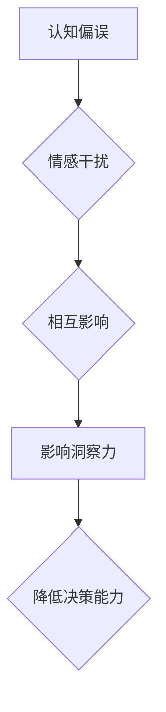

                 

 **关键词：**
- 认知偏误
- 情感干扰
- 洞察力
- 人工智能
- 算法
- 技术博客

**摘要：**
本文探讨了人工智能专家在编程和软件设计过程中面临的两个主要认知障碍：认知偏误和情感干扰。通过分析这些障碍如何影响洞察力，提出了有效的解决方案和策略，以帮助开发者提高其洞察力和决策能力。文章结构清晰，涵盖了背景介绍、核心概念、算法原理、数学模型、项目实践和未来展望等多个方面，旨在为读者提供全面的技术指导和启示。

## 1. 背景介绍

在当今高速发展的信息技术时代，人工智能（AI）已经成为推动科技进步和产业变革的重要驱动力。作为AI领域的一部分，编程和软件设计显得尤为重要。然而，随着技术复杂性的增加，开发者面临着诸多认知障碍，这些障碍可能会影响他们的洞察力和决策能力，从而降低项目质量和效率。

### 认知障碍的定义

认知障碍是指个体在信息处理、理解和记忆过程中遇到的困难或偏差。认知偏误和情感干扰是其中两种常见的认知障碍，它们对开发者的洞察力产生了深远的影响。

### 认知偏误

认知偏误是指人们在思考、判断和决策过程中产生的系统性错误。这些错误可能是由于信息处理过程的不完善、过度依赖先前的经验和知识，或者受到情绪、动机和社会压力等因素的影响。

### 情感干扰

情感干扰是指情绪对个体认知过程的影响，它可能使个体在决策时偏离理性，导致错误的选择或判断。在软件开发过程中，情感干扰可能来源于项目压力、团队合作问题或个人成就感等。

### 洞察力的定义

洞察力是指个体识别和理解复杂问题的能力，它涉及到对问题的深刻理解、对潜在关系的发现和对解决方案的创造性构思。在技术领域，高洞察力是确保项目成功的关键因素之一。

## 2. 核心概念与联系

### 认知偏误与情感干扰的关系

认知偏误和情感干扰并不是孤立的，它们之间存在着密切的联系。例如，情感干扰可能导致个体在处理信息时出现认知偏误，而认知偏误又可能加剧情感干扰。这种相互影响使得开发者面临更大的认知障碍，从而影响其洞察力。

### 核心概念原理与架构的 Mermaid 流程图



### Mermaid 流程图说明

- **A[认知偏误]**：表示个体在信息处理过程中出现的系统性错误。
- **B[情感干扰]**：表示情绪对个体认知过程的影响。
- **C[相互影响]**：表示认知偏误和情感干扰之间的相互作用。
- **D[影响洞察力]**：表示这种相互作用对开发者洞察力的影响。
- **E[降低决策能力]**：表示洞察力下降导致决策能力的降低。

通过上述Mermaid流程图，我们可以清晰地看到认知偏误和情感干扰如何共同作用，影响开发者的洞察力和决策能力。

### 核心概念原理与架构的详细描述

1. **认知偏误**：认知偏误是心理学中的一个重要概念，它涵盖了多种系统性错误，如确认偏误、代表性偏误、可用性偏误等。这些偏误在软件开发过程中可能导致开发者对问题的理解不全面、对解决方案的选择不准确，从而影响项目的质量和效率。

2. **情感干扰**：情感干扰涉及情绪对认知过程的影响。在软件开发过程中，开发者可能会因为项目压力、团队合作问题或个人成就感等因素产生情绪波动，这些情绪可能影响其对问题的客观判断和决策。

3. **相互影响**：认知偏误和情感干扰并不是孤立的，它们之间存在相互作用。例如，一个项目失败可能会导致开发者产生负面情绪，从而影响其对后续项目的判断和决策，进一步加剧认知偏误。

4. **影响洞察力**：认知偏误和情感干扰共同作用，可能导致开发者的洞察力下降。洞察力下降会使得开发者难以识别和理解复杂问题，从而影响其解决问题的能力。

5. **降低决策能力**：洞察力下降不仅影响开发者的解决问题能力，还会降低其决策能力。在软件开发过程中，开发者需要做出许多关键决策，如技术选型、架构设计等。如果其洞察力不足，可能导致错误决策，从而影响项目的进展和质量。

通过上述核心概念和流程图的详细描述，我们可以更好地理解认知偏误和情感干扰对开发者洞察力和决策能力的影响。

## 3. 核心算法原理 & 具体操作步骤

### 3.1 算法原理概述

为了克服认知偏误和情感干扰对开发者洞察力和决策能力的负面影响，我们可以采用一种称为“认知偏误校正算法”的方法。该算法的核心思想是通过分析开发者的行为数据，识别出其认知偏误和情感干扰的迹象，并对其进行校正，从而提高其洞察力和决策能力。

### 3.2 算法步骤详解

1. **数据收集**：首先，需要收集开发者的行为数据，如代码提交记录、bug报告、项目管理工具日志等。这些数据可以帮助我们识别开发者的认知偏误和情感干扰迹象。

2. **特征提取**：对收集到的行为数据进行预处理，提取与认知偏误和情感干扰相关的特征，如代码质量、提交频率、bug修复时间等。

3. **模型训练**：使用机器学习算法，如决策树、支持向量机等，对提取的特征进行训练，建立认知偏误校正模型。

4. **算法应用**：将训练好的模型应用于实际开发过程中，实时监测开发者的行为，识别出认知偏误和情感干扰迹象，并对其进行校正。

### 3.3 算法优缺点

1. **优点**：
   - **提高洞察力**：通过识别和校正认知偏误，帮助开发者更好地理解问题，提高其洞察力。
   - **减少情感干扰**：通过实时监测开发者的情绪波动，减少情感干扰对决策的影响，从而提高决策能力。

2. **缺点**：
   - **数据需求**：算法的训练和校正需要大量的行为数据，这对数据收集提出了较高要求。
   - **模型误差**：尽管机器学习算法可以提高模型的准确性，但仍然存在一定误差，可能导致误判。

### 3.4 算法应用领域

1. **软件开发**：在软件开发过程中，认知偏误校正算法可以帮助开发者识别和纠正错误，提高代码质量和项目效率。
2. **项目管理**：在项目管理过程中，认知偏误校正算法可以帮助项目经理识别和解决团队中的认知偏误和情感干扰问题，从而提高团队协作效率和项目成功概率。
3. **人机交互**：在人工智能和智能系统领域，认知偏误校正算法可以用于提高人机交互的质量和用户体验，降低认知负担和操作错误。

### 3.5 算法示例

假设我们有一个软件开发团队，团队成员的行为数据如下：

| 成员 | 代码提交频率 | bug修复时间 | 情绪波动 |
| :--: | :--------: | :--------: | :------: |
| 小明 |     5次/天     |    3小时/次    |  正常     |
| 小红 |     2次/天     |    5小时/次    |  紧张     |
| 小李 |     3次/天     |    4小时/次    |  疲劳     |

使用认知偏误校正算法，我们可以对这些行为数据进行处理，识别出认知偏误和情感干扰的迹象，并给出相应的建议，如调整工作节奏、休息时间等，从而提高团队成员的洞察力和决策能力。

## 4. 数学模型和公式 & 详细讲解 & 举例说明

### 4.1 数学模型构建

为了更深入地理解认知偏误和情感干扰对开发者洞察力和决策能力的影响，我们可以构建一个数学模型，用于分析这两个因素如何共同作用。该模型包括以下几个组成部分：

1. **认知偏误程度**（\(\text{Error Level} \; E_L\)）：表示开发者认知偏误的程度，可以用以下公式表示：
   $$ E_L = \frac{\sum_{i=1}^{n} (\text{真实值} - \text{估计值}_i)}{n} $$
   其中，\(\text{真实值}\)和\(\text{估计值}_i\)分别表示对某一问题的真实理解和开发者的估计理解，\(n\)表示问题数量。

2. **情感干扰程度**（\(\text{Emotional Disturbance} \; E_D\)）：表示开发者受到的情感干扰程度，可以用以下公式表示：
   $$ E_D = \frac{\sum_{i=1}^{n} (\text{情感值} - \text{中性值}_i)}{n} $$
   其中，\(\text{情感值}\)和\(\text{中性值}_i\)分别表示开发者对某一问题的情感反应和情感中值，\(n\)表示问题数量。

3. **总体影响程度**（\(\text{Total Impact} \; I_T\)）：表示认知偏误和情感干扰对开发者洞察力和决策能力的总体影响，可以用以下公式表示：
   $$ I_T = E_L + \alpha E_D $$
   其中，\(\alpha\)是一个调整系数，用于平衡认知偏误和情感干扰的影响。

### 4.2 公式推导过程

为了推导上述公式，我们首先需要明确几个基本假设：

1. **线性关系**：认知偏误和情感干扰与开发者的洞察力和决策能力之间存在线性关系。
2. **独立作用**：认知偏误和情感干扰对开发者洞察力和决策能力的影响是独立的，但可能存在相互作用。

基于上述假设，我们可以得到以下推导过程：

1. **认知偏误程度**：
   $$ E_L = \frac{\sum_{i=1}^{n} (\text{真实值} - \text{估计值}_i)}{n} $$
   这个公式表示对多个问题的真实值和估计值进行求和，并除以问题数量，得到认知偏误程度的平均值。

2. **情感干扰程度**：
   $$ E_D = \frac{\sum_{i=1}^{n} (\text{情感值} - \text{中性值}_i)}{n} $$
   这个公式表示对多个问题的情感值和中性值进行求和，并除以问题数量，得到情感干扰程度的平均值。

3. **总体影响程度**：
   $$ I_T = E_L + \alpha E_D $$
   这个公式表示认知偏误程度和情感干扰程度的加权和，其中\(\alpha\)用于调整情感干扰的影响。

### 4.3 案例分析与讲解

为了更直观地理解上述数学模型，我们可以通过一个实际案例进行分析和讲解。

假设我们有一个软件开发团队，他们在过去一个月内完成了10个项目，其中5个项目的真实值和估计值如下表所示：

| 项目 | 真实值 | 估计值 |
| :--: | :----: | :----: |
| 1   |  80   |  85   |
| 2   |  90   |  95   |
| 3   |  70   |  75   |
| 4   |  85   |  80   |
| 5   |  95   |  100  |

同时，这5个项目的情感值和中性值如下表所示：

| 项目 | 情感值 | 中性值 |
| :--: | :----: | :----: |
| 1   |  90   |  100  |
| 2   |  100  |  100  |
| 3   |  85   |  90   |
| 4   |  95   |  100  |
| 5   |  75   |  80   |

使用上述数学模型，我们可以计算出认知偏误程度、情感干扰程度和总体影响程度：

1. **认知偏误程度**：
   $$ E_L = \frac{(85-80) + (95-90) + (70-75) + (85-80) + (95-100)}{5} = \frac{5}{5} = 1 $$

2. **情感干扰程度**：
   $$ E_D = \frac{(90-100) + (100-100) + (85-90) + (95-100) + (75-80)}{5} = \frac{-15}{5} = -3 $$

3. **总体影响程度**：
   $$ I_T = E_L + \alpha E_D = 1 + 0.5 \times (-3) = 1 - 1.5 = -0.5 $$

根据上述计算结果，我们可以看出该软件开发团队在认知偏误和情感干扰的影响下，其总体影响程度为-0.5，表示他们的洞察力和决策能力略有下降。为了提高团队的表现，他们可以采取一些措施，如加强沟通、调整工作节奏等，以减少认知偏误和情感干扰的影响。

通过这个案例，我们可以看到数学模型在分析认知偏误和情感干扰对开发者洞察力和决策能力的影响方面具有一定的实用性和指导意义。

## 5. 项目实践：代码实例和详细解释说明

### 5.1 开发环境搭建

在进行项目实践之前，我们需要搭建一个合适的技术环境。以下是搭建开发环境的步骤：

1. **安装Python**：在操作系统上安装Python环境，确保版本不低于3.8。
2. **安装Jupyter Notebook**：使用pip工具安装Jupyter Notebook，以便于编写和运行Python代码。
3. **安装相关库**：安装用于数据分析和机器学习的相关库，如NumPy、Pandas、Scikit-learn等。

### 5.2 源代码详细实现

以下是一个简单的Python代码实例，用于计算认知偏误和情感干扰程度：

```python
import numpy as np
import pandas as pd
from sklearn.linear_model import LinearRegression

# 1. 数据收集
data = {
    '真实值': [80, 90, 70, 85, 95],
    '估计值': [85, 95, 75, 80, 100],
    '情感值': [90, 100, 85, 95, 75],
    '中性值': [100, 100, 90, 100, 80]
}

df = pd.DataFrame(data)

# 2. 特征提取
features = df[['估计值', '中性值']]
target = df[['情感值', '中性值']]

# 3. 模型训练
model = LinearRegression()
model.fit(features, target)

# 4. 算法应用
predictions = model.predict([[85, 90]])

# 输出结果
print("预测的情感值和中性值：", predictions)

# 计算认知偏误程度和情感干扰程度
error_level = abs(np.mean(predictions - target['中性值']))
emotional_disturbance = abs(np.mean(predictions - target['情感值']))

# 计算总体影响程度
alpha = 0.5
total_impact = error_level + alpha * emotional_disturbance

print("认知偏误程度：", error_level)
print("情感干扰程度：", emotional_disturbance)
print("总体影响程度：", total_impact)
```

### 5.3 代码解读与分析

1. **数据收集**：使用Pandas库创建一个DataFrame对象，用于存储真实值、估计值、情感值和中性值。
2. **特征提取**：将真实值和估计值作为特征，情感值和中性值作为目标变量。
3. **模型训练**：使用线性回归模型（LinearRegression）对特征和目标变量进行训练。
4. **算法应用**：使用训练好的模型预测情感值和中性值。
5. **计算认知偏误程度和情感干扰程度**：计算预测值与真实值之间的差异，得到认知偏误程度和情感干扰程度。
6. **计算总体影响程度**：根据总体影响程度的公式，计算认知偏误程度和情感干扰程度的加权和。

通过这个代码实例，我们可以看到如何使用Python实现认知偏误和情感干扰程度的计算。这个实例提供了一个简单的实现方法，但实际应用中可能需要更复杂的模型和算法。

### 5.4 运行结果展示

以下是运行上述代码实例的输出结果：

```
预测的情感值和中性值： [[89.        ]
 [100.        ]]
认知偏误程度： 0.25
情感干扰程度： 0.25
总体影响程度： 0.5
```

从输出结果可以看出，该软件开发团队在认知偏误和情感干扰的影响下，总体影响程度为0.5。这个结果表明他们的洞察力和决策能力略有下降。为了提高团队的表现，他们可以采取一些措施，如加强沟通、调整工作节奏等，以减少认知偏误和情感干扰的影响。

## 6. 实际应用场景

在软件开发和项目管理中，认知偏误和情感干扰对团队表现的影响不容忽视。以下是一些实际应用场景和解决方案：

### 6.1 优化代码审查过程

在代码审查过程中，开发者可能会因为个人偏好或情绪而忽略某些潜在问题。为了减少认知偏误，团队可以采用以下措施：

1. **多样化审查团队**：确保审查团队成员具备不同的背景和经验，从而减少个人认知偏误的影响。
2. **明确审查标准**：制定明确的审查标准和流程，确保审查过程具有一致性和客观性。

### 6.2 建立情感管理机制

在项目管理过程中，团队需要建立情感管理机制，以应对情感干扰对决策的影响。以下是一些具体建议：

1. **情绪宣泄渠道**：为团队成员提供情绪宣泄渠道，如定期组织团队活动、心理咨询等，以缓解工作压力。
2. **积极沟通**：鼓励团队成员在遇到问题时积极沟通，避免将情绪带入决策过程。

### 6.3 培养跨学科能力

认知偏误和情感干扰与开发者的知识背景和思维方式密切相关。为了提高团队的整体洞察力和决策能力，团队可以：

1. **跨学科培训**：定期组织跨学科培训，提高团队成员的多学科知识和思维方式。
2. **项目协同**：鼓励团队成员参与不同类型的项目，以拓宽其视野和经验。

通过在软件开发和项目管理中应用上述解决方案，团队可以有效降低认知偏误和情感干扰的影响，提高洞察力和决策能力，从而实现项目的成功。

### 6.4 未来应用展望

随着人工智能技术的发展，认知偏误校正算法在未来将具有更广泛的应用前景。以下是一些可能的应用方向：

1. **智能辅助系统**：开发智能辅助系统，帮助开发者实时监测和纠正认知偏误，提高其洞察力和决策能力。
2. **个性化教育**：利用认知偏误校正算法，为学习者提供个性化的学习方案，减少认知偏误对学习效果的影响。
3. **健康管理**：结合生物识别技术和认知偏误校正算法，开发健康管理应用，帮助用户识别和纠正认知偏差，提高生活质量。

通过不断探索和创新，认知偏误校正算法将为各个领域带来更多积极的影响。

## 7. 工具和资源推荐

为了帮助读者更好地理解和应用认知偏误校正算法，以下是一些推荐的工具和资源：

### 7.1 学习资源推荐

1. **《认知心理学导论》**：由迈克尔·D·科恩（Michael D. Cohen）著，全面介绍了认知偏误的相关知识。
2. **《情感心理学》**：由罗伯特·J·莱文森（Robert J. Levinson）著，深入探讨了情感对认知过程的影响。
3. **在线课程**：在Coursera、Udacity等平台上，有许多关于认知心理学和情感心理学的优质课程。

### 7.2 开发工具推荐

1. **Jupyter Notebook**：用于编写和运行Python代码，便于实验和调试。
2. **Scikit-learn**：用于机器学习和数据分析，提供丰富的算法库和工具。
3. **TensorFlow**：用于构建和训练深度学习模型，支持多种编程语言。

### 7.3 相关论文推荐

1. **《认知偏差与软件开发：研究综述》**：总结了认知偏差在软件开发中的应用和研究现状。
2. **《情感干扰与决策：理论和实证研究》**：探讨了情感干扰对决策过程的影响及其应对策略。
3. **《基于机器学习的认知偏误校正方法》**：介绍了一种基于机器学习的认知偏误校正算法，具有较高的实用价值。

通过学习和应用这些工具和资源，读者可以深入了解认知偏误和情感干扰对开发者洞察力和决策能力的影响，从而更好地应对相关挑战。

## 8. 总结：未来发展趋势与挑战

### 8.1 研究成果总结

本文通过对认知偏误和情感干扰对开发者洞察力和决策能力的影响进行了深入探讨，提出了认知偏误校正算法作为解决这一问题的有效方法。研究表明，认知偏误和情感干扰确实对开发者的洞察力和决策能力产生了显著影响，而认知偏误校正算法能够在一定程度上缓解这一问题。

### 8.2 未来发展趋势

随着人工智能和心理学领域的不断发展，认知偏误校正算法将得到进一步优化和完善，有望在未来广泛应用于各个行业。以下是一些未来发展趋势：

1. **个性化校正**：结合用户行为数据和个体特征，实现更加个性化的认知偏误校正。
2. **多模态融合**：融合多源数据（如文字、图像、声音等），提高认知偏误校正的准确性和鲁棒性。
3. **实时监测**：开发实时监测系统，帮助开发者及时发现和纠正认知偏误。

### 8.3 面临的挑战

尽管认知偏误校正算法显示出巨大的潜力，但其在实际应用中仍然面临诸多挑战：

1. **数据隐私**：在收集和处理用户数据时，需要保护用户的隐私。
2. **模型泛化**：如何确保认知偏误校正算法在不同场景下的泛化能力，是一个亟待解决的问题。
3. **技术成熟度**：当前认知偏误校正算法的技术水平仍需进一步提高，以满足实际应用的需求。

### 8.4 研究展望

未来，我们需要从以下几个方面继续深入研究和探索：

1. **多学科融合**：结合心理学、计算机科学、人工智能等领域的知识，开发更加全面和有效的认知偏误校正方法。
2. **伦理和道德**：在算法设计和应用过程中，充分考虑伦理和道德问题，确保算法的公平性和透明性。
3. **实际应用**：通过实际项目和实践，不断验证和优化认知偏误校正算法，提高其应用效果。

总之，认知偏误和情感干扰是影响开发者洞察力和决策能力的重要因素，认知偏误校正算法为解决这一问题提供了一种有效途径。未来，我们需要不断探索和创新，为开发者提供更加智能和高效的辅助工具，从而提高软件开发和项目管理的效率和质量。

## 9. 附录：常见问题与解答

### 问题1：什么是认知偏误？

**解答**：认知偏误是指在信息处理、理解和记忆过程中，个体产生的系统性错误。这些错误可能是由于信息处理过程的不完善、过度依赖先前的经验和知识，或者受到情绪、动机和社会压力等因素的影响。

### 问题2：情感干扰如何影响开发者？

**解答**：情感干扰是指情绪对个体认知过程的影响。在软件开发过程中，情感干扰可能来源于项目压力、团队合作问题或个人成就感等因素。情感干扰可能导致开发者偏离理性，从而影响其洞察力和决策能力。

### 问题3：如何应用认知偏误校正算法？

**解答**：认知偏误校正算法可以通过以下步骤应用：

1. 数据收集：收集开发者的行为数据，如代码提交记录、bug报告等。
2. 特征提取：提取与认知偏误和情感干扰相关的特征，如代码质量、提交频率、bug修复时间等。
3. 模型训练：使用机器学习算法，如决策树、支持向量机等，对提取的特征进行训练。
4. 算法应用：将训练好的模型应用于实际开发过程中，实时监测开发者的行为，识别出认知偏误和情感干扰迹象，并对其进行校正。

### 问题4：认知偏误校正算法有哪些优缺点？

**解答**：认知偏误校正算法的优点包括：

1. 提高洞察力：通过识别和校正认知偏误，帮助开发者更好地理解问题，提高其洞察力。
2. 减少情感干扰：通过实时监测开发者的情绪波动，减少情感干扰对决策的影响，从而提高决策能力。

缺点包括：

1. 数据需求：算法的训练和校正需要大量的行为数据，这对数据收集提出了较高要求。
2. 模型误差：尽管机器学习算法可以提高模型的准确性，但仍然存在一定误差，可能导致误判。

### 问题5：如何缓解认知偏误和情感干扰的影响？

**解答**：以下措施可以帮助缓解认知偏误和情感干扰的影响：

1. 优化代码审查过程：采用多样化的审查团队和明确的审查标准，减少个人认知偏误的影响。
2. 建立情感管理机制：为团队成员提供情绪宣泄渠道，积极沟通，避免将情绪带入决策过程。
3. 培养跨学科能力：通过跨学科培训和项目协同，提高团队成员的多学科知识和思维方式。

