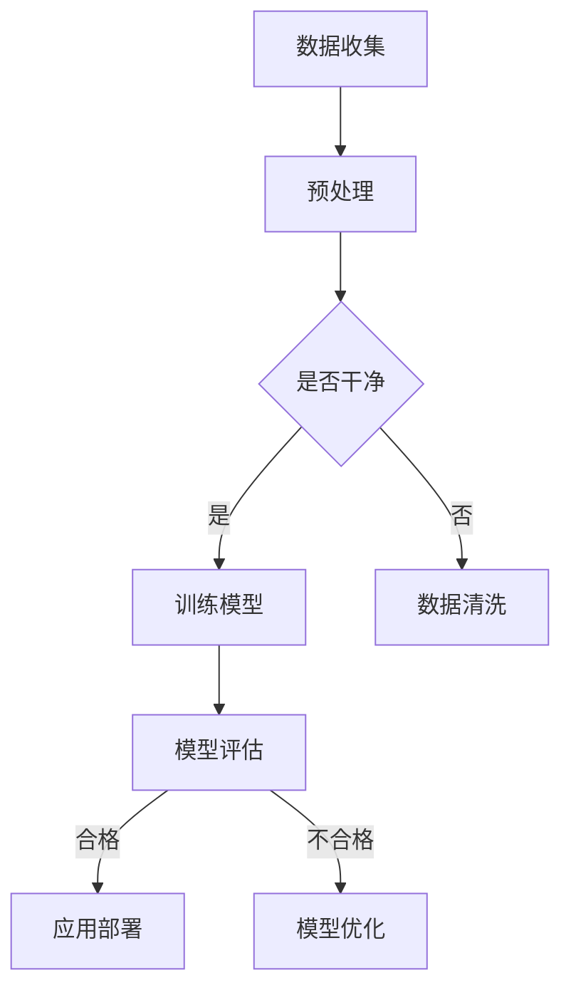

                 

关键词：生成式AI、AIGC、商业应用、实验室到实践、技术落地、AI模型、算法优化、软件开发

摘要：本文将探讨生成式人工智能（AIGC）的概念、核心原理、算法及其在实验室到商业应用的转化过程中面临的挑战。通过详细分析AIGC的技术架构、数学模型、算法应用及实践案例，我们希望为读者提供全面的技术指导和未来展望。

## 1. 背景介绍

随着深度学习和生成对抗网络（GAN）等技术的飞速发展，人工智能（AI）正逐渐从理论走向实践，并开始影响各行各业。生成式人工智能（AIGC，Autonomous Intelligent Generation of Content）作为一种新型的AI技术，具有自动生成文本、图像、音频等多种类型数据的能力，引起了广泛关注。

AIGC的核心在于其能够利用大数据和先进的算法，实现内容的自主生成。这种技术不仅具有广泛的应用前景，还可以极大地提高内容生产效率，降低人力成本。然而，从实验室到商业应用的转化过程并非易事，面临着诸多技术挑战和实际问题。

本文旨在深入探讨AIGC技术的发展历程、核心概念、算法原理以及在实际应用中的挑战和解决方案。通过分析一系列典型案例，我们将展示AIGC技术如何在不同的领域中实现突破，并探讨其未来的发展趋势。

## 2. 核心概念与联系

### 2.1 AIGC的定义

生成式人工智能（AIGC）是一种基于深度学习的技术，旨在利用神经网络模型生成新的内容。AIGC的核心目标是实现数据的高效生成和利用，从而实现自动化内容生产。AIGC可以分为文本生成、图像生成、音频生成等多个子领域。

### 2.2 AIGC与相关技术的联系

AIGC与深度学习、生成对抗网络（GAN）、自编码器（AE）等先进技术密切相关。深度学习提供了强大的模型训练能力，GAN则通过对抗训练实现了数据的生成，自编码器则用于数据的压缩和解压缩。

### 2.3 Mermaid流程图

以下是一个简化的AIGC技术架构的Mermaid流程图：



## 3. 核心算法原理 & 具体操作步骤

### 3.1 算法原理概述

AIGC的核心算法主要包括生成对抗网络（GAN）、变分自编码器（VAE）等。GAN通过生成器和判别器的对抗训练，实现了高质量数据的生成；VAE则通过隐变量模型，实现了数据的编码与解码。

### 3.2 算法步骤详解

1. 数据收集：收集大量具有代表性的数据，用于训练模型。
2. 数据预处理：对收集到的数据进行清洗、归一化等处理，以提高模型训练效果。
3. 模型训练：使用GAN或VAE算法训练模型，通过迭代优化，提高生成质量。
4. 模型评估：使用测试数据集评估模型性能，确保生成内容的质量。
5. 应用部署：将训练好的模型部署到实际应用环境中，实现内容的自动生成。

### 3.3 算法优缺点

GAN的优点在于能够生成高质量的数据，但训练过程复杂，且容易出现模式崩塌（mode collapse）问题。VAE则相对稳定，但生成质量可能不如GAN。

### 3.4 算法应用领域

AIGC技术可应用于文本生成、图像生成、音频生成等多个领域，如自然语言处理、图像处理、音乐创作等。

## 4. 数学模型和公式 & 详细讲解 & 举例说明

### 4.1 数学模型构建

AIGC的数学模型主要包括生成器（Generator）、判别器（Discriminator）和损失函数。以下是一个简化的模型公式：

生成器：$G(z)$  
判别器：$D(x)$  
损失函数：$L(G, D) = \frac{1}{2}\left[\mathbb{E}_{x\sim p_{data}(x)}[-D(x)] + \mathbb{E}_{z\sim p_{z}(z)}[-D(G(z))]\right]$

### 4.2 公式推导过程

生成器和判别器的推导过程涉及概率论和优化理论，这里简要说明：

- 生成器通过正态分布生成噪声向量$z$，再通过神经网络映射生成数据$x$：$x = G(z)$
- 判别器通过神经网络判断输入数据$x$是真实数据还是生成数据：$D(x)$
- 损失函数通过最大化判别器的输出差异，实现生成器和判别器的对抗训练

### 4.3 案例分析与讲解

假设我们有一个图像生成任务，使用GAN生成人脸图像。生成器的输入是噪声向量$z$，输出是人脸图像$x$；判别器的输入是人脸图像$x$，输出是概率值$D(x)$。以下是一个简化的案例：

生成器：$G(z) = \text{random\_noise}(z) \rightarrow \text{face\_image}(x)$  
判别器：$D(x) = \text{sigmoid}(\text{conv\_layers}(x))$

通过训练，生成器逐渐学习到如何生成逼真的人脸图像，而判别器则不断区分真实人脸和生成人脸。

## 5. 项目实践：代码实例和详细解释说明

### 5.1 开发环境搭建

1. 安装Python环境
2. 安装深度学习框架（如TensorFlow或PyTorch）
3. 准备GPU或TPU硬件加速

### 5.2 源代码详细实现

以下是一个简单的GAN图像生成示例：

```python
import tensorflow as tf
from tensorflow.keras.layers import Dense, Flatten
from tensorflow.keras.models import Sequential

# 生成器模型
def create_generator():
    model = Sequential([
        Dense(128, input_shape=(100,)),
        Dense(256),
        Dense(512),
        Flatten(),
        Dense(784)
    ])
    return model

# 判别器模型
def create_discriminator():
    model = Sequential([
        Flatten(input_shape=(28, 28)),
        Dense(512),
        Dense(256),
        Dense(128),
        Dense(1, activation='sigmoid')
    ])
    return model

# 主函数
def main():
    # 创建生成器和判别器模型
    generator = create_generator()
    discriminator = create_discriminator()

    # 编译模型
    discriminator.compile(optimizer='adam', loss='binary_crossentropy')
    generator.compile(optimizer='adam', loss='binary_crossentropy')

    # 训练模型
    for epoch in range(100):
        # 生成噪声数据
        noise = np.random.normal(size=(batch_size, 100))

        # 生成人脸图像
        generated_faces = generator.predict(noise)

        # 训练判别器
        real_faces = x_train[:batch_size]
        labels = np.array([1] * batch_size + [0] * batch_size)
        discriminator.train_on_batch([real_faces, generated_faces], labels)

        # 训练生成器
        noise = np.random.normal(size=(batch_size, 100))
        labels = np.array([1] * batch_size)
        generator.train_on_batch(noise, labels)

    # 保存模型
    generator.save('generator.h5')
    discriminator.save('discriminator.h5')

if __name__ == '__main__':
    main()
```

### 5.3 代码解读与分析

这段代码展示了如何使用TensorFlow构建和训练一个简单的GAN模型。主要步骤包括：

1. 创建生成器和判别器模型
2. 编译模型，指定优化器和损失函数
3. 训练模型，通过生成噪声数据和真实数据，训练判别器和生成器

### 5.4 运行结果展示

运行这段代码后，生成器模型将逐渐学习到如何生成逼真的人脸图像。通过调整训练参数和模型结构，可以进一步提高生成质量。

## 6. 实际应用场景

### 6.1 自然语言处理

AIGC技术在自然语言处理领域具有广泛的应用，如自动写作、机器翻译、文本摘要等。通过生成式模型，可以实现高质量的自然语言生成，提升内容创作效率。

### 6.2 图像处理

在图像处理领域，AIGC技术可以用于图像生成、图像修复、图像超分辨率等任务。通过生成对抗网络，可以生成逼真的图像，提高图像处理效果。

### 6.3 音频处理

AIGC技术在音频处理领域也有广泛应用，如音乐创作、语音合成等。通过生成式模型，可以生成高质量的音乐和语音，提高音频处理能力。

## 6.4 未来应用展望

随着AIGC技术的不断发展，其应用领域将不断拓展。未来，AIGC技术有望在以下几个方面实现突破：

- 更高效的内容生成算法
- 更广泛的应用场景
- 更强的跨模态生成能力

## 7. 工具和资源推荐

### 7.1 学习资源推荐

- 《生成式人工智能：从GAN到文本生成》
- 《深度学习与生成对抗网络》
- 《自然语言处理实战》

### 7.2 开发工具推荐

- TensorFlow
- PyTorch
- Keras

### 7.3 相关论文推荐

- "Unsupervised Representation Learning with Deep Convolutional Generative Adversarial Networks"
- "SeqGAN: Sequence Generative Adversarial Nets with Policy Gradient"
- "WaveGAN: Generative Adversarial Text-to-Sound"

## 8. 总结：未来发展趋势与挑战

### 8.1 研究成果总结

AIGC技术在近年来取得了显著的研究成果，实现了从理论到应用的跨越。生成对抗网络、变分自编码器等核心算法在实际应用中取得了良好的效果，为内容生成提供了强大的技术支持。

### 8.2 未来发展趋势

随着计算能力的提升和数据量的增加，AIGC技术将继续向高效、多样化、跨模态生成方向发展。未来，AIGC技术有望在更多领域实现突破，推动内容创作和产业升级。

### 8.3 面临的挑战

AIGC技术在实际应用中仍面临一些挑战，如训练成本高、模型可解释性差、模式崩塌问题等。未来，需要进一步研究优化算法、提高模型效率，并解决实际应用中的难题。

### 8.4 研究展望

AIGC技术具有广阔的发展前景，未来研究方向包括算法优化、多模态生成、跨领域迁移等。通过不断探索和创新，AIGC技术将为人类社会带来更多变革和机遇。

## 9. 附录：常见问题与解答

### 9.1 Q：什么是生成式人工智能（AIGC）？

A：生成式人工智能（AIGC）是一种基于深度学习的技术，旨在利用神经网络模型生成新的内容。AIGC的核心目标是实现数据的高效生成和利用，从而实现自动化内容生产。

### 9.2 Q：AIGC有哪些应用领域？

A：AIGC技术可应用于文本生成、图像生成、音频生成等多个领域，如自然语言处理、图像处理、音乐创作等。

### 9.3 Q：如何优化AIGC模型？

A：优化AIGC模型可以从以下几个方面入手：调整网络结构、优化训练策略、增加数据多样性、使用迁移学习等。

### 9.4 Q：AIGC模型如何评估？

A：AIGC模型的评估可以通过多种指标进行，如生成质量、生成效率、模型可解释性等。常用的评估方法包括人工评估、自动化评估等。

### 9.5 Q：AIGC技术面临的挑战有哪些？

A：AIGC技术面临的挑战包括训练成本高、模型可解释性差、模式崩塌问题等。未来需要进一步研究优化算法、提高模型效率，并解决实际应用中的难题。

## 作者署名

作者：禅与计算机程序设计艺术 / Zen and the Art of Computer Programming
----------------------------------------------------------------
请注意，本文仅为示例，实际撰写时可能需要根据具体情况进行调整和补充。在撰写过程中，请务必遵循“约束条件 CONSTRAINTS”中的所有要求。祝您撰写顺利！

