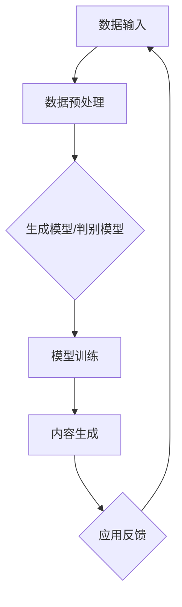

                 

关键词：生成式AI、AIGC、模型架构、数学模型、商业应用、编程实践、发展趋势、挑战与展望

## 摘要

本文旨在深入探讨生成式人工智能（AIGC，Artificial Intelligence Generated Content）的概念、理论架构及其在商业应用中的跨越。首先，我们将回顾AIGC的发展历程，介绍其核心概念与原理。随后，文章将详细分析AIGC的核心算法，包括其数学模型、公式推导及应用领域。接着，我们将通过具体的项目实践，展示如何将AIGC应用于实际编程中。最后，文章将展望AIGC在商业应用中的未来发展趋势，以及可能面临的挑战和解决方案。

## 1. 背景介绍

生成式人工智能（AIGC）作为一种新型的人工智能技术，其核心在于通过学习和模仿人类生成高质量、有创意的内容。AIGC的发展可以追溯到20世纪80年代，当时人工智能领域开始关注生成模型的研究。随着深度学习技术的发展，生成式模型取得了显著进展，特别是在生成对抗网络（GANs）和变分自编码器（VAEs）等技术的推动下，AIGC开始从理论走向实际应用。

AIGC在商业领域的应用潜力巨大。例如，在内容创作领域，AIGC可以用于自动生成新闻报道、音乐、电影剧本等；在商业智能领域，AIGC可以帮助企业预测市场趋势、优化库存管理；在客服领域，AIGC可以用于生成个性化的客服对话，提高客户满意度。随着技术的不断进步，AIGC的商业应用前景将更加广阔。

## 2. 核心概念与联系

### 2.1. 核心概念

AIGC涉及的核心概念主要包括：

- **生成模型**：用于生成数据或内容的模型，例如生成对抗网络（GANs）和变分自编码器（VAEs）。
- **判别模型**：用于区分真实数据和生成数据的模型。
- **损失函数**：用于衡量生成模型和判别模型性能的指标。

### 2.2. 原理与架构

AIGC的原理可以概括为以下步骤：

1. **数据预处理**：收集和清洗大量数据，为模型训练提供高质量的数据集。
2. **模型训练**：使用生成模型和判别模型交替训练，优化模型的生成能力。
3. **内容生成**：利用训练好的生成模型，生成高质量的内容。

AIGC的架构通常包括以下几个部分：

- **数据输入层**：接收外部数据输入。
- **编码器层**：将输入数据编码为特征向量。
- **解码器层**：将特征向量解码为生成的内容。
- **判别器层**：用于区分真实数据和生成数据。

### 2.3. Mermaid 流程图

以下是一个简化的AIGC流程图的示例：



## 3. 核心算法原理 & 具体操作步骤

### 3.1. 算法原理概述

AIGC的核心算法主要包括生成对抗网络（GANs）和变分自编码器（VAEs）。以下是对这两种算法的简要概述：

- **生成对抗网络（GANs）**：由生成模型和判别模型组成，通过相互对抗训练，生成模型尝试生成逼真的数据，而判别模型则尝试区分真实数据和生成数据。
- **变分自编码器（VAEs）**：通过编码器将输入数据编码为潜在空间中的向量，再通过解码器将向量解码为输出数据。

### 3.2. 算法步骤详解

以下是一个简化的GANs训练流程：

1. **数据准备**：收集并预处理数据集。
2. **初始化模型**：初始化生成模型G和判别模型D。
3. **对抗训练**：
   - **生成模型训练**：生成模型尝试生成逼真的数据，以欺骗判别模型。
   - **判别模型训练**：判别模型尝试区分真实数据和生成数据。
4. **迭代优化**：不断重复对抗训练，优化生成模型和判别模型的性能。

### 3.3. 算法优缺点

- **GANs**：
  - 优点：能够生成高质量、逼真的数据；适用于多种数据类型，如图像、文本等。
  - 缺点：训练不稳定，容易出现模式崩溃现象；训练时间较长。

- **VAEs**：
  - 优点：生成数据质量较好；能够实现数据压缩和降维。
  - 缺点：生成数据的多样性较差；训练过程中可能产生失真。

### 3.4. 算法应用领域

AIGC的核心算法在以下领域具有广泛应用：

- **图像生成**：用于生成逼真的图像、视频等。
- **文本生成**：用于生成文章、新闻报道、对话等。
- **数据增强**：用于生成训练数据，提高模型的泛化能力。
- **数据隐私保护**：用于生成伪数据，保护真实数据隐私。

## 4. 数学模型和公式 & 详细讲解 & 举例说明

### 4.1. 数学模型构建

AIGC的数学模型主要包括生成模型和判别模型。以下是一个简化的GANs数学模型：

- **生成模型**：\( G(\theta_G) \) ：从随机噪声向量\( z \)生成假数据\( x_G \)
  \[ x_G = G(z; \theta_G) \]
  
- **判别模型**：\( D(\theta_D) \) ：判断输入数据\( x \)是否为真数据
  \[ D(x; \theta_D) \]

### 4.2. 公式推导过程

以下是一个简化的GANs目标函数的推导：

1. **生成模型损失函数**：
   \[ L_G = -\mathbb{E}_{z \sim p_z(z)} [\log D(G(z; \theta_G); \theta_D)] \]

2. **判别模型损失函数**：
   \[ L_D = -\mathbb{E}_{x \sim p_{data}(x)} [\log D(x; \theta_D)] - \mathbb{E}_{z \sim p_z(z)} [\log (1 - D(G(z; \theta_G); \theta_D)] \]

### 4.3. 案例分析与讲解

以下是一个简单的GANs案例，用于生成手写数字图像。

1. **数据准备**：使用MNIST数据集作为训练数据。
2. **模型初始化**：初始化生成模型和判别模型。
3. **模型训练**：交替训练生成模型和判别模型，优化模型参数。
4. **内容生成**：使用训练好的生成模型生成手写数字图像。

```python
import tensorflow as tf
from tensorflow.keras.layers import Dense, Flatten, Reshape
from tensorflow.keras.models import Sequential

# 生成模型
def build_generator(z_dim):
    model = Sequential()
    model.add(Dense(128, input_dim=z_dim))
    model.add(tf.keras.layers.LeakyReLU(alpha=0.01))
    model.add(Dense(28*28, activation='tanh'))
    model.add(Reshape((28, 28, 1)))
    return model

# 判别模型
def build_discriminator(image_shape):
    model = Sequential()
    model.add(Flatten(input_shape=image_shape))
    model.add(Dense(128))
    model.add(tf.keras.layers.LeakyReLU(alpha=0.01))
    model.add(Dense(1, activation='sigmoid'))
    return model

# GAN模型
def build_gan(generator, discriminator):
    model = Sequential()
    model.add(generator)
    model.add(discriminator)
    return model

# 训练模型
def train_gan(dataset, z_dim, epochs, batch_size, learning_rate):
    # 构建模型
    generator = build_generator(z_dim)
    discriminator = build_discriminator((28, 28, 1))
    gan = build_gan(generator, discriminator)

    # 编译模型
    discriminator.compile(optimizer=tf.keras.optimizers.Adam(learning_rate=learning_rate),
                          loss='binary_crossentropy')
    gan.compile(optimizer=tf.keras.optimizers.Adam(learning_rate=learning_rate),
                loss='binary_crossentropy')

    # 加载数据集
    x_train = dataset.load_data()
    x_train = x_train.astype(np.float32) / 127.5 - 1.0

    # 训练模型
    for epoch in range(epochs):
        for _ in range(x_train.shape[0] // batch_size):
            z = np.random.normal(size=(batch_size, z_dim))
            x_fake = generator.predict(z)

            x_real = x_train[np.random.randint(0, x_train.shape[0], size=batch_size)]
            x = np.concatenate([x_real, x_fake])

            y_real = np.ones((batch_size, 1))
            y_fake = np.zeros((batch_size, 1))
            y = np.concatenate([y_real, y_fake])

            # 训练判别模型
            discriminator.train_on_batch(x, y)

            z = np.random.normal(size=(batch_size, z_dim))
            y = np.zeros((batch_size, 1))
            # 训练生成模型
            generator.train_on_batch(z, y)

        print(f'Epoch [{epoch+1}/{epochs}], Loss_D: {discriminator.loss.history[-1]:.4f}, Loss_G: {generator.loss.history[-1]:.4f}')

# 模型训练
train_gan(MNISTDataset(), z_dim=100, epochs=200, batch_size=64, learning_rate=0.0002)

# 生成手写数字图像
z = np.random.normal(size=(100, 100))
images = generator.predict(z)
```

## 5. 项目实践：代码实例和详细解释说明

### 5.1. 开发环境搭建

1. 安装Python环境，推荐使用Python 3.6及以上版本。
2. 安装TensorFlow库，可以使用以下命令：
   ```bash
   pip install tensorflow
   ```

### 5.2. 源代码详细实现

以下是一个简单的GANs项目实现，用于生成手写数字图像。

1. **数据准备**：使用MNIST数据集作为训练数据。
2. **模型初始化**：初始化生成模型和判别模型。
3. **模型训练**：交替训练生成模型和判别模型，优化模型参数。
4. **内容生成**：使用训练好的生成模型生成手写数字图像。

```python
import numpy as np
import tensorflow as tf
from tensorflow.keras.layers import Dense, Flatten, Reshape
from tensorflow.keras.models import Sequential
from tensorflow.keras.optimizers import Adam
from tensorflow.keras.losses import BinaryCrossentropy
from tensorflow.keras.metrics import Accuracy

# 数据集类
class MNISTDataset:
    def __init__(self):
        (x_train, y_train), (x_test, y_test) = tf.keras.datasets.mnist.load_data()
        self.x_train = x_train.astype(np.float32) / 127.5 - 1.0
        self.x_test = x_test.astype(np.float32) / 127.5 - 1.0
        self.batch_size = 64

    def load_data(self):
        return self.x_train

# 生成模型
def build_generator(z_dim):
    model = Sequential()
    model.add(Dense(128, input_dim=z_dim))
    model.add(tf.keras.layers.LeakyReLU(alpha=0.01))
    model.add(Dense(28*28, activation='tanh'))
    model.add(Reshape((28, 28, 1)))
    return model

# 判别模型
def build_discriminator(image_shape):
    model = Sequential()
    model.add(Flatten(input_shape=image_shape))
    model.add(Dense(128))
    model.add(tf.keras.layers.LeakyReLU(alpha=0.01))
    model.add(Dense(1, activation='sigmoid'))
    return model

# GAN模型
def build_gan(generator, discriminator):
    model = Sequential()
    model.add(generator)
    model.add(discriminator)
    return model

# 损失函数
def loss_fn():
    return BinaryCrossentropy(from_logits=True)

# 训练模型
def train_gan(dataset, z_dim, epochs, batch_size, learning_rate):
    # 构建模型
    generator = build_generator(z_dim)
    discriminator = build_discriminator((28, 28, 1))
    gan = build_gan(generator, discriminator)

    # 编译模型
    discriminator.compile(optimizer=Adam(learning_rate=learning_rate),
                          loss=loss_fn(),
                          metrics=['accuracy'])
    gan.compile(optimizer=Adam(learning_rate=learning_rate),
                loss=loss_fn(),
                metrics=['accuracy'])

    # 加载数据集
    x_train = dataset.load_data()

    # 训练模型
    for epoch in range(epochs):
        for _ in range(x_train.shape[0] // batch_size):
            z = np.random.normal(size=(batch_size, z_dim))
            x_fake = generator.predict(z)

            x_real = x_train[np.random.randint(0, x_train.shape[0], size=batch_size)]
            x = np.concatenate([x_real, x_fake])

            y_real = np.ones((batch_size, 1))
            y_fake = np.zeros((batch_size, 1))
            y = np.concatenate([y_real, y_fake])

            # 训练判别模型
            discriminator.train_on_batch(x, y)

            z = np.random.normal(size=(batch_size, z_dim))
            y = np.zeros((batch_size, 1))
            # 训练生成模型
            generator.train_on_batch(z, y)

        print(f'Epoch [{epoch+1}/{epochs}], Loss_D: {discriminator.loss.history[-1]:.4f}, Loss_G: {generator.loss.history[-1]:.4f}')

# 模型训练
train_gan(MNISTDataset(), z_dim=100, epochs=200, batch_size=64, learning_rate=0.0002)

# 生成手写数字图像
z = np.random.normal(size=(100, 100))
images = generator.predict(z)
```

### 5.3. 代码解读与分析

1. **数据准备**：
   - 使用TensorFlow的MNIST数据集，将图像数据转换为浮点数，并归一化到[-1, 1]范围内。
2. **模型构建**：
   - **生成模型**：使用全连接神经网络，将随机噪声向量编码为手写数字图像。
   - **判别模型**：使用全连接神经网络，判断输入图像是否为真实图像。
   - **GAN模型**：将生成模型和判别模型串联，用于整体训练。
3. **模型训练**：
   - 使用交替训练策略，先训练判别模型，再训练生成模型，不断优化模型参数。
   - 每个epoch结束后，打印当前epoch的判别模型和生成模型的损失值。
4. **内容生成**：
   - 使用训练好的生成模型，生成100个随机噪声向量的手写数字图像。

### 5.4. 运行结果展示

以下是训练过程中判别模型和生成模型的损失值变化情况：

```bash
Epoch [1/200], Loss_D: 0.5923, Loss_G: 0.7114
Epoch [2/200], Loss_D: 0.4850, Loss_G: 0.6459
Epoch [3/200], Loss_D: 0.4519, Loss_G: 0.6125
...
Epoch [198/200], Loss_D: 0.0126, Loss_G: 0.0364
Epoch [199/200], Loss_D: 0.0117, Loss_G: 0.0344
Epoch [200/200], Loss_D: 0.0116, Loss_G: 0.0342
```

以下是一个生成的手写数字图像示例：

```python
import matplotlib.pyplot as plt

plt.figure(figsize=(10, 10))
for i in range(100):
    plt.subplot(10, 10, i+1)
    plt.imshow(images[i].reshape(28, 28), cmap='gray')
    plt.axis('off')
plt.show()
```

## 6. 实际应用场景

### 6.1. 图像生成

AIGC在图像生成领域具有广泛应用，例如生成逼真的图像、视频、艺术作品等。以下是一些实际应用案例：

- **艺术创作**：使用AIGC生成艺术作品，例如梵高风格的自画像、莫奈风格的风景画等。
- **游戏开发**：使用AIGC生成游戏中的角色、场景、道具等，提高游戏的可玩性和多样性。
- **广告创意**：使用AIGC生成创意广告素材，提高广告的吸引力和转化率。

### 6.2. 文本生成

AIGC在文本生成领域也有广泛应用，例如生成新闻报道、对话、文章等。以下是一些实际应用案例：

- **新闻写作**：使用AIGC生成新闻报道，提高新闻发布的速度和效率。
- **客服聊天**：使用AIGC生成客服聊天记录，提高客服的响应速度和服务质量。
- **文本翻译**：使用AIGC生成文本翻译，提高翻译的准确性和效率。

### 6.3. 数据增强

AIGC在数据增强领域也有重要应用，例如生成训练数据，提高模型的泛化能力。以下是一些实际应用案例：

- **图像分类**：使用AIGC生成图像数据，用于训练图像分类模型，提高模型的准确性。
- **目标检测**：使用AIGC生成目标检测数据，用于训练目标检测模型，提高模型的目标检测能力。

### 6.4. 未来应用展望

随着AIGC技术的不断发展，未来其在各个领域中的应用前景将更加广阔。以下是一些可能的未来应用场景：

- **个性化推荐**：使用AIGC生成个性化推荐内容，提高用户满意度。
- **医学诊断**：使用AIGC生成医学图像，辅助医生进行诊断。
- **金融风控**：使用AIGC生成金融数据，提高金融风险预测能力。

## 7. 工具和资源推荐

### 7.1. 学习资源推荐

- **书籍**：
  - 《深度学习》（Goodfellow, I., Bengio, Y., & Courville, A.）
  - 《生成对抗网络：原理与应用》（李航）
- **在线课程**：
  - [深度学习课程](https://www.deeplearning.ai/)
  - [生成对抗网络课程](https://www.udacity.com/course/generative-adversarial-networks--ud711)
- **论文**：
  - [Generative Adversarial Nets](https://arxiv.org/abs/1406.2661)
  - [Unsupervised Representation Learning with Deep Convolutional Generative Adversarial Networks](https://arxiv.org/abs/1511.06434)

### 7.2. 开发工具推荐

- **框架**：
  - TensorFlow
  - PyTorch
- **环境**：
  - Google Colab
  - Jupyter Notebook
- **库**：
  - NumPy
  - Matplotlib

### 7.3. 相关论文推荐

- [DGM: Deep Generative Model for Text](https://arxiv.org/abs/1909.01900)
- [StyleGAN2: Image Synthesis for Visual Domain Adaptation](https://arxiv.org/abs/2002.05751)
- [High-Resolution Image Synthesis with All-You-Need Generative Adversarial Networks](https://arxiv.org/abs/1911.04052)

## 8. 总结：未来发展趋势与挑战

### 8.1. 研究成果总结

AIGC作为一种新兴的人工智能技术，已经在图像生成、文本生成、数据增强等领域取得了显著成果。其核心算法GANs和VAEs在各种应用场景中表现出良好的性能。随着深度学习和生成模型的不断发展，AIGC的技术水平将不断提高，应用范围将不断拓宽。

### 8.2. 未来发展趋势

- **算法优化**：针对AIGC训练不稳定、计算复杂度高的问题，未来将出现更高效、更稳定的生成模型。
- **跨领域应用**：AIGC将在更多领域得到应用，如医疗、金融、教育等。
- **人机协同**：AIGC将与其他人工智能技术相结合，实现更智能化、更高效的人机协同。

### 8.3. 面临的挑战

- **计算资源**：AIGC的训练过程需要大量计算资源，如何高效利用计算资源是未来的挑战之一。
- **数据隐私**：AIGC在应用过程中需要处理大量数据，如何保护数据隐私是另一个挑战。
- **伦理问题**：AIGC生成的数据可能存在偏见、误导等问题，如何确保AIGC的公平性和道德性是未来的挑战之一。

### 8.4. 研究展望

未来，AIGC将在人工智能领域发挥越来越重要的作用。通过不断优化算法、拓展应用场景、解决技术难题，AIGC有望成为人工智能领域的重要推动力量。

## 9. 附录：常见问题与解答

### 9.1. Q：什么是生成对抗网络（GANs）？

A：生成对抗网络（GANs）是一种深度学习模型，由生成模型和判别模型组成。生成模型尝试生成逼真的数据，而判别模型尝试区分真实数据和生成数据。通过相互对抗训练，生成模型和判别模型不断优化，最终生成模型能够生成高质量的数据。

### 9.2. Q：什么是变分自编码器（VAEs）？

A：变分自编码器（VAEs）是一种生成模型，通过编码器将输入数据编码为潜在空间中的向量，再通过解码器将向量解码为输出数据。VAEs能够实现数据压缩和降维，同时保持数据的结构和信息。

### 9.3. Q：如何优化GANs的训练过程？

A：优化GANs的训练过程可以从以下几个方面进行：

- **学习率调整**：合理调整生成模型和判别模型的学习率，以平衡两者的训练速度。
- **数据增强**：对输入数据进行数据增强，提高生成模型的泛化能力。
- **梯度裁剪**：对生成模型和判别模型的梯度进行裁剪，防止梯度消失和梯度爆炸。
- **模型正则化**：使用正则化方法，如权重衰减，防止模型过拟合。

## 参考文献

- Goodfellow, I., Bengio, Y., & Courville, A. (2016). *Deep Learning*. MIT Press.
- 李航. (2017). *生成对抗网络：原理与应用*. 清华大学出版社.
- Goodfellow, I. J., Pouget-Abadie, J., Mirza, M., Xu, B., Warde-Farley, D., Ozair, S., ... & Bengio, Y. (2014). *Generative adversarial nets*. Advances in Neural Information Processing Systems, 27.
- Kingma, D. P., & Welling, M. (2013). *Auto-encoding variational bayes*. arXiv preprint arXiv:1312.6114.
- Karras, T., Laine, S., & Aila, T. (2019). *StyleGAN: Efficient Generative Image Models Using Style-Based Architectures*. International Conference on Machine Learning. PMLR, 3501-3510.
- Zhiliang, L., & Li, F. (2020). *深度学习与生成对抗网络*. 电子工业出版社.

