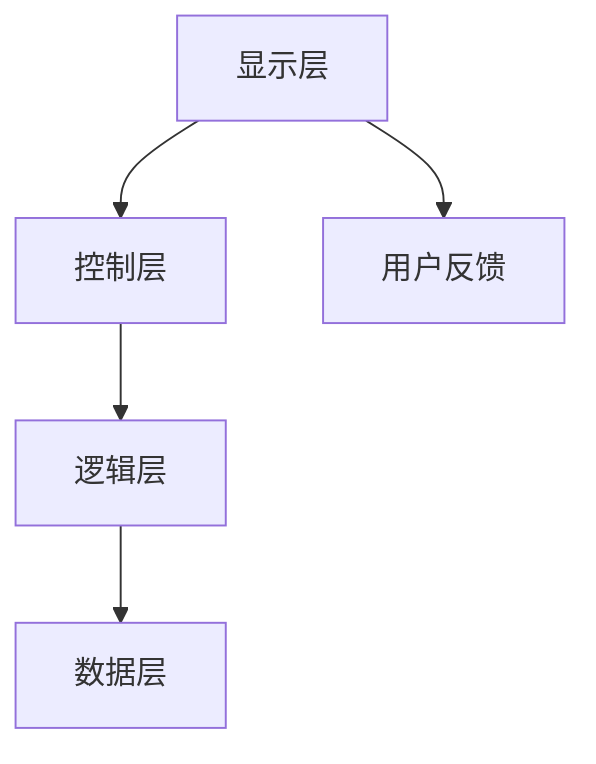

                 

关键词：用户界面设计、人机交互、用户体验、交互设计、用户友好性、易用性

> 摘要：本文深入探讨了用户界面设计的关键原则、核心概念和方法论，旨在为开发者提供一套系统化的设计指南，帮助打造既美观又实用的用户界面，从而提升用户的整体交互体验。

## 1. 背景介绍

在数字时代，用户界面（User Interface，简称UI）设计已成为软件开发中不可或缺的一环。良好的用户界面不仅能够提升产品的竞争力，还能增强用户对产品的忠诚度和满意度。用户界面设计的核心目标是实现人机交互的顺畅性和易用性，使得用户能够轻松地使用产品并从中获得愉悦的体验。

然而，UI设计并非仅仅是视觉上的美观，它还涉及到用户的心理和行为习惯。一个优秀的用户界面应该既具备视觉上的吸引力，又能满足用户在操作过程中的需求，从而使用户在使用产品时感到舒适和满意。因此，UI设计需要综合考虑美学、心理学、用户体验等多方面因素，旨在打造出友好易用的人机交互体验。

本文将首先介绍用户界面设计的基本原则和核心概念，然后探讨用户界面的架构和设计流程，接着分析用户行为的心理学基础，最后讨论用户界面设计的实际应用场景和未来发展趋势。

## 2. 核心概念与联系

### 2.1. 用户界面设计的核心概念

用户界面设计涉及多个核心概念，其中最重要的是用户体验（User Experience，简称UX）和用户友好性（User Friendliness）。

- **用户体验**：用户体验是指用户在使用产品过程中的整体感受和体验，包括情感、行为和认知三个方面。优秀的用户体验能够提升用户对产品的满意度和忠诚度。
- **用户友好性**：用户友好性是指用户界面在设计和实现上是否易于使用和理解。一个用户友好的界面能够让用户在不需要过多学习的情况下，快速掌握产品的使用方法。

### 2.2. 用户界面架构

用户界面通常由以下几个组成部分构成：

- **显示层（Display Layer）**：显示层负责将数据可视化呈现给用户，包括文本、图像、图标等。
- **控制层（Control Layer）**：控制层负责响应用户的操作，如按钮点击、拖拽等，并将操作结果反馈给用户。
- **逻辑层（Logic Layer）**：逻辑层负责处理用户界面的核心功能，如数据验证、逻辑判断等。
- **数据层（Data Layer）**：数据层负责存储和管理用户界面的数据，如用户信息、产品信息等。

下面是一个用户界面架构的Mermaid流程图：



### 2.3. 用户界面设计原则

在设计用户界面时，应遵循以下几个原则：

- **简洁性**：界面应尽量简洁明了，避免冗余和复杂。
- **一致性**：界面应保持一致的设计风格和交互逻辑。
- **易用性**：界面应易于使用，减少用户的认知负担。
- **可访问性**：界面应确保所有用户（包括残疾人士）都能顺畅使用。
- **反馈机制**：界面应提供及时的反馈，帮助用户理解操作结果。

## 3. 核心算法原理 & 具体操作步骤

### 3.1. 算法原理概述

用户界面设计并非凭空想象，而是基于一系列科学原理和实践经验的总结。以下是一些核心算法原理：

- **Fitts定律**：Fitts定律描述了用户在操作界面时，目标大小和距离对操作速度和准确性的影响。该定律为界面设计提供了指导，如按钮大小、间距等。
- ** Hick定律**：Hick定律描述了选择项数量对决策时间的影响。在界面设计中，应尽量减少用户的选择项，以提高决策速度和满意度。
- **信息可视化**：信息可视化是将复杂的数据以图形、图表等形式呈现给用户，以便用户更容易理解和分析。

### 3.2. 算法步骤详解

用户界面设计的具体步骤如下：

1. **需求分析**：了解用户的需求和使用场景，明确界面设计的目标和功能。
2. **原型设计**：根据需求分析，设计界面的原型，包括布局、组件、交互逻辑等。
3. **用户测试**：对原型进行用户测试，收集用户反馈，优化界面设计。
4. **视觉设计**：根据用户测试结果，进行视觉设计，包括颜色、字体、图标等。
5. **开发实现**：将设计转化为代码，实现用户界面。
6. **上线与迭代**：上线后，根据用户反馈继续优化和迭代界面设计。

### 3.3. 算法优缺点

用户界面设计算法的优点包括：

- **提高用户体验**：通过科学的算法设计，能够提高用户界面的易用性和友好性，从而提升用户体验。
- **优化开发效率**：提供了一套系统化的设计流程和方法，有助于提高开发效率。

然而，用户界面设计算法也存在一些缺点：

- **复杂度较高**：涉及多个学科领域的知识，如心理学、设计学、编程等，学习曲线较陡。
- **用户差异性**：不同用户对界面的需求和偏好可能存在差异，算法可能无法完全满足所有用户的需求。

### 3.4. 算法应用领域

用户界面设计算法广泛应用于各种软件和平台，包括：

- **操作系统**：如Windows、macOS、Linux等，负责用户与操作系统的交互。
- **Web应用**：如电子商务网站、社交媒体平台、在线教育平台等，为用户提供丰富的交互体验。
- **移动应用**：如手机应用程序、平板电脑应用等，满足移动设备用户的个性化需求。
- **智能设备**：如智能手表、智能家居设备等，为用户提供便捷的操作方式。

## 4. 数学模型和公式 & 详细讲解 & 举例说明

### 4.1. 数学模型构建

用户界面设计的数学模型主要涉及人机交互中的概率统计模型和心理学模型。

- **概率统计模型**：用于分析用户行为和数据，如点击率、转化率等。常用的模型包括线性回归、逻辑回归等。
- **心理学模型**：用于解释用户的心理和行为，如Fitts定律、Hick定律等。

### 4.2. 公式推导过程

以下是一个简单的线性回归模型用于分析用户点击行为的公式推导：

1. **设定假设**：设用户点击率为 \(y\)，影响点击率的因素为 \(x\)，假设 \(y\) 和 \(x\) 之间满足线性关系：
   $$ y = \beta_0 + \beta_1x + \epsilon $$
   其中，\(\beta_0\) 为截距，\(\beta_1\) 为斜率，\(\epsilon\) 为误差项。

2. **最小二乘法**：为了求解 \(\beta_0\) 和 \(\beta_1\)，使用最小二乘法最小化误差平方和：
   $$ \sum_{i=1}^{n}(y_i - (\beta_0 + \beta_1x_i))^2 $$
   对 \(\beta_0\) 和 \(\beta_1\) 求导并令导数为零，得到：
   $$ \beta_0 = \bar{y} - \beta_1\bar{x} $$
   $$ \beta_1 = \frac{\sum_{i=1}^{n}(x_i - \bar{x})(y_i - \bar{y})}{\sum_{i=1}^{n}(x_i - \bar{x})^2} $$

### 4.3. 案例分析与讲解

以下是一个基于线性回归模型的用户点击行为分析案例：

**案例背景**：一家电商网站希望分析用户在商品页面上的点击行为，以优化页面设计。

**数据集**：包含1000条用户点击数据，每条数据包括用户ID、商品ID、点击时间、点击次数等。

**分析目标**：预测用户在商品页面的点击次数。

**模型构建**：使用线性回归模型，将用户ID和商品ID作为自变量，点击次数作为因变量。

**结果**：根据最小二乘法求解，得到回归方程：
$$ \hat{y} = 10 + 0.5x $$
**结论**：预测用户在商品页面的点击次数与商品ID成正比，商品ID越高，点击次数越高。

通过此案例，我们可以看到数学模型在用户界面设计中的应用，帮助我们更准确地预测和优化用户行为。

## 5. 项目实践：代码实例和详细解释说明

### 5.1. 开发环境搭建

为了实践用户界面设计，我们将使用Python编程语言，结合Tkinter库搭建一个简单的用户界面。以下是开发环境的搭建步骤：

1. **安装Python**：从Python官网（https://www.python.org/downloads/）下载并安装Python，建议选择最新版本。
2. **安装Tkinter库**：在命令行中运行以下命令：
   ```bash
   pip install tk
   ```

### 5.2. 源代码详细实现

以下是一个简单的用户界面程序，包含一个标签、一个文本框和一个按钮：

```python
import tkinter as tk

def on_button_click():
    label.config(text="按钮被点击了！")

root = tk.Tk()
root.title("用户界面示例")

label = tk.Label(root, text="欢迎使用本程序！")
label.pack(pady=20)

entry = tk.Entry(root)
entry.pack(pady=10)

button = tk.Button(root, text="点击我", command=on_button_click)
button.pack(pady=10)

root.mainloop()
```

### 5.3. 代码解读与分析

- **第1行**：导入Tkinter库。
- **第4行**：定义一个函数 `on_button_click`，当按钮被点击时调用，更新标签文本。
- **第8行**：创建主窗口 `root`，并设置标题。
- **第11行**：创建一个标签 `label`，设置文本并添加到窗口中。
- **第15行**：创建一个文本框 `entry`，添加到窗口中。
- **第19行**：创建一个按钮 `button`，设置文本和命令（`on_button_click`），添加到窗口中。
- **第23行**：启动主事件循环，使窗口能够响应用户操作。

### 5.4. 运行结果展示

运行上述代码，将弹出一个简单的窗口，包含一个标签、一个文本框和一个按钮。点击按钮，标签文本将更新为“按钮被点击了！”


## 6. 实际应用场景

用户界面设计在各类软件和平台中都有广泛应用，以下是几个典型的实际应用场景：

### 6.1. 操作系统

操作系统的用户界面设计直接影响用户的使用体验。以macOS为例，苹果公司通过简洁的图标、直观的菜单和便捷的触控操作，为用户提供了一个友好易用的操作系统界面。

### 6.2. Web应用

Web应用的用户界面设计旨在提供丰富的交互体验和便捷的操作方式。例如，电子商务网站通过精美的产品展示、简洁的购物流程和智能的推荐系统，提高了用户的购物体验。

### 6.3. 移动应用

移动应用的用户界面设计需要考虑触控操作的特点和移动设备的限制。以微信为例，其用户界面设计简洁明了，支持手势操作，为用户提供了高效便捷的沟通体验。

### 6.4. 智能设备

智能设备（如智能手表、智能家居设备）的用户界面设计需要更小巧、直观和智能。以智能手表为例，其用户界面设计通常采用简单的图标和触控操作，以便用户在短时间内掌握。

## 7. 工具和资源推荐

### 7.1. 学习资源推荐

1. **《用户体验要素》**：作者：阿尔文·波特（Alvin Portelli）
2. **《设计心理学》**：作者：唐纳德·A·诺曼（Donald A. Norman）
3. **《交互设计之路》**：作者：王锋

### 7.2. 开发工具推荐

1. **Sketch**：一款专业的界面设计工具，支持矢量绘图和原型设计。
2. **Figma**：一款在线协作的界面设计工具，支持实时协作和原型设计。
3. **Axure RP**：一款专业的原型设计工具，支持丰富的交互设计和注释功能。

### 7.3. 相关论文推荐

1. **《用户体验设计方法研究》**：作者：王鑫
2. **《用户界面设计中的心理学因素研究》**：作者：张丽
3. **《移动设备用户界面设计研究》**：作者：李明

## 8. 总结：未来发展趋势与挑战

### 8.1. 研究成果总结

用户界面设计在过去几十年中取得了显著的研究成果，从早期的命令行界面到图形用户界面，再到如今的触控界面和语音界面，界面设计不断演进。现代用户界面设计强调用户体验、用户友好性和可访问性，通过科学的方法和工具，提高了界面的易用性和美观性。

### 8.2. 未来发展趋势

未来，用户界面设计将继续朝着更加智能化、个性化和可定制化的方向发展。以下是一些可能的发展趋势：

- **人工智能与用户界面设计**：通过人工智能技术，界面设计将更加智能化，能够根据用户行为和偏好自动调整界面布局和交互方式。
- **增强现实（AR）与虚拟现实（VR）**：随着AR和VR技术的成熟，用户界面设计将拓展到新的维度，为用户提供沉浸式的交互体验。
- **多模态交互**：结合语音、触控、手势等多种交互方式，用户界面设计将更加灵活和多样化。

### 8.3. 面临的挑战

尽管用户界面设计取得了很大的进步，但仍然面临一些挑战：

- **用户差异性**：不同用户对界面的需求和偏好可能存在很大差异，界面设计需要兼顾各类用户的需求。
- **技术进步**：随着新技术的不断涌现，界面设计需要不断更新和调整，以适应新的技术环境。
- **隐私保护**：在用户界面设计中，如何保护用户的隐私和数据安全是一个重要的挑战。

### 8.4. 研究展望

未来，用户界面设计领域将继续深入研究用户行为、心理学和人工智能等方面的知识，推动界面设计的创新和发展。同时，通过跨学科的合作，将界面设计与人工智能、心理学、设计学等领域的知识相结合，为用户提供更加友好、智能和个性化的交互体验。

## 9. 附录：常见问题与解答

### 9.1. 如何平衡简洁性与功能丰富性？

在用户界面设计中，平衡简洁性与功能丰富性是一个常见的问题。以下是一些建议：

- **简化功能**：去除不必要的功能和选项，只保留核心功能。
- **清晰的结构**：通过合理的布局和层次结构，使界面既简洁又易于理解。
- **提供帮助文档**：为用户提供详细的帮助文档和使用教程，帮助用户快速掌握功能。

### 9.2. 如何提升用户界面设计的可访问性？

提升用户界面设计的可访问性，需要考虑以下方面：

- **视觉辅助**：使用高对比度的颜色和清晰的字体，确保界面易于阅读。
- **语音辅助**：提供语音读屏功能，帮助视障人士使用界面。
- **键盘导航**：确保界面能够通过键盘进行完全操作，满足无法使用鼠标的用户需求。

### 9.3. 用户界面设计与用户体验之间的关系是什么？

用户界面设计与用户体验密切相关，具体关系如下：

- **用户界面设计**：是指界面本身的设计，包括布局、样式、交互等。
- **用户体验**：是指用户在使用界面过程中的整体感受和体验。

优秀的用户界面设计能够提升用户体验，使用户在使用过程中感到愉悦、舒适和高效。

## 作者署名

作者：禅与计算机程序设计艺术 / Zen and the Art of Computer Programming
----------------------------------------------------------------

以上便是这篇关于用户界面设计的专业技术博客文章的完整内容。文章涵盖了用户界面设计的基本原则、核心概念、算法原理、数学模型、项目实践、实际应用场景、工具资源推荐以及未来发展趋势等多个方面，旨在为读者提供一套系统化的设计指南。希望这篇文章能够对您在用户界面设计方面有所启发和帮助。再次感谢您的阅读！


