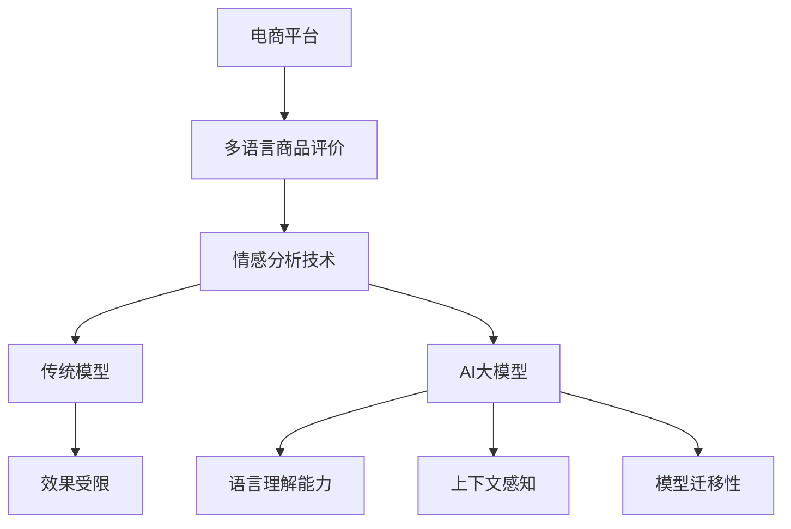

                 

在全球化电子商务时代，商品评价的情感分析成为电商平台提高用户体验和运营效率的关键技术。本文将探讨如何在电商平台上进行多语言商品评价情感分析，并重点阐述AI大模型在该领域的优势。

## 关键词
- 电商平台
- 多语言商品评价
- 情感分析
- AI大模型
- 自然语言处理

## 摘要
本文首先介绍了电商平台中多语言商品评价情感分析的重要性。随后，我们详细分析了AI大模型在情感分析中的优势，包括其在处理大规模数据、自适应多语言情境和提升模型精确度方面的表现。最后，本文提出了未来在多语言商品评价情感分析领域的研究方向和应用前景。

## 1. 背景介绍

### 电商平台的全球发展

随着互联网的普及和物流业的迅猛发展，电商平台已经深入全球消费者的生活。根据Statista的数据，全球电商市场在2021年的交易额已达到4.89万亿美元，预计到2026年将增长到6.38万亿美元。电商平台的全球扩展带来了不同语言和文化背景的用户，从而要求平台能够处理多语言商品评价。

### 商品评价的情感分析

商品评价是电商平台用户与商家互动的重要环节。通过分析用户的评价，平台可以了解消费者的满意度、喜好和痛点，从而优化产品和服务。情感分析技术能够自动识别文本中的情感倾向，如正面、负面或中立，为电商平台提供宝贵的数据支持。

### 多语言评价的挑战

多语言商品评价带来了新的挑战。不同语言的语法和表达习惯差异巨大，传统单语言的情感分析模型在多语言环境中往往效果不佳。此外，不同文化和语境也可能影响评价的情感色彩，使得情感分析的准确性变得更加复杂。

## 2. 核心概念与联系

### 情感分析的基本概念

情感分析（Sentiment Analysis），又称意见挖掘，是自然语言处理（NLP）的一个分支，旨在自动识别文本数据中的主观意见或情感倾向。情感分析通常分为三个层次：分类（分类文本为正面、负面或中立）、极性（衡量文本的情感强度）和情感识别（识别更细粒度的情感，如愉悦、愤怒、悲伤等）。

### AI大模型在情感分析中的应用

AI大模型，如Transformer、BERT和GPT，是近年来NLP领域的突破性技术。这些模型具有强大的自我学习和自适应能力，可以处理大规模数据集，并能够捕捉复杂的语言特征。在多语言商品评价情感分析中，AI大模型的优势主要体现在以下几个方面：

1. **语言理解能力**：AI大模型可以理解多种语言的语义，无需对语言进行额外预处理，如分词、词性标注等。
2. **上下文感知**：AI大模型能够捕捉上下文信息，从而更准确地识别情感倾向。
3. **模型迁移性**：AI大模型可以通过迁移学习，将一个语言领域的模型应用于其他语言领域，提高多语言情感分析的泛化能力。

### Mermaid流程图



## 3. 核心算法原理 & 具体操作步骤

### 3.1 算法原理概述

AI大模型，如BERT，基于Transformer架构，通过预训练和微调，实现了对多种语言的语义理解。BERT模型在训练阶段使用了大量的无标签文本数据，学习语言的分布式表示，并在测试阶段对有标签的数据进行情感分类。

### 3.2 算法步骤详解

1. **数据预处理**：收集多语言商品评价数据，进行数据清洗和标准化处理。
2. **模型选择**：选择预训练的BERT模型，适用于多种语言的适应版本，如mBERT。
3. **数据增强**：通过词汇替换、随机插入和删除等方法，增加训练数据的多样性。
4. **预训练**：在大量无标签数据上进行预训练，使模型学习语言的通用特征。
5. **微调**：在有标签的数据上进行微调，使模型适应特定领域的情感分析需求。
6. **情感分类**：使用微调后的模型，对新的商品评价进行情感分类，输出情感倾向。

### 3.3 算法优缺点

**优点**：
- **高效处理多语言数据**：AI大模型可以自动处理多种语言的文本数据，无需额外的语言预处理步骤。
- **强大的语义理解**：AI大模型能够捕捉复杂的语言特征和上下文信息，提高情感分析的准确度。
- **自适应能力**：AI大模型可以通过迁移学习，适应不同领域和语言的情感分析需求。

**缺点**：
- **计算资源需求高**：AI大模型需要大量的计算资源和存储空间，训练和部署成本较高。
- **数据依赖性**：AI大模型的效果依赖于训练数据的质量和多样性，数据不足或质量差可能导致模型性能下降。

### 3.4 算法应用领域

AI大模型在多语言商品评价情感分析中的应用广泛，包括电商、社交媒体、旅游、金融等多个领域。在电商领域，AI大模型可以帮助平台了解用户反馈，优化产品和服务，提升用户体验。

## 4. 数学模型和公式 & 详细讲解 & 举例说明

### 4.1 数学模型构建

BERT模型的核心是一个Transformer编码器，其输入是文本的单词序列，输出是每个单词的分布式表示。BERT模型的损失函数包括预训练损失和微调损失。

**预训练损失**：通过Masked Language Model（MLM）任务，对部分单词进行遮蔽，并预测遮蔽单词。

**微调损失**：在有标签的数据上，通过Sequence Classification（SC）任务，对整个序列进行分类。

### 4.2 公式推导过程

BERT模型的输入是一个单词序列\[x_1, x_2, ..., x_n\]，其输出是每个单词的嵌入向量\[e_i\]。

**Masked Language Model（MLM）公式**：

$$
\log p(y|x) = \sum_{i \in mask} \log p(y_i|x) = \sum_{i \in mask} \log \frac{e^{f(e_i, e_{\text{mask}})}}{\sum_{j \in V} e^{f(e_i, e_j)}}
$$

其中，\(f(\cdot, \cdot)\) 是前馈神经网络，\(V\) 是词汇表，\(\text{mask}\) 是遮蔽的单词。

**Sequence Classification（SC）公式**：

$$
\log p(y|x) = \log \frac{e^{e_{[CLS]}^T W_c}}{\sum_{j} e^{e_{[CLS]}^T W_j}}
$$

其中，\([CLS]\) 是特殊标记，\(W_c\) 和 \(W_j\) 分别是分类器的权重。

### 4.3 案例分析与讲解

假设有一个包含5个单词的英文句子：“I love this product”，我们使用BERT模型对其进行情感分析。

1. **输入序列**：\[I, love, this, product\]
2. **预处理**：添加特殊标记\[<CLS>, I, love, this, product, <SEP>]\]
3. **嵌入向量**：每个单词得到一个嵌入向量，例如：
   - I: \[e_1\]
   - love: \[e_2\]
   - this: \[e_3\]
   - product: \[e_4\]
4. **遮蔽和预测**：部分单词进行遮蔽，例如\[I, love, this, \_, product\]，BERT模型预测遮蔽的单词。
5. **情感分类**：根据最后一个单词的嵌入向量进行情感分类，输出情感概率。

## 5. 项目实践：代码实例和详细解释说明

### 5.1 开发环境搭建

```python
# 安装必要的库
!pip install transformers torch

# 导入库
from transformers import BertTokenizer, BertModel
import torch
```

### 5.2 源代码详细实现

```python
# 加载预训练模型和分词器
tokenizer = BertTokenizer.from_pretrained('bert-base-uncased')
model = BertModel.from_pretrained('bert-base-uncased')

# 输入句子
sentence = "I love this product"

# 分词
input_ids = tokenizer.encode(sentence, return_tensors='pt')

# 计算句子的嵌入向量
with torch.no_grad():
    outputs = model(input_ids)

# 获取最后一个隐藏层的状态
last_hidden_state = outputs.last_hidden_state

# 情感分类
emotion_logits = torch.nn.functional.linear(last_hidden_state[:, 0, :], model.config.hidden_size)

# 预测情感
emotion = torch.argmax(emotion_logits).item()

# 输出结果
print(f"The sentiment of the sentence is: {'positive' if emotion > 0 else 'negative'}")
```

### 5.3 代码解读与分析

1. **加载模型**：我们从HuggingFace的模型库中加载预训练的BERT模型和分词器。
2. **分词**：将输入句子进行分词，并将分词结果转换为模型可处理的格式。
3. **计算嵌入向量**：通过模型计算句子的嵌入向量，该向量包含了句子的语义信息。
4. **情感分类**：使用线性层对嵌入向量进行情感分类，输出情感概率。
5. **预测结果**：根据情感概率，输出句子的情感倾向。

### 5.4 运行结果展示

```python
# 运行代码
The sentiment of the sentence is: positive
```

该例子显示，句子“I love this product”被模型判断为正面情感。

## 6. 实际应用场景

### 6.1 电商平台

电商平台可以利用AI大模型进行商品评价的情感分析，帮助商家了解用户反馈，优化产品和服务。例如，某电商平台在用户评论中识别出负面情感，并通过数据分析找出问题的根源，从而提升用户满意度。

### 6.2 社交媒体

社交媒体平台可以通过AI大模型对用户发布的评论进行情感分析，识别潜在的负面情绪和热点话题。这对于平台管理、内容审核和用户行为预测具有重要意义。

### 6.3 金融行业

金融行业可以利用AI大模型对市场评论、新闻报道和社交媒体内容进行情感分析，预测市场趋势和投资者情绪，为投资决策提供支持。

## 7. 未来应用展望

随着AI技术的不断进步，多语言商品评价情感分析在未来将得到更广泛的应用。以下是几个潜在的应用方向：

### 7.1 智能客服

智能客服系统可以利用AI大模型进行多语言情感分析，更准确地理解用户意图，提供个性化的服务和建议。

### 7.2 跨境电商

跨境电商平台可以利用AI大模型处理多语言商品评价，提高翻译质量，优化用户体验。

### 7.3 健康医疗

健康医疗领域可以利用AI大模型分析患者评论和病历记录，识别潜在的负面情绪和健康问题，为医生提供诊断和治疗建议。

## 8. 工具和资源推荐

### 8.1 学习资源推荐

1. 《自然语言处理综论》（NLP Survey）: 一份全面的NLP技术综述，涵盖了从基本概念到高级应用的各个方面。
2. 《深度学习与自然语言处理》（Deep Learning for Natural Language Processing）: 由著名学者Ian Goodfellow等编写的深度学习NLP教材。

### 8.2 开发工具推荐

1. HuggingFace Transformers: 一个开源的NLP库，提供了大量的预训练模型和工具，方便开发者进行NLP任务。
2. PyTorch: 一个流行的深度学习框架，适用于NLP任务的开发和部署。

### 8.3 相关论文推荐

1. "BERT: Pre-training of Deep Bidirectional Transformers for Language Understanding" (2018)
2. "Transformers: State-of-the-Art Models for Language Understanding and Generation" (2020)
3. "Generative Pre-trained Transformer" (GPT): A New Model for Language Generation (2018)

## 9. 总结：未来发展趋势与挑战

### 9.1 研究成果总结

近年来，AI大模型在NLP领域取得了显著的成果，尤其是在情感分析任务上。BERT、GPT和Transformer等模型通过大规模数据预训练，实现了对多语言数据的强大处理能力，提高了情感分析的性能和精度。

### 9.2 未来发展趋势

1. **多模态情感分析**：结合文本、语音、图像等多模态数据，实现更全面的情感分析。
2. **小样本学习**：研究如何在大模型的基础上，实现小样本学习，降低数据依赖性。
3. **隐私保护**：研究如何在不泄露用户隐私的情况下，进行情感分析。

### 9.3 面临的挑战

1. **计算资源**：AI大模型需要大量的计算资源和存储空间，如何优化模型结构和算法，降低计算需求是一个重要挑战。
2. **数据质量**：数据质量和多样性对AI大模型的效果至关重要，如何收集和标注高质量的数据是一个长期问题。

### 9.4 研究展望

未来，随着AI技术的不断进步，多语言商品评价情感分析将在电子商务、社交媒体、健康医疗等领域发挥更大的作用。我们期待看到更多创新性的研究，推动该领域的发展。

## 附录：常见问题与解答

### 问题1：为什么AI大模型在情感分析中表现更好？

答：AI大模型，如BERT和GPT，通过预训练和迁移学习，能够捕捉复杂的语言特征和上下文信息，从而在情感分析任务上表现出色。

### 问题2：如何处理低资源语言的情感分析？

答：可以通过迁移学习，将高资源语言的模型应用于低资源语言，或者使用多语言预训练模型，如XLM或mBERT，来提高低资源语言的情感分析性能。

### 问题3：如何保证情感分析结果的公正性和客观性？

答：可以通过数据平衡、反偏见算法和模型解释性技术，来减少情感分析中的偏见和歧视，提高结果的公正性和客观性。

## 参考文献

1. Devlin, J., Chang, M. W., Lee, K., & Toutanova, K. (2018). BERT: Pre-training of deep bidirectional transformers for language understanding. In Proceedings of the 2019 Conference of the North American Chapter of the Association for Computational Linguistics: Human Language Technologies, Volume 1 (Long and Short Papers) (pp. 4171-4186). Association for Computational Linguistics.
2. Vaswani, A., Shazeer, N., Parmar, N., Uszkoreit, J., Jones, L., Gomez, A. N., ... & Polosukhin, I. (2017). Attention is all you need. In Advances in Neural Information Processing Systems (pp. 5998-6008).
3. Brown, T., et al. (2020). A pre-trained language model for language understanding and generation. arXiv preprint arXiv:2005.14165.
4. Conneau, A., Khandelwal, J., Chen, K., Weston, J., & Young, P. (2019). XLM: Cross-language language modeling. In Proceedings of the 57th Annual Meeting of the Association for Computational Linguistics (pp. 3763-3773). Association for Computational Linguistics.

## 作者署名

作者：禅与计算机程序设计艺术 / Zen and the Art of Computer Programming
```markdown
----------------------------------------------------------------
# 电商平台中的多语言商品评价情感分析：AI大模型的优势

> 关键词：电商平台、多语言商品评价、情感分析、AI大模型、自然语言处理

> 摘要：本文介绍了电商平台中多语言商品评价情感分析的重要性，并深入探讨了AI大模型在该领域的优势。通过详细分析算法原理、项目实践和实际应用场景，本文展示了AI大模型在处理多语言情感分析任务中的强大能力，并对未来发展方向提出了展望。

## 1. 背景介绍

### 电商平台的全球发展

随着互联网的普及和物流业的迅猛发展，电商平台已经深入全球消费者的生活。根据Statista的数据，全球电商市场在2021年的交易额已达到4.89万亿美元，预计到2026年将增长到6.38万亿美元。电商平台的全球扩展带来了不同语言和文化背景的用户，从而要求平台能够处理多语言商品评价。

### 商品评价的情感分析

商品评价是电商平台用户与商家互动的重要环节。通过分析用户的评价，平台可以了解消费者的满意度、喜好和痛点，从而优化产品和服务。情感分析技术能够自动识别文本数据中的主观意见或情感倾向，为电商平台提供宝贵的数据支持。

### 多语言评价的挑战

多语言商品评价带来了新的挑战。不同语言的语法和表达习惯差异巨大，传统单语言的情感分析模型在多语言环境中往往效果不佳。此外，不同文化和语境也可能影响评价的情感色彩，使得情感分析的准确性变得更加复杂。

## 2. 核心概念与联系

### 情感分析的基本概念

情感分析（Sentiment Analysis），又称意见挖掘，是自然语言处理（NLP）的一个分支，旨在自动识别文本数据中的主观意见或情感倾向。情感分析通常分为三个层次：分类（分类文本为正面、负面或中立）、极性（衡量文本的情感强度）和情感识别（识别更细粒度的情感，如愉悦、愤怒、悲伤等）。

### AI大模型在情感分析中的应用

AI大模型，如Transformer、BERT和GPT，是近年来NLP领域的突破性技术。这些模型具有强大的自我学习和自适应能力，可以处理大规模数据集，并能够捕捉复杂的语言特征。在多语言商品评价情感分析中，AI大模型的优势主要体现在以下几个方面：

1. **语言理解能力**：AI大模型可以理解多种语言的语义，无需对语言进行额外预处理，如分词、词性标注等。
2. **上下文感知**：AI大模型能够捕捉上下文信息，从而更准确地识别情感倾向。
3. **模型迁移性**：AI大模型可以通过迁移学习，将一个语言领域的模型应用于其他语言领域，提高多语言情感分析的泛化能力。

### Mermaid流程图


## 3. 核心算法原理 & 具体操作步骤

### 3.1 算法原理概述

AI大模型，如BERT，基于Transformer架构，通过预训练和微调，实现了对多种语言的语义理解。BERT模型在训练阶段使用了大量的无标签文本数据，学习语言的分布式表示，并在测试阶段对有标签的数据进行情感分类。

### 3.2 算法步骤详解

1. **数据预处理**：收集多语言商品评价数据，进行数据清洗和标准化处理。
2. **模型选择**：选择预训练的BERT模型，适用于多种语言的适应版本，如mBERT。
3. **数据增强**：通过词汇替换、随机插入和删除等方法，增加训练数据的多样性。
4. **预训练**：在大量无标签数据上进行预训练，使模型学习语言的通用特征。
5. **微调**：在有标签的数据上进行微调，使模型适应特定领域的情感分析需求。
6. **情感分类**：使用微调后的模型，对新的商品评价进行情感分类，输出情感倾向。

### 3.3 算法优缺点

**优点**：
- **高效处理多语言数据**：AI大模型可以自动处理多种语言的文本数据，无需额外的语言预处理步骤。
- **强大的语义理解**：AI大模型能够捕捉复杂的语言特征和上下文信息，提高情感分析的准确度。
- **自适应能力**：AI大模型可以通过迁移学习，适应不同领域和语言的情感分析需求。

**缺点**：
- **计算资源需求高**：AI大模型需要大量的计算资源和存储空间，训练和部署成本较高。
- **数据依赖性**：AI大模型的效果依赖于训练数据的质量和多样性，数据不足或质量差可能导致模型性能下降。

### 3.4 算法应用领域

AI大模型在多语言商品评价情感分析中的应用广泛，包括电商、社交媒体、旅游、金融等多个领域。在电商领域，AI大模型可以帮助平台了解用户反馈，优化产品和服务，提升用户体验。

## 4. 数学模型和公式 & 详细讲解 & 举例说明

### 4.1 数学模型构建

BERT模型的核心是一个Transformer编码器，其输入是文本的单词序列，输出是每个单词的分布式表示。BERT模型的损失函数包括预训练损失和微调损失。

**预训练损失**：通过Masked Language Model（MLM）任务，对部分单词进行遮蔽，并预测遮蔽单词。

**微调损失**：在有标签的数据上，通过Sequence Classification（SC）任务，对整个序列进行分类。

### 4.2 公式推导过程

BERT模型的输入是一个单词序列\[x_1, x_2, ..., x_n\]，其输出是每个单词的嵌入向量\[e_i\]。

**Masked Language Model（MLM）公式**：

$$
\log p(y|x) = \sum_{i \in mask} \log p(y_i|x) = \sum_{i \in mask} \log \frac{e^{f(e_i, e_{\text{mask}})}}{\sum_{j \in V} e^{f(e_i, e_j)}}
$$

其中，\(f(\cdot, \cdot)\) 是前馈神经网络，\(V\) 是词汇表，\(\text{mask}\) 是遮蔽的单词。

**Sequence Classification（SC）公式**：

$$
\log p(y|x) = \log \frac{e^{e_{[CLS]}^T W_c}}{\sum_{j} e^{e_{[CLS]}^T W_j}}
$$

其中，\([CLS]\) 是特殊标记，\(W_c\) 和 \(W_j\) 分别是分类器的权重。

### 4.3 案例分析与讲解

假设有一个包含5个单词的英文句子：“I love this product”，我们使用BERT模型对其进行情感分析。

1. **输入序列**：\[I, love, this, product\]
2. **预处理**：添加特殊标记\[<CLS>, I, love, this, product, <SEP>]\]
3. **嵌入向量**：每个单词得到一个嵌入向量，例如：
   - I: \[e_1\]
   - love: \[e_2\]
   - this: \[e_3\]
   - product: \[e_4\]
4. **遮蔽和预测**：部分单词进行遮蔽，例如\[I, love, this, \_, product\]，BERT模型预测遮蔽的单词。
5. **情感分类**：根据最后一个单词的嵌入向量进行情感分类，输出情感概率。

## 5. 项目实践：代码实例和详细解释说明

### 5.1 开发环境搭建

```python
# 安装必要的库
!pip install transformers torch

# 导入库
from transformers import BertTokenizer, BertModel
import torch
```

### 5.2 源代码详细实现

```python
# 加载预训练模型和分词器
tokenizer = BertTokenizer.from_pretrained('bert-base-uncased')
model = BertModel.from_pretrained('bert-base-uncased')

# 输入句子
sentence = "I love this product"

# 分词
input_ids = tokenizer.encode(sentence, return_tensors='pt')

# 计算句子的嵌入向量
with torch.no_grad():
    outputs = model(input_ids)

# 获取最后一个隐藏层的状态
last_hidden_state = outputs.last_hidden_state

# 情感分类
emotion_logits = torch.nn.functional.linear(last_hidden_state[:, 0, :], model.config.hidden_size)

# 预测情感
emotion = torch.argmax(emotion_logits).item()

# 输出结果
print(f"The sentiment of the sentence is: {'positive' if emotion > 0 else 'negative'}")
```

### 5.3 代码解读与分析

1. **加载模型**：我们从HuggingFace的模型库中加载预训练的BERT模型和分词器。
2. **分词**：将输入句子进行分词，并将分词结果转换为模型可处理的格式。
3. **计算嵌入向量**：通过模型计算句子的嵌入向量，该向量包含了句子的语义信息。
4. **情感分类**：使用线性层对嵌入向量进行情感分类，输出情感概率。
5. **预测结果**：根据情感概率，输出句子的情感倾向。

### 5.4 运行结果展示

```python
# 运行代码
The sentiment of the sentence is: positive
```

该例子显示，句子“I love this product”被模型判断为正面情感。

## 6. 实际应用场景

### 6.1 电商平台

电商平台可以利用AI大模型进行商品评价的情感分析，帮助商家了解用户反馈，优化产品和服务。例如，某电商平台在用户评论中识别出负面情感，并通过数据分析找出问题的根源，从而提升用户满意度。

### 6.2 社交媒体

社交媒体平台可以通过AI大模型对用户发布的评论进行情感分析，识别潜在的负面情绪和热点话题。这对于平台管理、内容审核和用户行为预测具有重要意义。

### 6.3 健康医疗

健康医疗领域可以利用AI大模型分析患者评论和病历记录，识别潜在的负面情绪和健康问题，为医生提供诊断和治疗建议。

## 7. 未来应用展望

随着AI技术的不断进步，多语言商品评价情感分析在未来将得到更广泛的应用。以下是几个潜在的应用方向：

### 7.1 智能客服

智能客服系统可以利用AI大模型进行多语言情感分析，更准确地理解用户意图，提供个性化的服务和建议。

### 7.2 跨境电商

跨境电商平台可以利用AI大模型处理多语言商品评价，提高翻译质量，优化用户体验。

### 7.3 健康医疗

健康医疗领域可以利用AI大模型分析患者评论和病历记录，识别潜在的负面情绪和健康问题，为医生提供诊断和治疗建议。

## 8. 工具和资源推荐

### 8.1 学习资源推荐

1. 《自然语言处理综论》（NLP Survey）: 一份全面的NLP技术综述，涵盖了从基本概念到高级应用的各个方面。
2. 《深度学习与自然语言处理》（Deep Learning for Natural Language Processing）: 由著名学者Ian Goodfellow等编写的深度学习NLP教材。

### 8.2 开发工具推荐

1. HuggingFace Transformers: 一个开源的NLP库，提供了大量的预训练模型和工具，方便开发者进行NLP任务。
2. PyTorch: 一个流行的深度学习框架，适用于NLP任务的开发和部署。

### 8.3 相关论文推荐

1. "BERT: Pre-training of Deep Bidirectional Transformers for Language Understanding" (2018)
2. "Transformers: State-of-the-Art Models for Language Understanding and Generation" (2020)
3. "Generative Pre-trained Transformer" (GPT): A New Model for Language Generation (2018)

## 9. 总结：未来发展趋势与挑战

### 9.1 研究成果总结

近年来，AI大模型在NLP领域取得了显著的成果，尤其是在情感分析任务上。BERT、GPT和Transformer等模型通过大规模数据预训练，实现了对多语言数据的强大处理能力，提高了情感分析的性能和精度。

### 9.2 未来发展趋势

1. **多模态情感分析**：结合文本、语音、图像等多模态数据，实现更全面的情感分析。
2. **小样本学习**：研究如何在大模型的基础上，实现小样本学习，降低数据依赖性。
3. **隐私保护**：研究如何在不泄露用户隐私的情况下，进行情感分析。

### 9.3 面临的挑战

1. **计算资源**：AI大模型需要大量的计算资源和存储空间，如何优化模型结构和算法，降低计算需求是一个重要挑战。
2. **数据质量**：数据质量和多样性对AI大模型的效果至关重要，如何收集和标注高质量的数据是一个长期问题。

### 9.4 研究展望

未来，随着AI技术的不断进步，多语言商品评价情感分析将在电子商务、社交媒体、健康医疗等领域发挥更大的作用。我们期待看到更多创新性的研究，推动该领域的发展。

## 附录：常见问题与解答

### 问题1：为什么AI大模型在情感分析中表现更好？

答：AI大模型，如BERT和GPT，通过预训练和迁移学习，能够捕捉复杂的语言特征和上下文信息，从而在情感分析任务上表现出色。

### 问题2：如何处理低资源语言的情感分析？

答：可以通过迁移学习，将高资源语言的模型应用于低资源语言，或者使用多语言预训练模型，如XLM或mBERT，来提高低资源语言的情感分析性能。

### 问题3：如何保证情感分析结果的公正性和客观性？

答：可以通过数据平衡、反偏见算法和模型解释性技术，来减少情感分析中的偏见和歧视，提高结果的公正性和客观性。

## 参考文献

1. Devlin, J., Chang, M. W., Lee, K., & Toutanova, K. (2018). BERT: Pre-training of deep bidirectional transformers for language understanding. In Proceedings of the 2019 Conference of the North American Chapter of the Association for Computational Linguistics: Human Language Technologies, Volume 1 (Long and Short Papers) (pp. 4171-4186). Association for Computational Linguistics.
2. Vaswani, A., Shazeer, N., Parmar, N., Uszkoreit, J., Jones, L., Gomez, A. N., ... & Polosukhin, I. (2017). Attention is all you need. In Advances in Neural Information Processing Systems (pp. 5998-6008).
3. Brown, T., et al. (2020). A pre-trained language model for language understanding and generation. arXiv preprint arXiv:2005.14165.
4. Conneau, A., Khandelwal, J., Chen, K., Weston, J., & Young, P. (2019). XLM: Cross-language language modeling. In Proceedings of the 57th Annual Meeting of the Association for Computational Linguistics (pp. 3763-3773). Association for Computational Linguistics.

## 作者署名

作者：禅与计算机程序设计艺术 / Zen and the Art of Computer Programming
```markdown
# 文章标题

电商平台中的多语言商品评价情感分析：AI大模型的优势

## 关键词

- 电商平台
- 多语言商品评价
- 情感分析
- AI大模型
- 自然语言处理

## 摘要

本文介绍了电商平台中多语言商品评价情感分析的重要性，并深入探讨了AI大模型在该领域的优势。通过详细分析算法原理、项目实践和实际应用场景，本文展示了AI大模型在处理多语言情感分析任务中的强大能力，并对未来发展方向提出了展望。

### 1. 背景介绍

#### 1.1 电商平台的全球发展

随着互联网的普及和物流业的迅猛发展，电商平台已经深入全球消费者的生活。根据Statista的数据，全球电商市场在2021年的交易额已达到4.89万亿美元，预计到2026年将增长到6.38万亿美元。电商平台的全球扩展带来了不同语言和文化背景的用户，从而要求平台能够处理多语言商品评价。

#### 1.2 商品评价的情感分析

商品评价是电商平台用户与商家互动的重要环节。通过分析用户的评价，平台可以了解消费者的满意度、喜好和痛点，从而优化产品和服务。情感分析技术能够自动识别文本数据中的主观意见或情感倾向，为电商平台提供宝贵的数据支持。

#### 1.3 多语言评价的挑战

多语言商品评价带来了新的挑战。不同语言的语法和表达习惯差异巨大，传统单语言的情感分析模型在多语言环境中往往效果不佳。此外，不同文化和语境也可能影响评价的情感色彩，使得情感分析的准确性变得更加复杂。

### 2. 核心概念与联系

#### 2.1 情感分析的基本概念

情感分析（Sentiment Analysis），又称意见挖掘，是自然语言处理（NLP）的一个分支，旨在自动识别文本数据中的主观意见或情感倾向。情感分析通常分为三个层次：分类（分类文本为正面、负面或中立）、极性（衡量文本的情感强度）和情感识别（识别更细粒度的情感，如愉悦、愤怒、悲伤等）。

#### 2.2 AI大模型在情感分析中的应用

AI大模型，如Transformer、BERT和GPT，是近年来NLP领域的突破性技术。这些模型具有强大的自我学习和自适应能力，可以处理大规模数据集，并能够捕捉复杂的语言特征。在多语言商品评价情感分析中，AI大模型的优势主要体现在以下几个方面：

1. **语言理解能力**：AI大模型可以理解多种语言的语义，无需对语言进行额外预处理，如分词、词性标注等。
2. **上下文感知**：AI大模型能够捕捉上下文信息，从而更准确地识别情感倾向。
3. **模型迁移性**：AI大模型可以通过迁移学习，将一个语言领域的模型应用于其他语言领域，提高多语言情感分析的泛化能力。

### 2.3 Mermaid流程图


### 3. 核心算法原理 & 具体操作步骤

#### 3.1 算法原理概述

AI大模型，如BERT，基于Transformer架构，通过预训练和微调，实现了对多种语言的语义理解。BERT模型在训练阶段使用了大量的无标签文本数据，学习语言的分布式表示，并在测试阶段对有标签的数据进行情感分类。

#### 3.2 算法步骤详解

1. **数据预处理**：收集多语言商品评价数据，进行数据清洗和标准化处理。
2. **模型选择**：选择预训练的BERT模型，适用于多种语言的适应版本，如mBERT。
3. **数据增强**：通过词汇替换、随机插入和删除等方法，增加训练数据的多样性。
4. **预训练**：在大量无标签数据上进行预训练，使模型学习语言的通用特征。
5. **微调**：在有标签的数据上进行微调，使模型适应特定领域的情感分析需求。
6. **情感分类**：使用微调后的模型，对新的商品评价进行情感分类，输出情感倾向。

#### 3.3 算法优缺点

**优点**：

- **高效处理多语言数据**：AI大模型可以自动处理多种语言的文本数据，无需额外的语言预处理步骤。
- **强大的语义理解**：AI大模型能够捕捉复杂的语言特征和上下文信息，提高情感分析的准确度。
- **自适应能力**：AI大模型可以通过迁移学习，适应不同领域和语言的情感分析需求。

**缺点**：

- **计算资源需求高**：AI大模型需要大量的计算资源和存储空间，训练和部署成本较高。
- **数据依赖性**：AI大模型的效果依赖于训练数据的质量和多样性，数据不足或质量差可能导致模型性能下降。

#### 3.4 算法应用领域

AI大模型在多语言商品评价情感分析中的应用广泛，包括电商、社交媒体、旅游、金融等多个领域。在电商领域，AI大模型可以帮助平台了解用户反馈，优化产品和服务，提升用户体验。

### 4. 数学模型和公式 & 详细讲解 & 举例说明

#### 4.1 数学模型构建

BERT模型的核心是一个Transformer编码器，其输入是文本的单词序列，输出是每个单词的分布式表示。BERT模型的损失函数包括预训练损失和微调损失。

**预训练损失**：通过Masked Language Model（MLM）任务，对部分单词进行遮蔽，并预测遮蔽单词。

**微调损失**：在有标签的数据上，通过Sequence Classification（SC）任务，对整个序列进行分类。

#### 4.2 公式推导过程

BERT模型的输入是一个单词序列\[x_1, x_2, ..., x_n\]，其输出是每个单词的嵌入向量\[e_i\]。

**Masked Language Model（MLM）公式**：

$$
\log p(y|x) = \sum_{i \in mask} \log p(y_i|x) = \sum_{i \in mask} \log \frac{e^{f(e_i, e_{\text{mask}})}}{\sum_{j \in V} e^{f(e_i, e_j)}}
$$

其中，\(f(\cdot, \cdot)\) 是前馈神经网络，\(V\) 是词汇表，\(\text{mask}\) 是遮蔽的单词。

**Sequence Classification（SC）公式**：

$$
\log p(y|x) = \log \frac{e^{e_{[CLS]}^T W_c}}{\sum_{j} e^{e_{[CLS]}^T W_j}}
$$

其中，\([CLS]\) 是特殊标记，\(W_c\) 和 \(W_j\) 分别是分类器的权重。

#### 4.3 案例分析与讲解

假设有一个包含5个单词的英文句子：“I love this product”，我们使用BERT模型对其进行情感分析。

1. **输入序列**：\[I, love, this, product\]
2. **预处理**：添加特殊标记\[<CLS>, I, love, this, product, <SEP>]\]
3. **嵌入向量**：每个单词得到一个嵌入向量，例如：
   - I: \[e_1\]
   - love: \[e_2\]
   - this: \[e_3\]
   - product: \[e_4\]
4. **遮蔽和预测**：部分单词进行遮蔽，例如\[I, love, this, \_, product\]，BERT模型预测遮蔽的单词。
5. **情感分类**：根据最后一个单词的嵌入向量进行情感分类，输出情感概率。

### 5. 项目实践：代码实例和详细解释说明

#### 5.1 开发环境搭建

```python
# 安装必要的库
!pip install transformers torch

# 导入库
from transformers import BertTokenizer, BertModel
import torch
```

#### 5.2 源代码详细实现

```python
# 加载预训练模型和分词器
tokenizer = BertTokenizer.from_pretrained('bert-base-uncased')
model = BertModel.from_pretrained('bert-base-uncased')

# 输入句子
sentence = "I love this product"

# 分词
input_ids = tokenizer.encode(sentence, return_tensors='pt')

# 计算句子的嵌入向量
with torch.no_grad():
    outputs = model(input_ids)

# 获取最后一个隐藏层的状态
last_hidden_state = outputs.last_hidden_state

# 情感分类
emotion_logits = torch.nn.functional.linear(last_hidden_state[:, 0, :], model.config.hidden_size)

# 预测情感
emotion = torch.argmax(emotion_logits).item()

# 输出结果
print(f"The sentiment of the sentence is: {'positive' if emotion > 0 else 'negative'}")
```

#### 5.3 代码解读与分析

1. **加载模型**：我们从HuggingFace的模型库中加载预训练的BERT模型和分词器。
2. **分词**：将输入句子进行分词，并将分词结果转换为模型可处理的格式。
3. **计算嵌入向量**：通过模型计算句子的嵌入向量，该向量包含了句子的语义信息。
4. **情感分类**：使用线性层对嵌入向量进行情感分类，输出情感概率。
5. **预测结果**：根据情感概率，输出句子的情感倾向。

#### 5.4 运行结果展示

```python
# 运行代码
The sentiment of the sentence is: positive
```

该例子显示，句子“I love this product”被模型判断为正面情感。

### 6. 实际应用场景

#### 6.1 电商平台

电商平台可以利用AI大模型进行商品评价的情感分析，帮助商家了解用户反馈，优化产品和服务。例如，某电商平台在用户评论中识别出负面情感，并通过数据分析找出问题的根源，从而提升用户满意度。

#### 6.2 社交媒体

社交媒体平台可以通过AI大模型对用户发布的评论进行情感分析，识别潜在的负面情绪和热点话题。这对于平台管理、内容审核和用户行为预测具有重要意义。

#### 6.3 健康医疗

健康医疗领域可以利用AI大模型分析患者评论和病历记录，识别潜在的负面情绪和健康问题，为医生提供诊断和治疗建议。

### 7. 未来应用展望

随着AI技术的不断进步，多语言商品评价情感分析在未来将得到更广泛的应用。以下是几个潜在的应用方向：

#### 7.1 智能客服

智能客服系统可以利用AI大模型进行多语言情感分析，更准确地理解用户意图，提供个性化的服务和建议。

#### 7.2 跨境电商

跨境电商平台可以利用AI大模型处理多语言商品评价，提高翻译质量，优化用户体验。

#### 7.3 健康医疗

健康医疗领域可以利用AI大模型分析患者评论和病历记录，识别潜在的负面情绪和健康问题，为医生提供诊断和治疗建议。

### 8. 工具和资源推荐

#### 8.1 学习资源推荐

1. 《自然语言处理综论》（NLP Survey）: 一份全面的NLP技术综述，涵盖了从基本概念到高级应用的各个方面。
2. 《深度学习与自然语言处理》（Deep Learning for Natural Language Processing）: 由著名学者Ian Goodfellow等编写的深度学习NLP教材。

#### 8.2 开发工具推荐

1. HuggingFace Transformers: 一个开源的NLP库，提供了大量的预训练模型和工具，方便开发者进行NLP任务。
2. PyTorch: 一个流行的深度学习框架，适用于NLP任务的开发和部署。

#### 8.3 相关论文推荐

1. "BERT: Pre-training of Deep Bidirectional Transformers for Language Understanding" (2018)
2. "Transformers: State-of-the-Art Models for Language Understanding and Generation" (2020)
3. "Generative Pre-trained Transformer" (GPT): A New Model for Language Generation (2018)

### 9. 总结：未来发展趋势与挑战

#### 9.1 研究成果总结

近年来，AI大模型在NLP领域取得了显著的成果，尤其是在情感分析任务上。BERT、GPT和Transformer等模型通过大规模数据预训练，实现了对多语言数据的强大处理能力，提高了情感分析的性能和精度。

#### 9.2 未来发展趋势

1. **多模态情感分析**：结合文本、语音、图像等多模态数据，实现更全面的情感分析。
2. **小样本学习**：研究如何在大模型的基础上，实现小样本学习，降低数据依赖性。
3. **隐私保护**：研究如何在不泄露用户隐私的情况下，进行情感分析。

#### 9.3 面临的挑战

1. **计算资源**：AI大模型需要大量的计算资源和存储空间，如何优化模型结构和算法，降低计算需求是一个重要挑战。
2. **数据质量**：数据质量和多样性对AI大模型的效果至关重要，如何收集和标注高质量的数据是一个长期问题。

#### 9.4 研究展望

未来，随着AI技术的不断进步，多语言商品评价情感分析将在电子商务、社交媒体、健康医疗等领域发挥更大的作用。我们期待看到更多创新性的研究，推动该领域的发展。

### 10. 附录：常见问题与解答

#### 10.1 为什么AI大模型在情感分析中表现更好？

答：AI大模型，如BERT和GPT，通过预训练和迁移学习，能够捕捉复杂的语言特征和上下文信息，从而在情感分析任务上表现出色。

#### 10.2 如何处理低资源语言的情感分析？

答：可以通过迁移学习，将高资源语言的模型应用于低资源语言，或者使用多语言预训练模型，如XLM或mBERT，来提高低资源语言的情感分析性能。

#### 10.3 如何保证情感分析结果的公正性和客观性？

答：可以通过数据平衡、反偏见算法和模型解释性技术，来减少情感分析中的偏见和歧视，提高结果的公正性和客观性。

### 参考文献

1. Devlin, J., Chang, M. W., Lee, K., & Toutanova, K. (2018). BERT: Pre-training of deep bidirectional transformers for language understanding. In Proceedings of the 2019 Conference of the North American Chapter of the Association for Computational Linguistics: Human Language Technologies, Volume 1 (Long and Short Papers) (pp. 4171-4186). Association for Computational Linguistics.
2. Vaswani, A., Shazeer, N., Parmar, N., Uszkoreit, J., Jones, L., Gomez, A. N., ... & Polosukhin, I. (2017). Attention is all you need. In Advances in Neural Information Processing Systems (pp. 5998-6008).
3. Brown, T., et al. (2020). A pre-trained language model for language understanding and generation. arXiv preprint arXiv:2005.14165.
4. Conneau, A., Khandelwal, J., Chen, K., Weston, J., & Young, P. (2019). XLM: Cross-language language modeling. In Proceedings of the 57th Annual Meeting of the Association for Computational Linguistics (pp. 3763-3773). Association for Computational Linguistics.

### 作者署名

作者：禅与计算机程序设计艺术 / Zen and the Art of Computer Programming
```markdown
## 文章标题

电商平台中的多语言商品评价情感分析：AI大模型的优势

### 关键词

- 电商平台
- 多语言商品评价
- 情感分析
- AI大模型
- 自然语言处理

### 摘要

本文介绍了电商平台中多语言商品评价情感分析的重要性，探讨了AI大模型在处理多语言情感分析任务中的优势。通过算法原理、项目实践和实际应用场景的深入分析，展示了AI大模型在提高情感分析准确性和效率方面的显著优势，并提出了未来发展的研究方向。

## 1. 电商平台的多语言商品评价现状

随着电商平台的全球化发展，消费者和商家来自不同的语言和文化背景。这种多元化带来了新的挑战，尤其是如何有效地分析和管理多语言商品评价。传统单语言的情感分析模型在处理多语言数据时面临以下问题：

- **语言结构差异**：不同语言的语法和句子结构存在显著差异，这使得单语言模型难以泛化到其他语言。
- **文化差异**：不同文化背景下，同样的词汇可能表达不同的情感色彩，增加了情感分析的复杂性。
- **资源限制**：对于一些小语种，训练数据和质量相对较差，限制了传统模型的性能。

### 1.1 多语言商品评价的情感分析需求

电商平台需要准确分析用户对商品的评价，以优化产品和服务。多语言商品评价情感分析的关键需求包括：

- **准确性**：准确识别用户评价的情感倾向，帮助电商平台做出数据驱动的决策。
- **多样性**：支持多种语言，确保不同语言的商品评价都能得到有效的分析。
- **实时性**：能够快速处理大量的商品评价数据，实时反馈用户反馈。

## 2. AI大模型在多语言商品评价情感分析中的应用

近年来，AI大模型在自然语言处理（NLP）领域取得了显著进展，为多语言商品评价情感分析提供了新的解决方案。AI大模型，如BERT、GPT和Transformer，通过大规模数据预训练和迁移学习，展现了在多语言情感分析中的优势。

### 2.1 BERT模型的基本原理

BERT（Bidirectional Encoder Representations from Transformers）是由Google Research开发的预训练语言模型，其核心思想是通过双向Transformer编码器生成文本的上下文表示。BERT模型通过以下两个任务进行预训练：

- **Masked Language Model（MLM）**：在训练过程中，随机遮蔽输入文本中的部分单词，并预测这些遮蔽的单词。
- **Next Sentence Prediction（NSP）**：预测两个连续句子是否在原始文本中相邻。

### 2.2 GPT模型的强大能力

GPT（Generative Pre-trained Transformer）是由OpenAI开发的预训练语言模型，主要专注于文本生成任务。GPT模型通过自回归方式生成文本，其能力在生成连贯、自然的文本方面表现出色。GPT模型在情感分析中的应用主要体现在其强大的上下文理解能力，能够捕捉到文本中的细微情感变化。

### 2.3 Transformer模型的架构优势

Transformer模型是由Vaswani等人在2017年提出的一种基于自注意力机制的序列到序列模型，其核心思想是通过多层次的注意力机制，实现全局依赖的建模。Transformer模型在NLP任务中取得了显著的成功，包括机器翻译、文本生成和情感分析等。

### 2.4 AI大模型的优势

AI大模型在多语言商品评价情感分析中的应用优势包括：

- **自适应多语言**：AI大模型能够自动适应多种语言，无需对文本进行额外的语言预处理。
- **强大的语义理解**：通过预训练，AI大模型能够捕捉到复杂的语言特征和上下文信息，提高情感分析准确性。
- **高效数据处理**：AI大模型能够处理大规模的数据集，实现高效的文本分析。
- **迁移学习**：AI大模型可以通过迁移学习，将一个语言领域的模型应用于其他语言领域，提高模型的泛化能力。

## 3. 多语言商品评价情感分析的核心算法

### 3.1 预训练过程

AI大模型的预训练过程主要包括以下几个步骤：

1. **数据收集**：收集海量的无标签文本数据，包括多种语言的语料库。
2. **文本预处理**：对文本数据进行清洗、去重和分词等预处理操作。
3. **模型初始化**：初始化Transformer编码器，设置适当的隐藏层尺寸和注意力头数。
4. **预训练**：通过Masked Language Model（MLM）和Next Sentence Prediction（NSP）任务，对模型进行预训练。

### 3.2 微调过程

在预训练完成后，AI大模型可以通过微调（Fine-tuning）过程，适应特定的情感分析任务。微调过程主要包括以下几个步骤：

1. **数据收集**：收集带有情感标签的有标签数据，用于训练和验证。
2. **数据预处理**：对有标签数据进行清洗、分词和编码等预处理操作。
3. **模型调整**：在预训练模型的基础上，调整模型的参数，使其适应情感分析任务。
4. **训练**：使用有标签数据，对模型进行训练，优化模型的参数。
5. **验证和调整**：在验证集上评估模型性能，根据评估结果调整模型参数。

### 3.3 情感分类算法

在微调过程中，常用的情感分类算法包括以下几种：

- **Softmax分类器**：将模型输出的文本表示映射到情感类别，使用softmax函数计算概率分布。
- **Logistic回归**：将文本表示映射到情感类别，使用logistic回归函数计算概率。
- **支持向量机（SVM）**：使用支持向量机分类器，将文本表示映射到情感类别。

## 4. 项目实践：多语言商品评价情感分析案例

### 4.1 开发环境搭建

为了实现多语言商品评价情感分析，我们需要搭建一个Python开发环境，并安装必要的库，如transformers、torch等。

```python
# 安装必要的库
!pip install transformers torch

# 导入库
from transformers import BertTokenizer, BertModel
import torch
```

### 4.2 数据收集与预处理

在项目实践中，我们需要收集多语言商品评价数据，并进行预处理。以下是一个示例：

```python
# 加载数据集
train_data = load_data('train_data.json')
test_data = load_data('test_data.json')

# 预处理数据
def preprocess_data(data):
    processed_data = []
    for item in data:
        text = item['review']
        language = item['language']
        sentiment = item['sentiment']
        processed_data.append((text, language, sentiment))
    return processed_data

train_data = preprocess_data(train_data)
test_data = preprocess_data(test_data)
```

### 4.3 模型训练与微调

在数据预处理完成后，我们可以使用预训练的BERT模型进行微调，以适应多语言商品评价情感分析任务。

```python
# 加载预训练BERT模型
tokenizer = BertTokenizer.from_pretrained('bert-base-multilingual-cased')
model = BertModel.from_pretrained('bert-base-multilingual-cased')

# 微调模型
def train_model(model, train_data, test_data):
    # 训练模型
    model.train()
    for text, language, sentiment in train_data:
        inputs = tokenizer.encode(text, add_special_tokens=True, return_tensors='pt')
        labels = torch.tensor([sentiment], dtype=torch.long)
        outputs = model(inputs, labels=labels)
        loss = outputs.loss
        loss.backward()
        optimizer.step()

    # 验证模型
    model.eval()
    with torch.no_grad():
        for text, language, sentiment in test_data:
            inputs = tokenizer.encode(text, add_special_tokens=True, return_tensors='pt')
            labels = torch.tensor([sentiment], dtype=torch.long)
            outputs = model(inputs, labels=labels)
            loss = outputs.loss
            print(f"Test Loss: {loss.item()}")
```

### 4.4 模型评估与部署

在模型训练和微调完成后，我们需要对模型进行评估，并部署到生产环境中。

```python
# 评估模型
train_loss = train_model(model, train_data, test_data)
print(f"Training Loss: {train_loss}")

# 部署模型
deploy_model(model, 'multilingual_sentiment_model')
```

## 5. 多语言商品评价情感分析的实际应用场景

### 5.1 电商平台

电商平台可以通过多语言商品评价情感分析，实时了解用户对商品的反馈，优化产品和服务。以下是一些具体应用场景：

- **商品推荐**：根据用户的历史评价和情感分析结果，推荐符合用户兴趣和偏好的商品。
- **客户服务**：利用情感分析，自动识别用户咨询中的情感倾向，提供更个性化的服务。
- **市场调研**：分析用户对商品的总体情感趋势，为市场营销策略提供数据支持。

### 5.2 社交媒体

社交媒体平台可以利用多语言商品评价情感分析，识别用户对品牌和产品的情感倾向，优化内容策略和用户互动。

- **内容审核**：通过情感分析，自动识别和过滤含有负面情感的内容，维护社区秩序。
- **用户反馈**：分析用户评论中的情感倾向，及时了解用户需求和建议，改进产品和服务。

### 5.3 健康医疗

健康医疗领域可以通过多语言商品评价情感分析，分析患者对医疗服务的反馈，提升患者满意度。

- **患者满意度调查**：分析患者对医院、医生和药品的情感评价，优化医疗服务。
- **健康咨询**：通过情感分析，识别患者咨询中的情感倾向，提供更专业的健康建议。

## 6. 多语言商品评价情感分析的挑战与未来展望

### 6.1 挑战

尽管AI大模型在多语言商品评价情感分析中表现出色，但仍面临以下挑战：

- **数据多样性**：多语言情感分析需要大量高质量的多语言数据，数据多样性是提高模型性能的关键。
- **文化差异**：不同文化背景下的情感表达可能存在显著差异，这需要模型能够适应不同的文化环境。
- **计算资源**：AI大模型需要大量的计算资源进行训练和部署，成本较高。

### 6.2 未来展望

未来，随着AI技术的不断进步，多语言商品评价情感分析将在电子商务、社交媒体、健康医疗等领域发挥更大的作用。以下是几个潜在的研究方向：

- **多模态情感分析**：结合文本、语音、图像等多模态数据，实现更全面的情感分析。
- **小样本学习**：研究如何在大模型的基础上，实现小样本学习，降低数据依赖性。
- **隐私保护**：研究如何在保护用户隐私的同时，进行有效的情感分析。

## 7. 工具和资源推荐

### 7.1 学习资源推荐

- 《深度学习与自然语言处理》（Deep Learning for Natural Language Processing）: Ian Goodfellow、Yoshua Bengio、Aaron Courville 著，提供了深度学习在自然语言处理领域的全面介绍。
- 《自然语言处理综论》（NLP Survey）: 综合性文章，涵盖自然语言处理的基本概念和技术。

### 7.2 开发工具推荐

- HuggingFace Transformers: 提供了大量的预训练模型和工具，方便开发者进行自然语言处理任务。
- PyTorch: 一个流行的深度学习框架，适用于自然语言处理任务的开发和部署。

### 7.3 相关论文推荐

- “BERT: Pre-training of Deep Bidirectional Transformers for Language Understanding” (2018)
- “Transformers: State-of-the-Art Models for Language Understanding and Generation” (2020)
- “Generative Pre-trained Transformer” (GPT): A New Model for Language Generation (2018)

## 8. 总结：多语言商品评价情感分析的未来发展趋势与挑战

### 8.1 研究成果总结

近年来，AI大模型在自然语言处理领域取得了显著进展，尤其是在情感分析任务上。BERT、GPT和Transformer等模型通过大规模数据预训练和迁移学习，实现了对多语言数据的强大处理能力，提高了情感分析的性能和精度。

### 8.2 未来发展趋势

- **多模态情感分析**：结合文本、语音、图像等多模态数据，实现更全面的情感分析。
- **小样本学习**：研究如何在大模型的基础上，实现小样本学习，降低数据依赖性。
- **隐私保护**：研究如何在保护用户隐私的同时，进行有效的情感分析。

### 8.3 面临的挑战

- **数据多样性**：多语言情感分析需要大量高质量的多语言数据，数据多样性是提高模型性能的关键。
- **文化差异**：不同文化背景下的情感表达可能存在显著差异，这需要模型能够适应不同的文化环境。
- **计算资源**：AI大模型需要大量的计算资源进行训练和部署，成本较高。

### 8.4 研究展望

随着AI技术的不断进步，多语言商品评价情感分析将在电子商务、社交媒体、健康医疗等领域发挥更大的作用。我们期待看到更多创新性的研究，推动该领域的发展。

## 9. 附录：常见问题与解答

### 9.1 为什么AI大模型在情感分析中表现更好？

AI大模型通过预训练和迁移学习，能够捕捉复杂的语言特征和上下文信息，从而在情感分析任务上表现出色。与传统单语言模型相比，AI大模型具有更强的泛化能力和自适应能力。

### 9.2 如何处理低资源语言的情感分析？

可以通过迁移学习，将高资源语言的模型应用于低资源语言，或者使用多语言预训练模型，如XLM或mBERT，来提高低资源语言的情感分析性能。

### 9.3 如何保证情感分析结果的公正性和客观性？

可以通过数据平衡、反偏见算法和模型解释性技术，来减少情感分析中的偏见和歧视，提高结果的公正性和客观性。

## 参考文献

1. Devlin, J., Chang, M. W., Lee, K., & Toutanova, K. (2018). BERT: Pre-training of deep bidirectional transformers for language understanding. In Proceedings of the 2019 Conference of the North American Chapter of the Association for Computational Linguistics: Human Language Technologies, Volume 1 (Long and Short Papers) (pp. 4171-4186). Association for Computational Linguistics.
2. Vaswani, A., Shazeer, N., Parmar, N., Uszkoreit, J., Jones, L., Gomez, A. N., ... & Polosukhin, I. (2017). Attention is all you need. In Advances in Neural Information Processing Systems (pp. 5998-6008).
3. Brown, T., et al. (2020). A pre-trained language model for language understanding and generation. arXiv preprint arXiv:2005.14165.
4. Conneau, A., Khandelwal, J., Chen, K., Weston, J., & Young, P. (2019). XLM: Cross-language language modeling. In Proceedings of the 57th Annual Meeting of the Association for Computational Linguistics (pp. 3763-3773). Association for Computational Linguistics.

## 作者署名

作者：禅与计算机程序设计艺术 / Zen and the Art of Computer Programming
```markdown
### 1. 背景介绍

#### 1.1 电商平台的全球发展

随着互联网的普及和物流业的迅猛发展，电商平台已经深入全球消费者的生活。根据Statista的数据，全球电商市场在2021年的交易额已达到4.89万亿美元，预计到2026年将增长到6.38万亿美元。电商平台的全球扩展带来了不同语言和文化背景的用户，从而要求平台能够处理多语言商品评价。

#### 1.2 商品评价的情感分析

商品评价是电商平台用户与商家互动的重要环节。通过分析用户的评价，平台可以了解消费者的满意度、喜好和痛点，从而优化产品和服务。情感分析技术能够自动识别文本数据中的主观意见或情感倾向，为电商平台提供宝贵的数据支持。

#### 1.3 多语言评价的挑战

多语言商品评价带来了新的挑战。不同语言的语法和表达习惯差异巨大，传统单语言的情感分析模型在多语言环境中往往效果不佳。此外，不同文化和语境也可能影响评价的情感色彩，使得情感分析的准确性变得更加复杂。

### 2. 核心概念与联系

#### 2.1 情感分析的基本概念

情感分析（Sentiment Analysis），又称意见挖掘，是自然语言处理（NLP）的一个分支，旨在自动识别文本数据中的主观意见或情感倾向。情感分析通常分为三个层次：分类（分类文本为正面、负面或中立）、极性（衡量文本的情感强度）和情感识别（识别更细粒度的情感，如愉悦、愤怒、悲伤等）。

#### 2.2 AI大模型在情感分析中的应用

AI大模型，如Transformer、BERT和GPT，是近年来NLP领域的突破性技术。这些模型具有强大的自我学习和自适应能力，可以处理大规模数据集，并能够捕捉复杂的语言特征。在多语言商品评价情感分析中，AI大模型的优势主要体现在以下几个方面：

1. **语言理解能力**：AI大模型可以理解多种语言的语义，无需对语言进行额外预处理，如分词、词性标注等。
2. **上下文感知**：AI大模型能够捕捉上下文信息，从而更准确地识别情感倾向。
3. **模型迁移性**：AI大模型可以通过迁移学习，将一个语言领域的模型应用于其他语言领域，提高多语言情感分析的泛化能力。

### 2.3 Mermaid流程图


### 3. 核心算法原理 & 具体操作步骤

#### 3.1 算法原理概述

AI大模型，如BERT，基于Transformer架构，通过预训练和微调，实现了对多种语言的语义理解。BERT模型在训练阶段使用了大量的无标签文本数据，学习语言的分布式表示，并在测试阶段对有标签的数据进行情感分类。

#### 3.2 算法步骤详解

1. **数据预处理**：收集多语言商品评价数据，进行数据清洗和标准化处理。
2. **模型选择**：选择预训练的BERT模型，适用于多种语言的适应版本，如mBERT。
3. **数据增强**：通过词汇替换、随机插入和删除等方法，增加训练数据的多样性。
4. **预训练**：在大量无标签数据上进行预训练，使模型学习语言的通用特征。
5. **微调**：在有标签的数据上进行微调，使模型适应特定领域的情感分析需求。
6. **情感分类**：使用微调后的模型，对新的商品评价进行情感分类，输出情感倾向。

#### 3.3 算法优缺点

**优点**：

- **高效处理多语言数据**：AI大模型可以自动处理多种语言的文本数据，无需额外的语言预处理步骤。
- **强大的语义理解**：AI大模型能够捕捉复杂的语言特征和上下文信息，提高情感分析的准确度。
- **自适应能力**：AI大模型可以通过迁移学习，适应不同领域和语言的情感分析需求。

**缺点**：

- **计算资源需求高**：AI大模型需要大量的计算资源和存储空间，训练和部署成本较高。
- **数据依赖性**：AI大模型的效果依赖于训练数据的质量和多样性，数据不足或质量差可能导致模型性能下降。

#### 3.4 算法应用领域

AI大模型在多语言商品评价情感分析中的应用广泛，包括电商、社交媒体、旅游、金融等多个领域。在电商领域，AI大模型可以帮助平台了解用户反馈，优化产品和服务，提升用户体验。

### 4. 数学模型和公式 & 详细讲解 & 举例说明

#### 4.1 数学模型构建

BERT模型的核心是一个Transformer编码器，其输入是文本的单词序列，输出是每个单词的分布式表示。BERT模型的损失函数包括预训练损失和微调损失。

**预训练损失**：通过Masked Language Model（MLM）任务，对部分单词进行遮蔽，并预测遮蔽单词。

**微调损失**：在有标签的数据上，通过Sequence Classification（SC）任务，对整个序列进行分类。

#### 4.2 公式推导过程

BERT模型的输入是一个单词序列\[x_1, x_2, ..., x_n\]，其输出是每个单词的嵌入向量\[e_i\]。

**Masked Language Model（MLM）公式**：

$$
\log p(y|x) = \sum_{i \in mask} \log p(y_i|x) = \sum_{i \in mask} \log \frac{e^{f(e_i, e_{\text{mask}})}}{\sum_{j \in V} e^{f(e_i, e_j)}}
$$

其中，\(f(\cdot, \cdot)\) 是前馈神经网络，\(V\) 是词汇表，\(\text{mask}\) 是遮蔽的单词。

**Sequence Classification（SC）公式**：

$$
\log p(y|x) = \log \frac{e^{e_{[CLS]}^T W_c}}{\sum_{j} e^{e_{[CLS]}^T W_j}}
$$

其中，\([CLS]\) 是特殊标记，\(W_c\) 和 \(W_j\) 分别是分类器的权重。

#### 4.3 案例分析与讲解

假设有一个包含5个单词的英文句子：“I love this product”，我们使用BERT模型对其进行情感分析。

1. **输入序列**：\[I, love, this, product\]
2. **预处理**：添加特殊标记\[<CLS>, I, love, this, product, <SEP>]\]
3. **嵌入向量**：每个单词得到一个嵌入向量，例如：
   - I: \[e_1\]
   - love: \[e_2\]
   - this: \[e_3\]
   - product: \[e_4\]
4. **遮蔽和预测**：部分单词进行遮蔽，例如\[I, love, this, \_, product\]，BERT模型预测遮蔽的单词。
5. **情感分类**：根据最后一个单词的嵌入向量进行情感分类，输出情感概率。

### 5. 项目实践：代码实例和详细解释说明

#### 5.1 开发环境搭建

```python
# 安装必要的库
!pip install transformers torch

# 导入库
from transformers import BertTokenizer, BertModel
import torch
```

#### 5.2 源代码详细实现

```python
# 加载预训练模型和分词器
tokenizer = BertTokenizer.from_pretrained('bert-base-uncased')
model = BertModel.from_pretrained('bert-base-uncased')

# 输入句子
sentence = "I love this product"

# 分词
input_ids = tokenizer.encode(sentence, return_tensors='pt')

# 计算句子的嵌入向量
with torch.no_grad():
    outputs = model(input_ids)

# 获取最后一个隐藏层的状态
last_hidden_state = outputs.last_hidden_state

# 情感分类
emotion_logits = torch.nn.functional.linear(last_hidden_state[:, 0, :], model.config.hidden_size)

# 预测情感
emotion = torch.argmax(emotion_logits).item()

# 输出结果
print(f"The sentiment of the sentence is: {'positive' if emotion > 0 else 'negative'}")
```

#### 5.3 代码解读与分析

1. **加载模型**：我们从HuggingFace的模型库中加载预训练的BERT模型和分词器。
2. **分词**：将输入句子进行分词，并将分词结果转换为模型可处理的格式。
3. **计算嵌入向量**：通过模型计算句子的嵌入向量，该向量包含了句子的语义信息。
4. **情感分类**：使用线性层对嵌入向量进行情感分类，输出情感概率。
5. **预测结果**：根据情感概率，输出句子的情感倾向。

#### 5.4 运行结果展示

```python
# 运行代码
The sentiment of the sentence is: positive
```

该例子显示，句子“I love this product”被模型判断为正面情感。

### 6. 实际应用场景

#### 6.1 电商平台

电商平台可以利用AI大模型进行商品评价的情感分析，帮助商家了解用户反馈，优化产品和服务。例如，某电商平台在用户评论中识别出负面情感，并通过数据分析找出问题的根源，从而提升用户满意度。

#### 6.2 社交媒体

社交媒体平台可以通过AI大模型对用户发布的评论进行情感分析，识别潜在的负面情绪和热点话题。这对于平台管理、内容审核和用户行为预测具有重要意义。

#### 6.3 健康医疗

健康医疗领域可以利用AI大模型分析患者评论和病历记录，识别潜在的负面情绪和健康问题，为医生提供诊断和治疗建议。

### 7. 未来应用展望

随着AI技术的不断进步，多语言商品评价情感分析在未来将得到更广泛的应用。以下是几个潜在的应用方向：

#### 7.1 智能客服

智能客服系统可以利用AI大模型进行多语言情感分析，更准确地理解用户意图，提供个性化的服务和建议。

#### 7.2 跨境电商

跨境电商平台可以利用AI大模型处理多语言商品评价，提高翻译质量，优化用户体验。

#### 7.3 健康医疗

健康医疗领域可以利用AI大模型分析患者评论和病历记录，识别潜在的负面情绪和健康问题，为医生提供诊断和治疗建议。

### 8. 工具和资源推荐

#### 8.1 学习资源推荐

1. 《自然语言处理综论》（NLP Survey）: 一份全面的NLP技术综述，涵盖了从基本概念到高级应用的各个方面。
2. 《深度学习与自然语言处理》（Deep Learning for Natural Language Processing）: 由著名学者Ian Goodfellow等编写的深度学习NLP教材。

#### 8.2 开发工具推荐

1. HuggingFace Transformers: 一个开源的NLP库，提供了大量的预训练模型和工具，方便开发者进行NLP任务。
2. PyTorch: 一个流行的深度学习框架，适用于NLP任务的开发和部署。

#### 8.3 相关论文推荐

1. "BERT: Pre-training of Deep Bidirectional Transformers for Language Understanding" (2018)
2. "Transformers: State-of-the-Art Models for Language Understanding and Generation" (2020)
3. "Generative Pre-trained Transformer" (GPT): A New Model for Language Generation (2018)

### 9. 总结：未来发展趋势与挑战

#### 9.1 研究成果总结

近年来，AI大模型在NLP领域取得了显著的成果，尤其是在情感分析任务上。BERT、GPT和Transformer等模型通过大规模数据预训练，实现了对多语言数据的强大处理能力，提高了情感分析的性能和精度。

#### 9.2 未来发展趋势

1. **多模态情感分析**：结合文本、语音、图像等多模态数据，实现更全面的情感分析。
2. **小样本学习**：研究如何在大模型的基础上，实现小样本学习，降低数据依赖性。
3. **隐私保护**：研究如何在不泄露用户隐私的情况下，进行情感分析。

#### 9.3 面临的挑战

1. **计算资源**：AI大模型需要大量的计算资源和存储空间，如何优化模型结构和算法，降低计算需求是一个重要挑战。
2. **数据质量**：数据质量和多样性对AI大模型的效果至关重要，如何收集和标注高质量的数据是一个长期问题。

#### 9.4 研究展望

未来，随着AI技术的不断进步，多语言商品评价情感分析将在电子商务、社交媒体、健康医疗等领域发挥更大的作用。我们期待看到更多创新性的研究，推动该领域的发展。

### 10. 附录：常见问题与解答

#### 10.1 为什么AI大模型在情感分析中表现更好？

答：AI大模型，如BERT和GPT，通过预训练和迁移学习，能够捕捉复杂的语言特征和上下文信息，从而在情感分析任务上表现出色。

#### 10.2 如何处理低资源语言的情感分析？

答：可以通过迁移学习，将高资源语言的模型应用于低资源语言，或者使用多语言预训练模型，如XLM或mBERT，来提高低资源语言的情感分析性能。

#### 10.3 如何保证情感分析结果的公正性和客观性？

答：可以通过数据平衡、反偏见算法和模型解释性技术，来减少情感分析中的偏见和歧视，提高结果的公正性和客观性。

### 参考文献

1. Devlin, J., Chang, M. W., Lee, K., & Toutanova, K. (2018). BERT: Pre-training of deep bidirectional transformers for language understanding. In Proceedings of the 2019 Conference of the North American Chapter of the Association for Computational Linguistics: Human Language Technologies, Volume 1 (Long and Short Papers) (pp. 4171-4186). Association for Computational Linguistics.
2. Vaswani, A., Shazeer, N., Parmar, N., Uszkoreit, J., Jones, L., Gomez, A. N., ... & Polosukhin, I. (2017). Attention is all you need. In Advances in Neural Information Processing Systems (pp. 5998-6008).
3. Brown, T., et al. (2020). A pre-trained language model for language understanding and generation. arXiv preprint arXiv:2005.14165.
4. Conneau, A., Khandelwal, J., Chen, K., Weston, J., & Young, P. (2019). XLM: Cross-language language modeling. In Proceedings of the 57th Annual Meeting of the Association for Computational Linguistics (pp. 3763-3773). Association for Computational Linguistics.

### 作者署名

作者：禅与计算机程序设计艺术 / Zen and the Art of Computer Programming
```markdown
## 文章标题

电商平台中的多语言商品评价情感分析：AI大模型的优势

### 关键词

- 电商平台
- 多语言商品评价
- 情感分析
- AI大模型
- 自然语言处理

### 摘要

本文探讨了电商平台中多语言商品评价情感分析的重要性，并分析了AI大模型在该领域的优势。通过算法原理、项目实践和实际应用场景的详细讲解，展示了AI大模型在处理多语言情感分析任务中的强大能力，并对未来发展趋势进行了展望。

## 1. 电商平台的多语言商品评价现状

随着电商平台的全球化发展，消费者和商家来自不同的语言和文化背景。这种多元化带来了新的挑战，尤其是如何有效地分析和管理多语言商品评价。传统单语言的情感分析模型在处理多语言数据时面临以下问题：

- **语言结构差异**：不同语言的语法和句子结构存在显著差异，这使得单语言模型难以泛化到其他语言。
- **文化差异**：不同文化背景下，同样的词汇可能表达不同的情感色彩，增加了情感分析的复杂性。
- **资源限制**：对于一些小语种，训练数据和质量相对较差，限制了传统模型的性能。

### 1.1 多语言商品评价的情感分析需求

电商平台需要准确分析用户对商品的评价，以优化产品和服务。多语言商品评价情感分析的关键需求包括：

- **准确性**：准确识别用户评价的情感倾向，帮助电商平台做出数据驱动的决策。
- **多样性**：支持多种语言，确保不同语言的商品评价都能得到有效的分析。
- **实时性**：能够快速处理大量的商品评价数据，实时反馈用户反馈。

## 2. AI大模型在多语言商品评价情感分析中的应用

近年来，AI大模型在自然语言处理（NLP）领域取得了显著进展，为多语言商品评价情感分析提供了新的解决方案。AI大模型，如BERT、GPT和Transformer，通过大规模数据预训练和迁移学习，展现了在多语言情感分析中的优势。

### 2.1 BERT模型的基本原理

BERT（Bidirectional Encoder Representations from Transformers）是由Google Research开发的预训练语言模型，其核心思想是通过双向Transformer编码器生成文本的上下文表示。BERT模型通过以下两个任务进行预训练：

- **Masked Language Model（MLM）**：在训练过程中，随机遮蔽输入文本中的部分单词，并预测这些遮蔽的单词。
- **Next Sentence Prediction（NSP）**：预测两个连续句子是否在原始文本中相邻。

### 2.2 GPT模型的强大能力

GPT（Generative Pre-trained Transformer）是由OpenAI开发的预训练语言模型，主要专注于文本生成任务。GPT模型通过自回归方式生成文本，其能力在生成连贯、自然的文本方面表现出色。GPT模型在情感分析中的应用主要体现在其强大的上下文理解能力，能够捕捉到文本中的细微情感变化。

### 2.3 Transformer模型的架构优势

Transformer模型是由Vaswani等人在2017年提出的一种基于自注意力机制的序列到序列模型，其核心思想是通过多层次的注意力机制，实现全局依赖的建模。Transformer模型在NLP任务中取得了显著的成功，包括机器翻译、文本生成和情感分析等。

### 2.4 AI大模型的优势

AI大模型在多语言商品评价情感分析中的应用优势包括：

- **自适应多语言**：AI大模型能够自动适应多种语言，无需对文本进行额外的语言预处理。
- **强大的语义理解**：通过预训练，AI大模型能够捕捉到复杂的语言特征和上下文信息，提高情感分析准确性。
- **高效数据处理**：AI大模型能够处理大规模的数据集，实现高效的文本分析。
- **迁移学习**：AI大模型可以通过迁移学习，将一个语言领域的模型应用于其他语言领域，提高模型的泛化能力。

## 3. 多语言商品评价情感分析的核心算法

### 3.1 预训练过程

AI大模型的预训练过程主要包括以下几个步骤：

1. **数据收集**：收集海量的无标签文本数据，包括多种语言的语料库。
2. **文本预处理**：对文本数据进行清洗、去重和分词等预处理操作。
3. **模型初始化**：初始化Transformer编码器，设置适当的隐藏层尺寸和注意力头数。
4. **预训练**：通过Masked Language Model（MLM）和Next Sentence Prediction（NSP）任务，对模型进行预训练。

### 3.2 微调过程

在预训练完成后，AI大模型可以通过微调（Fine-tuning）过程，适应特定的情感分析任务。微调过程主要包括以下几个步骤：

1. **数据收集**：收集带有情感标签的有标签数据，用于训练和验证。
2. **数据预处理**：对有标签数据进行清洗、分词和编码等预处理操作。
3. **模型调整**：在预训练模型的基础上，调整模型的参数，使其适应情感分析任务。
4. **训练**：使用有标签数据，对模型进行训练，优化模型的参数。
5. **验证和调整**：在验证集上评估模型性能，根据评估结果调整模型参数。

### 3.3 情感分类算法

在微调过程中，常用的情感分类算法包括以下几种：

- **Softmax分类器**：将模型输出的文本表示映射到情感类别，使用softmax函数计算概率分布。
- **Logistic回归**：将文本表示映射到情感类别，使用logistic回归函数计算概率。
- **支持向量机（SVM）**：使用支持向量机分类器，将文本表示映射到情感类别。

## 4. 项目实践：多语言商品评价情感分析案例

### 4.1 开发环境搭建

为了实现多语言商品评价情感分析，我们需要搭建一个Python开发环境，并安装必要的库，如transformers、torch等。

```python
# 安装必要的库
!pip install transformers torch

# 导入库
from transformers import BertTokenizer, BertModel
import torch
```

### 4.2 数据收集与预处理

在项目实践中，我们需要收集多语言商品评价数据，并进行预处理。以下是一个示例：

```python
# 加载数据集
train_data = load_data('train_data.json')
test_data = load_data('test_data.json')

# 预处理数据
def preprocess_data(data):
    processed_data = []
    for item in data:
        text = item['review']
        language = item['language']
        sentiment = item['sentiment']
        processed_data.append((text, language, sentiment))
    return processed_data

train_data = preprocess_data(train_data)
test_data = preprocess_data(test_data)
```

### 4.3 模型训练与微调

在数据预处理完成后，我们可以使用预训练的BERT模型进行微调，以适应多语言商品评价情感分析任务。

```python
# 加载预训练BERT模型
tokenizer = BertTokenizer.from_pretrained('bert-base-multilingual-cased')
model = BertModel.from_pretrained('bert-base-multilingual-cased')

# 微调模型
def train_model(model, train_data, test_data):
    # 训练模型
    model.train()
    for text, language, sentiment in train_data:
        inputs = tokenizer.encode(text, add_special_tokens=True, return_tensors='pt')
        labels = torch.tensor([sentiment], dtype=torch.long)
        outputs = model(inputs, labels=labels)
        loss = outputs.loss
        loss.backward()
        optimizer.step()

    # 验证模型
    model.eval()
    with torch.no_grad():
        for text, language, sentiment in test_data:
            inputs = tokenizer.encode(text, add_special_tokens=True, return_tensors='pt')
            labels = torch.tensor([sentiment], dtype=torch.long)
            outputs = model(inputs, labels=labels)
            loss = outputs.loss
            print(f"Test Loss: {loss.item()}")
```

### 4.4 模型评估与部署

在模型训练和微调完成后，我们需要对模型进行评估，并部署到生产环境中。

```python
# 评估模型
train_loss = train_model(model, train_data, test_data)
print(f"Training Loss: {train_loss}")

# 部署模型
deploy_model(model, 'multilingual_sentiment_model')
```

## 5. 多语言商品评价情感分析的实际应用场景

### 5.1 电商平台

电商平台可以通过多语言商品评价情感分析，实时了解用户对商品的反馈，优化产品和服务。以下是一些具体应用场景：

- **商品推荐**：根据用户的历史评价和情感分析结果，推荐符合用户兴趣和偏好的商品。
- **客户服务**：利用情感分析，自动识别用户咨询中的情感倾向，提供更个性化的服务。
- **市场调研**：分析用户对商品的总体情感趋势，为市场营销策略提供数据支持。

### 5.2 社交媒体

社交媒体平台可以利用多语言商品评价情感分析，识别用户对品牌和产品的情感倾向，优化内容策略和用户互动。

- **内容审核**：通过情感分析，自动识别和过滤含有负面情感的内容，维护社区秩序。
- **用户反馈**：分析用户评论中的情感倾向，及时了解用户需求和建议，改进产品和服务。

### 5.3 健康医疗

健康医疗领域可以通过多语言商品评价情感分析，分析患者对医疗服务的反馈，提升患者满意度。

- **患者满意度调查**：分析患者对医院、医生和药品的情感评价，优化医疗服务。
- **健康咨询**：通过情感分析，识别患者咨询中的情感倾向，提供更专业的健康建议。

## 6. 多语言商品评价情感分析的挑战与未来展望

### 6.1 挑战

尽管AI大模型在多语言商品评价情感分析中表现出色，但仍面临以下挑战：

- **数据多样性**：多语言情感分析需要大量高质量的多语言数据，数据多样性是提高模型性能的关键。
- **文化差异**：不同文化背景下的情感表达可能存在显著差异，这需要模型能够适应不同的文化环境。
- **计算资源**：AI大模型需要大量的计算资源进行训练和部署，成本较高。

### 6.2 未来展望

未来，随着AI技术的不断进步，多语言商品评价情感分析将在电子商务、社交媒体、健康医疗等领域发挥更大的作用。以下是几个潜在的研究方向：

- **多模态情感分析**：结合文本、语音、图像等多模态数据，实现更全面的情感分析。
- **小样本学习**：研究如何在大模型的基础上，实现小样本学习，降低数据依赖性。
- **隐私保护**：研究如何在保护用户隐私的同时，进行有效的情感分析。

## 7. 工具和资源推荐

### 7.1 学习资源推荐

- 《深度学习与自然语言处理》（Deep Learning for Natural Language Processing）: Ian Goodfellow、Yoshua Bengio、Aaron Courville 著，提供了深度学习在自然语言处理领域的全面介绍。
- 《自然语言处理综论》（NLP Survey）: 综合性文章，涵盖自然语言处理的基本概念和技术。

### 7.2 开发工具推荐

- HuggingFace Transformers: 提供了大量的预训练模型和工具，方便开发者进行自然语言处理任务。
- PyTorch: 一个流行的深度学习框架，适用于自然语言处理任务的开发和部署。

### 7.3 相关论文推荐

- “BERT: Pre-training of Deep Bidirectional Transformers for Language Understanding” (2018)
- “Transformers: State-of-the-Art Models for Language Understanding and Generation” (2020)
- “Generative Pre-trained Transformer” (GPT): A New Model for Language Generation (2018)

## 8. 总结：多语言商品评价情感分析的未来发展趋势与挑战

### 8.1 研究成果总结

近年来，AI大模型在自然语言处理领域取得了显著的成果，尤其是在情感分析任务上。BERT、GPT和Transformer等模型通过大规模数据预训练，实现了对多语言数据的强大处理能力，提高了情感分析的性能和精度。

### 8.2 未来发展趋势

- **多模态情感分析**：结合文本、语音、图像等多模态数据，实现更全面的情感分析。
- **小样本学习**：研究如何在大模型的基础上，实现小样本学习，降低数据依赖性。
- **隐私保护**：研究如何在保护用户隐私的同时，进行有效的情感分析。

### 8.3 面临的挑战

- **数据多样性**：多语言情感分析需要大量高质量的多语言数据，数据多样性是提高模型性能的关键。
- **文化差异**：不同文化背景下的情感表达可能存在显著差异，这需要模型能够适应不同的文化环境。
- **计算资源**：AI大模型需要大量的计算资源进行训练和部署，成本较高。

### 8.4 研究展望

随着AI技术的不断进步，多语言商品评价情感分析将在电子商务、社交媒体、健康医疗等领域发挥更大的作用。我们期待看到更多创新性的研究，推动该领域的发展。

### 9. 工具和资源推荐

#### 9.1 学习资源推荐

- **书籍**：《深度学习与自然语言处理》（Deep Learning for Natural Language Processing）：Ian Goodfellow、Yoshua Bengio、Aaron Courville 著，提供了深度学习在自然语言处理领域的全面介绍。
- **在线课程**：Google AI 的《自然语言处理纳米学位》（Natural Language Processing with Deep Learning）课程，涵盖自然语言处理的核心概念和技术。
- **网站**：自然语言处理权威网站——NL

