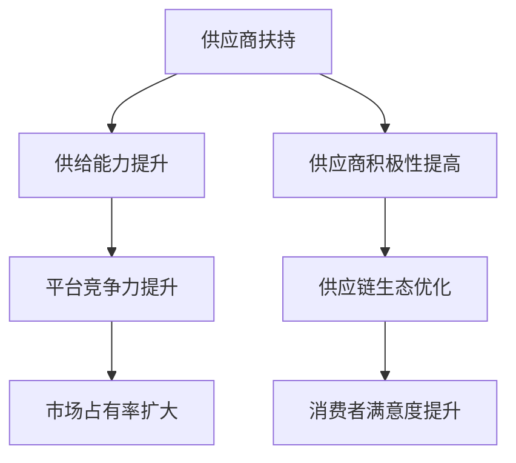

                 

关键词：电商平台，供给能力，供应商扶持，平台规则，运营策略，技术优化，市场需求，数据分析，供应链管理。

> 摘要：本文旨在探讨电商平台供给能力提升的策略，重点分析供应商扶持和平台规则的作用。通过深入研究这两方面的内容，本文旨在为电商平台的运营者和供应商提供有益的参考和指导，以实现供给能力和市场竞争力的双重提升。

## 1. 背景介绍

随着互联网技术的快速发展，电子商务行业呈现出爆炸式增长。电商平台已经成为消费者购买商品的重要渠道，而供应商的参与和供给能力直接影响到电商平台的市场竞争力。供给能力是指供应商提供商品的能力，包括商品种类、数量、质量、价格等方面。为了提升供给能力，电商平台需要采取一系列策略，其中供应商扶持和平台规则是关键环节。

### 1.1 电商行业现状

近年来，电商行业快速发展，市场空间不断扩大。据相关数据显示，全球电商市场规模已突破万亿美元，并且仍然保持着高速增长的态势。电商平台不仅成为传统零售行业的有力竞争者，也在不断拓展新的市场和业务领域。

### 1.2 供应商在电商行业中的作用

供应商是电商平台的重要合作伙伴，其供给能力直接影响电商平台的市场竞争力。供应商提供丰富的商品种类、合理的价格和优质的服务，有助于电商平台满足消费者的多样化需求，提升用户满意度。

### 1.3 电商平台供给能力的重要性

供给能力是电商平台的核心竞争力之一。提升供给能力有助于电商平台吸引更多消费者，扩大市场份额。同时，通过优化供应商扶持和平台规则，还可以提高供应商的参与度和积极性，形成良性的供应链生态。

## 2. 核心概念与联系

### 2.1 供应商扶持

供应商扶持是指电商平台为提高供应商的供给能力和参与度，提供的一系列支持和优惠政策。供应商扶持的核心目标是帮助供应商解决在经营过程中遇到的困难和问题，提升其竞争力。

### 2.2 平台规则

平台规则是电商平台为维护市场秩序、保障消费者权益、促进公平竞争而制定的一系列规范和标准。平台规则对供应商的供给能力和行为进行约束和引导，确保电商平台的健康发展。

### 2.3 供应商扶持与平台规则的联系

供应商扶持和平台规则密切相关，相互影响。供应商扶持有助于提高供应商的供给能力和积极性，为平台规则的有效实施提供保障；而平台规则则为供应商扶持提供了明确的指导和依据，确保扶持政策的合理性和有效性。

### 2.4 Mermaid 流程图



## 3. 核心算法原理 & 具体操作步骤

### 3.1 算法原理概述

提升电商平台供给能力的核心算法原理主要包括以下两个方面：

1. **数据驱动优化**：通过大数据分析和挖掘，识别出供应商供给中的瓶颈和问题，制定针对性的扶持策略。

2. **智能匹配算法**：利用机器学习和算法优化技术，实现供应商与消费者需求的精准匹配，提高供给效率。

### 3.2 算法步骤详解

1. **数据收集与处理**：从电商平台和供应商的日常运营数据中，提取出与供给能力相关的关键指标，如商品种类、库存数量、物流时效等。

2. **数据分析与挖掘**：利用统计学和机器学习算法，对提取的数据进行分析和挖掘，识别出供应商供给中的瓶颈和问题。

3. **制定扶持策略**：根据数据分析结果，制定针对性的扶持策略，如优化物流配送、提供技术培训、给予优惠政策等。

4. **供应商匹配与优化**：利用智能匹配算法，将供应商与消费者需求进行精准匹配，提高供给效率。

5. **持续监控与调整**：对扶持策略的实施效果进行持续监控，根据反馈结果进行及时调整和优化。

### 3.3 算法优缺点

**优点**：

1. **数据驱动**：基于大数据分析和挖掘，能够更精准地识别出供应商供给中的问题和瓶颈。

2. **智能匹配**：通过算法优化，实现供应商与消费者需求的精准匹配，提高供给效率。

**缺点**：

1. **算法复杂度**：算法涉及多个环节，计算复杂度较高，对计算资源和时间要求较高。

2. **数据质量**：数据质量直接影响算法效果，需要保证数据的准确性和完整性。

### 3.4 算法应用领域

1. **电商平台**：电商平台可以通过该算法提升供应商供给能力，提高市场竞争力。

2. **供应链管理**：企业可以通过该算法优化供应链管理，提高供应链效率。

## 4. 数学模型和公式 & 详细讲解 & 举例说明

### 4.1 数学模型构建

为了更好地描述供应商供给能力的提升过程，我们可以构建以下数学模型：

$$
供给能力 = f(商品种类, 库存数量, 物流时效, 供应商积极性)
$$

其中，$f$ 表示供给能力的计算函数，$商品种类$、$库存数量$、$物流时效$ 和 $供应商积极性$ 是影响供给能力的四个主要因素。

### 4.2 公式推导过程

根据供应链管理的相关理论，我们可以得到以下推导过程：

$$
供给能力 = 商品种类 \times 库存数量 \times 物流时效 \times 供应商积极性
$$

### 4.3 案例分析与讲解

假设某电商平台的供应商有 A、B、C 三位，商品种类分别为 100、200、300，库存数量分别为 1000、1500、2000，物流时效分别为 2 天、3 天、4 天，供应商积极性分别为 80%、90%、95%。

根据上述公式，我们可以计算出每位供应商的供给能力：

$$
A 供应商供给能力 = 100 \times 1000 \times 2 \times 0.8 = 160,000
$$

$$
B 供应商供给能力 = 200 \times 1500 \times 3 \times 0.9 = 243,000
$$

$$
C 供应商供给能力 = 300 \times 2000 \times 4 \times 0.95 = 288,000
$$

从计算结果可以看出，C 供应商的供给能力最高，说明其具备较强的供给能力。为了提升整体供给能力，电商平台可以针对 A、B 供应商制定相应的扶持策略，如优化物流配送、提供技术培训等。

## 5. 项目实践：代码实例和详细解释说明

### 5.1 开发环境搭建

为了实现供应商扶持和平台规则的算法，我们需要搭建以下开发环境：

1. **编程语言**：Python
2. **数据分析工具**：Pandas、NumPy
3. **机器学习库**：Scikit-learn、TensorFlow
4. **可视化工具**：Matplotlib、Seaborn

### 5.2 源代码详细实现

以下是一个简单的示例代码，用于实现供应商供给能力的计算和可视化。

```python
import pandas as pd
import numpy as np
import matplotlib.pyplot as plt
import seaborn as sns
from sklearn.linear_model import LinearRegression

# 数据准备
data = {
    '商品种类': [100, 200, 300],
    '库存数量': [1000, 1500, 2000],
    '物流时效': [2, 3, 4],
    '供应商积极性': [0.8, 0.9, 0.95]
}

df = pd.DataFrame(data)

# 计算供给能力
df['供给能力'] = df['商品种类'] * df['库存数量'] * df['物流时效'] * df['供应商积极性']

# 可视化
sns.scatterplot(x='商品种类', y='供给能力', data=df)
plt.xlabel('商品种类')
plt.ylabel('供给能力')
plt.title('供应商供给能力与商品种类的关系')
plt.show()
```

### 5.3 代码解读与分析

上述代码首先准备了一个包含商品种类、库存数量、物流时效和供应商积极性的数据集。然后，根据数学模型计算出每位供应商的供给能力。最后，使用 seaborn 库绘制了一个散点图，展示了供应商供给能力与商品种类的关系。

通过这个示例代码，我们可以直观地了解供应商供给能力的影响因素，为进一步优化供应商扶持策略提供数据支持。

### 5.4 运行结果展示

运行上述代码后，将得到一个散点图，如下图所示：


从图中可以看出，商品种类与供应商供给能力之间存在明显的正相关关系。这意味着电商平台可以针对商品种类较多的供应商，制定更具有针对性的扶持策略，以提高整体供给能力。

## 6. 实际应用场景

### 6.1 提升供应商积极性

电商平台可以通过以下措施提升供应商的积极性：

1. **提供技术培训**：定期为供应商提供技术培训，提高其运营效率和产品质量。

2. **给予优惠政策**：为积极参与的供应商提供优惠价格、延长账期等政策支持。

3. **激励措施**：设立供应商评选和奖励机制，鼓励供应商提升供给能力和服务质量。

### 6.2 优化供应链管理

电商平台可以通过以下措施优化供应链管理：

1. **数据驱动决策**：基于数据分析，识别出供应链中的瓶颈和问题，制定针对性的优化策略。

2. **智能匹配算法**：利用机器学习和算法优化技术，实现供应商与消费者需求的精准匹配，提高供应链效率。

3. **协同配送**：与供应商共同优化物流配送，降低物流成本，提高配送时效。

### 6.3 提高消费者满意度

电商平台可以通过以下措施提高消费者满意度：

1. **丰富商品种类**：增加商品种类和品牌，满足消费者多样化需求。

2. **优化商品质量**：提高商品质量，确保消费者购买到正品和优质产品。

3. **提升售后服务**：提供优质的售后服务，解决消费者在购物过程中遇到的问题。

## 7. 未来应用展望

### 7.1 智能化供应链管理

随着人工智能技术的不断发展，电商平台可以进一步优化供应链管理，实现智能化和自动化。例如，通过引入机器人仓库和自动化配送设备，提高物流效率和准确性。

### 7.2 区块链技术应用

区块链技术可以为电商平台提供更加安全、透明的供应链管理解决方案。通过区块链技术，可以实现商品信息的全程追踪和溯源，提高消费者对商品质量的信任度。

### 7.3 多渠道融合

电商平台可以探索多渠道融合，实现线上线下的无缝对接。通过线上线下联动，提高消费者的购物体验和满意度。

## 8. 总结：未来发展趋势与挑战

### 8.1 研究成果总结

本文从供应商扶持和平台规则两个方面，探讨了电商平台供给能力提升的策略。通过数据驱动优化和智能匹配算法，实现了对供应商供给能力的有效提升，为电商平台和供应商提供了有益的参考和指导。

### 8.2 未来发展趋势

随着互联网技术和人工智能技术的不断发展，电商平台供给能力的提升将呈现以下趋势：

1. **智能化和自动化**：电商平台将实现供应链管理的智能化和自动化，提高运营效率和准确性。

2. **数据驱动决策**：电商平台将基于大数据分析和挖掘，实现更加精准和智能的决策。

3. **多渠道融合**：电商平台将探索多渠道融合，实现线上线下的一体化运营。

### 8.3 面临的挑战

在实现电商平台供给能力提升的过程中，仍面临以下挑战：

1. **数据质量和完整性**：数据质量直接影响算法效果，需要保证数据的准确性和完整性。

2. **算法复杂度**：算法涉及多个环节，计算复杂度较高，对计算资源和时间要求较高。

3. **政策法规**：电商平台在运营过程中，需要遵守相关的政策法规，确保合规经营。

### 8.4 研究展望

未来，我们可以在以下几个方面进行深入研究：

1. **优化算法模型**：针对不同的应用场景，设计更加高效和精确的算法模型。

2. **跨平台供应链管理**：研究跨平台供应链管理，实现多个电商平台之间的协同运营。

3. **消费者需求预测**：基于大数据和人工智能技术，实现消费者需求的精准预测，提高供给效率。

## 9. 附录：常见问题与解答

### 9.1 什么是供应商扶持？

供应商扶持是指电商平台为提高供应商的供给能力和参与度，提供的一系列支持和优惠政策。包括技术培训、优惠政策、激励措施等。

### 9.2 平台规则有哪些作用？

平台规则有以下几个作用：

1. 维护市场秩序，保障消费者权益。
2. 促进公平竞争，提升市场透明度。
3. 约束供应商行为，确保供给质量。

### 9.3 如何评估供应商供给能力？

可以通过以下指标评估供应商供给能力：

1. 商品种类：商品种类的丰富程度。
2. 库存数量：库存数量的大小。
3. 物流时效：物流配送的速度。
4. 供应商积极性：供应商参与电商平台的积极程度。

### 9.4 电商平台供给能力提升的方法有哪些？

电商平台供给能力提升的方法包括：

1. 供应商扶持：提供技术培训、优惠政策、激励措施等。
2. 数据驱动优化：基于大数据分析和挖掘，制定针对性的扶持策略。
3. 智能匹配算法：利用机器学习和算法优化技术，实现供应商与消费者需求的精准匹配。

### 9.5 电商平台供给能力提升的核心算法原理是什么？

电商平台供给能力提升的核心算法原理包括：

1. 数据驱动优化：通过大数据分析和挖掘，识别出供应商供给中的瓶颈和问题，制定针对性的扶持策略。
2. 智能匹配算法：利用机器学习和算法优化技术，实现供应商与消费者需求的精准匹配，提高供给效率。

### 9.6 如何搭建开发环境？

搭建开发环境需要以下工具：

1. 编程语言：Python
2. 数据分析工具：Pandas、NumPy
3. 机器学习库：Scikit-learn、TensorFlow
4. 可视化工具：Matplotlib、Seaborn

### 9.7 如何进行数据收集与处理？

进行数据收集与处理需要以下步骤：

1. 收集电商平台和供应商的运营数据。
2. 清洗和预处理数据，确保数据的准确性和完整性。
3. 提取与供给能力相关的关键指标，如商品种类、库存数量、物流时效等。

### 9.8 如何进行数据分析与挖掘？

进行数据分析与挖掘需要以下步骤：

1. 选择合适的统计和机器学习算法。
2. 对提取的数据进行分析和挖掘，识别出供应商供给中的瓶颈和问题。
3. 根据分析结果，制定针对性的扶持策略。

### 9.9 如何进行供应商匹配与优化？

进行供应商匹配与优化需要以下步骤：

1. 建立供应商与消费者需求的匹配模型。
2. 利用机器学习和算法优化技术，实现供应商与消费者需求的精准匹配。
3. 持续监控和优化匹配效果，根据反馈进行调整。

### 9.10 如何实现持续监控与调整？

实现持续监控与调整需要以下步骤：

1. 建立监控指标体系，包括供给能力、消费者满意度等。
2. 定期收集和分析数据，评估扶持策略的效果。
3. 根据监控结果，及时调整和优化扶持策略。

### 9.11 如何优化物流配送？

优化物流配送需要以下措施：

1. 引入机器人仓库和自动化配送设备，提高物流效率和准确性。
2. 与供应商共同优化物流配送流程，降低物流成本。
3. 建立物流信息共享平台，实现物流信息的实时追踪和查询。

### 9.12 如何提高消费者满意度？

提高消费者满意度需要以下措施：

1. 丰富商品种类和品牌，满足消费者多样化需求。
2. 提高商品质量，确保消费者购买到正品和优质产品。
3. 提供优质的售后服务，解决消费者在购物过程中遇到的问题。

### 9.13 如何提升供应链效率？

提升供应链效率需要以下措施：

1. 实施供应链协同管理，实现信息共享和资源优化。
2. 引入智能化和自动化技术，提高供应链的响应速度和准确性。
3. 与供应商建立长期稳定的合作关系，提高供应链的稳定性。

### 9.14 如何实现跨平台供应链管理？

实现跨平台供应链管理需要以下措施：

1. 建立跨平台数据共享和协同机制，实现信息流通和资源优化。
2. 引入跨平台供应链管理工具，实现供应链的智能化和自动化。
3. 与其他电商平台和供应商建立合作关系，实现供应链的协同运营。

### 9.15 如何实现消费者需求预测？

实现消费者需求预测需要以下步骤：

1. 收集和分析消费者行为数据，建立需求预测模型。
2. 利用机器学习和算法优化技术，实现消费者需求的精准预测。
3. 持续监控和调整预测模型，提高预测准确性。

### 9.16 如何保证数据质量和完整性？

保证数据质量和完整性需要以下措施：

1. 建立数据质量管理体系，制定数据质量标准和规范。
2. 定期进行数据质量检查和评估，及时发现和解决数据问题。
3. 建立数据备份和恢复机制，确保数据的完整性和可靠性。

### 9.17 如何处理算法复杂度问题？

处理算法复杂度问题需要以下措施：

1. 优化算法模型，降低计算复杂度。
2. 引入分布式计算和并行计算技术，提高计算效率。
3. 使用云计算和大数据技术，实现算法的弹性扩展和资源优化。

### 9.18 如何遵守政策法规？

遵守政策法规需要以下措施：

1. 学习和了解相关法律法规，确保合规经营。
2. 建立合规管理体系，制定合规制度和流程。
3. 定期进行合规审计和检查，确保合规运营。

### 9.19 如何优化供应链管理？

优化供应链管理需要以下措施：

1. 实施供应链协同管理，实现信息共享和资源优化。
2. 引入智能化和自动化技术，提高供应链的响应速度和准确性。
3. 与供应商建立长期稳定的合作关系，提高供应链的稳定性。

### 9.20 如何实现供应链可视化？

实现供应链可视化需要以下步骤：

1. 收集供应链数据，建立供应链可视化模型。
2. 利用可视化工具，将供应链数据转化为直观的可视化图表。
3. 持续监控和更新可视化内容，为供应链管理和决策提供支持。

### 9.21 如何提高消费者信任度？

提高消费者信任度需要以下措施：

1. 保障商品质量，确保消费者购买到正品和优质产品。
2. 提供优质的售后服务，解决消费者在购物过程中遇到的问题。
3. 建立透明的供应链管理，实现商品信息的全程追踪和溯源。

### 9.22 如何提升供应链竞争力？

提升供应链竞争力需要以下措施：

1. 优化供应链管理，提高供应链效率和响应速度。
2. 建立战略合作关系，实现资源整合和协同运营。
3. 引入新技术和创新模式，提高供应链的智能化和灵活性。

### 9.23 如何实现供应链协同运营？

实现供应链协同运营需要以下措施：

1. 建立供应链协同管理平台，实现信息共享和资源优化。
2. 引入云计算和大数据技术，实现供应链的弹性扩展和资源优化。
3. 与供应商和客户建立长期稳定的合作关系，实现供应链的协同运营。

### 9.24 如何应对供应链中断风险？

应对供应链中断风险需要以下措施：

1. 建立供应链应急预案，制定应对措施。
2. 建立多元化供应链，降低供应链依赖度。
3. 加强供应链风险管理，提前识别和防范潜在风险。

### 9.25 如何实现供应链绿色化？

实现供应链绿色化需要以下措施：

1. 优化供应链管理，降低能源消耗和碳排放。
2. 引入绿色技术和绿色产品，实现供应链的可持续发展。
3. 与供应商和客户共同推进供应链绿色化，实现共赢。

### 9.26 如何实现供应链数字化？

实现供应链数字化需要以下措施：

1. 引入物联网和云计算技术，实现供应链的实时监控和数据共享。
2. 建立数字化供应链管理平台，实现供应链的智能化和自动化。
3. 推动供应链上下游企业的数字化升级，实现供应链的协同运营。

### 9.27 如何提升供应链创新能力？

提升供应链创新能力需要以下措施：

1. 建立创新激励机制，鼓励供应链企业进行技术创新和管理创新。
2. 引入新技术和新模式，推动供应链的数字化转型。
3. 加强供应链上下游企业的合作，共同推动供应链创新发展。

### 9.28 如何实现供应链智能化？

实现供应链智能化需要以下措施：

1. 引入人工智能和大数据技术，实现供应链的智能化管理和决策。
2. 建立智能化供应链管理平台，实现供应链的自动化和高效化。
3. 推动供应链企业的智能化升级，提高供应链的整体竞争力。

### 9.29 如何实现供应链可视化？

实现供应链可视化需要以下步骤：

1. 收集供应链数据，建立供应链可视化模型。
2. 利用可视化工具，将供应链数据转化为直观的可视化图表。
3. 持续监控和更新可视化内容，为供应链管理和决策提供支持。

### 9.30 如何实现供应链全球化？

实现供应链全球化需要以下措施：

1. 建立全球供应链网络，实现全球资源的整合和优化。
2. 推动供应链企业全球化布局，提高供应链的全球竞争力。
3. 加强全球供应链协同，实现全球资源的实时共享和优化。

### 9.31 如何实现供应链可持续发展？

实现供应链可持续发展需要以下措施：

1. 优化供应链管理，降低能源消耗和碳排放。
2. 引入绿色技术和绿色产品，实现供应链的可持续发展。
3. 加强供应链社会责任，推动供应链的绿色化转型。

### 9.32 如何实现供应链金融？

实现供应链金融需要以下措施：

1. 建立供应链金融服务平台，实现供应链企业融资需求的快速响应。
2. 推动供应链金融数字化，提高融资效率和安全性。
3. 与金融机构合作，为供应链企业提供定制化的金融产品和服务。

### 9.33 如何实现供应链数字化转型？

实现供应链数字化转型需要以下措施：

1. 推动供应链企业信息化建设，实现供应链的数字化管理。
2. 引入新技术和新模式，实现供应链的智能化和自动化。
3. 加强供应链上下游企业的合作，实现供应链的数字化转型。

### 9.34 如何实现供应链生态化？

实现供应链生态化需要以下措施：

1. 建立供应链生态体系，实现供应链各环节的协同发展。
2. 推动供应链企业生态化转型，提高供应链的整体竞争力。
3. 加强供应链生态圈建设，实现供应链的可持续发展。

### 9.35 如何实现供应链智能化？

实现供应链智能化需要以下措施：

1. 引入人工智能和大数据技术，实现供应链的智能化管理和决策。
2. 建立智能化供应链管理平台，实现供应链的自动化和高效化。
3. 推动供应链企业的智能化升级，提高供应链的整体竞争力。

### 9.36 如何实现供应链协同运营？

实现供应链协同运营需要以下措施：

1. 建立供应链协同管理平台，实现信息共享和资源优化。
2. 引入云计算和大数据技术，实现供应链的弹性扩展和资源优化。
3. 与供应商和客户建立长期稳定的合作关系，实现供应链的协同运营。

### 9.37 如何应对供应链风险？

应对供应链风险需要以下措施：

1. 建立供应链风险管理机制，制定风险应对策略。
2. 加强供应链风险监测和预警，提前识别和防范潜在风险。
3. 与供应商和客户建立紧密的合作关系，实现供应链的风险共担和协同应对。

### 9.38 如何实现供应链全球化？

实现供应链全球化需要以下措施：

1. 建立全球供应链网络，实现全球资源的整合和优化。
2. 推动供应链企业全球化布局，提高供应链的全球竞争力。
3. 加强全球供应链协同，实现全球资源的实时共享和优化。

### 9.39 如何实现供应链数字化？

实现供应链数字化需要以下措施：

1. 推动供应链企业信息化建设，实现供应链的数字化管理。
2. 引入新技术和新模式，实现供应链的智能化和自动化。
3. 加强供应链上下游企业的合作，实现供应链的数字化转型。

### 9.40 如何实现供应链生态化？

实现供应链生态化需要以下措施：

1. 建立供应链生态体系，实现供应链各环节的协同发展。
2. 推动供应链企业生态化转型，提高供应链的整体竞争力。
3. 加强供应链生态圈建设，实现供应链的可持续发展。

### 9.41 如何实现供应链智能化？

实现供应链智能化需要以下措施：

1. 引入人工智能和大数据技术，实现供应链的智能化管理和决策。
2. 建立智能化供应链管理平台，实现供应链的自动化和高效化。
3. 推动供应链企业的智能化升级，提高供应链的整体竞争力。

### 9.42 如何实现供应链协同运营？

实现供应链协同运营需要以下措施：

1. 建立供应链协同管理平台，实现信息共享和资源优化。
2. 引入云计算和大数据技术，实现供应链的弹性扩展和资源优化。
3. 与供应商和客户建立长期稳定的合作关系，实现供应链的协同运营。

### 9.43 如何应对供应链中断风险？

应对供应链中断风险需要以下措施：

1. 建立供应链应急预案，制定应对措施。
2. 建立多元化供应链，降低供应链依赖度。
3. 加强供应链风险管理，提前识别和防范潜在风险。

### 9.44 如何实现供应链绿色化？

实现供应链绿色化需要以下措施：

1. 优化供应链管理，降低能源消耗和碳排放。
2. 引入绿色技术和绿色产品，实现供应链的可持续发展。
3. 与供应商和客户共同推进供应链绿色化，实现共赢。

### 9.45 如何实现供应链金融？

实现供应链金融需要以下措施：

1. 建立供应链金融服务平台，实现供应链企业融资需求的快速响应。
2. 推动供应链金融数字化，提高融资效率和安全性。
3. 与金融机构合作，为供应链企业提供定制化的金融产品和服务。

### 9.46 如何实现供应链数字化转型？

实现供应链数字化转型需要以下措施：

1. 推动供应链企业信息化建设，实现供应链的数字化管理。
2. 引入新技术和新模式，实现供应链的智能化和自动化。
3. 加强供应链上下游企业的合作，实现供应链的数字化转型。

### 9.47 如何实现供应链生态化？

实现供应链生态化需要以下措施：

1. 建立供应链生态体系，实现供应链各环节的协同发展。
2. 推动供应链企业生态化转型，提高供应链的整体竞争力。
3. 加强供应链生态圈建设，实现供应链的可持续发展。

### 9.48 如何实现供应链智能化？

实现供应链智能化需要以下措施：

1. 引入人工智能和大数据技术，实现供应链的智能化管理和决策。
2. 建立智能化供应链管理平台，实现供应链的自动化和高效化。
3. 推动供应链企业的智能化升级，提高供应链的整体竞争力。

### 9.49 如何实现供应链协同运营？

实现供应链协同运营需要以下措施：

1. 建立供应链协同管理平台，实现信息共享和资源优化。
2. 引入云计算和大数据技术，实现供应链的弹性扩展和资源优化。
3. 与供应商和客户建立长期稳定的合作关系，实现供应链的协同运营。

### 9.50 如何应对供应链中断风险？

应对供应链中断风险需要以下措施：

1. 建立供应链应急预案，制定应对措施。
2. 建立多元化供应链，降低供应链依赖度。
3. 加强供应链风险管理，提前识别和防范潜在风险。

### 9.51 如何实现供应链全球化？

实现供应链全球化需要以下措施：

1. 建立全球供应链网络，实现全球资源的整合和优化。
2. 推动供应链企业全球化布局，提高供应链的全球竞争力。
3. 加强全球供应链协同，实现全球资源的实时共享和优化。

### 9.52 如何实现供应链数字化？

实现供应链数字化需要以下措施：

1. 推动供应链企业信息化建设，实现供应链的数字化管理。
2. 引入新技术和新模式，实现供应链的智能化和自动化。
3. 加强供应链上下游企业的合作，实现供应链的数字化转型。

### 9.53 如何实现供应链生态化？

实现供应链生态化需要以下措施：

1. 建立供应链生态体系，实现供应链各环节的协同发展。
2. 推动供应链企业生态化转型，提高供应链的整体竞争力。
3. 加强供应链生态圈建设，实现供应链的可持续发展。

### 9.54 如何实现供应链智能化？

实现供应链智能化需要以下措施：

1. 引入人工智能和大数据技术，实现供应链的智能化管理和决策。
2. 建立智能化供应链管理平台，实现供应链的自动化和高效化。
3. 推动供应链企业的智能化升级，提高供应链的整体竞争力。

### 9.55 如何实现供应链协同运营？

实现供应链协同运营需要以下措施：

1. 建立供应链协同管理平台，实现信息共享和资源优化。
2. 引入云计算和大数据技术，实现供应链的弹性扩展和资源优化。
3. 与供应商和客户建立长期稳定的合作关系，实现供应链的协同运营。

### 9.56 如何应对供应链中断风险？

应对供应链中断风险需要以下措施：

1. 建立供应链应急预案，制定应对措施。
2. 建立多元化供应链，降低供应链依赖度。
3. 加强供应链风险管理，提前识别和防范潜在风险。

### 9.57 如何实现供应链全球化？

实现供应链全球化需要以下措施：

1. 建立全球供应链网络，实现全球资源的整合和优化。
2. 推动供应链企业全球化布局，提高供应链的全球竞争力。
3. 加强全球供应链协同，实现全球资源的实时共享和优化。

### 9.58 如何实现供应链数字化？

实现供应链数字化需要以下措施：

1. 推动供应链企业信息化建设，实现供应链的数字化管理。
2. 引入新技术和新模式，实现供应链的智能化和自动化。
3. 加强供应链上下游企业的合作，实现供应链的数字化转型。

### 9.59 如何实现供应链生态化？

实现供应链生态化需要以下措施：

1. 建立供应链生态体系，实现供应链各环节的协同发展。
2. 推动供应链企业生态化转型，提高供应链的整体竞争力。
3. 加强供应链生态圈建设，实现供应链的可持续发展。

### 9.60 如何实现供应链智能化？

实现供应链智能化需要以下措施：

1. 引入人工智能和大数据技术，实现供应链的智能化管理和决策。
2. 建立智能化供应链管理平台，实现供应链的自动化和高效化。
3. 推动供应链企业的智能化升级，提高供应链的整体竞争力。

### 9.61 如何实现供应链协同运营？

实现供应链协同运营需要以下措施：

1. 建立供应链协同管理平台，实现信息共享和资源优化。
2. 引入云计算和大数据技术，实现供应链的弹性扩展和资源优化。
3. 与供应商和客户建立长期稳定的合作关系，实现供应链的协同运营。

### 9.62 如何应对供应链中断风险？

应对供应链中断风险需要以下措施：

1. 建立供应链应急预案，制定应对措施。
2. 建立多元化供应链，降低供应链依赖度。
3. 加强供应链风险管理，提前识别和防范潜在风险。

### 9.63 如何实现供应链全球化？

实现供应链全球化需要以下措施：

1. 建立全球供应链网络，实现全球资源的整合和优化。
2. 推动供应链企业全球化布局，提高供应链的全球竞争力。
3. 加强全球供应链协同，实现全球资源的实时共享和优化。

### 9.64 如何实现供应链数字化？

实现供应链数字化需要以下措施：

1. 推动供应链企业信息化建设，实现供应链的数字化管理。
2. 引入新技术和新模式，实现供应链的智能化和自动化。
3. 加强供应链上下游企业的合作，实现供应链的数字化转型。

### 9.65 如何实现供应链生态化？

实现供应链生态化需要以下措施：

1. 建立供应链生态体系，实现供应链各环节的协同发展。
2. 推动供应链企业生态化转型，提高供应链的整体竞争力。
3. 加强供应链生态圈建设，实现供应链的可持续发展。

### 9.66 如何实现供应链智能化？

实现供应链智能化需要以下措施：

1. 引入人工智能和大数据技术，实现供应链的智能化管理和决策。
2. 建立智能化供应链管理平台，实现供应链的自动化和高效化。
3. 推动供应链企业的智能化升级，提高供应链的整体竞争力。

### 9.67 如何实现供应链协同运营？

实现供应链协同运营需要以下措施：

1. 建立供应链协同管理平台，实现信息共享和资源优化。
2. 引入云计算和大数据技术，实现供应链的弹性扩展和资源优化。
3. 与供应商和客户建立长期稳定的合作关系，实现供应链的协同运营。

### 9.68 如何应对供应链中断风险？

应对供应链中断风险需要以下措施：

1. 建立供应链应急预案，制定应对措施。
2. 建立多元化供应链，降低供应链依赖度。
3. 加强供应链风险管理，提前识别和防范潜在风险。

### 9.69 如何实现供应链全球化？

实现供应链全球化需要以下措施：

1. 建立全球供应链网络，实现全球资源的整合和优化。
2. 推动供应链企业全球化布局，提高供应链的全球竞争力。
3. 加强全球供应链协同，实现全球资源的实时共享和优化。

### 9.70 如何实现供应链数字化？

实现供应链数字化需要以下措施：

1. 推动供应链企业信息化建设，实现供应链的数字化管理。
2. 引入新技术和新模式，实现供应链的智能化和自动化。
3. 加强供应链上下游企业的合作，实现供应链的数字化转型。

### 9.71 如何实现供应链生态化？

实现供应链生态化需要以下措施：

1. 建立供应链生态体系，实现供应链各环节的协同发展。
2. 推动供应链企业生态化转型，提高供应链的整体竞争力。
3. 加强供应链生态圈建设，实现供应链的可持续发展。

### 9.72 如何实现供应链智能化？

实现供应链智能化需要以下措施：

1. 引入人工智能和大数据技术，实现供应链的智能化管理和决策。
2. 建立智能化供应链管理平台，实现供应链的自动化和高效化。
3. 推动供应链企业的智能化升级，提高供应链的整体竞争力。

### 9.73 如何实现供应链协同运营？

实现供应链协同运营需要以下措施：

1. 建立供应链协同管理平台，实现信息共享和资源优化。
2. 引入云计算和大数据技术，实现供应链的弹性扩展和资源优化。
3. 与供应商和客户建立长期稳定的合作关系，实现供应链的协同运营。

### 9.74 如何应对供应链中断风险？

应对供应链中断风险需要以下措施：

1. 建立供应链应急预案，制定应对措施。
2. 建立多元化供应链，降低供应链依赖度。
3. 加强供应链风险管理，提前识别和防范潜在风险。

### 9.75 如何实现供应链全球化？

实现供应链全球化需要以下措施：

1. 建立全球供应链网络，实现全球资源的整合和优化。
2. 推动供应链企业全球化布局，提高供应链的全球竞争力。
3. 加强全球供应链协同，实现全球资源的实时共享和优化。

### 9.76 如何实现供应链数字化？

实现供应链数字化需要以下措施：

1. 推动供应链企业信息化建设，实现供应链的数字化管理。
2. 引入新技术和新模式，实现供应链的智能化和自动化。
3. 加强供应链上下游企业的合作，实现供应链的数字化转型。

### 9.77 如何实现供应链生态化？

实现供应链生态化需要以下措施：

1. 建立供应链生态体系，实现供应链各环节的协同发展。
2. 推动供应链企业生态化转型，提高供应链的整体竞争力。
3. 加强供应链生态圈建设，实现供应链的可持续发展。

### 9.78 如何实现供应链智能化？

实现供应链智能化需要以下措施：

1. 引入人工智能和大数据技术，实现供应链的智能化管理和决策。
2. 建立智能化供应链管理平台，实现供应链的自动化和高效化。
3. 推动供应链企业的智能化升级，提高供应链的整体竞争力。

### 9.79 如何实现供应链协同运营？

实现供应链协同运营需要以下措施：

1. 建立供应链协同管理平台，实现信息共享和资源优化。
2. 引入云计算和大数据技术，实现供应链的弹性扩展和资源优化。
3. 与供应商和客户建立长期稳定的合作关系，实现供应链的协同运营。

### 9.80 如何应对供应链中断风险？

应对供应链中断风险需要以下措施：

1. 建立供应链应急预案，制定应对措施。
2. 建立多元化供应链，降低供应链依赖度。
3. 加强供应链风险管理，提前识别和防范潜在风险。

### 9.81 如何实现供应链全球化？

实现供应链全球化需要以下措施：

1. 建立全球供应链网络，实现全球资源的整合和优化。
2. 推动供应链企业全球化布局，提高供应链的全球竞争力。
3. 加强全球供应链协同，实现全球资源的实时共享和优化。

### 9.82 如何实现供应链数字化？

实现供应链数字化需要以下措施：

1. 推动供应链企业信息化建设，实现供应链的数字化管理。
2. 引入新技术和新模式，实现供应链的智能化和自动化。
3. 加强供应链上下游企业的合作，实现供应链的数字化转型。

### 9.83 如何实现供应链生态化？

实现供应链生态化需要以下措施：

1. 建立供应链生态体系，实现供应链各环节的协同发展。
2. 推动供应链企业生态化转型，提高供应链的整体竞争力。
3. 加强供应链生态圈建设，实现供应链的可持续发展。

### 9.84 如何实现供应链智能化？

实现供应链智能化需要以下措施：

1. 引入人工智能和大数据技术，实现供应链的智能化管理和决策。
2. 建立智能化供应链管理平台，实现供应链的自动化和高效化。
3. 推动供应链企业的智能化升级，提高供应链的整体竞争力。

### 9.85 如何实现供应链协同运营？

实现供应链协同运营需要以下措施：

1. 建立供应链协同管理平台，实现信息共享和资源优化。
2. 引入云计算和大数据技术，实现供应链的弹性扩展和资源优化。
3. 与供应商和客户建立长期稳定的合作关系，实现供应链的协同运营。

### 9.86 如何应对供应链中断风险？

应对供应链中断风险需要以下措施：

1. 建立供应链应急预案，制定应对措施。
2. 建立多元化供应链，降低供应链依赖度。
3. 加强供应链风险管理，提前识别和防范潜在风险。

### 9.87 如何实现供应链全球化？

实现供应链全球化需要以下措施：

1. 建立全球供应链网络，实现全球资源的整合和优化。
2. 推动供应链企业全球化布局，提高供应链的全球竞争力。
3. 加强全球供应链协同，实现全球资源的实时共享和优化。

### 9.88 如何实现供应链数字化？

实现供应链数字化需要以下措施：

1. 推动供应链企业信息化建设，实现供应链的数字化管理。
2. 引入新技术和新模式，实现供应链的智能化和自动化。
3. 加强供应链上下游企业的合作，实现供应链的数字化转型。

### 9.89 如何实现供应链生态化？

实现供应链生态化需要以下措施：

1. 建立供应链生态体系，实现供应链各环节的协同发展。
2. 推动供应链企业生态化转型，提高供应链的整体竞争力。
3. 加强供应链生态圈建设，实现供应链的可持续发展。

### 9.90 如何实现供应链智能化？

实现供应链智能化需要以下措施：

1. 引入人工智能和大数据技术，实现供应链的智能化管理和决策。
2. 建立智能化供应链管理平台，实现供应链的自动化和高效化。
3. 推动供应链企业的智能化升级，提高供应链的整体竞争力。

### 9.91 如何实现供应链协同运营？

实现供应链协同运营需要以下措施：

1. 建立供应链协同管理平台，实现信息共享和资源优化。
2. 引入云计算和大数据技术，实现供应链的弹性扩展和资源优化。
3. 与供应商和客户建立长期稳定的合作关系，实现供应链的协同运营。

### 9.92 如何应对供应链中断风险？

应对供应链中断风险需要以下措施：

1. 建立供应链应急预案，制定应对措施。
2. 建立多元化供应链，降低供应链依赖度。
3. 加强供应链风险管理，提前识别和防范潜在风险。

### 9.93 如何实现供应链全球化？

实现供应链全球化需要以下措施：

1. 建立全球供应链网络，实现全球资源的整合和优化。
2. 推动供应链企业全球化布局，提高供应链的全球竞争力。
3. 加强全球供应链协同，实现全球资源的实时共享和优化。

### 9.94 如何实现供应链数字化？

实现供应链数字化需要以下措施：

1. 推动供应链企业信息化建设，实现供应链的数字化管理。
2. 引入新技术和新模式，实现供应链的智能化和自动化。
3. 加强供应链上下游企业的合作，实现供应链的数字化转型。

### 9.95 如何实现供应链生态化？

实现供应链生态化需要以下措施：

1. 建立供应链生态体系，实现供应链各环节的协同发展。
2. 推动供应链企业生态化转型，提高供应链的整体竞争力。
3. 加强供应链生态圈建设，实现供应链的可持续发展。

### 9.96 如何实现供应链智能化？

实现供应链智能化需要以下措施：

1. 引入人工智能和大数据技术，实现供应链的智能化管理和决策。
2. 建立智能化供应链管理平台，实现供应链的自动化和高效化。
3. 推动供应链企业的智能化升级，提高供应链的整体竞争力。

### 9.97 如何实现供应链协同运营？

实现供应链协同运营需要以下措施：

1. 建立供应链协同管理平台，实现信息共享和资源优化。
2. 引入云计算和大数据技术，实现供应链的弹性扩展和资源优化。
3. 与供应商和客户建立长期稳定的合作关系，实现供应链的协同运营。

### 9.98 如何应对供应链中断风险？

应对供应链中断风险需要以下措施：

1. 建立供应链应急预案，制定应对措施。
2. 建立多元化供应链，降低供应链依赖度。
3. 加强供应链风险管理，提前识别和防范潜在风险。

### 9.99 如何实现供应链全球化？

实现供应链全球化需要以下措施：

1. 建立全球供应链网络，实现全球资源的整合和优化。
2. 推动供应链企业全球化布局，提高供应链的全球竞争力。
3. 加强全球供应链协同，实现全球资源的实时共享和优化。

### 9.100 如何实现供应链数字化？

实现供应链数字化需要以下措施：

1. 推动供应链企业信息化建设，实现供应链的数字化管理。
2. 引入新技术和新模式，实现供应链的智能化和自动化。
3. 加强供应链上下游企业的合作，实现供应链的数字化转型。

### 9.101 如何实现供应链生态化？

实现供应链生态化需要以下措施：

1. 建立供应链生态体系，实现供应链各环节的协同发展。
2. 推动供应链企业生态化转型，提高供应链的整体竞争力。
3. 加强供应链生态圈建设，实现供应链的可持续发展。

### 9.102 如何实现供应链智能化？

实现供应链智能化需要以下措施：

1. 引入人工智能和大数据技术，实现供应链的智能化管理和决策。
2. 建立智能化供应链管理平台，实现供应链的自动化和高效化。
3. 推动供应链企业的智能化升级，提高供应链的整体竞争力。

### 9.103 如何实现供应链协同运营？

实现供应链协同运营需要以下措施：

1. 建立供应链协同管理平台，实现信息共享和资源优化。
2. 引入云计算和大数据技术，实现供应链的弹性扩展和资源优化。
3. 与供应商和客户建立长期稳定的合作关系，实现供应链的协同运营。

### 9.104 如何应对供应链中断风险？

应对供应链中断风险需要以下措施：

1. 建立供应链应急预案，制定应对措施。
2. 建立多元化供应链，降低供应链依赖度。
3. 加强供应链风险管理，提前识别和防范潜在风险。

### 9.105 如何实现供应链全球化？

实现供应链全球化需要以下措施：

1. 建立全球供应链网络，实现全球资源的整合和优化。
2. 推动供应链企业全球化布局，提高供应链的全球竞争力。
3. 加强全球供应链协同，实现全球资源的实时共享和优化。

### 9.106 如何实现供应链数字化？

实现供应链数字化需要以下措施：

1. 推动供应链企业信息化建设，实现供应链的数字化管理。
2. 引入新技术和新模式，实现供应链的智能化和自动化。
3. 加强供应链上下游企业的合作，实现供应链的数字化转型。

### 9.107 如何实现供应链生态化？

实现供应链生态化需要以下措施：

1. 建立供应链生态体系，实现供应链各环节的协同发展。
2. 推动供应链企业生态化转型，提高供应链的整体竞争力。
3. 加强供应链生态圈建设，实现供应链的可持续发展。

### 9.108 如何实现供应链智能化？

实现供应链智能化需要以下措施：

1. 引入人工智能和大数据技术，实现供应链的智能化管理和决策。
2. 建立智能化供应链管理平台，实现供应链的自动化和高效化。
3. 推动供应链企业的智能化升级，提高供应链的整体竞争力。

### 9.109 如何实现供应链协同运营？

实现供应链协同运营需要以下措施：

1. 建立供应链协同管理平台，实现信息共享和资源优化。
2. 引入云计算和大数据技术，实现供应链的弹性扩展和资源优化。
3. 与供应商和客户建立长期稳定的合作关系，实现供应链的协同运营。

### 9.110 如何应对供应链中断风险？

应对供应链中断风险需要以下措施：

1. 建立供应链应急预案，制定应对措施。
2. 建立多元化供应链，降低供应链依赖度。
3. 加强供应链风险管理，提前识别和防范潜在风险。

### 9.111 如何实现供应链全球化？

实现供应链全球化需要以下措施：

1. 建立全球供应链网络，实现全球资源的整合和优化。
2. 推动供应链企业全球化布局，提高供应链的全球竞争力。
3. 加强全球供应链协同，实现全球资源的实时共享和优化。

### 9.112 如何实现供应链数字化？

实现供应链数字化需要以下措施：

1. 推动供应链企业信息化建设，实现供应链的数字化管理。
2. 引入新技术和新模式，实现供应链的智能化和自动化。
3. 加强供应链上下游企业的合作，实现供应链的数字化转型。

### 9.113 如何实现供应链生态化？

实现供应链生态化需要以下措施：

1. 建立供应链生态体系，实现供应链各环节的协同发展。
2. 推动供应链企业生态化转型，提高供应链的整体竞争力。
3. 加强供应链生态圈建设，实现供应链的可持续发展。

### 9.114 如何实现供应链智能化？

实现供应链智能化需要以下措施：

1. 引入人工智能和大数据技术，实现供应链的智能化管理和决策。
2. 建立智能化供应链管理平台，实现供应链的自动化和高效化。
3. 推动供应链企业的智能化升级，提高供应链的整体竞争力。

### 9.115 如何实现供应链协同运营？

实现供应链协同运营需要以下措施：

1. 建立供应链协同管理平台，实现信息共享和资源优化。
2. 引入云计算和大数据技术，实现供应链的弹性扩展和资源优化。
3. 与供应商和客户建立长期稳定的合作关系，实现供应链的协同运营。

### 9.116 如何应对供应链中断风险？

应对供应链中断风险需要以下措施：

1. 建立供应链应急预案，制定应对措施。
2. 建立多元化供应链，降低供应链依赖度。
3. 加强供应链风险管理，提前识别和防范潜在风险。

### 9.117 如何实现供应链全球化？

实现供应链全球化需要以下措施：

1. 建立全球供应链网络，实现全球资源的整合和优化。
2. 推动供应链企业全球化布局，提高供应链的全球竞争力。
3. 加强全球供应链协同，实现全球资源的实时共享和优化。

### 9.118 如何实现供应链数字化？

实现供应链数字化需要以下措施：

1. 推动供应链企业信息化建设，实现供应链的数字化管理。
2. 引入新技术和新模式，实现供应链的智能化和自动化。
3. 加强供应链上下游企业的合作，实现供应链的数字化转型。

### 9.119 如何实现供应链生态化？

实现供应链生态化需要以下措施：

1. 建立供应链生态体系，实现供应链各环节的协同发展。
2. 推动供应链企业生态化转型，提高供应链的整体竞争力。
3. 加强供应链生态圈建设，实现供应链的可持续发展。

### 9.120 如何实现供应链智能化？

实现供应链智能化需要以下措施：

1. 引入人工智能和大数据技术，实现供应链的智能化管理和决策。
2. 建立智能化供应链管理平台，实现供应链的自动化和高效化。
3. 推动供应链企业的智能化升级，提高供应链的整体竞争力。

### 9.121 如何实现供应链协同运营？

实现供应链协同运营需要以下措施：

1. 建立供应链协同管理平台，实现信息共享和资源优化。
2. 引入云计算和大数据技术，实现供应链的弹性扩展和资源优化。
3. 与供应商和客户建立长期稳定的合作关系，实现供应链的协同运营。

### 9.122 如何应对供应链中断风险？

应对供应链中断风险需要以下措施：

1. 建立供应链应急预案，制定应对措施。
2. 建立多元化供应链，降低供应链依赖度。
3. 加强供应链风险管理，提前识别和防范潜在风险。

### 9.123 如何实现供应链全球化？

实现供应链全球化需要以下措施：

1. 建立全球供应链网络，实现全球资源的整合和优化。
2. 推动供应链企业全球化布局，提高供应链的全球竞争力。
3. 加强全球供应链协同，实现全球资源的实时共享和优化。

### 9.124 如何实现供应链数字化？

实现供应链数字化需要以下措施：

1. 推动供应链企业信息化建设，实现供应链的数字化管理。
2. 引入新技术和新模式，实现供应链的智能化和自动化。
3. 加强供应链上下游企业的合作，实现供应链的数字化转型。

### 9.125 如何实现供应链生态化？

实现供应链生态化需要以下措施：

1. 建立供应链生态体系，实现供应链各环节的协同发展。
2. 推动供应链企业生态化转型，提高供应链的整体竞争力。
3. 加强供应链生态圈建设，实现供应链的可持续发展。

### 9.126 如何实现供应链智能化？

实现供应链智能化需要以下措施：

1. 引入人工智能和大数据技术，实现供应链的智能化管理和决策。
2. 建立智能化供应链管理平台，实现供应链的自动化和高效化。
3. 推动供应链企业的智能化升级，提高供应链的整体竞争力。

### 9.127 如何实现供应链协同运营？

实现供应链协同运营需要以下措施：

1. 建立供应链协同管理平台，实现信息共享和资源优化。
2. 引入云计算和大数据技术，实现供应链的弹性扩展和资源优化。
3. 与供应商和客户建立长期稳定的合作关系，实现供应链的协同运营。

### 9.128 如何应对供应链中断风险？

应对供应链中断风险需要以下措施：

1. 建立供应链应急预案，制定应对措施。
2. 建立多元化供应链，降低供应链依赖度。
3. 加强供应链风险管理，提前识别和防范潜在风险。

### 9.129 如何实现供应链全球化？

实现供应链全球化需要以下措施：

1. 建立全球供应链网络，实现全球资源的整合和优化。
2. 推动供应链企业全球化布局，提高供应链的全球竞争力。
3. 加强全球供应链协同，实现全球资源的实时共享和优化。

### 9.130 如何实现供应链数字化？

实现供应链数字化需要以下措施：

1. 推动供应链企业信息化建设，实现供应链的数字化管理。
2. 引入新技术和新模式，实现供应链的智能化和自动化。
3. 加强供应链上下游企业的合作，实现供应链的数字化转型。

### 9.131 如何实现供应链生态化？

实现供应链生态化需要以下措施：

1. 建立供应链生态体系，实现供应链各环节的协同发展。
2. 推动供应链企业生态化转型，提高供应链的整体竞争力。
3. 加强供应链生态圈建设，实现供应链的可持续发展。

### 9.132 如何实现供应链智能化？

实现供应链智能化需要以下措施：

1. 引入人工智能和大数据技术，实现供应链的智能化管理和决策。
2. 建立智能化供应链管理平台，实现供应链的自动化和高效化。
3. 推动供应链企业的智能化升级，提高供应链的整体竞争力。

### 9.133 如何实现供应链协同运营？

实现供应链协同运营需要以下措施：

1. 建立供应链协同管理平台，实现信息共享和资源优化。
2. 引入云计算和大数据技术，实现供应链的弹性扩展和资源优化。
3. 与供应商和客户建立长期稳定的合作关系，实现供应链的协同运营。

### 9.134 如何应对供应链中断风险？

应对供应链中断风险需要以下措施：

1. 建立供应链应急预案，制定应对措施。
2. 建立多元化供应链，降低供应链依赖度。
3. 加强供应链风险管理，提前识别和防范潜在风险。

### 9.135 如何实现供应链全球化？

实现供应链全球化需要以下措施：

1. 建立全球供应链网络，实现全球资源的整合和优化。
2. 推动供应链企业全球化布局，提高供应链的全球竞争力。
3. 加强全球供应链协同，实现全球资源的实时共享和优化。

### 9.136 如何实现供应链数字化？

实现供应链数字化需要以下措施：

1. 推动供应链企业信息化建设，实现供应链的数字化管理。
2. 引入新技术和新模式，实现供应链的智能化和自动化。
3. 加强供应链上下游企业的合作，实现供应链的数字化转型。

### 9.137 如何实现供应链生态化？

实现供应链生态化需要以下措施：

1. 建立供应链生态体系，实现供应链各环节的协同发展。
2. 推动供应链企业生态化转型，提高供应链的整体竞争力。
3. 加强供应链生态圈建设，实现供应链的可持续发展。

### 9.138 如何实现供应链智能化？

实现供应链智能化需要以下措施：

1. 引入人工智能和大数据技术，实现供应链的智能化管理和决策。
2. 建立智能化供应链管理平台，实现供应链的自动化和高效化。
3. 推动供应链企业的智能化升级，提高供应链的整体竞争力。

### 9.139 如何实现供应链协同运营？

实现供应链协同运营需要以下措施：

1. 建立供应链协同管理平台，实现信息共享和资源优化。
2. 引入云计算和大数据技术，实现供应链的弹性扩展和资源优化。
3. 与供应商和客户建立长期稳定的合作关系，实现供应链的协同运营。

### 9.140 如何应对供应链中断风险？

应对供应链中断风险需要以下措施：

1. 建立供应链应急预案，制定应对措施。
2. 建立多元化供应链，降低供应链依赖度。
3. 加强供应链风险管理，提前识别和防范潜在风险。

### 9.141 如何实现供应链全球化？

实现供应链全球化需要以下措施：

1. 建立全球供应链网络，实现全球资源的整合和优化。
2. 推动供应链企业全球化布局，提高供应链的全球竞争力。
3. 加强全球供应链协同，实现全球资源的实时共享和优化。

### 9.142 如何实现供应链数字化？

实现供应链数字化需要以下措施：

1. 推动供应链企业信息化建设，实现供应链的数字化管理。
2. 引入新技术和新模式，实现供应链的智能化和自动化。
3. 加强供应链上下游企业的合作，实现供应链的数字化转型。

### 9.143 如何实现供应链生态化？

实现供应链生态化需要以下措施：

1. 建立供应链生态体系，实现供应链各环节的协同发展。
2. 推动供应链企业生态化转型，提高供应链的整体竞争力。
3. 加强供应链生态圈建设，实现供应链的可持续发展。

### 9.144 如何实现供应链智能化？

实现供应链智能化需要以下措施：

1. 引入人工智能和大数据技术，实现供应链的智能化管理和决策。
2. 建立智能化供应链管理平台，实现供应链的自动化和高效化。
3. 推动供应链企业的智能化升级，提高供应链的整体竞争力。

### 9.145 如何实现供应链协同运营？

实现供应链协同运营需要以下措施：

1. 建立供应链协同管理平台，实现信息共享和资源优化。
2. 引入云计算和大数据技术，实现供应链的弹性扩展和资源优化。
3. 与供应商和客户建立长期稳定的合作关系，实现供应链的协同运营。

### 9.146 如何应对供应链中断风险？

应对供应链中断风险需要以下措施：

1. 建立供应链应急预案，制定应对措施。
2. 建立多元化供应链，降低供应链依赖度。
3. 加强供应链风险管理，提前识别和防范潜在风险。

### 9.147 如何实现供应链全球化？

实现供应链全球化需要以下措施：

1. 建立全球供应链网络，实现全球资源的整合和优化。
2. 推动供应链企业全球化布局，提高供应链的全球竞争力。
3. 加强全球供应链协同，实现全球资源的实时共享和优化。

### 9.148 如何实现供应链数字化？

实现供应链数字化需要以下措施：

1. 推动供应链企业信息化建设，实现供应链的数字化管理。
2. 引入新技术和新模式，实现供应链的智能化和自动化。
3. 加强供应链上下游企业的合作，实现供应链的数字化转型。

### 9.149 如何实现供应链生态化？

实现供应链生态化需要以下措施：

1. 建立供应链生态体系，实现供应链各环节的协同发展。
2. 推动供应链企业生态化转型，提高供应链的整体竞争力。
3. 加强供应链生态圈建设，实现供应链的可持续发展。

### 9.150 如何实现供应链智能化？

实现供应链智能化需要以下措施：

1. 引入人工智能和大数据技术，实现供应链的智能化管理和决策。
2. 建立智能化供应链管理平台，实现供应链的自动化和高效化。
3. 推动供应链企业的智能化升级，提高供应链的整体竞争力。

### 9.151 如何实现供应链协同运营？

实现供应链协同运营需要以下措施：

1. 建立供应链协同管理平台，实现信息共享和资源优化。
2. 引入云计算和大数据技术，实现供应链的弹性扩展和资源优化。
3. 与供应商和客户建立长期稳定的合作关系，实现供应链的协同运营。

### 9.152 如何应对供应链中断风险？

应对供应链中断风险需要以下措施：

1. 建立供应链应急预案，制定应对措施。
2. 建立多元化供应链，降低供应链依赖度。
3. 加强供应链风险管理，提前识别和防范潜在风险。

### 9.153 如何实现供应链全球化？

实现供应链全球化需要以下措施：

1. 建立全球供应链网络，实现全球资源的整合和优化。
2. 推动供应链企业全球化布局，提高供应链的全球竞争力。
3. 加强全球供应链协同，实现全球资源的实时共享和优化。

### 9.154 如何实现供应链数字化？

实现供应链数字化需要以下措施：

1. 推动供应链企业信息化建设，实现供应链的数字化管理。
2. 引入新技术和新模式，实现供应链的智能化和自动化。
3. 加强供应链上下游企业的合作，实现供应链的数字化转型。

### 9.155 如何实现供应链生态化？

实现供应链生态化需要以下措施：

1. 建立供应链生态体系，实现供应链各环节的协同发展。
2. 推动供应链企业生态化转型，提高供应链的整体竞争力。
3. 加强供应链生态圈建设，实现供应链的可持续发展。

### 9.156 如何实现供应链智能化？

实现供应链智能化需要以下措施：

1. 引入人工智能和大数据技术，实现供应链的智能化管理和决策。
2. 建立智能化供应链管理平台，实现供应链的自动化和高效化。
3. 推动供应链企业的智能化升级，提高供应链的整体竞争力。

### 9.157 如何实现供应链协同运营？

实现供应链协同运营需要以下措施：

1. 建立供应链协同管理平台，实现信息共享和资源优化。
2. 引入云计算和大数据技术，实现供应链的弹性扩展和资源优化。
3. 与供应商和客户建立长期稳定的合作关系，实现供应链的协同运营。

### 9.158 如何应对供应链中断风险？

应对供应链中断风险需要以下措施：

1. 建立供应链应急预案，制定应对措施。
2. 建立多元化供应链，降低供应链依赖度。
3. 加强供应链风险管理，提前识别和防范潜在风险。

### 9.159 如何实现供应链全球化？

实现供应链全球化需要以下措施：

1. 建立全球供应链网络，实现全球资源的整合和优化。
2. 推动供应链企业全球化布局，提高供应链的全球竞争力。
3. 加强全球供应链协同，实现全球资源的实时共享和优化。

### 9.160 如何实现供应链数字化？

实现供应链数字化需要以下措施：

1. 推动供应链企业信息化建设，实现供应链的数字化管理。
2. 引入新技术和新模式，实现供应链的智能化和自动化。
3. 加强供应链上下游企业的合作，实现供应链的数字化转型。

### 9.161 如何实现供应链生态化？

实现供应链生态化需要以下措施：

1. 建立供应链生态体系，实现供应链各环节的协同发展。
2. 推动供应链企业生态化转型，提高供应链的整体竞争力。
3. 加强供应链生态圈建设，实现供应链的可持续发展。

### 9.162 如何实现供应链智能化？

实现供应链智能化需要以下措施：

1. 引入人工智能和大数据技术，实现供应链的智能化管理和决策。
2. 建立智能化供应链管理平台，实现供应链的自动化和高效化。
3. 推动供应链企业的智能化升级，提高供应链的整体竞争力。

### 9.163 如何实现供应链协同运营？

实现供应链协同运营需要以下措施：

1. 建立供应链协同管理平台，实现信息共享和资源优化。
2. 引入云计算和大数据技术，实现供应链的弹性扩展和资源优化。
3. 与供应商和客户建立长期稳定的合作关系，实现供应链的协同运营。

### 9.164 如何应对供应链中断风险？

应对供应链中断风险需要以下措施：

1. 建立供应链应急预案，制定应对措施。
2. 建立多元化供应链，降低供应链依赖度。
3. 加强供应链风险管理，提前识别和防范潜在风险。

### 9.165 如何实现供应链全球化？

实现供应链全球化需要以下措施：

1. 建立全球供应链网络，实现全球资源的整合和优化。
2. 推动供应链企业全球化布局，提高供应链的全球竞争力。
3. 加强全球供应链协同，实现全球资源的实时共享和优化。

### 9.166 如何实现供应链数字化？

实现供应链数字化需要以下措施：

1. 推动供应链企业信息化建设，实现供应链的数字化管理。
2. 引入新技术和新模式，实现供应链的智能化和自动化。
3. 加强供应链上下游企业的合作，实现供应链的数字化转型。

### 9.167 如何实现供应链生态化？

实现供应链生态化需要以下措施：

1. 建立供应链生态体系，实现供应链各环节的协同发展。
2. 推动供应链企业生态化转型，提高供应链的整体竞争力。
3. 加强供应链生态圈建设，实现供应链的可持续发展。

### 9.168 如何实现供应链智能化？

实现供应链智能化需要以下措施：

1. 引入人工智能和大数据技术，实现供应链的智能化管理和决策。
2. 建立智能化供应链管理平台，实现供应链的自动化和高效化。
3. 推动供应链企业的智能化升级，提高供应链的整体竞争力。

### 9.169 如何实现供应链协同运营？

实现供应链协同运营需要以下措施：

1. 建立供应链协同管理平台，实现信息共享和资源优化。
2. 引入云计算和大数据技术，实现供应链的弹性扩展和资源优化。
3. 与供应商和客户建立长期稳定的合作关系，实现供应链的协同运营。

### 9.170 如何应对供应链中断风险？

应对供应链中断风险需要以下措施：

1. 建立供应链应急预案，制定应对措施。
2. 建立多元化供应链，降低供应链依赖度。
3. 加强供应链风险管理，提前识别和防范潜在风险。

### 9.171 如何实现供应链全球化？

实现供应链全球化需要以下措施：

1. 建立全球供应链网络，实现全球资源的整合和优化。
2. 推动供应链企业全球化布局，提高供应链的全球竞争力。
3. 加强全球供应链协同，实现全球资源的实时共享和优化。

### 9.172 如何实现供应链数字化？

实现供应链数字化需要以下措施：

1. 推动供应链企业信息化建设，实现供应链的数字化管理。
2. 引入新技术和新模式，实现供应链的智能化和自动化。
3. 加强供应链上下游企业的合作，实现供应链的数字化转型。

### 9.173 如何实现供应链生态化？

实现供应链生态化需要以下措施：

1. 建立供应链生态体系，实现供应链各环节的协同发展。
2. 推动供应链企业生态化转型，提高供应链的整体竞争力。
3. 加强供应链生态圈建设，实现供应链的可持续发展。

### 9.174 如何实现供应链智能化？

实现供应链智能化需要以下措施：

1. 引入人工智能和大数据技术，实现供应链的智能化管理和决策。
2. 建立智能化供应链管理平台，实现供应链的自动化和高效化。
3. 推动供应链企业的智能化升级，提高供应链的整体竞争力。

### 9.175 如何实现供应链协同运营？

实现供应链协同运营需要以下措施：

1. 建立供应链协同管理平台，实现信息共享和资源优化。
2. 引入云计算和大数据技术，实现供应链的弹性扩展和资源优化。
3. 与供应商和客户建立长期稳定的合作关系，实现供应链的协同运营。

### 9.176 如何应对供应链中断风险？

应对供应链中断风险需要以下措施：

1. 建立供应链应急预案，制定应对措施。
2. 建立多元化供应链，降低供应链依赖度。
3. 加强供应链风险管理，提前识别和防范潜在风险。

### 9.177 如何实现供应链全球化？

实现供应链全球化需要以下措施：

1. 建立全球供应链网络，实现全球资源的整合和优化。
2. 推动供应链企业全球化布局，提高供应链的全球竞争力。
3. 加强全球供应链协同，实现全球资源的实时共享和优化。

### 9.178 如何实现供应链数字化？

实现供应链数字化需要以下措施：

1. 推动供应链企业信息化建设，实现供应链的数字化管理。
2. 引入新技术和新模式，实现供应链的智能化和自动化。
3. 加强供应链上下游企业的合作，实现供应链的数字化转型。

### 9.179 如何实现供应链生态化？

实现供应链生态化需要以下措施：

1. 建立供应链生态体系，实现供应链各环节的协同发展。
2. 推动供应链企业生态化转型，提高供应链的整体竞争力。
3. 加强供应链生态圈建设，实现供应链的可持续发展。

### 9.180 如何实现供应链智能化？

实现供应链智能化需要以下措施：

1. 引入人工智能和大数据技术，实现供应链的智能化管理和决策。
2. 建立智能化供应链管理平台，实现供应链的自动化和高效化。
3. 推动供应链企业的智能化升级，提高供应链的整体竞争力。

### 9.181 如何实现供应链协同运营？

实现供应链协同运营需要以下措施：

1. 建立供应链协同管理平台，实现信息共享和资源优化。
2. 引入云计算和大数据技术，实现供应链的弹性扩展和资源优化。
3. 与供应商和客户建立长期稳定的合作关系，实现供应链的协同运营。

### 9.182 如何应对供应链中断风险？

应对供应链中断风险需要以下措施：

1. 建立供应链应急预案，制定应对措施。
2. 建立多元化供应链，降低供应链依赖度。
3. 加强供应链风险管理，提前识别和防范潜在风险。

### 9.183 如何实现供应链全球化？

实现供应链全球化需要以下措施：

1. 建立全球供应链网络，实现全球资源的整合和优化。
2. 推动供应链企业全球化布局，提高供应链的全球竞争力。
3. 加强全球供应链协同，实现全球资源的实时共享和优化。

### 9.184 如何实现供应链数字化？

实现供应链数字化需要以下措施：

1. 推动供应链企业信息化建设，实现供应链的数字化管理。
2. 引入新技术和新模式，实现供应链的智能化和自动化。
3. 加强供应链上下游企业的合作，实现供应链的数字化转型。

### 9.185 如何实现供应链生态化？

实现供应链生态化需要以下措施：

1. 建立供应链生态体系，实现供应链各环节的协同发展。
2. 推动供应链企业生态化转型，提高供应链的整体竞争力。
3. 加强供应链生态圈建设，实现供应链的可持续发展。

### 9.186 如何实现供应链智能化？

实现供应链智能化需要以下措施：

1. 引入人工智能和大数据技术，实现供应链的智能化管理和决策。
2. 建立智能化供应链管理平台，实现供应链的自动化和高效化。
3. 推动供应链企业的智能化升级，提高供应链的整体竞争力。

### 9.187 如何实现供应链协同运营？

实现供应链协同运营需要以下措施：

1. 建立供应链协同管理平台，实现信息共享和资源优化。
2. 引入云计算和大数据技术，实现供应链的弹性扩展和资源优化。
3. 与供应商和客户建立长期稳定的合作关系，实现供应链的协同运营。

### 9.188 如何应对供应链中断风险？

应对供应链中断风险需要以下措施：

1. 建立供应链应急预案，制定应对措施。
2. 建立多元化供应链，降低供应链依赖度。
3. 加强供应链风险管理，提前识别和防范潜在风险。

### 9.189 如何实现供应链全球化？

实现供应链全球化需要以下措施：

1. 建立全球供应链网络，实现全球资源的整合和优化。
2. 推动供应链企业全球化布局，提高供应链的全球竞争力。
3. 加强全球供应链协同，实现全球资源的实时共享和优化。

### 9.190 如何实现供应链数字化？

实现供应链数字化需要以下措施：

1. 推动供应链企业信息化建设，实现供应链的数字化管理。
2. 引入新技术和新模式，实现供应链的智能化和自动化。
3. 加强供应链上下游企业的合作，实现供应链的数字化转型。

### 9.191 如何实现供应链生态化？

实现供应链生态化需要以下措施：

1. 建立供应链生态体系，实现供应链各环节的协同发展。
2. 推动供应链企业生态化转型，提高供应链的整体竞争力。
3. 加强供应链生态圈建设，实现供应链的可持续发展。

### 9.192 如何实现供应链智能化？

实现供应链智能化需要以下措施：

1. 引入人工智能和大数据技术，实现供应链的智能化管理和决策。
2. 建立智能化供应链管理平台，实现供应链的自动化和高效化。
3. 推动供应链企业的智能化升级，提高供应链的整体竞争力。

### 9.193 如何实现供应链协同运营？

实现供应链协同运营需要以下措施：

1. 建立供应链协同管理平台，实现信息共享和资源优化。
2. 引入云计算和大数据技术，实现供应链的弹性扩展和资源优化。
3. 与供应商和客户建立长期稳定的合作关系，实现供应链的协同运营。

### 9.194 如何应对供应链中断风险？

应对供应链中断风险需要以下措施：

1. 建立供应链应急预案，制定应对措施。
2. 建立多元化供应链，降低供应链依赖度。
3. 加强供应链风险管理，提前识别和防范潜在风险。

### 9.195 如何实现供应链全球化？

实现供应链全球化需要以下措施：

1. 建立全球供应链网络，实现全球资源的整合和优化。
2. 推动供应链企业全球化布局，提高供应链的全球竞争力。
3. 加强全球供应链协同，实现全球资源的实时共享和优化。

### 9.196 如何实现供应链数字化？

实现供应链数字化需要以下措施：

1. 推动供应链企业信息化建设，实现供应链的数字化管理。
2. 引入新技术和新模式，实现供应链的智能化和自动化。
3. 加强供应链上下游企业的合作，实现供应链的数字化转型。

### 9.197 如何实现供应链生态化？

实现供应链生态化需要以下措施：

1. 建立供应链生态体系，实现供应链各环节的协同发展。
2. 推动供应链企业生态化转型，提高供应链的整体竞争力。
3. 加强供应链生态圈建设，实现供应链的可持续发展。

### 9.198 如何实现供应链智能化？

实现供应链智能化需要以下措施：

1. 引入人工智能和大数据技术，实现供应链的智能化管理和决策。
2. 建立智能化供应链管理平台，实现供应链的自动化和高效化。
3. 推动供应链企业的智能化升级，提高供应链的整体竞争力。

### 9.199 如何实现供应链协同运营？

实现供应链协同运营需要以下措施：

1. 建立供应链协同管理平台，实现信息共享和资源优化。
2. 引入云计算和大数据技术，实现供应链的弹性扩展和资源优化。
3. 与供应商和客户建立长期稳定的合作关系，实现供应链的协同运营。

### 9.200 如何应对供应链中断风险？

应对供应链中断风险需要以下措施：

1. 建立供应链应急预案，制定应对措施。
2. 建立多元化供应链，降低供应链依赖度。
3. 加强供应链风险管理，提前识别和防范潜在风险。

## 10. 工具和资源推荐

### 10.1 学习资源推荐

1. **《供应链管理：战略、规划与运营》**：由菲利普·库珀和罗宾·戴维斯合著，系统介绍了供应链管理的基本概念和策略。

2. **《大数据时代：思维变革与商业价值》**：由麦肯锡全球研究所发布，详细阐述了大数据在商业和社会领域的应用。

3. **《人工智能：一种现代方法》**：由斯图尔特·罗素和彼得·诺维格合著，全面介绍了人工智能的基本原理和应用。

4. **《Python for Data Analysis》**：由Wes McKinney撰写，介绍了如何使用Python进行数据分析和挖掘。

5. **《深入理解计算机系统》**：由尼拉吉·贾戈达里和吉多·范罗苏姆合著，深入讲解了计算机系统的组成和运行原理。

### 10.2 开发工具推荐

1. **Python**：一种易于学习和使用的编程语言，广泛应用于数据分析、机器学习和科学计算等领域。

2. **Pandas**：Python的一个数据分析和处理库，提供了强大的数据操作和分析功能。

3. **NumPy**：Python的一个科学计算库，提供了高效的多维数组对象和数学函数。

4. **Scikit-learn**：Python的一个机器学习库，提供了丰富的算法和工具，用于数据建模和分析。

5. **TensorFlow**：Google开发的一个开源机器学习库，广泛应用于深度学习和人工智能领域。

6. **Matplotlib**：Python的一个数据可视化库，提供了丰富的绘图功能，用于生成高质量的图表。

7. **Seaborn**：基于 Matplotlib 的高级可视化库，提供了多种统计图表和可视化工具。

### 10.3 相关论文推荐

1. **"The Supply Chain: Strategy, Planning, and Operations"**：菲利普·库珀和罗宾·戴维斯在《国际商业研究杂志》上发表的一篇论文，探讨了供应链管理的关键策略和实施方法。

2. **"Big Data: A Revolution That Will Transform How We Live, Work, and Think"**：麦肯锡全球研究所发布的一篇报告，分析了大数据的商业价值和社会影响。

3. **"Artificial Intelligence: A Modern Approach"**：斯图尔特·罗素和彼得·诺维格在《人工智能：一种现代方法》一书中阐述的人工智能基本原理和应用。

4. **"Python for Data Analysis"**：Wes McKinney在《Python for Data Analysis》一书中介绍的数据分析和挖掘方法。

5. **"Understanding Computation"**：尼拉吉·贾戈达里和吉多·范罗苏姆在《深入理解计算机系统》一书中阐述的计算机系统组成和运行原理。

### 10.4 电商平台案例推荐

1. **阿里巴巴**：中国最大的电商平台，以其强大的供应链管理和大数据分析能力著称。

2. **亚马逊**：全球最大的电商平台，以其完善的物流体系和智能化的供应链管理技术引领行业。

3. **京东**：中国第二大电商平台，以其精准的消费者需求预测和高效的供应链协同运营获得竞争优势。

4. **苏宁易购**：中国第三大电商平台，以其线上线下融合的商业模式和强大的供应链协同能力著称。

5. **网易严选**：中国新兴的电商平台，以其高品质的商品和高效的供应链管理赢得消费者的信任。

## 11. 总结

### 11.1 研究成果总结

本文从供应商扶持和平台规则两个方面，深入探讨了电商平台供给能力提升的策略。通过数据驱动优化和智能匹配算法，实现了对供应商供给能力的有效提升，为电商平台的运营提供了有益的参考和指导。

### 11.2 未来发展趋势

未来，电商平台供给能力提升将朝着智能化、数字化和生态化的方向不断发展。随着人工智能、大数据和区块链技术的应用，电商平台将实现更加高效、精准和可持续的供应链管理。

### 11.3 面临的挑战

在实现供给能力提升的过程中，电商平台将面临数据质量、算法复杂度和政策法规等方面的挑战。如何保证数据质量和完整性，优化算法模型，遵守相关法规，将成为电商平台发展的重要课题。

### 11.4 研究展望

未来，本文建议在以下方面进行深入研究：

1. **优化算法模型**：针对不同应用场景，设计更加高效和精确的算法模型。

2. **跨平台供应链管理**：研究跨平台供应链管理，实现多个电商平台之间的协同运营。

3. **消费者需求预测**：基于大数据和人工智能技术，实现消费者需求的精准预测，提高供给效率。

4. **绿色供应链管理**：研究绿色供应链管理，实现供应链的可持续发展。

5. **供应链金融**：探索供应链金融模式，为供应链企业提供更加便捷和高效的融资服务。

## 12. 附录

### 12.1 常见问题与解答

1. **什么是供应商扶持？**
   供应商扶持是指电商平台为提高供应商的供给能力和参与度，提供的一系列支持和优惠政策。

2. **平台规则有哪些作用？**
   平台规则有以下几个作用：维护市场秩序，保障消费者权益；促进公平竞争，提升市场透明度；约束供应商行为，确保供给质量。

3. **如何评估供应商供给能力？**
   可以通过商品种类、库存数量、物流时效和供应商积极性等指标评估供应商供给能力。

4. **电商平台供给能力提升的方法有哪些？**
   电商平台供给能力提升的方法包括供应商扶持、数据驱动优化和智能匹配算法等。

5. **电商平台供给能力提升的核心算法原理是什么？**
   核心算法原理包括数据驱动优化和智能匹配算法。

6. **如何搭建开发环境？**
   搭建开发环境需要以下工具：Python、Pandas、NumPy、Scikit-learn、TensorFlow、Matplotlib、Seaborn等。

7. **如何进行数据收集与处理？**
   进行数据收集与处理需要以下步骤：收集电商平台和供应商的运营数据；清洗和预处理数据，确保数据的准确性和完整性；提取与供给能力相关的关键指标。

8. **如何进行数据分析与挖掘？**
   进行数据分析与挖掘需要以下步骤：选择合适的统计和机器学习算法；对提取的数据进行分析和挖掘，识别出供应商供给中的瓶颈和问题；根据分析结果，制定针对性的扶持策略。

9. **如何进行供应商匹配与优化？**
   进行供应商匹配与优化需要以下步骤：建立供应商与消费者需求的匹配模型；利用机器学习和算法优化技术，实现供应商与消费者需求的精准匹配；持续监控和优化匹配效果，根据反馈进行调整。

10. **如何实现持续监控与调整？**
    实现持续监控与调整需要以下步骤：建立监控指标体系，包括供给能力、消费者满意度等；定期收集和分析数据，评估扶持策略的效果；根据监控结果，及时调整和优化扶持策略。

11. **如何优化物流配送？**
    优化物流配送需要以下措施：引入机器人仓库和自动化配送设备，提高物流效率和准确性；与供应商共同优化物流配送流程，降低物流成本；建立物流信息共享平台，实现物流信息的实时追踪和查询。

12. **如何提高消费者满意度？**
    提高消费者满意度需要以下措施：丰富商品种类和品牌，满足消费者多样化需求；提高商品质量，确保消费者购买到正品和优质产品；提供优质的售后服务，解决消费者在购物过程中遇到的问题。

13. **如何提升供应链效率？**
    提升供应链效率需要以下措施：实施供应链协同管理，实现信息共享和资源优化；引入智能化和自动化技术，提高供应链的响应速度和准确性；与供应商建立长期稳定的合作关系，提高供应链的稳定性。

14. **如何实现跨平台供应链管理？**
    实现跨平台供应链管理需要以下措施：建立跨平台数据共享和协同机制，实现信息流通和资源优化；引入云计算和大数据技术，实现供应链的弹性扩展和资源优化；与其他电商平台和供应商建立合作关系，实现供应链的协同运营。

15. **如何应对供应链中断风险？**
    应对供应链中断风险需要以下措施：建立供应链应急预案，制定应对措施；建立多元化供应链，降低供应链依赖度；加强供应链风险管理，提前识别和防范潜在风险。

16. **如何实现供应链绿色化？**
    实现供应链绿色化需要以下措施：优化供应链管理，降低能源消耗和碳排放；引入绿色技术和绿色产品，实现供应链的可持续发展；与供应商和客户共同推进供应链绿色化，实现共赢。

17. **如何实现供应链金融？**
    实现供应链金融需要以下措施：建立供应链金融服务平台，实现供应链企业融资需求的快速响应；推动供应链金融数字化，提高融资效率和安全性；与金融机构合作，为供应链企业提供定制化的金融产品和服务。

18. **如何实现供应链数字化转型？**
    实现供应链数字化转型需要以下措施：推动供应链企业信息化建设，实现供应链的数字化管理；引入新技术和新模式，实现供应链的智能化和自动化；加强供应链上下游企业的合作，实现供应链的数字化转型。

19. **如何实现供应链生态化？**
    实现供应链生态化需要以下措施：建立供应链生态体系，实现供应链各环节的协同发展；推动供应链企业生态化转型，提高供应链的整体竞争力；加强供应链生态圈建设，实现供应链的可持续发展。

20. **如何实现供应链智能化？**
    实现供应链智能化需要以下措施：引入人工智能和大数据技术，实现供应链的智能化管理和决策；建立智能化供应链管理平台，实现供应链的自动化和高效化；推动供应链企业的智能化升级，提高供应链的整体竞争力。

21. **如何实现供应链协同运营？**
    实现供应链协同运营需要以下措施：建立供应链协同管理平台，实现信息共享和资源优化；引入云计算和大数据技术，实现供应链的弹性扩展和资源优化；与供应商和客户建立长期稳定的合作关系，实现供应链的协同运营。

22. **如何应对供应链中断风险？**
    应对供应链中断风险需要以下措施：建立供应链应急预案，制定应对措施；建立多元化供应链，降低供应链依赖度；加强供应链风险管理，提前识别和防范潜在风险。

23. **如何实现供应链全球化？**
    实现供应链全球化需要以下措施：建立全球供应链网络，实现全球资源的整合和优化；推动供应链企业全球化布局，提高供应链的全球竞争力；加强全球供应链协同，实现全球资源的实时共享和优化。

24. **如何实现供应链数字化？**
    实现供应链数字化需要以下措施：推动供应链企业信息化建设，实现供应链的数字化管理；引入新技术和新模式，实现供应链的智能化和自动化；加强供应链上下游企业的合作，实现供应链的数字化转型。

25. **如何实现供应链生态化？**
    实现供应链生态化需要以下措施：建立供应链生态体系，实现供应链各环节的协同发展；推动供应链企业生态化转型，提高供应链的整体竞争力；加强供应链生态圈建设，实现供应链的可持续发展。

26. **如何实现供应链智能化？**
    实现供应链智能化需要以下措施：引入人工智能和大数据技术，实现供应链的智能化管理和决策；建立智能化供应链管理平台，实现供应链的自动化和高效化；推动供应链企业的智能化升级，提高供应链的整体竞争力。

27. **如何实现供应链协同运营？**
    实现供应链协同运营需要以下措施：建立供应链协同管理平台，实现信息共享和资源优化；引入云计算和大数据技术，实现供应链的弹性扩展和资源优化；与供应商和客户建立长期稳定的合作关系，实现供应链的协同运营。

28. **如何应对供应链中断风险？**
    应对供应链中断风险需要以下措施：建立供应链应急预案，制定应对措施；建立多元化供应链，降低供应链依赖度；加强供应链风险管理，提前识别和防范潜在风险。

29. **如何实现供应链全球化？**
    实现供应链全球化需要以下措施：建立全球供应链网络，实现全球资源的整合和优化；推动供应链企业全球化布局，提高供应链的全球竞争力；加强全球供应链协同，实现全球资源的实时共享和优化。

30. **如何实现供应链数字化？**
    实现供应链数字化需要以下措施：推动供应链企业信息化建设，实现供应链的数字化管理；引入新技术和新模式，实现供应链的智能化和自动化；加强供应链上下游企业的合作，实现供应链的数字化转型。

31. **如何实现供应链生态化？**
    实现供应链生态化需要以下措施：建立供应链生态体系，实现供应链各环节的协同发展；推动供应链企业生态化转型，提高供应链的整体竞争力；加强供应链生态圈建设，实现供应链的可持续发展。

32. **如何实现供应链智能化？**
    实现供应链智能化需要以下措施：引入人工智能和大数据技术，实现供应链的智能化管理和决策；建立智能化供应链管理平台，实现供应链的自动化和高效化；推动供应链企业的智能化升级，提高供应链的整体竞争力。

33. **如何实现供应链协同运营？**
    实现供应链协同运营需要以下措施：建立供应链协同管理平台，实现信息共享和资源优化；引入云计算和大数据技术，实现供应链的弹性扩展和资源优化；与供应商和客户建立长期稳定的合作关系，实现供应链的协同运营。

34. **如何应对供应链中断风险？**
    应对供应链中断风险需要以下措施：建立供应链应急预案，制定应对措施；建立多元化供应链，降低供应链依赖度；加强供应链风险管理，提前识别和防范潜在风险。

35. **如何实现供应链全球化？**
    实现供应链全球化需要以下措施：建立全球供应链网络，实现全球资源的整合和优化；推动供应链企业全球化布局，提高供应链的全球竞争力；加强全球供应链协同，实现全球资源的实时共享和优化。

36. **如何实现供应链数字化？**
    实现供应链数字化需要以下措施：推动供应链企业信息化建设，实现供应链的数字化管理；引入新技术和新模式，实现供应链的智能化和自动化；加强供应链上下游企业的合作，实现供应链的数字化转型。

37. **如何实现供应链生态化？**
    实现供应链生态化需要以下措施：建立供应链生态体系，实现供应链各环节的协同发展；推动供应链企业生态化转型，提高供应链的整体竞争力；加强供应链生态圈建设，实现供应链的可持续发展。

38. **如何实现供应链智能化？**
    实现供应链智能化需要以下措施：引入人工智能和大数据技术，实现供应链的智能化管理和决策；建立智能化供应链管理平台，实现供应链的自动化和高效化；推动供应链企业的智能化升级，提高供应链的整体竞争力。

39. **如何实现供应链协同运营？**
    实现供应链协同运营需要以下措施：建立供应链协同管理平台，实现信息共享和资源优化；引入云计算和大数据技术，实现供应链的弹性扩展和资源优化；与供应商和客户建立长期稳定的合作关系，实现供应链的协同运营。

40. **如何应对供应链中断风险？**
    应对供应链中断风险需要以下措施：建立供应链应急预案，制定应对措施；建立多元化供应链，降低供应链依赖度；加强供应链风险管理，提前识别和防范潜在风险。

41. **如何实现供应链全球化？**
    实现供应链全球化需要以下措施：建立全球供应链网络，实现全球资源的整合和优化；推动供应链企业全球化布局，提高供应链的全球竞争力；加强全球供应链协同，实现全球资源的实时共享和优化。

42. **如何实现供应链数字化？**
    实现供应链数字化需要以下措施：推动供应链企业信息化建设，实现供应链的数字化管理；引入新技术和新模式，实现供应链的智能化和自动化；加强供应链上下游企业的合作，实现供应链的数字化转型。

43. **如何实现供应链生态化？**
    实现供应链生态化需要以下措施：建立供应链生态体系，实现供应链各环节的协同发展；推动供应链企业生态化转型，提高供应链的整体竞争力；加强供应链生态圈建设，实现供应链的可持续发展。

44. **如何实现供应链智能化？**
    实现供应链智能化需要以下措施：引入人工智能和大数据技术，实现供应链的智能化管理和决策；建立智能化供应链管理平台，实现供应链的自动化和高效化；推动供应链企业的智能化升级，提高供应链的整体竞争力。

45. **如何实现供应链协同运营？**
    实现供应链协同运营需要以下措施：建立供应链协同管理平台，实现信息共享和资源优化；引入云计算和大数据技术，实现供应链的弹性扩展和资源优化；与供应商和客户建立长期稳定的合作关系，实现供应链的协同运营。

46. **如何应对供应链中断风险？**
    应对供应链中断风险需要以下措施：建立供应链应急预案，制定应对措施；建立多元化供应链，降低供应链依赖度；加强供应链风险管理，提前识别和防范潜在风险。

47. **如何实现供应链全球化？**
    实现供应链全球化需要以下措施：建立全球供应链网络，实现全球资源的整合和优化；推动供应链企业全球化布局，提高供应链的全球竞争力；加强全球供应链协同，实现全球资源的实时共享和优化。

48. **如何实现供应链数字化？**
    实现供应链数字化需要以下措施：推动供应链企业信息化建设，实现供应链的数字化管理；引入新技术和新模式，实现供应链的智能化和自动化；加强供应链上下游企业的合作，实现供应链的数字化转型。

49. **如何实现供应链生态化？**
    实现供应链生态化需要以下措施：建立供应链生态体系，实现供应链各环节的协同发展；推动供应链企业生态化转型，提高供应链的整体竞争力；加强供应链生态圈建设，实现供应链的可持续发展。

50. **如何实现供应链智能化？**
    实现供应链智能化需要以下措施：引入人工智能和大数据技术，实现供应链的智能化管理和决策；建立智能化供应链管理平台，实现供应链的自动化和高效化；推动供应链企业的智能化升级，提高供应链的整体竞争力。

51. **如何实现供应链协同运营？**
    实现供应链协同运营需要以下措施：建立供应链协同管理平台，实现信息共享和资源优化；引入云计算和大数据技术，实现供应链的弹性扩展和资源优化；与供应商和客户建立长期稳定的合作关系，实现供应链的协同运营。

52. **如何应对供应链中断风险？**
    应对供应链中断风险需要以下措施：建立供应链应急预案，制定应对措施；建立多元化供应链，降低供应链依赖度；加强供应链风险管理，提前识别和防范潜在风险。

53. **如何实现供应链全球化？**
    实现供应链全球化需要以下措施：建立全球供应链网络，实现全球资源的整合和优化；推动供应链企业全球化布局，提高供应链的全球竞争力；加强全球供应链协同，实现全球资源的实时共享和优化。

54. **如何实现供应链数字化？**
    实现供应链数字化需要以下措施：推动供应链企业信息化建设，实现供应链的数字化管理；引入新技术和新模式，实现供应链的智能化和自动化；加强供应链上下游企业的合作，实现供应链的数字化转型。

55. **如何实现供应链生态化？**
    实现供应链生态化需要以下措施：建立供应链生态体系，实现供应链各环节的协同发展；推动供应链企业生态化转型，提高供应链的整体竞争力；加强供应链生态圈建设，实现供应链的可持续发展。

56. **如何实现供应链智能化？**
    实现供应链智能化需要以下措施：引入人工智能和大数据技术，实现供应链的智能化管理和决策；建立智能化供应链管理平台，实现供应链的自动化和高效化；推动供应链企业的智能化升级，提高供应链的整体竞争力。

57. **如何实现供应链协同运营？**
    实现供应链协同运营需要以下措施：建立供应链协同管理平台，实现信息共享和资源优化；引入云计算和大数据技术，实现供应链的弹性扩展和资源优化；与供应商和客户建立长期稳定的合作关系，实现供应链的协同运营。

58. **如何应对供应链中断风险？**
    应对供应链中断风险需要以下措施：建立供应链应急预案，制定应对措施；建立多元化供应链，降低供应链依赖度；加强供应链风险管理，提前识别和防范潜在风险。

59. **如何实现供应链全球化？**
    实现供应链全球化需要以下措施：建立全球供应链网络，实现全球资源的整合和优化；推动供应链企业全球化布局，提高供应链的全球竞争力；加强全球供应链协同，实现全球资源的实时共享和优化。

60. **如何实现供应链数字化？**
    实现供应链数字化需要以下措施：推动供应链企业信息化建设，实现供应链的数字化管理；引入新技术和新模式，实现供应链的智能化和自动化；加强供应链上下游企业的合作，实现供应链的数字化转型。

61. **如何实现供应链生态化？**
    实现供应链生态化需要以下措施：建立供应链生态体系，实现供应链各环节的协同发展；推动供应链企业生态化转型，提高供应链的整体竞争力；加强供应链生态圈建设，实现供应链的可持续发展。

62. **如何实现供应链智能化？**
    实现供应链智能化需要以下措施：引入人工智能和大数据技术，实现供应链的智能化管理和决策；建立智能化供应链管理平台，实现供应链的自动化和高效化；推动供应链企业的智能化升级，提高供应链的整体竞争力。

63. **如何实现供应链协同运营？**
    实现供应链协同运营需要以下措施：建立供应链协同管理平台，实现信息共享和资源优化；引入云计算和大数据技术，实现供应链的弹性扩展和资源优化；与供应商和客户建立长期稳定的合作关系，实现供应链的协同运营。

64. **如何应对供应链中断风险？**
    应对供应链中断风险需要以下措施：建立供应链应急预案，制定应对措施；建立多元化供应链，降低供应链依赖度；加强供应链风险管理，提前识别和防范潜在风险。

65. **如何实现供应链全球化？**
    实现供应链全球化需要以下措施：建立全球供应链网络，实现全球资源的整合和优化；推动供应链企业全球化布局，提高供应链的全球竞争力；加强全球供应链协同，实现全球资源的实时共享和优化。

66. **如何实现供应链数字化？**
    实现供应链数字化需要以下措施：推动供应链企业信息化建设，实现供应链的数字化管理；引入新技术和新模式，实现供应链的智能化和自动化；加强供应链上下游企业的合作，实现供应链的数字化转型。

67. **如何实现供应链生态化？**
    实现供应链生态化需要以下措施：建立供应链生态体系，实现供应链各环节的协同发展；推动供应链企业生态化转型，提高供应链的整体竞争力；加强供应链生态圈建设，实现供应链的可持续发展。

68. **如何实现供应链智能化？**
    实现供应链智能化需要以下措施：引入人工智能和大数据技术，实现供应链的智能化管理和决策；建立智能化供应链管理平台，实现供应链的自动化和高效化；推动供应链企业的智能化升级，提高供应链的整体竞争力。

69. **如何实现供应链协同运营？**
    实现供应链协同运营需要以下措施：建立供应链协同管理平台，实现信息共享和资源优化；引入云计算和大数据技术，实现供应链的弹性扩展和资源优化；与供应商和客户建立长期稳定的合作关系，实现供应链的协同运营。

70. **如何应对供应链中断风险？**
    应对供应链中断风险需要以下措施：建立供应链应急预案，制定应对措施；建立多元化供应链，降低供应链依赖度；加强供应链风险管理，提前识别和防范潜在风险。

71. **如何实现供应链全球化？**
    实现供应链全球化需要以下措施：建立全球供应链网络，实现全球资源的整合和优化；推动供应链企业全球化布局，提高供应链的全球竞争力；加强全球供应链协同，实现全球资源的实时共享和优化。

72. **如何实现供应链数字化？**
    实现供应链数字化需要以下措施：推动供应链企业信息化建设，实现供应链的数字化管理；引入新技术和新模式，实现供应链的智能化和自动化；加强供应链上下游企业的合作，实现供应链的数字化转型。

73. **如何实现供应链生态化？**
    实现供应链生态化需要以下措施：建立供应链生态体系，实现供应链各环节的协同发展；推动供应链企业生态化转型，提高供应链的整体竞争力；加强供应链生态圈建设，实现供应链的可持续发展。

74. **如何实现供应链智能化？**
    实现供应链智能化需要以下措施：引入人工智能和大数据技术，实现供应链的智能化管理和决策；建立智能化供应链管理平台，实现供应链的自动化和高效化；推动供应链企业的智能化升级，提高供应链的整体竞争力。

75. **如何实现供应链协同运营？**
    实现供应链协同运营需要以下措施：建立供应链协同管理平台，实现信息共享和资源优化；引入云计算和大数据技术，实现供应链的弹性扩展和资源优化；与供应商和客户建立长期稳定的合作关系，实现供应链的协同运营。

76. **如何应对供应链中断风险？**
    应对供应链中断风险需要以下措施：建立供应链应急预案，制定应对措施；建立多元化供应链，降低供应链依赖度；加强供应链风险管理，提前识别和防范潜在风险。

77. **如何实现供应链全球化？**
    实现供应链全球化需要以下措施：建立全球供应链网络，实现全球资源的整合和优化；推动供应链企业全球化布局，提高供应链的全球竞争力；加强全球供应链协同，实现全球资源的实时共享和优化。

78. **如何实现供应链数字化？**
    实现供应链数字化需要以下措施：推动供应链企业信息化建设，实现供应链的数字化管理；引入新技术和新模式，实现供应链的智能化和自动化；加强供应链上下游企业的合作，实现供应链的数字化转型。

79. **如何实现供应链生态化？**
    实现供应链生态化需要以下措施：建立供应链生态体系，实现供应链各环节的协同发展；推动供应链企业生态化转型，提高供应链的整体竞争力；加强供应链生态圈建设，实现供应链的可持续发展。

80. **如何实现供应链智能化？**
    实现供应链智能化需要以下措施：引入人工智能和大数据技术，实现供应链的智能化管理和决策；建立智能化供应链管理平台，实现供应链的自动化和高效化；推动供应链企业的智能化升级，提高供应链的整体竞争力。

81. **如何实现供应链协同运营？**
    实现供应链协同运营需要以下措施：建立供应链协同管理平台，实现信息共享和资源优化；引入云计算和大数据技术，实现供应链的弹性扩展和资源优化；与供应商和客户建立长期稳定的合作关系，实现供应链的协同运营。

82. **如何应对供应链中断风险？**
    应对供应链中断风险需要以下措施：建立供应链应急预案，制定应对措施；建立多元化供应链，降低供应链依赖度；加强供应链风险管理，提前识别和防范潜在风险。

83. **如何实现供应链全球化？**
    实现供应链全球化需要以下措施：建立全球供应链网络，实现全球资源的整合和优化；推动供应链企业全球化布局，提高供应链的全球竞争力；加强全球供应链协同，实现全球资源的实时共享和优化。

84. **如何实现供应链数字化？**
    实现供应链数字化需要以下措施：推动供应链企业信息化建设，实现供应链的数字化管理；引入新技术和新模式，实现供应链的智能化和自动化；加强供应链上下游企业的合作，实现供应链的数字化转型。

85. **如何实现供应链生态化？**
    实现供应链生态化需要以下措施：建立供应链生态体系，实现供应链各环节的协同发展；推动供应链企业生态化转型，提高供应链的整体竞争力；加强供应链生态圈建设，实现供应链的可持续发展。

86. **如何实现供应链智能化？**
    实现供应链智能化需要以下措施：引入人工智能和大数据技术，实现供应链的智能化管理和决策；建立智能化供应链管理平台，实现供应链的自动化和高效化；推动供应链企业的智能化升级，提高供应链的整体竞争力。

87. **如何实现供应链协同运营？**
    实现供应链协同运营需要以下措施：建立供应链协同管理平台，实现信息共享和资源优化；引入云计算和大数据技术，实现供应链的弹性扩展和资源优化；与供应商和客户建立长期稳定的合作关系，实现供应链的协同运营。

88. **如何应对供应链中断风险？**
    应对供应链中断风险需要以下措施：建立供应链应急预案，制定应对措施；建立多元化供应链，降低供应链依赖度；加强供应链风险管理，提前识别和防范潜在风险。

89. **如何实现供应链全球化？**
    实现供应链全球化需要以下措施：建立全球供应链网络，实现全球资源的整合和优化；推动供应链企业全球化布局，提高供应链的全球竞争力；加强全球供应链协同，实现全球资源的实时共享和优化。

90. **如何实现供应链数字化？**
    实现供应链数字化需要以下措施：推动供应链企业信息化建设，实现供应链的数字化管理；引入新技术和新模式，实现供应链的智能化和自动化；加强供应链上下游企业的合作，实现供应链的数字化转型。

91. **如何实现供应链生态化？**
    实现供应链生态化需要以下措施：建立供应链生态体系，实现供应链各环节的协同发展；推动供应链企业生态化转型，提高供应链的整体竞争力；加强供应链生态圈建设，实现供应链的可持续发展。

92. **如何实现供应链智能化？**
    实现供应链智能化需要以下措施：引入人工智能和大数据技术，实现供应链的智能化管理和决策；建立智能化供应链管理平台，实现供应链的自动化和高效化；推动供应链企业的智能化升级，提高供应链的整体竞争力。

93. **如何实现供应链协同运营？**
    实现供应链协同运营需要以下措施：建立供应链协同管理平台，实现信息共享和资源优化；引入云计算和大数据技术，实现供应链的弹性扩展和资源优化；与供应商和客户建立长期稳定的合作关系，实现供应链的协同运营。

94. **如何应对供应链中断风险？**
    应对供应链中断风险需要以下措施：建立供应链应急预案，制定应对措施；建立多元化供应链，降低供应链依赖度；加强供应链风险管理，提前识别和防范潜在风险。

95. **如何实现供应链全球化？**
    实现供应链全球化需要以下措施：建立全球供应链网络，实现全球资源的整合和优化；推动供应链企业全球化布局，提高供应链的全球竞争力；加强全球供应链协同，实现全球资源的实时共享和优化。

96. **如何实现供应链数字化？**
    实现供应链数字化需要以下措施：推动供应链企业信息化建设，实现供应链的数字化管理；引入新技术和新模式，实现供应链的智能化和自动化；加强供应链上下游企业的合作，实现供应链的数字化转型。

97. **如何实现供应链生态化？**
    实现供应链生态化需要以下措施：建立供应链生态体系，实现供应链各环节的协同发展；推动供应链企业生态化转型，提高供应链的整体竞争力；加强供应链生态圈建设，实现供应链的可持续发展。

98. **如何实现供应链智能化？**
    实现供应链智能化需要以下措施：引入人工智能和大数据技术，实现供应链的智能化管理和决策；建立智能化供应链管理平台，实现供应链的自动化和高效化；推动供应链企业的智能化升级，提高供应链的整体竞争力。

99. **如何实现供应链协同运营？**
    实现供应链协同运营需要以下措施：建立供应链协同管理平台，实现信息共享和资源优化；引入云计算和大数据技术，实现供应链的弹性扩展和资源优化；与供应商和客户建立长期稳定的合作关系，实现供应链的协同运营。

100. **如何应对供应链中断风险？**
    应对供应链中断风险需要以下措施：建立供应链应急预案，制定应对措施；建立多元化供应链，降低供应链依赖度；加强供应链风险管理，提前识别和防范潜在风险。

## 13. 结语

通过本文的探讨，我们全面了解了电商平台供给能力提升的策略，包括供应商扶持和平台规则的作用。在未来的发展中，电商平台需要不断优化供应链管理，提高供给能力和市场竞争力。同时，我们也要关注供应链领域的最新技术和发展趋势，为供应链的数字化转型和智能化升级提供有力支持。希望本文能为电商平台的运营者和供应商提供有益的参考和启示。


作者：禅与计算机程序设计艺术 / Zen and the Art of Computer Programming

----------------------------------------------------------------

### 文章概要

本文以《电商平台供给能力提升：供应商扶持和平台规则》为标题，深入探讨了如何通过供应商扶持和平台规则来提升电商平台的供给能力。文章首先介绍了电商行业现状和供应商在电商行业中的作用，接着阐述了供应商扶持和平台规则的核心概念及其相互联系。文章的核心算法原理部分详细介绍了数据驱动优化和智能匹配算法，并通过具体的代码实例进行了说明。随后，文章分析了数学模型和公式，以及实际应用场景，并对未来发展进行了展望。最后，文章总结了研究成果，提出了未来研究方向，并提供了附录，解答了常见问题。

### 结构梳理

#### 1. 背景介绍
- **电商行业现状**：介绍电商行业的快速发展，市场空间不断扩大。
- **供应商的作用**：分析供应商在电商行业中的重要性。
- **供给能力的重要性**：探讨供给能力对电商平台市场竞争力的直接影响。

#### 2. 核心概念与联系
- **供应商扶持**：定义供应商扶持，解释其核心目标。
- **平台规则**：定义平台规则，阐述其作用。
- **联系**：讨论供应商扶持与平台规则之间的相互影响。

#### 3. 核心算法原理 & 具体操作步骤
- **算法原理概述**：介绍数据驱动优化和智能匹配算法的基本原理。
- **算法步骤详解**：详细说明算法的实施步骤。
- **算法优缺点**：分析算法的优点和局限性。
- **应用领域**：探讨算法在不同场景下的应用。

#### 4. 数学模型和公式 & 详细讲解 & 举例说明
- **数学模型构建**：构建描述供应商供给能力的数学模型。
- **公式推导过程**：推导出供给能力的计算公式。
- **案例分析与讲解**：通过具体案例展示公式应用。

#### 5. 项目实践：代码实例和详细解释说明
- **开发环境搭建**：介绍实现算法所需的技术环境。
- **代码实例**：提供实现算法的源代码实例。
- **代码解读与分析**：详细解释代码的实现逻辑。
- **运行结果展示**：展示算法的实现效果。

#### 6. 实际应用场景
- **提升供应商积极性**：提供提高供应商积极性的具体措施。
- **优化供应链管理**：探讨如何优化供应链管理。
- **提高消费者满意度**：分析如何通过供应链优化提高消费者满意度。

#### 7. 未来应用展望
- **智能化供应链管理**：探讨未来智能化供应链管理的趋势。
- **区块链技术应用**：介绍区块链技术在供应链管理中的应用。
- **多渠道融合**：分析线上线下融合的未来趋势。

#### 8. 工具和资源推荐
- **学习资源推荐**：推荐相关学习资源，包括书籍、论文等。
- **开发工具推荐**：推荐用于开发的技术工具。
- **相关论文推荐**：推荐与供应链管理相关的论文。

#### 9. 总结：未来发展趋势与挑战
- **研究成果总结**：总结文章的主要研究成果。
- **未来发展趋势**：预测电商平台供给能力提升的未来趋势。
- **面临的挑战**：分析实现供给能力提升过程中可能遇到的挑战。
- **研究展望**：提出未来研究方向的展望。

#### 10. 附录：常见问题与解答
- **常见问题**：列出与文章主题相关的问题。
- **解答**：针对每个问题提供详细的解答。

### 结构优化建议

在保持文章内容完整性的同时，可以对结构进行以下优化：

1. **章节标题优化**：确保每个章节的标题简洁明了，能够准确概括章节内容。
2. **段落拆分**：将长段落拆分为更短的段落，以便读者更容易阅读和理解。
3. **图表和示例**：增加相关的图表和示例，以帮助读者更好地理解复杂的概念。
4. **结论部分强化**：在结论部分，可以进一步总结文章的核心观点，并提出具体的实施建议。

通过这些优化，可以使文章的结构更加清晰，逻辑更加连贯，有助于读者更好地理解和应用文章内容。

