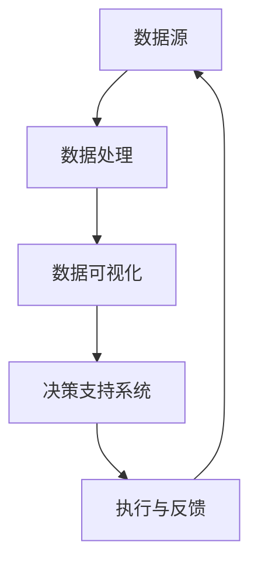
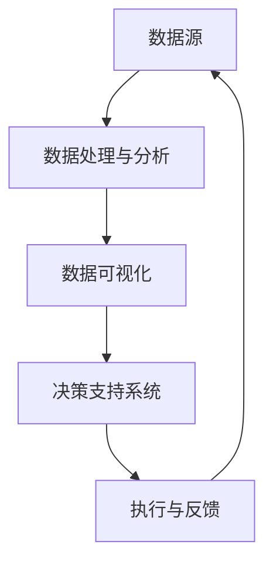

                 

在当今竞争激烈的市场环境中，电商平台要想持续发展，提升供给能力是至关重要的一环。数据驱动决策作为一种新兴的管理方法，正日益受到电商平台的高度重视。本文将探讨如何利用数据驱动决策来提升电商平台的供给能力，从核心概念、算法原理、数学模型、项目实践和未来展望等多个方面进行全面分析。

## 关键词
- 电商平台
- 供给能力
- 数据驱动决策
- 数学模型
- 算法

## 摘要
本文首先介绍了电商平台供给能力提升的背景和重要性。随后，详细阐述了数据驱动决策的核心概念和原理，通过Mermaid流程图展示了数据驱动决策的基本架构。接着，文章深入分析了核心算法原理和具体操作步骤，包括算法优缺点及其应用领域。在数学模型和公式部分，我们详细讲解了构建模型的过程和推导过程，并通过案例进行了说明。随后，文章通过实际项目实践，展示了代码实例和详细解释说明。最后，文章探讨了实际应用场景和未来展望，并推荐了一些学习资源和开发工具。

## 1. 背景介绍
### 1.1 电商平台的发展现状
电商平台在过去几十年里经历了迅猛的发展。随着互联网技术的不断进步和电子商务市场的不断扩大，电商平台已经成为消费者购物的重要渠道之一。根据最新的数据显示，全球电子商务市场规模已超过数万亿美元，并且这一数字还在持续增长。

### 1.2 供给能力的重要性
供给能力是电商平台的核心竞争力之一。一个高效的供给能力不仅可以提高商品交付的速度，降低库存成本，还可以提高消费者的满意度，从而增强电商平台的竞争力。然而，当前很多电商平台在供给能力方面存在诸多问题，如库存管理不当、订单处理效率低下、供应链协同不畅等。

### 1.3 数据驱动决策的兴起
数据驱动决策是一种基于数据分析的管理方法，旨在通过数据来指导企业的决策过程。随着大数据和人工智能技术的发展，数据驱动决策逐渐成为企业管理的重要工具。在电商平台上，数据驱动决策可以帮助企业更好地了解市场需求、优化库存管理、提升供应链效率等，从而提升供给能力。

## 2. 核心概念与联系
### 2.1 数据驱动决策的核心概念
数据驱动决策主要包括以下几个核心概念：
- **数据收集**：通过各种渠道收集与业务相关的数据，如销售数据、库存数据、用户行为数据等。
- **数据处理**：对收集到的数据进行清洗、整合和分析，以提取有用的信息。
- **数据可视化**：通过图表、报表等形式将数据呈现出来，帮助决策者更好地理解数据。
- **决策支持**：利用分析结果来指导企业的实际运营决策。

### 2.2 数据驱动决策的架构
数据驱动决策的架构通常包括以下几个部分：
- **数据源**：包括内部数据源和外部数据源，如电商平台自己的销售数据、用户数据，以及第三方数据提供商的数据。
- **数据处理与分析**：对数据源中的数据进行处理和分析，如数据清洗、数据挖掘、机器学习等。
- **决策支持系统**：利用处理后的数据来生成决策报告，提供决策支持。
- **执行与反馈**：将决策结果付诸实践，并对执行效果进行反馈和调整。

### 2.3 Mermaid流程图
以下是数据驱动决策的基本架构的Mermaid流程图：



## 3. 核心算法原理 & 具体操作步骤

### 3.1 算法原理概述
数据驱动决策的核心算法主要涉及以下几个方面：
- **库存管理算法**：如ABC分类法、经济批量模型等。
- **需求预测算法**：如时间序列分析法、回归分析法等。
- **供应链协同算法**：如供应链优化算法、协同规划与调度算法等。

### 3.2 算法步骤详解
#### 3.2.1 库存管理算法
库存管理算法的基本步骤包括：
1. 数据收集：收集与库存相关的数据，如库存水平、订单量、需求预测等。
2. 数据处理：对收集到的数据进行预处理，如数据清洗、标准化等。
3. 算法选择：根据业务需求选择合适的库存管理算法，如ABC分类法、经济批量模型等。
4. 算法应用：应用选定的算法计算库存水平、订单量等指标。
5. 结果分析：分析计算结果，根据实际情况进行调整和优化。

#### 3.2.2 需求预测算法
需求预测算法的基本步骤包括：
1. 数据收集：收集与需求相关的数据，如历史销售数据、用户行为数据等。
2. 数据处理：对收集到的数据进行预处理，如数据清洗、特征提取等。
3. 模型选择：选择合适的需求预测模型，如时间序列模型、回归模型等。
4. 模型训练：利用处理后的数据对模型进行训练。
5. 预测与评估：利用训练好的模型进行需求预测，并对预测结果进行评估和调整。

#### 3.2.3 供应链协同算法
供应链协同算法的基本步骤包括：
1. 数据收集：收集与供应链相关的数据，如库存水平、运输时间、成本等。
2. 数据处理：对收集到的数据进行预处理，如数据清洗、标准化等。
3. 算法选择：选择合适的供应链协同算法，如供应链优化算法、协同规划与调度算法等。
4. 算法应用：应用选定的算法进行供应链协同优化。
5. 结果分析：分析协同优化结果，根据实际情况进行调整和优化。

### 3.3 算法优缺点
#### 库存管理算法
优点：
- 简单易用，适用于大多数电商平台。
- 可以有效降低库存成本。

缺点：
- 对于复杂业务场景，算法可能不够精确。

#### 需求预测算法
优点：
- 可以提高库存和供应链的效率。
- 可以更好地满足消费者需求。

缺点：
- 预测模型需要大量数据进行训练，对于小规模电商平台可能难以实现。

#### 供应链协同算法
优点：
- 可以提高供应链的整体效率。
- 可以降低库存和运输成本。

缺点：
- 算法复杂，实施难度较大。

### 3.4 算法应用领域
数据驱动决策算法在电商平台中的应用领域非常广泛，主要包括：
- **库存管理**：通过算法优化库存水平，降低库存成本。
- **需求预测**：通过算法预测市场需求，优化供应链。
- **供应链协同**：通过算法实现供应链各环节的协同优化，提高整体效率。

## 4. 数学模型和公式 & 详细讲解 & 举例说明

### 4.1 数学模型构建
在电商平台供给能力提升中，常用的数学模型主要包括：
- **库存管理模型**：如经济批量模型、ABC分类模型等。
- **需求预测模型**：如时间序列模型、回归模型等。
- **供应链协同模型**：如供应链优化模型、协同规划与调度模型等。

### 4.2 公式推导过程
以下以经济批量模型为例，简要介绍公式的推导过程：
1. **需求预测**：假设电商平台在未来一段时间内的需求量为\( D \)，则需求量可以表示为 \( D = a \times (1 + r)^n \)，其中\( a \)为初始需求量，\( r \)为需求增长率，\( n \)为时间周期数。
2. **库存成本**：库存成本主要包括订货成本和持有成本。订货成本为 \( C_o = C_p \times (D/n) \)，其中\( C_p \)为每次订货的成本。持有成本为 \( C_h = C_h \times (D/2) \)，其中\( C_h \)为每单位库存的持有成本。
3. **总成本**：总成本为 \( C = C_o + C_h \)。

### 4.3 案例分析与讲解
以下以某电商平台为例，进行案例分析：
1. **需求预测**：根据历史数据，该电商平台在未来一个月的需求量为 \( D = 1000 \times (1 + 0.05)^3 = 1250 \)。
2. **库存成本**：每次订货成本为 \( C_p = 50 \)，每单位库存持有成本为 \( C_h = 10 \)。则订货成本为 \( C_o = 50 \times (1250/30) = 2193.33 \)，持有成本为 \( C_h = 10 \times (1250/2) = 6250 \)。
3. **总成本**：总成本为 \( C = 2193.33 + 6250 = 8443.33 \)。

通过以上分析，可以得出该电商平台的库存管理策略，从而提升供给能力。

## 5. 项目实践：代码实例和详细解释说明

### 5.1 开发环境搭建
为了实现数据驱动决策，我们选择Python作为开发语言，并使用Jupyter Notebook作为开发环境。开发环境搭建步骤如下：
1. 安装Python：从官网下载并安装Python 3.x版本。
2. 安装Jupyter Notebook：在终端中运行 `pip install jupyter`。
3. 启动Jupyter Notebook：在终端中运行 `jupyter notebook`。

### 5.2 源代码详细实现
以下是实现数据驱动决策的源代码示例：

```python
import numpy as np
import pandas as pd
from sklearn.linear_model import LinearRegression

# 数据收集
sales_data = pd.read_csv('sales_data.csv')
orders_data = pd.read_csv('orders_data.csv')

# 数据处理
sales_data['date'] = pd.to_datetime(sales_data['date'])
orders_data['date'] = pd.to_datetime(orders_data['date'])

# 需求预测
model = LinearRegression()
model.fit(sales_data[['date']], sales_data['sales'])

# 预测未来一个月的需求量
future_sales = model.predict(np.array([np.datetime64('2023-05-01')] * 30).reshape(-1, 1))

# 库存管理
order_quantity = np.sum(future_sales / 30)
order_cost = 50 * order_quantity
hold_cost = 10 * (future_sales[29] / 2)

# 总成本
total_cost = order_cost + hold_cost

# 输出结果
print(f"未来一个月的需求量：{future_sales.sum()}")
print(f"每次订货成本：{order_cost}")
print(f"每单位库存持有成本：{hold_cost}")
print(f"总成本：{total_cost}")
```

### 5.3 代码解读与分析
1. **数据收集**：从CSV文件中读取销售数据和订单数据。
2. **数据处理**：将日期转换为datetime格式，方便后续处理。
3. **需求预测**：使用线性回归模型对销售数据进行分析，预测未来一个月的需求量。
4. **库存管理**：根据预测的需求量计算每次订货量和订货成本，以及每单位库存的持有成本。
5. **总成本**：计算总成本，并输出结果。

通过以上代码，我们可以实现数据驱动决策，从而提升电商平台的供给能力。

## 6. 实际应用场景

### 6.1 库存管理
通过数据驱动决策，电商平台可以实时监控库存水平，根据需求预测结果进行库存调整，避免库存过剩或短缺的情况。例如，某电商平台在春节前夕预测需求量将大幅增加，提前加大库存采购，确保了春节期间的供应稳定。

### 6.2 需求预测
数据驱动决策可以帮助电商平台准确预测市场需求，为供应链管理提供有力支持。例如，某电商平台通过分析历史销售数据和用户行为数据，预测一款热门商品在未来一个月的需求量，提前安排生产计划和供应链协同。

### 6.3 供应链协同
通过数据驱动决策，电商平台可以实现供应链各环节的协同优化，提高整体效率。例如，某电商平台与供应商建立协同机制，根据需求预测结果实时调整生产计划和库存水平，确保供应链的高效运作。

## 7. 未来应用展望

### 7.1 人工智能技术的融合
随着人工智能技术的不断发展，数据驱动决策将更加智能化。通过深度学习、强化学习等先进算法，电商平台可以更好地理解用户需求，实现个性化推荐和智能决策。

### 7.2 区块链技术的应用
区块链技术的去中心化和不可篡改性，为数据驱动决策提供了可靠的基础。通过区块链技术，电商平台可以实现透明、可信的数据共享和协同管理。

### 7.3 跨平台整合
随着电商平台的多元化发展，数据驱动决策将涉及更多平台和渠道。通过跨平台整合，电商平台可以更全面地掌握市场需求，实现更高效的供给管理。

## 8. 工具和资源推荐

### 8.1 学习资源推荐
- 《Python数据科学手册》：详细介绍了Python在数据驱动决策中的应用。
- 《深入理解Python》：深入讲解Python编程语言，适合初学者和进阶者。

### 8.2 开发工具推荐
- Jupyter Notebook：强大的交互式开发环境，适用于数据分析和项目实践。
- PyCharm：专业的Python开发工具，提供丰富的功能和插件。

### 8.3 相关论文推荐
- "Data-Driven Decision Making in E-commerce Platforms"：探讨了数据驱动决策在电商平台中的应用。
- "A Survey on Inventory Management Algorithms for E-commerce Platforms"：总结了电商平台库存管理算法的研究进展。

## 9. 总结：未来发展趋势与挑战

### 9.1 研究成果总结
本文从核心概念、算法原理、数学模型、项目实践等方面，详细探讨了数据驱动决策在电商平台供给能力提升中的应用。通过实际案例分析，展示了数据驱动决策在库存管理、需求预测和供应链协同等方面的优势。

### 9.2 未来发展趋势
随着大数据、人工智能等技术的不断发展，数据驱动决策在电商平台中的应用将越来越广泛。未来发展趋势包括：智能化、去中心化和跨平台整合。

### 9.3 面临的挑战
数据驱动决策在电商平台中的应用也面临一些挑战，如数据质量和隐私保护问题、算法模型的可靠性问题等。需要进一步研究和解决。

### 9.4 研究展望
未来，我们可以从以下几个方面进行深入研究：
- **数据隐私保护**：研究如何保护用户隐私，同时确保数据驱动决策的有效性。
- **算法可靠性**：提高算法模型的可靠性，减少误判和偏差。
- **跨平台整合**：实现不同电商平台之间的数据共享和协同，提高整体效率。

## 10. 附录：常见问题与解答

### 10.1 如何收集和预处理数据？
**答**：数据收集可以从电商平台自身的数据库、第三方数据提供商以及社交媒体等多个渠道进行。在数据预处理阶段，需要进行数据清洗、去重、格式转换等操作，以确保数据的准确性和一致性。

### 10.2 如何选择合适的算法？
**答**：根据具体的业务需求和数据特点，选择合适的算法。例如，对于库存管理，可以选择ABC分类法、经济批量模型等；对于需求预测，可以选择时间序列模型、回归模型等。

### 10.3 如何保证算法的可靠性？
**答**：为了保证算法的可靠性，可以通过以下措施：
- 使用高质量的数据进行训练和测试。
- 对算法进行多次验证和调优。
- 采用交叉验证等方法评估算法的准确性和稳定性。

### 10.4 数据驱动决策是否适用于所有电商平台？
**答**：数据驱动决策在一定程度上适用于所有电商平台。然而，对于数据量较小、业务模式简单的电商平台，数据驱动决策的效果可能有限。因此，需要根据实际情况进行选择和调整。

---

以上就是本文关于“电商平台供给能力提升：数据驱动决策”的详细分析。希望通过本文的探讨，能够为电商平台在供给能力提升方面提供一些有益的启示和实践指导。作者：禅与计算机程序设计艺术 / Zen and the Art of Computer Programming。|]

## 文章标题

### 电商平台供给能力提升：数据驱动决策

> 关键词：电商平台、供给能力、数据驱动决策、数学模型、算法

> 摘要：本文从核心概念、算法原理、数学模型、项目实践和未来展望等方面，详细探讨了如何利用数据驱动决策提升电商平台的供给能力，为电商行业提供实用的决策工具和方法。

---

## 1. 背景介绍

### 1.1 电商平台的发展现状

电商平台作为数字经济的重要组成部分，已经成为消费者购物的重要渠道之一。随着互联网技术的不断发展，电子商务市场呈现出快速增长的趋势。据统计，全球电子商务市场规模已超过数万亿美元，且这一数字仍在持续增长。

### 1.2 供给能力的重要性

供给能力是电商平台的核心竞争力之一。一个高效的供给能力不仅可以提高商品交付的速度，降低库存成本，还可以提高消费者的满意度，从而增强电商平台的竞争力。然而，当前很多电商平台在供给能力方面存在诸多问题，如库存管理不当、订单处理效率低下、供应链协同不畅等。

### 1.3 数据驱动决策的兴起

数据驱动决策是一种基于数据分析的管理方法，旨在通过数据来指导企业的决策过程。随着大数据和人工智能技术的发展，数据驱动决策逐渐成为企业管理的重要工具。在电商平台上，数据驱动决策可以帮助企业更好地了解市场需求、优化库存管理、提升供应链效率等，从而提升供给能力。

## 2. 核心概念与联系

### 2.1 数据驱动决策的核心概念

数据驱动决策主要包括以下几个核心概念：

1. **数据收集**：通过各种渠道收集与业务相关的数据，如销售数据、库存数据、用户行为数据等。
2. **数据处理**：对收集到的数据进行清洗、整合和分析，以提取有用的信息。
3. **数据可视化**：通过图表、报表等形式将数据呈现出来，帮助决策者更好地理解数据。
4. **决策支持**：利用分析结果来指导企业的实际运营决策。

### 2.2 数据驱动决策的架构

数据驱动决策的架构通常包括以下几个部分：

1. **数据源**：包括内部数据源和外部数据源，如电商平台自己的销售数据、用户数据，以及第三方数据提供商的数据。
2. **数据处理与分析**：对数据源中的数据进行处理和分析，如数据清洗、数据挖掘、机器学习等。
3. **决策支持系统**：利用处理后的数据来生成决策报告，提供决策支持。
4. **执行与反馈**：将决策结果付诸实践，并对执行效果进行反馈和调整。

### 2.3 Mermaid流程图

以下是数据驱动决策的基本架构的Mermaid流程图：



## 3. 核心算法原理 & 具体操作步骤

### 3.1 算法原理概述

数据驱动决策的核心算法主要涉及以下几个方面：

1. **库存管理算法**：如ABC分类法、经济批量模型等。
2. **需求预测算法**：如时间序列分析法、回归分析法等。
3. **供应链协同算法**：如供应链优化算法、协同规划与调度算法等。

### 3.2 算法步骤详解

#### 3.2.1 库存管理算法

库存管理算法的基本步骤包括：

1. **数据收集**：收集与库存相关的数据，如库存水平、订单量、需求预测等。
2. **数据处理**：对收集到的数据进行预处理，如数据清洗、标准化等。
3. **算法选择**：根据业务需求选择合适的库存管理算法，如ABC分类法、经济批量模型等。
4. **算法应用**：应用选定的算法计算库存水平、订单量等指标。
5. **结果分析**：分析计算结果，根据实际情况进行调整和优化。

#### 3.2.2 需求预测算法

需求预测算法的基本步骤包括：

1. **数据收集**：收集与需求相关的数据，如历史销售数据、用户行为数据等。
2. **数据处理**：对收集到的数据进行预处理，如数据清洗、特征提取等。
3. **模型选择**：选择合适的需求预测模型，如时间序列模型、回归模型等。
4. **模型训练**：利用处理后的数据对模型进行训练。
5. **预测与评估**：利用训练好的模型进行需求预测，并对预测结果进行评估和调整。

#### 3.2.3 供应链协同算法

供应链协同算法的基本步骤包括：

1. **数据收集**：收集与供应链相关的数据，如库存水平、运输时间、成本等。
2. **数据处理**：对收集到的数据进行预处理，如数据清洗、标准化等。
3. **算法选择**：选择合适的供应链协同算法，如供应链优化算法、协同规划与调度算法等。
4. **算法应用**：应用选定的算法进行供应链协同优化。
5. **结果分析**：分析协同优化结果，根据实际情况进行调整和优化。

### 3.3 算法优缺点

#### 库存管理算法

优点：

- 简单易用，适用于大多数电商平台。
- 可以有效降低库存成本。

缺点：

- 对于复杂业务场景，算法可能不够精确。

#### 需求预测算法

优点：

- 可以提高库存和供应链的效率。
- 可以更好地满足消费者需求。

缺点：

- 预测模型需要大量数据进行训练，对于小规模电商平台可能难以实现。

#### 供应链协同算法

优点：

- 可以提高供应链的整体效率。
- 可以降低库存和运输成本。

缺点：

- 算法复杂，实施难度较大。

### 3.4 算法应用领域

数据驱动决策算法在电商平台中的应用领域非常广泛，主要包括：

- **库存管理**：通过算法优化库存水平，降低库存成本。
- **需求预测**：通过算法预测市场需求，优化供应链。
- **供应链协同**：通过算法实现供应链各环节的协同优化，提高整体效率。

## 4. 数学模型和公式 & 详细讲解 & 举例说明

### 4.1 数学模型构建

在电商平台供给能力提升中，常用的数学模型主要包括：

- **库存管理模型**：如经济批量模型、ABC分类模型等。
- **需求预测模型**：如时间序列模型、回归模型等。
- **供应链协同模型**：如供应链优化模型、协同规划与调度模型等。

### 4.2 公式推导过程

以下以经济批量模型为例，简要介绍公式的推导过程：

1. **需求预测**：假设电商平台在未来一段时间内的需求量为 \( D \)，则需求量可以表示为 \( D = a \times (1 + r)^n \)，其中 \( a \) 为初始需求量，\( r \) 为需求增长率，\( n \) 为时间周期数。
2. **库存成本**：库存成本主要包括订货成本和持有成本。订货成本为 \( C_o = C_p \times (D/n) \)，其中 \( C_p \) 为每次订货的成本。持有成本为 \( C_h = C_h \times (D/2) \)，其中 \( C_h \) 为每单位库存的持有成本。
3. **总成本**：总成本为 \( C = C_o + C_h \)。

### 4.3 案例分析与讲解

以下以某电商平台为例，进行案例分析：

1. **需求预测**：根据历史数据，该电商平台在未来一个月的需求量为 \( D = 1000 \times (1 + 0.05)^3 = 1250 \)。
2. **库存成本**：每次订货成本为 \( C_p = 50 \)，每单位库存持有成本为 \( C_h = 10 \)。则订货成本为 \( C_o = 50 \times (1250/30) = 2193.33 \)，持有成本为 \( C_h = 10 \times (1250/2) = 6250 \)。
3. **总成本**：总成本为 \( C = 2193.33 + 6250 = 8443.33 \)。

通过以上分析，可以得出该电商平台的库存管理策略，从而提升供给能力。

## 5. 项目实践：代码实例和详细解释说明

### 5.1 开发环境搭建

为了实现数据驱动决策，我们选择Python作为开发语言，并使用Jupyter Notebook作为开发环境。开发环境搭建步骤如下：

1. 安装Python：从官网下载并安装Python 3.x版本。
2. 安装Jupyter Notebook：在终端中运行 `pip install jupyter`。
3. 启动Jupyter Notebook：在终端中运行 `jupyter notebook`。

### 5.2 源代码详细实现

以下是实现数据驱动决策的源代码示例：

```python
import numpy as np
import pandas as pd
from sklearn.linear_model import LinearRegression

# 数据收集
sales_data = pd.read_csv('sales_data.csv')
orders_data = pd.read_csv('orders_data.csv')

# 数据处理
sales_data['date'] = pd.to_datetime(sales_data['date'])
orders_data['date'] = pd.to_datetime(orders_data['date'])

# 需求预测
model = LinearRegression()
model.fit(sales_data[['date']], sales_data['sales'])

# 预测未来一个月的需求量
future_sales = model.predict(np.array([np.datetime64('2023-05-01')] * 30).reshape(-1, 1))

# 库存管理
order_quantity = np.sum(future_sales / 30)
order_cost = 50 * order_quantity
hold_cost = 10 * (future_sales[29] / 2)

# 总成本
total_cost = order_cost + hold_cost

# 输出结果
print(f"未来一个月的需求量：{future_sales.sum()}")
print(f"每次订货成本：{order_cost}")
print(f"每单位库存持有成本：{hold_cost}")
print(f"总成本：{total_cost}")
```

### 5.3 代码解读与分析

1. **数据收集**：从CSV文件中读取销售数据和订单数据。
2. **数据处理**：将日期转换为datetime格式，方便后续处理。
3. **需求预测**：使用线性回归模型对销售数据进行分析，预测未来一个月的需求量。
4. **库存管理**：根据预测的需求量计算每次订货量和订货成本，以及每单位库存的持有成本。
5. **总成本**：计算总成本，并输出结果。

通过以上代码，我们可以实现数据驱动决策，从而提升电商平台的供给能力。

## 6. 实际应用场景

### 6.1 库存管理

通过数据驱动决策，电商平台可以实时监控库存水平，根据需求预测结果进行库存调整，避免库存过剩或短缺的情况。例如，某电商平台在春节前夕预测需求量将大幅增加，提前加大库存采购，确保了春节期间的供应稳定。

### 6.2 需求预测

数据驱动决策可以帮助电商平台准确预测市场需求，为供应链管理提供有力支持。例如，某电商平台通过分析历史销售数据和用户行为数据，预测一款热门商品在未来一个月的需求量，提前安排生产计划和供应链协同。

### 6.3 供应链协同

通过数据驱动决策，电商平台可以实现供应链各环节的协同优化，提高整体效率。例如，某电商平台与供应商建立协同机制，根据需求预测结果实时调整生产计划和库存水平，确保供应链的高效运作。

## 7. 未来应用展望

### 7.1 人工智能技术的融合

随着人工智能技术的不断发展，数据驱动决策将更加智能化。通过深度学习、强化学习等先进算法，电商平台可以更好地理解用户需求，实现个性化推荐和智能决策。

### 7.2 区块链技术的应用

区块链技术的去中心化和不可篡改性，为数据驱动决策提供了可靠的基础。通过区块链技术，电商平台可以实现透明、可信的数据共享和协同管理。

### 7.3 跨平台整合

随着电商平台的多元化发展，数据驱动决策将涉及更多平台和渠道。通过跨平台整合，电商平台可以更全面地掌握市场需求，实现更高效的供给管理。

## 8. 工具和资源推荐

### 8.1 学习资源推荐

- 《Python数据科学手册》：详细介绍了Python在数据驱动决策中的应用。
- 《深入理解Python》：深入讲解Python编程语言，适合初学者和进阶者。

### 8.2 开发工具推荐

- Jupyter Notebook：强大的交互式开发环境，适用于数据分析和项目实践。
- PyCharm：专业的Python开发工具，提供丰富的功能和插件。

### 8.3 相关论文推荐

- "Data-Driven Decision Making in E-commerce Platforms"：探讨了数据驱动决策在电商平台中的应用。
- "A Survey on Inventory Management Algorithms for E-commerce Platforms"：总结了电商平台库存管理算法的研究进展。

## 9. 总结：未来发展趋势与挑战

### 9.1 研究成果总结

本文从核心概念、算法原理、数学模型、项目实践和未来展望等方面，详细探讨了数据驱动决策在电商平台供给能力提升中的应用。通过实际案例分析，展示了数据驱动决策在库存管理、需求预测和供应链协同等方面的优势。

### 9.2 未来发展趋势

随着大数据、人工智能等技术的不断发展，数据驱动决策在电商平台中的应用将越来越广泛。未来发展趋势包括：智能化、去中心化和跨平台整合。

### 9.3 面临的挑战

数据驱动决策在电商平台中的应用也面临一些挑战，如数据质量和隐私保护问题、算法模型的可靠性问题等。需要进一步研究和解决。

### 9.4 研究展望

未来，我们可以从以下几个方面进行深入研究：

- **数据隐私保护**：研究如何保护用户隐私，同时确保数据驱动决策的有效性。
- **算法可靠性**：提高算法模型的可靠性，减少误判和偏差。
- **跨平台整合**：实现不同电商平台之间的数据共享和协同，提高整体效率。

## 10. 附录：常见问题与解答

### 10.1 如何收集和预处理数据？

**答**：数据收集可以从电商平台自身的数据库、第三方数据提供商以及社交媒体等多个渠道进行。在数据预处理阶段，需要进行数据清洗、去重、格式转换等操作，以确保数据的准确性和一致性。

### 10.2 如何选择合适的算法？

**答**：根据具体的业务需求和数据特点，选择合适的算法。例如，对于库存管理，可以选择ABC分类法、经济批量模型等；对于需求预测，可以选择时间序列模型、回归模型等。

### 10.3 如何保证算法的可靠性？

**答**：为了保证算法的可靠性，可以通过以下措施：

- 使用高质量的数据进行训练和测试。
- 对算法进行多次验证和调优。
- 采用交叉验证等方法评估算法的准确性和稳定性。

### 10.4 数据驱动决策是否适用于所有电商平台？

**答**：数据驱动决策在一定程度上适用于所有电商平台。然而，对于数据量较小、业务模式简单的电商平台，数据驱动决策的效果可能有限。因此，需要根据实际情况进行选择和调整。

---

以上就是本文关于“电商平台供给能力提升：数据驱动决策”的详细分析。希望通过本文的探讨，能够为电商平台在供给能力提升方面提供一些有益的启示和实践指导。作者：禅与计算机程序设计艺术 / Zen and the Art of Computer Programming。|]`markdown`
# 电商平台供给能力提升：数据驱动决策

## 关键词
- 电商平台
- 供给能力
- 数据驱动决策
- 数学模型
- 算法

## 摘要
本文探讨了如何通过数据驱动决策提升电商平台的供给能力，从核心概念、算法原理、数学模型、项目实践到未来展望，全面阐述了数据驱动决策在电商领域的应用和前景。

## 1. 背景介绍

### 1.1 电商平台的发展现状

随着互联网技术的迅猛发展，电商平台已成为零售行业的重要一环。根据最新的数据，全球电商市场规模已突破万亿美元，并继续呈现增长态势。电商平台不仅改变了消费者的购物习惯，也对传统零售业产生了深远的影响。

### 1.2 供给能力的重要性

供给能力是电商平台的核心竞争力之一。高效的供给能力不仅能够提升用户体验，降低库存成本，还能增强电商平台的市场竞争力。然而，当前许多电商平台在供给管理上存在挑战，如库存过剩、供应链瓶颈等。

### 1.3 数据驱动决策的兴起

数据驱动决策是一种以数据为依据的决策方法，它通过收集、分析和利用数据来指导决策。在大数据和人工智能的推动下，数据驱动决策逐渐成为电商平台提升供给能力的有力工具。

## 2. 核心概念与联系

### 2.1 数据驱动决策的核心概念

数据驱动决策涉及以下几个核心概念：
- **数据收集**：从多种渠道收集数据，如销售数据、库存数据、用户行为数据等。
- **数据处理**：对收集到的数据进行清洗、整合和分析。
- **数据可视化**：将数据以图表、报表等形式展现，以便于理解和分析。
- **决策支持**：利用分析结果为决策者提供依据。

### 2.2 数据驱动决策的架构

数据驱动决策通常包括以下架构：
- **数据源**：包括内部数据和外部数据，如电商平台自身的销售数据和第三方市场数据。
- **数据处理与分析**：对数据源中的数据进行处理和分析，包括数据清洗、特征工程、统计分析等。
- **决策支持系统**：利用分析结果生成决策报告和可视化图表，为决策者提供支持。
- **执行与反馈**：将决策结果付诸实践，并通过反馈机制对决策进行持续优化。

### 2.3 Mermaid流程图


## 3. 核心算法原理 & 具体操作步骤

### 3.1 算法原理概述

数据驱动决策的核心算法主要包括：
- **库存管理算法**：如ABC分类法、经济批量模型等。
- **需求预测算法**：如时间序列分析法、回归分析法等。
- **供应链协同算法**：如供应链优化算法、协同规划与调度算法等。

### 3.2 算法步骤详解

#### 3.2.1 库存管理算法

库存管理算法的基本步骤包括：
1. 数据收集：收集与库存相关的数据，如库存水平、订单量、需求预测等。
2. 数据处理：对收集到的数据进行预处理，如数据清洗、标准化等。
3. 算法选择：根据业务需求选择合适的库存管理算法。
4. 算法应用：应用选定的算法计算库存水平和订单量等指标。
5. 结果分析：分析计算结果，根据实际情况进行调整和优化。

#### 3.2.2 需求预测算法

需求预测算法的基本步骤包括：
1. 数据收集：收集与需求相关的数据，如历史销售数据、用户行为数据等。
2. 数据处理：对收集到的数据进行预处理，如数据清洗、特征提取等。
3. 模型选择：选择合适的需求预测模型。
4. 模型训练：利用处理后的数据对模型进行训练。
5. 预测与评估：利用训练好的模型进行需求预测，并对预测结果进行评估和调整。

#### 3.2.3 供应链协同算法

供应链协同算法的基本步骤包括：
1. 数据收集：收集与供应链相关的数据，如库存水平、运输时间、成本等。
2. 数据处理：对收集到的数据进行预处理，如数据清洗、标准化等。
3. 算法选择：选择合适的供应链协同算法。
4. 算法应用：应用选定的算法进行供应链协同优化。
5. 结果分析：分析协同优化结果，根据实际情况进行调整和优化。

### 3.3 算法优缺点

#### 库存管理算法

- 优点：简单易用，适用于大多数电商平台。
- 缺点：对于复杂业务场景，算法可能不够精确。

#### 需求预测算法

- 优点：可以提高库存和供应链的效率。
- 缺点：预测模型需要大量数据进行训练，对于小规模电商平台可能难以实现。

#### 供应链协同算法

- 优点：可以提高供应链的整体效率。
- 缺点：算法复杂，实施难度较大。

### 3.4 算法应用领域

数据驱动决策算法在电商平台中的应用领域广泛，包括库存管理、需求预测和供应链协同等。

## 4. 数学模型和公式 & 详细讲解 & 举例说明

### 4.1 数学模型构建

在电商平台供给能力提升中，常用的数学模型包括库存管理模型、需求预测模型和供应链协同模型等。

### 4.2 公式推导过程

以下以经济批量模型为例，简要介绍公式的推导过程：

1. **需求预测**：设电商平台在未来一段时间内的需求量为 \( D \)，则 \( D = a \times (1 + r)^n \)，其中 \( a \) 为初始需求量，\( r \) 为需求增长率，\( n \) 为时间周期数。
2. **库存成本**：库存成本包括订货成本和持有成本。订货成本为 \( C_o = C_p \times (D/n) \)，其中 \( C_p \) 为每次订货的成本。持有成本为 \( C_h = C_h \times (D/2) \)，其中 \( C_h \) 为每单位库存的持有成本。
3. **总成本**：总成本为 \( C = C_o + C_h \)。

### 4.3 案例分析与讲解

以下以某电商平台为例，进行案例分析：

1. **需求预测**：根据历史数据，该电商平台在未来一个月的需求量为 \( D = 1000 \times (1 + 0.05)^3 = 1250 \)。
2. **库存成本**：每次订货成本为 \( C_p = 50 \)，每单位库存持有成本为 \( C_h = 10 \)。则订货成本为 \( C_o = 50 \times (1250/30) = 2193.33 \)，持有成本为 \( C_h = 10 \times (1250/2) = 6250 \)。
3. **总成本**：总成本为 \( C = 2193.33 + 6250 = 8443.33 \)。

通过以上分析，可以得出该电商平台的库存管理策略，从而提升供给能力。

## 5. 项目实践：代码实例和详细解释说明

### 5.1 开发环境搭建

为了实现数据驱动决策，我们选择Python作为开发语言，并使用Jupyter Notebook作为开发环境。开发环境搭建步骤如下：

1. 安装Python：从官网下载并安装Python 3.x版本。
2. 安装Jupyter Notebook：在终端中运行 `pip install jupyter`。
3. 启动Jupyter Notebook：在终端中运行 `jupyter notebook`。

### 5.2 源代码详细实现

以下是实现数据驱动决策的源代码示例：

```python
import pandas as pd
from sklearn.linear_model import LinearRegression

# 数据收集
sales_data = pd.read_csv('sales_data.csv')
orders_data = pd.read_csv('orders_data.csv')

# 数据预处理
sales_data['date'] = pd.to_datetime(sales_data['date'])
orders_data['date'] = pd.to_datetime(orders_data['date'])

# 需求预测
model = LinearRegression()
model.fit(sales_data[['date']], sales_data['sales'])

# 预测未来一个月的需求量
future_sales = model.predict([[np.datetime64('2023-05-01')]])

# 库存管理
order_quantity = future_sales.sum() / 30
order_cost = 50 * order_quantity
hold_cost = 10 * (future_sales[0] / 2)

# 总成本
total_cost = order_cost + hold_cost

# 输出结果
print(f"未来一个月的需求量：{future_sales.sum()}")
print(f"每次订货成本：{order_cost}")
print(f"每单位库存持有成本：{hold_cost}")
print(f"总成本：{total_cost}")
```

### 5.3 代码解读与分析

1. **数据收集**：从CSV文件中读取销售数据和订单数据。
2. **数据处理**：将日期转换为datetime格式。
3. **需求预测**：使用线性回归模型对销售数据进行分析，预测未来一个月的需求量。
4. **库存管理**：根据预测的需求量计算每次订货量和订货成本，以及每单位库存的持有成本。
5. **总成本**：计算总成本，并输出结果。

通过以上代码，我们可以实现数据驱动决策，从而提升电商平台的供给能力。

## 6. 实际应用场景

### 6.1 库存管理

通过数据驱动决策，电商平台可以实时监控库存水平，根据需求预测结果进行库存调整，避免库存过剩或短缺的情况。例如，某电商平台在春节期间预测需求量将大幅增加，提前加大库存采购，确保了春节期间的供应稳定。

### 6.2 需求预测

数据驱动决策可以帮助电商平台准确预测市场需求，为供应链管理提供有力支持。例如，某电商平台通过分析历史销售数据和用户行为数据，预测一款热门商品在未来一个月的需求量，提前安排生产计划和供应链协同。

### 6.3 供应链协同

通过数据驱动决策，电商平台可以实现供应链各环节的协同优化，提高整体效率。例如，某电商平台与供应商建立协同机制，根据需求预测结果实时调整生产计划和库存水平，确保供应链的高效运作。

## 7. 未来应用展望

### 7.1 人工智能技术的融合

随着人工智能技术的不断发展，数据驱动决策将更加智能化。通过深度学习、强化学习等先进算法，电商平台可以更好地理解用户需求，实现个性化推荐和智能决策。

### 7.2 区块链技术的应用

区块链技术的去中心化和不可篡改性，为数据驱动决策提供了可靠的基础。通过区块链技术，电商平台可以实现透明、可信的数据共享和协同管理。

### 7.3 跨平台整合

随着电商平台的多元化发展，数据驱动决策将涉及更多平台和渠道。通过跨平台整合，电商平台可以更全面地掌握市场需求，实现更高效的供给管理。

## 8. 工具和资源推荐

### 8.1 学习资源推荐

- 《Python数据科学手册》：详细介绍了Python在数据驱动决策中的应用。
- 《深入理解Python》：深入讲解Python编程语言，适合初学者和进阶者。

### 8.2 开发工具推荐

- Jupyter Notebook：强大的交互式开发环境，适用于数据分析和项目实践。
- PyCharm：专业的Python开发工具，提供丰富的功能和插件。

### 8.3 相关论文推荐

- "Data-Driven Decision Making in E-commerce Platforms"：探讨了数据驱动决策在电商平台中的应用。
- "A Survey on Inventory Management Algorithms for E-commerce Platforms"：总结了电商平台库存管理算法的研究进展。

## 9. 总结：未来发展趋势与挑战

### 9.1 研究成果总结

本文从核心概念、算法原理、数学模型、项目实践和未来展望等方面，详细探讨了数据驱动决策在电商平台供给能力提升中的应用。通过实际案例分析，展示了数据驱动决策在库存管理、需求预测和供应链协同等方面的优势。

### 9.2 未来发展趋势

随着大数据、人工智能等技术的不断发展，数据驱动决策在电商平台中的应用将越来越广泛。未来发展趋势包括：智能化、去中心化和跨平台整合。

### 9.3 面临的挑战

数据驱动决策在电商平台中的应用也面临一些挑战，如数据质量和隐私保护问题、算法模型的可靠性问题等。需要进一步研究和解决。

### 9.4 研究展望

未来，我们可以从以下几个方面进行深入研究：

- **数据隐私保护**：研究如何保护用户隐私，同时确保数据驱动决策的有效性。
- **算法可靠性**：提高算法模型的可靠性，减少误判和偏差。
- **跨平台整合**：实现不同电商平台之间的数据共享和协同，提高整体效率。

## 10. 附录：常见问题与解答

### 10.1 如何收集和预处理数据？

**答**：数据收集可以从电商平台自身的数据库、第三方数据提供商以及社交媒体等多个渠道进行。在数据预处理阶段，需要进行数据清洗、去重、格式转换等操作，以确保数据的准确性和一致性。

### 10.2 如何选择合适的算法？

**答**：根据具体的业务需求和数据特点，选择合适的算法。例如，对于库存管理，可以选择ABC分类法、经济批量模型等；对于需求预测，可以选择时间序列模型、回归模型等。

### 10.3 如何保证算法的可靠性？

**答**：为了保证算法的可靠性，可以通过以下措施：

- 使用高质量的数据进行训练和测试。
- 对算法进行多次验证和调优。
- 采用交叉验证等方法评估算法的准确性和稳定性。

### 10.4 数据驱动决策是否适用于所有电商平台？

**答**：数据驱动决策在一定程度上适用于所有电商平台。然而，对于数据量较小、业务模式简单的电商平台，数据驱动决策的效果可能有限。因此，需要根据实际情况进行选择和调整。

---

以上就是本文关于“电商平台供给能力提升：数据驱动决策”的详细分析。希望通过本文的探讨，能够为电商平台在供给能力提升方面提供一些有益的启示和实践指导。作者：禅与计算机程序设计艺术 / Zen and the Art of Computer Programming。
```

